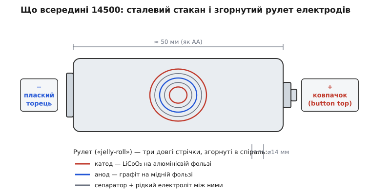
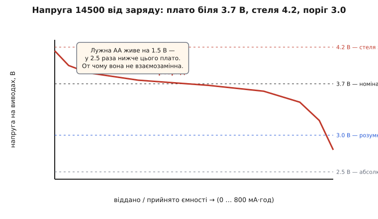

# Videx 14500 — Li-ion 3.7 В

<preknowlist>
- [Формати акумуляторних елементів](book:electronics/battery-formats) — звідки код «14500»: 14 мм діаметр, 50.0 мм довжина; чому це не назва хімії, а лише розмір банки.
- [Акумулятори](book:electronics/batteries) — що таке елемент, ємність у мА·год, номінальна напруга, заряд/розряд; базові поняття, на яких стоїть уся стаття.
- [Зарядка Li-ion](book:electronics/li-ion-charger) — метод CC-CV, стеля 4.2 В, чому літій не можна заряджати «як завгодно».
- [Захист акумулятора](book:electronics/battery-protection) — навіщо на літієвому елементі плата захисту (від перезаряду, переразряду, короткого); що означає «з протекцією» і «без».
</preknowlist>

У руці — циліндрик, схожий на звичайну пальчикову батарейку: та сама товщина, майже та сама довжина, той самий сріблястий метал під барвистою етикеткою. На етикетці — напис **Videx**, число **14500**, позначка **3.7 V** і ємність у мА·год. Виглядає як AA, лягає в гніздо AA — і саме тут ховається головна пастка цього виробу: **це не AA, і ставити його замість AA не можна**. Пальчикова лужна батарейка дає 1.5 вольта; цей елемент — 3.7, а зарядженим до країв — 4.2. Різниця більш ніж удвічі, і пристрій, розрахований на півтора вольта, від такої напруги переважно згорає.

А помилка тут коштує дорожче, ніж із будь-якою пальчиковою батарейкою: сплутати між собою дві лужні AA — дрібниця, а сплутати з ними літієвий елемент — це в кращому разі спалений пристрій, у гіршому — вогонь. Тому в цьому циліндрику важить кожна дрібниця, від напруги до міліметрів довжини.

### Що це таке і що означає «14500»

Число **14500** — це не марка й не хімія, а **розмір банки**, записаний за тим самим правилом, що й знамените 18650: перші дві цифри — діаметр у міліметрах, наступні — довжина в десятих частках міліметра. Отже **14500 = 14 мм у діаметрі, 50.0 мм завдовжки**. Пальчикова батарейка AA — 14.5 мм на 50.5 мм. Різниця в частки міліметра, тому 14500 і кладеться в тримач AA, ніби так і треба. Звідки саме беруться ці цифри й чому формат так кодують — окрема тема [про формати елементів](book:electronics/battery-formats); тут важливо лише те, що **код каже про габарит, а не про напругу**.

А напруга — інша, бо інша хімія. Усередині не сольовий чи лужний елемент на 1.5 В, а **літій-іонний акумулятор** (англ. *lithium-ion*), у якого номінальна напруга однієї банки — близько **3.7 вольта**. Це не збіг і не вибір виробника: 3.7 В — те, що дає пара електродів «графіт ↔ літій-кобальтовий оксид», на якій побудована переважна більшість таких елементів. Одна банка Li-ion фізично не буває «на 1.5 В»; хочете 1.5 — то це вже інша хімія в тому самому корпусі.

> 🔧 **Навіщо це.** Код формату й напруга — це **дві незалежні речі**, і плутати їх небезпечно саме тому, що очі бачать знайомий габарит AA й підказують «це така сама батарейка». Звичка «сіла батарейка — вставив нову пальчикову» тут вбивча: сріблястий циліндр 14 на 50 може бути і лужним на 1.5 В, і Ni-MH-акумулятором на 1.2 В, і оцим Li-ion на 3.7 В. Перше правило роботи з 14500: **дивитися не на форму, а на напис напруги**.

### Головна небезпека: форма AA, напруга подвійна

Спинімося на цьому окремо, бо це причина №1, чому 14500 узагалі згадують з осторогою. Уявімо пульт, ліхтарик чи дитячу іграшку, розраховані на дві пальчикові батарейки по 1.5 В — разом 3.0 В. Хтось бере два «схожих на AA» елементи 14500 і вставляє. Тепер на вхід приходить **2 × 4.2 = 8.4 вольта** замість очікуваних 3.0. Для електроніки, спроєктованої під три вольти, це різкий перевищений режим: світлодіоди спалахують надто яскраво й вигоряють, мікросхеми перегріваються, дешевий пристрій просто вмирає — інколи з димком.

```
Очікує пристрій на 2×AA:   1.5 + 1.5 = 3.0 В
Дає пара 14500 (повний):   4.2 + 4.2 = 8.4 В   ← у 2.8 раза більше
```

Ось чому в описі 14500 завжди пишуть «**лише для пристроїв, розрахованих на цей елемент**». Такі пристрої існують — це насамперед ліхтарі, спеціально зроблені під 14500 (вони дають помітно більше світла, ніж на пальчиковій батарейці), деякі лазери, вейпи, вимірювальні прилади. У них електроніка від початку чекає 3.7–4.2 В. Але **навмання підставляти 14500 «бо влазить» — прямий шлях спалити те, що працювало**.

Ця небезпека посилюється тим, що елемент **без захисту** (а саме такий продає Videx — про це нижче) не має жодного внутрішнього запобіжника, який би розірвав коло. Що прийшло на виводи, те й пішло далі, у повному обсязі.


*Усередині корпусу 14 на 50 мм — не «хімічний стакан», а туго згорнутий рулет із трьох довгих стрічок: катод (літій-кобальтовий оксид на алюмінії), анод (графіт на міді) й сепаратор між ними, просочений електролітом. Плаский торець — мінус, виступ-ковпачок — плюс. Той самий габарит, що в AA, ховає геть іншу хімію.*

### Що всередині й звідки 3.7 вольта

Якщо розкрити банку (робити цього не варто — електроліт горючий), усередині виявиться не рідина в стакані, а **щільно згорнутий рулет** (його так і називають — «jelly-roll», рулет із варенням): три довгі тонкі стрічки, накручені спіраллю. Перша — **катод**, тонкий шар літій-кобальтового оксиду (LiCoO₂) на алюмінієвій фользі. Друга — **анод**, шар графіту на мідній фользі. Третя, між ними, — **сепаратор**, пориста плівка, просочена рідким електролітом; вона не пускає електроди торкнутися напряму (це було б коротке замикання), але пропускає крізь себе іони літію.

Працює це так. Літій охоче віддає електрон. При розряді іони літію (Li⁺) виходять з графітового анода, пропливають крізь сепаратор і вбудовуються в кристалічну ґратку катода; а електрон, який літій відпустив, іде **зовнішнім колом** — через ліхтарик чи мотор — і робить там роботу. При заряді все навпаки: зовнішнє джерело заганяє електрони назад, іони літію повертаються в графіт. Різниця енергій між «літій у графіті» й «літій у кобальтовому оксиді» й задає ту саму напругу — близько 3.7 В у середньому по розряду. [Історія народження літій-іонного елемента](book:power/videx-14500/hist-lithium-ion.md) — окрема цікава сторінка про те, чому взагалі взялися за літій і хто довів цю хімію до безпечного, придатного для продажу вигляду.

> 🔧 **Навіщо це.** Розуміти рулет корисно, щоб не боятися і не робити дурниць. По-перше, стає ясно, чому **не можна протикати, м'яти чи гріти** елемент: досить пошкодити тонкий сепаратор — і катод торкнеться анода всередині, буде внутрішнє коротке, миттєвий розігрів і, у літію, займання. По-друге, ясно, чому ємність невелика: у банку 14 на 50 мм влазить лише коротка стрічка. У 14500 це типово **близько 700–1000 мА·год** — приблизно вчетверо менше, ніж у товстішого 18650. Формат обрали не за ємність, а за сумісність із габаритом AA.

### Конкретно Videx 14500: параметри

Тепер про саме цей продукт. Під маркою **Videx** український виробник (торгову марку Videx зареєстровано 2004 року компанією «Аллегро-ОПТ», штаб-квартира — у Кропивницькому; у ліхтарі та елементи живлення бренд активно ввійшов з 2014-го — статус: підтверджено за даними компанії) продає лінійку акумуляторів різних форматів. Версія 14500 у їхньому каталозі — це:

```
Формат:            14500 (⌀14 мм × 50 мм, розмір AA)
Хімія:             Li-ion (літій-іонний)
Номінальна напруга: 3.7 В
Напруга повного заряду: 4.2 В
Ємність:           ~800 мА·год
Виконання:         плаский плюс (flat top), БЕЗ плати захисту
Продаж:            поштучно / насипом (bulk)
```

Три деталі тут визначальні, і кожна має практичний наслідок.

**«800 мА·год».** Це запас енергії. Груба прикидка, скільки протримається навантаження:

**Умова: ліхтар тягне сталі 0.2 А (200 мА). Скільки світитиме від повного 14500 на 800 мА·год?**
```
час ≈ ємність / струм = 800 мА·год / 200 мА = 4 год

Але «до кінця» саджати літій шкідливо (див. поріг нижче),
тож реально знімають ~80 %:  4 год · 0.8 ≈ 3.2 год корисно.
```
Висновок: маленька банка — маленький запас; для ліхтарика на вечір годиться, для довгої автономії беруть 18650 чи більше.

**«Flat top» — плаский плюс.** У елемента плюсовий торець не має виступу-ковпачка, він урівень з корпусом. Це важить механічно: у деяких тримачах контакт-пружина впирається лише у виступ, і плаский елемент до неї не дістає — коло не замикається. Про виступ проти пласкої верхівки — трохи нижче.

**«Без захисту» (unprotected).** Це найважливіше. На елемент **не** напаяно крихітну плату, яка розриває коло при перезаряді, глибокому розряді чи короткому. Гола банка чесно віддає й приймає все, що їй нав'язали. Наслідок практичний: **весь захист має забезпечити пристрій або зарядка**, а не сам елемент. У ліхтарі, спроєктованому під 14500, така схема захисту зазвичай є. У саморобці на макетній платі її треба додати свідомо — інакше одна помилка (лишили на зарядці без контролю, закоротили викруткою) закінчується перегрівом і, у літію, вогнем.

### Напруга гуляє: від 4.2 до 3.0, і чому це важливо

Номінал «3.7 В» — це усереднення. Насправді напруга на виводах **весь час повзе** залежно від того, скільки заряду лишилося. Знати форму цієї кривої критично, бо саме вона диктує, як заряджати й коли зупинятися.


*Свіжозаряджений елемент стартує з 4.2 В, швидко просідає до ~3.8, далі довго тримає пологе плато біля 3.7 В — саме тому цю цифру звуть номінальною. Під кінець напруга різко валиться. Розряджати нижче ~3.0 В шкідливо, нижче 2.5 В — небезпечно для елемента. Для порівняння: лужна AA живе на 1.5 В — у 2.5 раза нижче цього плато.*

Три числа з цієї кривої треба тримати в голові:

- **4.2 В — стеля заряду.** Заряджати вище категорично не можна: літій-кобальтовий катод при перенапрузі стає нестабільним, гріється, у крайньому разі займається. Тому літій заряджають методом **CC-CV** — спершу сталим струмом, а на підході до 4.2 В переходять на сталу напругу й дають струму згаснути; докладно — у темі [про зарядку Li-ion](book:electronics/li-ion-charger). Заряджати 14500 «зарядкою для пальчикових Ni-MH» **не можна** — вона працює за іншим законом і легко перевищить 4.2 В.
- **3.7 В — номінал.** Довге плато, де елемент проводить більшу частину життя під навантаженням.
- **3.0 В — розумний поріг «стоп».** Нижче цієї позначки корисної енергії лишилось мало, а шкода зростає. Опустити банку **нижче 2.5 В** (глибокий розряд) — псує її незворотно: усередині починає рости мідь із анодної фольги, елемент втрачає ємність, а то й тихо замикається зсередини. У елемента **без захисту** ніщо не завадить пристрою висмоктати банку в нуль — тому за напругою мусить стежити або пристрій, або ви.

> 🔧 **Навіщо це.** Ця крива пояснює дві щоденні речі. Перша: **чому «індикатор заряду» на літії брехливий**, якщо міряти просто напругу, — на пологому плато 3.7 В елемент може бути і на 70 %, і на 40 % повноти, напруга майже не рухається. Тому серйозні пристрої рахують віддані міліампер-години, а не дивляться на вольтметр; це окрема тема — [скільки заряду лишилось](book:electronics/state-of-charge). Друга: **чому не можна саджати «в нуль»** — звичка від лужних батарейок «використати до останнього» на літії коштує здоров'я елемента.

### Захист: чому «без плати» — це відповідальність на вас

Повернімося до слова **unprotected**, бо воно визначає, як безпечно поводитися з цим конкретним Videx. Захищений (protected) літієвий елемент має на мінусовому торці приліплену **мікроскопічну плату** з польовими транзисторами-ключами. Вона стежить за напругою й струмом і **сама розриває коло**, якщо напруга полізла вище 4.2 В (перезаряд), впала нижче ~2.5 В (переразряд) або струм підскочив від короткого замикання. Це страхувальна сітка: навіть при помилці елемент рятує сам себе. Як саме влаштована ця плата й на яких порогах спрацьовує — у темі [про захист акумулятора](book:electronics/battery-protection).

Videx 14500 такої сітки **не має**. З цього випливає проста дисципліна:

- **Заряджати лише правильним літієвим зарядним пристроєм** з режимом CC-CV і стелею 4.2 В, і **не лишати без нагляду** там, де немає автовідсічки.
- **Не розряджати нижче ~3.0 В** — довіряти це або пристрою з відсічкою, або власному контролю.
- **Ніколи не замикати виводи** (у кишені з ключами, монетами) — гола банка віддасть у коротке величезний струм, розігріється за секунди. Це, до речі, спільна вимога до всіх літієвих елементів; чому саме літій так небезпечний у короткому й механічному пошкодженні — у темі [про механіку й безпеку акумуляторів](book:electronics/battery-mechanics).

Чи це погано, що елемент без захисту? Не обов'язково. У ліхтарі, зробленому під 14500, уся ця логіка вже вбудована в сам ліхтар, і плата на елементі була б зайвою (а ще додала б довжини — див. далі). Гола банка дешевша й коротша. Просто **відповідальність за режим переїжджає з елемента на пристрій**, і це треба тримати в голові.

### Куди влазить, а куди ні: плаский плюс і довжина

Механіка 14500 має два підводні камені, обидва — про контакт.

**Плаский плюс проти виступу.** Пальчикові батарейки роблять із маленьким **виступом-ковпачком** на плюсі. Деякі тримачі покладаються на цей виступ: плюсовий контакт у них — жорстка пластина або пружина, що дістає лише до виступу. Плаский плюс (flat top), як у Videx, до неї може не дотягнутися — і коло просто не замкнеться, пристрій «не побачить» елемент. Це не поломка, а невідповідність геометрії: у тримачах із пружиною на обох кінцях плаский елемент працює нормально, а в тих, що чекають на виступ, — ні.

**Довжина із захистом.** Тут цікавий наслідок попереднього розділу. Гола банка Videx — рівно ~50 мм, як AA. Але **захищений** 14500 (в інших виробників) довший: плата захисту на торці додає кілька міліметрів, і елемент виходить ~52–53 мм. У пристрій зі строгим гніздом «під AA» такий подовжений елемент може вже **не влізти**. Виходить парадокс: рекомендований для безпеки «елемент із захистом» фізично не заходить туди, куди легко заходить небезпечніша гола банка. Тому під конкретний ліхтар іноді свідомо беруть саме flat-top без захисту — бо захищений не поміститься.

```
Videx 14500 (flat top, без захисту):  ~50 мм  → як AA, влазить у строге гніздо
14500 із платою захисту (button top): ~52–53 мм → у строге гніздо може не зайти
Пальчикова AA (виступ):               ~50.5 мм
```

> 🔧 **Навіщо це.** Перш ніж купувати 14500 під конкретний пристрій, варто знати дві його вимоги: **виступ чи пласку верхівку** треба контакту, і **яку максимальну довжину** приймає відсік. Інакше легко взяти технічно кращий (захищений) елемент, який не влізе, або flat-top, до плюса якого не дістане пружина. Це найчастіша причина «купив 14500, а воно не працює» — не хімія, а міліметри.

### Чому цей елемент саме такий

Усі дивацтва Videx 14500 — подвоєна напруга, відсутня плата захисту, плаский плюс, довжина рівно як в AA — не випадковий набір хиб, а наслідки одного рішення: узяти літієву банку й ужати її в силует пальчикової батарейки, знявши все, що додало б хоч міліметр. Захист прибрали не з жадібності — плата подовжила б корпус, і елемент перестав би влазити в те саме гніздо AA, заради якого все й затівалося. Напруга подвоєна не через недогляд, а тому, що це літій, і в літію вона така. Плюс зробили пласким, бо так коротше. Кожна з осторог у цій статті — не окремий каприз виробника, а ціна за одну й ту саму річ.

І та річ — це знайома оболонка. Схожість із AA, з якої ми почали, — не пастка, у яку виробник ненароком заманив покупця, а власне суть виробу: ліхтар, спроєктований під 14500, купує за цю схожість удвічі більшу напругу й помітно більше світла, а платить тим, що весь нагляд за літієм — заряд до 4.2, поріг розряду, захист від короткого — переїжджає з елемента в сам ліхтар. Гола банка чесно віддає рівно те, що в неї вкладено; думати за неї має пристрій. Хто це тримає в голові, для того сріблястий циліндр 14 на 50 перестає бути пасткою й стає рівно тим, чим є, — щільно згорнутим рулетом літієвої енергії у звичному з дитинства корпусі.
