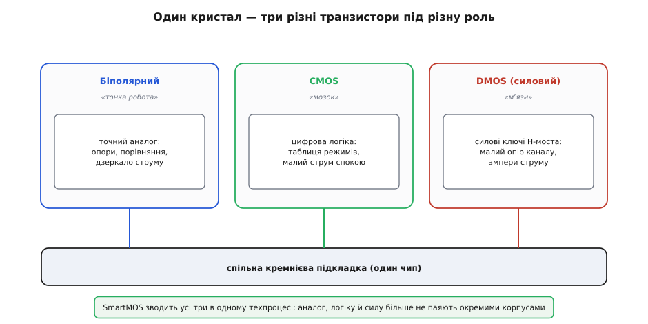
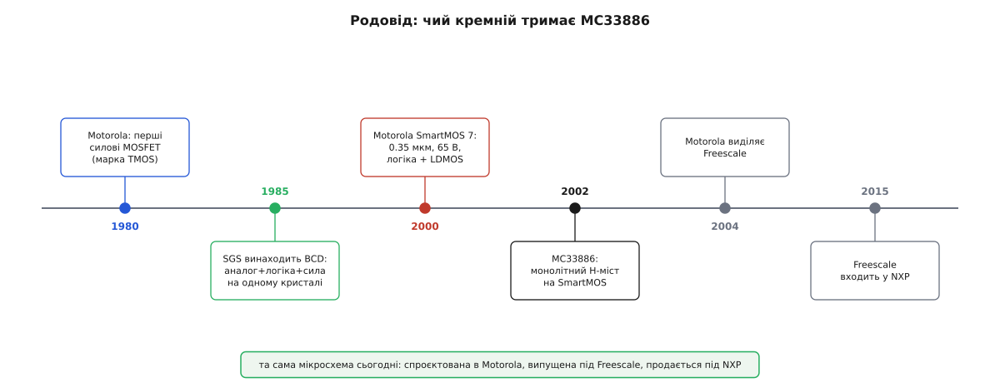

# 📜 Як силу навчили жити поруч із розумом: історія «розумного» кремнію під MC33886

Візьміть будь-який старий підручник з електроніки й ви наткнетеся на тверде, майже кастове розділення. З одного боку — **силова електроніка**: тиристори, потужні транзистори, діоди на радіаторах, що комутують ампери й кіловольти, гріються й вимагають окремих корпусів. З іншого — **логіка**: крихітні кремнієві мозки, що працюють на мілівольтах і мікроамперах, бояться перегріву й перенапруги, живуть на своїй платі. Між цими двома світами лежала прірва, і будь-яка машинка, що мала й «думати», і «крутити мотор», змушена була тримати обидва світи окремо: контролер тут, силові ключі там, а між ними — жмут дротів.

MC33886 — це маленьке спростування тієї прірви. Усередині її єдиного кристала силові MOSFET-ключі, здатні гнати п'ять ампер, живуть **упритул** до цифрової логіки, що ними керує, до аналогових вузлів, що міряють струм, і до заряд-помпи, що піднімає напругу для відкривання верхніх плечей. Сила й розум сидять на одному шматочку кремнію, розміром з нігтик, і не заважають одне одному. Питання, яке варте окремої розмови: **як так вийшло?** Чому те, що десятиліттями вимагало двох різних технологій і двох різних корпусів, раптом стало вміщатися в один? І хто саме навчив кремній цьому фокусу?

Це історія не про одну мікросхему, а про цілий клас — **інтегровані силові схеми** (англ. *smart power*, «розумна сила»), — і про кілька компаній, що незалежно й майже одночасно намацали, як зшити несумісне. MC33886 тут — не піонер, а зрілий, добротний плід тієї роботи. Але щоб зрозуміти, що робить її ключі «розумними», варто пройти шлях від самого початку.

<preknowlist>
- [MOSFET як ключ](book:electronics/mosfet-switch) — польовий транзистор у ролі вимикача з малим опором відкритого каналу; уся розмова тут крутиться навколо того, як такий ключ поселили поруч із логікою.
- [H-міст](book:electronics/h-bridge) — чотири ключі, що дають мотору обертатися в обидва боки; саме його «розумну» інтегровану версію ми й простежуємо.
</preknowlist>

## Дві несумісні вдачі кремнію

Щоб оцінити, наскільки непростим був цей шлюб, треба відчути, чому силу й логіку так довго не могли поселити разом. Це не забаганка інженерів і не брак старань — це різні, майже ворожі вимоги до самої структури транзистора.

**Логіці** потрібні транзистори маленькі, щільні й ощадливі. Цифрова схема — це мільйони перемикачів, і кожен має займати крихту площі, майже не споживати струм у спокої й перемикатися швидко на низькій напрузі (одиниці вольтів). Ідеальний тут — **CMOS** (англ. *complementary metal-oxide-semiconductor*), пара з польових транзисторів різної провідності, що в статиці не тягне майже нічого. На CMOS збудований увесь цифровий світ саме тому, що він холодний і щільний.

**Силі** потрібне протилежне. Силовий транзистор має витримувати десятки, а то й сотні вольтів між замкненими станами, пропускати крізь себе великий струм із якнайменшим опором (щоб не перетворюватися на грубку) і швидко зливати тепло. Такий транзистор — фізично **великий**: широкий канал заради малого опору, товсті шари заради високої напруги. Це вже не CMOS-мікроб, а **DMOS** (англ. *double-diffused MOS*, «двічі дифундований») — силовий польовий транзистор, у якому струм тече не вздовж поверхні, а **вертикально крізь товщу кристала**, від верхнього контакту вниз до підкладки. Вертикальний хід дає широке перерізом коло для струму на малій площі поверхні — саме те, що треба силі.

І ось перша стіна. CMOS-логіка збудована на **поверхні** кристала, тонким шаром; вертикальний силовий DMOS хоче використати **всю товщу** й нижній контакт як стік. Поставити їх поряд — означає, що силовий транзистор своїм вертикальним струмом «протикає» підкладку, спільну з логікою, і наводить у ній перешкоди, зсуви потенціалу, паразитні шляхи. Логіка починає збоїти від сусіда, що поруч комутує ампери. Це як просити тихого бібліотекаря й коваля з горном працювати за одним столом.

Була й третя вдача, потрібна для **точного аналогу** — вимірювання струмів, опорних напруг, порівняння. Тут королем довго лишався **біполярний** транзистор: він дає кращу точність зіставлення, тихіші опорні джерела, передбачуваніші характеристики, ніж ранній CMOS. Тож насправді світів було не два, а **три** — біполярний аналог, CMOS-логіка й DMOS-сила, — і кожен тягнув структуру кристала у свій бік.


*Біполярний вузол — для точного аналогу (опорні напруги, дзеркало струму), CMOS — для холодної щільної логіки, DMOS — для силових ключів на ампери. Кожна «сім'я» хоче свого від кремнію; мистецтво «розумної сили» — змусити всі три ужитися на одній підкладці.*

> 🔧 **Навіщо це.** Саме звідси росте вся цінність такої мікросхеми, як MC33886. Її ключі — це DMOS-«м'язи», таблиця режимів і логіка входів — це CMOS-«мозок», а дзеркало струму на виводі `FB` (крихітна точна копія струму мотора) — це біполярно-аналогова «тонка робота». Три вдачі, які колись жили в трьох окремих корпусах, тут зведені в один. Кожна пастка підключення й кожне обмеження чипа — це відлуння того, як інженери мирили ці три вдачі на спільному кристалі.

## Спершу — окремі королівства

Перш ніж зшивати, кожне з королівств треба було довести до сили поодинці. І тут, у 1970-х, головна дія розгорталася навколо силового боку.

Довгий час силовим ключем був **біполярний** транзистор, але він мав прикру ваду: щоб тримати його відкритим, у базу треба безперервно вганяти чималий струм, а сам він на великому струмі падав помітну напругу й ризикував **тепловою втечею** (нагрівся — потік більше — нагрівся ще). Прорив приніс **силовий MOSFET**: польовий ключ, що керується напругою на затворі, майже не тягнучи струму, і чий опір у відкритому стані можна зробити дуже малим. Це вже не «підкачувати базу», а просто подати напругу — і канал відкритий.

Тут варто назвати імена. Комерційний силовий MOSFET у сучасному вигляді народився зусиллями кількох гравців наприкінці 1970-х; серед них **International Rectifier** зі своєю маркою **HEXFET** і японська **Hitachi**. А **Motorola** — американська компанія, чий напівпровідниковий підрозділ був одним із велетнів галузі, — вивела свої перші силові MOSFET на ринок **близько 1980 року** під маркою **TMOS**, і вже до **1984-го** її каталог налічував понад **225** типів таких приладів у одинадцятьох корпусах. Це важлива деталь: Motorola володіла **власним, зрілим DMOS-виробництвом** силових ключів. Тримайте це в голові — саме цей багаж згодом дасть їй змогу класти силові MOSFET на один кристал з логікою.

> Статус доказовості: те, що Motorola вивела силові MOSFET під маркою TMOS близько 1980 року й мала широку лінійку до 1984-го, підтверджено її ж друкованими даташит-збірниками того часу (databook DL135, 1984). Точний «перший у світі силовий MOSFET» — питання спірне й розсіяне між кількома компаніями; тут MC33886-історія цього не потребує, тож обмежимося певним: до 1980-х DMOS-сила була в Motorola налагоджена.

Паралельно достигав і другий бік — **монолітні драйвери** для моторів. Ще до всякої «розумної сили» європейська **SGS** (італійська компанія, що згодом стала SGS-Thomson, а нині — **STMicroelectronics**) випустила славнозвісні мостові драйвери **L293** та **L298**: перші широко вживані мікросхеми, що вміщали цілий H-міст (а L298 — навіть два) в одному корпусі. Це був справжній прорив зручності — але зроблений на **біполярній** технології. Ключами там були дарлінгтонові біполярні транзистори, а вони мають прикру рису: у відкритому стані на них падає чимало напруги (сумарно на верхньому й нижньому плечі — вольта два-три), тобто вони гріються й марнують живлення; а ще L293 узагалі вимагав **зовнішніх гасильних діодів** проти індуктивного викиду мотора (лише пізніший L293**D** отримав діоди всередині).

Ось де ключова відмінність від майбутнього. L298 був **монолітним**, але **біполярним** — сила й трохи логіки на одному кристалі, проте ключі «дорогі» за напругою й гарячі. Уся дальша історія «розумної сили» — це, по суті, заміна цих біполярних дарлінгтонів на **DMOS-ключі з малим опором** плюс додавання поряд повноцінної CMOS-логіки й захисту. MC33886 — прямий спадкоємець ідеї L298, але вже на іншому, «холоднішому» й розумнішому фундаменті.

> Статус доказовості: авторство L293/L298 за SGS/SGS-Thomson (нині STMicroelectronics) і їхня біполярна природа — підтверджено даташитами й аплікаційними нотатками ST (зокрема AN240 про монолітні мостові драйвери). Точний рік першого випуску цих мікросхем у відкритих джерелах подають розмито (кінець 1970-х — початок 1980-х), тож наводжу лише певне: вони — біполярні монолітні попередники MOSFET-драйверів.

## Хто перший зшив: BCD родом із Європи

Тепер — до головного винаходу, того, що зробив «розумну силу» можливою по-справжньому. І тут поширений міф варто одразу спростувати: **не Motorola й не SmartMOS були першими** в самій ідеї звести аналог, логіку й силу на одному кристалі.

Першою була та сама **SGS** (згодом SGS-Thomson, нині STMicroelectronics). **1985 року** вона винайшла техпроцес під назвою **BCD** — за трьома його складниками: **B**ipolar (біполярний аналог), **C**MOS (цифрова логіка) і **D**MOS (силові ключі). Це й був той самий шлюб трьох вдач: BCD дав змогу на одній підкладці мати точний біполярний аналог, щільну CMOS-логіку **й** силові DMOS-транзистори з високою напругою пробою та малим опором каналу. Революційність була саме в цьому «і…і…і» — не «або точний аналог, або сила», а все разом, керовано, на одному кристалі.

> 🔧 **Навіщо це.** Абревіатура BCD пояснює, чому три літери — не випадковість. Кожна відповідає одній із трьох вдач кремнію з попередньої фігури: **B** — тонка робота (дзеркало струму на `FB`), **C** — мозок (логіка входів `IN1`/`IN2`), **D** — м'язи (силові ключі мосту). Коли ви бачите, що MC33886 одночасно й міряє струм, і слухає логіку, і жене ампери, — це працює саме той принцип «трьох в одному», що його SGS уперше звела в 1985-му.

Чому так важливо не приписати цей винахід не тим? Бо історія техніки любить стягуватися до одного гучного імені й однієї країни, а насправді проривні технології майже завжди **колективні й розсіяні**. BCD від SGS-Thomson, «розумна сила» від Philips, японські напрацювання, американський SmartMOS від Motorola — усе це росло **паралельно** наприкінці 1980-х — у 1990-х, підживлюючи одне одного через конференції, патенти й переманених інженерів. Сказати «Motorola винайшла інтегрований силовий чип» було б так само неточно, як сказати, що радіо винайшов єдиний чоловік. Правильніше: **SGS-Thomson першою назвала й закріпила BCD-підхід (1985)**, а далі кілька компаній, кожна зі своїм ім'ям для процесу, довели його до масового виробництва.

> Статус доказовості: авторство BCD за SGS (нині STMicroelectronics) і рік 1985 — усталений факт, зафіксований у профільних довідниках з напівпровідникових процесів і в матеріалах самої ST про історію технології. Це найтвердіша дата в усій цій розповіді.

## SmartMOS: як Motorola назвала свій шлюб кремнію

А що ж MC33886 та її рід? Вони зроблені на **SmartMOS** — так **Motorola** назвала свою власну лінію «розумної сили». Ідея та сама, що й у BCD (аналог + логіка + сила на одному кристалі), але з характерним для Motorola наголосом: вона прийшла до цього шлюбу **з боку сили**, спираючись на своє зріле DMOS-виробництво тих самих TMOS-транзисторів.

У SmartMOS силовим елементом став не вертикальний, а **бічний (латеральний) DMOS** — **LDMOS** (англ. *lateral DMOS*), у якого й стік, і витік, і затвор винесені на **поверхню** кристала. Це поступка заради миру з логікою: латеральний ключ не «протикає» підкладку вертикальним струмом наскрізь, а тримає весь струм у приповерхневому шарі — поряд, на тій самій площині, де живе CMOS. Ціна — LDMOS на однаковій площі зазвичай має більший опір, ніж вертикальний, — але виграш у тому, що його **можна поставити впритул до логіки** без взаємних перешкод. Саме цей компроміс і дозволив звести повноцінний драйвер в один кристал.

SmartMOS ішов поколіннями, і їхні номери — це, по суті, літопис здрібнення й підвищення напруги:

```
Покоління    Топ-норма     Робоча напруга   Що це дало
────────────────────────────────────────────────────────────────────
SmartMOS 5   0.8 мкм        десятки В        база: логіка + LDMOS поряд
SmartMOS 7   0.35 мкм       до ~65 В         ×8 щільніша цифра, ніж у SM5
SmartMOS 8MV 0.25 мкм       до ~90 В         ще щільніша логіка + вища напруга
```

**SmartMOS 7** Motorola оприлюднила в **червні 2000 року** на профільній конференції ISPSD в Тулузі (Франція): 0.35-мікронна «розумна сила» з пробоєм близько 65 вольтів і **у вісім разів** щільнішою цифровою частиною, ніж у 0.8-мікронного **SmartMOS 5**. Наголос був на автомобільній електроніці, керуванні моторами й аудіопідсилювачах — тобто саме на тих задачах, де в одному чипі треба і думати, і гнати струм. Пізніший **SmartMOS 8MV** (medium voltage) підняв стелю до ~90 В на 0.25-мікронній логіці.

> 🔧 **Навіщо це.** MC33886 — типовий представник саме цієї родини й цієї філософії. Її робочий діапазон 5–28 В і піковий струм 5 А лягають рівно в «серединну напругу» SmartMOS; її чотири LDMOS-ключі з опором 120 мілі-Ом — це ті самі латеральні силові транзистори, що їх покоління за поколінням училися ставити поряд із логікою; а вбудовані захист і заряд-помпа — це та «розумна» аналого-цифрова обв'язка, заради якої весь шлюб і затівався. Коли на даташиті MC33886 написано «powered by SMARTMOS technology», це і є пряме посилання на цю лінію.

> Статус доказовості: покоління SmartMOS (5/7/8), норма 0.35 мкм і 65 В для SmartMOS 7, ×8 щільність відносно SmartMOS 5, оприлюднення в червні 2000 на ISPSD у Тулузі — усе це з тогочасних галузевих видань (EE Times, EDN, Electronic Design). Дати й цифри тверді; поділ поколінь спрощено заради ясності.

## Що саме поклали в один кристал — і навіщо

Тепер, знаючи родовід, легше побачити, **чому** інтеграція варта заходу — і що конкретно вона зводить докупи. Бо «покласти все в один чип» — не самоціль; кожен вузол усередині розв'язує задачу, яку в дискретній схемі довелося б розв'язувати окремою деталлю й окремим болем.

**Силові ключі (LDMOS-міст).** Серце — чотири латеральні DMOS-ключі, зібрані в H-міст. У дискретному варіанті це чотири окремі силові транзистори на платі, кожен зі своїм тепловідводом і розводкою. Тут вони — на одному кристалі, узгоджені між собою за характеристиками, і несуть **вбудовані діоди тіла** (body diode), що самі приймають індуктивний викид мотора. Ось чому MC33886 не потребує зовнішніх гасильних діодів: чотири body-діоди чотирьох ключів уже утворюють готовий гасильний місток — те, чого не було в біполярному L293 і за брак чого горіли саморобні мости.

**Драйвери затворів + заряд-помпа.** Щоб відкрити **верхній** ключ мосту, на його затвор треба напруга **вища за плюс живлення** — а її в системі немає. У дискретному мості під це ставлять окрему мікросхему-драйвер із бутстреп-конденсатором або зовнішню помпу. SmartMOS кладе **заряд-помпу прямо на кристал**: маленький перетворювач, що перекидає заряд конденсаторами й накачує потрібну підвищену напругу сам. Назовні лишається хіба вивід `CCP` під зовнішній конденсатор помпи — і той на готовому модулі вже впаяний.

**Логіка керування.** Крихітна CMOS-схема, що приймає входи `IN1`, `IN2`, `EN` і вирішує, які плечі відкрити. У розсипу це був би окремий логічний чип між контролером і драйверами. Тут — той самий кристал: «мозок» і «м'язи» під одним дахом, без дротів між ними.

**Захист.** І те, що найкраще виправдовує слово «розумна». MC33886 сама стежить за перегрівом, коротким замиканням і просадкою живлення, і, спіймавши будь-яку біду, миттєво глушить усі ключі й піднімає прапорець `FS`. У дискретній схемі це — окремі компаратори, датчики, логіка вимкнення, ще жменя деталей і ще один шанс помилитися. Зведення захисту на кристал поряд із силою — саме те, чого біполярні монолітні предки на кшталт L298 майже не вміли, а «розумна сила» зробила нормою.


*Дві незалежні лінії сходяться в цій мікросхемі: силова (перші DMOS-ключі Motorola, 1980) і сама ідея «трьох в одному» (BCD від SGS, 1985). SmartMOS 7 (2000) звів логіку з LDMOS у зрілий техпроцес; MC33886 (2002) — його добротний плід. Далі мінялися лише вивіски компанії: Motorola → Freescale → NXP.*

Складіть це разом — і побачите, чому одна мікросхема замінює цілу жменю деталей на платі. Чотири силові ключі, чотири драйвери їхніх затворів, заряд-помпа, тепловий і струмовий захист, дзеркало струму — усе, що інакше жило б окремими корпусами й окремими дротами, тут зведене на один шматочок кремнію й наперед випробуване. Вам лишається дати три логічні сигнали й два живлення. Оце й є практична винагорода за той непростий шлюб трьох вдач кремнію.

## Мінялися вивіски, кремній лишався

Лишилося замкнути родовід самої компанії — бо на даташиті MC33886 за двадцять із лишком років устигли побувати аж **три різні імена**, і це збиває з пантелику новачка, що бачить то «Motorola», то «Freescale», то «NXP».

Хронологія тут тверда й документована. Мікросхему **спроєктувала й вивела Motorola**: найраніший даташит несе копірайт **© Motorola, Inc. 2002** (порядковий MC33886/D, редакція 2, грудень 2002). Тобто саме Motorola народила цей чип на своєму SmartMOS.

Далі — корпоративні переділи, що самого кремнію не торкнулися. У жовтні 2003-го Motorola оголосила про виділення напівпровідникового підрозділу; **16 липня 2004 року** він став окремою публічною компанією **Freescale Semiconductor** (первинне розміщення акцій по 13 доларів). MC33886, як і тисячі інших приладів, просто переїхала під нову вивіску — з тим самим кристалом і тим самим даташитом, лише зі зміненим логотипом на титулі.

Ще один переділ — **7 грудня 2015 року** Freescale **влилася в NXP Semiconductors** (нідерландську компанію, що сама колись відкололася від Philips), утворивши гіганта вартістю близько 40 мільярдів доларів. Відтоді MC33886 продається під маркою **NXP** — і це вже третє ім'я на тому самому чипі. Пізні редакції даташита (остання — початок 2014-го, ще під Freescale) несуть саме цей спадок.

> 🔧 **Навіщо це.** Практичний висновок простий: **«Motorola MC33886», «Freescale MC33886» і «NXP MC33886» — це одна й та сама мікросхема**, і плутати їх не треба. Купуючи модуль CJMCU, ви можете натрапити на чип із будь-яким із трьох логотипів залежно від року випуску партії — усі вони сумісні, з тим самим SmartMOS-кристалом усередині. Змінювалися власники бренду, а не кремній.

> Статус доказовості: дати корпоративної історії — виділення Freescale (IPO 16 липня 2004), злиття з NXP (закрито 7 грудня 2015) — і копірайт «© Motorola, Inc. 2002» на першому даташиті MC33886 підтверджені корпоративними джерелами й самим документом. Це надійно задокументована частина розповіді.

## Що з цього винести

Прірва між «силою» і «розумом» у кремнії була справжня й глибока: логіка хоче холодних щільних CMOS-транзисторів, сила — великих гарячих DMOS-ключів, точний аналог — біполярних вузлів, і кожна вдача тягне структуру кристала у свій бік. Мистецтво **«розумної сили»** — змусити всі три ужитися на одній підкладці, і головний винахід тут зробила **SGS-Thomson (нині STMicroelectronics) 1985 року**, назвавши підхід **BCD** (Bipolar-CMOS-DMOS). Це, а не пізніші фірмові імена, — справжня точка народження класу.

**Motorola** прийшла до того самого шлюбу зі свого боку — з боку зрілого DMOS-виробництва силових MOSFET (марка TMOS, з ~1980) — і назвала свою лінію **SmartMOS**, поставивши силовий **LDMOS** на поверхню поряд із логікою. Покоління SmartMOS (5 → 7 → 2000 рік, 0.35 мкм, 65 В → 8MV) поступово ущільнювали логіку й піднімали напругу.

**MC33886** — не піонер, а зрілий плід цієї роботи: монолітний H-міст на SmartMOS, де LDMOS-ключі з опором 120 мілі-Ом, їхні драйвери, заряд-помпа, тепловий і струмовий захист та дзеркало струму зведені в один кристал. Саме ця інтеграція й робить її ключі «розумними», а зовнішні гасильні діоди — непотрібними.

І останнє, суто практичне: три імені на даташиті — **Motorola (спроєктувала, 2002) → Freescale (виділилася 2004) → NXP (злиття 2015)** — це той самий чип під різними вивісками. Мінявся власник бренду, кремній лишався тим самим.
