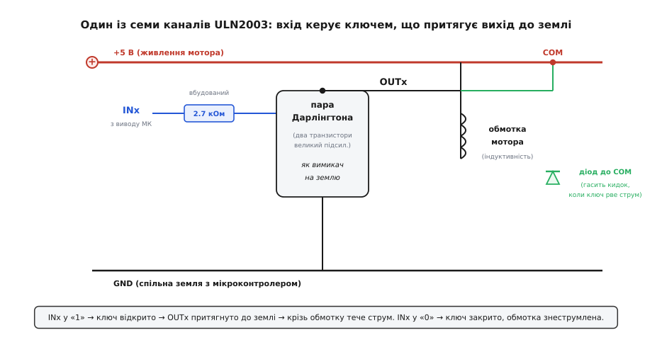
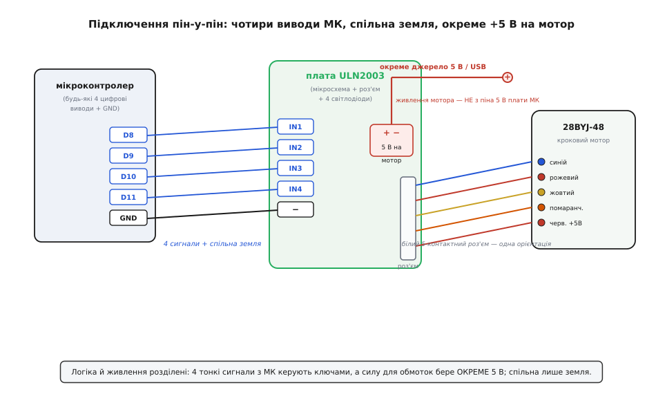
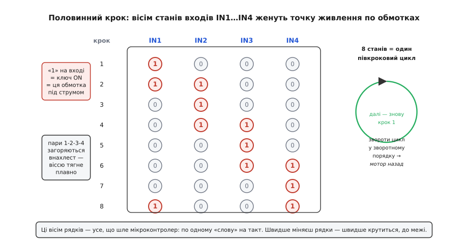

# ULN2003 — драйвер (плата для 28BYJ-48)

<preknowlist>
- [Кроковий мотор](book:electronics/stepper-motor) — крутиться не плавно, а фіксованими кроками; котушки треба вмикати в правильному порядку, щоб вал повернувся.
- [BJT-ключ](book:electronics/bjt-switch) — транзистор як вимикач, що керується слабким сигналом, а пропускає струм, більший за той, який дає вивід мікроконтролера.
- [Схема Дарлінгтона](book:electronics/darlington-pair) — два транзистори, з'єднані так, що разом дають дуже великий коефіцієнт підсилення; вмикаються мізерним струмом.
- [Брикання котушки](book:electronics/inductor-kickback) — коли струм крізь обмотку різко рвуть, вона відповідає гострим кидком напруги, здатним пробити ключ; його гасять діодом.
</preknowlist>

Маленька зелена (або синя) платка, приблизно 35 на 32 міліметри, з чорною мікросхемою в шістнадцятививідному корпусі посередині, білою п'ятиконтактною колодкою з одного краю, гребінкою штирів з написами `IN1 IN2 IN3 IN4` та `+ −` з іншого, і чотирма світлодіодами в ряд. У цю білу колодку якраз входить роз'єм крокового мотора **28BYJ-48** — і разом вони продаються однією парою за копійки, у кожному стартовому наборі. Плата не має ніякого «розуму»: ні мікроконтролера, ні пам'яті, ні логіки. Уся вона — це одна мікросхема **ULN2003** плюс роз'єм і чотири індикатори. Її єдина робота — бути **силовим підсилювачем між тонкими сигналами мікроконтролера й товстими струмами обмоток мотора**. І саме на ній найпростіше зрозуміти, навіщо між «мозком» і «м'язами» майже завжди стоїть окремий ключ.

Головне питання, на яке ця плата відповідає, ховається в одній невідповідності. Вивід мікроконтролера (грубо кажучи, ніжка Arduino чи ESP32) може віддати струм десь до **20–40 міліампер** — і то на межі, з ризиком спалити чіп. А одна обмотка 28BYJ-48 при п'яти вольтах тягне на себе десь **160–200 міліампер**. Отже, живити мотор прямо з ніжки мікроконтролера не можна — ніжка або згорить, або просто не дасть стільки струму, і вал не зрушить. Потрібен **посередник**, який слухається слабкого сигналу, а сам пропускає крізь себе великий струм. Цей посередник — і є ULN2003.

### Що таке ULN2003 усередині

ULN2003 — це не один транзистор, а **сім однакових потужних ключів в одному корпусі**. Кожен ключ побудований за [схемою Дарлінгтона](book:electronics/darlington-pair): два транзистори, зчеплені так, що вмикаються геть мізерним струмом на вході, а комутують сотні міліампер на виході. Мікросхема належить до цілого класу таких збірок — **масивів Дарлінгтона** (докладніше про сам клас — у [загальній статті про масив Дарлінгтона](book:electronics/darlington-pair/api-darlington-array.md)); ULN2003 — його найпоширеніший представник саме тому, що ідеально лягає на керування чотирикотушковим мотором чи кількома реле.

Історію самого рішення — звідки взявся префікс «ULN» і чому наприкінці 1970-х дискретні пари почали пакувати в такі мікросхеми — винесено [окремо](book:power/uln2003-driver/hist-uln-sprague.md), щоб не переривати розбір плати.

Три числа з паспорта мікросхеми задають усе, що з нею можна робити:

```
струм на канал     ≈ 500 мА (пік до 600 мА)
напруга на виході  до 50 В
входів-виходів     7 незалежних каналів
```

Для 28BYJ-48 працюють лише **чотири** з семи каналів — по одному на кожну обмотку. Решта три просто не задіяні (їхні виводи виведено на плату, але порожній роз'єм їх не чіпає). П'ятиста міліампер на канал із величезним запасом вистачає на двісті міліампер обмотки; п'ятдесят вольт межі — теж запас, адже мотор живиться п'ятьма.

> 🔧 **Навіщо це.** Той самий чіп годиться не лише для степера. Сім каналів по півампера — це готовий «розширювач сили» для будь-чого, що мікроконтролер сам не потягне: реле, соленоїди, лампочки, ще один-два малих мотори, стрічка світлодіодів. Тому ULN2003 варто знати не як «деталь до 28BYJ-48», а як універсальний буфер: щойно виводу МК бракує струму — між ним і навантаженням ставлять один із цих каналів.

### Найважливіше: ключ притягує вихід до землі, не до плюса

Тут криється деталь, через яку плутаються майже всі, хто вперше бере ULN2003. Ключ Дарлінгтона в ній — це ключ **до землі** (так званий нижній ключ, англ. *low-side*). Він не «подає плюс» на вихід. Він робить протилежне: коли ти виставляєш на вхід `INx` логічну одиницю, відповідний вихід `OUTx` **притягується до нуля** — до землі. Коли на вході нуль, вихід «відпущений», висить у повітрі, і струм крізь нього не тече.


*Обмотка мотора одним кінцем сидить на постійному «+5 В», другим — на виході OUTx. Коли вхід у «1», пара Дарлінгтона відкривається й з'єднує OUTx із землею — коло замикається, крізь обмотку тече струм. Коли вхід у «0», ключ закритий, обмотка знеструмлена. Вбудований резистор 2.7 кОм на базі дозволяє керувати входом прямо з 5-вольтової логіки без зовнішніх деталей.*

Звідси випливає спосіб під'єднання обмотки, і він теж перевернутий проти інтуїції. Обмотка **не** вмикається «між виводом і землею». Один її кінець постійно висить на **плюсі** живлення, а ключ смикає **другий** кінець до землі. Струм тече не тоді, коли ключ «подав напругу», а тоді, коли ключ **з'єднав вихід із землею** й тим замкнув коло через плюсову шину, обмотку й ключ. Це і є суть нижнього ключа: він керує струмом, замикаючи «низ» кола, а не подаючи потенціал зверху.

Практичний наслідок — логіка виходить **інверсною**. Одиниця на вході вмикає обмотку (притягує до землі), нуль — вимикає. Це важливо тримати в голові, коли пишеш код: `IN1 = HIGH` означає «обмотка 1 під струмом», а не «на виході висока напруга».

Ще одна причина, чому обмотку живлять окремим плюсом, а не з мікросхеми: **ULN2003 сама струму не дає**. Вона тільки **приймає** його на себе, стікаючи в землю (англ. *current sink*). Джерелом струму для обмотки служить зовнішня плюсова шина, а мікросхема лише вирішує, коли цьому струму текти. Тому на платі є окрема клема `+ −` для живлення мотора — і саме туди, а не на вивід мікроконтролера, підводять п'ять вольт.

### Виводи COM і діоди: чому вони конче потрібні

Обмотка мотора — це **котушка**, тобто індуктивність, а індуктивність поводиться підступно: вона опирається будь-якій різкій зміні струму. Поки ключ відкритий, крізь обмотку спокійно тече струм. Але тієї миті, коли ключ **закривається** й рве цей струм, котушка не дає йому обірватися миттєво — вона відповідає гострим стрибком напруги, іноді в десятки й сотні вольт, аби проштовхнути струм далі. Цей стрибок і зветься [бриканням котушки](book:electronics/inductor-kickback), і він б'є прямісінько по щойно закритому ключу. Без захисту такий кидок пробиває транзистор Дарлінгтона за лічені перемикання — мікросхема тихо вигоряє.

Рятунок вбудований усередину ULN2003. У неї є окремий вивід **COM** (від англ. *common* — спільний), а від кожного виходу до цього COM іде вбудований **діод**. Схема захисту проста й елегантна. Вивід COM під'єднують до тієї самої **плюсової шини**, що живить обмотки. Поки ключ працює нормально, ці діоди замкнені й нічого не роблять. Але щойно ключ рве струм і на виході підскакує напруга **вище** плюсової шини — відповідний діод відмикається й **замикає кидок назад у джерело живлення**: струм обмотки добігає своє коло через діод, а не пробиває ключ. Напругу на виході це обмежує рівнем «плюс живлення плюс одне падіння на діоді» — безпечним для мікросхеми.

> 🔧 **Навіщо це.** Ось найтонша, найчастіша й найдорожча помилка з ULN2003: **забути під'єднати COM до плюса живлення**. Плата 28BYJ-48 цей зв'язок робить за тебе розводкою — COM там уже з'єднаний із плюсовою клемою, тому зі степером усе працює «само собою». Але щойно ти береш голу мікросхему ULN2003 керувати реле чи соленоїдом на макетці — і забуваєш кинути дротик із COM на плюс — захисні діоди виявляються «нікуди не під'єднаними», кидок обмотки нема куди відвести, і чіп гине за хвилини роботи, начебто «просто так». Правило залізне: **керуєш будь-яким індуктивним навантаженням — COM завжди на плюс цього навантаження.**

### Плата: що на ній є, крім мікросхеми

Сама плата навколо ULN2003 — гранично проста, і в цьому її чесність. На ній лише чотири речі варті уваги.

**Біла п'ятиконтактна колодка** — роз'єм для 28BYJ-48. П'ять контактів, бо мотор виводить **п'ять** дротів (чотири обмотки плюс спільний), а форма колодки не дає вставити роз'єм навпаки — орієнтація одна. Це знімає цілий клас помилок: переплутати дроти мотора практично неможливо.

**Гребінка `IN1 IN2 IN3 IN4`** — чотири входи, що йдуть прямо на входи мікросхеми. Сюди чіпляють чотири будь-які цифрові виводи мікроконтролера. Ніяких вимог до конкретних ніжок немає — це не шина, не інтерфейс, а просто чотири незалежні «увімкни/вимкни».

**Клема `+ −`** — живлення мотора. Сюди подають п'ять вольт із **окремого** джерела (або того самого, що живить плату, якщо воно тягне струм мотора). Плюс цієї клеми розведений і на COM мікросхеми, і на спільний вивід роз'єму мотора — тобто саме звідси обмотки беруть свій струм. Часто поруч стоїть знімна перемичка (джампер), яка вмикає це живлення; знявши її, плату можна знеструмити, не від'єднуючи дротів.

**Чотири світлодіоди** (`A B C D` або просто в ряд) — по одному на кожен вихід. Вони світять, коли відповідна обмотка під струмом, і це неоціненно зручно: **очима видно** послідовність, у якій твій код перемикає обмотки. Якщо мотор не крутиться, а світлодіоди по черзі перебігають — проблема в механіці чи живленні; якщо ж вони блимають хаотично або стоять — річ у коді послідовності. Індикатори перетворюють невидиму логіку на видиму й економлять годину налагодження.


*Мікроконтролер віддає лише чотири слабкі сигнали (керування ключами) і спільну землю. Силу для обмоток бере ОКРЕМЕ 5 В, підведене в клему плати. Спільна між двома боками — тільки земля: без неї сигнали не мали б спільної точки відліку, і ключі не спрацьовували б. Мотор входить у білий роз'єм єдиною можливою орієнтацією.*

Один момент розводки варто наголосити, бо на ньому спотикаються. **Земля мікроконтролера й мінус живлення мотора мають бути з'єднані.** Плата має спільну землю всередині, але якщо мотор живиш від окремого блока, його «мінус» треба завести на землю мікроконтролера — інакше сигнали `IN1…IN4` не матимуть спільної точки відліку з мікросхемою, і ключі поводитимуться непередбачувано. Плюсові ж лінії розділені: логіка мікроконтролера й сила мотора живляться нарізно, а сходяться лише по землі. Це загальне правило для будь-якої силової плати — **сигнали розділяй, землю об'єднуй**.

### Як цим крутять мотор: чотири входи й послідовність

28BYJ-48 має чотири обмотки, і ULN2003 дає рівно чотири ключі, щоб їх умикати. Щоб вал повернувся, обмотки треба вмикати **не абияк, а в суворій послідовності** — так, щоб магнітне поле всередині мотора обходило його по колу, а ротор ішов слідом. Сам механізм, чому це змушує вал крокувати, розібрано в статті про [кроковий мотор](book:electronics/stepper-motor); тут важливо інше — **що саме шле мікроконтролер** на чотири входи плати.

Найкраще з 28BYJ-48 працює **половинний крок** (англ. *half-step*): режим, де обмотки вмикають то поодинці, то парами внахлест, і на кожному такті поле повертається на пів звичайного кроку. Це дає вдвічі дрібніший крок і помітно плавніший хід. Уся послідовність — це вісім станів чотирьох входів, що ганяють точку живлення по обмотках:


*Кожен рядок — це один такт: які входи в «1» (обмотка під струмом), які в «0». Одиничні й парні стани чергуються — саме це й є «половина кроку». Пройшовши всі вісім рядків, поле обертається на повний електричний оберт; далі цикл повторюється. Проганяєш рядки у зворотному порядку — мотор іде назад. Швидше міняєш рядки — швидше крутиться, до межі, за якою ротор перестає встигати.*

Ось як ці вісім станів виглядають числами (одиниця — обмотка ввімкнена):

```
крок   IN1 IN2 IN3 IN4
 1      1   0   0   0
 2      1   1   0   0
 3      0   1   0   0
 4      0   1   1   0
 5      0   0   1   0
 6      0   0   1   1
 7      0   0   0   1
 8      1   0   0   1
```

Придивись до візерунка: одиниця «пливе» згори вниз по стовпцях, а між чистими станами (одна обмотка) вклинюються перехідні (дві сусідні разом). Саме ці проміжні пари й додають половинний крок. Дійшовши до восьмого рядка, повертаєшся на перший — і цикл біжить далі, а вал крутиться рівномірно.

Скільки таких кроків на повний оберт вала? Тут ховається славнозвісна особливість 28BYJ-48. Сам мотор робить 32 повні кроки на оберт **свого** ротора, але всередині корпусу сидить **редуктор** — набір пластикових шестерень, що сповільнює обертання приблизно в 64 рази заради більшого моменту. Через це на повний оберт **вихідного вала** припадає близько **2038 повних кроків** (або вдвічі більше — коло 4076 — у половинному режимі). Число некругле: точний передавальний коефіцієнт редуктора не рівно 64, а **63.684** — його вирахували ентузіасти, розібравши мотор і полічивши зуби шестерень (усталений факт, підтверджений розрахунком (31·32·26·22)/(11·10·9·9) = 63.684). Тому «поверни рівно на 90 градусів» вимагає ділити не на кругле число, і невеликий дрейф позиції за багато обертів — нормальний для цього мотора.

> 🔧 **Навіщо це.** Некруглий передавальний коефіцієнт — не дефект, а причина, чому 28BYJ-48 не годиться туди, де треба **точне абсолютне позиціювання** без зворотного зв'язку. За один оберт похибка мізерна, але якщо ганяти мотор туди-сюди тисячі разів, накопичений дрейф стає помітним. Для стрілки годинника, заслінки, повільного повороту камери це байдуже; для верстата чи руки робота — вже ні. Знаючи це число (2038, не 2048), його зазвичай і зашивають у код як «кроків на оберт», а критичну позицію звіряють кінцевим вимикачем чи давачем, а не лічильником кроків.

### Як під'єднати й запустити — коротко

Порядок дій, що майже гарантовано заводить зв'язку ULN2003 + 28BYJ-48 з першого разу:

1. **Мотор — у білу колодку.** Орієнтація одна, переплутати не вийде.
2. **Чотири входи `IN1…IN4` — на будь-які чотири цифрові виводи** мікроконтролера. Запам'ятай, який вивід на який вхід, — цей порядок піде в код.
3. **Живлення мотора — у клему `+ −`.** П'ять вольт, здатних дати щонайменше ампер (мотор у пікові моменти бере кількасот міліампер, а якщо моторів кілька — більше). **Не** живи мотор із виводу 5 В плати мікроконтролера, коли той сам живиться від USB, — USB часто не тягне пусковий струм, плата перезавантажується. Окреме джерело або якісний блок — надійніше.
4. **Об'єднай землі.** Мінус живлення мотора — на землю мікроконтролера. Це найчастіше забувають, і саме через це «все під'єднав, а не крутиться».
5. **Перевір світлодіодами.** Заливши найпростіший код обертання, дивись на чотири індикатори: вони мають плавно перебігати по колу. Перебігають, а вал стоїть — механіка або живлення; стоять чи блимають хаотично — код послідовності.

Готовий робочий приклад коду — як зашити ту саму вісімку станів у прошивку, як користуватися стандартними бібліотеками замість ручного перебору, як задавати швидкість і напрям, і на яких пастках спіткнутися — зібрано в [окремому проєкті-вставці з API](book:power/uln2003-driver/api-uln2003.md).

### Межі й чого стерегтися

ULN2003 із 28BYJ-48 — чудова навчальна й побутова зв'язка, але свої межі має, і чесно їх знати.

**Швидкість невелика.** Через редуктор вихідний вал крутиться повільно — типово кільканадцять обертів за хвилину на межі. Женеш такти надто швидко — ротор не встигає за полем, мотор «зривається»: гуде, тремтить, але не крутиться. Для плавного руху заслінки чи стрілки це не проблема; для швидкого приводу — беруть інший мотор.

**Момент скромний.** Пластиковий редуктор дає непоганий момент для свого розміру, але це іграшковий мотор — заклинити вал пальцями легко. Навантажуй у межах сотень грамів-сантиметрів, не більше.

**Мотор гріється в спокої.** Якщо лишити обмотку під струмом надовго (мотор стоїть, але тримає позицію), і плата, і мотор помітно теплішають — крізь обмотку весь час тече струм. Це нормально, але якщо тримати позицію не треба, у коді варто **знеструмлювати обмотки** (усі входи в нуль) між рухами.

**Це не «розумний» драйвер.** ULN2003 не обмежує струм, не робить мікрокрок сам, не має захисту від перегріву чи короткого. Уся розумність — у твоєму коді, який шле правильну послідовність. Для 28BYJ-48 цього досить; для потужного біполярного крокового мотора беруть спеціалізований драйвер зі стабілізацією струму (як [драйвер крокового](book:electronics/stepper-driver) на кшталт A4988 чи DRV8825), а не ULN2003.

Насамкінець — головна думка, яку ця скромна платка вкладає в голову раз і назавжди. Мікроконтролер — це **мозок, а не м'язи**: він блискуче вирішує, *коли* й *що* вмикати, але сам майже не має сили. Щойно навантаження перевищує кілька десятків міліампер — між мозком і навантаженням стає **ключ**, який слухається слабкого сигналу, а пропускає крізь себе великий струм. ULN2003 — найпростіше втілення цього ключа, зразу в семи примірниках. Зрозумівши, чому він притягує вихід до землі, чому обмотка висить на плюсі й навіщо діод біжить у COM, ти зрозумів принцип, за яким мікроконтролер керує геть усім потужним — від крокового мотора до реле, що вмикає світло в кімнаті.
