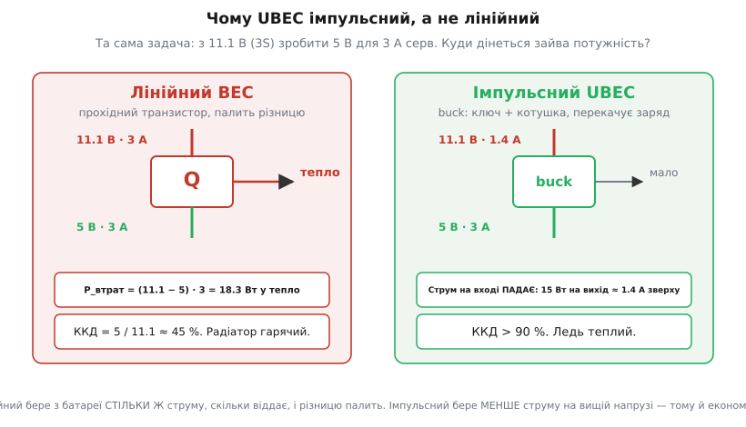
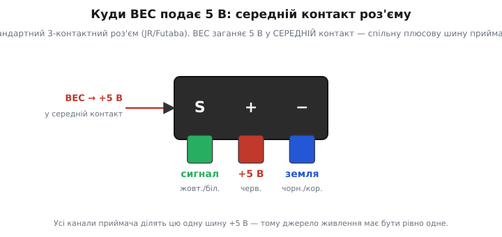
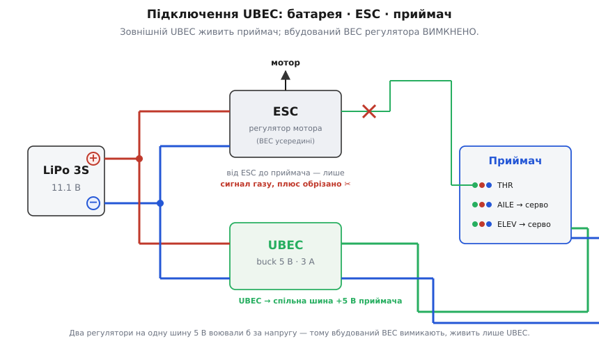

# BEC / UBEC — понижувальне живлення для серв і приймача

<preknowlist>
- [Buck-перетворювач](topic:electronics/buck) — як імпульсне пониження напруги (ключ + котушка) віддає більше струму, ніж бере, з ККД понад 90%.
- [LDO](topic:electronics/ldo) — лінійний стабілізатор: тримає вихід рівним, а зайву напругу палить теплом (Vin − Vout)·I.
- [Хобі-серво](topic:electronics/hobby-servo) — привід із трипровідним роз'ємом (сигнал, +живлення, земля), що тягне помітний струм і смикає його ривками.
- [ESC-регулятор](topic:electronics/esc) — регулятор оборотів безколекторного мотора; саме в нього найчастіше вбудовують BEC.
</preknowlist>

Розкрутіть будь-який електричний літачок, квадрокоптер чи машинку на радіокеруванні — і десь між акумулятором і приймачем ви знайдете або невеличку коробочку з трьома парами дротів, або ті самі функції, заховані всередину регулятора мотора. Це BEC. Штука робить одну просту, але критичну річ: бере високу напругу тягового акумулятора (два, три, шість літієвих банок поспіль) і віддає з неї рівні 5 чи 6 вольт, якими живляться приймач і сервомашинки. Без неї модель або взагалі не полетить, або спалить свою електроніку першої ж секунди. Розберімося, звідки взялася ця річ, чому їх дві породи — вбудована й окрема, — як її під'єднати й де вона підводить.

## Дві біди, одна коробочка

Щоб відчути, навіщо BEC узагалі існує, треба уявити модель без нього. На борту електричного літака сидять два зовсім різні споживачі. Перший — мотор: йому потрібна вся напруга акумулятора й десятки ампер, щоб крутити гвинт. Другий — «мозок» і «м'язи керування»: приймач радіосигналу й кілька серв, що відхиляють елерони, руль висоти, газ. Ця електроніка розрахована на **5 В** і струм у рази менший.

У ранні дні радіокерованих електромоделей ці два світи живили **двома окремими акумуляторами**: великий — на мотор, маленький — на приймач із сервами. І це була суцільна морока. Другий акумулятор — це зайва вага (для літака критична), зайве місце, ще одна річ, яку треба заряджати й стежити, щоб не сіла посеред польоту. Хтось розумний спитав: а навіщо возити другу батарею, якщо велика тягова й так на борту? Треба лише **знизити** її напругу до безпечних для приймача 5 В — і другий акумулятор стає непотрібним.

Ось звідси й назва. **BEC** — це *Battery Eliminator Circuit*, «схема-усувач батареї»: вона **усуває** (англ. *eliminate*) потребу в окремому приймальному акумуляторі. Назва суто модельна, жаргонна: решта світу ту саму річ називає просто «стабілізатор напруги» або «понижувальний перетворювач». Але в радіокеруванні прижилося саме BEC, і коли моделіст каже «спалив BEC», усі розуміють, про що йдеться.

Сама ідея живити прилад від мережі замість батарей — набагато старша за радіокеровані моделі. Ще в 1924–1925 роках, коли ламповим радіоприймачам потрібні були громіздкі й дорогі батареї, канадський винахідник Едвард С. Роджерс-старший (Edward S. Rogers Sr., Торонто) зробив «усувач батарей» — блок живлення від хатньої мережі — і перший у світі приймач «Rogers Batteryless», що працював просто з розетки. Термін «battery eliminator» звідти й тягнеться; докладніше — у зноску про [народження ідеї «усувача батарей»](topic:power/bec-ubec/hist-battery-eliminator.md).

> 🔧 **Навіщо це.** Коли ви бачите на моделі маленьку коробочку з написом «UBEC» або «SBEC», з товстими дротами з одного боку й тонким трипровідним роз'ємом-«сервушкою» з іншого, — ви миттєво знаєте її роль: це джерело 5 В для бортової електроніки, запитане від головного акумулятора. Не сплутаєте її ні з регулятором мотора (той товщий і з трьома дротами на мотор), ні з зарядним пристроєм.

І тут з'являється друга біда, тонша за першу, — саме вона розділила BEC на дві породи. Знизити напругу можна двома принципово різними способами, і вони по-різному марнують енергію. Ця відмінність — ключ до всієї теми, тож розберемо її ретельно.

## Лінійний BEC проти імпульсного: куди дінеться зайва напруга

Уявіть, що акумулятор дає 11.1 В (три літієві банки, «3S»), а приймачу треба 5 В. Кудись треба подіти 6.1 зайвого вольта. Є два шляхи.

**Лінійний спосіб.** Найпростіший стабілізатор — це, по суті, керований опір, увімкнений послідовно з навантаженням (докладніше — [LDO](topic:electronics/ldo) і лінійні регулятори взагалі). Він «затискається» рівно настільки, щоб на виході лишилося 5 В, а решту напруги гасить на собі. Але фізика невблаганна: через нього тече **весь** струм навантаження, і на ньому падає **вся** зайва напруга. Добуток струму на падіння — це потужність, і вона повністю йде **в тепло**:

```
P_втрат = (Vin − Vout) · I
```

Порахуймо. Складна модель із кількома цифровими сервами може в піку тягти 3 А. Тоді:

```
P_втрат = (11.1 − 5) · 3
P_втрат = 6.1 · 3
P_втрат = 18.3 Вт
```

Вісімнадцять із гаком ватів — у тепло, з крихітної коробочки. Це багато: стабілізатор розжариться так, що спрацює тепловий захист (якщо він є) або деталь просто згорить. А корисної роботи він робить лише 5·3 = 15 Вт. Тобто **ККД** усієї витівки:

```
ККД = Pкорисна / Pвхід = (5 · 3) / (11.1 · 3) = 5 / 11.1 ≈ 45 %
```

Більше половини енергії акумулятора летить у пічку. І що вища напруга батареї, то гірше: на 6S (22.2 В) той самий лінійний BEC палив би вже (22.2−5)·3 = 51.6 Вт — це рівень паяльника.

**Імпульсний спосіб.** Тут працює зовсім інша ідея — [buck-перетворювач](topic:electronics/buck). Замість «затискати» різницю, він **швидко-швидко вмикає й вимикає** повну напругу батареї — тисячі разів на секунду, — і згладжує ці імпульси котушкою й конденсатором так, що на виході виходить рівні 5 В. Ключ, коли ввімкнений, майже не має опору (втрати малі); коли вимкнений — струму немає взагалі (втрат немає). Зайва напруга не «гаситься» — вона просто не проходить, бо ключ більшу частину часу закритий.

Наслідок майже магічний: імпульсний перетворювач бере з батареї **менше струму, ніж віддає на виході**. Енергія зберігається (потужність на вході ≈ потужність на виході), а оскільки вхідна напруга вища, вхідний струм виходить меншим:

```
Pвих = 5 · 3 = 15 Вт
Pвх ≈ Pвих / ККД = 15 / 0.90 ≈ 16.7 Вт
Iвх ≈ Pвх / Vin = 16.7 / 11.1 ≈ 1.5 А
```

На виході 3 А, а з батареї тягнеться лише ~1.5 А. Різниця не «спалюється» — її просто не беруть. ККД такого перетворювача — **понад 90%**, а в тепло йде якийсь ват-півтора, і коробочка лишається ледь теплою.



*Та сама задача — 5 В · 3 А з 11.1 В. Ліворуч лінійний палить різницю теплом; праворуч імпульсний бере з батареї менший струм на вищій напрузі. Не «економія на нагріві», а зовсім інший принцип: зайву потужність не беруть, а не гасять.*

> 🔧 **Навіщо це.** Ось чому в сучасних моделях майже завжди стоїть **імпульсний** BEC. На 2S (7.4 В) різниця ще терпима й лінійний іще якось живе. Але щойно ви ставите 3S, 4S, 6S — лінійний BEC перетворюється на грубку, що жере акумулятор і плавиться. Імпульсний тримає ту саму напругу холодним і без утрат. Тому правило просте: багато банок або багато серв — тільки імпульсний.

Саме імпульсна порода, зроблена як **окрема** оверсайз-коробочка на великий струм і широкий діапазон входу, дістала окрему назву — **UBEC**, *Universal BEC*, «універсальний BEC». «Універсальний» — бо він ковтає широкий діапазон вхідної напруги (типово 2–6 банок) і дає солідний струм, тож годиться майже під будь-яку модель, на відміну від слабенького BEC, зашитого в дешевий регулятор.

## Де сидить BEC: усередині регулятора чи окремо

BEC буває у двох іпостасях, і їх треба розрізняти.

**Вбудований у ESC.** У більшості аматорських збірок регулятор оборотів мотора — [ESC](topic:electronics/esc) — уже містить BEC усередині. Зручно: ви під'єднуєте ESC до акумулятора товстими дротами, до мотора — трьома дротами, а до приймача — тонким трипровідним роз'ємом-«сервушкою». По цьому ж роз'єму ESC і сигнал газу приймає, і **назад віддає 5 В**, живлячи приймач та серва. Одна деталь робить усе. Так історично й почалося: перші BEC вбудовували просто в приймачі, а коли моделям знадобилося більше струму, виробники ESC перебрали цю функцію на себе — вона природно лягла туди, де вже є силове живлення.

**Окремий UBEC.** Коли вбудованого BEC мало — а мало буває часто, — ставлять окрему коробочку. Дешевий ESC може віддавати лише 1–2 А, а складний літак із флаперонами, шасі, що прибираються, і жменею цифрових серв у різкому маневрі просить 3–5 А і більше. Тоді беруть окремий UBEC, розрахований із запасом, а вбудований BEC регулятора **вимикають** (як саме — за мить). Окремий UBEC також рятує, коли ESC узагалі без BEC (такі звуть «opto» — вони гальванічно розв'язані й живлення приймачу не дають зумисне).

Куди саме BEC подає свої 5 В? У трипровідному роз'ємі серво й приймача — стандартному «JR/Futaba» — три контакти: **сигнал**, **плюс живлення** і **земля**. Плюсовий контакт — **середній**, спільний на всі канали приймача. BEC заганяє 5 В саме в нього, і ця напруга розходиться по всіх каналах, живлячи кожне підключене серво.



*Стандартний роз'єм серва. BEC живить середній контакт — спільну плюсову шину +5 В, з якої живляться всі канали приймача. Саме тому джерело цієї шини має бути рівно одне.*

> 🔧 **Навіщо це.** Оте «рівно одне джерело» — не формальність, а причина головної аварії з UBEC. Уся плюсова шина приймача електрично **спільна**: усі середні контакти з'єднані всередині. Якщо на неї одночасно тиснуть **два** BEC (вбудований у ESC і зовнішній UBEC), вони починають воювати за напругу — один хоче 5.0 В, другий 5.2 В, і між ними тече паразитний струм, що перевантажує слабший і псує обидва. Тому при встановленні зовнішнього UBEC вбудований BEC **обов'язково** відключають.

## Як під'єднати зовнішній UBEC

Схема нескладна, але один крок пропускати не можна. Ось повна картина: акумулятор живить і ESC (мотор), і UBEC; UBEC живить приймач; а вбудований BEC регулятора вимкнено.



*Батарея живить обидва блоки паралельно. UBEC дає 5 В на вільний канал приймача — і ця напруга розходиться шиною по всіх сервах. Від ESC до приймача лишається тільки сигнал газу: його плюсовий (червоний) дріт вийнято, щоб два регулятори не билися за шину.*

Читається за трьома гілками:

**Силове живлення.** Плюс і мінус акумулятора йдуть паралельно на **два** входи — на силовий вхід ESC (звідти живиться мотор) і на вхід UBEC. UBEC із тих 11.1 В робить 5 В.

**Вихід UBEC до приймача.** Трипровідний роз'єм UBEC (у нього зазвичай є сигнальний контакт, але сигналу він не дає — лише плюс і земля) встромляють у **будь-який вільний канал** приймача. Немає вільного — ставлять Y-подовжувач на зайнятий. Оскільки плюсова шина спільна, 5 В одразу з'являються на всіх каналах.

**Відключення вбудованого BEC.** Ось критичний крок. Регулятор газу з'єднаний з приймачем трипровідним роз'ємом, і по його середньому (**червоному**, плюсовому) дроту в приймач заходять 5 В від вбудованого BEC. Цей червоний дріт треба **прибрати**: акуратно піддіти фіксатор голкою й **витягти контакт** з роз'єму (щоб не псувати регулятор і зберегти гарантію) або, як варіант, перерізати. Тоді від ESC до приймача лишається тільки сигнальний і земляний дроти — газом керуємо, а живить приймач винятково UBEC.

> 🔧 **Навіщо це.** Якщо цей крок пропустити, вбудований BEC регулятора й зовнішній UBEC зіткнуться на спільній шині 5 В. У найкращому разі один із них перевантажиться й перегріється; у гіршому — вигорить слабший BEC, а за ним і серва чи сам UBEC. Тож послідовність залізна: спершу вийняти червоний дріт ESC, тоді вмикати UBEC. І напругу UBEC виставити під ваші серва: зависока — спалите серва, занизька — вони «тупитимуть» і приймач ловитиме просадки (brown-out).

## Ключові цифри

Зведімо паспорт типового аматорського UBEC — за приклад узято поширений **Hobbywing UBEC-3A** (2–6S), але цифри репрезентативні для класу.

| Параметр | Значення |
|---|---|
| Вхідна напруга | 5.5–26 В (2–6 банок Li, або 5–18 NiMH) |
| Вихідна напруга | 5 В або 6 В, перемикач вибору |
| Тривалий струм | 3 А (пік коротко вищий) |
| Тип | імпульсний buck, ККД > 90% |
| Пульсації виходу | < 50 мВ розмаху |
| Захист | від переполюсування входу |
| ЕМ-екран | металевий екран + фільтр на виході |
| Розмір · вага | ≈43 × 17 × 7 мм · ≈11 г |

Три числа з таблиці вирішують, чи ляже UBEC у вашу модель: **діапазон входу** (скільки банок він ковтне), **вихідний струм** (чи витримає ваші серва в піку) і **вихідна напруга** (5 чи 6 В — під ваші серва). Розберімо два з них на прикладах.

## Приклад: чи вистачить струму на серва

Найтиповіше питання перед польотом — чи не «просяде» живлення, коли всі серва смикнуться разом. Порахуймо бюджет струму.

**Умова: літак із 6 цифровими сервами, кожне в піку тягне 0.8 А; UBEC на 3 А.**

Цифрові серва «голодні»: вони тримають позицію активно й у момент різкого відхилення (та ще й проти напору повітря) короткочасно тягнуть свій піковий струм. Найгірший випадок — різкий маневр, коли пілот смикнув усі поверхні одночасно:

```
пік усіх серв:  6 · 0.8 = 4.8 А
дає UBEC:       3.0 А
4.8 А > 3.0 А  →  UBEC перевантажено
```

Дефіцит майже вдвічі. Що станеться: напруга на шині 5 В **просяде** (brown-out), приймач може перезавантажитися, і в найгірший момент — у різкому маневрі під землею — модель на частку секунди **втратить керування**. Це класична причина падінь.

Висновок практичний: під таку модель треба UBEC на **5 А і більше**, або рахувати реалістичніший пік. Насправді всі шість серв рідко б'ють на повну водночас, тож інженерний запас беруть так: сумарний тривалий струм серв × 1.5–2. Але для складного пілотажного літака із цифровими сервами економити на UBEC — просити біди. Ось чому UBEC роблять «оверсайз»: краще возити запас струму, ніж упасти через просадку.

## Приклад: скільки UBEC гріється насправді

Порахуймо, чому імпульсний UBEC можна ставити куди завгодно, а лінійний BEC — ні. Візьмімо той самий струм і напругу.

**Умова: 6S (22.2 В), навантаження 2.5 А на 5 В. Порівняємо лінійний і імпульсний.**

Лінійний BEC:

```
P_втрат = (Vin − Vout) · I = (22.2 − 5) · 2.5
P_втрат = 17.2 · 2.5
P_втрат = 43 Вт  у тепло
```

Сорок три вати — це неможливо розсіяти з маленької плати, лінійний BEC на 6S просто згорить. Тепер імпульсний (ККД 90%):

```
Pвих = 5 · 2.5 = 12.5 Вт
Pвх  = 12.5 / 0.90 ≈ 13.9 Вт
P_втрат = Pвх − Pвих = 13.9 − 12.5 ≈ 1.4 Вт  у тепло
```

Ват із чвертю проти сорока трьох — різниця в тридцять разів. Ось чисельне пояснення, чому на будь-чому вище за 2S лінійний BEC не застосовують: тепло росте з різницею напруг, а імпульсному ця різниця майже байдужа. Ват-півтора коробочка розсіює й лишається теплою на дотик.

## Пастки й межі — про що пам'ятати

- **Не тримайте два BEC на одній шині.** Ставите зовнішній UBEC — вийміть червоний дріт вбудованого BEC регулятора. Це причина №1 згорілих BEC і серв.
- **Рахуйте піковий струм серв, а не середній.** Просадка (brown-out) вбиває керування саме в пікові моменти. Беріть UBEC із запасом; сумарний струм серв × 1.5–2.
- **Виставте правильну напругу.** Багато UBEC перемикаються між 5 і 6 В. Аналогові серва зазвичай на 5–6 В, але дешеві або старі можуть не любити 6 В. Зависока напруга палить серва, занизька — сповільнює їх і провокує просадки. Звіряйтеся з паспортом серв.
- **Імпульсний шум.** Швидке перемикання UBEC породжує високочастотний шум. За часів аналогових 72-МГц радіо це подеколи псувало прийом; на сучасних 2.4-ГГц системах така завада майже ніколи не заважає, і виробники ще й ставлять ЕМ-екран та вихідний фільтр. Але дешевий безіменний UBEC із поганою фільтрацією поруч із антеною приймача краще не класти.
- **Пусковий стрибок.** У момент увімкнення конденсатори UBEC заряджаються ривком; на вході коротко тече великий струм. Для деталі це нормально, але не дивуйтеся іскрі на роз'ємі при під'єднанні акумулятора.
- **Клони.** Дешеві безіменні UBEC часто перебільшують свій струм у паспорті: написано «5 А», а реально тримає 2–3, далі гріється й просідає. Для відповідальної моделі беріть деталь відомого бренду й вірте реальним тестам, а не наліпці.

## Керувати сервами через UBEC-живлену шину

UBEC сам по собі «німий» — жодного цифрового інтерфейсу в нього немає, лише вхід і вихід живлення. Але з боку контролера є цілком реальна задача: керувати сервами, що сидять на шині 5 В від UBEC, і робити це так, щоб не спровокувати ту саму просадку. Робочий приклад із генерацією сигналу серв, розкладкою піків у часі й захистом від brown-out — у зноску [про керування сервами на UBEC-шині](topic:power/bec-ubec/proj-servo-rail.md).

## Де він доречний, а де ні

Підсумуймо. UBEC — це імпульсний понижувальний перетворювач, зроблений спеціально під бортове живлення радіомоделі, і він **потрібен**, коли:

- модель складна: багато серв (надто цифрових), флаперони, шасі — і вбудованого BEC регулятора мало;
- живлення багатобаночне (3S і вище), де лінійний BEC перегрівся б;
- ESC узагалі без BEC (opto-регулятори) — тоді приймач нічим інакше не запитати;
- потрібен запас струму й холодна робота при високому вхідному вольтажі.

Окремий UBEC **не потрібен**, коли модель проста: пара серв, 2S, а вбудованого BEC регулятора з головою вистачає — тоді зайва коробочка лише додасть ваги. І пам'ятайте головне: BEC (у будь-якій іпостасі) — це те, що дозволяє возити **один** акумулятор замість двох; уся суть класу в тому, щоб зняти високу тягову напругу до безпечних для приймача 5 В — надійно, холодно й без другої батареї на борту.
