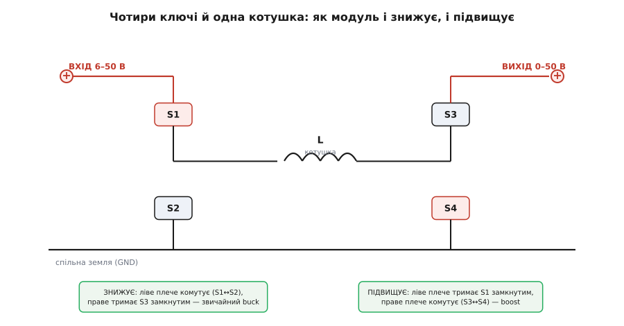
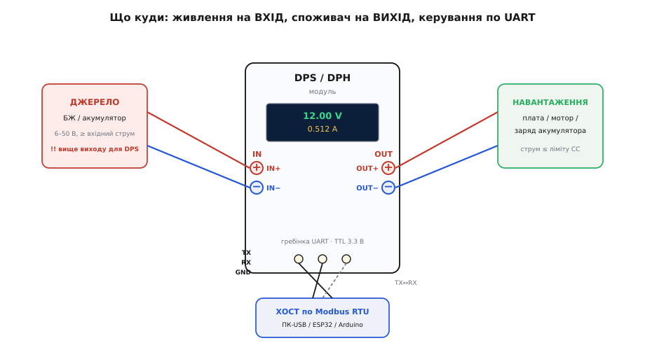

# Програмований DC-DC buck-boost (DPS/DPH)

<preknowlist>
- [Buck-перетворювач](book:electronics/buck) — як імпульсне ЗНИЖЕННЯ напруги працює через ключ, котушку й шпаруватість; без цього не зрозуміти, що модуль робить усередині.
- [Boost-перетворювач](book:electronics/boost) — як ту саму котушку змушують ПІДВИЩУВАТИ напругу; друга половина того, що вміє DPH.
- [Buck-boost](book:electronics/buck-boost) — перетворювач, що і знижує, і підвищує; саме цю здатність позначає літера «H» у назві DPH.
- [Джерело струму](book:electronics/current-source) — що означає «тримати сталий струм» незалежно від навантаження; на цьому стоїть режим обмеження струму (CC).
</preknowlist>

Уявіть на столі невеличку панельку з кольоровим екраном, енкодером-крутилкою і двома парами гвинтових клем — «вхід» і «вихід». Подаєте на вхід що завгодно з широкого діапазону — 12 вольтів від адаптера ноутбука, 24 з блока живлення, банку літієвих акумуляторів — а на екрані крутите два числа: скільки вольтів і скільки ампер віддавати назовні. Виставили `3.30 V` і ліміт `0.500 A`, натиснули **ON** — і на виході рівно 3.3 вольта, а якщо навантаження спробує вхопити більше половини ампера, модуль сам придушить напругу, аби струм не переліз за межу. Це і є **програмований DC-DC перетворювач** родини **DPS/DPH** від фірми Hangzhou RuiDeng Technology (продається також під марками RIDEN та RD) — маленький настільний блок живлення, що вміщається в долоню й коштує як пара кавових склянок.

Ця стаття — про те, як упізнати такий модуль, чим `DPS` відрізняється від `DPH` (це не дрібниця, а різна фізика всередині), що там під екраном, як його правильно під'єднати до джерела й навантаження, і як керувати ним не тільки крутилкою, а й із комп'ютера чи мікроконтролера по дротах.

### Що це за звір і навіщо він

Звичайний [DC-DC модуль](book:electronics/dc-dc-module) — це плата з підстроювальним резистором: покрутив викруткою, виставив вихідну напругу, і все. Дешево й корисно, але сліпо: ти не бачиш, скільки насправді на виході, не можеш обмежити струм, не можеш зберегти налаштування чи змінити їх по команді. DPS/DPH бере ту саму імпульсну серцевину й додає до неї мозок — **мікроконтролер, кольоровий екран та енкодер**. Виходить не просто перетворювач, а справжнє **джерело живлення з керуванням**: із цифровою індикацією, обмеженням струму, пам'яттю пресетів і, у комунікаційних версіях, портом для керування ззовні.

Абревіатура в назві розшифровується прозоро: **D**igital **P**ower **S**upply (цифрове джерело живлення), а число — приблизні межі. `DPS5005` означає «до **50** вольтів, до **5** ампер»; `DPS5015` — ті самі 50 В, але вже 15 ампер; `DPS3005` — до 30 В, 5 А; `DPS8005` — аж до 80 В. Тобто перші дві цифри — стеля напруги, другі дві — стеля струму.

Головна фішка проти голого модуля — **дві межі одночасно**: напруги й струму. Модуль тримає ту з них, у яку впреться першою. Поки навантаження бере мало — тримається задана **напруга** (режим CV, constant voltage). Щойно струм доріс до ліміту — модуль перестає тримати напругу й починає тримати **струм** (режим CC, constant current), просаджуючи напругу рівно настільки, щоб струм не переліз межу. Це і є класичний режим **CV/CC**, без якого не зарядити акумулятор і не випробувати незнайому схему, не боячись її спалити.

> 🔧 **Навіщо це.** Обмеження струму — це страхувальна сітка. Зібрали нову плату, не певні, чи немає короткого — виставили ліміт струму маленьким (скажімо, 50 мА) і вмикаєте: є замикання — модуль просто впреться в стелю струму й притисне напругу до нуля, замість того щоб пустити в помилку кілька ампер і випустити магічний дим. Той самий механізм заряджає літієву банку: тримаєш сталий струм, поки напруга не дійде до порогу, потім тримаєш напругу — це і є [заряд за профілем CC/CV](book:electronics/cc-cv-bms).

### DPS проти DPH: одна літера — інша фізика

Ось найважливіше, що варто засвоїти про цю родину, бо на цьому спотикаються при купівлі. Літера в середині назви — **`S`** чи **`H`** — каже, яка топологія всередині, а від неї залежить, який вхід модулю взагалі годиться.

**`DPS`** (наприклад, `DPS5005`) — це чистий [buck](book:electronics/buck), тобто перетворювач, що вміє тільки **знижувати**. Він бере вхідну напругу й відрізає від неї частину, віддаючи на вихід менше. Правило залізне: **вихід завжди мусить бути помітно нижчим за вхід**. Хочете на виході 12 В — подайте на вхід хоча б 14-15. Різниця в кілька вольтів — це «запас на роботу» (dropout): імпульсному знижувачеві потрібен зазор, щоб було з чого відрізати. Спробуєте видобути з 12-вольтового входу 12 В на виході — не вийде, модуль просто не дотягне до заданого.

**`DPH`** (наприклад, `DPH5005`) — це вже [buck-boost](book:electronics/buck-boost): він і **знижує, і підвищує**. Літера `H` — від *buck-boost* топології на H-мості (про неї нижче). Тут вхід може бути **будь-яким** відносно виходу: нижчим, рівним чи вищим — на виході однаково рівна задана напруга. Подали 8 вольтів — а на виході отримали 20. Це те, чого buck-only `DPS` не вміє в принципі. Розплата за гнучкість — трохи більший нагрів і трохи гірший коефіцієнт корисної дії, коли модуль працює в режимі підвищення.

Чому ця різниця вирішальна, найкраще видно на живленні від акумулятора. Літієва банка «на 12 В» насправді плаває: зарядженою вона дає близько 12.6 В, а сідаючи, сповзає до ~9 В. Якщо на виході потрібні стабільні 12 В, buck-only `DPS` тут безсилий — щойно банка опуститься нижче за «вихід плюс запас», напруга на виході почне провалюватися слідом за нею. А `DPH` триматиме рівні 12 В від повного заряду до глибокого розряду: коли входу вже бракує, він просто перемикається зі зниження на підвищення й дотягує напругу вгору. Саме тому для роботи «від батареї в стабільну шину» беруть `DPH`, а не `DPS` — літера `S` проти `H` тут вирішує, працюватиме схема взагалі чи ні.

### Що всередині: чотири ключі й одна котушка

Аби зрозуміти, звідки береться здатність і знижувати, і підвищувати, треба зазирнути в серцевину. Класичний імпульсний знижувач ([buck](book:electronics/buck)) має один силовий ключ, котушку й діод; підвищувач ([boost](book:electronics/boost)) — ключ і котушку, зібрані інакше. А `DPH` поєднує обидва в одну схему — **чотириключовий buck-boost**: чотири транзистори-ключі розставлені у форму літери H (звідси й «H-міст»), а між їхніми серединами висить **одна спільна котушка**.


*Ліве плече ключів дивиться на вхід, праве — на вихід, котушка L з'єднує їхні середини. Коли треба ЗНИЖУВАТИ, комутує лише ліве плече (S1↔S2), а праве тримає прохід до виходу відкритим — це звичайний buck. Коли треба ПІДВИЩУВАТИ, ліве плече тримає прохід із входу відкритим, а комутує праве (S3↔S4) — це boost. Та сама котушка обслуговує обидва режими.*

Уся хитрість — у тому, **яке плече в цю мить перемикається**. Ключі відкриваються й закриваються тисячі разів на секунду за законом [шпаруватості (ШІМ)](book:electronics/pwm), і залежно від того, з якого боку йде комутація, котушка або віддає на вихід менше, ніж узяла (зниження), або накачує в себе енергію й вихлюпує її вгору вищою напругою (підвищення). Мікроконтролер на платі сам вирішує, який режим потрібен: порівнює вхід із заданим виходом і плавно переходить між «знижувати» й «підвищувати», навіть коли вони близькі. Для користувача це непомітно — на виході просто стоїть та напруга, яку він набрав.

`DPS` (buck-only) улаштований простіше: у ньому працює по суті ліва половина цієї картинки — знижувальне плече, — а правий бік лишається наскрізним. Тому `DPS` дешевший, холодніший і ефективніший, але вміє тільки вниз.

### Скільки вольтів давати на вхід

Тут ховається пастка, через яку модуль «раптом не тягне». Візьмімо для прикладу `DPH5005`: за паспортом його вхід — **6.00–50.00 В**, вихід — **0–50.00 В до 5 А**, максимум **250 Вт**, а вхідний струм обмежений **10 амперами**. Здавалося б, buck-boost — тягни хоч 50 В з 6 В на вході. Але є фізика: потужність не береться нізвідки.

Модуль не створює енергію, лише перекладає її з входу на вихід (з невеликими втратами). Тому **вхідна потужність мусить дорівнювати вихідній** плюс втрати:

```
P_вих = U_вих · I_вих
P_вх  = U_вх  · I_вх   ≈  P_вих   (плюс невеликі втрати на нагрів)
```

Звідси й обмеження. Хочете з `DPH5005` повні 50 В × 5 А = 250 Вт на виході — вхід мусить дати ті самі 250 Вт. При вході 6 В це вимагало б `250 / 6 ≈ 42 А` вхідного струму, а стеля входу — лише 10 А. Тобто з 6 вольтів ви фізично не витягнете 250 Вт, хоч убийтеся.

**Порахуймо реальну стелю виходу при слабкому вході.**
```
Дано: U_вх = 8 В, стеля вхідного струму I_вх макс = 10 А.
Гранична вхідна потужність:
  P_вх = 8 В · 10 А = 80 Вт
Стільки ж максимум і на виході (втрати поки нехтуємо).
Хочемо на виході 50 В — тоді доступний струм:
  I_вих = P_вих / U_вих = 80 Вт / 50 В = 1.6 А
Висновок: з 8 В на вході 50 В на виході дадуться лише до ~1.6 А,
а не до паспортних 5 А. Щоб зняти повні 50 В × 5 А, вхід має бути
близько 250 Вт / 10 А = 25 В або вище.
```

Ось чому в паспорті `DPH5005` окремо зазначено: **повні 50 В / 5 А доступні лише при вході приблизно від 22-25 В**. Нижчий вхід — нижча стеля вихідного струму. Це не поломка, а закон збереження енергії, і тримати його в голові критично: половина скарг «модуль не видає обіцяного» — це просто занадто слабке джерело на вході.

> 🔧 **Навіщо це.** Практичне правило вибору джерела: прикиньте потрібну **вихідну потужність** (вольти × ампери, що хочете знімати), додайте відсотків 15-20 на втрати — і переконайтеся, що ваш блок живлення на вході дає стільки ват і при цьому не впирається в 10-амперну стелю входу модуля. Для `DPS` (buck) додайте ще вимогу «вхід на кілька вольтів вищий за вихід». Недооцінили джерело — отримаєте просілу напругу під навантаженням і здивування.

### Кольоровий екран, енкодер і пам'ять пресетів

Обличчя модуля — **кольоровий РК-екран** (звичайно IPS, ~1.44-1.8"), і це помітно відрізняє його від дешевих зелених семисегментних вольтметрів. На екрані одночасно видно два стовпчики цифр: **задані** значення (скільки ви наказали — `U-SET`, `I-SET`) і **справжні** значення на виході (скільки насправді — `U-OUT`, `I-OUT`), плюс поточну **потужність** у ватах, номер активного пресета й індикатор режиму — світиться `CV` чи `CC`, тобто модуль зараз тримає напругу чи впав у обмеження струму.

Керування — одним **енкодером** (крутилка з натиском) і кількома кнопками. Крутите — міняєте цифру, натискаєте — переходите на сусідній розряд, довгий натиск ховає меню. Окрема кнопка **ON/OFF** вмикає й вимикає вихід: поки він вимкнений, на клемах виходу нічого немає, і можна спокійно набрати потрібні вольти-ампери, перш ніж подати їх на схему.

Дуже зручна річ — **пам'ять пресетів**. Модуль зберігає до десяти наборів «напруга + струм + пороги захисту» (групи `M0`…`M9`) у незалежній пам'яті, що переживає вимкнення живлення. Налаштували режим для заряду банки, ще один — для живлення макета на 3.3 В, третій — на 5 В: перемкнули номер групи, і всі межі підхопилися. Плюс до цього — **захисти**, які можна виставити цифрами: від перенапруги (OVP), надструму (OCP), надпотужності (OPP) і перегріву; спрацював будь-який — вихід відрубується сам.

### Підключення: вхід, вихід і не переплутати

Електрично на модулі три групи контактів: **вхід** (`IN+`, `IN−`), **вихід** (`OUT+`, `OUT−`) і, у комунікаційних версіях, тонка гребінка **зв'язку** (`TX`, `RX`, `GND`).


*Джерело (блок живлення чи акумулятор) заходить на `IN+`/`IN−`; для `DPS` його напруга має бути вищою за бажаний вихід, для `DPH` — будь-якою в межах входу. Споживач (плата, мотор, акумулятор на заряд) вішається на `OUT+`/`OUT−`. Керувальний хост (ПК через USB-перехідник, ESP32 чи Arduino) під'єднується до гребінки `TX`/`RX`/`GND`, причому `TX` модуля йде на `RX` хоста й навпаки.*

Найперше й найважливіше правило — **не переплутати вхід із виходом**. Клеми однакові на вигляд, підписи дрібні, а наслідки різні. Подали живлення на `OUT` замість `IN` — у кращому разі модуль просто не працює, у гіршому силовий каскад дістає напругу «з хвоста» й може постраждати. Тому перше, що робиш із новим модулем: знаходиш підписи `IN`/`OUT` на платі (вони завжди є) і звіряєшся двічі.

Друге — **полярність**. Переплутаний плюс із мінусом на вході — це підключення силової електроніки задом наперед; дешеві модулі від цього гинуть миттєво. Червоний до плюса, чорний до мінуса — і на вході, і на виході.

Третє — **порядок увімкнення**. Спершу під'єднуєш і вмикаєш джерело на вхід, даєш модулю ожити, набираєш на екрані потрібні вольти й ліміт струму — і **тільки потім** кнопкою ON подаєш це на навантаження. Так навантаження ніколи не бачить випадкової напруги на мить увімкнення живлення. Звичка ж «набрати наосліп і ввімкнути на живому» рано чи пізно спалює щось під'єднане, тож це правило варте того, щоб стати рефлексом: тримай вихід вимкненим, поки очима не переконаєшся, що на екрані стоять саме потрібні цифри, а клеми `IN`/`OUT` не переплутані. П'ять секунд такої перевірки економлять годину пошуку, чому нова плата «померла на першому вмиканні».

### Керування ззовні: Modbus по дротах

Крутилка — це добре для настільної роботи, але справжня сила цих модулів у тому, що комунікаційні версії (з приписками **`-USB`** чи **`-USB-BT`** у назві) вміють коритися **командам ззовні**. Під тонкою гребінкою `TX`/`RX` ховається звичайний послідовний порт (UART на рівнях TTL 3.3 В), а по ньому модуль розмовляє протоколом [Modbus RTU](book:communications/modbus) — тим самим промисловим протоколом «ведучий питає — ведений відповідає», що керує заводським обладнанням.

Механіка проста: кожен параметр модуля (задана напруга, заданий струм, стан виходу ON/OFF, виміряні вольти й ампери, номер пресета) лежить у пронумерованому **регістрі**. Хочете виставити напругу — ведучий пише число у відповідний регістр; хочете дізнатися, скільки зараз на виході, — читає інший регістр. За замовчуванням порт працює на швидкості **9600 бод**, і це значення можна змінити в меню самого модуля.

Хостом може бути що завгодно, що вміє UART: комп'ютер через дешевий USB-UART перехідник (тоді керуєш модулем із Python чи готовою програмою), ESP32 (і тоді модуль стає керованим по Wi-Fi), Arduino, Raspberry Pi. Єдина тонкість підключення — **перехрест ліній**: `TX` модуля йде на `RX` хоста, а `RX` модуля — на `TX` хоста, і обов'язково спільна `GND`. Це стандартне правило будь-якого UART: передавач одного слухає приймач іншого.

Уся мапа регістрів (за якими адресами лежать задані вольти-ампери, вимір і вмикач), самий протокол із функціями читання-запису й робочий приклад — «відкрити порт, записати задані значення, увімкнути вихід і прочитати вимір» реальним кодом — винесено в окремий [довідник керування модулем по Modbus](book:power/dcdc-buck-boost/api-modbus-control.md): там і послідовність команд, і чому напругу пишуть числом у сотих вольта, і як не переплутати порядок байтів.

> 🔧 **Навіщо це.** Керований по дротах блок живлення — це вже не просто джерело, а **інструмент автоматики**. Можна написати скрипт, що плавно піднімає напругу й будує вольт-амперну характеристику незнайомого світлодіода; можна зарядити банку за власним профілем; можна ввести модуль у ланцюг випробувального стенда, де комп'ютер сам крутить живлення й записує, як поводиться пристрій. Крутилкою такого не зробиш — а Modbus-порт відкриває двері до всього цього.

Окрема цікавинка: серцем модуля є мікроконтролер STM32, і ентузіасти написали для нього **альтернативну прошивку з відкритим кодом** — вона дає чистіший інтерфейс і власне мережеве керування. Історію самої родини RuiDeng і цього «зламу» винесено в [нарис про походження DPS і прошивку OpenDPS](book:power/dcdc-buck-boost/hist-ruideng-opendps.md): звідки взялися ці дешеві модулі й хто та навіщо переписав їхній мозок.

### Як не наступити на граблі

Кілька типових помилок, що з'їдають перший вечір із новим модулем.

**Слабкий вхід.** Найчастіше. Модуль «не видає» заданого струму або напруги — майже завжди тому, що джерело на вході не тягне потрібної потужності або (для `DPS`) стоїть надто близько за напругою до бажаного виходу. Порахуйте вати, дайте запас.

**Переплутані `IN`/`OUT` чи полярність.** Дрібні підписи ведуть до силового підключення навпаки. Звіртеся двічі, перш ніж подати живлення.

**Купили `DPS`, а треба був `DPH`.** Якщо джерело — акумулятор, що просідає, або взагалі нижче за бажаний вихід, buck-only `DPS` не впорається. Для роботи «вгору» чи «від сідаючої батареї» потрібен саме buck-boost `DPH`. Літера `S` проти `H` вирішує все.

**Немає порту, а хотіли керувати з ПК.** Базові версії без приписки `-USB`/`-BT` не мають комунікації — гребінка `TX`/`RX` на них або відсутня, або нерозведена. Хочете керувати по Modbus — беріть комунікаційну версію.

**Забули про нагрів.** Під навантаженням у 100+ ват модуль гріється, надто `DPH` у режимі підвищення. У глухому корпусі без обдування він упреться в захист від перегріву й вимкне вихід. Дайте йому дихати.
