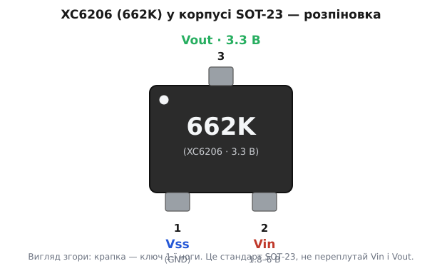
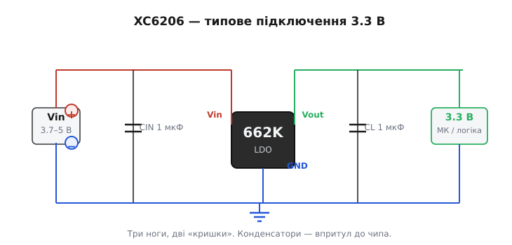

# XC6206 (662K) — LDO-регулятор 3.3 В

<preknowlist>
- [LDO](topic:electronics/ldo) — лінійний стабілізатор із малим падінням: що таке dropout, струм спокою, чому чип гріється на різниці (Vin − Vout)·I.
- [Decoupling-конденсатор](topic:electronics/decoupling) — навіщо ставити ємність упритул до виводів живлення й що вона гасить.
- [ESR конденсатора](topic:electronics/esr-capacitor) — послідовний опір ємності; чому стабілізатор вимагає саме «low-ESR» кераміку.
- [Корпуси й розпіновка](topic:electronics/packages-pinout) — що таке SOT-23, як читати ключ 1-ї ноги й нумерацію виводів.
</preknowlist>

Візьміть будь-яку дрібну саморобку на ESP32, дешевий датчик із AliExpress чи модуль із трьома ногами на платі побільше — і з великою ймовірністю на ньому сидить чорна крихітка з білим написом **662K**. Це XC6206: крихітний стабілізатор напруги, що робить рівні 3.3 В майже з будь-чого, що ви йому подасте на вхід. Він завбільшки з рисове зерня, коштує копійки, і саме тому ним засіяно пів-світу любительської електроніки. Розберімося, що це за звір, як його впізнати, куди в нього тече струм і де він вас підведе.

## Що це і як упізнати

**XC6206** — це фіксований LDO-стабілізатор напруги (англ. *low-dropout* — «з малим падінням») від японської компанії Torex Semiconductor. «Фіксований» означає, що вихідна напруга зашита в кристал на заводі й не регулюється: конкретно версія, яку ви тримаєте в руках, майже завжди — **3.3 В**. «LDO» означає, що йому досить крихітної різниці між входом і виходом, щоб тримати вихід рівним, — і в цьому вся його суть.

Повна заводська назва деталі — **XC6206P332MR**. Її легко прочитати по частинах:

```
XC6206  P    332      M R
серія   │    │        │
        │    │        └─ форма/пакування (стрічка, вивід)
        │    └────────── 3.3 В: два значущі числа «33» + множник «2»
        └─────────────── корпус P = SOT-23 (три ноги)
```

Число `332` кодує напругу так само, як номінали резисторів: перші дві цифри — значущі («33»), третя — скільки нулів дописати в мілівольтах. «33» і множник «×10²» дають 3300 мВ = 3.3 В. Версія на 5.0 В була б `502`, на 1.8 В — `182`.

А от напис на самому корпусі — інший. На чип фізично не влазить «XC6206P332MR», тож виробник друкує короткий код **662K**. Тут `662` — заводське маркування саме XC6206 на 3.3 В, а літера-хвостик (`K` та подібні) кодує партію/ревізію й для вас несуттєва. Тому в побуті цю деталь так і кличуть — «662K» або просто «662».

> 🔧 **Навіщо це.** Коли ви бачите на чужій платі три ноги й напис «662» — ви миттєво знаєте: тут роблять 3.3 В з чогось вищого. Якщо ваш модуль раптом не стартує, а на вході живлення є, — перевіряйте цей чип першим: у нього на виході має стояти рівно 3.3 В. Немає — або чип згорів, або ви подали на вхід замало (чи забагато).

XC6206 випускають не лише в SOT-23. Той самий кристал буває в корпусі SOT-89 (більший, краще відводить тепло — витримує трохи більший струм) і в мініатюрному USP-6B. Але в аматорському світі майже завжди трапляється саме SOT-23, тож про нього й мова.

## Навіщо він узагалі потрібен

Щоб відчути, чому ця дрібка так поширена, треба зрозуміти задачу, яку вона розв'язує. Уявіть простий пристрій на батарейці: мікроконтролер, кілька датчиків, він більшість часу спить і зрідка прокидається щось поміряти. Живиться від одного літій-іонного акумулятора.

Тут одразу дві біди. Перша: літієва банка — це не 3.3 В. Заряджена вона дає ~4.2 В, під кінець розряду сідає до ~3.4 В. А мікроконтролер хоче стабільні 3.3 В: подаси 4.2 В напряму — спалиш, подаси плаваючу напругу — він то працює, то збоїть. Потрібен посередник, що з мінливого входу робить рівний вихід.

Друга біда тонша. Пристрій спить **місяцями**, тож будь-який струм, який безцільно тече цілодобово, з'їдає батарею. Класичний дешевий стабілізатор (той-таки [AMS1117-клас](topic:electronics/ldo)) сам, у стані спокою, споживає ~5 мА — просто на живлення своєї внутрішньої «нутрощі». П'ять міліампер цілодобово — це ≈3.6 А·год на місяць; типова банка сяде за кілька діб, так нічого корисного й не зробивши. Стабілізатор, що весь заряд з'їдає сам на себе, для автономного пристрою — катастрофа.

XC6206 зроблений точно під ці дві біди. Різниця між входом і виходом, яка йому потрібна, — усього близько **0.25 В**: він тримає 3.3 В навіть коли літій просів до ~3.5 В. А струм спокою в нього — **≈1 мкА**, у п'ять тисяч разів менший за AMS1117. Мікроампер — це майже нічого: за місяць набіжить ~0.7 мА·год, тобто чип у сплячці для балансу заряду практично невидимий. Ось чому він осів у датчиках, брелоках, носимій дрібноті й усьому, що має довго жити від маленького елемента.

> 🔧 **Навіщо це.** Правило вибору просте. Живите щось від батареї, і воно має довго спати — беріть XC6206 (або подібний мікроамперний LDO). Живите щось від стінного адаптера чи USB, де струм спокою нікого не турбує, а треба більший струм навантаження, — беріть потужніший AMS1117 чи взагалі імпульсний перетворювач. Один клас деталей іншим не замінюється: у них різні сильні сторони.

Народження цього класу — мікропотужних CMOS-LDO — і роль Torex у ньому винесені окремо, щоб не рвати нитку: [коротка історія «низького струму спокою»](topic:power/xc6206/hist-torex-ldo.md).

## Розпіновка: три ноги, і їх не можна плутати

У XC6206 в корпусі SOT-23 рівно три виводи. Ось як вони розташовані, якщо дивитися на чип згори (боком з написом до вас):



*Вигляд згори. Пласка крапка в кутку — ключ, що позначає першу ногу; від неї нумерація йде проти годинникової стрілки.*

- **Pin 1 — Vss** (від англ. *voltage of source substrate*, історична назва «мінусової» шини) — це **земля**, GND. Спільний нуль для входу й виходу.
- **Pin 2 — Vin** — **вхід**. Сюди подаєте вашу «брудну» напругу: 1.8–6 В.
- **Pin 3 — Vout** — **вихід**. Звідси знімаєте рівні 3.3 В на навантаження.

Головна пастка новачка — переплутати Vin і Vout. У багатьох звичних мікросхемах-стабілізаторах на три ноги вхід і вихід стоять поруч знизу, а тут вихід винесений нагору сам-один — і легко подати живлення не туди. Подасте вхід на Vout — у кращому разі нічого не запрацює, у гіршому пустите струм проти внутрішнього транзистора й уб'єте чип. Тому щоразу звіряйтеся з ключем-крапкою й нумерацією, а не «на око».

## Як підключити

XC6206 — деталь із розряду «поставив і забув». Крім самого чипа, потрібні лише два конденсатори: один на вхід, один на вихід.



*Джерело зліва, навантаження справа, спільна земля знизу. CIN і CL — по 1 мкФ керамічні, поставлені якнайближче до ніг чипа.*

Схема читається за трьома струмами. Червона шина згори — вхід: плюс джерела (літій, USB, вищий стабілізатор) іде на **Vin**. Зелена шина — вихід: із **Vout** рівні 3.3 В ідуть на мікроконтролер чи логіку. Синя шина знизу — спільна **земля**: мінус джерела, GND-нога чипа й «мінус» навантаження з'єднані в один вузол.

Тепер про конденсатори, бо вони тут не декоративні:

**CIN (вхід), ~1 мкФ керамічний.** Гасить кидки на вході. Коли навантаження раптом смикне струм, живлячий дріт (у нього є своя індуктивність) не встигає віддати заряд миттєво — напруга на вході просідає. Ємність поруч тримає локальний запас заряду й згладжує ці провали. Це той самий принцип, що й [decoupling](topic:electronics/decoupling), тільки на вході стабілізатора.

**CL (вихід), ~1 мкФ керамічний.** Ось цей — критичний, не пропускайте його. Стабілізатор тримає вихід рівним не миттєво: усередині є петля зворотного зв'язку, яка помічає відхилення виходу й підправляє транзистор — але з невеликою затримкою. У проміжку, поки петля «схаменеться», провал закриває саме вихідна ємність. Без неї на різких стрибках навантаження вихід почне дзвонити й скакати, а сам стабілізатор може піти в самозбудження. Виробник вимагає ставити CL — і не будь-який.

> 🔧 **Навіщо це.** «Не будь-який» — бо XC6206 розрахований на **керамічні low-ESR** конденсатори. [ESR](topic:electronics/esr-capacitor) — це паразитний послідовний опір ємності. Стара теорія стабілізаторів вимагала навпаки — трохи ESR для стійкості петлі, і на керамічному конденсаторі (майже нульовий ESR) такі чипи збуджувалися. XC6206 спроєктований під сучасну кераміку: постав йому електроліт із помітним ESR — і поведінка може погіршати. Керамічний 1 мкФ X7R/X5R упритул до ніг — те, що треба.

І ще одне залізне правило монтажу: обидва конденсатори — **якомога ближче до виводів чипа**, короткими доріжками. Довгий дріт між ємністю й ногою додає індуктивності й зводить нанівець весь сенс: конденсатор має бачити чип «впритул», інакше він гасить кидки надто пізно.

## Ключові цифри

Зведімо паспорт XC6206 (версія 3.3 В, SOT-23) в одну таблицю — з нею й працюють.

| Параметр | Значення |
|---|---|
| Вихідна напруга | 3.3 В, точність ±2% |
| Вхідна напруга | 1.8–6.0 В (стеля — 6 В абсолютна) |
| Макс. струм навантаження | 200 мА (у SOT-23) |
| Dropout (падіння) | ≈0.25 В при 100 мА |
| Струм спокою (I_q) | ≈1 мкА |
| Захист | обмеження струму з «завалом» + захист від КЗ |
| Робоча температура | −40…+85 °C |

Три числа з цієї таблиці визначають, чи ляже XC6206 у вашу задачу: стеля входу **6 В**, стеля струму **200 мА** і **dropout 0.25 В**. Розберімо кожне на прикладі.

## Приклад: чи дотягне від літію під кінець розряду

Це найтиповіше застосування — тримати 3.3 В від однієї літій-іонної банки. Перевіримо на найгіршому: банка майже розряджена й сіла до 3.45 В.

**Умова: Vin = 3.45 В (сів літій), треба Vout = 3.3 В.**

```
запас на вході:   Vin − Vout = 3.45 − 3.30 = 0.15 В
потрібний dropout: Vdrop(XC6206) ≈ 0.25 В
0.15 В < 0.25 В  →  запасу НЕ вистачає
```

Тут видно межу: при 3.45 В на вході чип уже **не втримає** повні 3.3 В — вихід почне сповзати слідом за входом, бо різниці менше за dropout. А тепер порахуймо ту саму схему трохи раніше, поки банка на 3.6 В:

```
запас на вході:   3.6 − 3.3 = 0.30 В
потрібний dropout: ≈ 0.25 В
0.30 В > 0.25 В  →  запасу досить, вихід тримається
```

Висновок практичний: XC6206 витягує з літію майже весь заряд — тримає 3.3 В аж поки банка не сяде десь до 3.55 В, і лише в самому хвості розряду вихід почне падати. Для того-таки AMS1117 із dropout ~1.1 В ця межа настала б аж при 4.4 В — тобто він узагалі не годиться живити 3.3 В від одного літію. Ось де мала цифра dropout перетворюється на реальні зайві години роботи пристрою.

## Приклад: скільки він гріється

XC6206 — лінійний стабілізатор, а отже, зайву напругу він не «економить», а **спалює на собі теплом**. Прохідний транзистор увімкнено послідовно з навантаженням: крізь нього тече весь струм навантаження I, і на ньому падає вся зайва напруга (Vin − Vout). Потужність — завжди добуток струму на падіння, тож на чипі розсіюється:

```
P = (Vin − Vout) · I
```

**Умова: живимо 3.3 В від 5 В USB, навантаження тягне 150 мА.**

```
P = (5.0 − 3.3) · 0.150
P = 1.7 · 0.150
P = 0.255 Вт  ≈ 255 мВт
```

Чверть вата — це багато для рисового зерня без радіатора. Крихітний SOT-23 має великий тепловий опір «кристал → повітря», тож 255 мВт розігріють його до неприємних температур: чип буде гарячий, точність попливе, а на межі спрацює внутрішній захист (про нього нижче). Мораль: XC6206 любить **малу різницю напруг і малий струм**. Його стихія — зробити 3.3 В із літію (різниця десяті вольта) для сплячого датчика на одиниці міліампер. Гнати ним 150 мА з 5 В — знущання: тут просилося б або менше падіння на вході, або взагалі імпульсний перетворювач, що зайву напругу не палить, а перекачує.

## Приклад: сплячий пристрій і бюджет заряду

Тепер — заради чого цей чип узагалі беруть. Порахуймо, скільки заряду він з'їдає сам, коли пристрій спить.

**Умова: пристрій спить 99% часу, живиться від банки 1000 мА·год, у сплячці працює лише I_q стабілізатора.**

```
власне споживання у сні:  I_q ≈ 1 мкА = 0.001 мА
за добу:                  0.001 мА · 24 год = 0.024 мА·год
за рік:                   0.024 · 365 ≈ 8.8 мА·год
частка від банки:         8.8 / 1000 ≈ 0.9 %
```

За **цілий рік** сплячки стабілізатор з'їсть менше одного відсотка банки. Порівняйте з AMS1117 (I_q ~5 мА): той самий рік з'їв би ~43 800 мА·год — у 44 рази більше за всю ємність банки, тобто вона сіла б за тиждень тільки на «утримання» стабілізатора, ще нічого корисного не зробивши. Ось де мікроамперний I_q вирішує: він робить автономний пристрій, який живе від крихітного елемента місяцями, взагалі можливим.

## Захист і його межа — стережіться

Усередині XC6206 є обмежувач струму з «завалом» (англ. *fold-back*): якщо навантаження намагається витягти надто багато чи ви коротнули вихід на землю, чип не згорає одразу — він тримає струм у безпечних рамках, а при повному короткому ще й **завалює** його вниз, щоб не палити сам себе. Це рятує від типової аварії — зачепив пінцетом вихід на GND — і дає простий запобіжник від перевантаження.

Але тут — головна пастка XC6206, і її треба знати твердо: **у нього немає теплового захисту (thermal shutdown)**. Багато сучасних стабілізаторів мають датчик температури кристала, що вимикає чип, коли той перегрівся, і вмикає назад, коли охолов. XC6206 такого **не має**. Це означає: якщо ви змусите його розсіювати забагато тепла (велика різниця Vin − Vout × чималий струм, як у прикладі з нагрівом), ніхто його не врятує — він просто грітиметься, поки не деградує чи не згорить. Обмежувач струму захистить від короткого замикання, але **не** від повільного перегріву на легальному, «не-короткому» струмі.

Звідси практичні межі, за які не можна:

- **6 В на вході — абсолютна стеля.** Подали 7 В (наприклад, переплутали з блоком живлення, чи літій під час заряду стрибнув) — ризикуєте пробити чип. Тримайтеся нижче 6 В із запасом; для двох літієвих банок (до 8.4 В) XC6206 уже не годиться.
- **200 мА — стеля струму, а не робоча точка.** Це максимум, за яким спрацьовує обмежувач; постійно тягти з нього 200 мА, та ще й з великим падінням, — гарантований перегрів. Комфортна зона — десятки міліампер.
- **Клони й точність.** «662K» з дешевих партій буває не оригінальний Torex, а копія невідомого заводу. Часто працює, але реальна точність, dropout і поведінка захисту можуть відрізнятися від паспорта. Для критичного живлення беріть деталь у надійного постачальника.

> 🔧 **Навіщо це.** Відсутність теплового захисту — не «дефект», а наслідок призначення. XC6206 зроблений під **малий струм і малу різницю напруг**, де тепла майже немає, а кожен зайвий транзистор термодатчика — це зайвий струм спокою, що вбив би головну перевагу чипа. Тримайте його у своїй ніші (сплячий пристрій, живлення від літію, десятки міліампер) — і теплозахист вам не знадобиться. Виженете за неї — жодна внутрішня схема не порятує, доведеться думати про тепло самому.

## Де він доречний, а де ні

Підсумуймо чесно. XC6206 (662K) — це дешевий, крихітний, мікропотужний LDO на 3.3 В, і він **ідеальний**, коли:

- живлення від одного літій-іонного/LiPo елемента чи від 5 В USB, а треба рівні 3.3 В;
- пристрій багато спить, і критичний саме струм спокою (датчики, брелоки, носима дрібнота, IoT-вузли);
- струм навантаження невеликий — від мікроампер до кількох десятків міліампер;
- місця на платі обмаль, а ціна має бути копійчаною.

І він **поганий вибір**, коли треба великий струм (сотні міліампер і вище — перегріється без теплозахисту), коли вхід сильно вищий за вихід (уся різниця йде в тепло — просилося б імпульсне перетворення), коли вхід може перевищити 6 В, або коли живлення двофазне/багатобаночне. У цих випадках беруть інший клас: потужніший LDO з теплозахистом, або DC-DC перетворювач, що зайву напругу не палить, а перекачує з високим ККД.
