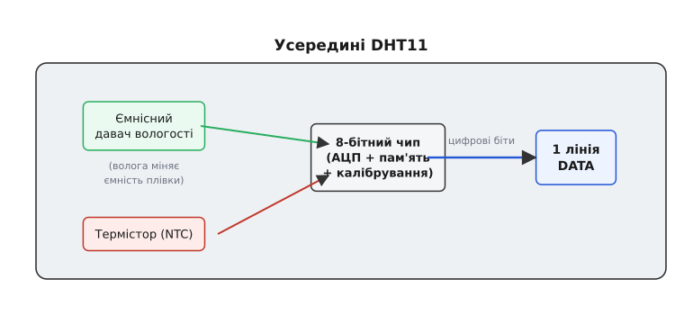
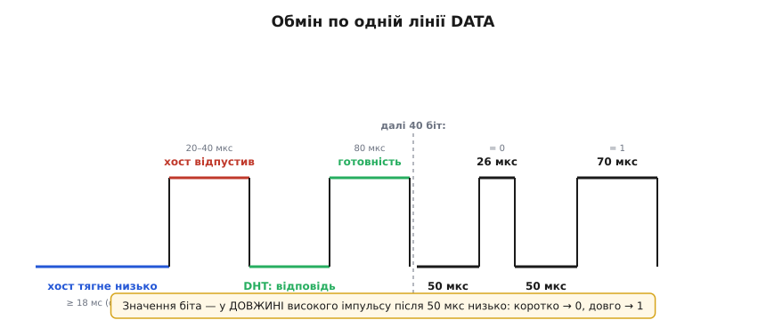
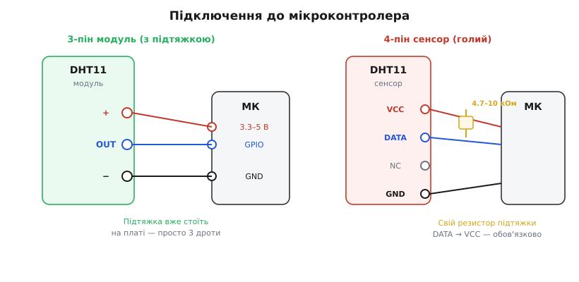

# DHT11 — давач температури й вологості

<preknowlist>
- [Вимірювання вологості](book:physics/humidity-measurement) — що таке відносна вологість (скільки водяної пари в повітрі щодо максимуму за цієї температури) і чому вона залежить від температури.
- [Ємнісний давач вологості](book:electronics/capacitive-humidity-sensor) — плівка, що вбирає вологу й міняє свою ємність; звідси беруться відсотки RH.
- [Термістор NTC](book:electronics/ntc-thermistor) — резистор, чий опір падає з нагрівом; ним DHT11 міряє температуру.
- [Логічні рівні як діапазони](book:electronics/logic-levels-as-ranges) — що таке «високо» й «низько» на цифровій лінії й чому 3.3-вольтова та 5-вольтова логіка сумісні тут.
- [Підтяжка й відкритий колектор](book:electronics/open-drain) — навіщо лінію тягне вгору резистор, а пристрої лише «притягують» її до землі.
- [Керування ніжками з коду (GPIO-регістри)](book:programming/gpio-registers) — як із програми підняти чи опустити один вивід мікроконтролера й прочитати його стан.
- [millis / micros — час у прошивці](book:programming/millis-micros) — як зміряти проміжок у мікросекундах, не блокуючи програму; цим ми розрізняємо біти давача.
</preknowlist>

Це, мабуть, найпоширеніший давач у світі саморобної електроніки: маленький блакитний (рідше білий) прямокутник із дірочками-ґратами на лицьовій стінці, три або чотири ніжки знизу. Коштує копійки, лежить у кожному стартовому наборі, і майже кожен, хто вперше зібрав щось на Arduino, міряв кімнатну температуру саме ним. **DHT11** — цифровий давач, що в одному корпусі поєднує вимірювання **температури** й **відносної вологості** повітря та віддає обидва числа вже готовими, по одній сигнальній лінії. Ніякого аналогового виходу, ніякого підбору опорних напруг: спитав — отримав два числа й контрольну суму.

Назва — просто заводський індекс виробника, [Aosong (Guangzhou) Electronics](https://aosong.com) з Китаю; жодного «слова-кореня» за нею немає, тож розшифровувати нічого. Уся суть — у тому, що ховається за ґратами й у тому дивакуватому «однодротовому» протоколі, яким давач говорить із мікроконтролером. Розберімо цю річ так, щоб упізнати її серед інших модулів, під'єднати з першого разу, витягти з неї числа в коді й наперед знати, де вона любить підводити.

## Що це насправді таке

За ґратами на лицьовій стінці ховаються **два різні давачі та маленький чип**, що ними керує. Це і є вся хитрість DHT11: два цілком різні за фізикою вимірювання зведені до одного цифрового виходу.

Перший давач — **ємнісний давач вологості** ([плівка, чия ємність міняється, коли вона вбирає вологу з повітря](book:electronics/capacitive-humidity-sensor)). Що вологіше повітря, то більше води осідає в тонкому шарі між обкладками, то більша ємність. Другий — **термістор** ([резистор із від'ємним температурним коефіцієнтом, NTC](book:electronics/ntc-thermistor)): його опір падає, коли теплішає. Обидва дають аналогові величини — ємність і опір, — які самі по собі мікроконтролеру незручні.

Тут і виходить на сцену третій елемент — **8-бітний чип** усередині корпусу. Він міряє ємність і опір, переганяє їх у числа своїм вбудованим перетворювачем, застосовує закладене на заводі калібрування (щоб «стільки-то ємності» перетворилося саме на «стільки-то відсотків вологості») і тримає результат напоготові. А назовні віддає його вже цифрою — послідовністю бітів по одній лінії.


*Два різні за фізикою давачі — ємнісний (вологість) і термістор (температура) — зведені чипом до одного цифрового виходу. Мікроконтролер не бачить ані ємності, ані опору: він отримує вже готові відсотки й градуси окремими байтами. Уся аналогова частина схована в корпусі.*

> 🔧 **Навіщо це.** Ось чому DHT11 такий зручний для новачка: він **прибирає всю аналогову мороку**. З «голим» термістором довелося б робити дільник напруги, чіпляти його на вхід АЦП, рахувати опір із виміряної напруги, а тоді ще перетворювати опір на градуси за нелінійною формулою. З ємнісним давачем вологості — ще гірше, бо ємність доводиться міряти хитрощами. DHT11 усе це вже зробив усередині й віддає готове число. Плата за зручність — фіксована, доволі груба точність: ви берете те калібрування, яке зашив виробник, і ніяк на нього не впливаєте.

## Що він міряє й наскільки точно

Головне, що варто засвоїти про DHT11 ще до того, як його купувати, — це **межі й точність**. Вони скромні, і саме нерозуміння цього породжує більшість розчарувань.

```
Величина     Діапазон       Точність      Роздільність
────────────────────────────────────────────────────────
Вологість    20–80 % RH     ± 5 % RH      1 % RH
Температура  0–50 °C        ± 2 °C        1 °C
```

Прочитаймо цю табличку уважно, бо кожне число має наслідок.

**Температура — від 0 до 50 °C.** Нижче нуля DHT11 просто не працює: він не міряє мороз. Це відразу викреслює його з будь-якого вуличного застосування взимку — для холодильника, морозильника, зимової теплиці він не годиться. Точність ± 2 °C означає, що коли він показує 23 °C, справжня температура десь між 21 і 25. Для «тепло чи холодно в кімнаті» це прийнятно; для точного термостата — ні.

**Вологість — від 20 до 80 % RH** (RH, англ. *relative humidity* — [відносна вологість](book:physics/humidity-measurement), тобто скільки водяної пари в повітрі щодо максимуму, який воно втримало б за цієї температури). Точність ± 5 % — груба: показав 45 %, а насправді від 40 до 50. Дуже суху (менш як 20 %) і дуже вологу (понад 80 %) атмосферу він міряє ненадійно або зовсім не бачить.

**Роздільність — цілі одиниці.** І це найважча для новачка несподіванка. DHT11 віддає **тільки цілі відсотки й цілі градуси** — жодних десятих. Не існує «23.5 °C» від DHT11: буде або 23, або 24, стрибком. Технічно давач шле для кожної величини два байти — «ціла частина» й «дробова», — але **дробові байти в DHT11 завжди нульові**. Вони є в протоколі лише тому, що той самий формат використовує старший брат DHT22, який десяті таки видає. Тож якщо в чужому коді ви бачите збирання числа з двох байтів — воно правильне, просто на DHT11 друга половина завжди 0.

> 🔧 **Навіщо це.** Обирайте DHT11 усвідомлено. Він чудовий там, де треба **дешево й приблизно**: кімнатний термометр-гігрометр, навчальний проєкт, індикатор «сухо/нормально/волого», логер погоди на балконі влітку. Він **непридатний** там, де важать десяті градуса, від'ємні температури чи точна вологість: для інкубатора, метеостанції, керування кліматом краще брати точніший давач. Якщо вже на етапі задуму вам потрібні десяті чи мінусова шкала — не беріть DHT11, зекономите собі розчарування. Точніший, ширший за діапазоном родич — [DHT22 (він же AM2302)](https://learn.adafruit.com/dht/overview): −40…80 °C, 0…100 % RH, десяті градуса, той самий протокол і майже той самий код; коштує помітно дорожче.

## Ніжки: три чи чотири

DHT11 продають у двох виглядах, і сплутати їх — перша дрібна пастка.

**Голий сенсор** — це сам корпус із **чотирма** виводами в ряд. Розкладка стандартна:

```
Пін  Назва   Призначення
──────────────────────────────────────────────
 1   VCC     живлення (+3.3…5.5 В)
 2   DATA    сигнальна лінія (двоспрямована)
 3   NC      не під'єднано (нічого не робить)
 4   GND     земля
```

Третя ніжка (NC, англ. *not connected* — не з'єднано) — порожня, вона просто не веде нікуди; не намагайтеся нею користуватись. Робочих виводів насправді три: живлення, дані, земля.

**Модуль** — той самий сенсор, припаяний на маленьку платку, зазвичай із **трьома** виводами. Тут порожню ніжку вже прибрали, а натомість на плату **додали резистор підтяжки** на лінії DATA (про нього — нижче) і часто конденсатор по живленню. Порядок ніжок на модулях різний у різних виробників, тому їх завжди **підписують** просто на платі: `+` / `VCC`, `OUT` / `DATA` / `S`, `−` / `GND`. Не вгадуйте за розташуванням — читайте підпис.

> 🔧 **Навіщо це.** Практична різниця одна: **модуль уже має підтяжку, голий сенсор — ні**. Якщо ви взяли трипіновий модуль, DATA можна вести прямо на ніжку мікроконтролера — резистор уже стоїть на платі. Якщо у вас чотирипіновий голий сенсор, ви **мусите** самі поставити резистор підтяжки між DATA й VCC, інакше лінія висітиме в повітрі й обмін не відбудеться. Це найчастіша причина, чому «купив давач, під'єднав три дроти — мовчить»: людина взяла голий сенсор, а підтяжку не поставила.

## Одна лінія на все: як улаштований обмін

Найнезвичніше в DHT11 — те, що **живлення й дані розділені, а весь обмін іде по одній-єдиній сигнальній лінії DATA**, причому в обидва боки. Спершу по ній говорить мікроконтролер, потім тією ж лінією відповідає давач. Це не стандартний UART, не I2C, не SPI — це власний «однодротовий» протокол Aosong, і саме він лякає новачків найдужче. Насправді ідея проста, якщо розкласти її на кроки.

Лінію DATA у спокої тримає високою резистор підтяжки. І хост, і давач можуть лише **притягувати її до землі** (це поведінка [відкритого стоку з підтяжкою](book:electronics/open-drain)) — а відпускаючи, дозволяють підтяжці підняти лінію назад угору. Тому вони ніколи не «б'ються» напругами: хто хоче — притягує вниз, ніхто не притягує — лінія сама спливає вгору.

Обмін розгортається так:

1. **Старт від хоста.** Мікроконтролер притягує DATA до землі й тримає низько **щонайменше 18 мілісекунд**. Це довго за мірками цифрових ліній — саме така довга «пауза внизу» будить давач і каже: «прокинься, давай дані». Потім хост відпускає лінію, і підтяжка піднімає її вгору; хост чекає **20–40 мкс**.

2. **Відповідь давача.** Прокинувшись, DHT11 сам притягує лінію низько на **80 мкс**, тоді відпускає й тримає високо ще **80 мкс**. Ці два імпульси — його «чую тебе, готуюся передавати».

3. **Сорок бітів даних.** Далі давач шле поспіль **40 бітів**. Кожен біт починається однаково — **50 мкс низько**, — а от значення біта закодоване в **довжині наступного високого імпульсу**: короткий (**26–28 мкс**) означає **0**, довгий (**70 мкс**) означає **1**. Тобто читаючи біти, ви дивитеся не на рівень лінії, а на **тривалість високої частини**.


*Хост будить давач довгим (≥18 мс) притисканням лінії до землі; DHT11 відповідає парою імпульсів 80+80 мкс, а тоді шле 40 бітів. У кожному біті низька частина завжди 50 мкс, а значення несе висока: коротка (26 мкс) — нуль, довга (70 мкс) — одиниця. Читання зводиться до вимірювання ширини високого імпульсу.*

Ці сорок бітів — це п'ять байтів у строгому порядку:

```
Байт 1   ціла частина вологості      (напр. 45  →  45 %)
Байт 2   дробова частина вологості   (у DHT11 завжди 0)
Байт 3   ціла частина температури    (напр. 23  →  23 °C)
Байт 4   дробова частина температури (у DHT11 завжди 0)
Байт 5   контрольна сума
```

Останній байт — **контрольна сума** (англ. *checksum*): це просто молодші вісім бітів суми перших чотирьох байтів. Прийнявши всі п'ять, ви складаєте байти 1–4, берете нижні 8 бітів результату й порівнюєте з байтом 5. Збіглося — дані цілі; ні — щось збилося під час передавання, читання треба відкинути й повторити. Це дешевий, але дієвий захист від спотворень на лінії.

> 🔧 **Навіщо це.** Контрольна сума — ваш єдиний спосіб відрізнити правильне число від сміття, тож **ніколи не ігноруйте її**. Однодротовий обмін чутливий до довгих проводів і наводок; час від часу біт зчитується не так. Без перевірки суми ви цього не помітите й покажете користувачу випадкове число як справжнє. З перевіркою — просто відкинете зіпсоване читання й візьмете наступне. Усі притомні бібліотеки роблять це за вас; якщо пишете власний драйвер — рахуйте суму обов'язково.

Ще одне важливе обмеження випливає прямо з фізики давача: **опитувати DHT11 можна не частіше ніж раз на секунду** (частота ≤ 1 Гц). Він міряє повільно, а якщо смикати його частіше, він або віддасть старе значення, або відповідатиме помилками. Для термометра це не проблема — температура в кімнаті все одно не стрибає, — але в коді треба закласти паузу щонайменше секунду між читаннями.

## Підключення пін-у-пін

Зберімо все в конкретну розводку. Вона трохи різниться залежно від того, у вас модуль чи голий сенсор.

**Трипіновий модуль** — найпростіший випадок, лише три дроти, бо підтяжка вже на платі:

```
DHT11-модуль        Мікроконтролер
──────────────────────────────────────────
 +  / VCC  ────────  +3.3 В або +5 В
 OUT / DATA ───────  будь-який GPIO
 −  / GND  ────────  GND
```

**Чотирипіновий голий сенсор** — те саме, але DATA треба **самому** підтягнути до живлення резистором:

```
DHT11-сенсор        Мікроконтролер
──────────────────────────────────────────
 1 VCC   ──────────  +3.3 В або +5 В
 2 DATA  ────┬─────  будь-який GPIO
             │
            [R]  4.7–10 кОм
             │
 1 VCC ──────┘       (резистор між DATA і VCC)
 3 NC    ──────────  (нікуди)
 4 GND   ──────────  GND
```


*Ліворуч — модуль: підтяжка вже на платі, тож досить трьох дротів (живлення, DATA на GPIO, земля). Праворуч — голий сенсор: між DATA і VCC треба самому поставити резистор 4.7–10 кОм, інакше лінія висить у повітрі й давач мовчить. Ніжка NC не веде нікуди.*

Кілька заваг до цієї схеми. По-перше, **живлення гнучке — від 3.3 до 5.5 В**, тому DHT11 однаково добре працює і з п'ятивольтовою Arduino Uno, і з трипроцентовим ESP32 чи STM32; узгодження рівнів тут не потрібне, бо давач сам підлаштовується під напругу живлення. По-друге, **DATA — на будь-який звичайний цифровий вивід**: жодних вимог до «спеціальних» ніжок немає, бо протокол програмний. По-третє, **резистор підтяжки** для голого сенсора беруть у межах 4.7–10 кОм; на коротких проводах підійде будь-який із цього діапазону, для довших ліній — ближче до меншого краю. І пам'ятайте: **проводи мають бути короткими**, бажано до кількох десятків сантиметрів. Однодротовий обмін не любить довгих ліній — на метровому проводі без екрана читання починають збоїти.

## Як витягти числа в коді

Уся практична робота з DHT11 — це «розбудити його стартовим імпульсом, зловити 40 бітів, зміряти ширину кожного високого імпульсу, зібрати п'ять байтів, перевірити суму». Робити це власноруч, ловлячи мікросекунди, повчально, але щодня так ніхто не пише — беруть готову бібліотеку (`DHT sensor library` від Adafruit для Arduino, аналоги для інших платформ). Вона ховає весь тонкий тайминг за двома викликами: «ініціалізуй» і «дай мені температуру / вологість».

Найпростіший робочий кістяк на Arduino виглядає так:

:::tabs
```cpp
#include <DHT.h>

#define DHT_PIN   2         // ніжка МК, куди прийшла лінія DATA
#define DHT_TYPE  DHT11     // саме DHT11 (не DHT22)

DHT dht(DHT_PIN, DHT_TYPE);

void setup() {
    Serial.begin(9600);
    dht.begin();            // налаштувати ніжку й давач
}

void loop() {
    delay(2000);            // ≥ 1 с між читаннями; беремо 2 с із запасом

    float t = dht.readTemperature();   // °C
    float h = dht.readHumidity();       // % RH

    // Давач міг не відповісти — бібліотека поверне NAN. Перевіряймо!
    if (isnan(t) || isnan(h)) {
        Serial.println("DHT11 не відповів — пропускаю читання");
        return;
    }

    Serial.print("Temp: ");  Serial.print(t, 0);   // 0 знаків: DHT11 і так цілі
    Serial.print(" C   Hum: ");  Serial.print(h, 0);
    Serial.println(" %");
}
```
```micropython
from machine import Pin
import dht
import time

DHT_PIN = 2                      # ніжка МК, куди прийшла лінія DATA

sensor = dht.DHT11(Pin(DHT_PIN))  # саме DHT11 (не DHT22)

while True:
    time.sleep(2)                # ≥ 1 с між читаннями; беремо 2 с із запасом

    # Давач міг не відповісти — measure() кине виняток. Перевіряймо!
    try:
        sensor.measure()               # запустити однодротовий обмін
        t = sensor.temperature()       # °C
        h = sensor.humidity()          # % RH
    except OSError:
        print("DHT11 не відповів — пропускаю читання")
        continue

    # 0 знаків: DHT11 і так цілі
    print("Temp: {:.0f} C   Hum: {:.0f} %".format(t, h))
```
:::

Тут кожен рядок відповідає одному пунктові з того, що ми розібрали. `DHT dht(DHT_PIN, DHT11)` каже бібліотеці, на якій ніжці давач і що це саме **DHT11** — переплутати з `DHT22` легко, а тоді числа поїдуть, бо формати збігаються, а калібрування ні. `delay(2000)` тримає паузу між опитуваннями (не швидше ніж 1 Гц). `readTemperature()` і `readHumidity()` запускають той самий однодротовий обмін і повертають уже готові число з плаваючою крапкою — хоч на DHT11 воно завжди буде цілим. А перевірка `isnan` — критична: якщо давач не відповів (не поставили підтяжку, поганий контакт, спитали надто швидко), бібліотека повертає `NAN` («не число»), і показувати його як температуру не можна.

> 🔧 **Навіщо це.** Дві речі рятують більшість часу з DHT11. Перша — **завжди перевіряй `isnan`** (або код помилки, якщо бібліотека його дає): давач регулярно «пропускає» окреме читання, і код мусить це спокійно пережити, а не показати сміття. Друга — **не читай частіше ніж раз на 1–2 секунди**: це не забаганка, а межа давача; частіше опитування дає помилки, а не свіжіші дані. Ці два правила прибирають дев'ять із десяти скарг «мій DHT11 показує дурню».

Повний розбір протоколу — зокрема **як зловити 40 бітів голими ніжками без бібліотеки, зміряти ширину імпульсів через `micros()`, зібрати байти й перевірити контрольну суму**, а також робочий приклад під Arduino й під STM32 з поясненням кожної затримки — зібрано в окремій [API-вставці «Читаємо DHT11 із коду»](book:sensors/dht11/api-dht11-driver.md).

## Граблі, на яких спотикаються всі

Зберемо в одному місці те, на чому з DHT11 губиться найбільше часу. Майже кожна проблема — з цього короткого списку, і майже кожна має просту причину.

**Давач мовчить, читання — `NAN` — найчастіше немає підтяжки.** Якщо ви взяли **чотирипіновий голий сенсор** і під'єднали лише три дроти, лінія DATA висить у повітрі, і обмін не відбувається взагалі. Поставте резистор 4.7–10 кОм між DATA і VCC. На трипіновому модулі підтяжка вже є — тоді шукайте поганий контакт або переплутані ніжки.

**Перше читання після ввімкнення — сміття або `NAN`.** DHT11 після подачі живлення потребує **близько секунди, щоб очуняти** й зробити перше вимірювання. Якщо спитати його одразу в `setup()`, він часто не відповість. Дайте йому секунду-дві після старту, перш ніж читати вперше.

**Число не міняється дробово, «застрягло» на цілих.** Це не поломка — це **межа DHT11**: він принципово віддає лише цілі градуси й відсотки, десятих у нього немає. Якщо потрібні десяті — це не той давач, беріть DHT22.

**Показує дурню при частому опитуванні.** Спитали давач кілька разів на секунду — і числа скачуть або йдуть помилки. DHT11 **не можна опитувати частіше ніж раз на секунду**. Поставте паузу щонайменше 1 с (краще 2) між читаннями.

**Плутанина DHT11 ↔ DHT22 у коді.** Обидва мають однаковий формат кадру, тож код компілюється, а числа виходять неправильні, якщо в конструкторі вказано не той тип. Перевірте, що для DHT11 стоїть саме `DHT11`, а не `DHT22`/`AM2302`.

**Збої на довгому проводі.** Однодротовий обмін чутливий до довжини лінії й наводок. На проводі понад метр без екрана читання починають псуватися (контрольна сума не збігається). Тримайте DATA-провід коротким; якщо треба далеко — зменшуйте опір підтяжки й/або беріть екранований кабель, а ще краще винесіть подалі сам мікроконтролер, а не давач.

**Вологість «залипла» на 20 % або 80 %.** DHT11 надійно міряє лише в діапазоні 20–80 % RH. Дуже суху чи дуже вологу атмосферу він або обрізає до краю діапазону, або показує ненадійно. Це межа давача, а не помилка коду.
