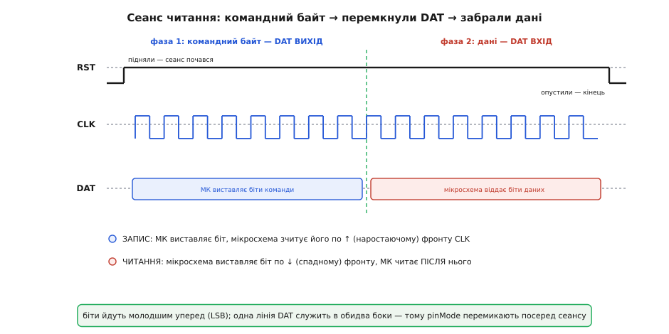

# ⚙️ DS1302 у коді: три піни, готова бібліотека і трипровідний протокол з нуля

<preknowlist>
- [Біти й порядок байтів](topic:programming/bits-bytes-endianness) — байт, старший/молодший біт, зсуви `>>`/`<<`, маска `&`, запис `0x80`; увесь протокол — це висмикування окремих бітів із байта й складання їх назад.
- [BCD — двійково-кодоване десяткове](topic:electronics/bcd-encoding) — десяткова цифра по чотири біти; DS1302 зберігає час саме так, тому кожен байт треба перекодовувати в обидва боки.
- [GPIO — вивід загального призначення](topic:electronics/gpio) — цифрова ніжка як вхід чи вихід, `pinMode`, `digitalWrite`, `digitalRead`, перемикання напрямку; лінія даних мусить бути то входом, то виходом.
</preknowlist>

Модуль розпаяний, п'ять дротів заведено, батарейка на місці — а далі нічого. Між «підключено» і «показує час» лежить рівно один шар: код. І цей код цікавий тим, що його можна написати двома геть різними способами. Перший — узяти готову бібліотеку, вказати їй три піни й за десяток рядків мати структуру часу, яку читаєш у циклі. Другий — написати трипровідний протокол власноруч, «сіпаючи» ніжки: підняти вибір кристала, вигнати командний байт по тактах, перемкнути лінію даних на читання й забрати байт назад. Обидва шляхи ведуть до того самого — але доки не пройдеш другий бодай раз, перший лишається магією, а магію не полагодиш, коли вона зламається.

Тож розберімо все по-справжньому, справжнім кодом, а не псевдокодом. DS1302 не цікавить, хто ним керує: йому треба три звичайні цифрові ніжки, одна з яких уміє бути то виходом, то входом, — а це є на будь-якому мікроконтролері. Тому кожен приклад нижче йде вкладками: **Arduino** (найкоротший вхід у тему), **ESP-IDF** і **STM32 HAL** — суть коду та сама, різняться лише назви викликів середовища. Спершу — короткий надійний шлях бібліотекою, щоб годинник просто пішов. Потім — той самий обмін голими руками, до останнього такту, щоб стало видно, **що** саме бібліотека робить за вас. І наприкінці — розбір пасток, на яких застряє майже кожен: незнятий захист запису, залишений біт зупинки, увімкнений підзаряд на одноразовій батарейці, дводжитний рік і день тижня, який ніхто не рахує за вас.

## Задача, ідея, два шляхи

Задача проста на словах: **виставити в модуль поточний час один раз і далі читати його щоразу після ввімкнення** — навіть якщо між ввімкненнями плату знеструмлювали на тиждень. Годинник має йти сам від свого кварцу й батарейки, а мікроконтролер лише зчитує показ, коли треба поставити мітку в лог, промалювати цифри чи звірити будильник.

Ідея обміну одна на обидва шляхи. DS1302 — це набір однобайтових регістрів (секунди, хвилини, години, число, місяць, день тижня, рік, плюс службові). Щоб торкнутися регістра, мікроконтролер піднімає лінію `RST` (вона ж CE, chip enable — «увімкнути кристал»), висуває **командний байт** (він каже, з яким регістром працюємо й читаємо чи пишемо), тоді або передає байт даних, або забирає його назад, і опускає `RST`. Уся хитрість — у трьох деталях: біти йдуть **молодшим уперед**, дані по одній лінії `DAT` ходять **в обидва боки** (тому ніжку доводиться перемикати вхід↔вихід посеред обміну), а числа лежать не звичайним двійковим кодом, а в BCD. Бібліотека ховає всі три; ручний код показує їх у лоб.

Різниця між шляхами — не в результаті, а в тому, що ви розумієте і що можете полагодити:

- **Бібліотека** — беруть у 95% проєктів. Кілька рядків, і маєш `RtcDateTime` зі зрозумілими полями. Але коли годинник «показує 2165 рік» чи «стоїть на нулях», ви дивитесь у чорну скриньку.
- **Свій протокол** — беруть, коли треба зрозуміти залізо, влізти в чужий баг, ужитися без бібліотеки (інша платформа, жорсткий контроль пам'яті) або зробити щось, чого бібліотека не дає (наприклад, свій формат burst-читання). Марудно, зате видно кожен біт.

## Шлях 1: готова бібліотека — годинник за десять рядків

Найпоширеніша бібліотека для DS1302 в Arduino-світі — **Rtc by Makuna** (Michael C. Miller). Вона зроблена акуратно: розділяє «як говорити по трьох дротах» (клас `ThreeWire`) і «що це за годинник» (клас `RtcDS1302`), тому той самий код лягає й на UNO, і на ESP32 — міняєш лише номери пінів. Ставиться через менеджер бібліотек Arduino IDE: пошук «Rtc by Makuna» → Install. (Це усталений факт: бібліотека роками лідирує в темах про DS1302 і рекомендована в багатьох посібниках.)

Три піни оголошуються одним рядком у порядку **IO, SCLK, CE** — тобто `DAT`, `CLK`, `RST`. Легко переплутати, бо в підписах модуля вони йдуть у звичному порядку CLK/DAT/RST, а конструктор чекає інший. Ось мінімальний, але **правильний** приклад — він не просто «читає час», а й робить те, що новачки пропускають: знімає захист запису й пускає годинник, якщо той стоїть.

Готовий драйвер — річ платформна. В Arduino це Makuna; в ESP-IDF беруть спільнотний компонент `ds1302` (esp-idf-lib) або власний тонкий модуль; у STM32 HAL готового драйвера нема взагалі — там модуль пишуть самі поверх `HAL_GPIO` (це рівно те, що ми зробимо в другій частині). Тож вкладки нижче показують не три різні бібліотеки, а **той самий порядок дій** — зняти захист, пустити генератор, виставити час лише за потреби — засобами кожного середовища.

:::tabs
```arduino
#include <ThreeWire.h>          // низький рівень трипровідного обміну
#include <RtcDS1302.h>          // сам годинник поверх ThreeWire

// Порядок аргументів: IO(DAT), SCLK(CLK), CE(RST) — саме так, не як у підписах плати.
// Класична Arduino UNO/Nano:
ThreeWire myWire(4, 5, 2);      // DAT=D4, CLK=D5, RST=D2
// ESP32 (будь-які вільні GPIO): ThreeWire myWire(27, 14, 26);

RtcDS1302<ThreeWire> Rtc(myWire);

void printDateTime(const RtcDateTime& dt);   // оголошення, тіло — нижче

void setup() {
  Serial.begin(115200);
  while (!Serial && millis() < 2000) { }     // дочекатись термінала, але не вічно

  Rtc.Begin();

  // Час компіляції як стартове значення: __DATE__ і __TIME__ підставляє компілятор.
  // Це момент, коли ви натиснули «Завантажити», з точністю до кількох секунд.
  RtcDateTime compiled = RtcDateTime(__DATE__, __TIME__);

  // 1) Зняти захист запису (WP). Без цього SetDateTime тихо нічого не зробить.
  if (Rtc.GetIsWriteProtected()) {
    Serial.println(F("RTC був захищений від запису — знімаю захист."));
    Rtc.SetIsWriteProtected(false);
  }

  // 2) Пустити годинник, якщо він стоїть (біт CH=1 на свіжій мікросхемі).
  if (!Rtc.GetIsRunning()) {
    Serial.println(F("RTC стояв — запускаю генератор."));
    Rtc.SetIsRunning(true);
  }

  // 3) Виставити час ЛИШЕ якщо збережений менший за час компіляції або недійсний.
  //    Інакше щоразу після перезапуску ви б затирали ЖИВИЙ час часом прошивки.
  RtcDateTime now = Rtc.GetDateTime();
  if (!Rtc.IsDateTimeValid() || now < compiled) {
    Serial.println(F("Час недійсний або застарілий — ставлю час компіляції."));
    Rtc.SetDateTime(compiled);
  }
}

void loop() {
  RtcDateTime now = Rtc.GetDateTime();        // одна структура — весь календар
  printDateTime(now);
  Serial.println();

  if (!now.IsValid()) {
    // Найчастіша причина — розряджена або відсутня батарейка (годинник «забув» час).
    Serial.println(F("!! Час недійсний — перевірте CR2032."));
  }

  delay(5000);                                 // читати раз на 5 с досить
}

void printDateTime(const RtcDateTime& dt) {
  char buf[24];
  snprintf(buf, sizeof(buf), "%04u-%02u-%02u %02u:%02u:%02u",
           dt.Year(), dt.Month(), dt.Day(),
           dt.Hour(), dt.Minute(), dt.Second());
  Serial.print(buf);
}
```
```esp-idf
// Готового драйвера DS1302 в самому ESP-IDF нема: беруть спільнотний компонент
// ds1302 (esp-idf-lib) або власний тонкий модуль — ті самі ds_* із другої частини
// статті, загорнуті в стандартний struct tm.
#include <stdbool.h>
#include <time.h>
#include <sys/time.h>
#include "driver/gpio.h"
#include "esp_log.h"
#include "freertos/FreeRTOS.h"
#include "freertos/task.h"

#define PIN_DAT  GPIO_NUM_27      // I/O  — двонапрямна
#define PIN_CLK  GPIO_NUM_14      // SCLK
#define PIN_RST  GPIO_NUM_26      // CE

static const char *TAG = "ds1302";

esp_err_t ds1302_write_protect(bool on);        // регістр 0x8E
esp_err_t ds1302_start(void);                   // скинути CH
esp_err_t ds1302_get_time(struct tm *t);        // burst-читання
esp_err_t ds1302_set_time(const struct tm *t);

void app_main(void) {
  gpio_config_t io = {
      .pin_bit_mask = (1ULL << PIN_CLK) | (1ULL << PIN_RST),
      .mode = GPIO_MODE_OUTPUT,
      .pull_up_en = GPIO_PULLUP_DISABLE,
      .pull_down_en = GPIO_PULLDOWN_DISABLE,
      .intr_type = GPIO_INTR_DISABLE,
  };
  ESP_ERROR_CHECK(gpio_config(&io));
  gpio_set_level(PIN_RST, 0);                   // сеанс закритий, поки не почали

  ESP_ERROR_CHECK(ds1302_write_protect(false)); // 1) без цього запис зникає мовчки
  ESP_ERROR_CHECK(ds1302_start());              // 2) скинути CH, інакше генератор стоїть

  struct tm t = {0};
  ESP_ERROR_CHECK(ds1302_get_time(&t));
  if (t.tm_year + 1900 < 2025) {                // 3) час недійсний — ставимо один раз
    ESP_LOGW(TAG, "час недійсний — ставлю стартове значення");
    struct tm init = { .tm_sec = 30, .tm_min = 47, .tm_hour = 10,
                       .tm_mday = 4, .tm_mon = 6, .tm_year = 126 };  // 2026-07-04 10:47:30
    ESP_ERROR_CHECK(ds1302_set_time(&init));
  }

  while (true) {
    ESP_ERROR_CHECK(ds1302_get_time(&t));
    // Крок, якого нема в Arduino-версії: віддати час системному годиннику —
    // далі його бачать мітки логу, звірка зі SNTP і вся стандартна time.h.
    struct timeval tv = { .tv_sec = mktime(&t), .tv_usec = 0 };
    settimeofday(&tv, NULL);

    char buf[24];
    strftime(buf, sizeof(buf), "%Y-%m-%d %H:%M:%S", &t);
    ESP_LOGI(TAG, "%s", buf);
    vTaskDelay(pdMS_TO_TICKS(5000));            // читати раз на 5 с досить
  }
}
```
```stm32
/* У STM32 HAL драйвера DS1302 нема взагалі: три ніжки GPIO плюс тонкий модуль
   ds1302_* — ті самі ds_* із другої частини, загорнуті в стандартний struct tm. */
#include "main.h"        /* CubeMX: піни, huart2, SystemClock_Config() */
#include <string.h>
#include <time.h>

extern UART_HandleTypeDef huart2;

void ds1302_init(void);              /* напрями ніжок, CE у 0 */
void ds1302_write_protect(int on);   /* регістр 0x8E */
void ds1302_start(void);             /* скинути CH */
void ds1302_get_time(struct tm *t);  /* burst-читання */
void ds1302_set_time(const struct tm *t);

static void say(const char *s) {     /* друк у термінал через UART */
  HAL_UART_Transmit(&huart2, (uint8_t *)s, strlen(s), HAL_MAX_DELAY);
}

int main(void) {
  HAL_Init();
  SystemClock_Config();
  MX_GPIO_Init();
  MX_USART2_UART_Init();

  ds1302_init();
  ds1302_write_protect(0);           /* 1) зняти WP, інакше запис зникає мовчки */
  ds1302_start();                    /* 2) скинути CH, інакше генератор стоїть  */

  struct tm t = {0};
  ds1302_get_time(&t);
  if (t.tm_year + 1900 < 2025) {     /* 3) час недійсний — ставимо один раз */
    struct tm init = { .tm_sec = 30, .tm_min = 47, .tm_hour = 10,
                       .tm_mday = 4, .tm_mon = 6, .tm_year = 126 };
    ds1302_set_time(&init);
    say("RTC був порожній — виставив стартовий час\r\n");
  }

  char buf[32];
  while (1) {
    ds1302_get_time(&t);
    strftime(buf, sizeof(buf), "%Y-%m-%d %H:%M:%S\r\n", &t);
    say(buf);
    HAL_Delay(5000);                 /* читати раз на 5 с досить */
  }
}
```
:::

Розберімо, чому кожен із трьох кроків ініціалізації (в Arduino вони лягли у `setup()`) — не формальність, а лікування конкретної хвороби.

**Крок «зняти WP».** WP (Write Protect) — старший біт службового регістра `0x8E`. Поки він у 1, будь-який запис у годинник ігнорується мовчки: жодної помилки, `SetDateTime` ніби відпрацював, а регістри лишились старими. `GetIsWriteProtected()`/`SetIsWriteProtected(false)` — це рівно запис `0x00` у `0x8E`, тільки під зрозумілою назвою. Пропустите — і час «не виставляється» без жодного натяку чому.

**Крок «пустити годинник».** CH (Clock Halt) — старший біт регістра секунд. На свіжій мікросхемі він у 1, генератор стоїть (щоб не гнати батарею до першого запуску). `GetIsRunning()` читає цей біт, `SetIsRunning(true)` його гасить. Без цього годинник просто не цокає — ви читаєте те саме число знову й знову.

**Крок «виставити час розумно».** Наївний код пише `SetDateTime(compiled)` беззастережно — і тоді **кожне** ввімкнення відкидає годинник назад до моменту прошивки. Умова `now < compiled` рятує: живий час, що вже втік уперед від часу компіляції, лишається недоторканим, а стартове значення прописується лише коли годинник справді порожній чи збився. Прошили один раз — годинник пішов; вимкнули-ввімкнули — читається справжній поточний час, а не час прошивки.

> 🔧 **Навіщо це.** `__DATE__`/`__TIME__` — безкоштовний спосіб виставити RTC без окремого інтерфейсу вводу: компілятор підставляє момент збирання прямо в прошивку. Для разового налаштування пристрою цього досить; для точності до секунди час потім однаково звіряють по GPS чи мережі, але щоб годинник **пішов**, вистачає одного завантаження.

Що дає бібліотека, крім зручності: `RtcDateTime` уміє арифметику (`now < compiled`, різниці в секундах через `TotalSeconds()`), сам переводить BCD у нормальні числа й назад, знає межі полів. Усе, за що нижче ми страждатимемо руками, тут уже зроблено.

## Шлях 2: трипровідний протокол з нуля

Тепер — те саме без бібліотеки, голими ніжками. Мета не «переписати Makuna», а **побачити механізм**: як один командний байт вибирає регістр і напрям, як біти повзуть по фронтах такту, як одна лінія `DAT` встигає бути і виходом, і входом. Коли це побачено, будь-який дивний баг DS1302 стає прозорим.

### Піни й службові адреси

Почнімо з визначень. Три сигнальні лінії — на будь-які цифрові GPIO. Адреси регістрів — рівно ті, що в даташиті: командний байт має старший біт 1, біт 6 обирає годинник (0) чи RAM (1), біти 5..1 — адресу регістра, а **молодший біт задає напрям**: 0 — запис, 1 — читання. Тому кожен регістр має дві константи, що відрізняються на одиницю.

:::tabs
```arduino
#include <Arduino.h>

// ── Піни: будь-які цифрові GPIO ──
const uint8_t PIN_CLK = 5;   // такт  (SCLK)
const uint8_t PIN_DAT = 4;   // дані  (I/O) — двонапрямні
const uint8_t PIN_RST = 2;   // вибір кристала (CE)
```
```esp-idf
#include "driver/gpio.h"

// ── Піни: будь-які цифрові GPIO ──
#define PIN_CLK  GPIO_NUM_14   // такт  (SCLK)
#define PIN_DAT  GPIO_NUM_27   // дані  (I/O) — двонапрямні
#define PIN_RST  GPIO_NUM_26   // вибір кристала (CE)
// Не беріть під DAT ніжки GPIO34..39: вони вміють лише вхід,
// а лінія даних мусить бути й виходом.
```
```stm32
#include "main.h"              // CubeMX: піни підписані в .ioc

// ── Піни: будь-які цифрові GPIO ──
#define CLK_PORT GPIOB
#define CLK_PIN  GPIO_PIN_6    // такт  (SCLK)
#define DAT_PORT GPIOB
#define DAT_PIN  GPIO_PIN_7    // дані  (I/O) — двонапрямні
#define RST_PORT GPIOB
#define RST_PIN  GPIO_PIN_5    // вибір кристала (CE)
```
:::

Адреси ж від платформи не залежать зовсім — це числа з даташита, однакові скрізь:

```c
// ── Адреси регістрів: парна = запис, непарна = читання ──
// (біт7=1; біт6=0 годинник; біти5..1 адреса; біт0 = напрям)
const uint8_t REG_SECONDS = 0x80;   // читання 0x81
const uint8_t REG_MINUTES = 0x82;   // 0x83
const uint8_t REG_HOURS   = 0x84;   // 0x85
const uint8_t REG_DATE    = 0x86;   // число місяця,     0x87
const uint8_t REG_MONTH   = 0x88;   // 0x89
const uint8_t REG_DOW     = 0x8A;   // день тижня 1..7,  0x8B
const uint8_t REG_YEAR    = 0x8C;   // 00..99,           0x8D
const uint8_t REG_WP      = 0x8E;   // захист запису,    0x8F
const uint8_t REG_TRICKLE = 0x90;   // підзаряд,         0x91

const uint8_t CLK_BURST   = 0xBE;   // запис усіх регістрів пачкою; читання 0xBF
```

### Хелпери BCD: без них час — нісенітниця

DS1302 тримає числа в BCD (Binary-Coded Decimal): кожна десяткова цифра — у своїх чотирьох бітах, старший нібл — десятки, молодший — одиниці. «45 секунд» лежить як `0x45` (нібл 4 і нібл 5), а не як двійкове 45 (`0x2D`). Тому перед записом переводимо десяткове → BCD, після читання BCD → десяткове. Два коротких перетворення — і без них годинник покаже маячню.

:::tabs
```cpp
// десяткове (0..99)  ->  BCD
uint8_t dec_to_bcd(uint8_t v) {
  return (uint8_t)(((v / 10) << 4) | (v % 10));
}

// BCD  ->  десяткове
uint8_t bcd_to_dec(uint8_t v) {
  return (uint8_t)(((v >> 4) * 10) + (v & 0x0F));
}
```
```python
# десяткове (0..99)  ->  BCD
def dec_to_bcd(v: int) -> int:
    return ((v // 10) << 4) | (v % 10)

# BCD  ->  десяткове
def bcd_to_dec(v: int) -> int:
    return (v >> 4) * 10 + (v & 0x0F)
```
:::

**Приклад: 45 секунд туди й назад.**

:::tabs
```cpp
uint8_t reg = dec_to_bcd(45);
// (45 / 10) << 4 = 4 << 4 = 0x40
// (45 % 10)      = 5      = 0x05
// reg = 0x40 | 0x05 = 0x45          ← кладемо в регістр секунд

uint8_t back = bcd_to_dec(0x45);
// (0x45 >> 4) * 10 = 4 * 10 = 40
// (0x45 & 0x0F)    = 5
// back = 45                          ← знову людське число
```
```python
reg = dec_to_bcd(45)
# (45 // 10) << 4 = 4 << 4 = 0x40
# (45 % 10)       = 5      = 0x05
# reg = 0x40 | 0x05 = 0x45          ← кладемо в регістр секунд

back = bcd_to_dec(0x45)
# (0x45 >> 4) * 10 = 4 * 10 = 40
# (0x45 & 0x0F)    = 5
# back = 45                          ← знову людське число
```
:::

### Один байт по тактах: молодший біт уперед

Тепер серце протоколу — передача й приймання одного байта. Правило часу в DS1302 таке: **при записі** мікроконтролер виставляє біт на лінію `DAT`, а мікросхема зчитує його по **наростаючому** фронту `CLK`; **при читанні** мікросхема виставляє свій біт, а мікроконтролер забирає його **після спадного** фронту `CLK`. Біти йдуть **молодшим уперед** (LSB-first): спершу біт 0, останнім біт 7. Це підтверджує і даташит, і його часова діаграма (останній такт адреси наростаючим фронтом — водночас перший такт даних для читання спадним).

:::tabs
```arduino
// Виставити один байт у мікросхему (біти 0..7, молодший уперед).
// DAT має бути вже переведений на ВИХІД.
void shift_out_byte(uint8_t v) {
  for (uint8_t i = 0; i < 8; i++) {
    digitalWrite(PIN_DAT, (v >> i) & 0x01);   // виставили біт i
    digitalWrite(PIN_CLK, HIGH);              // ↑ фронт: мікросхема зчитала
    delayMicroseconds(1);
    digitalWrite(PIN_CLK, LOW);               // ↓ готуємось до наступного біта
    delayMicroseconds(1);
  }
}

// Забрати один байт із мікросхеми (біти 0..7, молодший уперед).
// DAT має бути вже переведений на ВХІД.
uint8_t shift_in_byte() {
  uint8_t v = 0;
  for (uint8_t i = 0; i < 8; i++) {
    // Мікросхема міняє біт по спадному фронту; читаємо ПІСЛЯ нього.
    if (digitalRead(PIN_DAT)) v |= (1 << i);
    digitalWrite(PIN_CLK, HIGH);              // такт для наступного біта
    delayMicroseconds(1);
    digitalWrite(PIN_CLK, LOW);               // ↓ фронт: мікросхема виставила новий біт
    delayMicroseconds(1);
  }
  return v;
}
```
```esp-idf
#include "driver/gpio.h"
#include "esp_rom_sys.h"        // esp_rom_delay_us() — мікросекундна пауза без RTOS

// Виставити один байт у мікросхему (біти 0..7, молодший уперед).
// DAT уже переведений на ВИХІД (gpio_set_direction).
static void shift_out_byte(uint8_t v) {
  for (int i = 0; i < 8; i++) {
    gpio_set_level(PIN_DAT, (v >> i) & 0x01);  // виставили біт i
    gpio_set_level(PIN_CLK, 1);                // ↑ фронт: мікросхема зчитала
    esp_rom_delay_us(1);
    gpio_set_level(PIN_CLK, 0);                // ↓ готуємось до наступного біта
    esp_rom_delay_us(1);
  }
}

// Забрати один байт із мікросхеми. DAT уже переведений на ВХІД.
static uint8_t shift_in_byte(void) {
  uint8_t v = 0;
  for (int i = 0; i < 8; i++) {
    // Мікросхема міняє біт по спадному фронту; читаємо ПІСЛЯ нього.
    if (gpio_get_level(PIN_DAT)) v |= (1 << i);
    gpio_set_level(PIN_CLK, 1);                // такт для наступного біта
    esp_rom_delay_us(1);
    gpio_set_level(PIN_CLK, 0);                // ↓ фронт: новий біт на лінії
    esp_rom_delay_us(1);
  }
  return v;
}
```
```stm32
#include "main.h"

/* Мікросекунди HAL не дає: HAL_Delay рахує міліСЕКУНДИ. DS1302 точності не
   вимагає (шина до 2 МГц), тож вистачає грубого люфту на NOP-ах. */
static inline void ds_delay_us(uint32_t us) {
  uint32_t n = us * (SystemCoreClock / 1000000U) / 4U;   /* ~4 такти на виток */
  while (n--) __NOP();
}

/* Виставити один байт (біти 0..7, молодший уперед). DAT уже на ВИХІД. */
static void shift_out_byte(uint8_t v) {
  for (int i = 0; i < 8; i++) {
    HAL_GPIO_WritePin(DAT_PORT, DAT_PIN,
                      ((v >> i) & 1) ? GPIO_PIN_SET : GPIO_PIN_RESET);
    HAL_GPIO_WritePin(CLK_PORT, CLK_PIN, GPIO_PIN_SET);    /* ↑ мікросхема зчитала */
    ds_delay_us(1);
    HAL_GPIO_WritePin(CLK_PORT, CLK_PIN, GPIO_PIN_RESET);
    ds_delay_us(1);
  }
}

/* Забрати один байт. DAT уже на ВХІД. */
static uint8_t shift_in_byte(void) {
  uint8_t v = 0;
  for (int i = 0; i < 8; i++) {
    if (HAL_GPIO_ReadPin(DAT_PORT, DAT_PIN) == GPIO_PIN_SET) v |= (1u << i);
    HAL_GPIO_WritePin(CLK_PORT, CLK_PIN, GPIO_PIN_SET);
    ds_delay_us(1);
    HAL_GPIO_WritePin(CLK_PORT, CLK_PIN, GPIO_PIN_RESET);  /* ↓ новий біт на лінії */
    ds_delay_us(1);
  }
  return v;
}
```
:::

Зверніть увагу на асиметрію циклів. При записі спершу виставляємо біт, потім даємо фронт. При читанні спершу забираємо те, що вже на лінії, і **аж потім** даємо фронт, який зсуне наступний біт, — бо перший біт даних мікросхема виставила ще спадним фронтом останнього такту адреси. Плутати ці два порядки — класична причина «читається сміття, хоча записалось нормально».

### Перемикання напряму: та сама ніжка — то вихід, то вхід

Ось той нюанс, якого немає ні в I²C, ні в SPI. Лінія `DAT` — одна на обидва напрями. Коли пишемо команду — вона вихід мікроконтролера. Коли після команди читаємо дані — та сама ніжка мусить стати входом, інакше два виходи (наш і мікросхеми) битимуться за лінію. Тому цикл читання завжди має форму: підняли `RST` → `DAT` на вихід → вигнали командний байт (із бітом читання) → **`DAT` на вхід** → забрали байт → опустили `RST`.


*Увесь сеанс RST тримається піднятим; біти записуються по наростаючому фронту CLK, читаються по спадному, молодшим уперед; посеред сеансу напрям ніжки DAT перемикають з виходу на вхід.*

:::tabs
```arduino
// ── Один регістр: запис ──
void ds_write(uint8_t cmd, uint8_t data) {
  digitalWrite(PIN_RST, LOW);
  digitalWrite(PIN_CLK, LOW);
  pinMode(PIN_DAT, OUTPUT);
  digitalWrite(PIN_RST, HIGH);      // почали сеанс

  shift_out_byte(cmd);              // командний байт (біт0 = 0, запис)
  shift_out_byte(data);             // байт даних

  digitalWrite(PIN_RST, LOW);       // завершили — дані зафіксовано
}

// ── Один регістр: читання ──
uint8_t ds_read(uint8_t cmd) {
  digitalWrite(PIN_RST, LOW);
  digitalWrite(PIN_CLK, LOW);
  pinMode(PIN_DAT, OUTPUT);
  digitalWrite(PIN_RST, HIGH);      // почали сеанс

  shift_out_byte(cmd | 0x01);       // командний байт із бітом ЧИТАННЯ (біт0=1)
  pinMode(PIN_DAT, INPUT);          // ← ключове: віддаємо лінію мікросхемі
  uint8_t data = shift_in_byte();   // забрали байт

  digitalWrite(PIN_RST, LOW);       // завершили сеанс
  return data;
}
```
```esp-idf
// DAT сконфігуровано один раз (gpio_config), а напрям міняємо просто на льоту.

// ── Один регістр: запис ──
static void ds_write(uint8_t cmd, uint8_t data) {
  gpio_set_level(PIN_RST, 0);
  gpio_set_level(PIN_CLK, 0);
  gpio_set_direction(PIN_DAT, GPIO_MODE_OUTPUT);
  gpio_set_level(PIN_RST, 1);                    // почали сеанс

  shift_out_byte(cmd);                           // командний байт (біт0 = 0, запис)
  shift_out_byte(data);                          // байт даних

  gpio_set_level(PIN_RST, 0);                    // завершили — дані зафіксовано
}

// ── Один регістр: читання ──
static uint8_t ds_read(uint8_t cmd) {
  gpio_set_level(PIN_RST, 0);
  gpio_set_level(PIN_CLK, 0);
  gpio_set_direction(PIN_DAT, GPIO_MODE_OUTPUT);
  gpio_set_level(PIN_RST, 1);                    // почали сеанс

  shift_out_byte(cmd | 0x01);                    // командний байт із бітом ЧИТАННЯ
  gpio_set_direction(PIN_DAT, GPIO_MODE_INPUT);  // ← віддаємо лінію мікросхемі
  uint8_t data = shift_in_byte();                // забрали байт

  gpio_set_level(PIN_RST, 0);                    // завершили сеанс
  return data;
}
```
```stm32
/* На STM32 напрям ніжки міняється переініціалізацією: та сама структура,
   інше поле Mode. Це дорожче за один регістровий запис, але чесно й наочно. */
static void dat_dir(uint32_t mode) {      /* GPIO_MODE_OUTPUT_PP або GPIO_MODE_INPUT */
  GPIO_InitTypeDef g = {0};
  g.Pin   = DAT_PIN;
  g.Mode  = mode;
  g.Pull  = GPIO_NOPULL;
  g.Speed = GPIO_SPEED_FREQ_LOW;
  HAL_GPIO_Init(DAT_PORT, &g);
}

/* ── Один регістр: запис ── */
static void ds_write(uint8_t cmd, uint8_t data) {
  HAL_GPIO_WritePin(RST_PORT, RST_PIN, GPIO_PIN_RESET);
  HAL_GPIO_WritePin(CLK_PORT, CLK_PIN, GPIO_PIN_RESET);
  dat_dir(GPIO_MODE_OUTPUT_PP);
  HAL_GPIO_WritePin(RST_PORT, RST_PIN, GPIO_PIN_SET);   /* почали сеанс */

  shift_out_byte(cmd);                                  /* біт0 = 0, запис */
  shift_out_byte(data);

  HAL_GPIO_WritePin(RST_PORT, RST_PIN, GPIO_PIN_RESET); /* дані зафіксовано */
}

/* ── Один регістр: читання ── */
static uint8_t ds_read(uint8_t cmd) {
  HAL_GPIO_WritePin(RST_PORT, RST_PIN, GPIO_PIN_RESET);
  HAL_GPIO_WritePin(CLK_PORT, CLK_PIN, GPIO_PIN_RESET);
  dat_dir(GPIO_MODE_OUTPUT_PP);
  HAL_GPIO_WritePin(RST_PORT, RST_PIN, GPIO_PIN_SET);

  shift_out_byte(cmd | 0x01);                           /* біт0 = 1, читання */
  dat_dir(GPIO_MODE_INPUT);                             /* ← лінія за мікросхемою */
  uint8_t data = shift_in_byte();

  HAL_GPIO_WritePin(RST_PORT, RST_PIN, GPIO_PIN_RESET);
  return data;
}
```
:::

Тепер два кроки-запобіжники з даташита, без яких годинник або стоїть, або не пускає себе виставити, — тепер видно, що це просто два записи в службові регістри.

```cpp
// Зняти захист запису: WP=0. Робити ПЕРЕД будь-яким записом часу.
void ds_write_protect_off() { ds_write(REG_WP, 0x00); }
// (за бажання після запису повернути: ds_write(REG_WP, 0x80);)

// Пустити генератор: скинути CH (біт7 регістра секунд).
// Читаємо поточні секунди, гасимо старший біт, пишемо назад — щоб не втратити самі секунди.
void ds_clock_start() {
  uint8_t s = ds_read(REG_SECONDS);   // BCD-секунди, можливо з CH=1
  s &= 0x7F;                          // гасимо біт7 (CH), решту лишаємо
  ds_write(REG_SECONDS, s);
}
```

### Виставити час і прочитати його назад

Зберемо це в дві дії, які й потрібні на практиці. Проста структура під час — і функція, що кладе її в мікросхему; читання ми зробимо надійно, пачкою (нижче).

```cpp
struct Clock {
  uint8_t sec, min, hour;      // 0..59, 0..59, 0..23
  uint8_t date, month;         // 1..31, 1..12
  uint8_t dow;                 // день тижня 1..7 (виставляєте самі!)
  uint8_t year;                // 00..99 (додаєте 2000 у своєму коді)
};

void ds_set_time(const Clock& c) {
  ds_write_protect_off();                       // 1) WP off — інакше все марно

  // 2) Секунди пишемо з ГАРАНТОВАНО скинутим CH (біт7=0), щоб пустити годинник.
  ds_write(REG_SECONDS, dec_to_bcd(c.sec) & 0x7F);
  ds_write(REG_MINUTES, dec_to_bcd(c.min));
  ds_write(REG_HOURS,   dec_to_bcd(c.hour));     // біт7=0 → 24-годинний режим
  ds_write(REG_DATE,    dec_to_bcd(c.date));
  ds_write(REG_MONTH,   dec_to_bcd(c.month));
  ds_write(REG_DOW,     dec_to_bcd(c.dow));
  ds_write(REG_YEAR,    dec_to_bcd(c.year));

  ds_write(REG_WP, 0x80);                        // 3) знову захистити — від збоїв на шині
}
```

Тут зашито дві тонкощі. Секунди пишемо з примусово скинутим бітом 7 (`& 0x7F`) — це **той самий** запуск годинника, тільки вбудований у момент установки: виставляючи коректні секунди, ви автоматично гасите CH. І години: у DS1302 біт 7 регістра годин обирає режим — 0 означає звичний 24-годинний (біт 5 тоді просто десятки годин), 1 вмикає 12-годинний із біт-«PM». Ми лишаємо біт 7 у нулі й живемо в 24-годинному світі, де година — це просто число 0–23 у BCD. Плутанина 12/24 — ще одне джерело «години показуються дивно».

### Burst: зчитати весь момент часу цілісним

Тепер найкорисніше для читання. Якщо тягати регістри по одному, є ризик, що між читанням секунд і хвилин настане нова хвилина — і ви складете час із «до» і «після» переходу (наприклад, побачите 10:59 замість 11:00 або навпаки). Даташит дає на це burst-режим: командний байт `0xBF` (читання пачкою) вмикає режим, у якому мікросхема віддає **всі вісім годинникових регістрів поспіль за один сеанс**, зафіксувавши їхній стан на початок читання. Так момент часу лишається цілісним.

:::tabs
```arduino
// Прочитати весь календар одним «burst»-сеансом — цілісний зріз часу.
void ds_read_burst(Clock& c) {
  digitalWrite(PIN_RST, LOW);
  digitalWrite(PIN_CLK, LOW);
  pinMode(PIN_DAT, OUTPUT);
  digitalWrite(PIN_RST, HIGH);

  shift_out_byte(0xBF);            // clock-burst READ (0xBE — запис пачкою)
  pinMode(PIN_DAT, INPUT);        // віддаємо лінію мікросхемі на всі 8 байтів

  uint8_t raw[8];
  for (uint8_t i = 0; i < 8; i++) raw[i] = shift_in_byte();

  digitalWrite(PIN_RST, LOW);

  // Порядок регістрів у пачці фіксований даташитом:
  // 0:сек 1:хв 2:год 3:число 4:місяць 5:день-тижня 6:рік 7:захист
  c.sec   = bcd_to_dec(raw[0] & 0x7F);   // маскуємо CH (біт7)
  c.min   = bcd_to_dec(raw[1] & 0x7F);
  c.hour  = bcd_to_dec(raw[2] & 0x3F);   // 24-год: беремо біти 0..5
  c.date  = bcd_to_dec(raw[3] & 0x3F);
  c.month = bcd_to_dec(raw[4] & 0x1F);
  c.dow   = bcd_to_dec(raw[5] & 0x07);
  c.year  = bcd_to_dec(raw[6]);
  // raw[7] — регістр захисту, у зрізі часу не потрібен
}
```
```esp-idf
// Той самий burst: один сеанс, вісім байтів, розкодування те саме.
static void ds_read_burst(struct Clock *c) {
  gpio_set_level(PIN_RST, 0);
  gpio_set_level(PIN_CLK, 0);
  gpio_set_direction(PIN_DAT, GPIO_MODE_OUTPUT);
  gpio_set_level(PIN_RST, 1);

  shift_out_byte(0xBF);                          // clock-burst READ
  gpio_set_direction(PIN_DAT, GPIO_MODE_INPUT);  // лінія за мікросхемою на всі 8 байтів

  uint8_t raw[8];
  for (int i = 0; i < 8; i++) raw[i] = shift_in_byte();

  gpio_set_level(PIN_RST, 0);

  c->sec   = bcd_to_dec(raw[0] & 0x7F);          // маскуємо CH (біт7)
  c->min   = bcd_to_dec(raw[1] & 0x7F);
  c->hour  = bcd_to_dec(raw[2] & 0x3F);          // 24-год: біти 0..5
  c->date  = bcd_to_dec(raw[3] & 0x3F);
  c->month = bcd_to_dec(raw[4] & 0x1F);
  c->dow   = bcd_to_dec(raw[5] & 0x07);
  c->year  = bcd_to_dec(raw[6]);
}
```
```stm32
/* Той самий burst: один сеанс, вісім байтів, розкодування те саме. */
static void ds_read_burst(struct Clock *c) {
  HAL_GPIO_WritePin(RST_PORT, RST_PIN, GPIO_PIN_RESET);
  HAL_GPIO_WritePin(CLK_PORT, CLK_PIN, GPIO_PIN_RESET);
  dat_dir(GPIO_MODE_OUTPUT_PP);
  HAL_GPIO_WritePin(RST_PORT, RST_PIN, GPIO_PIN_SET);

  shift_out_byte(0xBF);                 /* clock-burst READ */
  dat_dir(GPIO_MODE_INPUT);             /* лінія за мікросхемою на всі 8 байтів */

  uint8_t raw[8];
  for (int i = 0; i < 8; i++) raw[i] = shift_in_byte();

  HAL_GPIO_WritePin(RST_PORT, RST_PIN, GPIO_PIN_RESET);

  c->sec   = bcd_to_dec(raw[0] & 0x7F); /* маскуємо CH (біт7) */
  c->min   = bcd_to_dec(raw[1] & 0x7F);
  c->hour  = bcd_to_dec(raw[2] & 0x3F); /* 24-год: біти 0..5 */
  c->date  = bcd_to_dec(raw[3] & 0x3F);
  c->month = bcd_to_dec(raw[4] & 0x1F);
  c->dow   = bcd_to_dec(raw[5] & 0x07);
  c->year  = bcd_to_dec(raw[6]);
}
```
:::

Маски тут — не косметика. У сирих байтах поруч із цифрами сидять службові біти: у секундах — CH (біт 7), у годинах — біт вибору 12/24 і біт PM. Якщо не змаскувати, `bcd_to_dec` прийме службовий біт за частину числа й дасть, скажімо, «84 секунди». Кожна маска зрізає рівно ті біти, що не є цифрами цього поля: `0x7F` лишає 7 бітів (секунди/хвилини 0–59), `0x3F` — 6 бітів (години 0–23, число 1–31), `0x1F` — 5 бітів (місяць 1–12), `0x07` — 3 біти (день тижня 1–7).

### Усе разом: робоча програма

:::tabs
```arduino
void setup() {
  Serial.begin(115200);
  while (!Serial && millis() < 2000) { }

  pinMode(PIN_CLK, OUTPUT);
  pinMode(PIN_RST, OUTPUT);
  digitalWrite(PIN_RST, LOW);          // сеанс закритий, поки не почали

  // Пустити годинник, якщо стоїть (скинути CH). Час НЕ чіпаємо, якщо вже йде.
  ds_write_protect_off();
  ds_clock_start();
  ds_write(REG_WP, 0x80);

  // Виставити час ОДИН раз, якщо мікросхема свіжа. Розкоментуйте, прошийте,
  // тоді закоментуйте назад і прошийте вдруге — інакше час скидатиметься щоразу.
  // Clock init = { 30, 47, 10, 4, 7, 5, 26 };  // 10:47:30, 4 липня, чт(5), 2026
  // ds_set_time(init);
}

void loop() {
  Clock now;
  ds_read_burst(now);

  char buf[32];
  snprintf(buf, sizeof(buf), "20%02u-%02u-%02u %02u:%02u:%02u  (дн.тижня %u)",
           now.year, now.month, now.date,
           now.hour, now.min, now.sec, now.dow);
  Serial.println(buf);

  delay(1000);
}
```
```esp-idf
void app_main(void) {
  gpio_config_t io = {
      .pin_bit_mask = (1ULL << PIN_CLK) | (1ULL << PIN_RST) | (1ULL << PIN_DAT),
      .mode = GPIO_MODE_OUTPUT,          // напрям DAT далі міняємо на льоту
      .pull_up_en = GPIO_PULLUP_DISABLE,
      .pull_down_en = GPIO_PULLDOWN_DISABLE,
      .intr_type = GPIO_INTR_DISABLE,
  };
  ESP_ERROR_CHECK(gpio_config(&io));
  gpio_set_level(PIN_RST, 0);            // сеанс закритий, поки не почали

  ds_write_protect_off();                // пустити годинник, якщо стоїть
  ds_clock_start();
  ds_write(REG_WP, 0x80);

  // Виставити час ОДИН раз на свіжій мікросхемі — розкоментуйте, прошийте,
  // тоді закоментуйте назад: інакше час скидатиметься при кожному старті.
  // struct Clock init = { 30, 47, 10, 4, 7, 5, 26 };
  // ds_set_time(&init);

  while (true) {
    struct Clock now;
    ds_read_burst(&now);
    ESP_LOGI(TAG, "20%02u-%02u-%02u %02u:%02u:%02u  (дн.тижня %u)",
             now.year, now.month, now.date, now.hour, now.min, now.sec, now.dow);
    vTaskDelay(pdMS_TO_TICKS(1000));
  }
}
```
```stm32
int main(void) {
  HAL_Init();
  SystemClock_Config();
  MX_GPIO_Init();                 /* CLK і RST — виходи; напрям DAT міняємо на льоту */
  MX_USART2_UART_Init();

  HAL_GPIO_WritePin(RST_PORT, RST_PIN, GPIO_PIN_RESET);  /* сеанс закритий */

  ds_write_protect_off();         /* пустити годинник, якщо стоїть */
  ds_clock_start();
  ds_write(REG_WP, 0x80);

  /* Виставити час ОДИН раз на свіжій мікросхемі — розкоментуйте, прошийте,
     тоді закоментуйте назад: інакше час скидатиметься при кожному старті.
     struct Clock init = { 30, 47, 10, 4, 7, 5, 26 };
     ds_set_time(&init); */

  char buf[48];
  while (1) {
    struct Clock now;
    ds_read_burst(&now);
    int n = snprintf(buf, sizeof(buf), "20%02u-%02u-%02u %02u:%02u:%02u  (дн.тижня %u)\r\n",
                     now.year, now.month, now.date, now.hour, now.min, now.sec, now.dow);
    HAL_UART_Transmit(&huart2, (uint8_t *)buf, n, HAL_MAX_DELAY);
    HAL_Delay(1000);
  }
}
```
:::

Порівняйте цю програму з бібліотечною. Той самий результат — рядок часу в терміналі — але тепер видно кожну ланку: пуск генератора, зняття/повернення захисту, цілісне burst-читання, розкодування BCD із масками. Коли годинник поведеться дивно, ви знатимете, який саме біт дивитися.

## Складність і пастки

Протокол DS1302 не важкий — важко лише не наступити на п'ять граблів, кожні з яких дають скаргу «не працює», причому мовчки, без жодної помилки. Ось вони, від найпоширенішого до найпідступнішого.

**1. Незнятий WP — запис «нікуди не йде».** Поки WP=1 (старший біт `0x8E`), мікросхема ігнорує будь-який запис у час і RAM — без натяку. `SetDateTime`/`ds_set_time` ніби відпрацювали, а регістри старі. Лікування одне: `ds_write(0x8E, 0x00)` (або `SetIsWriteProtected(false)`) **перед** записом. Симптом: час не виставляється, хоч код виглядає правильним.

**2. Залишений CH — годинник стоїть.** CH=1 (старший біт секунд) на свіжій мікросхемі, генератор зупинено. Вставили батарейку, підключили — а час не йде: читаєте одне й те саме число. Лікування: скинути біт 7 секунд (`ds_clock_start` або `SetIsRunning(true)`). Симптом: секунди не міняються між зчитуваннями.

**3. Увімкнений trickle-charge на CR2032 — роздута батарейка.** Регістр підзаряду `0x90` уміє потроху заряджати резервне джерело від основного живлення. Це задумано під **акумуляторні** LIR2032 чи іонистори. Але народний модуль часто продають із **одноразовою** CR2032, яку заряджати не можна — перегріється, потече, здується. Гарна новина: DS1302 стартує з **вимкненим** підзарядом, і поки ви **не пишете** в `0x90`, батарея в безпеці. Правило залізне: **із CR2032 регістр `0x90` не чіпати ніколи.** Хочете підзаряд — ставте LIR2032 і аж тоді програмуйте `0x90`. Симптом найгірший, бо не в коді, а в залізі: здута або протікла батарейка в пристрої.

> 🔧 **Навіщо це.** Три перші пастки — це причина майже всіх питань «чому мій DS1302 не працює». Годинник стоїть → CH. Час не виставляється → WP. Батарея здулась → хтось увімкнув підзаряд на CR2032. Знаючи механізм, ви економите вечір з логічним аналізатором і, у випадку підзаряду, — цілу батарейку.

**4. Дводжитний рік — «проблема 2000-го» у прошивці.** Регістр року тримає лише 00–99; про століття мікросхема не знає нічого. Тому в коді ви завжди додаєте базу (`20xx`), а перехід 99→00 обробляєте самі, якщо пристрій має пережити 2099-й. Це не баг конкретного чипа, а спадок цілого класу старих RTC: століття вирішується домовленістю в прошивці, не в залізі. Симптом: «2026 рік показується як 26» або дивні дати, якщо забути додати 2000.

**5. День тижня ніхто не рахує за вас.** DS1302 тримає день тижня окремим лічильником 1–7, який просто інкрементується щодоби, — і **не виводить** його з дати. Виставили при налаштуванні «5» (умовно четвер) — і далі він повзе сам, не звіряючись із числом. Помилилися при установці — «четвер» так і поповзе зсунутим назавжди, поки не перевиставите. Дві типові відповіді: або раз правильно порахувати день тижня для стартової дати (формулою Целлера чи просто підглянувши в календар) і виставити його разом із часом, або взагалі ігнорувати цей регістр і рахувати день тижня в коді з дати. Симптом: дата правильна, а «понеділок/вівторок» зсунуті.

Дрібніші, але варті згадки:

- **Порядок пінів у конструкторі бібліотеки — IO, SCLK, CE** (DAT, CLK, RST), а не як у підписах плати CLK/DAT/RST. Переплутали — обмін не піде взагалі.
- **Режим 12/24 годин.** Біт 7 регістра годин: 0 — 24-годинний (беремо просто число), 1 — 12-годинний із біт-PM. Тримайте біт 7 у нулі й маскуйте години `& 0x3F`, інакше «13:00» перетвориться на «1:00 PM» плутанину.
- **Наївний `SetDateTime` при кожному старті** відкидає годинник назад до часу прошивки щоразу. Ставте час лише за умовою (`now < compiled` чи «недійсний»), а не беззастережно — інакше пристрій вічно живе в моменті останнього завантаження.

Підсумок простий. Бібліотека Makuna ховає BCD, CH, WP і burst — і для більшості проєктів цього досить, треба лише не забути зняти захист і пустити годинник під час ініціалізації. Ручний код тих самих операцій показує, **чому** годинник поводиться так чи так: командний байт вибирає регістр і напрям, біти йдуть молодшим уперед по фронтах такту, одна лінія `DAT` служить в обидва боки, а числа скрізь у BCD. Побачивши це бодай раз, ви більше не бентежитесь, коли DS1302 «показує дурницю»: знаєте рівно, який біт подивитися.
