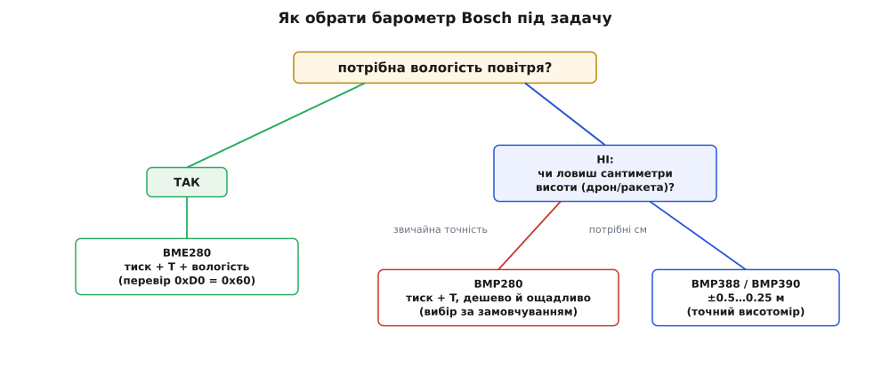

# 📜 Як барометр переїхав із метеобудки в кишеню: родина Bosch BMP/BME

Барометр — прилад старий, поважний і, як усі уявляли собі ще на початку 2000-х, чималий. Скляна трубка з ртуттю в кабінеті природознавства; коробка з пружинним анероїдом і стрілкою «ясно / мінлива / дощ» на дачній веранді; чутливий прецизійний давач у метеобудці на летовищі. Усе це — прилади, які тримаєш у руках або вішаєш на стіну. І раптом, десь між 2011 і 2015 роками, той самий барометр опинився всередині телефона, фітнес-браслета й квадрокоптера — мовчазним квадратиком завбільшки з макове зерно, що коштує менше долара. Ця стаття — про те, як так сталося: хто зробив барометр таким маленьким, навіщо це раптом знадобилося, і як із однієї родини мікросхем Bosch (BMP085 → BMP180 → BMP280 → BME280 і далі) виросла ціла лінійка, у якій новачок сьогодні щиро плутається, котру ж узяти.

Одразу — про походження назв, бо вони тут говорять. **Bosch** — це той самий німецький Bosch, велетень із дриля­ми, форсунками й побутовою технікою; давачі робить його підрозділ **Bosch Sensortec**, заснований 2005 року саме під MEMS для споживчої електроніки (джерело: власні матеріали Bosch Sensortec; статус — підтверджено). «MEMS» (англ. *Micro-Electro-Mechanical Systems* — мікроелектромеханічні системи) — це крихітні механічні штучки, витравлені в кремнії тими самими методами, якими роблять мікросхеми: балка, що гнеться; мембрана, що прогинається; гребінка, що коливається. Саме MEMS дозволила стиснути барометр із анероїдної коробки до цятки на кристалі. А літери в назві мікросхеми — **B**arometric **M**easurement **P**ressure — і читаються буквально: «барометричний вимір тиску».

## Що взагалі бентежило: барометр — це важко

Перш ніж хвалити тих, хто зробив барометр малим, варто відчути, чому це складно. Термометр змалів легко: опір або напруга залежать від температури майже самі собою, вимірюй та й усе. А тиск — це сила, розмазана по площі. Щоб її відчути, потрібна **мембрана**: тонка плівка, з одного боку якої атмосфера, а з іншого — запаяна порожнина з відомим (або нульовим) тиском. Атмосфера тисне сильніше — мембрана прогинається глибше. Лишається зміряти цей прогин, і то з дикою точністю.

Наскільки дикою? Ось відчуття масштабу. Піднялися ви сходами на один поверх — на якісь три метри вгору. Стовп повітря над вами став коротший рівно на ці три метри, і тиск упав приблизно на:

```
Δp ≈ ρ·g·Δh
   ≈ 1.2 кг/м³ · 9.81 м/с² · 3 м
   ≈ 35 Па
```

Тридцять п'ять паскалів — це 0.35 гПа зі звичних ~1013 гПа біля моря. Тобто підйом на поверх змінює тиск на три десятитисячні від повної величини. Щоб барометр «побачив» сходинку, він мусить розрізняти зміни на рівні сотих гектопаскаля на тлі, що само по собі гуляє від погоди на десятки гектопаскалів. Це як зважити капітана корабля, зважуючи корабель із капітаном і без нього. Саме тому довго барометр лишався або великим і дорогим (лабораторний), або грубим і приблизним (дачний анероїд) — золотої середини «дешево, дрібно й точно» просто не існувало.

> 🔧 **Навіщо це.** Уся подальша історія — про закриття цієї прірви. Кожне нове покоління Bosch відповідало на те саме питання: як витягти зі шматочка кремнію ще дрібнішу зміну тиску, ще й не з'ївши при цьому батарею телефона. Роздільність у частки паскаля, про яку йтиметься далі, — це не маркетингове число, а буквально відповідь на задачу «розрізни сходинку».

MEMS-мембрану роблять так: у кремнієвій пластині витравлюють тонке денце-плівку, а на ній розміщують **п'єзорезистори** (гр. *piézō* — тисну) — опори, що змінюють свій опір, коли їх розтягує чи стискає. Мембрана прогнулася під тиском — резистори на ній деформувалися — опір змінився — місток резисторів видав напругу. Далі цю крихітну напругу підсилюють, оцифровують і — головне — прогонять крізь калібрувальні числа, індивідуальні для кожного кристала (бо двох однаково прогнутих мембран у природі не буває). Саме цей п'єзорезистивний підхід Bosch і поклала в основу всієї родини; він дає стійкість до електромагнітних завад і добру довготривалу стабільність (джерело: технічні описи BMP085/BMP280; статус — підтверджено).

## SMD500 і BMP085: тихий початок, ще до телефонів

Родина почалася раніше, ніж її помітив широкий світ. Першим «новим поколінням цифрових барометрів для споживача» Bosch називає **SMD500** — прецизійний висотомір-барометр, прямим і сумісним по виводах спадкоємцем якого став уже **BMP085** (джерело: тексти самих датшитів Bosch, де BMP085 названо «fully pin- and function compatible successor of the SMD500»; статус — підтверджено). Тобто BMP085 — не перший барометр Bosch на чипі, а друга-третя ітерація вже відточеної ідеї.

Датовність тут варто назвати точно, бо в популярних переказах вона часто з'їжджає. Найраніший датшит **BMP085** має ревізію 1.0 від **1 липня 2008 року**, а ширше відома ревізія 1.2 — від 15 жовтня 2009-го (джерело: копії датшитів BST-BMP085-DS000; статус — підтверджено з документів). Тобто BMP085 існував і продавався ще **до** того, як барометр став модним у смартфонах. Його вже тоді відкрито рекламували «для мобільних телефонів, КПК, GPS-навігаторів і туристичного спорядження» — але масовим цей давач у кишені зробила не реклама, а один конкретний телефон.

Характеристики BMP085, як на 2008–2009, були як для кишені видатні: абсолютна точність близько 2.5 гПа, а рівень шуму — до 0.03 гПа, що відповідає зміні висоти всього на чверть метра (джерело: датшит BMP085; статус — підтверджено). Живлення — прямо по I²C від мікроконтролера мобільного пристрою, наднизьке споживання. По суті, весь фокус «дешевий барометр-на-чипі» був уже зроблений; лишалося, щоб індустрія зрозуміла, навіщо він їй.

## Чому смартфону раптом знадобився барометр (2011)

А тепер — найцікавіша розв'язка, і вона зовсім не про погоду. Коли восени 2011-го вийшов **Samsung Galaxy Nexus** (телефон лінійки Google Nexus) із барометром на борту, публіка дружно вирішила, що телефон тепер показуватиме, чи буде дощ. Інженери ж мали на увазі геть інше — **допомогу GPS** (джерело: пояснення в тогочасній технічній пресі, зокрема Ubergizmo/Engadget, жовтень 2011; статус — підтверджено, конкретну модель чипа джерела не називають).

Логіка ось яка. GPS-приймач розв'язує задачу з чотирма невідомими: широта, довгота, висота й поправка годинника. Висоту супутникова навігація визначає **найгірше** з усіх координат — геометрія сузір'я супутників над головою така, що вертикаль виходить розмитою (похибка по висоті звично у півтора-два рази більша за горизонтальну). А тепер уявіть, що одну з чотирьох невідомих — висоту — вам підказав барометр, миттєво й задарма. Приймачу лишається доточнити три, а не чотири; він **швидше** ловить перший фікс і робить його **точнішим**. Ось навіщо барометр у телефоні: не «буде дощ», а «де я, і як скоро я це знатиму».

> 🔧 **Навіщо це.** Той самий трюк живий і сьогодні, тільки виріс. Крім прискорення фікса, барометр дає те, чого GPS не дасть узагалі, — **поверх** усередині будівлі. Служби 112/911 законодавчо вимагають від смартфонів «вертикаль» для виклику з багатоповерхівки: горизонтальні координати ведуть рятувальників до будинку, а барометр підказує, на якому ти поверсі. Саме заради цього барометр і досі стоїть майже в кожному смартфоні — попри те, що погоду він і справді може показати радше як приємний побічний ефект.

Треба чесно додати: Galaxy Nexus був першим саме **телефоном** Android із барометром, але не першим Android-пристроєм узагалі — трохи раніше того ж 2011-го барометр з'явився в планшеті Motorola Xoom (джерело: тогочасна преса; статус — підтверджено). Дрібниця, але вона показова: ідея «барометр допомагає навігації» витала в повітрі, і кілька виробників ухопили її майже одночасно.

## BMP180: те саме, але менше й дешевше (2013)

Щойно барометр пішов у телефони мільйонними тиражами, увімкнулася звична для електроніки логіка: те саме — але дрібніше й дешевше. Так 2013 року з'явився **BMP180** — прямий наступник BMP085. Його датшит датований квітнем 2013-го (джерело: BST-BMP180-DS000; статус — підтверджено).

Що змінилося? Головне — **корпус став меншим і дешевшим** при тій самій, по суті, начинці: BMP180 програмно сумісний із BMP085 настільки, що старий код і бібліотеки лягають на нього як є (джерело: описи Adafruit і виробника; статус — підтверджено). З помітних фізичних відмінностей — BMP180 позбувся окремого виводу `XCLR` (апаратного скидання), тому «нога-в-ногу» замінити один одним на вже розведеній платі не завжди вийде, а от у коді — без клопоту.

Тут корисно вловити темп індустрії. BMP085 (2008–2009) довів ідею. BMP180 (2013) не додав нових здібностей — він **здешевив і зменшив** уже доведене, щоб барометр міг залізти в геть кожен телефон і браслет, де рахують кожен цент і кожен квадратний міліметр. Це типовий другий такт у житті вдалого чипа: спершу «а чи можна взагалі?», потім «а тепер зробімо це масовим». Але справжній стрибок якості чекав в іншій гілці — і він стався навіть трохи раніше за BMP180.

## BMP280: нове покоління — вшестеро точніше й вчетверо ощадливіше (2012)

**BMP280** — це вже не «менше й дешевше», а справжня зміна покоління, і вийшла вона 2012 року (джерело: фірмовий флаєр BST-BMP280-FL000, версія 09.2012; статус — підтверджено). Порівняно з лінією BMP085/BMP180 змінилося три речі, і кожну варто відчути числом.

**Роздільність тиску зросла з 1 Па до 0.16 Па.** У BMP180 найдрібніший «крок» відліку тиску був 1 паскаль; у BMP280 — 0.16 паскаля (джерело: датшити обох; статус — підтверджено). Що це в метрах висоти? Згадаймо: біля моря один паскаль — це приблизно 8 сантиметрів висоти. Отже:

```
1 Па    → ≈ 8.3 см  (крок BMP180)
0.16 Па → ≈ 1.3 см  (крок BMP280)
```

Барометр почав розрізняти рух на сантиметр-другий. Це вже не «другий поверх чи третій», а майже «сидиш чи встав». (Обережно: це роздільність кроку відліку, тобто дрібність поділки, а не абсолютна точність — реальний шум і дрейф ширші, і про це нижче. Але сама поділка стала на порядок тоншою.)

**Споживання впало приблизно вчетверо.** BMP280 у типовому режимі опитування раз на секунду тягне одиниці мікроампер (порядку 2.7 мкА при 1 Гц), тоді як попереднє покоління — помітно більше; Bosch прямо позиціювала BMP280 як «споживання приблизно вчетверо менше» за попередника (джерело: флаєр BMP280; статус — підтверджено). Для приладу, що живе в браслеті чи в дроні на батарейці, це різниця між «доводиться рахувати кожен вимір» і «опитуй скільки хочеш».

**Корпус став дрібнішим.** BMP280 їде у восьмививідному LGA-корпусі розміром усього 2.0 × 2.5 × 0.95 мм (джерело: датшит BMP280; статус — підтверджено) — менше нігтя на мізинці, з металевою кришкою й тією самою дірочкою, крізь яку атмосфера дістається мембрани.

Звідки взявся такий стрибок роздільності й ощадливості за одне покоління? З двох речей одразу. По-перше, з **передискретизації** (англ. *oversampling*): BMP280 уміє всереднювати від 1 до 16 вимірів поспіль, і що більше вимірів у купі, то менший випадковий шум — ціною часу й енергії. По-друге, з розумнішого керування живленням: між вимірами чип засинає майже в нуль, тому середній струм і падає. Обидва важелі віддані програмісту: хочеш тонше — плати часом і струмом; хочеш економніше — бери грубіше. Саме тому в BMP280 з'явився набір **профілів** від «ultra low power» до «ultra high resolution» — готові поєднання передискретизації під різні задачі.

> 🔧 **Навіщо це.** Ось чому в нових проєктах беруть саме BMP280, а не старіший BMP180, хоч обидва живі й дешеві. Ти отримуєш на порядок тоншу поділку висоти й учетверо довше життя від батареї — за ті самі гроші й у меншому корпусі. BMP180 лишається радше в старих виробах і там, де важить пряма сумісність зі спадком коду BMP085. Для всього нового BMP280 просто вигідніший за кожним показником.

## BME280: та сама сім'я плюс вологість (2014)

Наступний хід Bosch — не «точніше», а «ще один орган чуття в тому ж корпусі». Так народився **BME280**: той самий барометр і термометр, що й у BMP280, **плюс давач вологості**. Літера в назві змінилася невипадково: **BMP** — тільки тиск (*Pressure*), **BME** — уже ціле оточення (*Environmental*), тобто інтегрований давач середовища.

Датовність: перший датшит BME280 з'явився 2014 року (ревізія 1.0, реліз-версії березня/листопада 2014), і Bosch подавала його як **«перший інтегрований давач середовища»** — тиск, температура й вологість в одному 8-вивідному корпусі того самого форм-фактора, що й BMP280 (джерело: датшити BST-BME280-DS001/DS002 і прес-матеріали Bosch; статус — підтверджено). Точності: вологість близько ±3 %, тиск близько ±1 гПа абсолютно, температура близько ±1 °C (джерело: датшит BME280; статус — підтверджено).

Механізм вимірювання вологості — інший, ніж у тиску, і це варто розуміти. Вологість BME280 відчуває **ємнісним** способом: усередині є крихітний конденсатор із діелектриком-полімером, що вбирає воду з повітря; що вологіше повітря — то більше води в полімері — то більша діелектрична стала — то більша ємність. Ця ємність і переводиться в проценти відносної вологості. Тобто в одному кристалі уживаються два зовсім різні фізичні принципи: п'єзорезистивна мембрана для тиску й ємнісна плівка для вологи, а спільний термометр іще й підправляє обидва (бо і мембрана, і полімер поводяться трохи по-різному при різній температурі).

Саме через це **зовні** плати «GY-BMP280» і «GY-BME280» майже не відрізниш — той самий синій текстоліт, той самий металевий квадратик, — а начинка різна, і код теж. Розрізняють їх програмно, за ідентифікатором чипа в регістрі `0xD0`: BMP280 повертає `0x58`, BME280 — `0x60`. Це, до речі, улюблена пастка недобросовісних продавців: дешевший BMP280 нерідко продають під виглядом дорожчого BME280, і без перевірки цього байта ви про підміну не дізнаєтесь, поки програма марно чекатиме на вологість.

## Родина не спинилася: BMP388/BMP390 і далі

Історія на BME280 не закінчилась — вона показова саме тим, що триває. Наступна велика гілка для точного висотоміра — **BMP388** (і його вдосконалений близнюк **BMP390**), націлена вже прицільно на дрони й носимі пристрої, де кожен сантиметр висоти на вагу золота (джерело: матеріали Bosch Sensortec про BMP388 «для CE-дронів»; статус — підтверджено).

Числа показують напрям руху родини. Якщо у BMP280 відносна точність висоти близько ±1 м, то BMP388 підтягує її приблизно до ±0.5 м, а BMP390 — приблизно до ±0.25 м, помітно збивши шум (джерело: описи Bosch/Adafruit для BMP3xx; статус — підтверджено). Тобто вектор через усі покоління один і той самий, той, з якого ми починали: **розрізни ще дрібнішу зміну висоти**. Спершу — поверх; потім — сходинку; далі — крок; тепер — уже майже висоту підстрибу. Барометр-на-чипі за півтора десятка років пройшов шлях від «підкажи GPS, на якому ти поверсі» до «утримай квадрокоптер на місці з точністю до долоні».


*Родина в часі. Зверніть увагу на «збій» хронології: BMP280 (2012) вийшов раніше за BMP180 (2013) — бо це паралельні гілки, а не проста послідовність «180 → 280». Число в назві — покоління, літера — набір чуттів.*

## Як обирати серед них — коротка карта родини

Зведімо все до практичного вибору, бо саме тут новачок і губиться. Розкидання по родині просте, щойно тримати в голові дві осі: **що вимірювати** (тільки тиск чи ще й вологість) і **наскільки тонко / ощадливо**.

- **BMP085 / BMP180** — «класика зі спадку». Брати свідомо варто лише тоді, коли ви підхоплюєте старий проєкт, де вони вже стоять, або де критична сумісність зі старим кодом BMP085. Для нового — застарілі: грубіші й ненажерливіші за BMP280 за ті самі гроші.

- **BMP280** — «розумний вибір за замовчуванням» для тиску й висоти. Дешевий, дрібний, ощадливий, роздільність тиску 0.16 Па (≈ 1 см висоти). Дрони-аматори, метеостанції без вологості, висотоміри, «кроки-поверхи» в браслеті. Вологості **не** міряє.

- **BME280** — «те саме плюс вологість». Беріть, коли поряд із тиском і температурою потрібна ще й **вологість повітря**: домашня метеостанція, кліматичний монітор, теплиця. Дорожчий за BMP280; перевіряйте `0xD0`, щоб під виглядом BME не підсунули BMP.

- **BMP388 / BMP390** — «коли метр — це багато». Точний висотомір для дронів, ракетомоделей, носимих пристроїв, де важить кожен сантиметр і найменший шум. Дорожчі й трохи складніші; для звичайних задач надлишкові.

Просте правило на пальцях. Потрібна **вологість** — дивись у бік **BME280**. Потрібна лише **висота/тиск**, і бюджет звичайний — **BMP280**. Ловиш **сантиметри висоти** в дроні — цілься в **BMP388/BMP390**. А число в назві читай як покоління, не як «більше = завжди краще»: BMP**280** новіший і кращий за BMP**180**, але BME**280** — це не «краще за BMP280», а «те саме плюс іще одне чуття». Літера важить не менше за цифру.


*Вибір у два питання: спершу «чи треба вологість» (так → BME280), потім «чи ловиш сантиметри» (ні → BMP280, так → BMP388/BMP390).*

## Що з усього цього винести

Родина барометрів Bosch — гарний зріз того, як узагалі дорослішає вдалий давач. Спершу хтось закриває принципову прірву «дешево, дрібно й точно водночас» (SMD500 → BMP085, ще до того, як ринок зрозумів навіщо). Потім знаходиться **застосунок-локомотив**, який тягне все за собою, — і ним виявляється не очевидна погода, а тиха допомога GPS у смартфоні (Galaxy Nexus, 2011). Далі один такт іде на **здешевлення** доведеного (BMP180, 2013), а паралельно — справжній **стрибок покоління** в точності й ощадливості (BMP280, 2012). Тоді в той самий корпус доточують **нове чуття** (вологість у BME280, 2014). І нарешті лінійка спеціалізується під найвимогливіше — **сантиметрову висоту** для дронів (BMP388/BMP390).

Наскрізна нитка через усі ці кроки — та сама, з якої ми почали: витягти з кремнієвої мембрани ще дрібнішу зміну тиску, не з'ївши батарею. Кожне число в датшиті — 0.16 Па, 2.7 мкА, ±0.25 м — це просто чергова відповідь на дитяче питання «а на скільки я піднявся?», задане приладу завбільшки з макове зерно. І коли ви наступного разу візьмете синю платку з блискучим квадратиком і дірочкою зверху, знатимете: у цій дірочці — півтора десятка років роботи над тим, щоб атмосфера змогла прошепотіти мікроконтролеру, наскільки високо він є.
