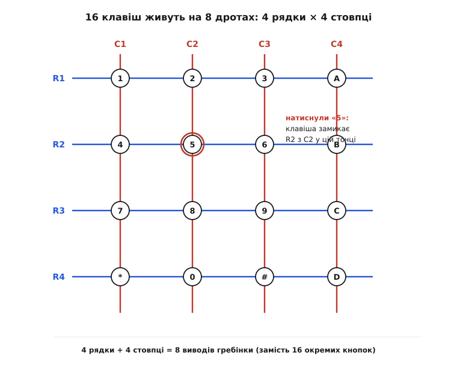
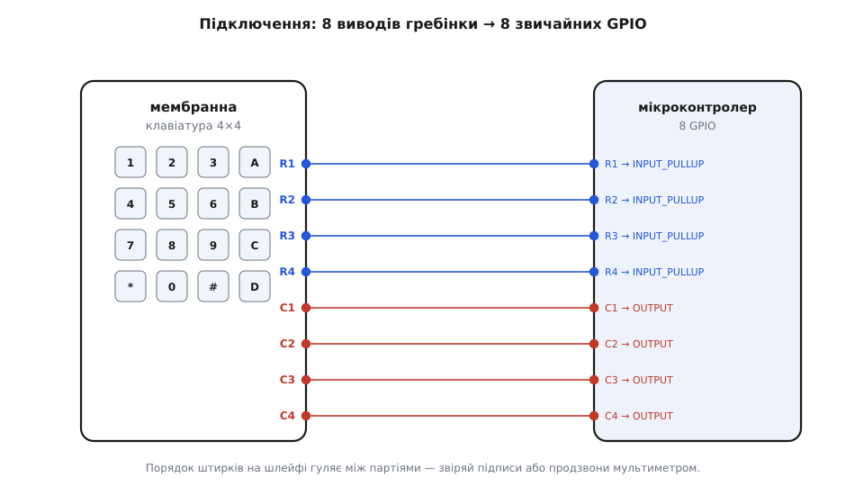

# Матрична клавіатура 4×4 (мембранна)

<preknowlist>
- [GPIO — вивід загального призначення](book:electronics/gpio) — цифрова ніжка, яку можна зробити виходом («жену 0 чи 1») або входом («читаю рівень»); уся клавіатура тримається на тому, що одну й ту саму ногу вільно перемикають між цими ролями.
- [Підтяжки](book:electronics/floating-pullups) — резистор, що м'яко тримає вхід у «1», поки його ніхто не притягнув до «0»; без нього ненатиснута лінія «висить» і читається як шум.
- [Брязкіт контактів](book:electronics/contact-debounce) — механічний контакт при замиканні кілька мілісекунд деренчить, тож один натиск легко прочитати як десяток; клавіатуру без цього не опитати чисто.
- [Зміщення діода](book:electronics/diode-bias) — діод пропускає струм лише в один бік; знадобиться, щоб зрозуміти, чому саме діод прибирає «привидів» у матриці.
</preknowlist>

Пласка наліпка розміром з долоню, на ній намальовано сітку 4×4 — цифри `0`–`9`, літери `A`–`D`, зірочка й решітка, — а з краю виходить тонкий гнучкий шлейф із рядком металевих контактів. Натискаєш квадратик — під пальцем ледь помітно піддається, ніякого клацання, м'яко, наче тиснеш на подушечку. Це **мембранна матрична клавіатура**: шістнадцять кнопок, зроблених не з пружин і металевих контактів, а з двох плівок, які натиск на мить стуляє. Найдивовижніше в ній — не самі кнопки, а те, що всі шістнадцять виходять назовні **лише вісьмома дротами**. Не по два на кнопку (це були б тридцять два), а вісім на всі — і саме ця ощадливість, а не мембрана, робить таку клавіатуру тим, чим вона є.

Розберімо спершу, звідки беруться вісім, а тоді — з чого зроблена сама плівка і як цю клавіатуру читає мікроконтролер.

## Чому шістнадцять кнопок, а дротів вісім

Уявіть найпростіший підхід: кожна кнопка — окрема, у неї два виводи, один спільний. Шістнадцять кнопок — це або тридцять два дроти, або шістнадцять сигнальних плюс спільна земля. На мікроконтролері, де кожна вільна ніжка на вагу золота, це марнотратство: сімнадцять виводів лише під клавіатуру, коли всього їх буває двадцять із хвостиком.

Матриця (лат. *matrix* — «основа», «те, з чого постає решта») розв'язує це геометрично. Кнопки садять у вузли **сітки**: чотири горизонтальні дроти — **рядки**, чотири вертикальні — **стовпці**. Кнопка стоїть на кожному перетині й робить одну-єдину річ: коли її натиснуто, вона **замикає свій рядок зі своїм стовпцем** саме в тій точці. Не натиснуто — рядок і стовпець у тому місці ніяк не пов'язані.


*Кожна з 16 клавіш сидить на перетині одного рядка й одного стовпця і замикає їх лише у своїй точці. Натиснути «5» — з'єднати R2 з C2. Назовні виходять тільки 4 рядки + 4 стовпці = 8 дротів.*

Ось де народжується економія. Чотири рядки плюс чотири стовпці — це вісім ліній, а перетинів у них 4 × 4 = шістнадцять. Кількість кнопок росте як **добуток** сторін, а кількість дротів — лише як **сума**. Тому 4×4 дає 16 кнопок на 8 дротах; якби взяли 5×5, то 25 кнопок на 10 дротах; 8×8 — уже 64 кнопки на 16 дротах. Що більша клавіатура, то разючіша вигода: сума завжди пасе задніх за добутком.

> 🔧 **Навіщо це.** Саме заради цього матрицю й вигадали. У калькуляторі, кодовому замку, пульті чи домофоні кнопок багато, а ніжок процесора мало, і вони потрібні ще й під дисплей, давачі, зв'язок. Матриця віддає 16 клавіш за 8 ніжок — половину економії; на великих клавіатурах (комп'ютерній, наприклад) інакше було б просто нікуди подіти сотню дротів. Платня за це — не можна натискати геть будь-які клавіші одночасно (про це нижче), але для набору цифр і команд, де тиснуть по одній, це задарма.

Мінус у матриці рівно один, і випливає він з тієї самої спільності дротів: якщо натиснути кілька кнопок нараз, їхні замикання можуть скластися в **обхідний шлях** і намалювати «натискання», якого не було. До цього «привида» повернемося — а поки що запам'ятаймо головне: **тисни по одній клавіші, і матриця бездоганна**.

## З чого зроблена мембрана

Тепер — сама плівка, бо вона диктує, як така клавіатура почувається під пальцем і де її межі. «Мембрана» (лат. *membrana* — «шкірка», «перетинка») тут не образ, а буквальний устрій: клавіатуру складено з тонких гнучких плівок, а не з жорсткої плати з кнопками.

Плівок три, накладених одна на одну. **Верхня** — це поліестерова (лавсанова) стрічка, на звороті якої струмопровідною сріблястою фарбою надруковано рядки й контактні п'ятачки під кожною клавішею; зверху на ній — та сама графіка з цифрами, яку ви бачите. **Нижня** — така сама плівка з надрукованими стовпцями й відповідними п'ятачками. **Середня** — розділювач (спейсер): суцільна плівка-прокладка з **дірками рівно під кожною клавішею**. У спокої цей розділювач тримає верхні й нижні п'ятачки на відстані — вони не торкаються, коло розімкнене. Натискаєш квадратик — верхня плівка **прогинається крізь дірку** в розділювачі, її п'ятачок сідає на нижній, і саме в цій точці рядок замикається зі стовпцем. Відпускаєш — пружність плівки повертає її вгору, контакт розходиться.

Звідси й характерне відчуття: натиск **м'який, без клацання**. Немає металевого купола, який би пружно «ляскав», немає пружини — є лише тонка плівка, що піддається й вертається. Це головна різниця з [тактильною матрицею 4×4](book:sensors/keypad-4x4-tactile), де під кожною клавішею стоїть справжня механічна кнопка з відчутним клацанням: та сама матрична схема, той самий 8-дротовий шлейф, але зовсім інший дотик і довговічність. Мембрана дешевша, тонша (менш ніж міліметр), суцільна зверху — під неї не набивається пил, її можна протерти, — але «наосліп» на ній друкувати важче: палець не чує, спрацювала клавіша чи ні, поки не гляне.

Струмопровідна фарба — це срібло в лаку, і його опір відчутно більший за мідний дріт: доріжка в такій клавіатурі має десятки-сотні ом, а сам контакт п'ятачків у момент натиску — ще не одну сотню ом. Для цифрового входу це дрібниця (він однаково бачить «замкнено / розімкнено»), але саме тому мембрану не ставлять туди, де через контакт мусить текти помітний струм: вона комутує **сигнал**, а не навантаження.

## Вісім виводів шлейфа

Назовні клавіатура віддає плаский гнучкий шлейф (його ще звуть FPC — flexible printed circuit) з рядком контактів під роз'єм або під пайку. Виводів вісім, і поділені вони порівну: **чотири рядки** й **чотири стовпці**. Жодного живлення, жодної землі в самому шлейфі немає — клавіатура пасивна, у ній нема ні мікросхем, ні резисторів, лише плівки з доріжками. Усе «живе» додає вже мікроконтролер.


*Вісім дротів шлейфа йдуть у вісім будь-яких цифрових ніжок. Тут рядки налаштовано входами з внутрішньою підтяжкою (INPUT_PULLUP), стовпці — виходами (OUTPUT). Порядок штирків на шлейфі різниться між партіями — звіряй за платою або продзвони.*

Важлива дрібниця, на якій спотикаються чи не всі: **порядок штирків на шлейфі не стандартизований**. У одного продавця зліва направо йде R1 R2 R3 R4 C1 C2 C3 C4, у іншого — упереміш, у третього рядки й стовпці міняні місцями. Напис на платі буває, буває й ні. Тому перше, що варто зробити з новою клавіатурою, — **продзвонити** її мультиметром у режимі «прозвонки»: тисни клавішу «1» і шукай, між якою парою виводів з'явився контакт; ця пара — рядок і стовпець клавіші «1». Кілька таких натисків повністю відновлюють карту, яка з якого виводу. Інакше код буде правильний, а клавіші — «переплутані».

## Як мікроконтролер читає клавіатуру: сканування

Клавіатура пасивна, тож питання не «що вона видає», а «як її опитати». Вісім дротів, шістнадцять можливих замикань — і треба щомиті знати, яке з них зараз є. Спосіб зветься **сканування** (від лат. *scandere* — «розбирати крок за кроком»): не читати все відразу, а **перебирати** лінії по одній.

Ідея така. Рядки робимо **входами з підтяжкою** — у спокої кожен читається «1», бо підтяжка тримає його вгорі, а знизу його ніхто не чіпає. Стовпці робимо **виходами**. Тепер по черзі беремо один стовпець і **жену його в «0»**, а решту стовпців лишаємо осторонь (не тягнуть нікуди). Дивимося на рядки. Якщо на перетині цього стовпця з якимось рядком натиснута клавіша, вона замикає рядок на стовпець — і «0» зі стовпця **стікає в цей рядок**, тож саме він з «1» падає в «0». Який рядок упав — та клавіша й натиснута в цьому стовпці. Не впав жоден — у цьому стовпці нічого не тиснуть. Перебрали всі чотири стовпці — знаємо стан усіх шістнадцяти клавіш.


*Ведений стовпець тягне в «0» лише той рядок, де в цьому стовпці натиснуто клавішу. Пара «який стовпець жену» × «який рядок упав» = координата клавіші. Пройти всі чотири стовпці — і відомі всі 16.*

Чому саме так, з підтяжкою й «нулем», а не навпаки? Бо потрібен **певний спокій**. Якби рядки просто «висіли» без підтяжки, ненатиснута лінія ловила б наведення й читалася то «0», то «1» випадково — клавіатура «натискала» б сама. Підтяжка дає твердий стан за замовчуванням («1»), а натиск його **активно ламає**, притягуючи рядок до веденого «0». Тому й ведемо саме в «0», а тримаємо в «1»: перепад однозначний, ні з чим не сплутати. (Дзеркальний варіант — тримати в «0» і жену в «1» через підтяжку донизу — теж працює, просто рідше зручний; логіка та сама.) У найпоширенішій бібліотеці, якою це роблять на практиці, ролі часто навпаки — ведуться рядки, читаються стовпці, — але суть незмінна: **одну групу ліній жену по черзі, другу читаю**.

Одна тонка пастка чатує на того, хто веде «зайві» стовпці не в «Z», а жорстко в «1». Тоді натиск клавіші **замкне ведену «1» одного стовпця на ведений «0» іншого** — і вихід у вихід буде коротко. Тому неактивні стовпці на час читання **відпускають у вхід** (стан високого опору, «Z»), а не тримають одиницею: так вони нікуди не тягнуть і закорочення не буде. На практиці простіше вести лише один стовпець за раз, а решту тримати входами.

> 🔧 **Навіщо це.** Сканування — причина, чому 8 дротів вистачає й чому клавіатура пасивна. Уся розумність не в ній, а в програмі, що перебирає стовпці. Це дає гнучкість: ту саму клавіатуру чіпляють до будь-якого мікроконтролера, аби знайшлося 8 цифрових ніжок; ніякого спеціального «інтерфейсу клавіатури» в залізі не треба. Ціна — процесор має **раз у раз опитувати** сітку (зазвичай кожні кілька мілісекунд), бо сама вона про натиск не повідомить.

## Брязкіт і привиди: дві речі, про які треба знати

Механічний контакт не замикається чисто. У перші мілісекунди після дотику плівкові п'ятачки **деренчать** — то торкаються, то ні, поки остаточно не зляжуться. Це [брязкіт контактів](book:electronics/contact-debounce), і без нього одне натискання клавіатура прочитає як частокіл із кількох, а то й десятка спрацювань. Лікують це так само, як для будь-якої кнопки: **придушенням брязкоту** (антидеренч) — після першого поміченого замикання код чекає кілька мілісекунд і аж тоді вважає натиск справжнім, а нове натискання цієї клавіші приймає, лише коли вона встигла відпуститися. Мембрана деренчить не гірше й не краще за звичайну кнопку — правило те саме.

Друга річ підступніша й властива саме матриці. Натисніть **три клавіші, що утворюють куточок прямокутника** в сітці, — наприклад, дві сусідні в одному рядку й одну під однією з них. Їхні замикання складуться в обхідний ланцюжок «рядок → стовпець → інший рядок → інший стовпець», і струм пройде так, наче замкнено ще й **четвертий куток**, якого ніхто не торкався. Під час сканування контролер побачить у тому кутку «натиснуту» клавішу — **привида** (англ. *ghosting*, «привиддя»).


*Три натиски в кутах прямокутника замикають обхідне коло, і в четвертому куті виникає хибне «натискання». Діод у кожній клавіші пускає струм лише в один бік, розриваючи обхід. Мембранна 4×4 діодів не має — тому одночасно тисни не більш ніж одну клавішу.*

Радикальне лікування привида — **діод послідовно з кожною клавішею**: він пропускає струм лише в один бік, тому обхідний шлях (що йшов би десь «проти шерсті») перекривається, і хоч скільки клавіш натисни разом, жодного зайвого замикання не з'явиться. Клавіатури з діодом на кожній клавіші вміють читати **будь-яку кількість одночасних натисків** без привидів — це називають повним розкотом клавіш (англ. *N-key rollover*), і саме так зроблено ігрові комп'ютерні клавіатури.

Але мембранна 4×4 з дешевого набору **діодів не має** — самі плівки з доріжками, і місця під діод у ній нема. Тому для неї правило просте й тверде: **не тисни більш ніж одну клавішу одночасно**. Для цифрового набору, коду замка, команд пульта це природно — по одній клавіші за раз і так тиснуть. А якщо потрібні акорди (кілька клавіш разом) — таку клавіатуру не беруть, беруть матрицю з діодами або окремі кнопки. Знати про привида варто передусім щоб **не злякатися**, коли при випадковому подвійному натиску вискочить «третя» клавіша: це не поломка, а сама природа матриці без діодів.

## Читаємо в коді

Найпростіший робочий скелет — «руками», без бібліотеки, щоб було видно кожен крок сканування. Рядки — входи з підтяжкою, стовпці — виходи; ведемо по одному стовпцю в «0» і дивимося, який рядок упав.

**Умова.** Рядки клавіатури R1–R4 підключено до ніжок D9, D8, D7, D6; стовпці C1–C4 — до D5, D4, D3, D2 мікроконтролера Arduino. Треба надрукувати символ натиснутої клавіші (тиснемо по одній).

:::tabs
```cpp
const uint8_t ROWS = 4, COLS = 4;
const uint8_t rowPin[ROWS] = {9, 8, 7, 6};   // R1..R4
const uint8_t colPin[COLS] = {5, 4, 3, 2};   // C1..C4

// що надруковано на клавіатурі: [рядок][стовпець]
const char keymap[ROWS][COLS] = {
    {'1','2','3','A'},
    {'4','5','6','B'},
    {'7','8','9','C'},
    {'*','0','#','D'}
};

void setup() {
    for (uint8_t r = 0; r < ROWS; r++)
        pinMode(rowPin[r], INPUT_PULLUP);    // рядки: у спокої «1»
    for (uint8_t c = 0; c < COLS; c++)
        pinMode(colPin[c], INPUT);           // стовпці поки відпущені у вхід (Z)
    Serial.begin(9600);
}

char scanOnce() {
    for (uint8_t c = 0; c < COLS; c++) {
        pinMode(colPin[c], OUTPUT);          // цей стовпець беремо виходом
        digitalWrite(colPin[c], LOW);        // і жену його в «0»
        for (uint8_t r = 0; r < ROWS; r++) {
            if (digitalRead(rowPin[r]) == LOW) {   // рядок упав → тут клавіша
                pinMode(colPin[c], INPUT);   // повертаємо стовпець у Z
                return keymap[r][c];
            }
        }
        pinMode(colPin[c], INPUT);           // не знайшли — відпускаємо назад у Z
    }
    return 0;                                 // нічого не натиснуто
}

void loop() {
    static char prev = 0;
    char k = scanOnce();
    if (k && k != prev) {                     // ловимо МОМЕНТ натискання, не утримання
        Serial.print("клавіша: ");
        Serial.println(k);
    }
    prev = k;
    delay(20);                                // грубий антидеренч + не молотимо марно
}
```
```micropython
from machine import Pin
import time

ROWS, COLS = 4, 4
row_gp = (9, 8, 7, 6)   # R1..R4
col_gp = (5, 4, 3, 2)   # C1..C4

# що надруковано на клавіатурі: [рядок][стовпець]
keymap = (
    ('1', '2', '3', 'A'),
    ('4', '5', '6', 'B'),
    ('7', '8', '9', 'C'),
    ('*', '0', '#', 'D'),
)

# рядки: входи з підтяжкою, у спокої «1»
rows = [Pin(gp, Pin.IN, Pin.PULL_UP) for gp in row_gp]
# стовпці поки відпущені у вхід (Z)
cols = [Pin(gp, Pin.IN) for gp in col_gp]

def scan_once():
    for c in range(COLS):
        cols[c].init(Pin.OUT)        # цей стовпець беремо виходом
        cols[c].value(0)             # і жену його в «0»
        for r in range(ROWS):
            if rows[r].value() == 0: # рядок упав → тут клавіша
                cols[c].init(Pin.IN) # повертаємо стовпець у Z
                return keymap[r][c]
        cols[c].init(Pin.IN)         # не знайшли — відпускаємо назад у Z
    return None                      # нічого не натиснуто

prev = None
while True:
    k = scan_once()
    if k and k != prev:              # ловимо МОМЕНТ натискання, не утримання
        print("клавіша:", k)
    prev = k
    time.sleep_ms(20)                # грубий антидеренч + не молотимо марно
```
:::

Розберімо ключове. У `setup` рядки — `INPUT_PULLUP`, тож у спокої всі читаються `HIGH`; стовпці лишаємо `INPUT`, поки не дійде черга вести. У `scanOnce` кожен стовпець по черзі стаємо виходом і жену в `LOW`; читаємо чотири рядки — котрий став `LOW`, той і замкнено на цей стовпець, отже клавіша `keymap[r][c]`. Одразу **повертаємо стовпець у `INPUT`**, щоб два ведені стовпці ніколи не зустрілися. У `loop` порівнюємо з попереднім станом (`k != prev`) — так реагуємо на **сам факт натискання**, а не щомиті, поки палець лежить; `delay(20)` заразом і брязкіт згладжує, і не дає циклу молотити впусту.

На практиці рідко пишуть сканування руками — беруть готову бібліотеку `Keypad`, де вже й перебір, і придушення брязкоту, і зручне `getKey()`, і мапа символів. Робочий приклад на ній, разом з підключенням на переривання (щоб не опитувати весь час), обробкою кількох клавіш і типовими помилками зведено в [драйвері-прикладі](book:sensors/keypad-4x4-membrane/proj-keypad-driver.md).

## Чого стерегтися

Кілька пасток випливають прямо з устрою, і всі вони — не поломки, а поведінка «за задумом».

**Порядок штирків невідомий наперед.** Найчастіша причина «клавіатура набирає не те» — не той порядок виводів. Продзвоніть шлейф і складіть свою `keymap` під реальну розводку, перш ніж винуватити код.

**Кілька клавіш разом дають привида.** Без діодів матриця не розрізняє справжній третій натиск від фантомного четвертого. Проєктуйте під набір по одній клавіші; якщо вискочив «зайвий» символ при випадковому подвійному натиску — це привид, а не дефект.

**Брязкіт обов'язково давити.** Без придушення один натиск читається як серія. Найпростіше — пауза після натискання й вимога «клавіша мусить відпуститися», перш ніж рахувати нове.

**Мембрана комутує сигнал, не силу.** Опір доріжок і контакту — сотні ом; не пускайте крізь клавіатуру помітний струм (напряму на реле, світлодіод, навантаження). Її діло — замкнути логічний вхід, а керувати навантаженням має вже транзистор чи драйвер.

**Клей і згин шлейфа.** Гнучкий шлейф і сам клейовий шар мембрани не люблять різких заломів і високої температури: заламаний навпіл шлейф ламає срібну доріжку, і рядок (чи стовпець) «відмирає» цілком. Гнути плавно, під роз'єм заводити без зусилля.
