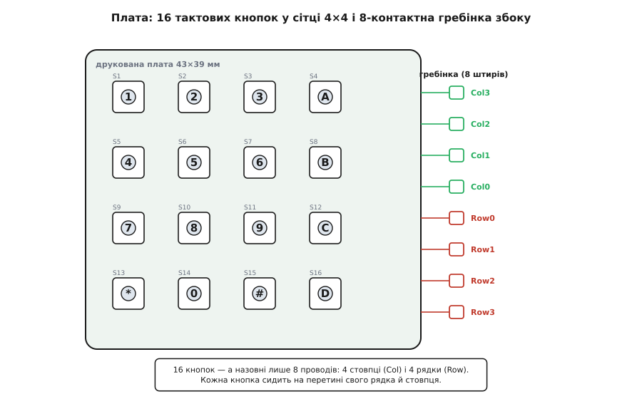
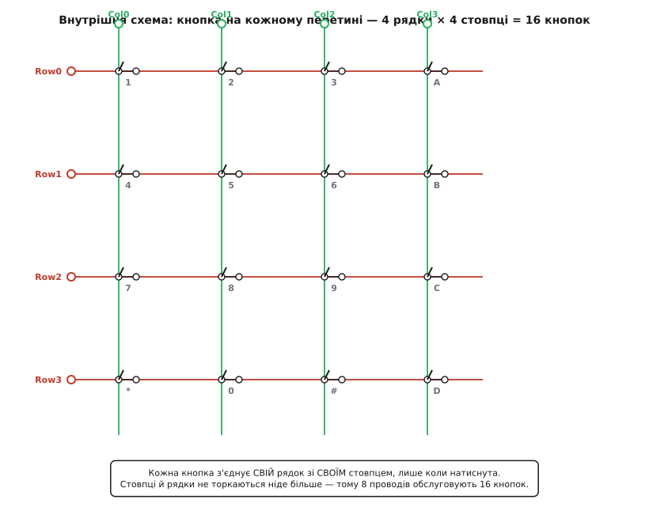
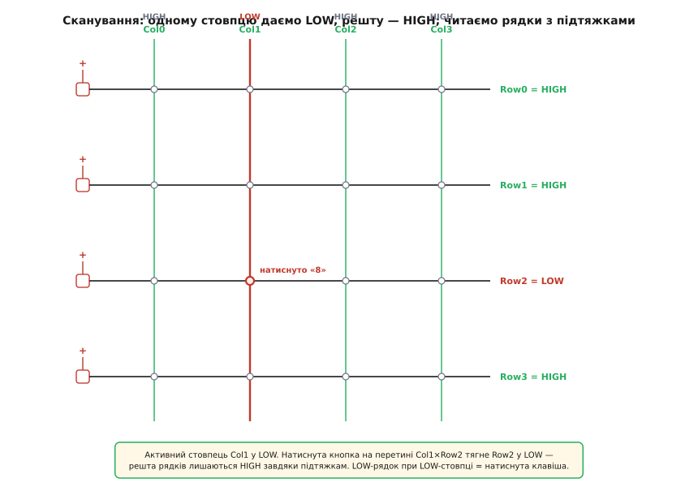
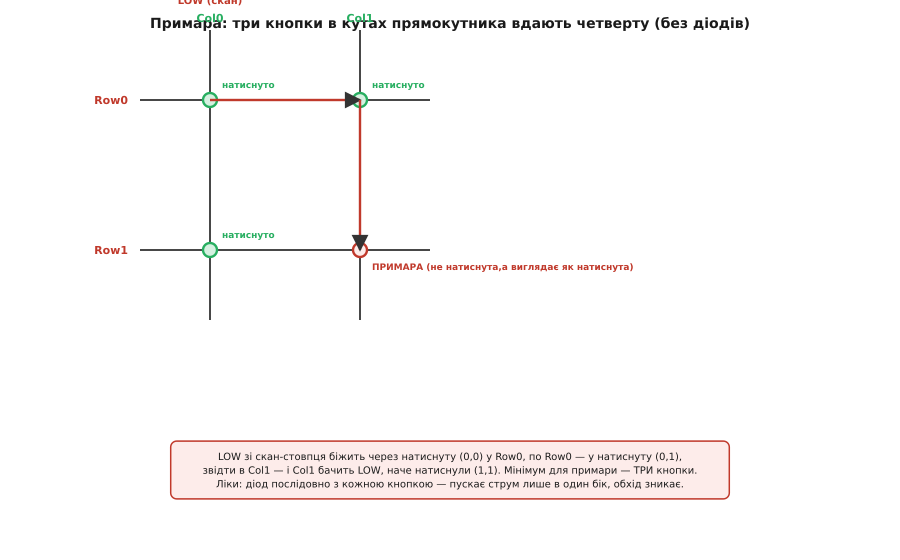
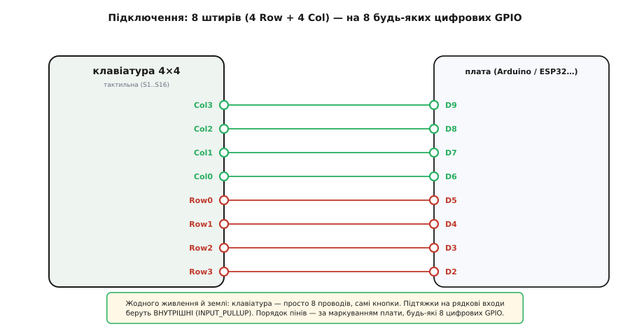

# Матрична клавіатура 4×4 (тактильна)

<preknowlist>
- [Тактові кнопки](book:electronics/contact-debounce/comp-tact-button.md) — крихітна момент-кнопка, що замикає коло, доки тиснеш; уся клавіатура — це 16 таких кнопок. Варто знати, як вона влаштована зсередини.
- [Підтяжки](book:electronics/floating-pullups) — резистор, що тримає вхід у певному стані (HIGH), поки його ніхто активно не тягне; без підтяжок рядки клавіатури «пливуть» і читаються сміттям.
- [Брязкіт контактів](book:electronics/contact-debounce) — механічний контакт при натиску кілька разів відскакує, даючи пачку хибних перемикань за ~1–10 мс; те саме буде на кожній клавіші тут.
- [GPIO](book:electronics/gpio) — вивід мікроконтролера, який програмно роблять то входом, то виходом і читають/виставляють на ньому 0/1; на цій здатності перемикати напрям і тримається все сканування.
</preknowlist>

Уяви, що треба ввести PIN-код або набрати число: шістнадцять клавіш — цифри, дії, підтвердження. Найчесніше рішення — шістнадцять окремих кнопок, кожна на свою ніжку мікроконтролера. Але шістнадцять ніжок лише під клавіатуру — розкіш, якої на маленькій платі часто немає. **Матрична клавіатура 4×4** розв'язує саме це: дає шістнадцять клавіш, а назовні виводить **лише вісім проводів**. Тактильна її версія — це не гнучка плівка, а **жорстка друкована плата з шістнадцятьма справжніми кнопками**, які клацають під пальцем. Розберімо, як вісім проводів обслуговують шістнадцять клавіш, чому це не магія, а проста геометрія, і де тут криється підступна пастка, про яку варто знати заздалегідь.

## Що це і навіщо

Перед тобою квадратна платка приблизно 43×39 мм із сіткою кнопок 4×4. Кнопки — звичайні **тактові** (англ. *tactile* — «дотиковий»): маленькі квадратні вимикачі, що замикають коло, доки на них тиснеш, і клацають, даючи пальцю відчутний відгук. На кнопки часто вдягнені ковпачки з написами — типово `1 2 3 A / 4 5 6 B / 7 8 9 C / * 0 # D`, як на телефоні чи домофоні. Кнопки на платі підписані `S1`…`S16`. Збоку — гребінка з **восьми штирів**.

Ось головне число, заради якого все затіяно: **16 клавіш, 8 проводів**. Якби кожна кнопка мала власну лінію, вийшло б шістнадцять ніжок. Матриця стискає це вдвічі — і що більша клавіатура, то більший виграш: клавіатура 8×8 дала б шістдесят чотири клавіші всього за шістнадцять проводів. Ціна цієї економії — трохи роботи в програмі (треба **сканувати**) і одна пастка (**примари**), про які нижче.

> 🔧 **Навіщо це.** Ніжки мікроконтролера — дефіцит. На типовому проєкті їх розбирають дисплей, давачі, зв'язок, і під ввід лишається жменя. Матрична клавіатура дозволяє покласти повноцінну панель на шістнадцять клавіш, віддавши їй лише вісім ніжок замість шістнадцяти — а вивільнені вісім підуть на щось інше. Це та сама ідея, що й у пам'яті, дисплеях і великих клавіатурах комп'ютерів: коли об'єктів багато, їх адресують сіткою «рядок × стовпець», а не окремим проводом до кожного.



*Шістнадцять кнопок — а назовні лише вісім проводів: чотири стовпці (Col) і чотири рядки (Row). Кожна кнопка сидить на перетині свого рядка й свого стовпця.*

## Головна ідея: сітка замість окремих проводів

Тепер до суті — і вона важливіша за саму плату. Розклади шістнадцять кнопок у квадрат 4×4. Проведи **чотири горизонтальні лінії** (назвемо їх рядками, Row0…Row3) і **чотири вертикальні** (стовпці, Col0…Col3). Тепер найголовніший крок: кожну кнопку встав **на перетин** одного рядка й одного стовпця — так, щоб натиск **з'єднував саме цей рядок саме з цим стовпцем**. Рядки й стовпці ніде більше не торкаються: між собою вони перетинаються, але не з'єднані, наче дороги на різних рівнях.



*Кожна кнопка з'єднує свій рядок зі своїм стовпцем — і лише коли натиснута. Стовпці й рядки не торкаються ніде більше, тому вісім проводів обслуговують шістнадцять кнопок.*

Що це дає? **Кожна кнопка має унікальну адресу** — пару (рядок, стовпець). Кнопка на перетині Row2 і Col1 — це рівно одна кнопка, іншої такої пари немає. Отже, якщо якимось чином дізнатися, що **замкнулися саме Row2 і Col1**, — ми точно знаємо, що натиснули кнопку `8` (у типовому розкладі). Уся хитрість — навчитися питати матрицю: «які рядок і стовпець зараз замкнені?» Це й називають **скануванням**.

Чому саме 4 і 4, а не, скажімо, 2 і 8? Бо для заданого числа клавіш квадрат економить найбільше проводів: рядків плюс стовпців у нього менше, ніж у витягнутого прямокутника. 16 клавіш = 4×4 = 8 проводів; ті самі 16 як 2×8 дали б уже 10 проводів. Тому клавіатури й роблять якомога «квадратнішими».

## Як сканувати: одному стовпцю — LOW, рядки — читати

Ось де вступає в гру здатність [GPIO](book:electronics/gpio) бути то входом, то виходом. Стратегія така. Чотири **стовпці** зробимо **виходами**, чотири **рядки** — **входами з підтяжкою** до плюса. І далі — цикл-опитування.

Спочатку про рядки. Кожен рядок — вхід із [**підтяжкою**](book:electronics/floating-pullups) до живлення. Це означає: поки рядок ніхто активно не тягне донизу, він тихо сидить у **HIGH** (логічна одиниця), бо підтяжка легенько тримає його біля плюса. Підтяжки тут обов'язкові — без них розімкнений вхід «пливе», ловить наведення й читається як випадкове сміття. На щастя, підтяжки можна взяти **внутрішні**, ті, що вже вбудовані в мікроконтролер (`INPUT_PULLUP`), — жодних зовнішніх резисторів.

Тепер сам скан. Ідемо по стовпцях **по одному**:

```
для кожного стовпця C:
    C  → виставити LOW   (активний стовпець «притискаємо» до землі)
    решту стовпців → HIGH (або відпустити)
    прочитати всі 4 рядки:
        рядок у LOW  →  на перетині (цей рядок, стовпець C) кнопку НАТИСНУТО
        рядок у HIGH →  на цьому перетині кнопку не натиснуто
```

Логіка проста, коли простежити струм. Ми притиснули стовпець Col1 до землі (LOW), решту лишили HIGH. Якщо кнопка на перетині **Col1 і Row2** натиснута — вона з'єднує притиснутий-до-землі стовпець із рядком Row2, і той **просідає в LOW**, перемагаючи слабеньку підтяжку. Решта рядків, куди «земля» через натиснуту кнопку не дістає, спокійно лишаються в HIGH. Отже: **побачив LOW на рядку, поки активний певний стовпець, — знаєш обидві координати натиснутої клавіші**. Пройшовши всі чотири стовпці, ти опитав усі шістнадцять кнопок.



*Активний стовпець Col1 у LOW. Натиснута кнопка на перетині Col1×Row2 тягне Row2 у LOW — решта рядків лишаються HIGH завдяки підтяжкам. LOW-рядок при LOW-стовпці = натиснута клавіша.*

Наскільки швидко? Один прохід усіх чотирьох стовпців — це лічені мікросекунди. Тому клавіатуру опитують хоч сотні разів на секунду, і для людини натиск здається миттєвим. Готова бібліотека (як `Keypad.h` для Arduino) робить цей цикл за тебе — треба лише сказати їй, які ніжки рядки, які стовпці, і яка літера на якому перетині. Робочий код і типові пастки винесено в окрему [нотатку про сканування й антибрязкіт клавіатури](book:sensors/keypad-4x4-tactile/api-keypad-scan.md).

> 🔧 **Навіщо це.** Той самий прийом «жени сигнал по стовпцях, читай рядки» — не про клавіатури, а взагалі про доступ до сітки. Так адресують точки на світлодіодних матрицях і дисплеях, комірки пам'яті, датчики в масиві. Зрозумівши скан на шістнадцяти кнопках, ти впізнаєш його всюди, де багато однотипних елементів адресують парою «рядок-стовпець», щоб не тягнути провід до кожного.

## Брязкіт: один натиск, а виглядає як десять

Кнопки в цій клавіатурі — механічні, а отже, **брязкають**. Коли металевий контакт кнопки стуляється, він не сідає намертво з першого дотику: пружний метал кілька разів відскакує, і за перші **1–10 мілісекунд** контакт устигає замкнутися-розмкнутися пачку разів. Для ока це один чіткий натиск. Для мікроконтролера, що опитує ніжку сотні разів на секунду, — це серія з кількох натисків підряд.

Наслідок відчутний: набираєш `5`, а в поле лягає `555`. Лікування те саме, що й для будь-якої кнопки, — [**антибрязкіт**](book:electronics/contact-debounce): побачивши зміну стану, зачекати кілька мілісекунд і перечитати; враховувати натиск лише тоді, коли стан **устоявся**. Це роблять програмно, і хороші клавіатурні бібліотеки вже містять антибрязкіт усередині — але знати про нього треба, бо «чому одна клавіша дає кілька символів» — найчастіше саме брязкіт, а не поломка.

## Примара: коли натискаєш дві клавіші, а з'являється третя

А тепер найцікавіша — і найпідступніша — риса матриці **без діодів** (а тактильні клавіатури майже завжди без них). Поки тиснеш **одну** клавішу за раз, усе бездоганно. Але натисни **три** клавіші, що складають кути прямокутника в сітці, — і матриця «побачить» **четверту**, якої ніхто не торкався. Ця примарна клавіша й зветься **примарою** (англ. *ghost* — «привид»), а саме явище — **ghosting**.

Звідки вона? Струм у сітці не знає, «яку кнопку ти хотів». Простежмо шлях. Нехай сканер притиснув Col0 до землі (LOW) і читає Col1. Натиснуто три кнопки: (Row0, Col0), (Row0, Col1) і (Row1, Col0). Дивись, куди потече «земля»:

```
Col0 (LOW) → крізь натиснуту (Row0,Col0) → у Row0
Row0       → крізь натиснуту (Row0,Col1) → у Col1
```

Тобто земля з активного стовпця обхідним шляхом — через дві натиснуті кнопки й спільний рядок — **дісталася до Col1**. І сканер, читаючи Col1, бачить на ньому LOW, роблячи висновок: «натиснуто кнопку на перетині (Row1, Col1)». А її ж ніхто не чіпав! Три реальні натиски намалювали **четвертий, примарний**. Мінімум, щоб примара з'явилася, — **три одночасні кнопки** в кутах одного прямокутника.



*LOW зі скан-стовпця біжить через натиснуту кнопку в рядок, по рядку — у другу натиснуту кнопку, звідти в сусідній стовпець — і той бачить LOW, наче натиснули четверту кнопку. Мінімум для примари — три кнопки. Ліки — діод послідовно з кожною кнопкою.*

Чому це рідко заважає? Бо на такій клавіатурі люди тиснуть **по одній** клавіші — набирають код, вводять число. Один натиск примар не породжує ніколи; для набору PIN-у матриця без діодів бездоганна. Примара кусає лише там, де треба **кілька клавіш разом** — акорди, ігрове керування, «Shift+щось». Тому:

- Потрібен лише послідовний ввід (клавіатура, кодовий замок, меню) — тактильна матриця 4×4 підходить ідеально, примара не турбує.
- Потрібні одночасні натиски — матриця без діодів не годиться. Ліки радикальне: поставити **діод послідовно з кожною кнопкою**. Діод пускає струм лише в один бік, тож обхідний шлях, що творив примару, зникає — це і є повна незалежність усіх клавіш (у клавіатур комп'ютерів її звуть **N-key rollover**). На готовій тактильній платі діодів немає, і додати їх туди не вийде — під таке беруть окрему конструкцію.

Розгорнута історія цієї пастки — чому клавіатури спершу робили без діодів, як з примарою мучилися ще перші комп'ютерні термінали, і як дійшли до N-key rollover — у [нотатці про примари й діоди в матрицях](book:sensors/keypad-4x4-tactile/hist-ghosting.md).

## Тактильна проти мембранної

Ту саму матрицю 4×4 продають у двох дуже різних тілах, і вибір між ними — практичний.

**Тактильна** (ця) — жорстка друкована плата зі справжніми кнопками. Кнопки виразно **клацають**, дають пальцю чіткий відгук, довговічні й приємні в наборі. Плата тримає форму, її зручно прикрутити. Ціна — вона **товща**, займає обсяг і має рельєф (кнопки стирчать).

**[Мембранна](book:sensors/keypad-4x4-membrane)** — тонка гнучка плівка з надрукованими доріжками й контактами під плоскою поверхнею, із клейким шаром іззаду. Вона **пласка як наклейка**, гнеться, майже нічого не важить і клеїться на будь-яку поверхню; добре, коли треба тонку панель або захист від бризок. Ціна — натиск **м'який, без чіткого клацання**, і плівка з часом протирається.

Головне, що ріднить обидві: **електрично вони однакові**. Та сама матриця 4×4, та сама гребінка з восьми штирів, той самий скан, ті самі примари. Код, який працює з тактильною, без змін піде до мембранної — різниця лише в тілі й відчутті під пальцем. Обидві мешкають у широкому світі готових [давачів-модулів](book:sensors/ky-series), де «що воно робить» важливіше за конкретного виробника.

## Підключення пін-у-пін

Найприємніше в цій клавіатурі — під'єднання майже нема про що розповідати. **Живлення й землі вона не потребує взагалі**: усередині лише кнопки й доріжки, жодної електроніки, яку треба живити. Тому назовні — просто **вісім проводів**, і всі вісім ідуть на **цифрові GPIO** мікроконтролера. Будь-які вісім: клавіатурі байдуже, які саме, аби в програмі правильно сказати, котрі з них рядки, а котрі стовпці.



*Жодного живлення й землі — клавіатура це просто вісім проводів і самі кнопки. Підтяжки на рядкові входи беруть внутрішні (INPUT_PULLUP). Порядок пінів — за маркуванням плати; підійдуть будь-які вісім цифрових GPIO.*

Порядок штирів на гребінці залежить від плати — на поширеному варіанті згори вниз це `Col3 Col2 Col1 Col0 Row0 Row1 Row2 Row3`. Перевір маркування або задзвони тестером: натисни кутову кнопку й подивись, які два штирі замкнулися — це її рядок і стовпець. Помилка в порядку не спалить нічого (там немає живлення), лише переплутає, яка клавіша яку літеру дасть; тоді просто поправ відповідність ніжок у коді.

Одне справжнє застереження стосується **логічних рівнів**. На 5-вольтовій платі (як Arduino Uno) рядки з натиском осідають у 0 В, з відпусканням — у 5 В; усе в межах. На 3.3-вольтовому мікроконтролері (ESP32) — те саме в межах його 3.3 В. Проблем немає, бо клавіатура **сама напруги не задає** — вона лише замикає ніжку на ніжку; рівні цілком визначає плата, до якої її під'єднано. Тому та сама клавіатура однаково працює і на 5 В, і на 3.3 В — на відміну від багатьох активних модулів, яким рівень треба узгоджувати.

Як усе це підняти в коді — оголосити піни, роздати рядки й стовпці, увімкнути внутрішні підтяжки, відсканувати й прибрати брязкіт — з робочим прикладом на C/C++ і типовими пастками зібрано в [нотатці про сканування клавіатури](book:sensors/keypad-4x4-tactile/api-keypad-scan.md).
