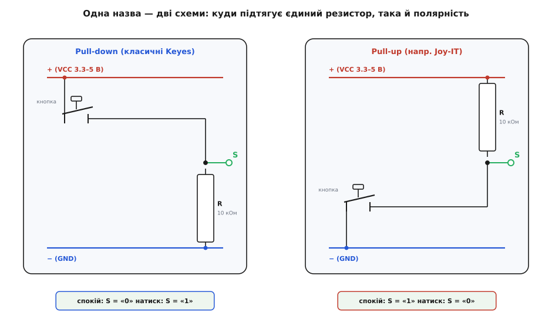
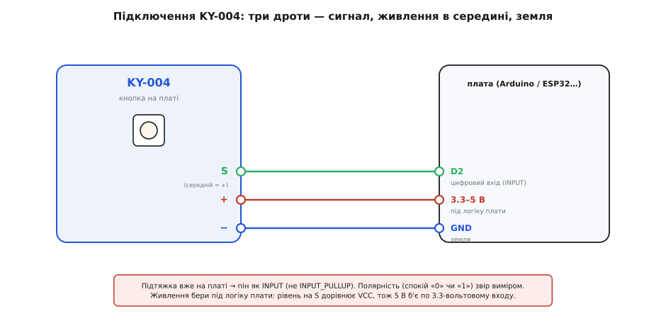

# KY-004 — тактильна кнопка на платі

<preknowlist>
- [KY-серія (Keyes 37-в-1)](topic:sensors/ky-series) — спільний формат родини: гребінка на три штирі, живлення 3.3–5 В, «номер важливіший за виробника»; звідси загальні звички роботи з платою, а тут — лише специфіка KY-004.
- [Тактова кнопка](topic:electronics/contact-debounce/comp-tact-button.md) — крихітний квадратний вимикач 6×6 мм, що замикає коло, доки на нього тиснеш; саме така кнопка сидить на платі KY-004, і варто знати, як вона влаштована зсередини (чотири ніжки — дві пари).
- [Підтяжки](topic:electronics/floating-pullups) — резистор, що тримає вхід у певному стані, поки його ніхто активно не тягне; на платі KY-004 стоїть рівно один такий резистор, і від того, куди він підтягує, залежить уся поведінка модуля.
- [Рівні «0» і «1»](topic:electronics/logic-levels-as-ranges) — що плата читає як HIGH і LOW і чому 5 В на 3.3-вольтовому вході — біда; рівень на виході KY-004 дорівнює напрузі живлення.
- [Брязкіт контактів](topic:electronics/contact-debounce) — механічний контакт у мить перемикання кілька мілісекунд клацає, даючи пачку хибних спрацювань; та сама біда буде на кожному натиску кнопки KY-004.
</preknowlist>

Найпростіше, що взагалі буває в стартовому наборі, — це кнопка. Натиснув — щось сталося, відпустив — перестало. **KY-004** саме така: маленька синя платка [KY-серії](topic:sensors/ky-series) з однією тактовою кнопкою посередині, три штирі гребінки, і все. Її часто беруть найпершою, бо здається, ніби тут нема чого розбирати — кнопка ж.

І майже всі спотикаються об те саме. Бо на цій нібито тривіальній платці є **один резистор**, і саме він робить KY-004 не такою простою, як голий вимикач: залежно від того, куди цей резистор підтягує сигнал, та сама кнопка поводиться **протилежно** — на одній платі спокій це «0», а натиск «1», а на іншій навпаки. Розберімо KY-004 так, щоб упізнати її, зрозуміти, навіщо тут узагалі резистор, чому саме через нього дві зовні однакові платки KY-004 читаються по-різному, і як написати код, що працює на будь-якій із них.

## Що це і навіщо

Гола кнопка — це просто два (насправді чотири, про це нижче) контакти, які натиск з'єднує. Сама по собі вона нічого не «видає»: замкнула коло — і замкнула, а яку напругу з цього прочитає мікроконтролер, залежить від того, як ти її увімкнув. І ось тут криється причина, чому кнопку не чіпляють до піна «як є».

Уяви: один вивід кнопки на пін мікроконтролера, другий — на землю. Натиснув — пін притиснуто до землі, чіткий «0». А **відпустив** — і пін не з'єднаний ні з чим. Він **висить у повітрі** (кажуть — «пливе», floating): ловить наведення від сусідніх дротів, від руки, від мережі 50 Гц, і читається то як «0», то як «1» — випадково. Кнопка ніби працює, але спокій дає сміття. Щоб цього не було, потрібен [резистор-підтяжка](topic:electronics/floating-pullups): він легенько тримає пін у визначеному стані, поки кнопку не натиснуто, а натиск його пересилює.

Саме цей резистор KY-004 і бере на себе. У цьому вся суть модуля:

> 🔧 **Навіщо це.** KY-004 — це **тактова кнопка плюс її підтяжка на одній платі**, доведені до «встромив три дроти — і читай чистий сигнал без сміття». Могло б здатися, що це дрібниця (резистор коштує копійку), але для новачка це якраз те, через що гола кнопка «не працює»: без підтяжки вхід пливе, а куди її ставити й на скільки кілоом — окреме питання. KY-004 знімає його: підтяжку вже поставили й порахували за тебе. Ціна ж цієї зручності — ти **не обираєш**, у який бік вона підтягує: це вирішив той, хто спаяв конкретну платку, і саме тому дві KY-004 бувають протилежні.

Що всередині — коротко й точно. Кнопка на платі — стандартний **тактовий вимикач FZ1713**, той самий квадратний [6×6 мм](topic:electronics/contact-debounce/comp-tact-button.md), що клацає під пальцем. «Тактовий» (від лат. *tactilis* — дотиковий, від *tangere* — торкатися) саме через це клацання: кнопка дає пальцю відчутний тактильний відгук, аби ти без погляду знав, що натиснув. Типовий ресурс такої кнопки — близько **100 000 натисків**, робота від 3.3 до 5 В. Поряд — один **резистор на 10 кОм** (підтяжка). І гребінка на три штирі. Більше на платі немає нічого — ні мікросхеми, ні гвинтика, ні світлодіода: KY-004 належить до найпростішого роду серії.

## Гребінка на три штирі: живлення в середині

Придивись до штирів — і побачиш звичне для [KY-серії](topic:sensors/ky-series) трипінове гніздо, з тією самою пасткою, що й на решті родини:

```
S   —  сигнал (Signal): те, що читає мікроконтролер
(середній) —  живлення (VCC): 3.3 В або 5 В від плати; часто без підпису
−   —  спільна земля (GND)
```

Живлення — **середній штир**, і на KY-004 його часто навіть не підписують (просто гладкий штир між S та −). Логіка та сама, що й у всієї серії: сигнал і землю по краях переплутати не так страшно, а от подати живлення не туди — найгірше, тож його сховали в середину. Правило звідси одне й залізне: **дивись на літери, а не на позицію**. На KY-004, де середина взагалі без напису, орієнтуйся так — крайній із літерою `S` це сигнал, протилежний край із `−` це земля, а те, що між ними, — живлення.

І одразу застереження, спільне для серії. **Рівень на піні S дорівнює напрузі живлення.** Нагодуєш KY-004 п'ятьма вольтами — і при натиску на S з'явиться 5-вольтовий рівень; заведеш його на 3.3-вольтову плату (скажімо, [ESP32](topic:boards/esp32-family)) — і цей рівень б'є по входу, розрахованому на 3.3 В. Тому живлення модуля бери **під логіку своєї плати**: 5-вольтовій — 5 В, 3.3-вольтовій — 3.3 В. Тоді й рівень на S буде саме той, який вхід очікує; детальніше, чому це критично, — у [рівнях «0» і «1»](topic:electronics/logic-levels-as-ranges).

## Один резистор — і дві протилежні платки

Ось серце цієї статті, і воно варте того, щоб пройти його повільно. На платі є один резистор-підтяжка. Питання лише в тому, **куди** він підтягує вивід кнопки — до плюса чи до землі. І тут KY-004 роздвоюється на два різні модулі під однією назвою.

**Варіант A — підтяжка донизу (pull-down).** Це класична схема оригінальних Keyes, і вона найпоширеніша. Резистор 10 кОм з'єднує сигнальну лінію із **землею**, а кнопка при натиску з'єднує ту саму лінію з **живленням**. Простеж стани:

```
відпущено:  S через резистор притиснуто до GND        → S = «0» (LOW)
натиснуто:  кнопка з'єднує S з VCC, пересилюючи резистор → S = «1» (HIGH)
```

Тобто у спокої на S тихий **нуль**, а натиск дає **одиницю**. Це протилежно до звички «кнопка тисне в нуль», і саме через це наївний код часто читає KY-004 «навпаки».

**Варіант B — підтяжка догори (pull-up).** Так зроблено на частині клонів (зокрема в наборі Joy-IT SensorKit). Резистор 10 кОм з'єднує сигнальну лінію з **живленням**, а кнопка при натиску притискає її до **землі**:

```
відпущено:  S через резистор притиснуто до VCC        → S = «1» (HIGH)
натиснуто:  кнопка з'єднує S з GND, пересилюючи резистор → S = «0» (LOW)
```

Тут усе навпаки: спокій — **одиниця**, натиск — **нуль**. Це «звична» логіка активного нуля, як у більшості кнопок.



*Уся плата — кнопка FZ1713 і один резистор 10 кОм. Ліворуч (pull-down, класичні Keyes): резистор тягне S до землі, кнопка при натиску кидає S до живлення — спокій «0», натиск «1». Праворуч (pull-up, напр. Joy-IT): резистор тягне S до живлення, кнопка при натиску кидає S до землі — спокій «1», натиск «0». Дві платки виглядають однаково, а сигнал дають дзеркальний — тому напрям треба звірити, а не вгадати.*

Чому це важливо аж настільки? Бо **зовні платки не відрізниш**: та сама кнопка, той самий резистор, той самий надпис «KY-004». Різниця лише в тому, до якої шини припаяно один кінець резистора, — а це видно хіба під лупою по доріжках. Тому єдиний чесний спосіб — не вгадувати, а **виміряти**: підключив живлення й землю, відпущену кнопку прочитав вольтметром чи `digitalRead` — побачив на S нуль, значить pull-down (натиск дасть одиницю); побачив одиницю, значить pull-up (натиск дасть нуль).

> 🔧 **Навіщо це.** Ця роздвоєність — головна причина, чому «код з інтернету під KY-004» у половині випадків не працює: автор мав platку однієї полярності, а тобі трапилась інша. Не бийся з нею — **зроби код байдужим до полярності**: замість «натиск = HIGH» лови *зміну* стану (був один рівень — став інший) або один раз на старті прочитай рівень спокою й вважай натиском протилежне. Тоді той самий скетч працює і на pull-down, і на pull-up KY-004 без переробки. Нижче саме такий підхід.

## Підключення до плати

Гребінка має три штирі, і живе за спільним правилом серії: **підключай за написами, не за позицією**.



*Розводка пін-у-пін. S — на будь-який цифровий вхід. Середній штир (часто без підпису) — на живлення під логіку плати: 5 В для 5-вольтового Arduino, 3.3 В для ESP32 й подібних, бо рівень на S дорівнює напрузі живлення. − — на землю. На платі вже є резистор-підтяжка, тож зовнішній не потрібен — але напрям підтяжки в модуля свій, його треба звірити в коді.*

Виходить так:

```
S   →  будь-який цифровий пін (напр. D2 на Arduino Uno)
(середній) →  3.3 В або 5 В  (під логіку плати)
−   →  GND
```

Тут — характерна тонкість саме KY-004, про яку варто сказати прямо. На багатьох KY-модулях радять вмикати внутрішню підтяжку мікроконтролера (`INPUT_PULLUP`), бо на платі своєї підтяжки нема. На KY-004 підтяжка **вже є на платі** — тож зазвичай пін конфігурують просто як `INPUT`, і зовнішня плюс внутрішня підтяжки не б'ються. Але є пастка: якщо тобі трапився **pull-down** варіант (класичний Keyes) і ти зопалу ввімкнеш `INPUT_PULLUP`, внутрішня підтяжка догори почне «воювати» з платною підтяжкою донизу — обидві слабкі, і спокійний рівень стане непевним десь посередині. Тому на KY-004: **`INPUT`, а не `INPUT_PULLUP`** (модуль сам тримає лінію), а полярність з'ясуй виміром, а не припущенням.

## Як читати кнопку в коді

Оскільки на S — чистий цифровий рівень, «читання» зводиться до `digitalRead`. Найнаївніший скетч під класичний pull-down KY-004 виглядає так:

**Умова.** KY-004 (pull-down, спокій «0») підключено: S на D2 Arduino Uno, живлення 5 В, земля на GND. При натиску хочемо запалити вбудований світлодіод на D13.

:::tabs
```cpp
const uint8_t PIN_BTN = 2;       // сигнал KY-004
const uint8_t PIN_LED = 13;      // вбудований світлодіод

void setup() {
  pinMode(PIN_BTN, INPUT);       // підтяжка вже на платі — INPUT, не INPUT_PULLUP
  pinMode(PIN_LED, OUTPUT);
}

void loop() {
  if (digitalRead(PIN_BTN) == HIGH)   // pull-down: натиск = «1»
    digitalWrite(PIN_LED, HIGH);
  else
    digitalWrite(PIN_LED, LOW);
}
```
```micropython
from machine import Pin

btn = Pin(2, Pin.IN)             # підтяжка вже на платі — просто IN, без PULL
led = Pin(25, Pin.OUT)           # вбудований світлодіод

while True:
    if btn.value() == 1:         # pull-down: натиск = «1»
        led.on()
    else:
        led.off()
```
:::

Цей код працює — але **лише на pull-down платі**. Трапиться pull-up KY-004 — і логіка перевернеться: світлодіод горітиме у спокої й гаснутиме на натиск. А ще він **наївний до брязкоту**: механічний контакт кнопки в мить замикання кілька мілісекунд [клацає](topic:electronics/contact-debounce), тож якщо рахувати натиски, один тик пальця нерідко зарахується як два-три.

Зробимо код чесним до обох бід одразу. Полярність приберемо так: **на старті прочитаємо рівень спокою** й вважатимемо натиском протилежне — тоді байдуже, pull-down плата чи pull-up. А брязкіт погасимо простим прийомом: зафіксували зміну — трохи почекали, поки контакти вщухнуть.

**Умова.** Той самий KY-004 на D2, але плата може бути будь-якої полярності. Хочемо ловити саме **момент натиску** (один раз на одне натискання) і рахувати натиски в Serial, не збиваючись від брязкоту.

:::tabs
```cpp
const uint8_t PIN_BTN = 2;
uint8_t idle;                    // рівень спокою — визначимо на старті
long presses = 0;

void setup() {
  pinMode(PIN_BTN, INPUT);       // KY-004 має підтяжку на платі
  Serial.begin(9600);
  delay(20);                     // дати лінії влягтися
  idle = digitalRead(PIN_BTN);   // що читається у спокої — те й «не натиснуто»
  // idle==LOW → плата pull-down;  idle==HIGH → плата pull-up. Далі байдуже.
}

void loop() {
  static uint8_t last = idle;    // попередній усталений стан
  uint8_t now = digitalRead(PIN_BTN);

  if (now != last) {             // рівень змінився — можливо, натиск або брязкіт
    delay(15);                   // антибрязкіт: чекаємо, поки контакт устоїться
    now = digitalRead(PIN_BTN);  // перечитуємо усталений рівень
    if (now != last) {           // зміна справжня
      last = now;
      if (now != idle) {         // перейшли зі стану спокою — це НАТИСК
        presses++;
        Serial.println(presses);
      }
    }
  }
}
```
```micropython
from machine import Pin
from time import sleep_ms

btn = Pin(2, Pin.IN)             # KY-004 має підтяжку на платі

sleep_ms(20)                     # дати лінії влягтися
idle = btn.value()               # що читається у спокої — те й «не натиснуто»
# idle==0 → плата pull-down;  idle==1 → плата pull-up. Далі байдуже.

last = idle                      # попередній усталений стан
presses = 0

while True:
    now = btn.value()

    if now != last:              # рівень змінився — можливо, натиск або брязкіт
        sleep_ms(15)             # антибрязкіт: чекаємо, поки контакт устоїться
        now = btn.value()        # перечитуємо усталений рівень
        if now != last:          # зміна справжня
            last = now
            if now != idle:      # перейшли зі стану спокою — це НАТИСК
                presses += 1
                print(presses)
```
:::

Тепер той самий скетч однаково працює на будь-якій KY-004: він не знає й не питає, pull-down плата чи pull-up, — він лише порівнює поточний рівень зі спокоєм. І брязкіт більше не роздвоює натиск, бо після кожної зміни код перечитує рівень аж коли контакт устоявся.

> 🔧 **Навіщо це.** Оці дві звички — **не прив'язуватись до полярності** й **гасити брязкіт** — і є вся різниця між «кнопка то працює, то ні» та «працює завжди й скрізь». Прийом «прочитати спокій на старті» рятує не лише від двох варіантів KY-004: він робить код переносним між різними кнопками взагалі, бо кнопці байдуже, як її увімкнули, а твоєму коду — вже ні. Готовий невеликий клас-обгортка для кнопки (з автовизначенням полярності, антибрязкотом, подіями «натиснуто/відпущено» й довгим натиском) винесено в [окрему вставку з прошивкою під KY-004](topic:sensors/ky-004-button/proj-ky004-button.md) — його можна просто взяти в проєкт.

## Де це стоїть насправді й коли брати саме KY-004

KY-004 навчальна, і чесно сказати: у власному пристрої ти навряд чи припаяєш саме її — там поставиш голу тактову кнопку туди, де треба, і додаси підтяжку (внутрішню або свій резистор). Але як **макетний орган** вона зручна: три дроти — і в тебе на столі надійна кнопка без сміття у спокої, готова керувати чим завгодно.

Її природна робота — **разова подія**: пуск і стоп, «увійти / підтвердити», ручний тригер («зроби зараз»), скидання лічильника, перемикання режиму. Скрізь, де від органа треба факт «натиснуто / ні», а не число й не напрям, KY-004 закриває завдання найпростіше.

> 🔧 **Навіщо це.** Помітивши цей ряд, легко зрозуміти, коли брати саме кнопку, а коли — інший орган серії. Треба **разова подія** (пуск, підтвердження, тригер) → кнопка KY-004: один біт «натиснуто». Треба **крутити без упорів і накопичувати значення** (гучність, пункти меню) → [енкодер KY-040](topic:sensors/ky-040-encoder). Треба **напрям похитування** у двох осях (керувати рухом, курсором) → [джойстик KY-023](topic:sensors/ky-023-joystick). Треба **абсолютне положення ручки** «куди поставив, там і є» → [потенціометр](topic:sensors/rotary-potentiometer). KY-004 — найдрібніший із цих органів: одна кнопка, один біт, і вся хитрість — у тому єдиному резисторі, що вирішує полярність.

## Що з цього винести

KY-004 — це **одна тактова кнопка (FZ1713, 6×6 мм) з резистором-підтяжкою на маленькій платі [KY-серії](topic:sensors/ky-series)**, доведена до «встромив три дроти — читай чистий сигнал без сміття у спокої». Гребінка звична для серії: **S / живлення в середині / −**, підключай за літерами, а живлення бери під логіку плати, бо рівень на S дорівнює напрузі живлення. Головна особливість KY-004, через яку об неї спотикаються, — **один резистор задає полярність, і в різних платок вона протилежна**: класичний Keyes ставить підтяжку донизу (спокій «0», натиск «1»), частина клонів — догори (спокій «1», натиск «0»), а зовні вони однакові. Тому полярність **вимірюй, не вгадуй**, конфігуруй пін як `INPUT` (підтяжка вже на платі, не `INPUT_PULLUP`), а код пиши **байдужим до полярності** — читай рівень спокою на старті й вважай натиском протилежне — та гаси **брязкіт контактів**. Бери KY-004, коли потрібен простий орган разової події — пуск, підтвердження, тригер; для нескінченного кручіння бери енкодер, для напряму — джойстик, для абсолютного положення — потенціометр.
