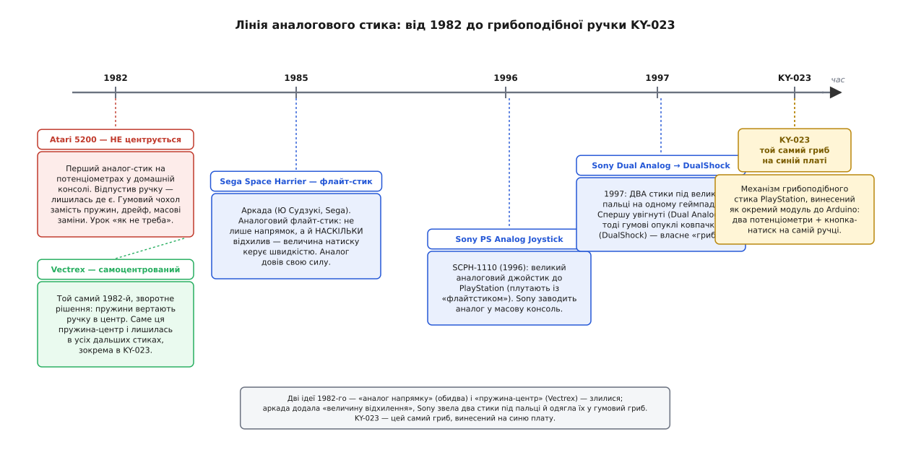

# 📜 Звідки взявся грибок під великим пальцем

Візьми будь-який сучасний геймпад, поклади великий палець на гумовий грибочок стика й поводи ним. Оце маленьке відчуття — «нахилив трохи, персонаж поплив повільно; нахилив до упору, помчав» — здається таким природним, ніби воно було завжди. Насправді його довелося винаходити, і винаходили довго та болісно. Синя платка KY-023 — це той самісінький грибок, тільки відірваний від геймпада й припаяний до п'ятиштиркової гребінки. Щоб зрозуміти, чому він саме такий — чому пружина, чому два потенціометри, чому натиск донизу, — треба пройти шлях, на якому кожне з цих рішень хтось уперше придумав, а часто спершу придумав неправильно.

Це історія не про модуль, а про **ідею**: як перетворити нахил пальця на число, і то не одне «так/ні», а плавну величину. Ідея просувалася ривками — то геніальний здогад, то гучний провал, то тихе запозичення чужого рішення. І майже все важливе сталося у двох спалахах: 1982-й, коли аналоговий стик у домі народився двічі й одразу двома протилежними способами, і 1996–1997-й, коли Sony звела дві такі ручки під два великі пальці й одягла їх у гумовий гриб. Між цими спалахами був 1985-й — аркадний рік, що довів: аналог вартий заходу.

*Дорога від нахилу пальця до числа. 1982-й дає одразу дві ідеї — «аналог напрямку» (обидві консолі) і «пружина, що центрує ручку» (Vectrex). Аркада 1985-го додає «величину відхилення керує швидкістю». Sony у 1996–1997 зводить два стики під великі пальці й одягає їх у гумовий грибок. KY-023 — цей самий грибок, винесений на синю плату.*

## Два способи впіймати нахил: цифровий і аналоговий

Перш ніж про історію, варто чітко відчути, **що саме** намагалися зробити, бо без цього хронологія — просто список дат. Уяви джойстик як важіль, що стирчить із коробки. Питання одне: як коробці дізнатися, куди й наскільки цей важіль нахилили?

Найпростіша відповідь — поставити під важелем чотири кнопки, по одній на кожен бік. Нахилив угору — замкнулася верхня кнопка, коробка бачить «вгору». Нахилив по діагоналі — замкнулися дві сусідні, «вгору-праворуч». Оце і є **цифровий** джойстик: усього вісім можливих напрямків (чотири прямі плюс чотири діагоналі) і жодного відтінку між ними. Класичний Atari CX40 — той самий чорний джойстик із єдиною червоною кнопкою, символ приставки Atari 2600, — саме такий: усередині чотири контакти, і важіль або тисне контакт, або ні.

> 🔧 **Навіщо це розрізняти.** Уся драма аналогового стика виростає з обмеження цифрового. Цифровий уміє сказати лише «вгору», але не «трохи вгору» чи «вгору майже до упору». Для гри в лабіринт цього досить: там або йдеш, або стоїш. Але щойно потрібна **швидкість, пропорційна нахилу** — веди літак, цілься, регулюй газ, — вісім напрямків стають кліткою. Саме з цієї клітки й намагалися вибратися всі, про кого йтиметься.

Аналогова відповідь інша: не рахувати кнопки, а **виміряти** нахил. Під важелем ставлять [потенціометр](book:electronics/potentiometer) — смужку опору з рухомим повзунком; важіль совгає повзунок, а той через [дільник напруги](book:electronics/voltage-divider) віддає напругу, пропорційну положенню. Ручка в центрі — половина напруги. Хилиш у бік — напруга плавно росте чи падає. Одна вісь — один потенціометр; дві схрещені осі — два потенціометри, і коробка знає нахил у будь-якому напрямку та ще й наскільки сильний. Оце «наскільки» — і є вся різниця. Далі електроніка перетворює напругу на число [АЦП](book:electronics/adc), і нахил пальця стає величиною, з якою можна рахувати.

Аналоговий важіль тягне за собою одне питання, на якому історія спіткнулася найболючіше: **що робить ручка, коли її відпустити?** Тут можливі рівно два світи, і 1982 рік випробував обидва.

## 1982: аналог у домі народжується двічі

Дивовижа полягає в тому, що аналоговий стик у домашній приставці з'явився не поступово, а раптом і одразу двічі — того самого 1982 року, у двох різних консолях, двома протилежними інженерними рішеннями. Ніби дві команди незалежно дійшли думки «давайте виміряємо нахил замість рахувати кнопки», але розійшлися в одній-єдиній деталі — і саме ця деталь виявилася вирішальною.

### Atari 5200: аналог, що не вертається (урок «як не треба»)

Восени 1982-го Atari випустила приставку **Atari 5200**, а до неї — контролер із аналоговим джойстиком на потенціометрах. За задумом це був крок уперед від восьминапрямкового CX40: важіль тепер мав давати повний оберт на 360° і плавну величину нахилу, а не вісім клацань. Задум чудовий. Виконання ж стало легендарним — тільки з протилежним знаком.

Річ у деталі, яку легко проґавити на кресленні й неможливо пробачити в руці: **джойстик Atari 5200 не самоцентрувався**. Відпускаєш важіль — а він лишається там, де ти його покинув. Замість пружин, які б повертали ручку в середину, конструктори поклалися на слабку гумову «спідничку» (англ. *boot*), і вона з цим завданням не впоралася. Наслідки посипалися одразу: важіль дрейфував сам собою, реагував смикано, а дешева механіка ще й масово ламалася.

> 🔧 **Навіщо це знати саме тут.** Несамоцентрований аналоговий важіль — це пастка, у яку потрапляє кожен, хто плутає **орган керування** з **давачем положення**. Якщо ручка лишається де стоїть, гравець мусить сам повертати її в центр щоразу — а рука не знає, де той центр, бо його нема на дотик. KY-023, навпаки, самоцентрується пружиною: відпустив — обидві осі стали посередині. Це не дрібниця оформлення, а сама суть того, чим орган керування має бути. Atari 5200 показала, що буває, коли цю суть проґавити.

Наскільки погано вийшло, видно з чисел. За даними, які наводить огляд історії приставки, Atari зрештою замінила понад **750 000 контролерів** за гарантією — це більш ніж половина всіх проданих 5200-х (*статус: широко наведене число, походить із ретро-оглядів індустрії, не з первинного звіту Atari; порядок величини підтверджують кілька незалежних джерел*). Сам джойстик здобув репутацію одного з найгірших контролерів в історії — і, за іронією, саме як **негативний** приклад він увійшов у канон: усі наступні знали, що аналог без самоцентрування в домі не працює.

### Vectrex: та сама ідея, але з пружиною

Того ж 1982-го вийшла зовсім інша машина — **Vectrex** від компанії General Consumer Electronics (GCE). Це був унікум: приставка з власним вбудованим векторним екраном (малює лініями, а не пікселями), яку не треба було вмикати в телевізор. Задумав систему Джон Росс (John Ross) зі студії Smith Engineering (*статус: підтверджено; студію очолював Джей Сміт / Jay Smith, тож систему часто пов'язують саме з його ім'ям, але авторство конструкції належить Россу*), а GCE її виробляла й продавала. У Північній Америці вона з'явилася в жовтні 1982-го (*статус: підтверджено*).

Контролер Vectrex теж був аналоговий, на потенціометрах — але з однією рятівною відмінністю: його важіль **самоцентрувався пружинами**. Дві пружини, по одній на вісь X та Y, повертали ручку в середину щоразу, коли її відпускали. Це та сама ідея, що й у Atari, але доведена до пуття в тій єдиній деталі, де Atari схибила.

Саме тут — тихий, але вирішальний момент усієї історії. **Пружина, що центрує аналоговий важіль, оселилася в конструкції назавжди.** Кожен наступний аналоговий стик — від аркадних флайт-стиків до грибочків PlayStation і до KY-023 у тебе на столі — має цю пружину. Vectrex не «винайшов потенціометр у джойстику» (це робила й Atari), він утвердив **правильний рефлекс ручки**: відпустив — стала в центр. Механізм KY-023 — прямий спадкоємець саме цього рішення 1982 року, а не невдалого Atari-варіанта.

Був у цьому й гіркий підтекст. Аналогова природа важеля Vectrex майже не використовувалася самими іграми на повну — багато з них трактували ручку як звичайний напрямок, а не як плавну величину (*статус: обґрунтоване узагальнення з ретро-джерел; ступінь використання різнився від гри до гри*). Тобто залізо вже вміло більше, ніж софт від нього просив. Ця затримка — коли механіка випереджає застосування — ще не раз повториться.

## 1985: Space Harrier доводить, що аналог того вартий

Якщо 1982-й дав аналогу тіло, то 1985-й дав йому сенс — і сталося це не вдома, а в аркадному залі. Sega випустила гру **Space Harrier**, і в її кабінеті стояв не джойстик-під-палець, а великий аналоговий **флайт-стик** — важіль, за який береш усією долонею, як за ручку керування літаком.

Придумав гру Ю Судзукі (Yū Suzuki) з підрозділу Sega AM1 (R&D1); реліз — 2 жовтня 1985-го (*статус: підтверджено*). Задумувалася вона як реалістичний військовий авіасимулятор, але через технічні обмеження перетворилася на фантастичний рейковий шутер — гравець летить уперед, а світ мчить назустріч. І от тут аналоговий важіль розкрився повністю: він ловив не лише напрямок у всі боки, а й **наскільки сильно ти його відхилив**, і від цього залежала швидкість руху героя. Трохи нахилив — плавно повів убік; до упору — метнувся різко.

Space Harrier широко називають грою, що ввела в аркади справжній аналоговий флайт-стик із вимірюванням величини натиску (*статус: широко наведене твердження в історіях ігрового заліза; формулювання «перший в аркадах» слід читати як загальновизнане, а не як строго задокументований пріоритет — рання аркадна периферія різнилася, і абсолютні «перші» тут хиткі*). Важливо не хто буквально був найпершим, а що саме ця гра **зробила аналог бажаним**: вона показала мільйонам гравців відчуття, якого цифрова вісімка напрямків дати не могла.

> 🔧 **Навіщо це в історії саме KY-023.** Space Harrier закарбувала третю складову грибочка — після «аналог напрямку» (обидві консолі 1982-го) і «пружина-центр» (Vectrex) додалося «**величина відхилення керує швидкістю**». Це рівно те, що робить KY-023 корисним органом керування: він віддає не «вліво», а «вліво на стільки-то». Аркада не дала заліза, яке потрапило в модуль, — вона дала **очікування**, що аналог має відчуватися саме так. Далі лишалося звести цей флайт-стик до розміру великого пальця.

## Проміжна лінія: спроби зробити стик під палець

Між аркадним важелем-під-долоню й майбутнім грибочком-під-палець був цілий пунктир менш відомих спроб — і про них варто згадати чесно, бо історія тут не пряма. Наприкінці 1980-х з'являлися контролери з «пальцевими» майданчиками: скажімо, Sony JS-303T для комп'ютерів MSX і BPS-Max для Famicom (обидва близько 1987-го). Проте більшість таких пристроїв усередині були нечесним аналогом — вони лише **вдавали** плавність, а насправді натискали ті самі напрямні контакти цифрового хрестика (*статус: за оглядами історії аналогового стика; конкретні моделі й роки наводяться в кількох джерелах, точні дати можуть різнитися*).

Ближче до справжнього аналогового стика під палець підійшла периферія на кшталт Dempa XE-1 AP для Sega Mega Drive (близько 1989-го): вона давала таки плавний, майже повний обертовий контроль (*статус: наведено в оглядах; деталі варіюються між джерелами*). Але це лишалося нішею — окремим аксесуаром для ентузіастів, а не стандартом, що йшов у комплекті з приставкою.

І тут корисно не піддатися спокусі гладкої легенди. Модерний грибочок-під-палець **не має єдиного винахідника й єдиної дати народження** — це збіг кількох ліній: потенціометр із дільником (загальна електротехніка, десятиліттями старша за ігри), пружина-центр (Vectrex, 1982), відчуття «величина = швидкість» (аркади, 1985) і форм-фактор «маленька ручка під великий палець» (визрівав наприкінці 1980-х — у 1990-х у різних місцях). Хто саме перший поставив усе це разом у масовий домашній геймпад — питання радше про **систему, що прижилася**, ніж про єдиний патент. І тут на сцену виходить Sony.

## 1996–1997: Sony зводить усе докупи

Дім чекав на того, хто збере розсипані частини в одну штуку, яку купуватимуть мільйони. Зробила це Sony, і не одним стрибком, а трьома кроками за неповні два роки — на цьому шляху легко заплутатися в назвах, тож пройдімо його акуратно.

### Крок перший: один великий джойстик (1996)

26 квітня 1996-го Sony випустила в Японії свій перший аналоговий контролер для PlayStation — **PlayStation Analog Joystick**, модель SCPH-1110 (*статус: підтверджено; анонс — серпень 1995*). Це був великий настільний джойстик під усю долоню — по духу ближчий до аркадного флайт-стика, ніж до майбутнього грибочка. Його дуже часто називають «Sony Flightstick», хоча офіційно він так не звався (*статус: підтверджено, поширена плутанина назв*). Тут важливий не сам пристрій, а жест: Sony завела **справжній аналог** у масову домашню консоль і почала привчати гравців до нього.

### Крок другий: два стики під два пальці (1997)

Далі стався поворот, який і визначив вигляд усіх сучасних геймпадів. **Dual Analog Controller** — перший ручний геймпад Sony з аналоговими стиками — поставив на звичну форму контролера **два** аналогові грибки: один під лівий великий палець, другий під правий. Реліз у Японії — 25 квітня 1997-го (модель SCPH-1150), у США — 27 серпня 1997-го (SCPH-1180), у Європі — у вересні 1997-го (*статус: підтверджено*).

Оце «**два** стики під **два** пальці» — і є народження сучасної схеми керування: лівим водиш персонажа, правим крутиш камеру. Один аркадний важіль під долоню розділився на пару маленьких ручок під великі пальці, і цю пару відтоді має практично кожен геймпад. Стики Dual Analog були **увігнуті** й без гумового покриття — грибок ще не набув остаточного вигляду, але дві осі, дві ручки, дві пружини вже стояли на місці.

Була в японської версії й вібромоторика, яку для американського та європейського випусків Sony прибрала — за офіційним поясненням, «з виробничих міркувань вирішили, що найважливіше для гравців — саме аналогова функція» (*статус: підтверджено; серед причин називають і надійність, і здешевлення*). Ця деталь важлива для наступного кроку.

### Крок третій: грибок дістає гумову шапку (кінець 1997)

За кілька місяців, 20 листопада 1997-го, у Японії вийшов **DualShock** — і саме він дав грибочку остаточний вигляд, який ти тримаєш у KY-023 (*статус: підтверджено; у США й Європі — 1998-й*). Назва — від «dual shock», двох вібромоторів різного розміру в рукоятях, що повернули віддачу, яку прибрали були в закордонному Dual Analog. Але для нашої історії головне не мотори, а **ковпачки стиків**: замість увігнутих голих ручок Dual Analog тут з'явилися **опуклі гумові ковпачки** з насічкою — той самий грибоподібний профіль, за який чіпляється подушечка великого пальця.

Оце і є грибок. Опукла гумова шапка на аналоговому важелі з пружиною-центром — механізм, що виявився настільки вдалим, що не змінюється вже десятиліттями. DualShock став стандартним контролером PlayStation, розійшовся десятками мільйонів, і його стик перетворився на **еталон форми**: коли говорять «аналоговий стик геймпада», уявляють саме цей грибок.

Про єдиного «дизайнера грибочка» варто сказати обережно: DualShock — робота команди Sony, і надійно приписати опуклий гумовий ковпачок одній конкретній людині за доступними джерелами не вдається (*статус: точну персональну атрибуцію не підтверджено; це командна інженерна робота Sony, згодом відзначена технічною премією «Еммі»*). Тому чесніше казати «Sony звела частини докупи», ніж вигадувати одне ім'я-героя — це рівно той випадок, коли винахід колективний, а не подвиг одинака.

## Як усе це опинилося на синій платі

Тепер видно повний ланцюг — і видно, чому KY-023 виглядає саме так. Механізм грибоподібного стика PlayStation виявився таким простим і надійним, що його почали продавати **окремо**, поза геймпадом: той самий вузол — два схрещені потенціометри на пружині-центрі плюс кнопка під натиск донизу — припаяли до маленької синьої платки з п'ятиштирковою гребінкою, щоб його міг читати будь-який мікроконтролер. Вийшов давач-орган керування для саморобної електроніки.

Кожна риса KY-023 має тепер своє історичне ім'я:

- **Два потенціометри-осі** — це «аналог замість цифрової вісімки», ідея обох консолей 1982-го.
- **Пружина, що центрує ручку** — спадок Vectrex: відпустив, і обидві осі стали посередині (а не лишилися де стояли, як у ганебному Atari 5200).
- **Плавна величина нахилу, а не просто напрямок** — очікування, яке закарбувала аркада Space Harrier 1985-го.
- **Грибоподібна опукла ручка під великий палець** — форма ковпачка DualShock 1997-го; саме тому клони KY-023 часто підписують «PS2 joystick».
- **Кнопка під натиск донизу** — «натиснути стик» (англ. *stick click*), теж зі світу геймпадів, де кожен стик додатково натискається як кнопка.

> 🔧 **Навіщо ця історія майстрові, а не лише цікавому.** Знання родоводу рятує від конкретної помилки. KY-023 — це **орган керування**, нащадок геймпадного стика: він каже, куди й наскільки штовхнув **оператор**, і сам вертається в центр. Це не давач положення в просторі — він не пам'ятає, де був, і не міряє кутів; відпустив ручку — і давач «забув» усе, як забуває грибок геймпада. Уся дорога від Atari 5200 до DualShock — це, по суті, історія доведення однієї думки: важіль має **вимірювати живий намір руки й вертатися в нуль**. Хто це відчув, той не переплутає KY-023 з енкодером і не збудує керування на хибному припущенні, ніби джойстик «знає» своє абсолютне положення.

Отак маленький синій модуль виявляється не випадковою деталькою з набору «37 давачів», а кінцевою точкою довгої лінії: два способи впіймати нахил, дві протилежні спроби 1982-го, аркадний доказ 1985-го, три кроки Sony 1996–1997 — і врешті грибок під великим пальцем, відірваний від геймпада й покладений тобі на стіл, щоб ти навчив його керувати вже своїм роботом.
