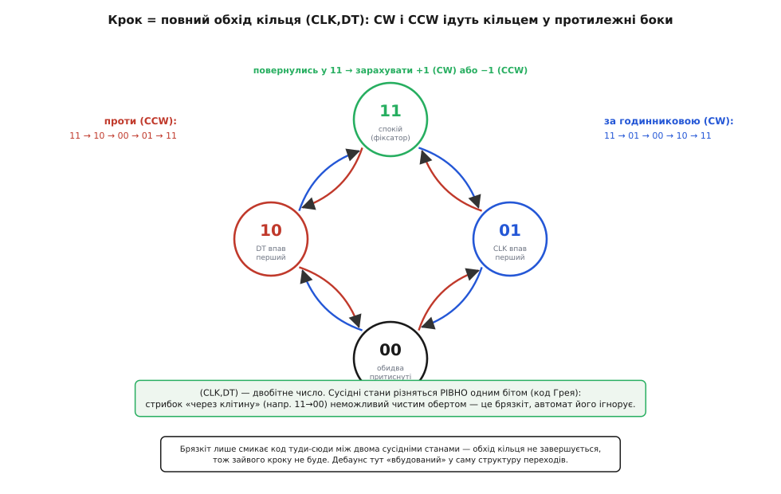

# ⚙️ Прошивка під KY-040: читати енкодер так, щоб не брехав

<preknowlist>
- [Квадратура](topic:electronics/quadrature) — дві доріжки, зсунуті на чверть кроку; напрям кодує зсув фаз. Уся логіка нижче стоїть на цьому.
- [Брязкіт контактів](topic:electronics/contact-debounce) — механічний контакт у мить перемикання кілька мілісекунд клацає між «0» і «1»; без цього не зрозуміти, чому наївний код тремтить.
- [Підтяжки](topic:electronics/floating-pullups) — навіщо `INPUT_PULLUP` тримає вхід у «1», коли контакт розімкнутий; на цьому тримається читання кнопки.
- [Переривання](topic:programming/interrupts) — як пін здатний «смикнути» процесор на край сигналу, не чекаючи циклу; звідси різниця між читанням на перериванні й опитуванням.
</preknowlist>

Проблема з поворотним енкодером звучить майже образливо просто: дві цифрові лінії, дивись, котра впала першою, додавай або віднімай крок. Пишеш п'ять рядків, вантажиш, крутиш ручку — і число на екрані **живе власним життям**. Один клац дає то +1, то +3, то раптом −1 усередині оберту за годинниковою. Здається, що модуль бракований. Модуль справний. Бракований підхід: механічний контакт не перемикається чисто, він **брязкає**, і кожне брязкання наївний код рахує як окремий крок.

Ця вставка — про те, як написати читання KY-040 (та й будь-якого механічного квадратурного енкодера) так, щоб лічильник рухався **рівно на стільки, на скільки ти крутнув ручку**, — ні кроком більше. Пройдемо два різні підходи, від простішого до правильного, доведемо кожен до робочого C++, розберемо кнопку, переривання проти опитування — і зберемо готовий клас, який можна взяти в проєкт і забути про нього.

## Чому «лови край CLK» ламається

Спершу треба точно побачити ворога, інакше боротьба буде наосліп. Усередині KY-040 стоїть механічний енкодер типу EC11. У нього є **фіксатори** (клацання): ручка стоїть стійко в певних положеннях, а між ними пружинка з кулькою перескакує на наступний зубчик. Ключова річ, яку варто затямити раз і назавжди:

```
один клац (фіксатор) EC11 = один ПОВНИЙ квадратурний цикл = чотири зміни рівнів
```

Тобто поки ти проходиш один-єдиний клац, обидві лінії встигають кожна двічі змінитися. У спокої (на фіксаторі) обидва контакти розімкнуті, тож підтяжки тримають CLK і DT у «1». За один клац за годинниковою пара (CLK, DT) проходить послідовність:

```
11  →  01  →  00  →  10  →  11
```

а проти годинникової — ту саму послідовність задом наперед:

```
11  →  10  →  00  →  01  →  11
```

Тепер видно перше джерело біди. Якщо ти чіпляєшся лише за спадний край CLK, то за один клац CLK падає **один раз** (у переході `11→01` для CW чи `10→00` для CCW) — тут ще пощастило б. Але деякі клони EC11 і деякі партії за клац видають **дві** пари переходів, і тоді край CLK трапляється двічі: лічильник стрибає на 2. А якщо ловити край на **обох** фронтах (`CHANGE` замість `FALLING`) — стрибок на 4. Звідси й народжується легендарне «крутнув на один — додалося чотири», яке новачок безуспішно ділить на 4 у коді.

> 🔧 **Навіщо це.** Поки ти думаєш, що клац = один край, ти будуєш код на брехливій моделі й латаєш симптоми (ділиш на 2, ділиш на 4, чекаєш «поки заспокоїться»). Щойно приймаєш, що **клац — це повний цикл із чотирьох змін**, стає видно правильну ціль коду: зарахувати крок *раз на цикл*, коли пара (CLK, DT) завершила повний обхід і повернулась у спокій «11». Це і робить скінченний автомат нижче.

Друге джерело — **брязкіт**. На платі KY-040 [немає конденсаторів](topic:electronics/contact-debounce), тож кожна з чотирьох змін приходить не чистою сходинкою, а пачкою: `1→0→1→0→0` за пару мілісекунд, поки контакт устоїться. Наївний обробник краю рахує кожне таке смикання. Ось той самий наївний код, щоб було від чого відштовхуватись:

```cpp
// НАЇВНО: на кожен спадний край CLK — крок. Тремтить, бреше, стрибає.
void onClkFall() {
  if (digitalRead(PIN_DT) == HIGH) counter++;   // CW
  else                             counter--;    // CCW
}
```

На повільному, обережному кручінні воно навіть працює — і тому оманює. Крутнеш жвавіше або невдало впіймаєш брязкіт на краю — і побачиш весь спектр брехні. Далі — два способи це вилікувати.

## Підхід 1: гасіння брязкоту після краю (дебаунс за часом)

Найпряміша ідея: контакт брязкає лічені мілісекунди, потім заспокоюється. То, зафіксувавши край CLK і зчитавши напрям із DT, просто **не слухай CLK наступні кілька мілісекунд** — за цей час брязкіт устигне вщухнути, і фальшивих країв ми не порахуємо.

Ось суть. Тримаємо мітку часу останнього зарахованого краю; новий край беремо до уваги, лише якщо від попереднього минуло більше за поріг (скажімо, 2 мс):

```cpp
const uint8_t PIN_CLK = 2;
const uint8_t PIN_DT  = 3;

volatile long          counter    = 0;
volatile unsigned long lastEdgeUs = 0;      // час останнього зарахованого краю

void onClkFall() {
  unsigned long now = micros();
  // ігноруємо все, що ближче за 2 мс до попереднього краю — це брязкіт
  if (now - lastEdgeUs < 2000UL) return;
  lastEdgeUs = now;

  if (digitalRead(PIN_DT) == HIGH) counter++;   // DT ще «1» → за годинниковою
  else                             counter--;    // DT уже «0» → проти
}
```

> 🔧 **Навіщо `micros()`, а не `millis()`.** Брязкіт живе в масштабі мілісекунд, і поріг 1–2 мс — це якраз межа, де `millis()` (крок 1 мс) уже загрубий: два справжні швидкі краї можуть потрапити в одну й ту саму мілісекунду. `micros()` дає роздільність краще за мікросекунду й дозволяє ставити поріг точно. Різниця `now - lastEdgeUs` рахується без помилок навіть при переповненні лічильника (кожні ~71 хв на 16 МГц AVR), бо віднімання беззнакове й «завертається» правильно — тому важливо тримати обидві величини `unsigned long`.

Це працює й часто цього досить для регулятора гучності. Але у підходу є два вбудовані компроміси, які треба чесно назвати.

**Поріг — завжди компроміс.** Поставиш замалий (0.5 мс) — брязкіт проб'ється, лічильник знову затремтить. Поставиш завеликий (10 мс) — і **швидкий оберт почне губитись**: якщо крутнути ручку різко, справжні сусідні краї підуть частіше, ніж раз на 10 мс, і код відкине справжні кроки як «брязкіт». Ідеального порогу немає; є вузьке вікно, яке доводиться підбирати під конкретний енкодер і конкретну манеру кручіння.

**Це не декодер, а фільтр.** Дебаунс за часом нічого не знає про *структуру* квадратури — він просто рідше пускає краї. Він не відрізнить справжній крок від випадкового викиду на лінії; він лише сподівається, що між справжніми кроками пауза більша за між брязканнями. Здебільшого так і є — але це припущення, а не гарантія.

Тому дебаунс за часом добрий як **швидкий, зрозумілий перший варіант**. Коли треба надійність без підбору порогів і без втрати швидких обертів — беруть інший інструмент.

## Підхід 2: скінченний автомат на парі (CLK, DT)

Ось ідея, після якої на енкодери починаєш дивитися інакше. Замість ловити один край і на віру довіряти DT, стеж за **обома лініями як за єдиним двобітним числом** `(CLK<<1)|DT` — значенням від 0 до 3 — і зараховуй крок лише тоді, коли це число **пройшло повний дозволений цикл** у правильному порядку. Брязкіт при цьому відсіюється сам собою, безкоштовно, без жодного порогу часу.

Чому це працює, видно з природи квадратури. Сусідні стани в циклі різняться **рівно одним бітом** — це [код Грея](topic:electronics/gray-code): міняється або CLK, або DT, ніколи обидва одразу. Тому чистий оберт дає лише «дозволені» переходи між сусідами по кільцю. А брязкіт — це смикання **однієї** лінії туди-сюди, тобто топтання між двома сусідніми станами (`01 ↔ 00 ↔ 01 ↔ 00…`): кільце від такого **не замикається**, повний цикл не завершується, зайвий крок не зараховується. Дебаунс тут не приклеєний збоку — він **вбудований у саму структуру переходів**.



*Чотири можливі стани пари (CLK, DT) — вершини кільця. Повний клац за годинниковою веде код по колу `11 → 01 → 00 → 10 → 11`; проти — у протилежний бік. Крок зараховуємо, лише коли обхід завершився поверненням у «11». Сусідні стани різняться одним бітом, тож стрибок «через клітину» (як `11→00`) неможливий чистим обертом — це ознака брязкоту, і автомат його просто не пускає далі.*

### Таблиця переходів замість купи `if`

Можна було б виписати всі дозволені переходи ланцюжком умов, але це швидко стає нечитабельним місивом. Елегантніший спосіб, який став фактично стандартним у спільноті (його розповсюдив **Бен Бакстон** у нотатці «Rotary encoders, done properly», жовтень 2011, під ліцензією GPLv3), — закодувати автомат **таблицею**. Рядок таблиці — поточний стан машини; стовпець — новозчитана пара `(CLK, DT)`; клітинка — новий стан машини, у старші біти якого вшито «а тут заверши крок і в який бік».

Стани машини (для повнокрокового режиму — коли крок зараховуємо раз на клац):

:::tabs
```cpp
// прапорці напряму — у старших бітах результату
#define DIR_NONE 0x00   // цикл ще не завершено
#define DIR_CW   0x10   // завершено крок за годинниковою
#define DIR_CCW  0x20   // завершено крок проти годинникової

// стани самого автомата (проміжні кроки обходу кільця)
#define R_START     0x0
#define R_CW_FINAL  0x1
#define R_CW_BEGIN  0x2
#define R_CW_NEXT   0x3
#define R_CCW_BEGIN 0x4
#define R_CCW_FINAL 0x5
#define R_CCW_NEXT  0x6

// повнокрокова таблиця: рядок = стан, стовпець = зчитане (CLK<<1)|DT ∈ {0,1,2,3}
const uint8_t ttable[7][4] = {
  // R_START:      00           01           10           11
  {R_START,     R_CW_BEGIN,  R_CCW_BEGIN, R_START},
  // R_CW_FINAL
  {R_CW_NEXT,   R_START,     R_CW_FINAL,  R_START | DIR_CW},
  // R_CW_BEGIN
  {R_CW_NEXT,   R_CW_BEGIN,  R_START,     R_START},
  // R_CW_NEXT
  {R_CW_NEXT,   R_CW_BEGIN,  R_CW_FINAL,  R_START},
  // R_CCW_BEGIN
  {R_CCW_NEXT,  R_START,     R_CCW_BEGIN, R_START},
  // R_CCW_FINAL
  {R_CCW_NEXT,  R_CCW_FINAL, R_START,     R_START | DIR_CCW},
  // R_CCW_NEXT
  {R_CCW_NEXT,  R_CCW_FINAL, R_CCW_BEGIN, R_START},
};
```
```python
# прапорці напряму — у старших бітах результату
DIR_NONE = 0x00   # цикл ще не завершено
DIR_CW   = 0x10   # завершено крок за годинниковою
DIR_CCW  = 0x20   # завершено крок проти годинникової

# стани самого автомата (проміжні кроки обходу кільця)
R_START     = 0x0
R_CW_FINAL  = 0x1
R_CW_BEGIN  = 0x2
R_CW_NEXT   = 0x3
R_CCW_BEGIN = 0x4
R_CCW_FINAL = 0x5
R_CCW_NEXT  = 0x6

# повнокрокова таблиця: рядок = стан, стовпець = зчитане (CLK<<1)|DT ∈ {0,1,2,3}
TTABLE = (
    # R_START:      00           01           10           11
    (R_START,     R_CW_BEGIN,  R_CCW_BEGIN, R_START),
    # R_CW_FINAL
    (R_CW_NEXT,   R_START,     R_CW_FINAL,  R_START | DIR_CW),
    # R_CW_BEGIN
    (R_CW_NEXT,   R_CW_BEGIN,  R_START,     R_START),
    # R_CW_NEXT
    (R_CW_NEXT,   R_CW_BEGIN,  R_CW_FINAL,  R_START),
    # R_CCW_BEGIN
    (R_CCW_NEXT,  R_START,     R_CCW_BEGIN, R_START),
    # R_CCW_FINAL
    (R_CCW_NEXT,  R_CCW_FINAL, R_START,     R_START | DIR_CCW),
    # R_CCW_NEXT
    (R_CCW_NEXT,  R_CCW_FINAL, R_CCW_BEGIN, R_START),
)
```
```micropython
# прапорці напряму — у старших бітах результату
DIR_NONE = const(0x00)   # цикл ще не завершено
DIR_CW   = const(0x10)   # завершено крок за годинниковою
DIR_CCW  = const(0x20)   # завершено крок проти годинникової

# стани самого автомата (проміжні кроки обходу кільця)
R_START     = const(0x0)
R_CW_FINAL  = const(0x1)
R_CW_BEGIN  = const(0x2)
R_CW_NEXT   = const(0x3)
R_CCW_BEGIN = const(0x4)
R_CCW_FINAL = const(0x5)
R_CCW_NEXT  = const(0x6)

# повнокрокова таблиця: рядок = стан, стовпець = зчитане (CLK<<1)|DT ∈ {0,1,2,3}
TTABLE = (
    # R_START:      00           01           10           11
    (R_START,     R_CW_BEGIN,  R_CCW_BEGIN, R_START),
    # R_CW_FINAL
    (R_CW_NEXT,   R_START,     R_CW_FINAL,  R_START | DIR_CW),
    # R_CW_BEGIN
    (R_CW_NEXT,   R_CW_BEGIN,  R_START,     R_START),
    # R_CW_NEXT
    (R_CW_NEXT,   R_CW_BEGIN,  R_CW_FINAL,  R_START),
    # R_CCW_BEGIN
    (R_CCW_NEXT,  R_START,     R_CCW_BEGIN, R_START),
    # R_CCW_FINAL
    (R_CCW_NEXT,  R_CCW_FINAL, R_START,     R_START | DIR_CCW),
    # R_CCW_NEXT
    (R_CCW_NEXT,  R_CCW_FINAL, R_CCW_BEGIN, R_START),
)
```
:::

Уся робота декодера тепер — **один рядок**:

:::tabs
```cpp
uint8_t processEncoder(uint8_t clk, uint8_t dt) {
  static uint8_t state = R_START;
  uint8_t pin = (clk << 1) | dt;                 // пара як двобітне число 0..3
  state = ttable[state & 0x0F][pin];             // низькі 4 біти — індекс стану
  return state & 0x30;                           // старші біти — DIR_CW / DIR_CCW / 0
}
```
```python
_state = R_START

def process_encoder(clk, dt):
    global _state
    pin = (clk << 1) | dt                        # пара як двобітне число 0..3
    _state = TTABLE[_state & 0x0F][pin]          # низькі 4 біти — індекс стану
    return _state & 0x30                         # старші біти — DIR_CW / DIR_CCW / 0
```
```micropython
_state = R_START

def process_encoder(clk, dt):
    global _state
    pin = (clk << 1) | dt                        # пара як двобітне число 0..3
    _state = TTABLE[_state & 0x0F][pin]          # низькі 4 біти — індекс стану
    return _state & 0x30                         # старші біти — DIR_CW / DIR_CCW / 0
```
:::

Прочитаймо, що тут відбувається, бо це серце всього. Зчитали пару → склали двобітне число → зазирнули в таблицю по (поточний стан, це число) → отримали новий стан. У новому стані молодші 4 біти — куди перейшла машина далі; старші (`0x30`-маска) — прапорець: якщо `DIR_CW` чи `DIR_CCW`, то саме цим викликом завершився повний крок, час рухати лічильник. Якщо там нуль — крок ще триває або це був брязкіт, який машину нікуди не просунув.

> 🔧 **Навіщо трюк зі старшими бітами.** Могли б повертати стан і напрям окремо, але тоді таблиця й код розповзаються. Пакування «новий стан + результат» в один байт робить `process()` буквально одним доступом до масиву й однією маскою — це критично важливо, коли ця функція живе в **обробнику переривання**, де кожна зайва інструкція — це затримка, поки процесор не займається головним ділом. Автомат Бакстона популярний саме тому, що він одночасно **найнадійніший** (відсіює брязкіт структурно) і **найдешевший** (кілька інструкцій на край).

### Тісний цикл опитування (без переривань)

Найпростіше вжити цей автомат — просто дзьобати обидва піни в головному циклі якнайчастіше. Жодних переривань, уся логіка на видноті:

```cpp
const uint8_t PIN_CLK = 2;
const uint8_t PIN_DT  = 3;

long counter = 0;

void setup() {
  pinMode(PIN_CLK, INPUT);        // на платі KY-040 підтяжки на CLK і DT вже є
  pinMode(PIN_DT,  INPUT);
  Serial.begin(9600);
}

void loop() {
  uint8_t result = processEncoder(digitalRead(PIN_CLK), digitalRead(PIN_DT));
  if      (result == DIR_CW)  { counter++; Serial.println(counter); }
  else if (result == DIR_CCW) { counter--; Serial.println(counter); }

  // ... тут може бути решта роботи, АЛЕ вона не має надовго блокувати цикл ...
}
```

Головна умова опитування: цикл мусить **встигати проглянути піни частіше, ніж вони міняються**. Прикинемо запас. Навіть швидкий оберт рукою — це дай Боже кілька обертів на секунду; при 20 фіксаторах на оберт і 4 змінах на фіксатор виходить близько `4 · 20 · 5 ≈ 400` змін на секунду, тобто зміна раз на ~2.5 мс. Порожній `loop()` на 16 МГц Arduino крутиться в масштабі мікросекунд — тобто встигне подивитись на піни **сотні разів** між двома змінами. Запас гігантський. Проблема з'являється, лише якщо в циклі завелась довга блокувальна дія: `delay(50)`, повільний друк, очікування I²C-дисплея. Тоді на ці 50 мс код осліп — і швидкий оберт у цю мить проґавиться. Правило просте: **у циклі з опитуванням енкодера не має бути довгих `delay`**.

### Варіант на перериванні

Коли головний цикл таки буває зайнятий (велике меню, повільна графіка, мережа), опитування ненадійне — і тоді CLK саджають на пін, здатний на переривання по краю. Переривання смикне обробник **у ту саму мить**, коли лінія змінилась, хоч би чим був зайнятий `loop()`. Той самий автомат, але виклик — з обробника:

```cpp
const uint8_t PIN_CLK = 2;        // мусить бути пін із перериванням (Uno: D2 або D3)
const uint8_t PIN_DT  = 3;

volatile long counter = 0;

void onEncoderEdge() {
  uint8_t result = processEncoder(digitalRead(PIN_CLK), digitalRead(PIN_DT));
  if      (result == DIR_CW)  counter++;
  else if (result == DIR_CCW) counter--;
}

void setup() {
  pinMode(PIN_CLK, INPUT);
  pinMode(PIN_DT,  INPUT);
  // ловимо ОБИДВА фронти CLK: автомат сам розбереться, брязкіт відсіється таблицею
  attachInterrupt(digitalPinToInterrupt(PIN_CLK), onEncoderEdge, CHANGE);
  Serial.begin(9600);
}

void loop() {
  static long shown = 0;
  noInterrupts();
  long now = counter;             // читаємо volatile-лічильник атомарно
  interrupts();
  if (now != shown) { shown = now; Serial.println(now); }
}
```

Тут кілька тонкощів, кожна варта уваги.

**Чому `CHANGE`, а не `FALLING`.** З дебаунсом за часом ми брали `FALLING`, бо самі рахували один край на клац. Автомат натомість хоче бачити **кожну зміну** обох ліній, щоб коректно проходити кільце станів, — тому переривання на `CHANGE`. Але тут пастка платформи: KY-040 має **дві** квадратурні лінії, а переривання ми повісили лише на CLK. Автомат Бакстона це переживає (він читає обидва піни в обробнику), проте деякі краї DT, що трапляються, коли CLK не міняється, обробник проґавить. На класичному EC11 із фіксаторами це зазвичай не шкодить — крок усе одно завершується на переходах CLK. Для повної певності CLK **і** DT саджають на піни з перериванням і чіпляють один і той самий `onEncoderEdge` на обидва (на Uno це якраз D2 і D3 — обидва з апаратним перериванням):

```cpp
  attachInterrupt(digitalPinToInterrupt(PIN_CLK), onEncoderEdge, CHANGE);
  attachInterrupt(digitalPinToInterrupt(PIN_DT),  onEncoderEdge, CHANGE);   // обидві лінії
```

**`volatile` — обов'язкове.** Лічильник міняється в перериванні, читається в `loop()`. Без `volatile` компілятор має право припустити, що в головному циклі `counter` сам собою не зміниться, і закешувати його в регістрі — тоді `loop()` **ніколи не побачить** оновлення з обробника. `volatile` забороняє це кешування: щоразу читай зі справжньої комірки пам'яті.

**Атомарне читання `long`.** На 8-бітному AVR `long` — це 4 байти, і читання `counter` компілюється в кілька інструкцій. Якщо переривання влучить **посеред** цього читання, `loop()` зчитає покруч: старші байти старі, молодші вже нові. Тому на час зчитування переривання глушать (`noInterrupts()` / `interrupts()`) — це робить читання неподільним. На 32-бітних платах (ESP32, STM32, RP2040) читання `long` і так одноінструкційне й атомарне, але звичка глушити не завадить і там, де об'єкт стану складніший.

## Кнопка SW: `INPUT_PULLUP` і дебаунс

Кнопку під валом декодувати не треба — це звичайна тактова кнопка на землю. Але з нею дві речі, які легко проґавити.

Перша: на більшості дешевих KY-040 підтяжка кнопки не запаяна — посадкове місце під резистор порожнє. Тому пін SW без зовнішнього опору «висить» і читається як сміття. Лікування — увімкнути **внутрішню** підтяжку мікроконтролера: `pinMode(PIN_SW, INPUT_PULLUP)`. Тоді в спокої пін тримається у «1», а натиск замикає його на землю — читається як «0». Логіка перевернута відносно інтуїції («натиснуто = 0»), і це нормально для підтягнутого входу.

Друга: механічна кнопка теж [брязкає](topic:electronics/contact-debounce) — за один натиск контакт кілька мілісекунд смикається. Наївне «якщо `LOW` — це натиск» зарахує один тиск як три. Найпростіший надійний дебаунс кнопки — ловити **перехід** «1→0» і після нього ігнорувати пін фіксований час:

```cpp
const uint8_t PIN_SW = 4;

bool          swPrev      = HIGH;      // попередній стан кнопки
unsigned long swLastMs    = 0;         // час останньої зміни
const unsigned long SW_DEBOUNCE = 30;  // мс глухоти після краю

bool buttonPressed() {                 // повертає true РАЗ на кожен натиск
  bool now = digitalRead(PIN_SW);
  if (now != swPrev && (millis() - swLastMs) > SW_DEBOUNCE) {
    swLastMs = millis();
    swPrev   = now;
    if (now == LOW) return true;       // край «відпущено → натиснуто»
  }
  return false;
}
```

Тут `millis()` (крок 1 мс) цілком годиться: людський натиск триває десятки-сотні мілісекунд, а брязкіт кнопки — одиниці, тож поріг 20–40 мс надійно розділяє їх, і грубість `millis()` не заважає. Ловимо саме **край** `1→0`, а не рівень, — інакше поки палець тисне, `buttonPressed()` вертав би `true` у кожному циклі.

## Готовий клас: узяти й забути

Зберемо все в один самодостатній клас, який ховає таблицю, дебаунс кнопки й атомарний лічильник за простим фасадом. Кладеться в проєкт, конфігурується трьома пінами — і далі ти лише питаєш «на скільки крутнули» й «чи натиснули». Клас працює і в режимі опитування (клич `.tick()` у циклі), і на перериванні (клич `.tick()` з обробника).

```cpp
// ── KY040.h ─────────────────────────────────────────────────────────────────
#pragma once
#include <Arduino.h>

class KY040 {
public:
  KY040(uint8_t pinClk, uint8_t pinDt, uint8_t pinSw)
    : _clk(pinClk), _dt(pinDt), _sw(pinSw) {}

  void begin() {
    pinMode(_clk, INPUT);            // на платі KY-040 підтяжки CLK/DT вже стоять
    pinMode(_dt,  INPUT);
    pinMode(_sw,  INPUT_PULLUP);     // а на кнопці підтяжки нема — вмикаємо внутрішню
  }

  // Викликати ЯКОМОГА ЧАСТІШЕ: з loop() (опитування) або з обробника краю CLK/DT.
  // Оновлює лічильник; тримати короткою — придатна для переривання.
  void tick() {
    // повнокрокова таблиця Бакстона (крок раз на клац фіксатора);
    // локальна static — жодних клопотів з окремим визначенням члена класу
    static const uint8_t T[7][4] = {
      {0x0, 0x2, 0x4, 0x0},              // R_START
      {0x3, 0x0, 0x1, 0x0 | 0x10},       // R_CW_FINAL  → DIR_CW
      {0x3, 0x2, 0x0, 0x0},              // R_CW_BEGIN
      {0x3, 0x2, 0x1, 0x0},              // R_CW_NEXT
      {0x6, 0x0, 0x4, 0x0},              // R_CCW_BEGIN
      {0x6, 0x5, 0x0, 0x0 | 0x20},       // R_CCW_FINAL → DIR_CCW
      {0x6, 0x5, 0x4, 0x0},              // R_CCW_NEXT
    };
    uint8_t pin = (digitalRead(_clk) << 1) | digitalRead(_dt);
    _state = T[_state & 0x0F][pin];
    uint8_t dir = _state & 0x30;
    if      (dir == 0x10) _count++;      // DIR_CW
    else if (dir == 0x20) _count--;      // DIR_CCW
  }

  // Накопичене значення. atomic-читання для 8-бітних платформ.
  long position() const {
    noInterrupts();
    long v = _count;
    interrupts();
    return v;
  }
  void  setPosition(long v) { noInterrupts(); _count = v; interrupts(); }

  // true РІВНО раз на кожен натиск кнопки (з дебаунсом). Кликати з loop().
  bool pressed() {
    bool now = digitalRead(_sw);
    if (now != _swPrev && (millis() - _swMs) > SW_DEBOUNCE) {
      _swMs   = millis();
      _swPrev = now;
      if (now == LOW) return true;
    }
    return false;
  }

private:
  const uint8_t _clk, _dt, _sw;
  volatile long _count  = 0;
  volatile uint8_t _state = 0;         // R_START

  bool          _swPrev = HIGH;
  unsigned long _swMs   = 0;
  static const unsigned long SW_DEBOUNCE = 30;
};
```

Використання виходить майже банальним — а вся хитрість схована всередині:

```cpp
#include "KY040.h"

KY040 knob(2, 3, 4);         // CLK=D2, DT=D3, SW=D4
long  value = 0;

void setup() {
  knob.begin();
  Serial.begin(9600);
  // Надійно: CLK і DT на перериванні (обидва пінии Uno — з апаратним INT).
  attachInterrupt(digitalPinToInterrupt(2), []{ knob.tick(); }, CHANGE);
  attachInterrupt(digitalPinToInterrupt(3), []{ knob.tick(); }, CHANGE);
}

void loop() {
  long now = knob.position();
  if (now != value) { value = now; Serial.println(value); }
  if (knob.pressed()) { knob.setPosition(0); Serial.println("reset"); }
}
```

Якщо переривань бракує чи не хочеться з ними морочитись — викинь обидва `attachInterrupt` і поклич `knob.tick()` першим рядком у `loop()`; поки в циклі немає довгих `delay`, працюватиме так само надійно.

> 🔧 **Навіщо клас, а не купа глобальних змінних.** Коли енкодерів у пристрої два (скажімо, «частота» й «гучність» на приймачі), глобальні `counter`, `state`, `swPrev` довелося б дублювати з суфіксами — і код перетворюється на болото. Клас тримає весь стан одного енкодера в одному об'єкті: `KY040 volume(2,3,4), tuning(5,6,7);` — і два незалежні регулятори живуть, не заважаючи один одному. Це не косметика, а спосіб не наплодити помилок копіювання.

## Півкроковий режим: коли треба вдвічі дрібніше

Іноді 20 клацань на оберт замало — хочеться реагувати не раз на фіксатор, а **двічі**: на кожен «півклац». Тоді беруть **півкрокову** таблицю: вона зараховує напрям на кожному переході через стани `00` і `11`, тобто дає два відліки на повний квадратурний цикл замість одного.

:::tabs
```cpp
// Півкрокові стани
#define R_START      0x0
#define R_CCW_BEGIN  0x1
#define R_CW_BEGIN   0x2
#define R_START_M    0x3
#define R_CW_BEGIN_M 0x4
#define R_CCW_BEGIN_M 0x5

const uint8_t ttable_half[6][4] = {
  // R_START
  {R_START_M,           R_CW_BEGIN,    R_CCW_BEGIN,   R_START},
  // R_CCW_BEGIN
  {R_START_M | DIR_CCW, R_START,       R_CCW_BEGIN,   R_START},
  // R_CW_BEGIN
  {R_START_M | DIR_CW,  R_CW_BEGIN,    R_START,       R_START},
  // R_START_M (проміжний «спокій» усередині циклу)
  {R_START_M,           R_CCW_BEGIN_M, R_CW_BEGIN_M,  R_START},
  // R_CW_BEGIN_M
  {R_START_M,           R_START_M,     R_CW_BEGIN_M,  R_START | DIR_CW},
  // R_CCW_BEGIN_M
  {R_START_M,           R_CCW_BEGIN_M, R_START_M,     R_START | DIR_CCW},
};
```
```python
# Півкрокові стани
R_START       = 0x0
R_CCW_BEGIN   = 0x1
R_CW_BEGIN    = 0x2
R_START_M     = 0x3
R_CW_BEGIN_M  = 0x4
R_CCW_BEGIN_M = 0x5

TTABLE_HALF = (
    # R_START
    (R_START_M,           R_CW_BEGIN,    R_CCW_BEGIN,   R_START),
    # R_CCW_BEGIN
    (R_START_M | DIR_CCW, R_START,       R_CCW_BEGIN,   R_START),
    # R_CW_BEGIN
    (R_START_M | DIR_CW,  R_CW_BEGIN,    R_START,       R_START),
    # R_START_M (проміжний «спокій» усередині циклу)
    (R_START_M,           R_CCW_BEGIN_M, R_CW_BEGIN_M,  R_START),
    # R_CW_BEGIN_M
    (R_START_M,           R_START_M,     R_CW_BEGIN_M,  R_START | DIR_CW),
    # R_CCW_BEGIN_M
    (R_START_M,           R_CCW_BEGIN_M, R_START_M,     R_START | DIR_CCW),
)
```
```micropython
# Півкрокові стани
R_START       = const(0x0)
R_CCW_BEGIN   = const(0x1)
R_CW_BEGIN    = const(0x2)
R_START_M     = const(0x3)
R_CW_BEGIN_M  = const(0x4)
R_CCW_BEGIN_M = const(0x5)

TTABLE_HALF = (
    # R_START
    (R_START_M,           R_CW_BEGIN,    R_CCW_BEGIN,   R_START),
    # R_CCW_BEGIN
    (R_START_M | DIR_CCW, R_START,       R_CCW_BEGIN,   R_START),
    # R_CW_BEGIN
    (R_START_M | DIR_CW,  R_CW_BEGIN,    R_START,       R_START),
    # R_START_M (проміжний «спокій» усередині циклу)
    (R_START_M,           R_CCW_BEGIN_M, R_CW_BEGIN_M,  R_START),
    # R_CW_BEGIN_M
    (R_START_M,           R_START_M,     R_CW_BEGIN_M,  R_START | DIR_CW),
    # R_CCW_BEGIN_M
    (R_START_M,           R_CCW_BEGIN_M, R_START_M,     R_START | DIR_CCW),
)
```
:::

Логіка `process()` та сама — міняється лише таблиця й розмір масиву (`[6][4]`). Коли який режим брати:

- **Повнокроковий** (наша основна таблиця) — один відлік на клац фіксатора. Це майже завжди те, що хоче людина: один клац ручки = один пункт меню, один крок гучності. **Бери його за замовчуванням.**
- **Півкроковий** — два відліки на клац. Потрібен там, де фіксаторів **немає** зовсім (енкодер без клацань, вільний хід) і кожен півперіод несе сенс, або де свідомо хочеться подвоєної роздільності. На звичайному KY-040 із клацаннями півкроковий режим дасть дратівливе «+2 за клац» — тому для нього рідко доречний.

> 🔧 **Навіщо взагалі знати про два режими.** Класична розгубленість новачка — «мій код рахує по два на клац, як полагодити?». Часто причина саме в тому, що взято півкрокову логіку (або край на обох фронтах без автомата) там, де фіксатори просять повнокрокову. Знаючи, що режим — це *вибір таблиці*, а не хвороба, ти свідомо береш повнокрокову для KY-040 з клацаннями — і «двоїння» зникає само.

## Типові пастки — коротким списком

Зведімо в одне місце те, на чому спотикаються найчастіше; кожен пункт вище розібраний, тут — щоб звірятися.

**Пропущені оберти.** Причина — код осліп у мить швидкого кручіння: або в `loop()` завівся довгий `delay`/повільний друк при опитуванні, або переривання повісили лише на CLK і проґавили краї DT. Лікування: прибрати блокувальні паузи з циклу, або (надійніше) посадити CLK і DT на піни з перериванням і чіпляти обидва на той самий обробник.

**Дзеркальний напрям.** Крутиш за годинниковою — лічильник спадає. Причина суто механічна: CLK і DT переплутані місцями — вони рівноправні квадратурні доріжки, і обмін ними інвертує знак. Лікування — поміняти два дроти або поміняти `++`/`--` у декодері; нічого «ремонтувати» не треба.

**Тремтіння лічильника.** Число стрибає в обидва боки, коли ручка стоїть, або дає +3 на один клац. Причина — брязкіт, який пробився крізь наївний код. Лікування: перейти на автомат (він відсіює брязкіт структурно) або, якщо лишаєшся на дебаунсі за часом, підняти поріг — але не настільки, щоб глушити швидкі оберти.

**«+2 за клац» на рівному місці.** Причина — півкрокова таблиця або край на обох фронтах без автомата там, де фіксатори хочуть повнокрокового відліку. Лікування — узяти повнокрокову таблицю (один відлік на клац).

**Кнопка спрацьовує по кілька разів або мовчить.** Мовчить — забули `INPUT_PULLUP` (підтяжки кнопки на платі майже напевно нема, пін висить). Спрацьовує кілька разів — нема дебаунсу кнопки, брязкіт натиску порахований як серія. Лікування: `INPUT_PULLUP` плюс ловити край «1→0» із паузою глухоти ~30 мс, а не голий рівень.

## Що з цього винести

Надійне читання KY-040 стоїть на одному факті: **клац фіксатора — це повний квадратурний цикл із чотирьох змін**, а не один край. Звідси дві робочі стратегії. Простіша — **дебаунс за часом**: зафіксував край CLK, зчитав напрям із DT, наступні ~2 мс CLK ігноруєш; швидко пишеться, але поріг завжди компроміс і сильні оберти може губити. Надійніша — **скінченний автомат** на парі (CLK, DT) як двобітному числі Грея: крок зараховуєш лише за повний дозволений обхід кільця станів, а брязкіт (смикання однієї лінії між сусідами) кільце не замикає й відсіюється сам, без порогів. Автомат кодують компактною таблицею переходів (підхід, що його розповсюдив Бен Бакстон, жовтень 2011) — це водночас найнадійніше й найдешевше рішення, придатне навіть усередині переривання. Кнопку читають через `INPUT_PULLUP` (підтяжки на платі нема) з дебаунсом по краю «1→0». CLK саджають на пін із перериванням, коли головний цикл буває зайнятий, і читають у тісному циклі, коли цикл вільний і без довгих `delay`. Повнокрокова таблиця дає один відлік на клац (те, що треба майже завжди); півкрокова — два, і доречна лише на енкодерах без фіксаторів. Готовий клас `KY040` ховає все це за трьома методами — `tick()`, `position()`, `pressed()` — і кладеться в проєкт як є.
