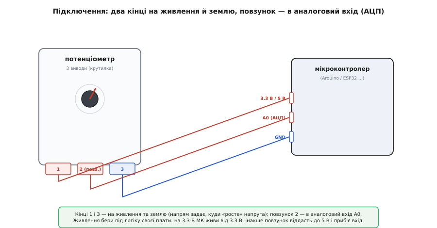

# Поворотний потенціометр

<preknowlist>
- [Дільник напруги](topic:electronics/voltage-divider) — два опори послідовно ділять напругу пропорційно собі; це рівно те, що робить потенціометр усередині, тому без цього не зрозуміти, звідки береться вихід.
- [АЦП](topic:electronics/adc) — як мікроконтролер перетворює напругу на число; повзунок віддає саме напругу, і читаємо ми її аналоговим входом.
- [Рівні «0» і «1»](topic:electronics/logic-levels-as-ranges) — що вхід плати чекає в допустимому діапазоні й чому 5 В на 3.3-вольтовий вхід — біда; звідси головне застереження про живлення.
</preknowlist>

Візьми в руки стару колонку чи підсилювач і крутни ручку гучності. Пальцям приємно: ручка йде з легким опором, має чіткий початок і чіткий кінець — докрутив до упору вліво, тихо; докрутив вправо, гучно. Це і є **поворотний потенціометр** — найпростіший спосіб рукою задати пристрою одне плавне число: «зроби ось настільки». Не «на скільки кроків крутнути», а саме «постав на оцю позначку й тримай». Крутнув до третини — і поки не чіпаєш, воно стоїть на третині, хоч вимикай, хоч чекай годину.

Усередині немає ні мікросхеми, ні живлення для роботи самого давача, ні цифри. Є смужка матеріалу з опором і рухома лапка, що по ній ковзає. Уся річ будується на одній думці — [поділі напруги](topic:electronics/voltage-divider), — і саме тому потенціометр так легко читати мікроконтролером: він віддає готову напругу, яку лишається лише виміряти. Розберімо його до кінця: що там усередині, чому три виводи (а не два), як під'єднати до плати й де новачки спотикаються.

## Що це і навіщо

Потенціометр (від лат. *potentia* — сила, могутність, і гр. *métron* — міра; буквально «мірило потенціалу», бо [найперші такі пристрої були точними приладами, що *міряли* напругу](topic:sensors/rotary-potentiometer/hist-poggendorff.md), а не ручками-регуляторами) відповідає на питання **«на яку частку від краю до краю ти зараз повернув ручку»**. Не «під яким кутом абсолютно» в градусах, а саме *частку*: нуль на одному упорі, повний хід — на іншому, і будь-де посередині — своя проміжна величина. Головне слово тут — **абсолютне положення**: де ручку залишив, там значення й стоїть, незалежно від того, як довго пристрій вимкнено.

Це відрізняє потенціометр від його сусіда по панелі — [поворотного енкодера](topic:sensors/ky-040-encoder), який каже лише «крутнули ще на крок туди» чи «на крок сюди» й не має ні країв, ні пам'яті положення. Енкодер — про *зміну*; потенціометр — про *стан*. Тому:

> 🔧 **Навіщо це.** Бери потенціометр там, де людині зручно бачити налаштування *очима, по самому куту ручки*, і де приємно мати фізичні упори: гучність, яскравість, контраст, поріг спрацювання, «наскільки відкрити». Крутнув — і кут ручки сам показує, на чому ти зупинився, без екрана. А ще його читати простіше нікуди: один аналоговий вхід — і в тебе число. Там, де треба крутити *нескінченно* й накопичувати значення в пам'яті (меню, енкодер гучності, що пам'ятає рівень між вмиканнями), потенціометр не годиться — там [енкодер](topic:sensors/ky-040-encoder).

## Що всередині: три виводи й поділ напруги

Головна несподіванка для новачка — **у потенціометра три виводи, а не два**. Розберімося, звідки береться третій, бо саме він робить усю магію.

Усередині — дугоподібна смужка матеріалу з опором (**доріжка**, англ. *track*): графіто-вугільна суміш, провідний пластик, а в точних моделях — намотаний дріт. Ця доріжка має **два кінці**, і між ними — повний опір деталі: скажімо, 10 кОм. Це вже два виводи. Якби на них усе й закінчувалось, ми мали б звичайний нерухомий резистор.

Але по доріжці ковзає **повзунок** (англ. *wiper*, «двірник» — бо рухається туди-сюди, як щітка склоочисника) — рухомий контакт, насаджений на вал. Крутиш вал — повзунок їде доріжкою й торкається її в тій точці, де зараз стоїть. Від повзунка йде **третій вивід**. Оце і є та лапка, що перетворює нерухомий резистор на регульований.


*Три виводи потенціометра. Кінці доріжки (виводи 1 і 3) — це весь опір деталі; повзунок (вивід 2) торкається доріжки там, де стоїть вал, і ділить її на дві послідовні частини. Скільки опору лишилось до «+» кінця і скільки до «−» — саме цей поділ і задає вихідну напругу на повзунку.*

Тепер найважливіше — **чому це дільник напруги**. Приєднай два кінці доріжки до живлення: один кінець до «+» (скажімо, 5 В), другий до «−» (землі). Уся доріжка тепер під напругою, і струм тихенько тече крізь неї від «+» до «−». А повзунок стоїть *десь посередині* цього шляху й «підслуховує», яка напруга в точці його дотику.

Повзунок ділить доріжку на дві послідовні частини: частину «над» ним (до «+») з опором R_верх і частину «під» ним (до «−») з опором R_низ. Разом вони завжди дають повний опір: R_верх + R_низ = R_повний. А напруга на повзунку — це класичний [дільник](topic:electronics/voltage-divider):

```
U_повз = U_жив · R_низ / (R_верх + R_низ) = U_жив · R_низ / R_повний
```

Крутнув повзунок до самого «−» кінця — R_низ ≈ 0, і U_повз ≈ 0 В. Крутнув до «+» — R_низ ≈ R_повний, і U_повз ≈ U_жив (усі 5 В). Поставив посередині — R_низ ≈ половина, і U_повз ≈ половина живлення, ≈ 2.5 В. **Положення ручки → частка → напруга.** Це і є весь потенціометр: рукою рухаєш повзунок, а він віддає напругу, пропорційну тому, куди ти його поставив.

> 🔧 **Навіщо це.** Розуміння «це дільник напруги» одразу пояснює три речі, які інакше здаються магією. Перше: чому вихідна напруга залежить *лише від частки положення*, а не від того, 10 це кОм чи 100 кОм — бо в дільнику важить *відношення* плечей, а не самі опори. Друге: чому виходить рівно 0…U_жив і ніколи не більше — повзунок фізично не може вийти за кінці доріжки. Третє: чому потенціометр можна живити 3.3 В або 5 В без переробки — він просто ділить те, що дали, тож і вихід масштабується сам. Глибше про сам поділ напруги, вплив навантаження на повзунок і повний вивід формули — у [дільнику напруги](topic:electronics/voltage-divider); про потенціометр як загальний клас резисторного елемента — в [окремій статті про потенціометр](topic:electronics/potentiometer).

Чому довша частина доріжки має більший опір? Бо опір смужки прямо росте з її довжиною: удвічі довший шматок того самого матеріалу — удвічі більший опір (це [питомий опір](topic:physics/resistivity) у дії). Повзунок, зсуваючись, і міняє довжини двох плечей — тому кут повороту так гладко перетворюється на напругу.

## Профіль: лінійний і логарифмічний

У найпростішому потенціометрі половині ходу відповідає половина опору — але так буває не завжди. Спосіб, яким опір наростає з кутом, називають **профілем** (англ. *taper*, буквально «звуження»), і профілів два поширені.

**Лінійний** (маркування зазвичай «**B**»): половина ходу — половина опору, три чверті ходу — три чверті опору. Кут прямо пропорційний величині. Це те, що треба для регулятора яскравості, положення, порогу — усюди, де хочеш, щоб «половина ручки = половина значення».

**Логарифмічний**, він же «аудіо» (маркування зазвичай «**A**»): опір спершу наростає повільно, а під кінець ходу — різко. На півходу набирається лише десь десята частина повного опору, а решта тиснеться у верхню чверть.


*Той самий фізичний хід ручки, різний закон нанесення шару опору. У лінійного «B» кут прямо пропорційний опору. У логарифмічного «A» на півходу набирається лише близько десятої частини, а основне — під кінець. Саме тому «A» ставлять на гучність: вухо сприймає гучність логарифмічно, і лог-профіль компенсує це так, що зростання гучності відчувається рівномірним уздовж усього ходу ручки.*

Навіщо взагалі логарифмічний? Бо **вухо чує гучність логарифмічно**: у тихому діапазоні мала зміна потужності звучить як велика зміна гучності, а в гучному потрібна велика зміна потужності для того самого приросту на слух. Якби гучність крутили лінійним потенціометром, майже вся чутна зміна тиснулась би в перші кілька градусів повороту, а далі «нічого не відбувається». Логарифмічний профіль розтягує тихий початок на весь хід ручки — і зростання гучності відчувається рівним від упору до упору.

> 🔧 **Навіщо це.** Профіль — головна причина «щось не так із моєю ручкою». Поставив лінійний «B» на гучність — і вся гучність з'являється в перших 20° повороту, а решта ходу «мертва». Поставив логарифмічний «A» на яскравість чи положення — і половина ручки дає лише десяту частину, керувати незручно. Правило просте: **гучність і будь-що для слуху — логарифмічний (A); усе інше — лінійний (B).** І сумна пастка на закупівлі: **маркування A/B у різних виробників плутане.** Азійські й американські деталі: A = лог, B = лінійний; частина європейських — навпаки (A = лінійний), а буває ще «C» чи «F» для оберненого логарифма. Тому не вір літері наосліп: звіряйся з даташитом або зміряй опір повзунка на півходу омметром.

## Підключення до плати

Три виводи — три дроти, і вся хитрість у тому, *який куди*. Два кінці доріжки задають напрям, куди «росте» напруга; повзунок віддає результат.



*Розводка пін-у-пін. Кінці доріжки (1 і 3) — на живлення й землю; який кінець куди, задає лише напрям росту (переплутав — просто інвертується). Повзунок (2) — в аналоговий вхід A0, який читає АЦП. Живлення бери під логіку своєї плати.*

Виходить так:

```
вивід 1 (кінець доріжки) →  живлення (3.3 В або 5 В — під логіку плати)
вивід 2 (повзунок)       →  аналоговий вхід (напр. A0)
вивід 3 (кінець доріжки) →  GND (земля)
```

Три деталі варто назвати прямо.

**Кінці 1 і 3 рівноправні за напрямом.** Який кінець доріжки на «+», а який на «−» — задає лише те, у який бік «росте» число: крутнеш управо — більшає чи меншає. Переплутав місцями — не поломка, просто ручка працює навпаки; поміняй дроти або відніми значення від максимуму в коді.

**Живлення — суворо під логіку плати.** Потенціометр віддає на повзунку напругу від нуля до *свого живлення*. Нагодуй його п'ятьма вольтами, а повзунок заведи на 3.3-вольтову плату ([ESP32](topic:boards/esp32-family) чи подібну) — і в крайньому положенні повзунок подасть на вхід усі 5 В, що приб'є вхід, розрахований на 3.3 В. Правило те саме, що для всіх аналогових давачів: живи потенціометр від тієї ж напруги, що й [рівні](topic:electronics/logic-levels-as-ranges) твоєї плати. Тоді повний хід ручки якраз ляже в діапазон АЦП.

**Повзунок нікуди не «висить».** На відміну від голої кнопки, повзунковому виводу не потрібна підтяжка: він завжди приєднаний через доріжку і до «+», і до «−», тож завжди має визначену напругу. Це робить потенціометр приємно простим — жодних `INPUT_PULLUP`, жодних зовнішніх резисторів.

## Як читати в коді

Оскільки на повзунку — звичайна аналогова напруга, читання зводиться до одного виклику АЦП. На Arduino це `analogRead`, що повертає число від 0 (нуль вольт) до максимуму, який задає [роздільність АЦП](topic:electronics/adc-resolution): у 10-бітного АЦП Arduino Uno це 1023.

**Умова.** Повзунок потенціометра — на A0 Arduino Uno, кінці на 5 В і GND. Крутимо ручку — у Serial повзе число 0…1023, і воно ж масштабоване у зрозумілі 0…100 %.

:::tabs
```cpp
const uint8_t PIN_POT = A0;      // повзунок потенціометра

void setup() {
  Serial.begin(9600);
  // аналоговий вхід не треба конфігурувати pinMode — analogRead налаштує сам
}

void loop() {
  int raw = analogRead(PIN_POT);           // 0..1023: сира частка ходу
  int pct = map(raw, 0, 1023, 0, 100);     // те саме у відсотках 0..100
  Serial.print(raw);
  Serial.print("  ->  ");
  Serial.print(pct);
  Serial.println(" %");
  delay(100);
}
```
```micropython
from machine import ADC, Pin
import time

pot = ADC(Pin(26))               # повзунок потенціометра на GP26 (ADC0)

while True:
    raw = pot.read_u16() >> 6    # 16-бітне читання → 0..1023, як у 10-бітного АЦП
    pct = raw * 100 // 1023      # те саме у відсотках 0..100
    print(raw, " ->  ", pct, "%")
    time.sleep_ms(100)
```
:::

Це працює й одразу дає відчути потенціометр. Але сире число має неприємну звичку: **воно тремтить у молодших розрядах**, навіть коли ручку не чіпаєш. Причина не в потенціометрі, а в тому, що АЦП вимірює до останнього біта, а на тому рівні завжди є трохи наведеного шуму й похибки самого перетворювача. Побачити просто — прибери `delay` і дивись, як `raw` смикається на ±1…2 навколо якогось значення, хоч ручка стоїть намертво.

> 🔧 **Навіщо це.** Це тремтіння — головне, що відрізняє «крутиться, але цифри стрибають» від рівного керування. Наївний код передає його прямо в яскравість чи гучність, і та ледь помітно «дихає». Лікують двома звичками. Перша — **згладжування**: усереднюй кілька останніх відліків (простий ковзний середній чи експоненційний фільтр), і тремтіння втоне. Друга — **мертва зона** (deadband): реагуй, лише коли значення змінилось хоч на кілька одиниць, — тоді ручка, що стоїть, не сипле подіями. Обидва прийоми з робочим C++, а ще перетворення в осмислені одиниці, калібрування під реальні краї ходу й читання на ESP32 (де АЦП 12-бітний і трохи нелінійний) винесено в [окрему вставку з прошивкою під потенціометр](topic:sensors/rotary-potentiometer/proj-potentiometer.md) — там готовий клас, який можна взяти в проєкт.

## Де це стоїть насправді

Впізнати потенціометр легко: одна кругла ручка з упорами, три виводи, іноді з насічкою під ковпачок. Його рід стоїть усюди, де людині зручно виставити плавне значення рукою й бачити його по куту.

**Регулятори з упорами.** Гучність і тембр на підсилювачах, яскравість і контраст, температура на найпростіших термостатах, поріг чутливості на давачах руху — усе, де крутнув до потрібної позначки й лишив. Кут ручки сам показує рівень, екран не потрібен.

**Налаштування, яке виставляють раз і зрідка чіпають.** Тут часто беруть маленький братній різновид — **підлаштовник** (англ. *trimmer*): той самий потенціометр, але без ручки, під викрутку, посаджений просто на плату. Ним калібрують поріг компаратора, контраст дисплея, підстроюють опорну напругу — «виставив на заводі й забув».

**Ручне введення однієї величини в проєкті.** У навчальних і саморобних пристроях потенціометр — найшвидший спосіб дати мікроконтролеру одне число, яке крутиш наживо: швидкість мотора, яскравість стрічки, частоту миготіння, положення сервоприводу. Один аналоговий вхід — і в тебе рукостійкий регулятор без жодної додаткової схеми.

**Давач положення.** Насаджений на вісь механізму, потенціометр перетворюється на давач кута: за напругою повзунка контролер знає, наскільки повернуто важіль чи заслінку. Саме так працюють обидві осі [джойстика KY-023](topic:sensors/ky-023-joystick) — це два потенціометри на схрещених осях, кожен віддає напругу за нахилом ручки.

> 🔧 **Навіщо це.** Помітивши цей ряд, легко вирішувати між трьома сусідами по панелі. **Потенціометр** — коли треба *абсолютне* положення «куди поставив, там і є», простий аналоговий вихід і не шкода фізичних упорів (гучність, яскравість, поріг). **[Енкодер](topic:sensors/ky-040-encoder)** — коли треба крутити *нескінченно* й накопичувати значення в пам'яті (меню, гучність, що пам'ятається між вмиканнями). **[Кнопка](topic:sensors/ky-004-button)** — коли потрібна дискретна подія «так/ні», а не плавна величина. Потенціометр — єдиний із трьох, хто дає плавне число одним рухом і показує його самим кутом ручки.

## Що з цього винести

Поворотний потенціометр — це **смужка опору з двома кінцями й рухомим повзунком на валу**, тобто регульований [дільник напруги](topic:electronics/voltage-divider) під пальцями. Приєднай кінці доріжки до живлення й землі, а повзунок — до аналогового входу: він віддасть напругу, пропорційну *частці* повороту ручки, від 0 до живлення. Головне про нього — **абсолютне положення**: де ручку залишив, там значення й стоїть, навіть після вимкнення. Читається одним `analogRead`, підтяжок не треба; лишається згладити тремтіння молодших розрядів АЦП. Профіль буває лінійний («B», кут пропорційний величині — для яскравості, положення, порогу) і логарифмічний («A», повільно-потім-різко — для гучності, бо вухо чує логарифмом), і маркування A/B у різних виробників плутане, тож звіряйся з даташитом. Живлення — суворо під логіку плати, інакше повзунок у крайньому положенні подасть завелику напругу на вхід. Бери потенціометр, коли треба рукою виставити плавне значення й бачити його по куту; де потрібне нескінченне кручіння з пам'яттю — бери енкодер, де дискретна подія — кнопку.
