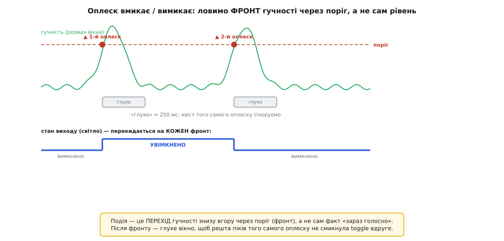

# ⚙️ Оплеск-перемикач на KY-037: одна подія на оплеск

«Оплеск вмикає світло, оплеск вимикає» — класична демонстрація звукового давача, і на ній добре видно, чому подію треба ловити з розумом. Наївний код виходить дивним: один оплеск вмикає світло й тут-таки вимикає; поставиш лічильник — а він намотує десяток спрацювань на один сплеск. Причина не в давачі: цифровий вихід DO тримається в стані «гучно», поки звук над порогом, а сам оплеск має хвіст і відлуння. Ця вставка збирає надійний перемикач із трьох прийомів — читати **фронт** (а не рівень), гасити хвіст **гістерезисом у часі** й не зашивати полярність намертво, — робочим кодом одразу в трьох середовищах: Arduino, ESP-IDF і STM32 HAL.

Читання самого біта DO — з автовизначенням полярності через `isLoud()`, а також вимірювання рівня з аналогового виходу — розібрано в [довідці читання виходів KY-037](book:sensors/ky-037-mic/api-ky037-driver.md); тут ми будуємо на ній прикладну логіку «одна подія на один оплеск».

## Чому фронт, а не рівень

Поки звук залишається гучнішим за поріг, DO **тримається в стані події безперервно**, а не «пікає» один раз. Крикнув на секунду — DO цілу секунду в «події». Для задачі «світи, поки шумно» це якраз добре — читаєш рівень прямо. Але для «порахувати оплески» чи «оплеск перемкнув світло» цього мало: якщо реагувати на сам **рівень**, один затяжний звук зарахується як безліч подій (цикл крутиться мільйони разів на секунду, і кожен оберт бачить «гучно»). Тобі потрібен не рівень, а **момент його появи** — перехід «тихо → гучно», тобто **фронт**.

## Чому гістерезис: один оплеск — не один перетин порога

І тут найтонша проблема. Здавалося б, лови фронт — і кожен оплеск дасть рівно один перехід «тихо → гучно». Насправді ні. Оплеск — не рівний сплеск, а короткий **сплеск із хвостом**: гучність підстрибує над порогом, трохи спадає, знову підскакує на відлунні й затуханні. Компаратор чесно перекидає DO на кожне таке коливання біля порога. Один твій оплеск легко дає дві-три-п'ять появ «гучно» за якихось 200 мілісекунд — і наївний лічильник фронтів намотає їх усі.

Ліки — той самий прийом, що й у будь-якій пороговій схемі: **поріг плюс гістерезис у часі**. Зарахував подію — і на певний час «глухнеш»: усе, що прилітає в це вікно, вважаєш хвостом того самого оплеску й ігноруєш. Цей підхід «не реагувати на кожне мікроколивання біля межі» — рідний брат [тригера Шмітта](book:electronics/schmitt-trigger), тільки гістерезис тут не по напрузі, а по **часу**.


*Оплеск як подія, а не як рівень. Верхня крива — гучність (розмах вікна); подія це не «зараз голосно», а **перехід через поріг знизу вгору** — фронт (кружечки). Одразу після фронту настає «глухе» вікно (≈250 мс), де решту піків того самого оплеску ми ігноруємо, щоб хвіст не смикнув реакцію вдруге. Нижня доріжка — стан виходу (світло): він перекидається на кожен зарахований фронт, тож перший оплеск вмикає, другий вимикає.*

## Робочий приклад: оплеск-перемикач

Заліза треба мінімум, і воно є в будь-якого мікроконтролера: один цифровий вхід під DO, один цифровий вихід під світло чи реле і монотонний лічильник мілісекунд від старту (`millis()` в Arduino, `esp_timer_get_time()` в ESP-IDF, `HAL_GetTick()` на STM32). Ідея цілісна: читаємо DO через `isLoud()` з автополярністю; ловимо **фронт** «тихо → гучно»; після кожного зарахованого оплеску глухнемо на вікно гістерезису; на кожен зарахований оплеск **перекидаємо** стан світла. Нижче той самий алгоритм у трьох середовищах — Arduino (Uno, Nano — родина ATmega328), ESP-IDF і STM32 HAL.

**Умова.** DO під'єднано до звичайного цифрового входу (в Arduino беремо D3, в ESP-IDF — GPIO 27, на STM32 — PA3), поріг виставлено гвинтиком за світлодіодом LED2 на платі. Кожен окремий оплеск має перемкнути стан реле/світла на цифровому виході (D13 · GPIO 2 · PA5): перший — увімкнути, другий — вимкнути. Хвіст і відлуння одного оплеску не повинні лічитися вдруге.

:::tabs
```arduino
const uint8_t SOUND = 3;           // DO давача
const uint8_t LED   = 13;          // світло / реле, яким керуємо

const uint32_t DEAF_MS = 250;      // «глухе» вікно після оплеску, мс (гістерезис у часі)

int      g_idle;                   // рівень спокою DO (автовизначення)
bool     g_wasLoud   = false;      // чи було «гучно» на попередньому оберті (для фронту)
uint32_t g_lastClap  = 0;          // час останнього ЗАРАХОВАНОГО оплеску
bool     g_lightOn   = false;      // поточний стан світла

inline bool isLoud() { return digitalRead(SOUND) != g_idle; }

void setup() {
    pinMode(SOUND, INPUT);
    pinMode(LED, OUTPUT);
    Serial.begin(9600);
    delay(50);
    g_idle = digitalRead(SOUND);   // тиша = спокій цієї плати
    Serial.print("Спокій DO = ");
    Serial.println(g_idle == HIGH ? "HIGH" : "LOW");
    Serial.println("Плесни, щоб перемкнути світло.");
}

void loop() {
    bool loud = isLoud();

    // Фронт «тихо → гучно»: цього оберту гучно, а минулого було тихо.
    bool rising = loud && !g_wasLoud;
    g_wasLoud = loud;

    if (rising) {
        // Зараховуємо оплеск, лише якщо минуло «глухе» вікно від попереднього.
        if (millis() - g_lastClap >= DEAF_MS) {
            g_lastClap = millis();
            g_lightOn = !g_lightOn;              // ПЕРЕКИДАЄМО стан
            digitalWrite(LED, g_lightOn);
            Serial.println(g_lightOn ? "оплеск → УВІМКНЕНО" : "оплеск → вимкнено");
        }
        // інакше це хвіст/відлуння того самого оплеску — мовчки ігноруємо
    }
    // ...головний цикл вільний робити будь-що інше...
}
```
```esp-idf
#include "driver/gpio.h"
#include "esp_log.h"
#include "esp_timer.h"
#include "freertos/FreeRTOS.h"
#include "freertos/task.h"
#include <stdbool.h>

#define PIN_SOUND  GPIO_NUM_27         // DO давача
#define PIN_LED    GPIO_NUM_2          // світло / реле, яким керуємо

#define DEAF_MS    250                 // «глухе» вікно після оплеску, мс (гістерезис у часі)

static const char *TAG = "clap";

static int     g_idle;                 // рівень спокою DO (автовизначення)
static bool    g_wasLoud  = false;     // чи було «гучно» на попередньому оберті (для фронту)
static int64_t g_lastClap = 0;         // час останнього ЗАРАХОВАНОГО оплеску
static bool    g_lightOn  = false;     // поточний стан світла

static inline int64_t now_ms(void) { return esp_timer_get_time() / 1000; }
static inline bool isLoud(void) { return gpio_get_level(PIN_SOUND) != g_idle; }

static void clap_task(void *arg) {
    for (;;) {
        bool loud = isLoud();

        // Фронт «тихо → гучно»: цього оберту гучно, а минулого було тихо.
        bool rising = loud && !g_wasLoud;
        g_wasLoud = loud;

        // Зараховуємо оплеск, лише якщо минуло «глухе» вікно від попереднього.
        if (rising && now_ms() - g_lastClap >= DEAF_MS) {
            g_lastClap = now_ms();
            g_lightOn = !g_lightOn;                    // ПЕРЕКИДАЄМО стан
            gpio_set_level(PIN_LED, g_lightOn);
            ESP_LOGI(TAG, "%s", g_lightOn ? "оплеск → УВІМКНЕНО" : "оплеск → вимкнено");
        }
        vTaskDelay(pdMS_TO_TICKS(1));   // віддаємо процесор іншим задачам, фронт не губимо
    }
}

void app_main(void) {
    gpio_config_t in = { .pin_bit_mask = 1ULL << PIN_SOUND, .mode = GPIO_MODE_INPUT,
                         .pull_up_en = GPIO_PULLUP_DISABLE, .pull_down_en = GPIO_PULLDOWN_DISABLE,
                         .intr_type = GPIO_INTR_DISABLE };
    gpio_config_t out = { .pin_bit_mask = 1ULL << PIN_LED, .mode = GPIO_MODE_OUTPUT,
                          .pull_up_en = GPIO_PULLUP_DISABLE, .pull_down_en = GPIO_PULLDOWN_DISABLE,
                          .intr_type = GPIO_INTR_DISABLE };
    ESP_ERROR_CHECK(gpio_config(&in));
    ESP_ERROR_CHECK(gpio_config(&out));

    vTaskDelay(pdMS_TO_TICKS(50));
    g_idle = gpio_get_level(PIN_SOUND);   // тиша = спокій цієї плати
    ESP_LOGI(TAG, "Спокій DO = %s", g_idle ? "HIGH" : "LOW");
    ESP_LOGI(TAG, "Плесни, щоб перемкнути світло.");

    xTaskCreate(clap_task, "clap", 3072, NULL, 5, NULL);
}
```
```stm32
/* CubeMX: PA3 — GPIO_Input (DO), PA5 — GPIO_Output (світло/реле), USART2 — 115200 */
#include "main.h"
#include <stdbool.h>
#include <string.h>

#define DO_PORT   GPIOA
#define DO_PIN    GPIO_PIN_3           // DO давача
#define LED_PORT  GPIOA
#define LED_PIN   GPIO_PIN_5           // світло / реле, яким керуємо

#define DEAF_MS   250u                 // «глухе» вікно після оплеску, мс (гістерезис у часі)

extern UART_HandleTypeDef huart2;

static GPIO_PinState g_idle;           // рівень спокою DO (автовизначення)
static bool     g_wasLoud  = false;    // чи було «гучно» на попередньому оберті (для фронту)
static uint32_t g_lastClap = 0;        // час останнього ЗАРАХОВАНОГО оплеску
static bool     g_lightOn  = false;    // поточний стан світла

static void say(const char *s) {
    HAL_UART_Transmit(&huart2, (uint8_t *)s, strlen(s), HAL_MAX_DELAY);
}

static bool isLoud(void) { return HAL_GPIO_ReadPin(DO_PORT, DO_PIN) != g_idle; }

void clap_setup(void) {                // викликати з main() після MX_GPIO_Init()
    HAL_Delay(50);
    g_idle = HAL_GPIO_ReadPin(DO_PORT, DO_PIN);   // тиша = спокій цієї плати
    say(g_idle == GPIO_PIN_SET ? "Спокій DO = HIGH\r\n" : "Спокій DO = LOW\r\n");
    say("Плесни, щоб перемкнути світло.\r\n");
}

void clap_poll(void) {                 // викликати з while (1) — без жодної затримки
    bool loud = isLoud();

    // Фронт «тихо → гучно»: цього оберту гучно, а минулого було тихо.
    bool rising = loud && !g_wasLoud;
    g_wasLoud = loud;

    // Зараховуємо оплеск, лише якщо минуло «глухе» вікно від попереднього.
    if (rising && (uint32_t)(HAL_GetTick() - g_lastClap) >= DEAF_MS) {
        g_lastClap = HAL_GetTick();
        g_lightOn = !g_lightOn;                    // ПЕРЕКИДАЄМО стан
        HAL_GPIO_WritePin(LED_PORT, LED_PIN, g_lightOn ? GPIO_PIN_SET : GPIO_PIN_RESET);
        say(g_lightOn ? "оплеск → УВІМКНЕНО\r\n" : "оплеск → вимкнено\r\n");
    }
    // інакше це хвіст/відлуння того самого оплеску — мовчки ігноруємо
}
```
:::

Розберімо, чому кожен шматок саме такий — зайвого рядка тут немає.

**Чому фронт, а не рівень.** Змінна `g_wasLoud` пам'ятає, чи було гучно на попередньому оберті. Умова `loud && !g_wasLoud` спрацьовує **рівно в ту мить**, коли гучність щойно з'явилася — на переході «тихо → гучно». Поки звук тримається гучним, `g_wasLoud` уже `true`, і `rising` більше не спрацьовує, скільки б обертів не крутився цикл. Один сплеск — один фронт. Це прибирає лічбу затяжного звуку як безлічі подій.

**Чому «глухе» вікно на мітці часу.** Навіть після фільтра фронту один оплеск дає кілька переходів «тихо → гучно» (гучність провалюється під поріг між підскоками хвоста й повертається). Умова `millis() - g_lastClap >= DEAF_MS` каже: «зараховуй фронт, лише якщо від попереднього **зарахованого** оплеску минуло щонайменше 250 мс». Перший фронт оплеску проходить — рахуємо; усі наступні протягом 250 мс — не проходять, бо від зарахованого минуло замало, і тихо відкидаються. Наступний **справжній** оплеск станеться пізніше — знову пройде. Так один поштовх дає рівно одну зміну стану.

**Чому саме 250 мс.** Це компроміс під людський оплеск. Замале вікно (30–50 мс) не приборкає відлуння — хвіст просочиться. Завелике (понад секунду) почне зливати два справді різні оплески, якщо плескати швидко. 200–300 мс переживає хвіст одного оплеску, але дозволяє свідомо плеснути двічі з паузою. Число підбирають під приміщення: у гулкій кімнаті відлуння довше, вікно варто збільшити.

**Чому жодного `delay` у циклі.** Увесь скетч наскрізь неблокувальний: ми ніде не «пережидаємо» вікно гістерезису через `delay(250)`, а лише **запам'ятовуємо мить** і при кожному новому фронті питаємо, чи минуло досить. Це принципово: `delay(250)` (так само `HAL_Delay(250)` на STM32) оглушив би весь пристрій на чверть секунди щоразу — не читав би інших давачів, не крутив дисплей, не відповідав по мережі. Під FreeRTOS `vTaskDelay` присипляє лише свою задачу, решта системи живе — але наша задача так само проспала б наступний оплеск. Мітка часу робить те саме придушення, не крадучи ні мілісекунди в решти коду.

> 🔧 **Навіщо це.** Різниця між «фронт + мітка часу» і «рівень + `delay`» — це різниця між приладом і іграшкою. Наївний код на самому рівні перетворює один оплеск на бурю спрацювань, а `delay`-затримка оглушує весь пристрій. Пара `g_wasLoud` + `g_lastClap` дає надійне «одна подія на оплеск», лишаючи цикл увесь час живим. Цей самий кістяк — ловити фронт, глушити хвіст міткою часу — працює з будь-яким пороговим давачем-подією: [струсовим KY-002](book:sensors/ky-002-vibration/proj-ky002-shock.md), герконовим, кнопкою. Навчився тут — застосуєш усюди.

Одне практичне попередження про сам оплеск як інтерфейс: **KY-037 не відрізняє оплеск від грюкання дверима, кашлю чи гучної музики** — для нього все це «звук понад поріг». «Оплеск вмикає світло» — приємна демонстрація, але як надійний інтерфейс керування воно ненадійне: спрацює від будь-якого різкого звуку. Хочеш саме розпізнавати оплеск (а не будь-який сплеск) — це вже задача аналізу форми звуку в часі (два коротких сплески з певною паузою — «подвійний оплеск»), і DO для неї замалий; тут потрібен аналоговий тракт із обробкою, а краще — окремий цифровий мікрофон.

## Порт на ESP32

На ESP32 ідея та сама — читати DO через автополярність, а рівень міряти вікном, — але АЦП тут інший: 12-бітний (0…4095 замість 0…1023), і є пастка з Wi-Fi, через яку AO можна саджати **лише** на пін блоку АЦП1 (GPIO 32…39). Чому саме так, які піни небезпечні й чому пороги доводиться перераховувати — розписано в [довідці читання виходів](book:sensors/ky-037-mic/api-ky037-driver.md); тут ми просто застосовуємо готове правило: AO на GPIO 34, DO — на будь-який зручний GPIO.

**Умова.** DO — на GPIO 27 (цифровий вхід, автополярність), AO — на **GPIO 34** (пін АЦП1, безпечний навіть із Wi-Fi). Читаємо і подію оплеску (з гістерезисом), і рівень гучності вікном; виводимо в монітор. Те саме — двома середовищами: Arduino-ядром для ESP32 і нативним ESP-IDF.

:::tabs
```arduino
const uint8_t SOUND = 27;          // DO — будь-який GPIO (digitalRead, не АЦП)
const uint8_t MIC   = 34;          // AO — ТІЛЬКИ пін АЦП1 (32..39), щоб пережити Wi-Fi
const uint32_t DEAF_MS = 250;
const uint32_t WINDOW  = 50;

int      g_idle;
bool     g_wasLoud  = false;
uint32_t g_lastClap = 0;
bool     g_lightOn  = false;

inline bool isLoud() { return digitalRead(SOUND) != g_idle; }

int measurePeakToPeak() {
    uint32_t t0 = millis();
    int hi = 0, lo = 4095;         // 12-бітний АЦП ESP32: діапазон 0..4095
    while (millis() - t0 < WINDOW) {
        int v = analogRead(MIC);
        if (v > hi) hi = v;
        if (v < lo) lo = v;
    }
    return hi - lo;
}

void setup() {
    Serial.begin(115200);
    delay(100);
    pinMode(SOUND, INPUT);
    // analogReadResolution(12);   // 12 біт — типово, рядок для явності
    delay(50);
    g_idle = digitalRead(SOUND);
    Serial.printf("Спокій DO = %s\n", g_idle == HIGH ? "HIGH" : "LOW");
    Serial.println("Плесни для перемикання; заодно друкую рівень гучності.");
}

void loop() {
    // --- подія оплеску (фронт + гістерезис) ---
    bool loud = isLoud();
    bool rising = loud && !g_wasLoud;
    g_wasLoud = loud;
    if (rising && millis() - g_lastClap >= DEAF_MS) {
        g_lastClap = millis();
        g_lightOn = !g_lightOn;
        Serial.println(g_lightOn ? "оплеск → УВІМКНЕНО" : "оплеск → вимкнено");
    }

    // --- рівень гучності вікном (нечасто, щоб не забивати монітор) ---
    static uint32_t lastPrint = 0;
    if (millis() - lastPrint >= 300) {
        lastPrint = millis();
        Serial.printf("рівень = %d\n", measurePeakToPeak());
    }
}
```
```esp-idf
#include "driver/gpio.h"
#include "esp_adc/adc_oneshot.h"
#include "esp_log.h"
#include "esp_timer.h"
#include "freertos/FreeRTOS.h"
#include "freertos/task.h"
#include <stdbool.h>

#define PIN_SOUND  GPIO_NUM_27         // DO — будь-який GPIO (gpio_get_level, не АЦП)
#define MIC_UNIT   ADC_UNIT_1          // AO — ТІЛЬКИ АЦП1: АЦП2 забирає Wi-Fi
#define MIC_CH     ADC_CHANNEL_6       // ADC1_CH6 = GPIO 34
#define DEAF_MS    250
#define WINDOW_MS  50

static const char *TAG = "clap";
static adc_oneshot_unit_handle_t s_adc1;

static int     g_idle;
static bool    g_wasLoud  = false;
static int64_t g_lastClap = 0;
static bool    g_lightOn  = false;

static inline int64_t now_ms(void) { return esp_timer_get_time() / 1000; }
static inline bool isLoud(void) { return gpio_get_level(PIN_SOUND) != g_idle; }

static int measure_peak_to_peak(void) {
    int64_t t0 = now_ms();
    int hi = 0, lo = 4095, v = 0;      // 12-бітний АЦП ESP32: діапазон 0..4095
    while (now_ms() - t0 < WINDOW_MS) {
        if (adc_oneshot_read(s_adc1, MIC_CH, &v) != ESP_OK) continue;
        if (v > hi) hi = v;
        if (v < lo) lo = v;
    }
    return hi - lo;
}

static void clap_task(void *arg) {
    int64_t lastPrint = 0;
    for (;;) {
        // --- подія оплеску (фронт + гістерезис) ---
        bool loud = isLoud();
        bool rising = loud && !g_wasLoud;
        g_wasLoud = loud;
        if (rising && now_ms() - g_lastClap >= DEAF_MS) {
            g_lastClap = now_ms();
            g_lightOn = !g_lightOn;
            ESP_LOGI(TAG, "%s", g_lightOn ? "оплеск → УВІМКНЕНО" : "оплеск → вимкнено");
        }

        // --- рівень гучності вікном (нечасто, щоб не забивати лог) ---
        if (now_ms() - lastPrint >= 300) {
            lastPrint = now_ms();
            ESP_LOGI(TAG, "рівень = %d", measure_peak_to_peak());
        }
        vTaskDelay(pdMS_TO_TICKS(1));
    }
}

void app_main(void) {
    gpio_config_t in = { .pin_bit_mask = 1ULL << PIN_SOUND, .mode = GPIO_MODE_INPUT,
                         .pull_up_en = GPIO_PULLUP_DISABLE, .pull_down_en = GPIO_PULLDOWN_DISABLE,
                         .intr_type = GPIO_INTR_DISABLE };
    ESP_ERROR_CHECK(gpio_config(&in));

    adc_oneshot_unit_init_cfg_t unit = { .unit_id = MIC_UNIT };
    ESP_ERROR_CHECK(adc_oneshot_new_unit(&unit, &s_adc1));
    adc_oneshot_chan_cfg_t ch = { .atten = ADC_ATTEN_DB_12, .bitwidth = ADC_BITWIDTH_12 };
    ESP_ERROR_CHECK(adc_oneshot_config_channel(s_adc1, MIC_CH, &ch));

    vTaskDelay(pdMS_TO_TICKS(50));
    g_idle = gpio_get_level(PIN_SOUND);
    ESP_LOGI(TAG, "Спокій DO = %s", g_idle ? "HIGH" : "LOW");
    ESP_LOGI(TAG, "Плесни для перемикання; заодно друкую рівень гучності.");

    xTaskCreate(clap_task, "clap", 4096, NULL, 5, NULL);
}
```
:::

Помітьте, наскільки структура збігається з попереднім прикладом — бо ідея та сама. Відмінностей рівно три: діапазон АЦП 0…4095 замість 0…1023 (одне число у вимірюванні розмаху); інші виклики читання й друку (`analogRead` та `Serial.printf` в Arduino-ядрі, `adc_oneshot_read` та `ESP_LOGI` у нативному ESP-IDF); і — найважливіше — **AO сидить на GPIO 34 з блоку АЦП1**, щоб код не зламався в ту мить, коли ти додаси Wi-Fi. Уся логіка автополярності, фронту й гістерезису — байт у байт та сама.

Увесь перемикач тримається на трьох прийомах, і кожен переноситься далеко за межі KY-037: читати **подію**, а не рівень (фронт «тихо → гучно»); гасити хвіст **гістерезисом у часі** (мітка `millis()`, ніколи не блокувальний `delay`); не зашивати **полярність** намертво (спокій визначаємо на старті). Цей кістяк працює з будь-яким пороговим давачем-подією — струсовим, герконовим, кнопкою; навчився тут — застосуєш усюди. А коли від давача потрібна не подія, а число гучності, його дістають уже з аналогового виходу — і це окрема техніка читання вікном, розмахом чи RMS.
