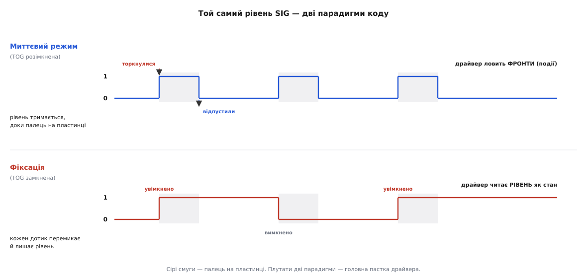

# ⚙️ Драйвер TTP223: читаємо дотик у прошивці

Давач уже зробив найважче — виміряв ємність, скалібрувався, ухвалив рішення й виставив на нозі готовий цифровий рівень. Здавалося б, писати тут нема чого: одне читання цифрового входу — і по всьому. І справді, «драйвер» TTP223 — це не сотні рядків розбору протоколу, як у якогось I²C-давача. Але саме через цю уявну простоту тут легко наступити на граблі, а справжня робота ховається не в читанні ноги, а в **інтерпретації** того, що ця нога означає. Один і той самий рівень «1» у миттєвому режимі каже «палець зараз на пластинці», а в режимі фіксації — «стан увімкнено, і байдуже, чи хтось торкається». Плутанина між цими двома значеннями — головне джерело коду, який «майже працює».

Тож завдання цього драйвера — не прочитати біт (це один виклик), а **загорнути давач у зрозумілий інтерфейс**, який ловить те, що вам насправді треба: не «яка зараз напруга на нозі», а «щойно торкнулися», «утримують», «відпустили». І зробити це так, щоб один і той самий код працював під кожен із чотирьох апаратних режимів, під будь-яку полярність, і не з'їдав процесор порожнім опитуванням, коли можна повісити давач на переривання. Далі — робочий код від найпростішого до драйвера з подіями, кожен приклад вкладками під Arduino, ESP-IDF і STM32 HAL, і розбір пасток, кожна з яких колись коштувала комусь вечора.

> 🔧 **Навіщо це.** «Прочитати ногу» вміє й новачок. Різниця між новачком і інженером — у тому, що інженер наперед знає: полярність на його модулі може виявитися оберненою, режим — фіксацією замість миттєвого, а довге утримання давач сам скине через 100 секунд. Драйвер, який це враховує, не ламається, коли ви берете наступну партію модулів або передаєте код колезі з іншою платою. Тонка обгортка коштує двадцять рядків, а економить години гадань «чому кнопка мертва».

## Що ми читаємо і чим це відрізняється від механічної кнопки

Перш ніж писати, домовмося про фізичну картину, бо від неї залежить кожне рішення в коді.

Вихід TTP223 — **двотактний**: мікросхема сама активно тримає лінію і у «високому», і в «низькому» рівні. Це означає дві приємні речі. По-перше, вивід мікроконтролера налаштовуємо як звичайний цифровий вхід **без підтяжки** (`INPUT` в Arduino, `GPIO_MODE_INPUT` із вимкненими `pull_up_en`/`pull_down_en` в ESP-IDF, `GPIO_MODE_INPUT` + `GPIO_NOPULL` у STM32): підтяжка потрібна там, де давач уміє лише притягувати лінію донизу (відкритий колектор) і «одиницю» мусить хтось дати ззовні; тут одиницю дає сам давач. Увімкнути підтяжку не смертельно — двотактний вихід переборе кволу внутрішню підтяжку, — але це зайве споживання й ознака нерозуміння, тож лишаємо вхід чистим.

По-друге, і це важливіше за звичку: **брязкоту (дребезгу) тут майже нема**. У механічної кнопки металеві контакти під час стику кілька мілісекунд фізично відскакують один від одного, і лінія за цей час скаче «1-0-1-0» десятки разів; без придушення один натиск читається як юрба натисків. У TTP223 нема контактів — є цифрове рішення порогу всередині мікросхеми, вже вичищене. Тому класичний [захист від брязкоту](topic:electronics/contact-debounce) з таймером «зачекай 20 мс, поки заспокоїться» тут зазвичай **не потрібен**. Це спрощує драйвер: перехід рівня можна брати за чисту монету.

> 🔧 **Навіщо це.** Половина коду для звичайних кнопок — це боротьба з брязкотом. Коли його нема, ловля фронту стає тривіальною: порівняв поточний стан із попереднім — і все. Але «майже нема» не означає «гарантовано нема за будь-яких умов»: дуже чутлива пластинка біля наведень може дати короткий фальшивий імпульс. Тому в надійному драйвері нижче ми лишимо крихітний запобіжник — не заради брязкоту контактів (його нема), а заради стійкості до наведень.

## Найпростіший драйвер: рівень як він є

Почнемо з мінімуму, від якого відштовхуватимемось. Заводський режим більшості модулів — **миттєвий, активний у одиниці**: спокій дає «0», палець на пластинці дає «1». Прочитати цей стан — один виклик.

**Умова.** SIG модуля заведено на звичайний цифровий вхід контролера — у прикладах це `D4` на Arduino, `GPIO4` на ESP32 і `PA0` на STM32. Треба знати, чи палець зараз на пластинці.

:::tabs
```arduino
const uint8_t PIN_TOUCH = 4;   // SIG давача TTP223

void setup() {
    pinMode(PIN_TOUCH, INPUT);         // INPUT, не INPUT_PULLUP: вихід двотактний
    Serial.begin(9600);
}

void loop() {
    bool touched = (digitalRead(PIN_TOUCH) == HIGH);  // активний у 1
    Serial.println(touched ? "палець" : "-");
    delay(100);
}
```
```esp-idf
#include "driver/gpio.h"
#include "esp_log.h"
#include "freertos/FreeRTOS.h"
#include "freertos/task.h"

#define PIN_TOUCH  GPIO_NUM_4          // SIG давача TTP223
static const char *TAG = "ttp223";

void app_main(void) {
    gpio_config_t cfg = {
        .pin_bit_mask = 1ULL << PIN_TOUCH,
        .mode         = GPIO_MODE_INPUT,
        .pull_up_en   = GPIO_PULLUP_DISABLE,     // вихід двотактний → без підтяжок
        .pull_down_en = GPIO_PULLDOWN_DISABLE,
        .intr_type    = GPIO_INTR_DISABLE,
    };
    ESP_ERROR_CHECK(gpio_config(&cfg));

    while (1) {
        bool touched = (gpio_get_level(PIN_TOUCH) == 1);   // активний у 1
        ESP_LOGI(TAG, "%s", touched ? "палець" : "-");
        vTaskDelay(pdMS_TO_TICKS(100));
    }
}
```
```stm32
#include "stm32f4xx_hal.h"
#include <stdio.h>

#define TOUCH_PORT  GPIOA              // SIG давача TTP223 на PA0
#define TOUCH_PIN   GPIO_PIN_0

static void touch_init(void) {
    __HAL_RCC_GPIOA_CLK_ENABLE();
    GPIO_InitTypeDef gpio = {0};
    gpio.Pin  = TOUCH_PIN;
    gpio.Mode = GPIO_MODE_INPUT;
    gpio.Pull = GPIO_NOPULL;                  // вихід двотактний → без підтяжки
    HAL_GPIO_Init(TOUCH_PORT, &gpio);
}

int main(void) {
    HAL_Init();
    SystemClock_Config();
    touch_init();

    while (1) {
        bool touched = (HAL_GPIO_ReadPin(TOUCH_PORT, TOUCH_PIN) == GPIO_PIN_SET);
        printf("%s\r\n", touched ? "палець" : "-");   // вивід у UART/SWO
        HAL_Delay(100);
    }
}
```
:::

Це і є весь «драйвер рівня». Уся складність давача — вимір пікофарадних змін, автокалібрування, поріг — уже позаду, всередині мікросхеми; нам віддали готовий біт. Але цей код відповідає лише на питання «чи торкаються **зараз**». Щойно вам треба «**коли** торкнулися» — рахувати натискання, запускати дію раз на дотик, а не щомиті, — рівня замало, і починається справжня робота драйвера.

## Ловимо подію, а не стан: фронт дотику

Різниця між **станом** і **подією** — центральна ідея всієї роботи з кнопками, і саме її найчастіше проґавлюють. Стан — це «палець лежить на пластинці», він триває, поки триває. Подія — це **момент зміни**: «щойно торкнулися» (перехід «0»→«1») або «щойно відпустили» («1»→«0»). Лічильник натискань, реакція на одиничний дотик, запуск дії — усе це реагує на подію, а не на стан. Якщо реагувати на стан, то поки палець лежить пів секунди, головний цикл устигне «побачити дотик» сотні разів і сто разів запустити дію.

Спосіб зловити подію — **пам'ятати попередній стан** і порівнювати зі свіжим. Перехід стається рівно один раз на межі:

**Умова.** Той самий вхід, що й вище. Треба збільшувати лічильник рівно на одиницю за кожне натискання.

:::tabs
```arduino
const uint8_t PIN_TOUCH = 4;

bool     prev  = false;   // стан входу з минулого проходу loop()
uint32_t count = 0;

void setup() {
    pinMode(PIN_TOUCH, INPUT);
    Serial.begin(9600);
}

void loop() {
    bool now = (digitalRead(PIN_TOUCH) == HIGH);

    if (now && !prev) {           // було 0, стало 1 → передній фронт = момент дотику
        count++;
        Serial.print("дотиків: ");
        Serial.println(count);
    }
    // if (!now && prev) { ... }  // тут ловився б задній фронт = момент відпускання

    prev = now;                   // запам'ятали для наступного проходу
    delay(20);
}
```
```esp-idf
#include "driver/gpio.h"
#include "esp_log.h"
#include "freertos/FreeRTOS.h"
#include "freertos/task.h"

#define PIN_TOUCH  GPIO_NUM_4
static const char *TAG = "ttp223";

void app_main(void) {
    gpio_config_t cfg = {
        .pin_bit_mask = 1ULL << PIN_TOUCH,
        .mode         = GPIO_MODE_INPUT,
        .pull_up_en   = GPIO_PULLUP_DISABLE,
        .pull_down_en = GPIO_PULLDOWN_DISABLE,
        .intr_type    = GPIO_INTR_DISABLE,
    };
    ESP_ERROR_CHECK(gpio_config(&cfg));

    bool     prev  = false;        // стан входу з минулого проходу циклу
    uint32_t count = 0;

    while (1) {
        bool now = (gpio_get_level(PIN_TOUCH) == 1);

        if (now && !prev)          // було 0, стало 1 → передній фронт = момент дотику
            ESP_LOGI(TAG, "дотиків: %u", (unsigned)++count);
        // if (!now && prev) { … } // тут ловився б задній фронт = момент відпускання

        prev = now;                // запам'ятали для наступного проходу
        vTaskDelay(pdMS_TO_TICKS(20));
    }
}
```
```stm32
#include "stm32f4xx_hal.h"
#include <stdio.h>

#define TOUCH_PORT  GPIOA
#define TOUCH_PIN   GPIO_PIN_0

int main(void) {
    HAL_Init();
    SystemClock_Config();
    touch_init();                  // той самий GPIO_MODE_INPUT + GPIO_NOPULL

    bool     prev  = false;        // стан входу з минулого проходу циклу
    uint32_t count = 0;

    while (1) {
        bool now = (HAL_GPIO_ReadPin(TOUCH_PORT, TOUCH_PIN) == GPIO_PIN_SET);

        if (now && !prev) {        // було 0, стало 1 → передній фронт = момент дотику
            count++;
            printf("дотиків: %lu\r\n", (unsigned long)count);
        }
        // if (!now && prev) { … } // тут ловився б задній фронт = момент відпускання

        prev = now;                // запам'ятали для наступного проходу
        HAL_Delay(20);
    }
}
```
:::

Умова `now && !prev` (усі три вкладки пишуть її однаково — це чиста логіка, не платформа) істинна **лише в тому єдиному проході**, коли рівень щойно змінився з «0» на «1». Наступного проходу `prev` уже дорівнює `now`, і поки палець лежить, умова хибна — дія не повторюється. Прибрав палець — `now` стає хибним, `prev` за ним, і система готова до наступного дотику. Дзеркальна умова `!now && prev` ловила б **відпускання** — знадобиться, коли треба знати, скільки палець тримали, або запускати щось на відпусканні.

Пауза у 20 мс тут не для брязкоту (його нема), а щоб не крутити головний цикл мільйони разів на секунду впусту й дати виводу спокійно відпрацювати. У реальному драйвері замість блокувальної паузи беруть неблокувальний ритм на монотонному лічильнику часу — `millis()` в Arduino, `HAL_GetTick()` у STM32, `esp_timer_get_time()` в ESP-IDF; до цього дійдемо.

## Полярність і режим: чотири апаратні варіанти в одному коді

Тепер найважливіше місце драйвера, від якого залежить, чи працюватиме він на **чужому** модулі. Дві перемички на звороті — **B (TOG)** і **A (AHLB)** — дають чотири комбінації поведінки, і код мусить знати, з якою має справу. Перемички ці апаратні: краплею припою місце замикають, розімкнене лишають; заводський стан більшості партій — **обидві розімкнені** (миттєвий, активний у 1), але деякі продавці замикають TOG ще на заводі, і тоді той самий код поводиться геть інакше.

Розкладімо по осях, бо це різні речі, і плутати їх — класична помилка.

**Вісь полярності (перемичка A / AHLB)** — це просто питання, який рівень означає «активно». У драйвері вона знімається одним рядком: замість жорстко вписаного рівня вводимо константу активного рівня.

:::tabs
```arduino
// Полярність задається один раз, під ваш модуль:
const uint8_t ACTIVE = HIGH;   // A розімкнена: дотик = HIGH (активний у 1)
// const uint8_t ACTIVE = LOW; // A замкнена:   дотик = LOW  (активний у 0)

inline bool isActive(uint8_t pin) {
    return digitalRead(pin) == ACTIVE;
}
```
```esp-idf
// Полярність задається один раз, під ваш модуль:
#define ACTIVE  1              // A розімкнена: дотик = 1 (активний у 1)
// #define ACTIVE 0            // A замкнена:   дотик = 0 (активний у 0)

static inline bool is_active(gpio_num_t pin) {
    return gpio_get_level(pin) == ACTIVE;
}
```
```stm32
// Полярність задається один раз, під ваш модуль:
#define ACTIVE  GPIO_PIN_SET     // A розімкнена: дотик = високий (активний у 1)
// #define ACTIVE GPIO_PIN_RESET // A замкнена:   дотик = низький (активний у 0)

static inline bool is_active(GPIO_TypeDef *port, uint16_t pin) {
    return HAL_GPIO_ReadPin(port, pin) == ACTIVE;
}
```
:::

Тепер `isActive()` повертає «активно / ні» **незалежно від полярності** — решта драйвера її не бачить. Це і є сенс абстракції: логіка «щойно активувалося» пишеться раз, а під обернену полярність міняється рівно одна константа. Спроба ж розсіяти порівняння з конкретним рівнем по всьому коду означає, що під активний-у-нулі модуль доведеться правити десяток місць і одне-два забути.

**Вісь характеру натискання (перемичка B / TOG)** — глибша, бо змінює **саме значення сигналу**, а не лише його рівень.

*Миттєвий режим (B розімкнена)* — вихід активний, **лише доки палець на пластинці**. Тут «активно» = «торкаються зараз», і драйвер ловить фронти: активація = початок дотику, деактивація = відпускання. Це вже розібрано вище.

*Режим фіксації (B замкнена)* — кожен **окремий дотик перемикає** вихід у протилежний стан і лишає його там. Торкнувся — увімкнулося й тримається; торкнувся ще — вимкнулося. І ось ключове для коду: **у режимі фіксації ловити фронт «дотику» майже завжди не те, що вам треба**. Мікросхема сама вже тримає стан — вона і є ваша змінна «увімкнено / вимкнено». Драйверу лишається просто **читати поточний рівень** як булеве «стан системи»:

:::tabs
```arduino
// Режим фіксації: рівень на нозі — це і є стан "увімкнено/вимкнено".
// Не рахуємо фронти — мікросхема вже все запам'ятала.
bool systemOn = isActive(PIN_TOUCH);
digitalWrite(LED_BUILTIN, systemOn);   // світло повторює стан фіксації
```
```esp-idf
// Режим фіксації: рівень на нозі — це і є стан "увімкнено/вимкнено".
// Не рахуємо фронти — мікросхема вже все запам'ятала.
bool system_on = is_active(PIN_TOUCH);
gpio_set_level(PIN_LED, system_on);    // світло повторює стан фіксації
```
```stm32
// Режим фіксації: рівень на нозі — це і є стан "увімкнено/вимкнено".
// Не рахуємо фронти — мікросхема вже все запам'ятала.
bool system_on = is_active(TOUCH_PORT, TOUCH_PIN);
HAL_GPIO_WritePin(LED_PORT, LED_PIN,   // світло повторює стан фіксації
                  system_on ? GPIO_PIN_SET : GPIO_PIN_RESET);
```
:::

Тобто вибір режиму — це вибір парадигми драйвера. **Миттєвий → ловиш події** (фронти). **Фіксація → читаєш стан** (рівень). Написати під фіксацію код із ловлею фронтів — не помилка компіляції, а логічна пастка: код побачить перемикання і почне «рахувати натискання», хоча половина з них — це вимкнення, а не ввімкнення. Тому в драйвері явно розділяємо два шляхи й ніколи їх не змішуємо.


*Той самий вихід SIG, дві парадигми коду. Зверху миттєвий режим: рівень тримається, доки палець на пластинці, тож драйвер порівнює зі старим станом і реагує на фронти — «щойно торкнулися» / «щойно відпустили». Знизу фіксація: кожен дотик перемикає й лишає рівень, тож рівень сам є станом «увімкнено/вимкнено» — драйвер його просто читає, без ловлі фронтів. Плутати парадигми — головна пастка драйвера.*

## Драйвер із подіями: чистий інтерфейс над ногою

Зберемо тепер із цих шматків **справжній драйвер** — маленький клас, що ховає ногу, полярність і ритм опитування, а назовні дає зрозумілі події: «щойно торкнулися», «щойно відпустили», «утримують», «як довго тримають». Такий інтерфейс — те, що ви хочете бачити у своєму головному циклі: жодного читання ноги, жодної константи рівня, лише сенс.

Цей клас — для **миттєвого** режиму (найчастіший для роботи з мікроконтролером). Він тримає власний неблокувальний ритм на монотонному лічильнику часу платформи, тож не гальмує решту програми блокувальними паузами, і містить крихітний запобіжник від наведень: активацію визнає, лише коли активний рівень протримався кілька мілісекунд поспіль. Це не боротьба з брязкотом контактів (його нема), а страховка від поодинокого імпульсу-привида на дуже чутливій пластинці.

:::tabs
```arduino
// --- TouchButton: драйвер миттєвого режиму TTP223 ---------------------------
class TouchButton {
public:
    // pin — куди заведено SIG; activeLevel — HIGH (акт. у 1) або LOW (акт. у 0)
    TouchButton(uint8_t pin, uint8_t activeLevel = HIGH)
        : _pin(pin), _active(activeLevel) {}

    void begin() {
        pinMode(_pin, INPUT);                 // двотактний вихід → без підтяжки
        _stable = _raw = readActive();        // старт із поточного стану
        _lastEdge = millis();
    }

    // Викликати щоразу в loop(); повертає true рівно в момент активації (фронт).
    bool update() {
        bool a = readActive();
        uint32_t now = millis();

        if (a != _raw) {          // сирий рівень змінився — почали відлік стійкості
            _raw = a;
            _lastEdge = now;
        }
        // рівень протримався GUARD мс → визнаємо його справжнім
        if (a == _raw && (now - _lastEdge) >= GUARD && _stable != a) {
            _stable = a;
            if (_stable) {                    // перехід у "активно" = момент дотику
                _pressedAt = now;
                _justPressed = true;
                return true;
            } else {                          // перехід у "спокій" = відпускання
                _justReleased = true;
            }
        }
        return false;
    }

    bool pressed()  { bool r = _justPressed;  _justPressed  = false; return r; }
    bool released() { bool r = _justReleased; _justReleased = false; return r; }
    bool held()     { return _stable; }                 // тримають зараз?
    uint32_t heldMs() { return _stable ? millis() - _pressedAt : 0; }

private:
    bool readActive() { return digitalRead(_pin) == _active; }

    static const uint32_t GUARD = 5;   // мс стійкості проти імпульсів-привидів
    uint8_t  _pin, _active;
    bool     _raw = false, _stable = false;
    bool     _justPressed = false, _justReleased = false;
    uint32_t _lastEdge = 0, _pressedAt = 0;
};
```
```esp-idf
// --- touch_button: драйвер миттєвого режиму TTP223 (ESP-IDF) ----------------
#include "driver/gpio.h"
#include "esp_timer.h"

#define TOUCH_GUARD_MS  5      // мс стійкості проти імпульсів-привидів

typedef struct {
    gpio_num_t pin;
    int        active;         // 1 (акт. у 1) або 0 (акт. у 0)
    bool       raw, stable, just_pressed, just_released;
    int64_t    last_edge, pressed_at;      // мс від старту
} touch_button_t;

static int64_t tb_now_ms(void) { return esp_timer_get_time() / 1000; }

static bool tb_read_active(const touch_button_t *b) {
    return gpio_get_level(b->pin) == b->active;
}

void tb_begin(touch_button_t *b, gpio_num_t pin, int active_level) {
    *b = (touch_button_t){ .pin = pin, .active = active_level };
    gpio_config_t cfg = {                 // двотактний вихід → без підтяжок
        .pin_bit_mask = 1ULL << pin,      .mode         = GPIO_MODE_INPUT,
        .pull_up_en   = GPIO_PULLUP_DISABLE, .pull_down_en = GPIO_PULLDOWN_DISABLE,
        .intr_type    = GPIO_INTR_DISABLE,
    };
    ESP_ERROR_CHECK(gpio_config(&cfg));
    b->stable = b->raw = tb_read_active(b);   // старт із поточного стану
    b->last_edge = tb_now_ms();
}

// Кликати щопроходу циклу; true рівно в момент активації (фронт).
bool tb_update(touch_button_t *b) {
    bool a = tb_read_active(b);
    int64_t now = tb_now_ms();

    if (a != b->raw) { b->raw = a; b->last_edge = now; }   // сирий рівень змінився

    if (now - b->last_edge >= TOUCH_GUARD_MS && b->stable != a) {
        b->stable = a;                    // рівень протримався GUARD мс → справжній
        if (a) { b->pressed_at = now; b->just_pressed = true; return true; }
        b->just_released = true;
    }
    return false;
}

bool tb_pressed(touch_button_t *b)  { bool r = b->just_pressed;  b->just_pressed  = false; return r; }
bool tb_released(touch_button_t *b) { bool r = b->just_released; b->just_released = false; return r; }
bool tb_held(const touch_button_t *b)     { return b->stable; }
int64_t tb_held_ms(const touch_button_t *b) { return b->stable ? tb_now_ms() - b->pressed_at : 0; }
```
```stm32
// --- touch_button: драйвер миттєвого режиму TTP223 (STM32 HAL) --------------
#include "stm32f4xx_hal.h"

#define TOUCH_GUARD_MS  5      // мс стійкості проти імпульсів-привидів

typedef struct {
    GPIO_TypeDef  *port;
    uint16_t       pin;
    GPIO_PinState  active;     // GPIO_PIN_SET (акт. у 1) або GPIO_PIN_RESET
    bool           raw, stable, just_pressed, just_released;
    uint32_t       last_edge, pressed_at;   // тики HAL_GetTick(), тобто мс
} touch_button_t;

static bool tb_read_active(const touch_button_t *b) {
    return HAL_GPIO_ReadPin(b->port, b->pin) == b->active;
}

void tb_begin(touch_button_t *b, GPIO_TypeDef *port, uint16_t pin, GPIO_PinState active) {
    b->port = port; b->pin = pin; b->active = active;
    b->just_pressed = b->just_released = false;

    GPIO_InitTypeDef gpio = {0};          // двотактний вихід → без підтяжки
    gpio.Pin = pin; gpio.Mode = GPIO_MODE_INPUT; gpio.Pull = GPIO_NOPULL;
    HAL_GPIO_Init(port, &gpio);

    b->stable = b->raw = tb_read_active(b);   // старт із поточного стану
    b->last_edge = HAL_GetTick();
}

// Кликати щопроходу циклу; true рівно в момент активації (фронт).
bool tb_update(touch_button_t *b) {
    bool a = tb_read_active(b);
    uint32_t now = HAL_GetTick();

    if (a != b->raw) { b->raw = a; b->last_edge = now; }   // сирий рівень змінився

    if (now - b->last_edge >= TOUCH_GUARD_MS && b->stable != a) {
        b->stable = a;                    // рівень протримався GUARD мс → справжній
        if (a) { b->pressed_at = now; b->just_pressed = true; return true; }
        b->just_released = true;
    }
    return false;
}

bool tb_pressed(touch_button_t *b)  { bool r = b->just_pressed;  b->just_pressed  = false; return r; }
bool tb_released(touch_button_t *b) { bool r = b->just_released; b->just_released = false; return r; }
bool tb_held(const touch_button_t *b)   { return b->stable; }
uint32_t tb_held_ms(const touch_button_t *b) { return b->stable ? HAL_GetTick() - b->pressed_at : 0; }
```
:::

Використання читається як опис поведінки, а не як робота з залізом:

:::tabs
```arduino
TouchButton btn(4, HIGH);   // SIG на D4, активний у 1 (заводський режим)

void setup() {
    btn.begin();
    pinMode(LED_BUILTIN, OUTPUT);
    Serial.begin(9600);
}

void loop() {
    btn.update();                       // рушій драйвера, кожен прохід

    if (btn.pressed())  Serial.println("торкнулися");
    if (btn.released()) {
        Serial.print("відпустили, тримали (мс): ");
        Serial.println(btn.heldMs());   // скільки трималися — корисно для довгого натиску
    }
    digitalWrite(LED_BUILTIN, btn.held());   // світло, поки палець на пластинці

    // ... тут може крутитися будь-яка інша робота: драйвер нічого не блокує
}
```
```esp-idf
static touch_button_t btn;

void app_main(void) {
    tb_begin(&btn, GPIO_NUM_4, 1);      // SIG на GPIO4, активний у 1
    gpio_set_direction(PIN_LED, GPIO_MODE_OUTPUT);

    while (1) {
        tb_update(&btn);                // рушій драйвера, кожен прохід

        if (tb_pressed(&btn))  ESP_LOGI(TAG, "торкнулися");
        if (tb_released(&btn))          // скільки трималися — для довгого натиску
            ESP_LOGI(TAG, "відпустили, тримали (мс): %lld", tb_held_ms(&btn));
        gpio_set_level(PIN_LED, tb_held(&btn));   // світло, поки палець на пластинці

        vTaskDelay(pdMS_TO_TICKS(1));   // решта часу ядра — іншим задачам
    }
}
```
```stm32
static touch_button_t btn;

int main(void) {
    HAL_Init();
    SystemClock_Config();
    tb_begin(&btn, GPIOA, GPIO_PIN_0, GPIO_PIN_SET);   // PA0, активний у 1
    led_init();

    while (1) {
        tb_update(&btn);                // рушій драйвера, кожен прохід

        if (tb_pressed(&btn))  printf("торкнулися\r\n");
        if (tb_released(&btn))          // скільки трималися — для довгого натиску
            printf("відпустили, тримали (мс): %lu\r\n", (unsigned long)tb_held_ms(&btn));
        HAL_GPIO_WritePin(LED_PORT, LED_PIN,          // світло, поки палець тут
                          tb_held(&btn) ? GPIO_PIN_SET : GPIO_PIN_RESET);

        // ... тут може крутитися будь-яка інша робота: драйвер нічого не блокує
    }
}
```
:::

Зверніть увагу, чого тут **нема**: нема блокувальних пауз, тож давач не заважає решті програми; нема читання ноги й констант рівня у вашій логіці — лише `pressed`/`released`/`held`; полярність задана **одним аргументом при створенні**, і під активний-у-нулі модуль ви міняєте активний рівень в одному місці, а весь інший код лишається слово в слово. Оце і є те, заради чого пишуть драйвер: не щоб прочитати ногу, а щоб решта коду про ту ногу не думала.

> 🔧 **Навіщо це.** `heldMs()` — маленька зручність із великими наслідками. Маючи тривалість утримання, ви задарма отримуєте «довге натискання»: `if (btn.released() && btn.heldMs() > 800) …` — і ось короткий дотик робить одне, а утримання майже секунду — інше, тими самими двома дротами. Так одна сенсорна кнопка заміняє дві: тап і лонг-тап, як на смартфоні.

## Переривання замість опитування

Досі драйвер **опитував** ногу — щопроходу `loop()` питав «ну що, змінилося?». Для однієї кнопки це дешево. Але коли процесор має важливішу роботу або мусить спати заради батарейки, порожнє опитування марнує і час, і струм. Кращий шлях — **переривання** (interrupt): попросити залізо смикнути нас **лише в мить**, коли рівень на нозі змінюється. Між дотиками процесор вільний (чи спить), а обробник викликається сам рівно на фронті.

Двотактний вихід TTP223 для цього ідеальний: він дає різкий, чіткий перепад рівня — саме те, що ловить апаратне переривання. Підключаємо обробник на потрібний фронт — передній для активного-в-1 (`RISING` в Arduino, `GPIO_INTR_POSEDGE` в ESP-IDF, `GPIO_MODE_IT_RISING` у STM32), задній для активного-в-0, — а всю справжню роботу робимо в головному циклі, бо в обробнику переривання можна лише найнеобхідніше.

Головне правило обробника: він мусить бути **крихітним і швидким**, а змінні, які він чіпає спільно з головним циклом, — позначені `volatile`, інакше компілятор вирішить, що вони не міняються «самі собою», і закешує старе значення.

**Умова.** SIG заведено на вивід, здатний на переривання: на Arduino Uno це `D2` (там таких лише два), на STM32 — будь-який пін через лінію EXTI (у прикладі `PA0`). Режим миттєвий, активний у 1. Треба рахувати дотики без опитування. (Те саме на ESP-IDF — у наступному розділі, бо там до цього додаються нюанси самої платформи.)

:::tabs
```arduino
const uint8_t PIN_TOUCH = 2;              // на Uno переривання є на D2 і D3

volatile uint32_t touchCount = 0;         // спільна з ISR → обов'язково volatile
volatile bool     touchFlag  = false;

// Обробник переривання (ISR): максимально короткий, без Serial/delay усередині!
void onTouch() {
    touchCount++;
    touchFlag = true;
}

void setup() {
    pinMode(PIN_TOUCH, INPUT);
    // RISING = передній фронт = активація для активного-в-1
    attachInterrupt(digitalPinToInterrupt(PIN_TOUCH), onTouch, RISING);
    Serial.begin(9600);
}

void loop() {
    if (touchFlag) {                      // прапорець підняв ISR
        touchFlag = false;                // скинули й обробляємо в спокійному циклі
        Serial.print("дотиків: ");
        Serial.println(touchCount);
    }
    // процесор тут вільний: може спати, крутити іншу логіку — реакція прийде сама
}
```
```stm32
#include "stm32f4xx_hal.h"
#include <stdio.h>

#define TOUCH_PORT  GPIOA                 // будь-який пін годиться: у STM32
#define TOUCH_PIN   GPIO_PIN_0            // переривання дає лінія EXTI

volatile uint32_t touchCount = 0;         // спільні з ISR → обов'язково volatile
volatile bool     touchFlag  = false;

static void touch_exti_init(void) {
    __HAL_RCC_GPIOA_CLK_ENABLE();
    GPIO_InitTypeDef gpio = {0};
    gpio.Pin  = TOUCH_PIN;
    gpio.Mode = GPIO_MODE_IT_RISING;      // передній фронт = активація для акт.-у-1
    gpio.Pull = GPIO_NOPULL;              // двотактний вихід → без підтяжки
    HAL_GPIO_Init(TOUCH_PORT, &gpio);

    HAL_NVIC_SetPriority(EXTI0_IRQn, 5, 0);
    HAL_NVIC_EnableIRQ(EXTI0_IRQn);       // дозволяємо вектор у контролері переривань
}

void EXTI0_IRQHandler(void) {             // вектор: HAL зніме прапорець і покличе колбек
    HAL_GPIO_EXTI_IRQHandler(TOUCH_PIN);
}

// Обробник: максимально короткий, без printf/HAL_Delay усередині!
void HAL_GPIO_EXTI_Callback(uint16_t pin) {
    if (pin == TOUCH_PIN) { touchCount++; touchFlag = true; }
}

int main(void) {
    HAL_Init();
    SystemClock_Config();
    touch_exti_init();

    while (1) {
        if (touchFlag) {                  // прапорець підняв обробник
            touchFlag = false;            // скинули й обробляємо в спокійному циклі
            printf("дотиків: %lu\r\n", (unsigned long)touchCount);
        }
        // процесор тут вільний: __WFI(), інша логіка — реакція прийде сама
    }
}
```
:::

Розподіл праці тут чіткий: **ISR лише фіксує факт** (підняти лічильник, звести прапорець) і миттю виходить; **`loop()` робить довге** (вивід, реакцію) у спокійному контексті, коли прапорець піднято. У самому обробнику вивід у консоль чи затримка — заборонені: друк (`Serial` в Arduino, `printf` чи `ESP_LOGI` деінде) сам працює на перериваннях, які під час ISR приглушені, тож вивід зависне або зіпсується. Це універсальне правило будь-яких переривань, і сенсорна кнопка — приємний перший привід його засвоїти, бо тут воно наочне.

Для активного-в-нулі модуля змінюється рівно одне — фронт: передній на задній (`RISING` → `FALLING`, `POSEDGE` → `NEGEDGE`, `IT_RISING` → `IT_FALLING`), бо активація тепер тягне лінію вниз. Якщо ж треба ловити і дотик, і відпускання, ставлять обидва фронти (`CHANGE`, `GPIO_INTR_ANYEDGE`, `GPIO_MODE_IT_RISING_FALLING`) і всередині ISR читають поточний рівень, щоб розрізнити, який це був перехід.

> 🔧 **Навіщо це.** Переривання — це різниця між приладом, що живе рік від батарейки, і тим, що сідає за тиждень. Опитування тримає процесор у тонусі щомиті; переривання дозволяють йому глибоко спати між дотиками й прокидатися лише на подію. Для сенсорної кнопки, яку за день торкаються десять разів, а решту часу вона просто чекає, це різниця в сотні разів за спожитим струмом.

## ESP32: та сама ідея, кілька нюансів платформи

На ESP32 логіка драйвера незмінна — це той самий двотактний вихід у той самий `INPUT`, — але платформа додає три речі, які варто знати, щоб код не поводився дивно.

**Живлення й рівень.** ESP32 — плата на **3.3 В**, і виводи її **не терплять 5 В**. Тож TTP223 тут живлять від 3.3 В, а не від 5 В: тоді рівень на SIG теж 3.3 В і заходить у ногу безпечно. Живити давач від 5 В, а сигнал вести в ногу ESP32 — певний спосіб її пошкодити. Правило те саме, що для будь-якого давача: **живи давач тим самим напруженням, що й логіку**, яка його читає.

**Вибір ноги.** Не всякий вивід ESP32 годиться під вхід. Виводи «тільки для вводу» (34–39) не мають внутрішніх підтяжок — але нам вони й не потрібні (вихід двотактний), тож ці ноги під TTP223 навіть зручні. А от чіпати виводи, зайняті під flash (6–11), не можна, і кілька ніг мають особливу поведінку під час завантаження (strapping-піни, як-от 0, 2, 12, 15): якщо давач у мить скидання втримає на такій нозі «свій» рівень, плата може не завантажитися. Тому SIG на ESP32 ведуть на звичайний вивід загального призначення — наприклад, `GPIO4` — і не на strapping-ногу.

**Переривання.** На ESP32 переривання є **на будь-якому** GPIO (не лише на двох, як на Uno), а обробник вимагає атрибута `IRAM_ATTR` — щоб код обробника лежав у швидкій внутрішній пам'яті, а не у flash, доступ до якого під час переривання може бути недоступний.

**Умова.** SIG на `GPIO4` ESP32, живлення давача 3.3 В, режим миттєвий, активний у 1. Рахуємо дотики на перериваннях — однаково і під Arduino-ядром для ESP32, і на чистому ESP-IDF (у другій вкладці ISR не піднімає прапорець, а кидає подію в чергу FreeRTOS: так у цьому середовищі пишуть звичніше).

:::tabs
```arduino
const uint8_t PIN_TOUCH = 4;                  // звичайний GPIO, не strapping-нога

volatile uint32_t touchCount = 0;
volatile bool     touchFlag  = false;

// На ESP32 ISR має лежати в IRAM → атрибут IRAM_ATTR обов'язковий
void IRAM_ATTR onTouch() {
    touchCount++;
    touchFlag = true;
}

void setup() {
    pinMode(PIN_TOUCH, INPUT);                // двотактний вихід → без підтяжки
    attachInterrupt(PIN_TOUCH, onTouch, RISING);   // RISING = активний у 1
    Serial.begin(115200);
}

void loop() {
    if (touchFlag) {
        touchFlag = false;
        Serial.printf("дотиків: %u\n", touchCount);
    }
    // тут ESP32 може займатися Wi-Fi, сном чи будь-чим — дотик прийде перериванням
}
```
```esp-idf
#include "driver/gpio.h"
#include "esp_log.h"
#include "freertos/FreeRTOS.h"
#include "freertos/queue.h"

#define PIN_TOUCH  GPIO_NUM_4                 // звичайний GPIO, не strapping-нога
static const char   *TAG = "ttp223";
static QueueHandle_t touch_q;

// На ESP32 ISR має лежати в IRAM → атрибут IRAM_ATTR обов'язковий
static void IRAM_ATTR on_touch(void *arg) {
    uint32_t ev = 1;
    xQueueSendFromISR(touch_q, &ev, NULL);    // лише передати факт — і вийти
}

void app_main(void) {
    touch_q = xQueueCreate(8, sizeof(uint32_t));

    gpio_config_t cfg = {
        .pin_bit_mask = 1ULL << PIN_TOUCH,
        .mode         = GPIO_MODE_INPUT,
        .pull_up_en   = GPIO_PULLUP_DISABLE,  // двотактний вихід → без підтяжки
        .pull_down_en = GPIO_PULLDOWN_DISABLE,
        .intr_type    = GPIO_INTR_POSEDGE,    // передній фронт = активний у 1
    };
    ESP_ERROR_CHECK(gpio_config(&cfg));
    ESP_ERROR_CHECK(gpio_install_isr_service(0));   // спільний диспетчер GPIO-ISR
    ESP_ERROR_CHECK(gpio_isr_handler_add(PIN_TOUCH, on_touch, NULL));

    uint32_t ev, count = 0;
    while (1) {
        // задача спить на черзі, поки не прийде дотик: ядро вільне для Wi-Fi тощо
        if (xQueueReceive(touch_q, &ev, portMAX_DELAY) == pdTRUE)
            ESP_LOGI(TAG, "дотиків: %u", (unsigned)++count);
    }
}
```
:::

> 🔧 **Навіщо це.** Плутанина з живленням «5 В на давач, а сигнал у 3.3-вольтову ногу» — не гіпотетична, а одна з найчастіших причин тихо здохлого входу ESP32. Двотактний вихід тим і підступний тут, що активно **пхає** свою напругу в ногу (не те що кволий відкритий колектор, який лінія сама підтягує до безпечного рівня). Тож для ESP32 правило «однакове живлення» — не педантизм, а захист заліза.

Плутати саму **сенсорну кнопку TTP223** з умонтованим у ESP32 **сенсорним периферійним модулем** (той, що читають через `touchRead()` прямо з ніг чипа, без зовнішньої мікросхеми) не варто: це різні речі. TTP223 — окрема мікросхема з готовим цифровим виходом, її читають як звичайний цифровий вхід; вбудований у ESP32 давач ємності — інша тема з іншим API. У цьому драйвері йдеться саме про зовнішній модуль TTP223.

## Складність і пастки

Код вище простий; складність драйвера — не в рядках, а в **невидимих припущеннях**, кожне з яких колись підводило. Зберемо їх, бо знати про них наперед — і є та різниця, заради якої пишуть драйвер, а не голий `digitalRead`.

**Полярність, узята з голови.** Найчастіша поломка «кнопка не працює» — код чекає `HIGH` на дотик, а модуль зібрано активним у нулі (перемичка A замкнена ще на заводі), тож у спокої на нозі вже `HIGH`, а дотик тягне у `LOW`. Драйвер бачить постійний «дотик» або жоден. Ліки — **не вгадувати, а виміряти**: залийте найпростіший скетч, що друкує `digitalRead` раз на секунду, приберіть руки й гляньте, який рівень у спокої. Спокій `LOW` → активний у 1, ваш `ACTIVE = HIGH`. Спокій `HIGH` → активний у 0, ставте `ACTIVE = LOW`. Аж потім пишіть логіку. Один рядок діагностики економить годину.

**Режим фіксації, прочитаний як миттєвий.** Друга за поширеністю пастка, і підступніша, бо код компілюється й навіть щось робить. Ви пишете ловлю фронтів, рахуєте «натискання», а модуль зібрано у фіксації (TOG замкнено). Тоді перший дотик дає фронт «0»→«1» — лічильник +1, наче все гаразд; але другий дотик перемикає назад «1»→«0» — це **задній** фронт, ваш `now && !prev` його не бачить, лічильник стоїть. Виходить «рахує лише кожен другий дотик» — класичний симптом того, що код і залізо в різних парадигмах. Ліки: визначтеся з режимом **до** коду. Потрібні події щоразу — переконайтеся, що TOG **розімкнена** (миттєвий), і ловіть фронти. Модуль у фіксації — не рахуйте фронти взагалі, читайте рівень як стан.

**Стотсекундний таймаут утримання.** Автокалібрування, що робить давач зручним, має жорсткий зворотний бік: якщо активний рівень тримати **безперервно дуже довго** (близько **100 секунд** при 3 В), давач вирішить, що це новий «спокій», перекалібрується й **сам відпустить вихід**, ніби пальця нема. Для кнопки, яку торкаються й відпускають, це невидиме. Але якщо ви на TTP223 будуєте щось, що вимагає нескінченного утримання — «поки палець лежить, двигун крутиться годинами», «утримання світить лампу цілу лекцію», — драйвер зненацька побачить «відпускання» через півтори хвилини, хоча палець не рухався. Це **не баг вашого коду**, а фізика мікросхеми; ловити його програмно на самому TTP223 неможливо (давач же сам вирішив, що спокій). Якщо задача справді потребує довгого утримання — це сигнал, що TTP223 узято не за призначенням, і треба або інша схема, або перегляд логіки (наприклад, «утримання» зробити фіксацією: один дотик увімкнув, другий вимкнув, а між ними давач нічого не тримає).

**Дотик у мить увімкнення.** Після подачі живлення давачу треба близько **0.5 секунди на стабілізацію й перше калібрування**, і в цей час пластинки **не можна торкатися**: інакше він візьме «натиснутий» стан за «спокій» і скалібрується навпаки — далі дотик він читатиме як спокій, і навпаки. У коді це означає: не довіряйте показам давача в **перші півсекунди** після старту. Практична страховка — на самому старті програми (`setup()`, `app_main()`, `main()` — байдуже) дати давачу цей час, перш ніж брати його свідчення всерйоз:

:::tabs
```arduino
void setup() {
    pinMode(PIN_TOUCH, INPUT);
    delay(500);              // даємо TTP223 стабілізуватися й скалібруватися
    // ... і тільки тепер починаємо читати давач як істину
}
```
```esp-idf
void app_main(void) {
    touch_gpio_init();                     // вхід без підтяжок
    vTaskDelay(pdMS_TO_TICKS(500));        // даємо TTP223 стабілізуватися й скалібруватися
    // ... і тільки тепер починаємо читати давач як істину
}
```
```stm32
int main(void) {
    HAL_Init();
    SystemClock_Config();
    touch_init();                          // вхід без підтяжки
    HAL_Delay(500);                        // даємо TTP223 стабілізуватися й скалібруватися
    // ... і тільки тепер починаємо читати давач як істину
}
```
:::

Ця півсекундна пауза — одне з небагатьох місць, де блокувальна затримка доречна: вона одноразова, на старті, коли робити все одно нема чого, і рятує від кривого калібрування, яке потім проявлятиметься «поведінкою навпаки».

**`volatile`, забутий біля переривань.** Якщо ви перейшли на переривання й лічильник у ISR оголошено **без** `volatile`, компілятор має повне право вирішити, що змінна в `loop()` не міняється (він же не бачить, хто її пише), і закешувати старе значення в регістрі — лічильник «застигне» назавжди, хоча ISR його справно збільшує. Симптом підступний: код правильний на вигляд, а число не росте. Ліки прості й обов'язкові: **кожну змінну, спільну між ISR і основним кодом, оголошуйте `volatile`**. Це не прискорення й не прикраса, а вимога коректності.

**`delay` і `Serial` усередині ISR.** Спокуса «ну надрукую прямо в обробнику, що торкнулися» закінчується зависанням. `Serial` під капотом сам працює на перериваннях, а вони під час виконання ISR приглушені; `delay()` теж спирається на таймерне переривання й у ISR не тікає ніколи. Правило залізне: **обробник — лише підняти прапорець і вийти**, а весь вивід, затримки й важку роботу лишити головному циклу, який гляне на той прапорець у спокійному контексті. Драйвер із подіями вище саме так і збудований.

**Наведення й «привиди» на дуже чутливій пластинці.** Порожнє місце під конденсатор чутливості робить давач максимально чутливим — і водночас примхливим: він може смикнутися від близького дроту під напругою, від руки за кілька сантиметрів, від мокрої ганчірки поруч. Із боку коду це виглядає як короткі фальшиві фронти. Перша лінія оборони — **не код, а залізо**: знизити чутливість зовнішнім конденсатором і надійно звести спільну землю (без хорошої землі тіло людини не «замикає» коло, і давач і глухне, і привиджує). Друга, страхувальна, — той крихітний `GUARD` у драйвері вище: визнавати активацію лише коли рівень протримався кілька мілісекунд, відсіюючи поодинокі імпульси. Але пам'ятайте порядок: спершу залізо, `GUARD` — лише добивка.

Підсумок простий і трохи парадоксальний. Драйвер TTP223 — найкоротший драйвер, який ви напишете: жодного протоколу, одна нога, одне читання рівня. Уся справжня інженерія тут — не в коді, а в **чесних припущеннях про залізо**: яка полярність, який режим, що станеться за 100 секунд утримання, чому не можна тримати палець при вмиканні. Врахували їх — і двадцять рядків працюють роками на будь-якій партії модулів. Проґавили — і найпростіша кнопка в проєкті стане тією, що «іноді як хоче».
