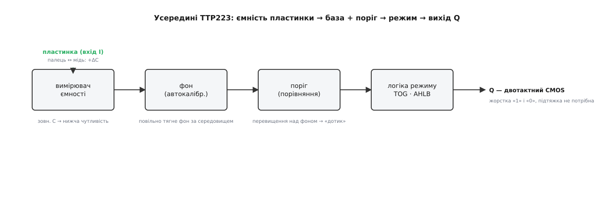
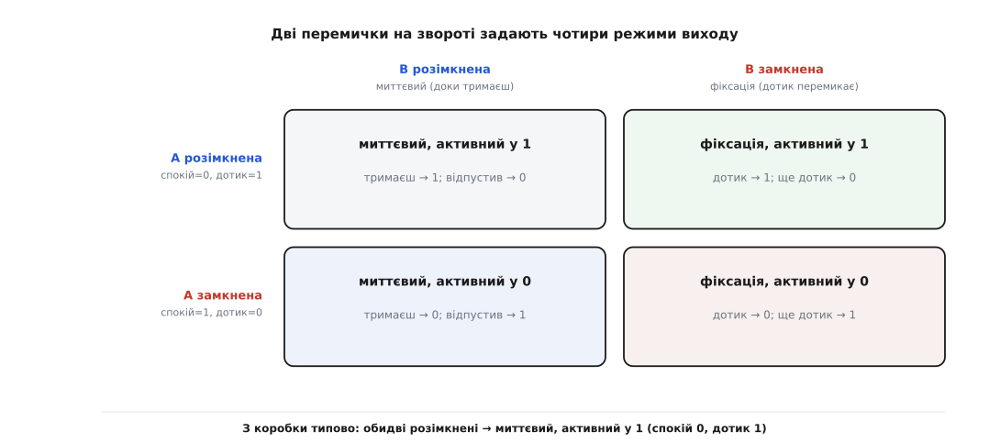
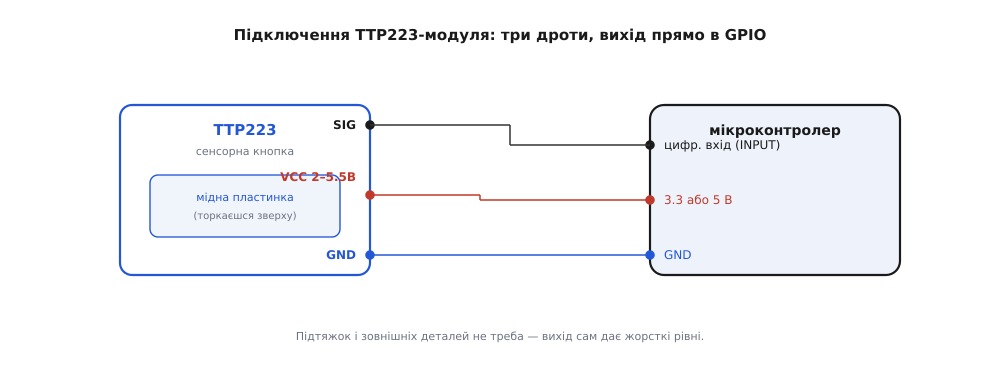

# TTP223 — сенсорний давач дотику

<preknowlist>
- [Ємність](book:electronics/capacitance) — здатність провідника накопичувати заряд; палець поруч із пластинкою її трохи збільшує, і саме цю зміну ловить давач.
- [Ємнісне зондування](book:electronics/capacitive-sensing) — як із зміни ємності роблять сигнал «торкнулися / ні»; принцип, на якому стоїть уся сенсорна кнопка.
- [GPIO — вивід загального призначення](book:electronics/gpio) — цифрова ніжка мікроконтролера, що читає «0» чи «1»; саме туди заходить вихід давача.
- [Двотактний вихід](book:electronics/push-pull-output) — вихід, що сам активно тягне лінію і вгору, і вниз; тому TTP223, на відміну від відкритого колектора, не потребує зовнішньої підтяжки.
</preknowlist>

Синя пластинка завбільшки з ніготь, а на ній — квадратик міді під лаком з написом на кшталт «TTP223» та маленький світлодіод. Проводиш пальцем над квадратиком (навіть не притискаючи) — світлодіод спалахує, а на сигнальній нозі зʼявляється рівень. Це **сенсорна кнопка без жодної рухомої частини**: нема пружини, нема металевих контактів, які треба стиснути, нема нічого, що зношується. Замість «натиснути» тут «доторкнутися» — і працює це не на тиску, а на тому, що ваш палець — теж провідник, і сама його присутність поруч із міддю ледь-ледь змінює електричну картину. TTP223 — це мікросхема (виробник — [Tontek Design Technology](book:sensors/ttp223-touch/hist-tontek-tontouch.md), Тайвань; торгова назва серії — TonTouch), яка цю крихітну зміну ловить і перетворює на чистий цифровий біт. Найчастіше вона приходить не голою, а вже розпаяною на маленькому модулі з готовою гребінкою на три штирі — саме такий модуль тут і розбираємо.

## Що вона насправді відчуває: не тиск, а ємність

Найважливіше, від чого залежить геть усе інше: TTP223 реагує **не на силу натискання, а на ємність**. Мідний квадратик під лаком — це одна обкладка конденсатора; друга «обкладка» — усе довкола, зокрема земля. Поки нікого нема, ця пластинка має якусь свою невелику **[ємність](book:electronics/capacitance)** — здатність тримати заряд. Щойно палець наближається, він додає до цієї картини власну провідну масу, звʼязану через ваше тіло із землею, — і ємність пластинки трохи зростає. Не треба ані торкатися міді напряму (її ж накрито лаком, а часто ще й корпусом), ані тиснути: важлива сама **присутність провідника поруч**.

Ось чому сенсорна кнопка почувається «магічною», а насправді нічого магічного нема. Вона працює **крізь тонку непровідну перепону** — лак, скло, пластик, тонку деревину: електричне поле пронизує діелектрик, тож палець «видно» і через нього. І навпаки — вона байдужа до непровідного предмета: покладіть на пластинку суху паличку чи листок паперу, і давач не ворухнеться, бо вони не змінюють ємності так, як заземлене тіло. Саме тому TTP223 ставлять під суцільну лицьову панель приладу: зверху гладке скло без жодної дірки, а кнопка «відчувається» під ним.

> 🔧 **Навіщо це.** Відсутність механіки — головна причина, чому сенсорну кнопку обирають. Механічна кнопка має контакти, що з часом окислюються, вигоряють від іскри й брязкають; сенсорна не має чого зношувати — натискань у неї безмежно багато. Її можна сховати **під суцільну герметичну панель** без отворів, тож у прилад не потрапляє ні пил, ні волога — так роблять кнопки на кухонній техніці, у душових панелях, у медичних приладах, які треба мити. І виглядає це гладко: жодного «клавішного» рельєфу, лише позначка на рівній поверхні.

Загальну фізику того, як зі зміни ємності добувають сигнал «торкнулися», докладно розібрано в статті про [ємнісне зондування](book:electronics/capacitive-sensing) — тут беремо це як даність і дивимося, що з нею робить конкретно TTP223.

## Що всередині: від пластинки до жорсткого біта

Зміна ємності від пальця — величина мізерна: одиниці пікофарад (10⁻¹² Ф) на тлі власної ємності пластинки. Голими руками таке не зловиш — потрібна схема, що весь час стежить за ємністю пластинки й помічає її стрибок. Саме це й робить мікросхема TTP223: усередині неї сидить вимірювач ємності, вузол автокалібрування, поріг і невелика логіка, що формує вихід.

Ланцюжок такий. **Вимірювач ємності** раз у раз оцінює, скільки заряду тримає пластинка, — по суті, як швидко вона заряджається через внутрішнє джерело. **Вузол фону (автокалібрування)** тримає в памʼяті «спокійне» значення — те, що зараз є без пальця, — і **повільно підлаштовує** його під середовище. Це критично: волога, температура, налиплий пил помалу зсувають ємність пластинки, і якби поріг стояв на місці, давач з часом або «залипав», або глухнув. Автокалібрування помаленьку тягне фон за цими змінами, тож давач сам тримає форму без жодного втручання в коді. **Поріг** щомиті порівнює свіжий вимір із фоном: перевищення понад певну межу — це і є «палець». А **логіка режиму** вирішує, як саме подати цей факт на вихід — миттєво чи з фіксацією, «одиницею» чи «нулем» (це задають дві перемички на звороті модуля). На виході стоїть нога **Q** — двотактний CMOS-каскад.


*Пластинка (вхід I) віддає свою ємність вимірювачу; палець додає +ΔC. Вузол фону тримає «спокійне» значення й повільно тягне його за середовищем (волога, температура, пил). Поріг ловить перевищення над фоном — це «дотик». Логіка режиму (перемички TOG і AHLB) формує вихід Q — двотактний CMOS, що сам дає жорсткі «1» і «0», тож зовнішня підтяжка не потрібна. Зовнішній конденсатор на вході знижує чутливість.*

Слово «двотактний» тут не дрібниця, а зручність, яку варто оцінити на тлі багатьох інших давачів. У модулів на кшталт давача Голла чи компаратора вихід буває **відкритим колектором**: він уміє лише притягнути лінію до землі, а «одиницю» мусить дати зовнішня підтяжка, яку легко забути — і тоді нога висить у повітрі й ловить наведення. TTP223 позбавляє цього клопоту: його [двотактний вихід](book:electronics/push-pull-output) сам активно тягне лінію і в «нуль», і в «одиницю». Дріт із SIG заходить прямо в цифрову ногу мікроконтролера — і жодних резисторів, жодної ввімкненої внутрішньої підтяжки (в Arduino це `INPUT_PULLUP`, в ESP-IDF — `GPIO_PULLUP_ENABLE`, у STM32 HAL — `GPIO_PULLUP`), чистий рівень із коробки.

> 🔧 **Навіщо це.** Автокалібрування — те, що відрізняє готовий сенсорний вузол від саморобної схеми «конденсатор і компаратор». Без нього ви б цілий день ганяли підстроювальний гвинтик: уранці холодно й сухо — поріг один, удень тепло й волого — уже інший, а від дихання на панель ємність гуляє. TTP223 усе це вирівнює сам, тримаючи «нуль» рухомим. Платня за зручність — одне обмеження, яке треба знати наперед (про безперервне утримання — нижче), але для кнопки, яку торкаються й відпускають, воно невидиме.

## Живлення, чутливість, час реакції

TTP223 живиться в широкому діапазоні **2.0–5.5 В**, тож однаково дружить і з 3.3-вольтовою платою (ESP32, STM32, Pi Pico), і з 5-вольтовим Arduino — рівень на виході завжди дорівнює тому живленню, яке ви подали. Споживання мале: у режимі очікування — одиниці мікроампер (близько 1.5–3 мкА при 3 В), в активному — близько міліампера. Це робить давач придатним навіть для приладів на батарейці, що мусять роками чекати дотику.

**Чутливість** налаштовують не гвинтиком, а зовнішнім конденсатором. На вході пластинки передбачено місце під невеликий конденсатор (від 0 до приблизно 50 пФ): що більша його ємність, то **менш** чутливим стає давач — тобто тим ближче має бути палець і тим товщу панель він «пробиває» гірше. Нуль ємності (порожнє місце) — найчутливіший стан; додаючи конденсатор, чутливість занижують навмисне, коли давач «бачить» палець зарано або самозбуджується від наведень. На модулі це або незапаяне контактне місце, або можливість припаяти керамічний конденсатор — типово нижче 5 нФ, а на практиці одиниці-десятки пікофарад.

Реакція не миттєва в буквальному сенсі, і це закладено в самій мікросхемі задля економії. У режимі малого споживання давач опитує пластинку рідше, тож від дотику до відгуку минає близько **0.2 секунди** (паспортні ~220 мс). Є і швидший режим (реакція в межах десятків мілісекунд), але він більше споживає — модулі здебільшого лишають повільний, і для кнопки під палець ця затримка непомітна. Ще одна тонкість вмикання: після подачі живлення давачу потрібно близько **0.5 секунди на стабілізацію**, і в цей час пластинки **не можна торкатися** — інакше він візьме «натиснутий» стан за спокій і скалібрується неправильно. Тому в схемах його не тримають пальцем у момент увімкнення.

## Чотири режими: дві перемички на звороті

Найцікавіше в TTP223 — те, що одна й та сама мікросхема вміє поводитися чотирма різними способами, і вибирають спосіб не кодом, а **фізично**, двома перемичками на звороті модуля. У мікросхеми за це відповідають два входи: **TOG** (від *toggle* — перемикання) і **AHLB** (*active high / low* — активний у високому чи низькому рівні). На модулі їх виводять на два контактні місця, зазвичай підписані **A** (це AHLB) і **B** (це TOG); краплею припою місце замикають, а розімкнене лишають як є. Дві незалежні перемички дають чотири комбінації — і кожна робить кнопку по-своєму.

**Перемичка B (TOG) — характер натискання.**
- **Розімкнена — миттєвий режим** (*momentary*): вихід активний **лише доки палець на пластинці**. Прибрав палець — вихід одразу вертається у спокій. Це поведінка звичайної кнопки-дзвінка: тримаєш — є, відпустив — нема.
- **Замкнена — режим фіксації** (*toggle*, «самозахоплення»): кожен окремий дотик **перемикає** вихід у протилежний стан і **лишає** його там. Торкнувся — увімкнулося й тримається; торкнувся ще раз — вимкнулося. Так поводиться вимикач світла: один доторк — світло, ще один — темрява.

**Перемичка A (AHLB) — полярність.**
- **Розімкнена — активний у одиниці**: спокій = «0», дотик = «1» (для миттєвого) або дотик перемикає між «0» і «1» (для фіксації).
- **Замкнена — активний у нулі**: усе дзеркально — спокій = «1», дотик тягне у «0».


*Дві незалежні перемички дають чотири режими. Стовпці — перемичка B (TOG): розімкнена = миттєвий (доки тримаєш), замкнена = фіксація (дотик перемикає). Рядки — перемичка A (AHLB): розімкнена = активний у 1 (спокій 0, дотик 1), замкнена = активний у 0 (усе навпаки). З коробки типово обидві розімкнені: миттєвий, активний у 1.*

Заводський стан у переважної більшості модулів — **обидві перемички розімкнені**: миттєвий режим, активний у одиниці. Це найзручніше для навчання: торкнувся — на нозі «1», відпустив — «0», без сюрпризів. Але звіряйтеся зі своїм модулем: партії різняться, а деякі продавці замикають B ще на заводі, і тоді «однократний дотик нічого не робить, а кожен другий — перемикає» — не поломка, а режим фіксації.

> 🔧 **Навіщо це.** Вибір режиму — це вибір, чи потрібен вам мікроконтролер узагалі. У режимі **фіксації** TTP223 сам стає готовим вимикачем: причепив вихід до транзистора чи реле — і маєш сенсорний перемикач світла, що працює без жодного коду й памʼятає стан. У **миттєвому** режимі його читає мікроконтролер як звичайну кнопку — так роблять, коли дотик має щось запускати, поки тримаєш (гортання, утримання, довге натискання). А полярність (AHLB) підганяють під решту схеми: якщо далі стоїть вузол, що вмикається нулем, беруть «активний у нулі», щоб не інвертувати сигнал у коді.

## Піни й підключення

Модуль підключається трьома дротами без жодного протоколу — це просто цифрова кнопка. Підписи звіряйте на самій платі (дрібні літери біля гребінки), бо порядок штирків між партіями гуляє.

- **SIG** (буває підписаний **I/O**, **OUT**, **S**) — цифровий вихід. Двотактний: сам дає і «1», і «0», підтяжки не треба.
- **VCC** — живлення, **2.0–5.5 В**. Рівень на SIG дорівнює цьому живленню.
- **GND** — спільний нуль (земля).


*Модуль зліва, мікроконтролер справа. Три дроти: VCC у живлення (3.3 або 5 В — на вибір плати), GND у землю, SIG прямо в звичайний цифровий вхід. Пластинки торкаються зверху (можна крізь тонку панель). Зовнішніх деталей і підтяжок не треба — двотактний вихід сам дає жорсткі рівні.*

Одне контактне місце (те, що для чутливості) зазвичай лишають порожнім. Перемички A і B чіпають, лише коли треба інший режим, — інакше не торкаються.

## Читаємо в коді

**Миттєвий режим, активний у одиниці (заводський).** Уся «складність» — прочитати цифрову ногу; давач уже видав готовий рівень.

**Умова.** SIG модуля заходить у звичайний цифровий вхід контролера, а поруч на вихід почеплено світлодіод. Треба світити світлодіодом, поки палець на пластинці. Конкретні ноги в кожному середовищі свої: D4 і D13 на Arduino, GPIO4 і GPIO2 на ESP32, PC0 і PA5 на STM32.

:::tabs
```arduino
const uint8_t TOUCH = 4;    // SIG давача TTP223
const uint8_t LED   = 13;   // вбудований світлодіод

void setup() {
    pinMode(TOUCH, INPUT);  // просто INPUT: вихід двотактний, підтяжка не потрібна
    pinMode(LED, OUTPUT);
    Serial.begin(9600);
}

void loop() {
    bool touched = (digitalRead(TOUCH) == HIGH);  // активний у 1: дотик = HIGH
    digitalWrite(LED, touched);
    if (touched) Serial.println("дотик!");
    delay(20);
}
```
```esp-idf
#include "driver/gpio.h"
#include "freertos/FreeRTOS.h"
#include "freertos/task.h"
#include "esp_log.h"

#define TOUCH_GPIO  GPIO_NUM_4   // SIG давача TTP223
#define LED_GPIO    GPIO_NUM_2   // світлодіод плати

static const char *TAG = "ttp223";

void app_main(void) {
    gpio_config_t in = {
        .pin_bit_mask = 1ULL << TOUCH_GPIO,
        .mode         = GPIO_MODE_INPUT,
        .pull_up_en   = GPIO_PULLUP_DISABLE,     // вихід двотактний — підтяжка зайва
        .pull_down_en = GPIO_PULLDOWN_DISABLE,
        .intr_type    = GPIO_INTR_DISABLE,
    };
    ESP_ERROR_CHECK(gpio_config(&in));

    gpio_config_t out = {
        .pin_bit_mask = 1ULL << LED_GPIO,
        .mode         = GPIO_MODE_OUTPUT,
        .pull_up_en   = GPIO_PULLUP_DISABLE,
        .pull_down_en = GPIO_PULLDOWN_DISABLE,
        .intr_type    = GPIO_INTR_DISABLE,
    };
    ESP_ERROR_CHECK(gpio_config(&out));

    while (1) {
        bool touched = gpio_get_level(TOUCH_GPIO) == 1;  // активний у 1: дотик = 1
        gpio_set_level(LED_GPIO, touched);
        if (touched) ESP_LOGI(TAG, "дотик!");
        vTaskDelay(pdMS_TO_TICKS(20));
    }
}
```
```stm32
#include "stm32f4xx_hal.h"
#include <stdbool.h>

#define TOUCH_PORT  GPIOC
#define TOUCH_PIN   GPIO_PIN_0    // SIG давача TTP223
#define LED_PORT    GPIOA
#define LED_PIN     GPIO_PIN_5    // світлодіод плати

static void GPIO_Init(void) {
    __HAL_RCC_GPIOC_CLK_ENABLE();
    __HAL_RCC_GPIOA_CLK_ENABLE();

    GPIO_InitTypeDef in = {
        .Pin  = TOUCH_PIN,
        .Mode = GPIO_MODE_INPUT,
        .Pull = GPIO_NOPULL,      // вихід двотактний — підтяжка не потрібна
    };
    HAL_GPIO_Init(TOUCH_PORT, &in);

    GPIO_InitTypeDef out = {
        .Pin   = LED_PIN,
        .Mode  = GPIO_MODE_OUTPUT_PP,
        .Pull  = GPIO_NOPULL,
        .Speed = GPIO_SPEED_FREQ_LOW,
    };
    HAL_GPIO_Init(LED_PORT, &out);
}

int main(void) {
    HAL_Init();
    SystemClock_Config();         // згенерований CubeMX
    GPIO_Init();

    while (1) {
        // активний у 1: дотик = GPIO_PIN_SET
        GPIO_PinState touched = HAL_GPIO_ReadPin(TOUCH_PORT, TOUCH_PIN);
        HAL_GPIO_WritePin(LED_PORT, LED_PIN, touched);
        HAL_Delay(20);
    }
}
```
:::

Жодної бібліотеки й жодного драйвера давача: одне читання цифрового входу вже повертає готову відповідь, бо всю роботу — вимір ємності, калібрування, поріг — зробила сама мікросхема. Зверніть увагу на спільне для всіх трьох варіантів: вхід налаштовано **без** внутрішньої підтяжки (`INPUT` замість `INPUT_PULLUP`, `GPIO_PULLUP_DISABLE`, `GPIO_NOPULL`) — двотактний вихід сам тримає лінію, і зайва підтяжка йому не потрібна.

**Ловимо момент дотику, а не утримання.** Частіше треба реагувати **на сам дотик** (один раз за натискання), а не щомиті, поки палець лежить. Тоді ловлять **фронт** — перехід з «0» у «1»:

**Умова.** Той самий вхід із попереднього прикладу. Треба рахувати дотики: щоразу, коли палець торкнувся пластинки, збільшити лічильник на один.

:::tabs
```arduino
const uint8_t TOUCH = 4;

bool     prev  = false;   // попередній стан входу
uint32_t count = 0;       // скільки разів торкнулися

void setup() {
    pinMode(TOUCH, INPUT);
    Serial.begin(9600);
}

void loop() {
    bool now = (digitalRead(TOUCH) == HIGH);
    if (now && !prev) {           // щойно був 0, тепер 1 → фронт, момент дотику
        count++;
        Serial.print("дотиків: ");
        Serial.println(count);
    }
    prev = now;
    delay(20);
}
```
```esp-idf
#include "driver/gpio.h"
#include "freertos/FreeRTOS.h"
#include "freertos/task.h"
#include "esp_log.h"
#include <inttypes.h>

#define TOUCH_GPIO  GPIO_NUM_4

static const char *TAG = "ttp223";

void app_main(void) {
    gpio_config_t in = {
        .pin_bit_mask = 1ULL << TOUCH_GPIO,
        .mode         = GPIO_MODE_INPUT,
        .pull_up_en   = GPIO_PULLUP_DISABLE,
        .pull_down_en = GPIO_PULLDOWN_DISABLE,
        .intr_type    = GPIO_INTR_DISABLE,
    };
    ESP_ERROR_CHECK(gpio_config(&in));

    bool     prev  = false;   // попередній стан входу
    uint32_t count = 0;       // скільки разів торкнулися

    while (1) {
        bool now = gpio_get_level(TOUCH_GPIO) == 1;
        if (now && !prev) {       // щойно був 0, тепер 1 → фронт, момент дотику
            count++;
            ESP_LOGI(TAG, "дотиків: %" PRIu32, count);
        }
        prev = now;
        vTaskDelay(pdMS_TO_TICKS(20));
    }
}
```
```stm32
#include "stm32f4xx_hal.h"
#include <stdbool.h>
#include <stdio.h>

#define TOUCH_PORT  GPIOC
#define TOUCH_PIN   GPIO_PIN_0

int main(void) {
    HAL_Init();
    SystemClock_Config();         // згенерований CubeMX
    __HAL_RCC_GPIOC_CLK_ENABLE();

    GPIO_InitTypeDef in = {
        .Pin  = TOUCH_PIN,
        .Mode = GPIO_MODE_INPUT,
        .Pull = GPIO_NOPULL,
    };
    HAL_GPIO_Init(TOUCH_PORT, &in);

    bool     prev  = false;       // попередній стан входу
    uint32_t count = 0;           // скільки разів торкнулися

    while (1) {
        bool now = (HAL_GPIO_ReadPin(TOUCH_PORT, TOUCH_PIN) == GPIO_PIN_SET);
        if (now && !prev) {       // щойно був 0, тепер 1 → фронт, момент дотику
            count++;
            printf("дотиків: %lu\r\n", (unsigned long)count);  // printf → UART
        }
        prev = now;
        HAL_Delay(20);
    }
}
```
:::

Ця схема «памʼятай попереднє, реагуй на зміну» — основа роботи з будь-якою кнопкою. TTP223 усередині вже придушує дрібне тремтіння сигналу, тож окремий [захист від брязкоту](book:electronics/contact-debounce) зазвичай не потрібен (на відміну від механічної кнопки, де без нього один натиск читається як десяток). Але якщо режим — фіксація, у коді ловити фронт не треба взагалі: мікросхема сама тримає стан, і ви просто читаєте поточний рівень. Готовий C++ під різні режими — з роз'ясненням, коли брати миттєвий, а коли фіксацію, і як почепити давач на переривання замість опитування, — зібрано в [прикладі-драйвері](book:sensors/ttp223-touch/api-ttp223-driver.md).

## Чого стерегтися

Кілька пасток випливають прямо з фізики й логіки давача, і всі вони — поведінка «за задумом», якщо про неї знати наперед.

**Довге утримання скидається саме собою.** Автокалібрування, що робить давач зручним, має зворотний бік: якщо тримати палець на пластинці **дуже довго** (близько 100 секунд при 3 В), давач вирішить, що це нове «спокійне» середовище, і **відпустить вихід**, ніби пальця нема. Для кнопки, яку торкаються й відпускають, це невидимо; але не будуйте на TTP223 те, що вимагає нескінченного утримання (наприклад, «поки палець лежить — двигун крутиться годинами»). Для такого потрібен інший підхід.

**Не торкатися під час увімкнення.** Ті ж 0.5 секунди стабілізації на старті означають: якщо в момент подачі живлення палець уже на пластинці, давач візьме цей стан за спокій і скалібрується криво — далі «дотик» він бачитиме навпаки. Тож не тримайте кнопку натиснутою, коли прилад вмикається.

**Наведення й «привиди».** Дуже чутлива пластинка (порожнє місце під конденсатор чутливості) може реагувати на близькі дроти під напругою, на руку за кілька сантиметрів, на мокру ганчірку поруч. Якщо давач «спрацьовує сам» — насамперед **зниж чутливість** зовнішнім конденсатором і **добре заземли** схему (спільна земля з рештою пристрою обовʼязкова: без надійної землі тіло людини не «замикає» коло, і давач глухне або примхливий).

**Полярність і режим звіряй з платою.** «Кнопка не працює» найчастіше означає, що на вашому модулі замкнено іншу перемичку, ніж ви думали: код чекає HIGH на дотик, а модуль налаштований активним у нулі, або чекає утримання, а стоїть фіксація. Перш ніж вирішити, що модуль мертвий, перевірте стан перемичок A і B і те, який рівень дає SIG у спокої.

**Живлення й рівень логіки.** Рівень на SIG дорівнює VCC. Живите давач від 5 В, а читаєте 3.3-вольтовим мікроконтролером — на вхід прийде 5 В, що для багатьох виводів забагато. Правило просте: **живіть TTP223 тим самим напруженням, що й логіку**, яка його читає, — тоді рівні збігаються самі собою.
