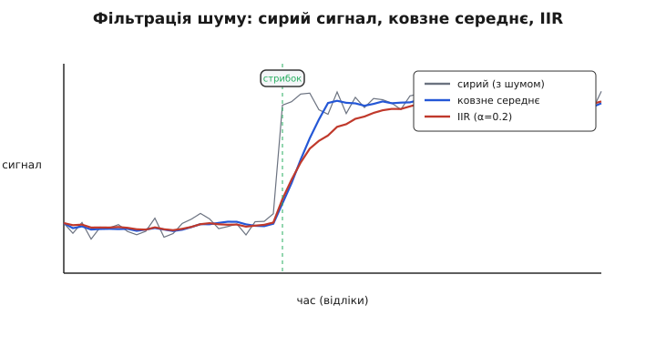

# ⚙️ Код для ADXL335: від трьох напруг до кута, фільтра й детектора поштовху

Три ноги давача видають три напруги. Уся робота в коді — це шлях від цих напруг до чогось осмисленого: числа в g, кута нахилу в градусах, чистого (не тремтливого) сигналу, події «його штовхнули». Кожен крок цього шляху має свою пастку, і найпідступніша з них ховається в самому першому рядку — у тому, з чим ми порівнюємо прочитаний код АЦП. Розберімо весь ланцюг так, щоб наприкінці ви мали робочу прошивку, а не набір магічних констант.

## Задача і головна ідея

Ми хочемо, щоб мікроконтролер, читаючи GY-61, відповідав на чотири питання:

1. **Скільки g** діє вздовж кожної осі — щоб узагалі мати з чим працювати.
2. **На який кут** нахилена плата — головне практичне застосування дешевого акселерометра.
3. Як **прибрати шум** — бо аналоговий вихід «дихає», і сирі покази стрибають на останніх бітах.
4. Як **зловити поштовх** — раптовий удар чи струс, коротку подію на тлі спокою.

Ідея, що проходить крізь усі чотири, одна: **акселерометр міряє вектор**. У спокої це вектор земного тяжіння, 1g завдовжки, спрямований до центру Землі. Плата не знає, «де низ», — вона лише бачить, як цей вектор розкладається на три її власні осі. Нахилили плату — розклад змінився. Штовхнули — до тяжіння додався другий вектор (сила поштовху), і сумарна довжина стрибнула за 1g. Тому вся арифметика нижче — це арифметика тривимірного вектора: його проєкції, його довжина, кути між ним і осями.

І перш ніж рахувати кути, треба чесно дістати ці три проєкції з АЦП. Тут і причаїлася пастка.

## Крок 0: ратіометричне читання — те, що ламається найчастіше

Наївний код виглядає так: прочитати АЦП, помножити на «вольти на відлік», відняти біас, поділити на чутливість. І він працює — рівно доти, доки живлення давача точно збігається з опорою АЦП і обидва точно дорівнюють паспортному числу. У житті не збігаються ніколи.

Згадаймо, чому. Вихід ADXL335 **ратіометричний**: біас і чутливість задані **часткою від живлення** давача, а не в абсолютних вольтах. При 3.3 В біас ≈ 1.65 В (половина живлення), чутливість ≈ 330 мВ/g. Підніміть живлення до 3.4 В — обидва підростуть пропорційно. АЦП теж міряє **відносно своєї опори**: код 512 з 1023 означає «половина опори», хай яка та опора у вольтах. Отже маємо два «відсотки від чогось»: сигнал — відсоток від живлення давача, код — відсоток від опори АЦП.

Магія стається, коли **живлення давача і опора АЦП — це одна й та сама шина**. Тоді обидва відсотки рахуються від одного числа, і воно скорочується. Формально: якщо `Uбіас = k · Vs` (біас — це частка k живлення) і АЦП дає `raw = 1023 · U / Vref`, то при `Vref = Vs`

```
a = (U − Uбіас) / S
U    = raw · Vs / 1023
Uбіас = k_bias · Vs
S     = k_sens · Vs
```

і, підставивши, кожне `Vs` вилітає:

```
a = (raw/1023 − k_bias) / k_sens
```

Прискорення виражене **через самі відліки АЦП і два ратіометричні коефіцієнти** — точне значення живлення зникло з формули. Ось чому ратіометрична прив'язка не забаганка, а те, що робить покази стабільними попри «плаваючі» 3.3 В від дешевого регулятора.

> 🔧 **Навіщо це в коді.** На практиці це означає: живіть GY-61 і опору АЦП від **однієї ноги**. На Arduino Uno з `analogReference(DEFAULT)` опора АЦП = напруга живлення плати (Vcc, номінально 5 В, реально 4.6…5.1 В). Якщо живити модуль **з тієї самої 5-вольтової ноги**, то навіть коли Vcc просів до 4.7 В — і сигнал, і опора просіли разом, відношення вціліло. А якщо ви живите давач від стабільних 3.3 В, а опору лишили на «гуляючих» 5 В — ратіометричність **розірвана**, і кожне тремтіння Vcc лізе прямо в покази.

Тримаймо цю ідею в коді як явний вибір: працюємо **у відліках АЦП**, а не у вольтах. Вольти — проміжна фікція; у відліках усе ратіометрично й простіше.

```c
// Скільки відліків АЦП відповідає нулю g і одному g.
// Це вже ратіометричні числа: вони НЕ залежать від точного Vcc,
// поки давач і опора АЦП живляться від однієї шини.
//
// Орієнтир для 10-бітного АЦП (0..1023), давач і опора від однієї 3.3 В:
//   0g  -> ~512 відліків (половина шкали)
//   1g  -> ~102 відліки понад біас  (0.330 В / 3.3 В * 1023)
// Але точні значення в кожного екземпляра СВОЇ — їх дає калібрування (нижче).

int   biasRaw[3] = { 512, 512, 512 };   // код при 0g на осях X, Y, Z
float scaleRaw[3] = { 102.0f, 102.0f, 102.0f };  // код на 1g

// Читання однієї осі одразу в g, у відліках АЦП (ратіометрично).
float readG(int pin, int axis) {
    int raw = analogRead(pin);
    return (raw - biasRaw[axis]) / scaleRaw[axis];
}
```

Зверніть увагу: ми **ніде не переводимо у вольти**. `readG` бере сирий код, віднімає код-біас, ділить на код-на-g. Вольти зникли — і разом з ними зникла залежність від точного значення опори.

### Дрібна, але корисна деталь: усереднювати вже при читанні

Один виклик `analogRead` — це один миттєвий знімок із усім своїм шумом. Дешево прибрати частину шуму ще на вході: прочитати кілька разів поспіль і взяти середнє. Це не повноцінний фільтр (про них далі), а лише зменшення випадкового розкиду одного виміру — і воно майже безкоштовне.

```c
// Прочитати пін N разів і повернути середній код.
// Придушує білий шум АЦП у √N разів: 16 вимірів -> шум менший вчетверо.
int readAvg(int pin, int n) {
    long acc = 0;
    for (int i = 0; i < n; i++) acc += analogRead(pin);
    return (int)(acc / n);
}
```

Чому саме √N, а не N? Бо шум випадковий: незалежні похибки при додаванні складаються не в лоб, а «по модулю» — сума N незалежних шумів росте як √N, а ми ділимо на N, тож відносний шум падає як √N. Скільки штук усереднювати — компроміс: 16 знімає видиме тремтіння й забирає близько 1.7 мс на осях Uno (один `analogRead` ≈ 104 мкс). Хочете швидше — беріть 4; хочете тихіше — 32, але не забувайте, що це вже з'їдає час циклу.

## Крок 1: двоточкове калібрування (+1g / −1g)

Паспортні «1.65 В» і «0.330 В/g» — це **типові** значення, центр розкиду. Реальний ваш чип майже напевно інший: біас на осях X/Y гуляє в межах 1.35…1.65 В, на Z аж 1.2…1.8 В, чутливість — 270…330 мВ/g. Якщо взяти паспортні числа наосліп, плата, що лежить рівно, покаже не 0°, а два-три градуси перекосу, і ви думатимете, що вона крива. Вона рівна — криві константи.

Виправлення просте й напрочуд надійне: **виміряти дві відомі точки**. Земне тяжіння дає їх безкоштовно. Поверніть вісь строго **вгору** — на неї діє рівно +1g. Поверніть строго **вниз** — рівно −1g. Запишіть код АЦП у цих двох положеннях. Тепер у нас дві точки прямої «код ↔ прискорення», а пряма однозначно задається двома точками:

```
код при +1g:  raw_up
код при −1g:  raw_down

біас (0g) — це середина:        biasRaw  = (raw_up + raw_down) / 2
код на 1g — це піврозмаху:      scaleRaw = (raw_up − raw_down) / 2
```

Чому середина — це нуль g? Бо +1g і −1g симетричні відносно 0g, а вихід лінійний, тож 0g лежить точно посередині між ними. Чому піврозмаху — це чутливість? Бо від −1g до +1g прискорення змінилося на 2g, а код — на `raw_up − raw_down`; отже на 1g припадає половина цієї різниці. Дві точки — і обидва невідомі (біас і масштаб) знайдені точно, без жодного паспортного числа.

> 🔧 **Навіщо аж дві точки, а не одна.** Часто радять «поклади рівно, запиши біас — і все». Це калібрує **лише зсув** (біас), але не масштаб: чутливість береться паспортна, а вона в вас може бути 0.31 замість 0.33 В/g. Помилка масштабу — це помилка, що **росте з кутом**: біля 0° непомітна, а на 45° уже дає добрий градус. Дві точки ловлять і зсув, і масштаб за один захід, тож кут виходить правильним по всьому діапазону.

Осей три, а рук у вас дві — тож калібрування зручно зробити напівавтоматом: код чекає, поки ви поставите плату в потрібне положення, ви шлете символ у монітор порту, він знімає точку. Шість знімків (три осі × два напрямки) — і константи готові.

```c
const int PIN[3] = { A0, A1, A2 };   // X, Y, Z
const char* AXIS[3] = { "X", "Y", "Z" };

// Знімає один усереднений код для осі axis і напряму (+1g або -1g),
// коли користувач підтвердив, що поставив плату правильно.
int capturePoint(int axis, const char* dir) {
    Serial.print("Постав вiсь "); Serial.print(AXIS[axis]);
    Serial.print(" строго "); Serial.print(dir);
    Serial.println(" (+1g угору / -1g униз), потiм натисни Enter...");
    while (Serial.available() == 0) { /* чекаємо */ }
    while (Serial.available() > 0) Serial.read();   // з'їсти рядок
    int raw = readAvg(PIN[axis], 64);               // тихий, точний знімок
    Serial.print("  знято: "); Serial.println(raw);
    return raw;
}

void calibrate() {
    for (int ax = 0; ax < 3; ax++) {
        int up   = capturePoint(ax, "вгору");
        int down = capturePoint(ax, "вниз");
        biasRaw[ax]  = (up + down) / 2;
        scaleRaw[ax] = (up - down) / 2.0f;
        Serial.print("Вiсь "); Serial.print(AXIS[ax]);
        Serial.print(": bias="); Serial.print(biasRaw[ax]);
        Serial.print("  scale="); Serial.println(scaleRaw[ax], 1);
    }
    Serial.println("Калiбрування завершено. Впиши цi числа в код як стартовi.");
}
```

Порахувавши константи один раз, ви вписуєте їх у `biasRaw[]` і `scaleRaw[]` як стартові значення — і `readG` одразу дає правильні g. Для приладу, що возиться (робот, коптер), калібрування варто зберігати в `EEPROM`, щоб не повторювати після кожного вимкнення; для настільних дослідів досить вписати числа в скетч.

Одне застереження про «строго вгору». Точність калібрування чутливості впирається в те, **наскільки рівно** ви тримали вісь. Якщо вісь відхилена від вертикалі на кут θ, вона бачить не 1g, а `1g · cos θ`. На щастя, косинус біля нуля майже плаский: похибка орієнтації в 5° дає `cos 5° ≈ 0.9962`, тобто лише 0.4 % помилки чутливості. Тож руками, на око по краю столу — уже достатньо добре; кутник чи рівень потрібні хіба для метрологічної точності.

## Крок 2: кут нахилу через atan2

Тепер найкорисніше. Плата лежить нерухомо, на неї діє лише тяжіння — вектор 1g. Ми знаємо його три проєкції (`ax`, `ay`, `az` у g). За ними хочемо кут нахилу.

Спокуса — брати арксинус: «синус кута дорівнює горизонтальній проєкції, поділеній на 1g». Не робіть так. Арксинус має дві біди. Перша: біля 90° він майже вертикальний — крихітна зміна проєкції дає велетенський стрибок кута, і шум розлітається. Друга: він не розрізняє, у **який бік** нахил, бо не знає знаків обох потрібних проєкцій. Правильний інструмент — **`atan2(y, x)`**: функція, що бере **обидві** проєкції окремо й повертає повний кут у всіх чотирьох чвертях, від −180° до +180°, коректно поводячись і біля нуля, і біля прямого кута.

Уявіть це геометрично. Щоб дізнатися нахил плати «вперед-назад» (тангаж, pitch), спроєктуйте вектор тяжіння на бічну площину й спитайте: який кут між ним і вертикаллю? Це кут між катетом `ax` (скільки тяжіння лягло на вісь X) і катетом, що складається з двох інших проєкцій разом. Формула, що працює по всьому колу:

```
pitch = atan2( ax , √(ay² + az²) )   // нахил уперед-назад
roll  = atan2( ay , √(ax² + az²) )   // нахил ліворуч-праворуч
```

Чому в знаменнику `√(ay² + az²)`, а не просто `az`? Бо нам потрібна проєкція тяжіння на **всю площину**, перпендикулярну до осі X, а не лише на одну вісь Z. Довжина цієї проєкції — гіпотенуза з двох катетів `ay` і `az`, тобто `√(ay² + az²)`. Такий знаменник робить формулу нечутливою до того, як саме плата повернута навколо власної осі: `pitch` показує щирий нахил уперед незалежно від крену. Це стандартний і надійний спосіб діставати два кути з трьох проєкцій.

`atan2` повертає радіани — переведемо в градуси множенням на `180/π`:

:::tabs
```cpp
#include <math.h>

// Кути нахилу (градуси) з трьох прискорень у g.
void tiltAngles(float ax, float ay, float az,
                float* pitch, float* roll) {
    const float RAD2DEG = 57.29578f;             // 180 / π
    *pitch = atan2f(ax, sqrtf(ay*ay + az*az)) * RAD2DEG;
    *roll  = atan2f(ay, sqrtf(ax*ax + az*az)) * RAD2DEG;
}

void loop() {
    float ax = readG(A0, 0);
    float ay = readG(A1, 1);
    float az = readG(A2, 2);

    float pitch, roll;
    tiltAngles(ax, ay, az, &pitch, &roll);

    Serial.print("pitch="); Serial.print(pitch, 1);
    Serial.print("  roll="); Serial.println(roll, 1);
    delay(50);
}
```
```python
import math
import time

# Кути нахилу (градуси) з трьох прискорень у g.
def tilt_angles(ax, ay, az):
    pitch = math.degrees(math.atan2(ax, math.hypot(ay, az)))
    roll  = math.degrees(math.atan2(ay, math.hypot(ax, az)))
    return pitch, roll

while True:
    ax = read_g(0, 0)
    ay = read_g(1, 1)
    az = read_g(2, 2)

    pitch, roll = tilt_angles(ax, ay, az)

    print("pitch={:.1f}  roll={:.1f}".format(pitch, roll))
    time.sleep(0.05)
```
```micropython
import math
import time

# Кути нахилу (градуси) з трьох прискорень у g.
def tilt_angles(ax, ay, az):
    RAD2DEG = 57.29578                           # 180 / π
    pitch = math.atan2(ax, math.sqrt(ay*ay + az*az)) * RAD2DEG
    roll  = math.atan2(ay, math.sqrt(ax*ax + az*az)) * RAD2DEG
    return pitch, roll

while True:
    ax = read_g(0, 0)
    ay = read_g(1, 1)
    az = read_g(2, 2)

    pitch, roll = tilt_angles(ax, ay, az)

    print("pitch={:.1f}  roll={:.1f}".format(pitch, roll))
    time.sleep_ms(50)
```
:::

> 🔧 **Навіщо atan2, а не asin.** `atan2` бере два аргументи — «протилежний» і «прилеглий» катети — і тому знає **обидва знаки**. Це дає йому дві переваги, яких немає в `asin`: він розрізняє всі чотири чверті (нахил уперед проти назад, а не лише «на скільки»), і він **не вибухає** біля 90°, бо там працює за тангенсом, а не за синусом. Для будь-якого кута з проєкцій вектора — завжди `atan2`.

Одне чесне обмеження цього методу: він рахує кут **лише в спокої**, поки єдина сила — тяжіння. Щойно плата поїхала з прискоренням, до вектора тяжіння додається вектор руху, і «кут» починає брехати — давач же не відрізняє, що на нього тисне, стіл чи розгін. Для нерухомого рівня чи повільного нахилу це не проблема. Для коптера, що маневрує, тяжіння доводиться відділяти від руху, зшиваючи акселерометр із гіроскопом — це вже [комплементарний фільтр](book:algorithms/complementary-filter): гіроскоп веде кут швидко й без впливу прискорень, акселерометр повільно тягне його назад до вертикалі тяжіння, щоб гіроскоп не «поплив». ADXL335 гіроскопа не має, тож на ньому самому чесно рахувати саме **статичний** нахил.

### Дрібниця, що псує кут: осі не там, де ви думаєте

Поширена прикрість: код правильний, а `pitch` реагує на крен і навпаки. Причина не в математиці — переплутані фізичні осі. Підпис `X` на платі — це вісь **давача**, і напрямок, який ви звете «вперед», може лягти на неї, на Y або із протилежним знаком. Лік простий: покладіть плату рівно (усі кути 0), по черзі підніміть кожен край і дивіться, яка з `ax/ay/az` пішла до ±1g. Якщо не та вісь — поміняйте індекси місцями; якщо правильна, але знак навпаки — припишіть мінус. П'ять хвилин руками економлять годину непорозумінь із формулою, яка насправді ціла.

## Крок 3: фільтрація шуму

Навіть у спокої сирий кут дрібно тремтить: аналоговий вихід шумить, АЦП квантує, і останні біти стрибають. Для індикатора це негарно, для керування — шкідливо. Приберемо тремтіння, не додаючи запізнення більше, ніж треба.

Два прості фільтри вистачають на 90 % задач з акселерометром. Обидва — низькочастотні: пропускають повільну корисну зміну (нахил), душать швидкий шум.

### Ковзне середнє: чесне вікно

Найзрозуміліший фільтр — [ковзне середнє](book:algorithms/moving-average): тримаємо останні N вимірів і щоразу видаємо їхнє середнє. Кожен новий відлік входить у вікно, найстаріший випадає. Це буквально та сама ідея, що й усереднення при читанні, тільки рознесена в часі й безперервна.

:::tabs
```cpp
// Ковзне середнє на кільцевому буфері (для однієї осі).
#define WIN 8
struct MovAvg {
    float buf[WIN];
    int   idx;
    float sum;
    bool  filled;
};

void maInit(MovAvg* m) {
    m->idx = 0; m->sum = 0; m->filled = false;
    for (int i = 0; i < WIN; i++) m->buf[i] = 0;
}

float maStep(MovAvg* m, float x) {
    m->sum -= m->buf[m->idx];   // прибрати найстаріше
    m->buf[m->idx] = x;         // покласти нове на його місце
    m->sum += x;
    m->idx = (m->idx + 1) % WIN;
    if (m->idx == 0) m->filled = true;
    int n = m->filled ? WIN : m->idx;   // поки буфер не повний — ділимо на стільки, скільки є
    if (n == 0) n = WIN;
    return m->sum / n;
}
```
```python
from collections import deque

# Ковзне середнє на кільцевому буфері (для однієї осі).
WIN = 8

class MovAvg:
    def __init__(self):
        self.buf = deque([0.0] * WIN, maxlen=WIN)  # найстаріше саме випадає
        self.sum = 0.0
        self.filled = False
        self.count = 0

    def step(self, x):
        oldest = self.buf[0] if len(self.buf) == WIN else 0.0
        self.sum -= oldest          # прибрати найстаріше
        self.buf.append(x)          # покласти нове на його місце
        self.sum += x
        if self.count < WIN:
            self.count += 1
        n = self.count              # поки буфер не повний — ділимо на стільки, скільки є
        return self.sum / n
```
```micropython
# Ковзне середнє на кільцевому буфері (для однієї осі).
WIN = const(8)

class MovAvg:
    def __init__(self):
        self.buf = [0.0] * WIN
        self.idx = 0
        self.sum = 0.0
        self.filled = False

    def step(self, x):
        self.sum -= self.buf[self.idx]   # прибрати найстаріше
        self.buf[self.idx] = x           # покласти нове на його місце
        self.sum += x
        self.idx = (self.idx + 1) % WIN
        if self.idx == 0:
            self.filled = True
        n = WIN if self.filled else self.idx  # поки буфер не повний — ділимо на стільки, скільки є
        if n == 0:
            n = WIN
        return self.sum / n
```
:::

Хитрість тут — **не переусереднювати весь буфер щоразу**. Ми тримаємо біжучу суму: віднімаємо те, що випадає, додаємо те, що входить. Тож один крок — це одне віднімання й одне додавання, скільки б не було вікно. Вікно N душить білий шум у √N разів (те саме правило), але коштує **затримки**: середнє N відліків «відстає» від сигналу приблизно на пів-вікна. N = 8 при циклі 20 мс дає ≈ 80 мс запізнення — непомітно для нахилу рукою, відчутно для швидкого керування. Ширше вікно — тихіше, але повільніше; це прямий компроміс.

### IIR-фільтр: одне число замість буфера

Часто буфер шкода тримати — надто на кожну з трьох осей. Дешевша альтернатива — **однополюсний [БІХ-фільтр](book:algorithms/iir-filter)** (нескінченна імпульсна характеристика): він не пам'ятає історію, а тримає лише **одне** згладжене значення й підтягує його до нового виміру на частку α:

```
y ← y + α · (x − y)          рівнозначно   y ← (1−α) · y + α · x
```

Прочитайте це як фізику, а не як формулу. `x − y` — це «наскільки новий вимір відбіг від того, що ми вважали правдою». Ми рушаємо своє `y` в бік `x`, але не стрибаємо туди повністю, а лише на частку α. Мале α (0.05) — важкий, інертний фільтр: тихий, але повільний. Велике α (0.5) — легкий і швидкий, але пропускає більше шуму. Це той самий RC-фільтр нижніх частот, тільки в дискретному коді: α грає роль «як швидко конденсатор наздоганяє вхід».

:::tabs
```cpp
// Однополюсний IIR (експоненційне згладжування), стан — одне float.
struct Iir { float y; bool init; };

float iirStep(Iir* f, float x, float alpha) {
    if (!f->init) { f->y = x; f->init = true; }   // перший вимір — як є, без розгону
    f->y += alpha * (x - f->y);
    return f->y;
}
```
```python
# Однополюсний IIR (експоненційне згладжування), стан — одне float.
# Той самий код працює і на CPython, і на MicroPython.
class Iir:
    def __init__(self):
        self.y = 0.0
        self.init = False

    def step(self, x, alpha):
        if not self.init:            # перший вимір — як є, без розгону
            self.y = x
            self.init = True
        self.y += alpha * (x - self.y)
        return self.y
```
:::

Порада з практики: **фільтруйте g, не кут**. Спокусливо згладити вже готовий `pitch`, але кут — це нелінійна функція проєкцій (`atan2`), і згладжування після нелінійності спотворює менше очевидно. Чистіше: відфільтрувати три `ax/ay/az`, а вже з тихих проєкцій рахувати кут. Тоді нелінійність працює з чистим входом, і кут виходить і тихий, і без викривлення.

```c
Iir fx, fy, fz;                 // по фільтру на вісь
const float A = 0.15f;          // золота середина: помітно тихіше, ще не мляво

void loop() {
    float ax = iirStep(&fx, readG(A0, 0), A);
    float ay = iirStep(&fy, readG(A1, 1), A);
    float az = iirStep(&fz, readG(A2, 2), A);   // Z шумніша вдвічі — фільтр тут особливо доречний

    float pitch, roll;
    tiltAngles(ax, ay, az, &pitch, &roll);
    Serial.print(pitch, 1); Serial.print('\t'); Serial.println(roll, 1);
    delay(20);
}
```

Вісь Z я згадав окремо навмисно: у ADXL335 її шум **удвічі більший**, ніж X/Y — 300 мкg/√Гц проти 150 (вертикальна вісь конструктивно шумніша). Тож саме Z виграє від фільтра найбільше; для неї іноді беруть трохи менше α, ніж для X/Y, щоб зрівняти тремтіння всіх трьох. Наскільки вузько різати смугу — питання не лише про давач, а й про те, скільки шуму несе ваша смуга пропускання загалом: ширша смуга — більше шуму пролазить, і це загальне [правило шумової смуги](book:electronics/noise-bandwidth), не особливість ADXL335.


*Сирий сигнал (тонка сіра лінія) дрібно тремтить; ковзне середнє й IIR прибирають тремтіння. Ціна — запізнення: обидві згладжені лінії наздоганяють різкий стрибок не миттєво, а за кілька відліків.*

## Крок 4: детектор поштовху за порогом

Остання задача інша за природою. Досі ми боролися з різкими змінами як із шумом. Тепер різка зміна — це **сигнал**: удар, стук, струс. Ми хочемо зловити подію.

Ідея спирається на ту саму векторну картину. У спокої **довжина** вектора прискорення дорівнює рівно 1g — хай як плата повернута, тяжіння одне. Штовхніть її — до тяжіння додається другий вектор (сила поштовху), і сумарна довжина стрибає вище (або нижче) 1g. Отже ознака поштовху не в окремій осі, а в **модулі вектора**, який перестав дорівнювати одиниці:

```
|a| = √(ax² + ay² + az²)
у спокої:   |a| ≈ 1.00 g   (лише тяжіння)
при поштовху: |a| помітно ≠ 1 g
```

Чому саме модуль, а не якась одна вісь? Бо удар може прийти під будь-яким кутом і розкластися на осі як завгодно — але **довжина** вектора від напрямку не залежить. Один поріг на модуль ловить поштовх з будь-якого боку, тоді як стеження за окремою віссю пропустило б удар, спрямований уздовж іншої.

```c
// Детектор поштовху: спрацьовує, коли модуль прискорення
// відбіг від 1g далі за поріг THRESH (у g).
const float THRESH = 0.35f;      // 0.35g понад тяжіння — впевнений струс
bool wasQuiet = true;            // щоб не сипати подіями, поки трясе

void loop() {
    float ax = readG(A0, 0);
    float ay = readG(A1, 1);
    float az = readG(A2, 2);

    float mag = sqrtf(ax*ax + ay*ay + az*az);   // модуль вектора, g
    float dev = fabsf(mag - 1.0f);              // відхилення від спокою

    if (dev > THRESH && wasQuiet) {
        Serial.print("ПОШТОВХ! |a|="); Serial.println(mag, 2);
        wasQuiet = false;                       // подія вже видана
    }
    if (dev < THRESH * 0.5f) {
        wasQuiet = true;                        // затихло — готові до наступного
    }
    delay(10);
}
```

Два місця тут — не випадкові, і саме вони роблять детектор придатним.

**Гістерезис (два пороги замість одного).** Прапорець `wasQuiet` і другий, нижчий поріг (`THRESH * 0.5`) не дають детектору «дзеленчати». Без них один удар, поки модуль коливається туди-сюди навколо межі, породив би десяток подій. Ми вимагаємо: спершу перейти **верхню** межу (подія), і лише опустившись нижче **нижньої** — озброїтися знову. Розрив між двома порогами — зона спокою, де нічого не спрацьовує. Це той самий гістерезис, що в термостаті, який не клацає безперервно біля заданої температури.

**Поріг рахуємо від 1g, а не від нуля.** Наївна помилка — порівнювати саму `|a|` з порогом. Але `|a|` у спокої вже дорівнює 1, тож поріг довелося б ставити «понад 1.35», і будь-яка зміна калібрування чи орієнтації його зсувала б. Віднявши 1g (`dev = |mag − 1|`), ми міряємо **відхилення від спокою** — воно нуль у спокої незалежно від того, як плата лежить, і поріг стає чесним «на скільки трусонуло».

> 🔧 **Навіщо фільтрувати ДО детектора обережно.** Спокуса — прогнати `|a|` крізь той самий згладжувальний фільтр. Але фільтр з'їдає саме те, що детектору потрібне: короткий сплеск. Сильно згладжений сигнал «розмаже» удар так, що пік не дотягне до порога. Тож для детектора поштовху беруть **сирий** або лише злегка усереднений сигнал (`readAvg` на 2–4 виміри проти одиночних викидів АЦП, не більше). Фільтр для тиші й детектор для сплеску — це протилежні вимоги, тому їх тримають на **різних** гілках сигналу: тиха гілка йде на кут, сира — на поштовх.

Поріг 0.35g і паузи підбирають під задачу. Легкий стук по столу дає 0.2…0.4g, добрий струс приладу — понад 1g, падіння з висоти впирається в межу ±3g і **насичує** давач (про це нижче). Хочете ловити ніжні дотики — опускайте поріг, але тоді фільтруйте вхід сильніше, бо шум почне перестрибувати низький поріг сам собою. Це вічний компроміс порогового детектора: **чутливість проти хибних спрацювань**.

## Складність і пастки — де це ламається насправді

Код вище робочий, але між «компілюється» і «працює на столі» лежить кілька граблів, специфічних саме для аналогового ADXL335. Пройдімося по них, бо кожні з'їдають вечір, якщо не знати.

**Насичення на ±3g — і воно тихе.** Діапазон давача ±3g. Прикладіть більше — вихід упреться в межу й **застигне** там, не подавши жодного сигналу тривоги. Модуль просто покаже +3g і не ворухнеться, хоч реально там усі 8g. Для детектора удару це пастка: сильний удар дає не «великий модуль», а **обрізаний** модуль, і якщо ваш поріг стоїть надто високо, ви його прогавите. Практичне правило: якщо якась вісь підійшла до ±3g, довіряти числу вже не можна — ви на межі шкали, реальне прискорення могло бути будь-яким більшим. Для задач з ударами беруть версії на ±16g і вище; ADXL335 — давач **людського** масштабу.

**Шумна вісь Z.** Уже згадана, але варта окремого рядка, бо ловить усіх: Z шумить удвічі більше за X/Y (300 проти 150 мкg/√Гц). У кутах це виглядає так, ніби `roll` тихий, а `pitch` смикається — або навпаки, залежно від того, яка вісь опинилася в знаменнику. Не шукайте помилку в коді: це фізика давача. Лік — сильніший фільтр саме на Z та/або трохи ширше усереднення для тієї осі.

**Розкид від чипа до чипа — без калібрування кут кривий.** Паспортні константи центровані, ваш екземпляр зсунутий. Плата, що лежить рівно, з паспортними числами покаже кілька градусів перекосу. Це не дефект — це нескалібрований давач. Двоточкове калібрування (крок 1) прибирає це начисто; пропустити його — значить свідомо погодитися на кілька градусів систематичної похибки.

**Розірвана ратіометричність — «плаваючі» покази.** Найпідступніша, бо все компілюється й навіть приблизно працює. Якщо давач живиться від одного джерела, а опора АЦП — від іншого (типово: модуль на 3.3 В, а `analogReference` лишили DEFAULT = 5 В), то кожне тремтіння будь-якого з двох джерел лізе в покази як «дрейф». Симптом: числа повільно повзуть, коли гріється регулятор чи сідає батарея. Лік — **одна шина** на давач і опору АЦП; тоді дрейф джерела скорочується сам, як показано на кроці 0.

**Механічна вібрація маскується під нахил.** Акселерометр чесно міряє **все** прискорення, зокрема дрож двигуна чи стукіт столу. Для кута це шум — його прибирає низькочастотний фільтр (крок 3). Але якщо вібрація сильна й на частоті, що пролазить крізь смугу, фільтр її не втримає, і кут «попливе». Тут або жорсткіше кріплення давача, або вужча смуга (більший конденсатор на виході модуля плюс сильніший цифровий фільтр). Це нагадування, що акселерометр не бачить «нахил» — він бачить **силу**, а нахил ми лише виводимо, поки ця сила — саме тяжіння.

**Час готовності після ввімкнення.** Конденсатори на виходах модуля задають не лише смугу, а й **час виходу на режим**: прилад стає готовим приблизно через `160 · C` мс (C у мкФ). З типовими 0.1 мкФ це ≈ 16 мс. Не читайте давач у перші десятки мілісекунд після подачі живлення — дайте йому усталитися, інакше перші покази будуть сміттям. У коді це один `delay(50)` у `setup()` — дешева страховка.

Зберемо все в одну картину. Аналоговий ADXL335 у коді — це чотири незалежні гілки з однієї трійки напруг: **читаємо** ратіометрично (у відліках, не у вольтах); **калібруємо** двома точками, щоб кут був чесним; **рахуємо кут** через `atan2` з трьох проєкцій; **чистимо** тиху гілку фільтром, а сиру лишаємо детектору поштовху. Кожна гілка тримається на тому, що давач міряє **вектор сили**, а не «рух» чи «нахил» напряму, — і всі пастки, від насичення до розірваної опори, стають зрозумілими, щойно ви пам'ятаєте цю одну річ.
