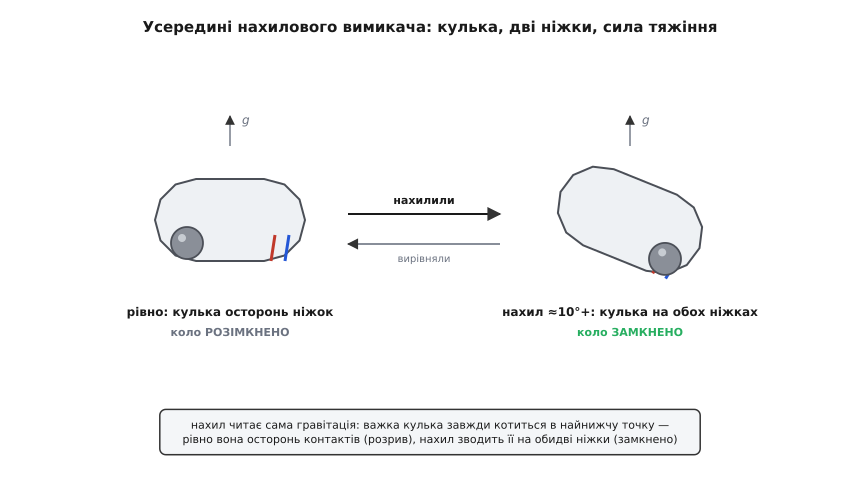
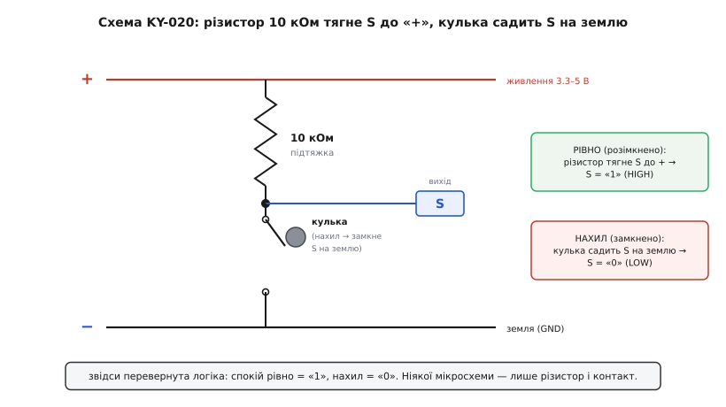
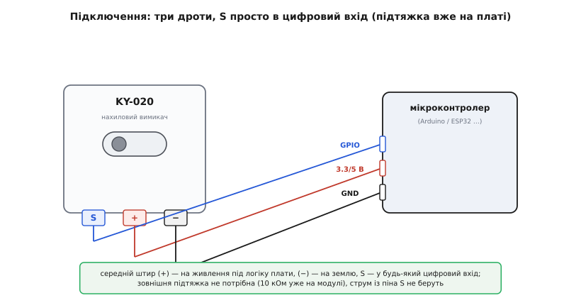
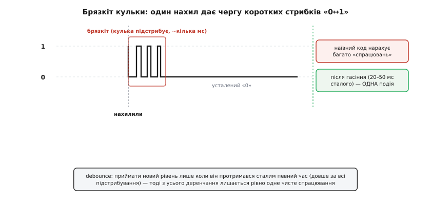

# KY-020 — давач нахилу

<preknowlist>
- [KY-серія (Keyes 37-в-1)](topic:sensors/ky-series) — спільний формат синіх модулів: гребінка S / + / − з живленням у середині, напруга 3.3–5 В, три лекала розмови з платою; KY-020 — з цієї родини.
- [GPIO](topic:electronics/gpio) — цифровий вивід мікроконтролера, що читає логічний рівень «високо/низько» на нозі; саме сюди заходить сигнал давача.
- [Рівні «0» і «1»](topic:electronics/logic-levels-as-ranges) — що таке логічна «1» і «0» як діапазони напруги; без цього не зрозуміти, чому вихід тут інвертований.
- [Підтяжки](topic:electronics/floating-pullups) — навіщо різистор тягне «плаваючий» вхід до відомого рівня; на платі KY-020 стоїть саме підтяжка, і вона задає всю логіку виходу.
- [Брязкіт контактів](topic:electronics/contact-debounce) — чому механічний контакт при замиканні «деренчить» серією швидких імпульсів і як це гасять; кулька в цьому давачі брязкає особливо сильно.
</preknowlist>

Візьми в руку синю платку KY-серії завбільшки з поштову марку, піднеси до вуха й легенько похитай — почуєш тихеньке **«тук-тук»**, наче всередині перекочується піщинка. Це і є весь давач: у крихітному металевому циліндрі, що стирчить із плати, катається справжня металева кулька. Поки платка лежить рівно, кулька спочиває на дні й нічого не замикає; щойно нахилиш — кулька скочується й **стуляє два контакти**, як монетка, що впала між двох дротів. Оце «стулила / не стулила» давач і віддає на пін одним проводом. Він не міряє *кут* нахилу — він каже лише «мене нахилили» або «я стою рівно». KY-020 — це нахиловий вимикач (англ. *tilt switch*), тобто вимикач, яким керує сила земного тяжіння замість пальця.

Уся ця стаття тримається на одній думці, і варто відчути її одразу: **KY-020 — не давач, а вимикач**. У ньому немає ні мікросхеми, ні підсилювача, ні жодного «розуму» — лише кулька, дві контактні ніжки й один різистор. Тому й поводиться він як звичайна кнопка: то замкнено, то розімкнено. Усі його дивацтва — інвертований вихід, деренчання при спрацюванні, байдужість до напрямку нахилу — прямо випливають із того, що це проста механічна залізячка, а не електроніка. Хто це зрозумів, той уже знає про KY-020 майже все.

## Одна порода: чому все спільне винесено окремо

KY-020 — член великої [KY-серії](topic:sensors/ky-series): тих самих синіх платок кольору електрик, що їх пакують сотнями в набори «37 давачів для Arduino». Уся спільна порода — звідки взялися літери «KY», чому гребінка на три штирі з живленням навмисне в середині, чому «номер важливіший за виробника» й чому серію копіюють усі кому не ліньки — описана там, і тут ми її не переказуватимемо. Досить пам'ятати головне спадкове правило: **підключай за буквами S / + / −, а не за позицією штиря**, і живлення (+) шукай усередині гребінки, а не з краю.

Із трьох лекал, за якими розмовляють усі KY-модулі, KY-020 належить до найпростішого підвиду — **цифрового контактного**: усередині не аналоговий елемент і не мікросхема-компаратор, а звичайний механічний контакт, який то замкнено, то ні. Саме тому давач такий невибагливий: жодного налаштування, жодної бібліотеки, жодного протоколу. Твоя робота зводиться до одного читання логічного рівня на цифровому вході — байдуже, як воно зветься на твоїй платформі (`digitalRead` в Arduino, `gpio_get_level` в ESP-IDF, `HAL_GPIO_ReadPin` у STM32 HAL). А вся хитрість — не в тому, як його читати, а в тому, як правильно *витлумачити* прочитане, бо тут причаїлися дві пастки: рівень виходу перевернуто, а сам контакт брудно деренчить. Розберімо давач від самого нутра, щоб обидві пастки стали очевидними, а не загадковими.

## Що всередині: кулька, дві ніжки і сила тяжіння

Серце KY-020 — маленький сталевий циліндрик-вимикач, найчастіше з маркуванням **SW-520D** (або близький родич SW-200D). Це герметична металева капсула, усередині якої вільно лежить одна-дві провідні **кульки** (нержавіюча сталь або позолочена — щоб не окислювалися й добре проводили), а знизу до капсули підведені дві контактні ніжки-**полюси**. Уся фізика тут — шкільна: **кулька важка, тож завжди скочується в найнижчу точку**, куди її тягне сила земного тяжіння. Де опиниться найнижча точка — залежить від того, як капсулу нахилили.

Коли платка лежить рівно, дно капсули горизонтальне, і кулька спочиває на ньому — **осторонь від контактних ніжок**. Кола немає, між полюсами розрив: вимикач розімкнено (стан «розімкнено», англ. *open*). Нахили платку — дно перекошується, найнижча точка переїжджає туди, де сходяться дві ніжки, кулька скочується до них і **лягає одразу на обидві**. Метал кульки з'єднує ніжку з ніжкою — коло замкнулося (стан «замкнено», *closed*). Прибрав нахил — кулька відкотилася, коло розірвалось. Отак нахил перетворюється на «замкнено/розімкнено» без жодної електроніки, самою лише механікою.


*Усередині нахилового вимикача — вільна металева кулька й дві контактні ніжки. Рівно: кулька спочиває на дні осторонь ніжок, коло розімкнене. Нахил: сила тяжіння скочує кульку на обидві ніжки, її метал стуляє їх, коло замикається. Прибери нахил — кулька відкотиться, розрив повернеться. Жодної мікросхеми: нахил читає сама гравітація.*

> 🔧 **Навіщо це.** Із цієї будови одразу випливає, на що давач здатний, а на що ні. Здатний — надійно відрізнити «стою рівно» від «мене перекинуло чи сильно нахилило»: спрацьовує приблизно від **10 градусів** відхилення (це так званий диференційний кут капсули). Не здатний — сказати, *на скільки саме* градусів нахилено чи *в який бік*: кулька або дістала контактів, або ні, проміжних станів немає. Тому KY-020 годиться там, де питання двійкове — «шухляду відчинили?», «пристрій упав набік?», «кришку підняли?», «щось трясеться?» — і геть не годиться там, де треба виміряти кут. Потрібен саме кут чи орієнтація в просторі — це вже інший клас приладів, [акселерометр](topic:sensors/adxl335), що міряє напрямок сили тяжіння як три числа.

Дві важливі риси цього вимикача варто назвати прямо, бо на них будується вся практика.

Перша — **байдужість до напрямку**. Класичний SW-520D замикається від нахилу в *будь-який* бік: нахили платку вліво, вправо, вперед, назад — кулька однак скотиться на контакти, бо найнижча точка перекошеного дна майже завжди веде до них. Тому в описах пишуть «bidirectional» — двонапрямний, ненапрямлений. Практичний наслідок: KY-020 не скаже, *куди* саме перехилило, лише *що* перехилило. (Існують і напрямлені родичі, як-от чутливий переважно до одного напрямку SW-200D, — але типовий KY-020 ненапрямлений.)

Друга — **контакт брудний і брязкучий**. Кулька не сідає на ніжки чисто й м'яко, як клавіша: вона *скаче*, підстрибує, торкається й відскакує кілька разів, поки вгамується. Секунда-дві тряски дають на виході не одне охайне спрацювання, а **чергу з десятків швидких «замкнено-розімкнено»** — так званий [брязкіт контактів](topic:electronics/contact-debounce). Це не поломка, а природа будь-якого механічного контакту, і в кульки він виражений сильніше, ніж у пружинної кнопки. Саме через нього сирий вихід давача *не можна* читати наївно — але про це трохи згодом, спершу розберімося з самою платою.

## Що на платі: один різистор, який усе переставляє з ніг на голову

Гола капсула-вимикач — це два дроти, які то замкнено, то ні. Щоб мікроконтролер побачив із цього чіткий рівень «0» чи «1», самого вимикача мало: розімкнений контакт лишає вхід МК **висіти в повітрі** (англ. *floating*) — ні до плюса, ні до мінуса, а на такому «плаваючому» вході наводки дають випадкове сміття. Тому на платі KY-020 стоїть єдиний активний елемент — **різистор на 10 кілоом**, увімкнений як [підтяжка](topic:electronics/floating-pullups) до плюса живлення. І саме він, а не кулька, задає логіку виходу — тому його роль треба зрозуміти точно.

Схема гранично проста. Один бік вимикача сидить на **землі** (−). Другий бік — це водночас **сигнальний пін S** і точка, яку різистор 10 кОм тягне вгору, до **плюса** (+). Далі — два стани:

```
Рівно (кулька осторонь, вимикач РОЗІМКНЕНО):
    S ні до чого знизу не під'єднано → різистор тягне його до +
    → на S напруга живлення → логічна «1» (HIGH)

Нахил (кулька на контактах, вимикач ЗАМКНЕНО):
    S через кульку сів прямо на землю (−)
    → на S нуль вольтів → логічний «0» (LOW)
    (через різистор при цьому тече маленький струм +→S→земля, ≈0.5 мА)
```

Ось де захована перша пастка й головна несподіванка новачка: **логіка перевернута**. Здоровий глузд підказує «нахилив — стало 1», а насправді **нахилив — стало 0**, а спокій рівно дає 1. Причина суто схемна: підтяжка робить «нічого» станом «1», а замикання на землю *опускає* сигнал у «0». Це та сама інверсія, що й у звичайної кнопки з підтяжкою, і плутають її постійно.


*Уся електрика KY-020. Різистор 10 кОм — підтяжка від піна S до «+»: поки вимикач розімкнено (рівно), він тримає на S логічну «1». Замкнувся вимикач (нахил) — кулька з'єднує S із землею, напруга на S падає в «0», а через різистор тече малий струм. Звідси перевернута логіка: рівно = 1, нахил = 0. Ніякої мікросхеми — лише різистор і контакт.*

> 🔧 **Навіщо це.** Переверненість виходу — причина номер один, чому «давач працює навпаки». Перш ніж писати логіку, звір напрям на живому модулі: постав платку рівно й прочитай пін (має бути **HIGH**), нахили й прочитай знову (має стати **LOW**). Якщо в тебе на конкретній платі інакше — довіряй виміру, а не чужому малюнку, бо серед клонів KY-020 трапляються рідкісні варіанти без підтяжки або з підтяжкою до землі, і тоді все дзеркально. І ще практичне: пін S — це просто вихід ланцюжка «різистор + контакт», навантажувати його струмом (світити з нього світлодіодом напряму) не можна; він годиться лише щоб *прочитати* його вхідним пином МК.

Живлення давача звичне для серії: **3.3–5 В**, всеїдне. Оскільки рівень «1» на виході дорівнює напрузі живлення (бо різистор тягне саме до неї), правило те саме, що для всіх KY-модулів: живи давач тією напругою, з якою дружить логіка твоєї плати. Даси 5 В 3.3-вольтовому мікроконтролеру — на вході з'явиться 5-вольтова «1», яка може пошкодити ногу; живи такий МК від 3.3 В. Струм давач їсть мізерний: у стані «нахил» через підтяжку тече лишень близько пів міліампера (5 В ділити на 10 кОм), рівно — майже нуль.

## Три піни й підключення

Виводів у KY-020 три, і за буквами вони ті самі, що в усій серії. Живлення (+) — **посередині**, як заведено в KY (щоб випадково зісковзлий крайній дріт не подав живлення не туди):

- **S** — сигнал: логічна «1» (≈напруга живлення), коли рівно; «0», коли нахилено.
- **+** (середній) — живлення, 3.3 або 5 В під логіку плати.
- **−** — спільна земля.

Підключення — три дроти й жодного подільника чи зовнішньої підтяжки (10 кОм уже на платі):


*Підключення KY-020 до мікроконтролера трьома дротами: середній штир (+) — на живлення (3.3 або 5 В під логіку плати), (−) — на спільну землю, S — у будь-який цифровий вивід. Зовнішня підтяжка не потрібна: різистор 10 кОм уже стоїть на модулі. Пін S лише читають вхідним пином — струм із нього не беруть.*

Прочитати вихід — найпростіше, що буває, з єдиною поправкою на перевернуту логіку. Ось повний робочий приклад: світить світлодіод, поки платка *нахилена*.

**Умова.** Пін S давача заведено на будь-який цифровий вхід мікроконтролера, світлодіод — на цифровий вихід (в Arduino це D2 і вбудований D13, на інших платах — свої піни). Треба засвічувати світлодіод, поки давач нахилено.

:::tabs
```arduino
const uint8_t TILT = 2;    // пін S давача
const uint8_t LED  = 13;   // вбудований світлодіод

void setup() {
    pinMode(TILT, INPUT);  // підтяжка вже на модулі — INPUT_PULLUP не обов'язковий
    pinMode(LED, OUTPUT);
    Serial.begin(9600);
}

void loop() {
    // УВАГА: логіка перевернута — нахил дає LOW, спокій HIGH
    bool tilted = (digitalRead(TILT) == LOW);
    digitalWrite(LED, tilted);        // світимо, поки нахилено
    if (tilted) Serial.println("нахил!");
    delay(50);
}
```

```esp-idf
#include "driver/gpio.h"
#include "esp_log.h"
#include "freertos/FreeRTOS.h"
#include "freertos/task.h"

#define TILT GPIO_NUM_4    // пін S давача
#define LED  GPIO_NUM_2    // світлодіод плати

static const char *TAG = "tilt";

void app_main(void) {
    gpio_config_t in = {
        .pin_bit_mask = 1ULL << TILT,
        .mode         = GPIO_MODE_INPUT,
        .pull_up_en   = GPIO_PULLUP_DISABLE,   // підтяжка 10 кОм уже на модулі
        .pull_down_en = GPIO_PULLDOWN_DISABLE,
        .intr_type    = GPIO_INTR_DISABLE,
    };
    ESP_ERROR_CHECK(gpio_config(&in));
    ESP_ERROR_CHECK(gpio_set_direction(LED, GPIO_MODE_OUTPUT));

    while (1) {
        // УВАГА: логіка перевернута — нахил дає 0, спокій 1
        int tilted = (gpio_get_level(TILT) == 0);
        gpio_set_level(LED, tilted);           // світимо, поки нахилено
        if (tilted) ESP_LOGI(TAG, "нахил!");
        vTaskDelay(pdMS_TO_TICKS(50));
    }
}
```

```stm32
#include "main.h"          // CubeMX: PA0 — GPIO_Input без підтяжки (10 кОм уже на
                           // модулі), PC13 — GPIO_Output push-pull

#define TILT_PORT GPIOA
#define TILT_PIN  GPIO_PIN_0      // пін S давача
#define LED_PORT  GPIOC
#define LED_PIN   GPIO_PIN_13     // світлодіод плати

void tilt_loop(void) {            // викликати з main() після MX_GPIO_Init()
    while (1) {
        // УВАГА: логіка перевернута — нахил дає RESET, спокій SET
        GPIO_PinState raw = HAL_GPIO_ReadPin(TILT_PORT, TILT_PIN);
        GPIO_PinState tilted = (raw == GPIO_PIN_RESET) ? GPIO_PIN_SET : GPIO_PIN_RESET;
        HAL_GPIO_WritePin(LED_PORT, LED_PIN, tilted);   // світимо, поки нахилено
        if (raw == GPIO_PIN_RESET) printf("нахил!\r\n");  // printf виведено в UART
        HAL_Delay(50);
    }
}
```
:::

Ключова умова — «низький рівень = нахил»: ми свідомо звемо «нахилом» саме нуль, бо підтяжка робить спокій одиницею. Якби ми написали наївне «високий рівень = нахил», світлодіод горів би, коли платка *лежить рівно*, — класична помилка «все навпаки». Але навіть цей правильний код у реальному застосуванні поведеться капризно, і винен у цьому не він, а брязкіт кульки.

## Головна практична пастка: брязкіт і як його гасити

Запусти приклад вище й повільно нахили платку один раз — у моніторі порту побачиш не одне «нахил!», а **зливу з десятка-двох рядків** за частку секунди. Це і є [брязкіт контактів](topic:electronics/contact-debounce) у чистому вигляді: кулька, скочуючись на ніжки, кілька разів підстрибує й відскакує, і кожен дотик-відскок — це окреме замикання-розмикання, окремий перехід «0↔1» на піні. Мікроконтролер, який опитує ногу мільйони разів на секунду, чесно бачить кожен із них.


*Що насправді на піні S при одному нахилі. Замість охайного переходу з «1» у «0» — зубчаста черга коротких стрибків: кулька підстрибує на контактах кілька мілісекунд, поки вгамується. Наївний код нарахує з цієї черги багато «спрацювань». Гасіння (debounce): вважати рівень зміненим лише коли він протримався стабільним певний час (напр. 20–50 мс) — тоді з усього деренчання лишається одна чиста подія.*

Наслідок: **лічильник спрацювань перерахує, вимикач блимне, стан-машина смикнеться**. Для простого «поки нахилено — світи» це не смертельно (світлодіод лише мигне на мілісекунди), але щойно тобі треба *порахувати* нахили, зловити *момент* перекидання чи перемкнути щось раз — брязкіт усе псує, даючи купу подій там, де сталася одна.

Лікують це **гасінням брязкоту** (англ. *debouncing*) — і головна ідея тут не в хитрій схемі, а в простій вимозі: **не вір миттєвому рівню, вір лише сталому**. Тобто вважай, що стан справді змінився, лише коли новий рівень протримався незмінним хоча б якийсь час (для кульки досить **20–50 мілісекунд** — довше за всі підстрибування). Усе, що коротше, — вважай деренчанням і ігноруй. Ось найпростіший надійний спосіб — з фіксацією часу останньої зміни:

**Умова.** Порахувати кожен *окремий* перехід у стан «нахилено», не рахуючи брязкіт як багато подій.

:::tabs
```arduino
const uint8_t TILT = 2;
const unsigned long SETTLE = 30;   // мс: скільки рівень має протриматися

bool  stable   = HIGH;             // усталений стан (HIGH = рівно)
bool  lastRaw  = HIGH;             // попереднє СИРЕ читання
unsigned long lastChange = 0;      // коли сире читання востаннє смикнулось
unsigned long tilts = 0;           // лічильник справжніх нахилів

void setup() {
    pinMode(TILT, INPUT);
    Serial.begin(9600);
}

void loop() {
    bool raw = digitalRead(TILT);          // сире, брязкуче
    if (raw != lastRaw) {                  // рівень щойно смикнувся —
        lastChange = millis();             // перезапускаємо відлік «тиші»
        lastRaw = raw;
    }
    // рівень протримався сталим довше за SETTLE → приймаємо його
    if (millis() - lastChange > SETTLE && raw != stable) {
        stable = raw;
        if (stable == LOW) {               // перейшли саме в «нахил»
            tilts++;
            Serial.print("нахилів: ");
            Serial.println(tilts);
        }
    }
}
```

```esp-idf
#include "driver/gpio.h"
#include "esp_log.h"
#include "esp_timer.h"
#include "freertos/FreeRTOS.h"
#include "freertos/task.h"

#define TILT      GPIO_NUM_4
#define SETTLE_US 30000            // 30 мс: скільки рівень має протриматися

static const char *TAG = "tilt";

void app_main(void) {
    gpio_config_t in = {
        .pin_bit_mask = 1ULL << TILT,
        .mode         = GPIO_MODE_INPUT,
        .pull_up_en   = GPIO_PULLUP_DISABLE,   // підтяжка вже на модулі
        .pull_down_en = GPIO_PULLDOWN_DISABLE,
        .intr_type    = GPIO_INTR_DISABLE,
    };
    ESP_ERROR_CHECK(gpio_config(&in));

    int stable = 1, last_raw = 1;              // 1 = рівно
    int64_t last_change = esp_timer_get_time();
    uint32_t tilts = 0;                        // лічильник справжніх нахилів

    while (1) {
        int raw = gpio_get_level(TILT);        // сире, брязкуче
        if (raw != last_raw) {                 // рівень щойно смикнувся —
            last_change = esp_timer_get_time();// перезапускаємо відлік «тиші»
            last_raw = raw;
        }
        // рівень протримався сталим довше за SETTLE_US → приймаємо його
        if (esp_timer_get_time() - last_change > SETTLE_US && raw != stable) {
            stable = raw;
            if (stable == 0) {                 // перейшли саме в «нахил»
                tilts++;
                ESP_LOGI(TAG, "нахилів: %u", (unsigned)tilts);
            }
        }
        vTaskDelay(pdMS_TO_TICKS(5));          // не займаємо процесор намарно
    }
}
```

```stm32
#include "main.h"          // CubeMX: PA0 — GPIO_Input без підтяжки (10 кОм на модулі)

#define TILT_PORT GPIOA
#define TILT_PIN  GPIO_PIN_0
#define SETTLE    30u              // мс: скільки рівень має протриматися

void tilt_count(void) {            // викликати з main() після MX_GPIO_Init()
    GPIO_PinState stable  = GPIO_PIN_SET;   // усталений стан (SET = рівно)
    GPIO_PinState lastRaw = GPIO_PIN_SET;   // попереднє СИРЕ читання
    uint32_t lastChange = HAL_GetTick();    // коли сире читання востаннє смикнулось
    uint32_t tilts = 0;                     // лічильник справжніх нахилів

    while (1) {
        GPIO_PinState raw = HAL_GPIO_ReadPin(TILT_PORT, TILT_PIN);  // сире, брязкуче
        if (raw != lastRaw) {                   // рівень щойно смикнувся —
            lastChange = HAL_GetTick();         // перезапускаємо відлік «тиші»
            lastRaw = raw;
        }
        // рівень протримався сталим довше за SETTLE → приймаємо його
        if (HAL_GetTick() - lastChange > SETTLE && raw != stable) {
            stable = raw;
            if (stable == GPIO_PIN_RESET) {     // перейшли саме в «нахил»
                tilts++;
                printf("нахилів: %lu\r\n", (unsigned long)tilts);
            }
        }
    }
}
```
:::

Логіка проста: щоразу, коли сире читання стрибнуло, ми перезапускаємо секундомір; ухвалюємо новий стан лише тоді, коли після останнього стрибка минуло понад 30 мс тиші. Уся черга підстрибувань за цей час встигає вгамуватися, і з неї народжується рівно одне чисте спрацювання. Такий підхід (звіряємося з лічильником часу, а не спимо в затримці) не гальмує решту програми — давач можна опитувати паралельно з іншими справами. Готові фрагменти під різні задачі — просто зчитати стан, порахувати нахили, зловити падіння набік з сигналом тривоги — а також варіант із перериванням і апаратне гасіння конденсатором зібрано в [окремому проєкті-вставці](topic:sensors/ky-020-tilt/proj-ky020-driver.md).

> 🔧 **Навіщо це.** Гасіння брязкоту — не факультативна краса, а обов'язкова частина роботи з KY-020 у всьому, крім найпростішого «світи, поки нахилено». Пропустиш його — і будь-який лічильник поворотів, сигналізатор перекидання чи вимикач-перемикач буде брехати: одне реальне перекидання даватиме два, п'ять, десять «подій». Правило на все життя з механічними контактами: **між кулькою (кнопкою, герконом, реле) і логікою завжди став гасіння** — програмне (як вище) для звичайних задач або апаратне (RC-ланка чи тригер Шмітта) там, де перериванням треба чистий фронт.

## Як упізнати й де застосувати

KY-020 упізнається легко: типова синя платка KY-серії ~19×15×5 мм, три штирі гребінки (+ посередині), єдиний різистор і — головна прикмета — **металевий циліндрик-капсула**, що стирчить угору або лежить збоку, усередині якого чутно перекочування кульки, якщо похитати. Ні бані, ні мікросхеми, ні підстроювальних гвинтиків (їх у KY-020 немає — налаштовувати тут нічого). Часом його плутають із зовні схожим [давачем вібрації KY-002](topic:sensors/ky-002-vibration): той теж має металеву капсулу з рухомою деталлю, але всередині — не кулька, а чутлива до трясіння пружинка, тож KY-002 ловить дрібне *дрижання*, а KY-020 — стійкий *нахил*. Різницю видно за поведінкою: KY-020 надійно тримає стан, поки платка перехилена; KY-002 лише коротко смикається на кожен поштовх.

Де такий двійковий «нахилено/рівно» справді доречний:

- **Захист від перекидання.** Пристрій, іграшка, підставка «падає набік» — KY-020 дає сигнал, за яким можна вимкнути мотор, підняти тривогу, зробити знімок. Класичне застосування — самокати, роботи, нічники, що мають гаснути, коли їх поклали.
- **Простий детектор руху/струсу.** Якщо давач злегка постукувати чи трясти, кулька час від часу торкатиметься контактів — виходить грубий (не дуже надійний) сигналізатор того, що предмет чіпають: скарбничка, посилка, велосипед.
- **Двопозиційний перемикач жестом.** Перевернув корпус — увімкнув режим, повернув назад — вимкнув. Дешевий спосіб керувати пристроєм самим нахилом, без кнопки.
- **Простий рівень-індикатор.** Кілька KY-020 під різними кутами дають грубе «завалило вліво / вправо / рівно» — бідняцький замінник акселерометра, коли треба лише «горизонт тримається чи ні».

Наостанок — перелік того, на чому спотикаються, з причиною кожної біди:

- **«Давач працює навпаки»: рівно = спрацювало, нахил = спокій.** Вихід **інвертований** через підтяжку до плюса: спокій дає HIGH, нахил — LOW. У коді лови саме `== LOW` як нахил.
- **Одне перекидання дає багато спрацювань.** Це **брязкіт** кульки: контакт підстрибує. Постав гасіння (20–50 мс сталого рівня) — програмне чи апаратне.
- **Давач мовчить на плавний нахил.** Спрацьовує лише **понад ~10°** відхилення й не миттєво: кульці треба скотитися. Дуже повільний чи дрібний нахил може не зрушити її з місця.
- **Не показує кут і напрямок.** Це вимикач, а не вимірювач: лише «замкнено/розімкнено», ще й (у типовому SW-520D) **ненапрямлений** — не скаже, в який бік перехилило. Потрібен кут — бери [акселерометр](topic:sensors/adxl335).
- **Хибні спрацювання від вібрації й тряски.** Кулька відгукується не лише на стійкий нахил, а й на поштовхи: у трясучому місці (біля мотора, на транспорті) вихід смикатиметься. Або гасіть сильніше, або тут доречніший спеціалізований [давач вібрації](topic:sensors/ky-002-vibration).
- **Живлення 5 В на 3.3-вольтовий МК.** Рівень «1» дорівнює напрузі живлення: 5 В на виході можуть пошкодити 3.3-В вхід. Живи давач напругою логіки плати.
- **Різні клони — різна логіка.** Трапляються платки без підтяжки чи з підтяжкою до землі. Завжди звіряй напрям виміром на живому модулі, а не за чужим малюнком.

А головне про сам прилад тримається на одному реченні: KY-020 не міряє нахил, а лише *вмикається* від нього кулькою всередині — і вся правильна робота з ним випливає з того, що це проста механічна кнопка, якій замість пальця тисне гравітація, зі своєю перевернутою логікою й неминучим брязканням.
