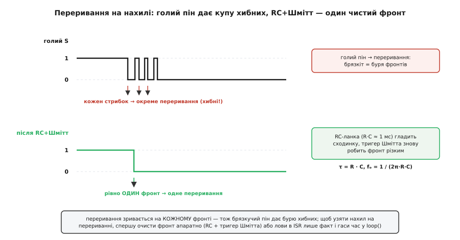

# ⚙️ Прошивка під KY-020: читання, гасіння брязкоту, переривання

Тут — не «як блимнути світлодіодом від нахилу», а повний набір робочих скетчів, з яких виростає надійна поведінка: рахувати кожне окреме перекидання, ловити момент падіння набік із тривогою, знімати давач на перериванні так, щоб брязкіт кульки не перетворив одну подію на бурю. Скетчі — під Arduino (AVR, класичний UNO/Nano) і під ESP32, бо саме перехід між цими двома платами ховає найпідступніші пастки: інші піни переривань, відсутність внутрішньої підтяжки на частині ніг, вимога тримати обробник у швидкій памʼяті, несумісність рівнів 5 В і 3.3 В.

Одна думка тримає всю цю вставку, і варто прийняти її одразу: **KY-020 з погляду коду — це кнопка з інвертованим виходом, яка деренчить сильніше за звичайну**. Усе інше — наслідки. Інвертований вихід диктує, що «нахилом» ми звемо `LOW`. Деренчання диктує, що сирому рівню вірити не можна ніколи, крім найгрубішого «поки тисне — світи». А те, що це кулька, а не палець, диктує ще й чутливість до вібрації: давач смикнеться від поштовху, якого ти не хотів. Хто це вкладе в код правильно, той дістане надійний сигнал; хто прочитає ногу наївно — дістане прилад, що бреше.

## Читання з поправкою на інверсію: маленька обгортка, що вбиває головну помилку

Почнімо з єдиної операції, з якої складається вся робота, — прочитати стан. На платі KY-020 стоїть підтяжка до плюса, тому спокій-рівно дає на піні логічну «1» (`HIGH`), а нахил садить пін на землю й дає «0» (`LOW`). Це перевернуто відносно того, що підказує чуття («нахилив — стало правда»), і саме тут новачок робить помилку номер один: пише `if (digitalRead(pin) == HIGH)` і дивується, чому «спрацьовує», коли платка лежить рівно.

Ліки прості й дисциплінувальні: **ніде в коді не читай пін голим `digitalRead`, читай через обгортку, яка вже перевернула логіку**. Тоді інверсія живе рівно в одному місці, а решта програми оперує чесним булевим `tilted` — «нахилено чи ні», без жодних `HIGH`/`LOW` під ногами.

:::tabs
```cpp
const uint8_t TILT = 2;    // пін S давача

inline bool isTilted() {
    // Уся інверсія — ТУТ, і більше ніде. LOW = кулька сіла на землю = нахил.
    return digitalRead(TILT) == LOW;
}

void setup() {
    pinMode(TILT, INPUT);  // підтяжка вже на модулі; INPUT_PULLUP теж годиться, гірше не буде
    Serial.begin(9600);
}

void loop() {
    Serial.println(isTilted() ? "нахил" : "рівно");
    delay(200);
}
```
```micropython
from machine import Pin
import time

TILT = 2                                # пін S давача

# підтяжка вже на модулі; PULL_UP теж годиться, гірше не буде
tilt = Pin(TILT, Pin.IN, Pin.PULL_UP)

def is_tilted():
    # Уся інверсія — ТУТ, і більше ніде. 0 = кулька сіла на землю = нахил.
    return tilt.value() == 0

while True:
    print("нахил" if is_tilted() else "рівно")
    time.sleep_ms(200)
```
:::

Чому `INPUT`, а не `INPUT_PULLUP`? На готовому модулі KY-020 різистор 10 кОм уже тягне сигнал до плюса, тож зовнішня підтяжка не потрібна, і `INPUT` працює. Але `INPUT_PULLUP` теж безпечний і навіть кращий як звичка: він докидає внутрішню підтяжку МК (у AVR це 20–50 кОм) паралельно до тієї, що на платі. Дві підтяжки в паралель дають трохи менший сумарний опір і трохи певніший «1» — жодної шкоди. А головне, звичка завжди вмикати `INPUT_PULLUP` рятує в той день, коли тобі трапиться клон KY-020 **без** різистора на платі: голий контакт без підтяжки лишить вхід висіти в повітрі, і давач читатиметься як випадкове сміття. З `INPUT_PULLUP` він працюватиме однаково — бо підтяжку дасть сам МК.

> 🔧 **Навіщо це.** Обгортка `isTilted()` коштує один рядок, але прибирає цілий клас багів. Поки логіка інверсії розповзається по коду десятком `== LOW` / `== HIGH`, кожен новий `if` — шанс поставити не той бік і дістати «все навпаки» в одній гілці й правильно в іншій. Зібрана в одну функцію, інверсія стає невидимою: пишеш `if (isTilted())` і читаєш це як просте українське «якщо нахилено». А коли попадеться дзеркальний клон (підтяжка до землі — тоді нахил дасть `HIGH`), правиш **один** рядок замість полювання по всьому скетчу.

Ще одне практичне попередження, яке варто закласти в код звичкою: **пін S лише читають, з нього не беруть струм**. Він — вихід ланцюжка «різистор + контакт»; спроба засвітити з нього світлодіод напряму або підтягнути ним щось потужне або спотворить рівень, або й спалить контакт кульки. Світлодіод, реле, будь-яке навантаження — на окрему ногу МК, а S лишається чисто вхідним.

## Гасіння брязкоту як скінченний автомат: одне перекидання = одна подія

Наївний код бачить кожне підстрибування кульки. Скотившись на ніжки, кулька не сідає м'яко — вона підскакує й відскакує кілька разів за перші міліметри-мілісекунди, і кожен дотик-відскок дає окремий перехід `0↔1`. Один твій нахил перетворюється на чергу з десятка стрибків, а МК, що опитує ногу мільйони разів на секунду, чесно рахує кожен. Хочеш порахувати нахили — дістанеш не «1», а «7» чи «11».

Ідея гасіння (англ. *debouncing*) в одному реченні: **не вір миттєвому рівню — вір лише тому, що протримався сталим досить довго**. «Досить довго» для кульки SW-520D — це десь **20–50 мілісекунд**: усі підстрибування вкладаються приблизно в 20 мс, тож поріг 30 мс із запасом переживає їх усі, але лишається невідчутним для людини. Візьмеш поріг замалий (5 мс) — частина брязкоту просочиться; завеликий (300 мс) — почнеш губити швидкі реальні перекидання. 30 мс — золота середина для цього давача.

Найчистіше це виражається як **скінченний автомат** (англ. *finite state machine*) з чотирьох станів, і саме такий погляд варто прийняти, бо він відразу знімає плутанину «а що зараз — реальний перехід чи ще брязкіт?». Стани: `STEADY_LEVEL` (усе спокійно, рівень тримається), `SETTLING` (рівень щойно смикнувся, чекаємо, поки вгамується). Але на практиці зручніше тримати не явний enum, а дві величини — останнє *сире* читання й час його останньої зміни, — і виводити рішення з них. Ось надійний, неблокувальний варіант на `millis()`:

:::tabs
```cpp
const uint8_t TILT  = 2;
const unsigned long SETTLE = 30;   // мс: скільки рівень має протриматися, щоб повірити

bool lastRaw       = HIGH;         // попереднє СИРЕ читання (HIGH = рівно)
bool stableState   = HIGH;         // усталений, «прийнятий» стан
unsigned long lastChangeMs = 0;    // коли сире читання востаннє смикнулось
unsigned long tiltCount = 0;       // лічильник СПРАВЖНІХ нахилів

void setup() {
    pinMode(TILT, INPUT_PULLUP);
    Serial.begin(9600);
    lastRaw = stableState = digitalRead(TILT);
}

// Повертає true рівно в ту ітерацію, коли усталений стан перейшов у «нахил».
bool tiltEdge() {
    bool raw = digitalRead(TILT);
    if (raw != lastRaw) {              // сире читання щойно смикнулось —
        lastChangeMs = millis();       // перезапускаємо відлік «тиші»
        lastRaw = raw;
    }
    // рівень протримався сталим довше за SETTLE і відрізняється від прийнятого?
    if ((millis() - lastChangeMs) > SETTLE && raw != stableState) {
        stableState = raw;             // приймаємо новий усталений стан
        return (stableState == LOW);   // true, лише якщо перейшли САМЕ в нахил
    }
    return false;
}

void loop() {
    if (tiltEdge()) {
        tiltCount++;
        Serial.print("нахилів: ");
        Serial.println(tiltCount);
    }
    // тут може крутитися решта програми — tiltEdge() нічого не блокує
}
```
```micropython
from machine import Pin
import time

TILT   = 2
SETTLE = 30                         # мс: скільки рівень має протриматися, щоб повірити

tilt = Pin(TILT, Pin.IN, Pin.PULL_UP)

last_raw        = 1                 # попереднє СИРЕ читання (1 = рівно)
stable_state    = 1                 # усталений, «прийнятий» стан
last_change_ms  = 0                 # коли сире читання востаннє смикнулось
tilt_count      = 0                 # лічильник СПРАВЖНІХ нахилів

last_raw = stable_state = tilt.value()

# Повертає True рівно в ту ітерацію, коли усталений стан перейшов у «нахил».
def tilt_edge():
    global last_raw, stable_state, last_change_ms
    raw = tilt.value()
    if raw != last_raw:                     # сире читання щойно смикнулось —
        last_change_ms = time.ticks_ms()    # перезапускаємо відлік «тиші»
        last_raw = raw
    # рівень протримався сталим довше за SETTLE і відрізняється від прийнятого?
    if time.ticks_diff(time.ticks_ms(), last_change_ms) > SETTLE and raw != stable_state:
        stable_state = raw                  # приймаємо новий усталений стан
        return stable_state == 0            # True, лише якщо перейшли САМЕ в нахил
    return False

while True:
    if tilt_edge():
        tilt_count += 1
        print("нахилів:", tilt_count)
    # тут може крутитися решта програми — tilt_edge() нічого не блокує
```
:::

Механізм читається як історія. Щоразу, коли сире читання стрибає (кулька підскочила), ми перезапускаємо секундомір `lastChangeMs`. Поки стрибки йдуть один за одним, секундомір раз за разом обнуляється й ніколи не набирає 30 мс — тож ми нічого не приймаємо. Щойно кулька вгамувалась і рівень завмер, стрибки припиняються, секундомір нарешті докручує до 30 мс тиші, і ми ухвалюємо новий стан. З усієї бурі народжується рівно одна чиста подія. А `return (stableState == LOW)` віддає `true` лише на переході саме в нахил — не на поверненні в спокій, — тож лічильник рахує перекидання, а не всі зміни поспіль.

Чому `millis()`, а не старий шкільний прийом «побачив зміну — `delay(30)` — прочитав ще раз»? Бо `delay(30)` **зупиняє всю програму** на ці 30 мс: поки чекаєш кульку, не блимає індикатор, не крутиться інший давач, не відповідає кнопка. Для іграшки-однозадачі це стерпно, для будь-чого складнішого — отрута. Підхід на `millis()` не блокує нічого: `tiltEdge()` відпрацьовує за мікросекунди й вертає керування, а відлік живе у змінній. Тому в реальному коді для гасіння беруть саме його.

> 🔧 **Навіщо це.** Гасіння — не факультативна оздоба, а обов'язкова частина будь-чого, крім найгрубішого «поки тисне — світи». Лічильник поворотів без гасіння даватиме на одне перекидання по 5–10, і твоя логіка «через три нахили ввімкни режим» спрацює після першого ж; вимикач-перемикач без гасіння моргатиме станом; стан-машина смикатиметься. Правило на все життя з механічними контактами (кнопка, геркон, реле, кулька): **між контактом і логікою завжди став гасіння** — або програмне на `millis()`, як тут, або апаратне, коли треба чистий фронт для переривання (нижче).

## Детектор перекидання-тривоги: не «нахилено», а «нахилено вже досить довго»

Порахувати нахили — одне; зловити, що пристрій **упав набік і лишається так**, — інше, і тонше. Наївне «нахилено → тривога» дасть хибну сирену на кожен струс: підняв корпус, переставив, зачепив — кулька коротко торкнулася контактів, і сирена вереснула, хоча пристрій стоїть рівно. Реальна ситуація «перекинувся» відрізняється від струсу однією рисою: **нахил тримається**. Стіл штовхнули — давач смикнувся й повернувся; пристрій упав — давач у нахилі й не виходить із нього.

Отже, тривогу треба вішати не на факт нахилу, а на **тривалість** нахилу: підняти її, лише коли давач протримався в нахилі довше за поріг — скажімо, 800 мс. Це той самий прийом «вір лише сталому», але з іншим, довшим порогом і з іншою метою: тут ми не гасимо брязкіт (30 мс), а відсіюємо короткі струси від справжнього падіння (сотні мс). Обидва пороги живуть в одному коді й не заважають один одному.

:::tabs
```cpp
const uint8_t TILT  = 2;
const uint8_t BUZZ  = 8;               // зумер / реле (окрема нога, не S!)
const unsigned long SETTLE   = 30;     // мс: гасіння брязкоту
const unsigned long ALARM_MS = 800;    // мс: скільки НАХИЛ має триматися до тривоги

bool lastRaw = HIGH, stableState = HIGH;
unsigned long lastChangeMs = 0;
unsigned long tiltedSinceMs = 0;       // коли розпочався ПОТОЧНИЙ усталений нахил
bool alarmOn = false;

void setup() {
    pinMode(TILT, INPUT_PULLUP);
    pinMode(BUZZ, OUTPUT);
    Serial.begin(9600);
    lastRaw = stableState = digitalRead(TILT);
}

void loop() {
    // 1) гасіння брязкоту → чистий stableState
    bool raw = digitalRead(TILT);
    if (raw != lastRaw) { lastChangeMs = millis(); lastRaw = raw; }
    if ((millis() - lastChangeMs) > SETTLE && raw != stableState) {
        stableState = raw;
        if (stableState == LOW) tiltedSinceMs = millis();  // нахил тільки-но став усталеним
    }

    // 2) тривога — лише якщо усталений нахил тримається довше за ALARM_MS
    bool longTilt = (stableState == LOW) &&
                    ((millis() - tiltedSinceMs) > ALARM_MS);
    if (longTilt && !alarmOn) {
        alarmOn = true;
        digitalWrite(BUZZ, HIGH);
        Serial.println("ТРИВОГА: пристрій лежить набік!");
    } else if (!longTilt && alarmOn && stableState == HIGH) {
        alarmOn = false;                                   // підняли назад — знімаємо тривогу
        digitalWrite(BUZZ, LOW);
        Serial.println("норма: пристрій вирівняно");
    }
}
```
```micropython
from machine import Pin
import time

TILT     = 2
BUZZ     = 8                             # зумер / реле (окрема нога, не S!)
SETTLE   = 30                           # мс: гасіння брязкоту
ALARM_MS = 800                          # мс: скільки НАХИЛ має триматися до тривоги

tilt = Pin(TILT, Pin.IN, Pin.PULL_UP)
buzz = Pin(BUZZ, Pin.OUT)

last_raw = stable_state = tilt.value()
last_change_ms  = 0
tilted_since_ms = 0                      # коли розпочався ПОТОЧНИЙ усталений нахил
alarm_on = False

while True:
    now = time.ticks_ms()

    # 1) гасіння брязкоту → чистий stable_state
    raw = tilt.value()
    if raw != last_raw:
        last_change_ms = now
        last_raw = raw
    if time.ticks_diff(now, last_change_ms) > SETTLE and raw != stable_state:
        stable_state = raw
        if stable_state == 0:
            tilted_since_ms = now       # нахил тільки-но став усталеним

    # 2) тривога — лише якщо усталений нахил тримається довше за ALARM_MS
    long_tilt = (stable_state == 0 and
                 time.ticks_diff(now, tilted_since_ms) > ALARM_MS)
    if long_tilt and not alarm_on:
        alarm_on = True
        buzz.value(1)
        print("ТРИВОГА: пристрій лежить набік!")
    elif not long_tilt and alarm_on and stable_state == 1:
        alarm_on = False                # підняли назад — знімаємо тривогу
        buzz.value(0)
        print("норма: пристрій вирівняно")
```
:::

Тут дві витримки працюють ланцюжком. Спершу 30-мілісекундне гасіння перетворює брязкучий пін на чистий `stableState`. Далі, щойно `stableState` стає нахилом, ми запам'ятовуємо мить `tiltedSinceMs` і починаємо відлік уже другого порога. Тривога зривається, тільки якщо від початку усталеного нахилу минуло понад 800 мс, — тобто пристрій не просто смикнувся, а лежить набік майже секунду. Короткий струс до `stableState`-нахилу може й дійти (якщо кулька торкалась контактів понад 30 мс), але `tiltedSinceMs` тут-таки обнулиться при поверненні в спокій, і другий поріг ніколи не добіжить до 800 мс. Так струс відсіюється, а падіння ловиться.

Поріг `ALARM_MS` крути під задачу: для нічника, що має гаснути, коли його поклали, доречні короткі 300–500 мс; для приладу на злегка хиткій підставці — секунда й більше, щоб не верещати від кожного поштовху. Головне — сам принцип: **тривога на тривалість, не на миттєвий рівень**.

## Читання на перериванні: чому голому пінові тут не місце

Опитувати ногу в циклі (англ. *polling*) — просто й для більшості задач достатньо. Але буває, що опитувати ніколи або невигідно: МК спить заради економії батареї й має прокидатися лише на подію, або цикл зайнятий чимось довгим і не встигає ловити швидкі зміни. Тоді беруть **зовнішнє переривання** (англ. *external interrupt*): вішають на пін апаратний детектор фронту, і щойно рівень на нозі змінюється в заданий бік, процесор кидає поточну роботу й стрибає в обробник — **функцію-обробник переривання** (англ. *interrupt service routine*, ISR).

І ось де KY-020 підкладає найбільшу свиню. **Переривання зривається на кожному фронті — а брязкіт кульки це буря фронтів.** Одне перекидання дає не один перехід, а десяток; повісиш ISR на «спадний фронт» — вона смикнеться не раз, а стільки разів, скільки кулька підстрибнула. Лічильник у перериванні нарахує 8 замість 1, пробудження від сну спрацює купою, черга подій переповниться. Гасити це в самій ISR прочитанням часу теж кепсько: обробник має бути коротким, як постріл, а не сидіти й чекати, поки кулька вгамується.

Звідси два робочі шляхи, і обидва варто знати.

**Шлях перший — гібрид: ISR ловить лише факт, гасіння живе в `loop()`.** Обробник не рахує й не вирішує — він робить одне: ставить прапорець «щось смикнулось» і виходить. А вже головний цикл, побачивши прапорець, застосовує звичне гасіння на `millis()` й ухвалює рішення. Так ISR лишається блискавичною, а брязкіт відсіюється у спокійному місці.

:::tabs
```cpp
const uint8_t TILT = 2;                 // на AVR переривання лише D2 і D3
const unsigned long SETTLE = 30;

volatile bool pinChanged = false;       // прапорець з ISR — ОБОВ'ЯЗКОВО volatile
unsigned long lastChangeMs = 0;
bool lastRaw = HIGH, stableState = HIGH;
unsigned long tiltCount = 0;

void onEdge() {                          // ISR — коротка, як постріл
    pinChanged = true;                   // жодного Serial, digitalRead-логіки, delay тут!
}

void setup() {
    pinMode(TILT, INPUT_PULLUP);
    Serial.begin(9600);
    lastRaw = stableState = digitalRead(TILT);
    attachInterrupt(digitalPinToInterrupt(TILT), onEdge, CHANGE);  // на будь-який фронт
}

void loop() {
    if (pinChanged) {                    // ISR щось помітила
        pinChanged = false;
        bool raw = digitalRead(TILT);
        if (raw != lastRaw) { lastChangeMs = millis(); lastRaw = raw; }
    }
    // гасіння крутиться в циклі, спокійно
    if ((millis() - lastChangeMs) > SETTLE && lastRaw != stableState) {
        stableState = lastRaw;
        if (stableState == LOW) {
            tiltCount++;
            Serial.print("нахилів: "); Serial.println(tiltCount);
        }
    }
}
```
```micropython
from machine import Pin
import time

TILT   = 2
SETTLE = 30

pin_changed    = False                  # прапорець з ISR
last_change_ms = 0
tilt_count     = 0

tilt = Pin(TILT, Pin.IN, Pin.PULL_UP)
last_raw = stable_state = tilt.value()

def on_edge(pin):                        # ISR — коротка, як постріл
    global pin_changed
    pin_changed = True                   # жодного print, читання-логіки, sleep тут!

# на будь-який фронт
tilt.irq(trigger=Pin.IRQ_RISING | Pin.IRQ_FALLING, handler=on_edge)

while True:
    if pin_changed:                      # ISR щось помітила
        pin_changed = False
        raw = tilt.value()
        if raw != last_raw:
            last_change_ms = time.ticks_ms()
            last_raw = raw
    # гасіння крутиться в циклі, спокійно
    if time.ticks_diff(time.ticks_ms(), last_change_ms) > SETTLE and last_raw != stable_state:
        stable_state = last_raw
        if stable_state == 0:
            tilt_count += 1
            print("нахилів:", tilt_count)
```
:::

Два слова цей код кричить окремо. Перше — **`volatile`** на прапорці `pinChanged`. Без нього оптимізатор компілятора має право вирішити, що `pinChanged` у `loop()` ніхто не міняє (він же не бачить, що його міняє ISR), і закешувати значення в регістрі — тоді `loop()` ніколи не помітить зміну. `volatile` наказує щоразу читати змінну з пам'яті. Будь-яка змінна, яку торкає і ISR, і головний код, **мусить** бути `volatile` — це не порада, а умова коректності. Друге — **ISR має бути короткою**. Усередині обробника не можна `delay()` (таймери в перериванні часто стоять), небезпечно `Serial.print` (він сам на перериваннях і може зависнути), не варто важких обчислень. Правило: у ISR — лише поставити прапорець чи інкремент лічильника, усе інше — в `loop()`.

**Шлях другий — очистити фронт апаратно, щоб переривання було чесним.** Якщо тобі *конче* треба, щоб на одне перекидання припадало рівно одне переривання (наприклад, лічильник у сплячому МК, який прокидається на кожен імпульс і не має циклу, де гасити), — гаси брязкіт **до** того, як він дійде до ноги, залізом. Тоді на пін приходить уже чистий одиничний фронт, і ISR можна вішати без гібридних хитрощів.


*Чому голий KY-020 не можна вішати на переривання «в лоб». Угорі — сирий сигнал із піна: один нахил дає зубчасту чергу стрибків, і переривання зривається на кожному спадному краї (хибні спрацювання). Унизу — той самий нахил після апаратного гасіння: RC-ланка (стала часу τ = R·C ≈ 1 мс) розмиває брязкучу сходинку в плавну, а тригер Шмітта своїм гістерезисом знову робить із неї один різкий фронт — переривання отримує рівно одну подію. Формула зрізу: fₒ = 1 / (2π·R·C).*

## Апаратне гасіння: RC-ланка й тригер Шмітта, і чому одного RC мало

Найпростіше апаратне гасіння — **RC-ланка** (різистор + конденсатор): від сигналу через різистор R до конденсатора C на землю. Це фільтр низьких частот: повільні зміни (реальний перехід рівня) проходять, а швидкі стрибки брязкоту конденсатор «замазує», бо не встигає ні зарядитися, ні розрядитися за їхні мікросекунди. Ключова величина — **стала часу** (англ. *time constant*):

```
τ = R · C

приклад:  R = 10 кОм = 10·10³ Ом
          C = 100 нФ = 100·10⁻⁹ Ф
          τ = 10·10³ · 100·10⁻⁹ = 1·10⁻³ с = 1 мс
```

За час τ конденсатор заряджається приблизно до 63% нового рівня; повний перехід — близько 3–5·τ, тобто тут 3–5 мс. Брязкіт кульки (окремі стрибки по частці мілісекунди) на цьому тлі повністю розмивається, а реальна зміна рівня проходить із затримкою в кілька мілісекунд — непомітною для задачі. Частоту зрізу фільтра, якщо цікаво мислити в частотах, дає:

```
fₒ = 1 / (2π · R · C) = 1 / (2π · 10·10³ · 100·10⁻⁹) ≈ 159 Гц
```

Усе, що швидше за ~159 Гц (а брязкіт — це кілогерци), фільтр давить.

Але тут ховається пастка, через яку самого RC часто **недостатньо для переривання**. RC згладжує фронт — робить його *повільним*, плавно наростаючим. А цифровий вхід і детектор фронту хочуть якраз **різкого** переходу. Повільно повзучи через «сіру зону» між рівнями «0» і «1» (де вхід не знає, «0» це чи «1»), сигнал може дати на вході кілька дрібних перемикань поспіль — той самий брязкіт, тільки тепер породжений повільним фронтом і шумом на вході. RC прибрав механічний брязкіт і додав ризик «повільно-фронтового». Для простого `digitalRead` у циклі це байдуже (ти й так читаєш усталений рівень), а для переривання — знову буря.

Ліки — **тригер Шмітта** (англ. *Schmitt trigger*) після RC. Це вентиль із **гістерезисом**: у нього два різні пороги — вищий, щоб перемкнутися в «1», і нижчий, щоб перемкнутися в «0». Поки повільний сигнал повзе між цими двома порогами, вихід тригера **не змінюється** — він тримає стан. Перемикання стається одноразово й різко, коли сигнал перетне дальній поріг, і повернутися одразу назад він не може (треба спершу дійти до ближнього порога). Гістерезис і різкий вихід — саме те, що потрібно перериванню: RC розмазав брязкіт у плавну сходинку, тригер Шмітта зробив із неї один чистий різкий фронт. Класична деталь — **74HC14** (шість інверторів із входами Шмітта); при живленні 5 В його гістерезис близько 0.9 В — з великим запасом ширший за будь-яке дрижання на вході.

Практична схема очищення виходу KY-020 під переривання: пін S → різистор 10 кОм → вузол, від вузла конденсатор 100 нФ на землю (це RC, τ ≈ 1 мс), вузол → вхід 74HC14, вихід 74HC14 → нога переривання МК. Так на перериванні опиняється сигнал, у якому на одне перекидання — рівно один фронт, і гібридні хитрощі в коді вже не потрібні.

> 🔧 **Навіщо це.** Апаратне гасіння коштує двох деталей, але звільняє від головного клопоту переривань із механічним контактом. Якщо твоя задача — рахувати рідкі перекидання в глибоко сплячому МК (лічильник струсів на батарейці, що прокидається лише на подію), у тебе просто немає циклу, де гасити програмно, — і тоді RC+Шмітт єдиний спосіб дістати чесний одиничний фронт. У решті випадків, коли цикл є, дешевше й гнучкіше гасити в `loop()` (гібрид вище), а залізо лишити для тих нечастих задач, де це справді потрібно.

## ESP32: ті самі скетчі, але чотири пастки поспіль

Перенести код на ESP32 спокусливо думати як просту заміну плати — а насправді тут чигають одразу чотири відмінності, і кожна ламає наївне перенесення по-своєму. Це не «інша прошивка», а інша ніжка, інша пам'ять і інша напруга. Розберімо всі чотири, бо саме на них спотикаються, переносячи робочий на UNO скетч.

**Пастка 1 — рівні 5 В проти 3.3 В.** ESP32 живиться від 3.3 В, і його ноги **не терплять 5 В** — 5-вольтовий рівень на вході псує пін. А рівень «1» на виході KY-020 дорівнює напрузі його живлення: даси давачеві 5 В — на піні S у спокої буде 5 В, які підуть просто в 3.3-вольтову ногу ESP32. Тому **живи KY-020 від 3.3 В ESP32, не від 5 В**: тоді «1» на виході буде 3.3 В, безпечні для входу. Струм давач їсть мізерний, 3.3 В йому цілком досить, щоб надійно давати рівні. (Якщо конче потрібно живити давач 5 В — став подільник або конвертер рівнів між S і ногою ESP32; але найпростіше — просто живити давач 3.3 В.)

**Пастка 2 — не кожна нога має внутрішню підтяжку.** У ESP32 ноги **GPIO34, 35, 36, 39** — виключно входи, і вони **не мають** ні внутрішньої підтяжки, ні внутрішнього стягування; `INPUT_PULLUP` на них просто не спрацює. Для KY-020 із його підтяжкою на платі це поки не біда (підтяжку дає модуль). Але щойно тобі трапиться клон **без** різистора, повісиш його на GPIO34 з наміром `INPUT_PULLUP` — і дістанеш плаваючий вхід і суцільне сміття, бо підтягнути нема чим. Висновок: сигнал давача чіпляй до **звичайної** ноги ESP32 (наприклад, GPIO4, 13, 14, 25, 26, 27…), що вміє `INPUT_PULLUP`, а input-only ноги 34–39 лишай для випадків, де підтяжка гарантовано зовнішня.

**Пастка 3 — обробник має жити у швидкій пам'яті (`IRAM_ATTR`).** На ESP32 частина коду за замовчуванням лежить у зовнішній флеш-пам'яті, доступ до якої повільний і часом недоступний (коли флеш зайнята іншим). Якщо переривання зірветься в такий момент, а обробник — у флеші, застосунок падає. Тому ISR на ESP32 **мусить** бути позначена `IRAM_ATTR` — це кладе її у внутрішню швидку пам'ять (IRAM), доступну процесору миттєво завжди. На AVR цього не треба; на ESP32 — обов'язково, інакше ловитимеш загадкові перезавантаження.

**Пастка 4 — переривання можна вішати на будь-яку ногу (на відміну від AVR).** На класичному AVR (UNO/Nano) зовнішні переривання живуть лише на D2 і D3 — це часто забувають. На ESP32 навпаки: `attachInterrupt` працює майже на будь-якому GPIO, свободи більше. Але з цією свободою приходить окрема тонкість: **ноги GPIO36 і GPIO39** мають документовану ваду — коли вмикаються деякі RTC-периферії (АЦП, температурний давач, датчик Голла), вхід цих ніг на ~80 нс просідає до низького рівня. Для переривання це фальшивий фронт: повісиш ISP на GPIO36 і паралельно читатимеш АЦП — ловитимеш примарні спрацювання нізвідки. Тож для переривання від KY-020 на ESP32 бери звичайну ногу, а GPIO36/39 обходь, якщо в проєкті є АЦП.

Зібравши всі чотири поправки, ось робочий скетч під ESP32 — гібрид «ISR ставить прапорець, гасіння в циклі», уже з `IRAM_ATTR`, звичайною ногою з підтяжкою й живленням від 3.3 В:

:::tabs
```cpp
// ESP32: живлення давача — 3.3 В! Сигнал S — на звичайну ногу з підтяжкою.
const uint8_t TILT = 14;               // звичайний GPIO (НЕ 34–39): має INPUT_PULLUP
const unsigned long SETTLE = 30;

volatile bool pinChanged = false;      // спільна з ISR → volatile
unsigned long lastChangeMs = 0;
bool lastRaw = HIGH, stableState = HIGH;
unsigned long tiltCount = 0;

void IRAM_ATTR onEdge() {              // на ESP32 ISR — обов'язково IRAM_ATTR
    pinChanged = true;                 // лише прапорець, нічого важкого
}

void setup() {
    pinMode(TILT, INPUT_PULLUP);       // на GPIO14 підтяжка є; на 34–39 її НЕ буде
    Serial.begin(115200);
    lastRaw = stableState = digitalRead(TILT);
    attachInterrupt(digitalPinToInterrupt(TILT), onEdge, CHANGE);
}

void loop() {
    if (pinChanged) {
        pinChanged = false;
        bool raw = digitalRead(TILT);
        if (raw != lastRaw) { lastChangeMs = millis(); lastRaw = raw; }
    }
    if ((millis() - lastChangeMs) > SETTLE && lastRaw != stableState) {
        stableState = lastRaw;
        if (stableState == LOW) {
            tiltCount++;
            Serial.print("нахилів: "); Serial.println(tiltCount);
        }
    }
}
```
```micropython
# ESP32 (MicroPython): живлення давача — 3.3 В! Сигнал S — на звичайну ногу з підтяжкою.
from machine import Pin
import micropython, time
micropython.alloc_emergency_exception_buf(100)   # аби бачити помилки з ISR

TILT   = 14                             # звичайний GPIO (НЕ 34–39): має PULL_UP
SETTLE = 30

pin_changed    = False                  # спільна з ISR
last_change_ms = 0
tilt_count     = 0

tilt = Pin(TILT, Pin.IN, Pin.PULL_UP)   # на GPIO14 підтяжка є; на 34–39 її НЕ буде
last_raw = stable_state = tilt.value()

def on_edge(pin):                        # у MicroPython обробник уже в IRAM — IRAM_ATTR не потрібен
    global pin_changed
    pin_changed = True                   # лише прапорець, нічого важкого

tilt.irq(trigger=Pin.IRQ_RISING | Pin.IRQ_FALLING, handler=on_edge)

while True:
    if pin_changed:
        pin_changed = False
        raw = tilt.value()
        if raw != last_raw:
            last_change_ms = time.ticks_ms()
            last_raw = raw
    if time.ticks_diff(time.ticks_ms(), last_change_ms) > SETTLE and last_raw != stable_state:
        stable_state = last_raw
        if stable_state == 0:
            tilt_count += 1
            print("нахилів:", tilt_count)
```
:::

Порівняй його з AVR-версією гібрида вище — тіло логіки те саме до літери. Відрізняються рівно чотири речі, і всі вони не про алгоритм, а про залізо ESP32: нога `14` замість `2` (бо треба звичайну з підтяжкою й переривання тут не обмежене двома ногами), `IRAM_ATTR` перед `onEdge`, швидкість порту 115200 (звична для ESP32) і невимовлена, але головна умова — давач живиться від 3.3 В. Хто тримає ці чотири поправки в голові, той переносить будь-який KY-020-скетч між платами без сюрпризів.

> 🔧 **Навіщо це.** Три з чотирьох пасток дають не зрозумілу помилку компіляції, а мовчазний баг у полі: 5 В на нозі поволі вбивають пін, `INPUT_PULLUP` на GPIO34 тихо не працює, ISR без `IRAM_ATTR` перезавантажує плату «випадково». Такі баги коштують годин, бо код *виглядає* правильним і навіть компілюється. Тримати цей чотирипунктовий чек-лист перед перенесенням на ESP32 дешевше за будь-яке відлагодження постфактум.

## Пастки, зібрані докупи: симптом → причина → лік

Наостанок — стислий діагностичний перелік, кожен рядок якого вже розібрано вище, але зведений разом рятує в момент «чому воно не працює».

- **«Спрацьовує, коли лежить рівно; мовчить, коли нахилю».** Забув інверсію: вихід перевернутий (спокій = `HIGH`, нахил = `LOW`). Лови нахил як `== LOW` — або читай через `isTilted()`, де інверсія вже врахована. На дзеркальному клоні (підтяжка до землі) буде навпаки — звір напрям виміром на живому модулі.

- **Одне перекидання рахується як багато.** Брязкіт кульки: контакт підстрибує. Постав програмне гасіння (стале 20–50 мс на `millis()`) або апаратне (RC + тригер Шмітта) для переривання.

- **Сирена/подія від кожного струсу, хоча пристрій не падав.** Вішаєш дію на *миттєвий* нахил. Вішай на *тривалість* нахилу: тривога, лише коли давач тримається в нахилі довше за поріг (сотні мс) — так струс відсіюється від справжнього падіння.

- **Переривання дає бурю спрацювань на один нахил.** Брязкіт зриває ISR на кожному фронті. Або гібрид (ISR ставить прапорець, гасіння в `loop()`), або апаратна очистка фронту (RC + Шмітт) до ноги.

- **`loop()` «підвисає» на гасінні, все інше гальмує.** Гасиш через `delay()`, що спиняє програму. Перепиши на `millis()` — неблокувально.

- **ISR ніби працює, але лічильник не міняється / поводиться дивно.** Змінна, спільна з ISR, не `volatile` — оптимізатор закешував її. Постав `volatile` на все, що торкають і обробник, і `loop()`.

- **ESP32 «випадково» перезавантажується під час подій.** ISR не в швидкій пам'яті. Додай `IRAM_ATTR` перед обробником.

- **На ESP32 `INPUT_PULLUP` не тримає рівень (з клоном без підтяжки).** Повісив сигнал на GPIO34–39 — вони input-only й **не мають** внутрішньої підтяжки. Перечепи на звичайну ногу (GPIO4/13/14/25…).

- **ESP32 ловить примарні спрацювання, коли працює АЦП.** Переривання висить на GPIO36 чи GPIO39 — у них ~80-нс просідання від RTC-периферії. Візьми іншу ногу.

- **Рівень «1» надто високий, пін ESP32 деградує.** Живиш давач 5 В на 3.3-вольтовій платі: «1» = 5 В б'є в 3.3-В вхід. Живи KY-020 від 3.3 В (або став конвертер рівнів).

- **Пін S не тягне світлодіод / щось «горить».** Береш струм із виходу давача. S — тільки для читання вхідною ногою; навантаження вішай на окрему ногу МК.

Уся ця прошивка тримається на трьох простих істинах про залізячку під нею: вихід перевернутий (тому нахил — це нуль), контакт брязкучий (тому сирому рівню не вір, гаси), а сама кулька байдужа до того, струс це чи падіння (тому важливу дію вішай на тривалість, не на мить). Розклади ці три поправки по коду — і KY-020 із капризної залізки, що «то працює, то ні», стає надійним двійковим давачем нахилу, яким і мав бути.
