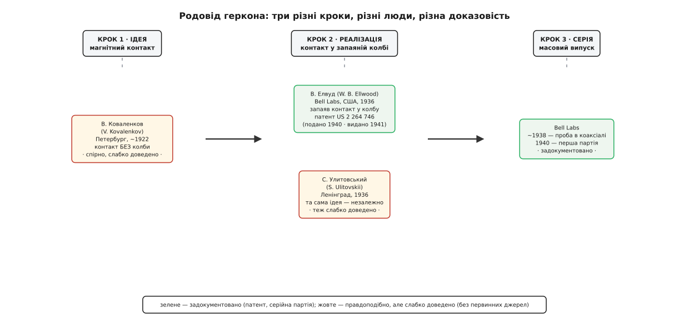
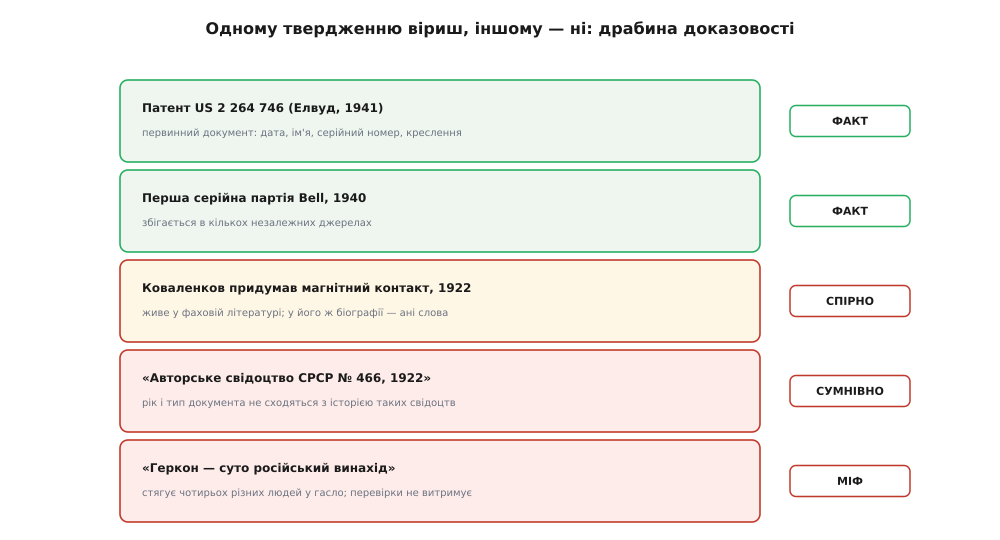

# 📜 Скляна трубочка, у якої аж четверо батьків

Розберемо просту на око річ — коли й ким «винайдено геркон» — і побачимо, що чесна відповідь ховається не в даті, а в питанні «а що саме винайдено?». Бо в цій крихітній скляній колбі з двома язичками стрілися чотири різні кроки, чотири різні людини й чотири дуже різні рівні доказовості. Один із цих кроків задокументований патентом і серійною партією так твердо, що сумніватися нема в чому. Другий — гуляє довідниками як «загальновідомий факт», а варто копнути під нього — і твердого дна не намацуєш. І між ними лежить класична пастка: спокуса склеїти все в одне гасло «геркон винайшли тоді-то й такі-то» — і приписати не тим авторам.

Тож не поспішаймо з одним іменем. Розкладемо трубочку на кроки й до кожного припасуймо своє ім'я і свій ступінь певності.

## Що взагалі означає «винайти геркон»

Перш ніж шукати винахідника, з'ясуймо, що ми шукаємо. Бо «геркон» — це не одна ідея, а щонайменше три речі, накладені одна на одну, і кожну міг зробити хтось інший, в інший час.

**Перше** — сама думка, що контактом можна керувати **магнітом здалеку**, крізь стінку, без важеля й без пальця. Два феромагнітні язички, зовнішнє поле намагнічує їх, різнойменні кінці притягуються — коло замикається. Це фізична ідея; вона не потребує ні скла, ні вакууму.

**Друге** — щоб цей контакт **жив довго**, його треба сховати від повітря: замкнути язички в **герметичну колбу** з інертним газом усередині. Без цього кроку контакт є, але кисень із вологою за місяці роз'їдять і закіптявлять місце дотику — і красива ідея перетвориться на ненадійну іграшку. Саме герметизація робить із «магнітного контакту» практичний **геркон**.

**Третє** — від однієї вдалої лабораторної трубочки до **серійного виробу**, який можна робити мільйонами, з передбачуваними параметрами, і встромляти в реальні пристрої. Це вже не осяяння, а інженерія й технологія: скло-до-металу, чистота, повторюваність.

> 🔧 **Навіщо це.** Ось чому питання «хто перший?» саме по собі погане: воно склеює три різні досягнення в одне. Хтось міг **придумати** магнітний контакт, зовсім не додумавшись його запаювати. Хтось інший — **запаяти**. Ще хтось — **зробити серію**. Приписати всю славу одному — це або применшити двох, або роздути одного. Далі ми якраз і рознесемо ці кроки по різних людях, а до кожного припнемо чесний ярлик доказовості.

*Родовід геркона в трьох кроках. Ідею магнітного контакту (без колби) пов'язують із Коваленковим — але слабко доведено. Крок «запаяти в колбу» 1936 року незалежно зробили двоє: Волтер Елвуд у Bell Labs (це задокументовано патентом) і, за російськими джерелами, Улитовський у Ленінграді (доведено кепсько). Серійний випуск — знову Bell, 1940-й, тут ґрунт твердий.*

## Крок, під яким тверде дно: Bell Telephone Laboratories, Елвуд

Почнімо з того кроку, у якому сумніватися майже нема сенсу, бо він лишив по собі первинні документи — а первинний документ це найтвердіше, що взагалі буває в історії техніки.

У другій половині 1930-х у **Bell Telephone Laboratories** — дослідному серці американської телефонної системи — інженер **Волтер Б. Елвуд** (англ. *Walter B. Ellwood*) розв'язував дуже практичну задачу. Телефонна мережа тих часів трималася на **реле** — електромагнітних перемикачах із відкритими контактами, — і цих реле в мережі були мільйони. Відкритий контакт має вроджену ваду: іскра при кожному замиканні поволі випалює метал, повітря окислює поверхню, пил заважає. Мережі був потрібен перемикач, який замикається **чисто, надовго, без обслуговування** — і бажано швидко й дрібно.

Ідея Елвуда була гарна саме простотою. Взяти дві тонкі феромагнітні пластинки-язички, звести їхні кінці внапусток із крихітним зазором, запаяти в **скляну колбу** — і керувати ними ззовні котушкою чи магнітом. Поле намагнічує язички, вони змикаються; поле зникло — пружність розводить їх. Жодного тертя, жодного відкритого повітря біля контакту: скло береже місце дотику десятиліттями. Коло замикає сам «клапоть» феромагнетика, тож дорогі контактні метали майже не потрібні — цю ощадність Елвуд навіть окремо підкреслив у патенті.

Тепер дати — і саме тут варто бути точним, бо навколо них плутанина. Роботу над цим контактом у Bell зазвичай відносять до **1936 року**. Приблизно **1938-го** експериментальний перемикач уже пробували в ділі — ним перемикали центральну жилу в коаксіальному кабелі. А **перша серійна партія** таких перемикачів вийшла близько **1940 року** — це і є момент, коли лабораторна трубочка стала виробом.

Патент же — окрема, ще твердіша точка опори. Заявку Елвуда під назвою **«Electromagnetic switch»** (електромагнітний перемикач) у Bell Telephone Laboratories подали **27 червня 1940 року** (заявка № 342 629), а видали патент **США № 2 264 746** аж **2 грудня 1941 року**. У самому тексті описано те, що ми й досі впізнаємо: пара магнітних язичків у відкачаній або наповненій інертним газом трубці, кінці внапусток із нормальним зазором, поле вздовж осі стягує зазор — і контакт перемикається.

> 🔧 **Навіщо це.** Зверни увагу, як розповзаються дати — і чому це не суперечність, а якраз три різні кроки, які ми щойно розкладали. **1936** — задум і перші зразки. **1938** — проба в реальному вузлі (коаксіал). **1940** — серія. А **1941** — коли держава оформила патент на заявку 1940-го. Той, хто цього не розрізняє, натикається на «1936, ні, 1940, ні, 1941» і думає, що джерела брешуть. Насправді кожна дата чесна — просто вони про різні речі. І, до речі: у самій статті-власниці цієї трубочки згадано «подано 1938-го» — це поширене округлення до року першої проби в коаксіалі; за реєстром патенту заявку прийняли **1940-го**, і саме цю дату варто тримати за точну.

Оце — тверде дно історії. Ім'я, установа, номер патенту, дата подання, дата видачі, рік серії — усе з документів, усе перевіряється. Якби історія геркона закінчувалася тут, її можна було б розповісти в один рядок. Але вона тут не починається.

## Крок, що загубив первинне джерело: Коваленков і 1922 рік

А тепер відступимо на чотирнадцять років назад — і ступимо на набагато хисткіший ґрунт. Бо майже кожен довідник, розповідаючи про геркон, кидає ніби між іншим: «а взагалі магнітний контакт придумали ще 1922 року в Петрограді». І тут починається найцікавіше й найделікатніше в цій історії.

Особа, яку називають, — **Валентин Іванович Коваленков** (рос. *Валентин Иванович Коваленков*, 1884–1960). І це, підкреслю відразу, **цілком реальний і поважний учений** — тут жодних сумнівів немає, і принижувати його не випадає. Родом із села Межник Новгородської губернії Російської імперії, він закінчив Петроградський електротехнічний інститут (1909) і Петербурзький університет (1911), працював у ленінградському ЛЕТІ, заснував там кафедру залізничної автоматики й телемеханіки, а згодом очолив Інститут автоматики й телемеханіки Академії наук СРСР. Його справжня, документована наукова слава — у **теорії дротового зв'язку**: передавання сигналів по лініях, теорія чотириполюсників, за що він і дістав 1941 року Сталінську премію. Це серйозний внесок, і він за Коваленковим стоїть твердо.

Питання не в тому, чи був Коваленков видатним. Питання вужче: **чи справді саме він і саме 1922 року зробив магнітний контакт** — і наскільки це доведено. І ось тут ґрунт провалюється.

Стандартне формулювання, що кочує з довідника в довідник, звучить так: 1922 року професор Коваленков винайшов реле з магнітокерованими контактами, на що дістав **авторське свідоцтво СРСР № 466**; це, мовляв, був найперший магнітокерований контакт — тільки **без герметичної оболонки**. Останнє уточнення, до речі, чесне й важливе: якщо це й правда, то Коваленков зробив **крок 1** (ідея магнітного контакту), але **не крок 2** (запаювання в колбу) — тобто не геркон у сучасному сенсі, а його незапаяного попередника.

Але придивімося до самого свідчення — і тут спливають дві тріщини, які не можна замовчати.

**Тріщина перша — свідоцтво, якого не мало бути в такому вигляді.** «Авторське свідоцтво СРСР № 466» з датою «1922» саме по собі викликає підозру, щойно зіставиш його з історією таких документів. Авторське свідоцтво як форму охорони запровадив декрет «Про винаходи» від **30 червня 1919 року**; але вже **12 вересня 1924-го** ЦВК СРСР ухвалив «Положення про патенти на винаходи», яке замінило авторські свідоцтва **патентною** системою — і діяло воно аж до **1931 року**, коли авторське свідоцтво відновили. Тобто рівно в проміжку, куди падає «1922», система авторських свідоцтв щойно народжувалась і невдовзі була згорнута на користь патентів. Низький тризначний номер (№ 466) із роком 1922 у цю канву лягає погано. Можливо, номер і дату колись переплутали, зсунули, приписали заднім числом — але **як воно є, ця пара «1922 / авторське свідоцтво № 466» внутрішньо не сходиться**, і це вже сигнал, що перед нами не первинний документ, а переказ переказу.

**Тріщина друга, і вона важливіша — мовчання власної біографії.** Ось найпоказовіше. Коли читаєш докладну біографію Коваленкова — про освіту, кафедру, теорію чотириполюсників, Сталінську премію, навіть про його патенти на «розмовляючий кінетоскоп» (1920) і на фотографічний запис звуку (1922) — про **магнітний контакт чи геркон там немає ані слова**. Винахід, який нібито поклав початок цілому класу приладів, у життєписі самого винахідника не згадується. Натомість він справно згадується в торгових статтях про геркони й у популярних оглядах «як це працює». Це дуже характерний малюнок: твердження живе в **фаховому фольклорі галузі**, але не має опори в **біографічному життєписі** людини, якій його приписують. Так поводяться саме слабко задокументовані атрибуції, а не встановлені факти.

> 🔧 **Навіщо це.** Ось практичне правило, ширше за геркон. Коли якесь «хто перший» бадьоро повторюють **вторинні джерела** (довідники, блоги виробників, оглядові статті), але воно **зникає з первинних** — з патенту, з біографії, з архіву, — це не «майже доведено», це **червоний прапорець**. Не обов'язково брехня: цілком можливо, що Коваленков і справді щось таке зробив, а первинний слід просто загубився в архівах воєн і перейменувань. Але доки первинного сліду нема, чесний статус тут не «факт», а «правдоподібно, але не доведено». І плутати ці два стани — означає видавати бажане за встановлене.

Зауваж і те, чого це правило **не** робить: воно не викидає Коваленкова з історії. Він лишається справжнім ученим із реальними, документованими заслугами. Ми лише відмовляємося чіпляти на нього конкретний, погано підтверджений «перший геркон» так, ніби це така сама тверда істина, як патент Елвуда. Різні твердження — різна певність.

## І ще одна тінь: Улитовський, забутий співавтор колби

Коли вже пішли на глибину, з російськомовних джерел випливає ще одна постать, повз яку не можна пройти, — бо вона руйнує навіть спробу зробити з герметизації охайну одноосібну історію.

Ті самі довідники, що згадують Коваленкова, у наступному ж реченні часто додають: **1936 року незалежно двоє** запропонували сховати магнітний контакт у герметичну оболонку — інженер Bell Волтер Елвуд у США **і** професор Ленінградського електротехнічного університету **С. К. Улитовський** (рос. *С. К. Улитовский*) у СРСР. Тобто навіть крок 2, саме запаювання в колбу, подають не як одноосібне осяяння Елвуда, а як **паралельний винахід** двох людей у різних країнах того самого року.

Наскільки цьому вірити? Із тією самою обережністю, а радше й із більшою. Про Улитовського в цих текстах — лише ім'я, установа й рік, **без патенту, без номера, без первинного посилання**. Це навіть слабше, ніж історія Коваленкова: там хоч називають (хай і сумнівний) номер свідоцтва, тут — узагалі нічого, окрім прізвища. Тож твердження «Улитовський незалежно від Елвуда запаяв контакт 1936-го» треба тримати за **правдоподібне, але недоведене** — рівно як і претензію Коваленкова.

Але сама його поява в історії робить дуже корисну річ: вона **вбиває спрощення** з обох боків. Не можна сказати «геркон — суто американський винахід Елвуда», бо поруч стоїть незалежна ленінградська заявка. Але так само не можна сказати «геркон — російський винахід, у Коваленкова вкрали», бо, по-перше, Коваленков (якщо й винайшов) зробив **інший** крок — незапаяний контакт, — а по-друге, навіть герметизацію російські джерела чесно ділять між Улитовським **і** Елвудом як незалежними. Паралельні відкриття — звична річ у техніці: коли задача дозріла і матеріали є, до розв'язку доходять у різних місцях майже одночасно, ніхто ні в кого не «крав».

> 🔧 **Навіщо це.** Улитовський у цій історії — щеплення проти обох національних міфів одразу. Проти американоцентричного «усе придумав Bell» і проти імперського «усе придумали в нас, а Захід приписав собі». Реальність нудніша й чесніша: **ідея визріла, і до неї дійшли кількома руками в кількох країнах**, а тверде документоване дно лишив по собі лише той, хто оформив патент і запустив серію, — Bell. Це не робить Bell «справжнім винахідником, а решту самозванцями»; це лише означає, що **доказова база** в них різна.

Отже, стережися особливо однієї спокуси. Коли з цих трьох імен — Коваленков, Улитовський, Елвуд — хтось ліпить гасло «геркон винайшли в Росії 1922-го, а американці лише запатентували», він робить одразу три підміни: видає **незапаяний** контакт за геркон, **слабко доведене** за факт і **чотирьох різних людей** — за одну лінію спадковості. Кожну з цих трьох підмін ми щойно розібрали окремо.

*Одні твердження про геркон стоять на первинних документах, інші — на переказах. Патент США № 2 264 746 і серійна партія 1940-го — тверді факти. «Коваленков придумав магнітний контакт 1922-го» — правдоподібно, але в його ж біографії відсутнє. «Авторське свідоцтво № 466, 1922» — сумнівне через невідповідність історії таких свідоцтв. «Геркон — суто російський винахід» — уже міф, бо стягує різні кроки й різних людей в одне гасло.*

## Звідки взялося саме слово «геркон»

Лишається розібрати ще одну плутанину — уже не про річ, а про **назву** цієї речі. Бо в українській (як і в російській) прилад зветься **геркон**, а англійською — зовсім інакше, **reed switch**, і за цими двома словами стоять дві геть різні логіки називання.

**Геркон** — це слово-стягнення, складене з двох обрубаних коренів: **гер**метизований **кон**такт. Тобто назва вказує на головну властивість — **герметичність**, запаяність у колбі: «гер(метизований) кон(такт)». Слово компактне й описове: почувши його, одразу знаєш, що йдеться про контакт, схований у герметичну оболонку. Народилося воно у слов'яномовному технічному вжитку саме як зручна абревіатура, і в цьому його зміст цілком прозорий.

**Reed switch** дивиться на прилад із зовсім іншого боку — не з боку оболонки, а з боку **самого язичка**. Англійське **reed** — це «тростина», а в техніці й музиці — **язичок**: тонка гнучка пластинка, як у язичкових духових інструментів (кларнет, гобой, гармоніка), що вигинається й вібрує. Феромагнітні пластинки в колбі формою й гнучкістю нагадують саме такий язичок — звідси й назва: *reed switch*, «язичковий перемикач». Англійська, отже, назвала прилад за **формою рухомої деталі**, а не за герметичністю.

> 🔧 **Навіщо це.** Ці дві назви — маленький урок про те, що слова несуть точку зору. «Геркон» акцентує **де** контакт (у герметичній колбі); «reed switch» акцентує **який** контакт (гнучкий язичок). Обидві правдиві, обидві вихоплюють різну грань тієї самої трубочки. Знати обидва корені корисно суто практично: у російсько- й україномовному даташиті шукай «геркон», в англійському — «reed switch» (а споріднене «reed relay» — це вже геркон **разом** із котушкою, що ним керує). Одне поняття — два імені, кожне зі своєю логікою; сплутати їх не дасть саме розуміння, звідки кожне взялося.

І остання нитка, що замикає назву на історію. Якщо тримати в голові, що «геркон» буквально означає **герметизований** контакт, стає очевидно, чому ключовим в усій цій історії був саме **крок запаювання**, а не крок ідеї. Незапаяний магнітний контакт (те, що приписують Коваленкову) — це ще **не геркон** навіть за власною назвою: у ньому немає «гер-». Геркон у точному сенсі слова починається рівно там, де контакт **сховали в колбу**, — а це вже 1936 рік, Елвуд (і, можливо, незалежно Улитовський). Сама назва, виходить, підказує, який крок вважати народженням приладу.

## Що з цієї історії винести

Питання «хто винайшов геркон» має чесну відповідь лише тоді, коли розкласти його на кроки. **Ідею** магнітного контакту (без колби) пов'язують із **Валентином Коваленковим** (Петроград, ~1922) — але це **правдоподібно, а не доведено**: пара «авторське свідоцтво № 466 / 1922» не сходиться з історією таких свідоцтв, а в самій біографії поважного вченого цей винахід відсутній; Коваленков лишається справжнім класиком теорії зв'язку, просто конкретний «перший геркон» за ним не підтверджений твердо. **Герметизацію** — запаювання контакту в колбу, тобто власне народження геркона за змістом його назви — зробили **1936 року**, і російські джерела чесно ділять цей крок між **Волтером Елвудом** у Bell Labs і, незалежно, **С. Улитовським** у Ленінграді (останнє доведено ще слабше). А **тверде документоване дно** лишив тільки Bell: патент США № 2 264 746 (заявку подано 1940-го, видано 1941-го, автор Елвуд) і **перша серійна партія 1940 року**. Звідси головна пересторога: не склеюй різні кроки, різних людей і різні рівні певності в одне гасло — ні в бік «усе придумав Bell», ні в бік «геркон — російський винахід». А сама назва все розставляє: **геркон** — це «**гер**метизований **кон**такт» (де), тоді як англійське **reed switch** — «язичковий перемикач» (який); і оскільки в слові «геркон» головне «гер-», справжнім народженням приладу варто вважати саме крок запаювання в колбу, документовано пройдений у Bell.
