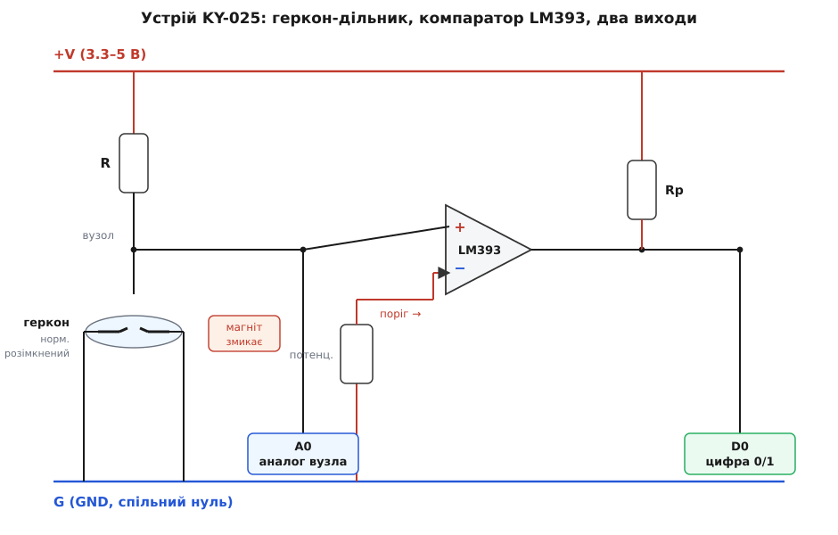
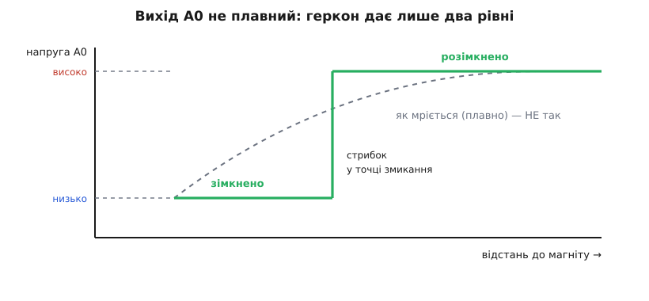
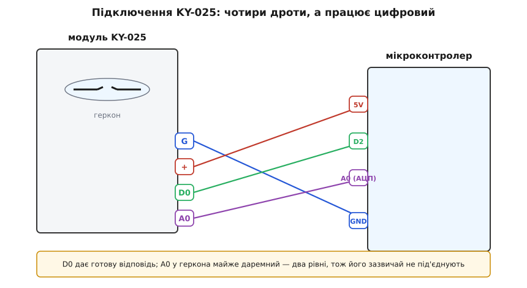

# KY-025 — геркон у скляній колбі

<preknowlist>
- [Феромагнетизм](book:physics/ferromagnetism) — деякі метали (залізо, нікель) самі стають магнітами, коли потрапляють у чуже магнітне поле, і притягуються до нього; прибрали поле — намагніченість спадає.
- [Компаратор](book:electronics/comparator) — схема, що каже «більше чи менше за поріг» одним цифровим бітом; так плавну напругу перетворюють на чисте 0/1.
- [Вихід з відкритим колектором](book:electronics/open-collector-output) — вихід, який уміє лише «притягнути до нуля» або «відпустити»; щоб на ньому з'явився високий рівень, потрібна зовнішня підтяжка до плюса.
- [Підтяжки](book:electronics/floating-pullups) — резистор, що задає лінії спокійний рівень, коли її ніхто активно не тримає.
- [АЦП](book:electronics/adc) — вузол мікроконтролера, що міряє напругу на нозі й повертає число; саме ним читають «аналогові» виводи.
- [Брязкіт контактів](book:electronics/contact-debounce) — механічний контакт, змикаючись, кілька мілісекунд «деренчить», даючи чергу хибних перемикань, які треба гасити.
</preknowlist>

Крихітна скляна колба завдовжки з рисове зерно, з якої в обидва боки стирчать два тонкі металеві язички, лежить на маленькій синій платі. Поряд — чорна мікросхема на вісім ніжок, синій кубик підстроювача, кілька резисторів і два світлодіоди. Знизу — чотири штирки з підписами `G`, `+`, `D0`, `A0`. Це **KY-025** — модуль-давач магнітного поля на **герконі** (від «геркон» — герметичний контакт; англ. *reed switch*, буквально «очеретяний перемикач», за схожість тонких пружних язичків на стеблинки очерету). Його робота — помітити, що поруч опинився магніт, і сказати про це мікроконтролеру одним проводом.

Це той самий давач, що стоїть у датчиках відчинених дверей і вікон охоронної сигналізації, у лічильниках обертів, у кришках, які мусять знати, відкриті вони чи закриті. Магніт клеять на рухому частину (стулку дверей), геркон — на нерухому раму: зійшлися впритул — контакт замкнувся, роз'їхалися — розімкнувся. Ніякого живлення сам геркон не потребує й нічого не зношує тертям, бо всередині немає нічого, крім двох язичків у запаяній колбі.

## Що всередині колби: магніт замикає контакт без дотику

Уся суть давача — в одній деталі завбільшки з сірникову голівку, і варто зрозуміти її фізику, бо з неї випливає геть усе інше, зокрема головна дивина цього модуля.

Усередині скляної колби — два плоскі язички (англ. *reeds*, «очеретинки») із **м'якого магнітного сплаву** (зазвичай залізо-нікелевого, пермалою). Вони заходять із двох кінців назустріч і **ледь-ледь не торкаються**: між їхніми плоскими кінчиками лишається зазор у частки міліметра. Колба запаяна, а всередині — інертний газ (часто азот), щоб контакти не окислювалися й не іскрили в повітрі. У спокої язички розведені — коло **розімкнене**.

Тепер піднесіть магніт. Його поле пронизує обидва язички, і тут вмикається [феромагнетизм](book:physics/ferromagnetism): м'який метал у чужому полі **сам стає тимчасовим магнітом**. Кінчик одного язичка намагнічується як північний полюс, кінчик другого — як південний. А різнойменні полюси притягуються. Язички — тонкі й пружні, тож ця сила згинає їх назустріч, поки кінчики не **стукнуться**. Коло замкнулося — без жодного дотику магніта до давача, крізь скло, через повітря чи стінку.


*Устрій модуля KY-025 у вигляді схеми. Геркон разом із верхнім резистором R утворює дільник: поки контакт розімкнений, підтяжка тримає вузол угорі; магніт змикає контакт — вузол падає майже до нуля. Напругу вузла модуль виводить сирою на A0 і водночас подає на «плюс» компаратора LM393. «Мінус» компаратора тримає рівень із потенціометра — це поріг. Вихід компаратора (відкритий колектор) через підтяжку Rp дає чистий цифровий сигнал D0.*

Прибрали магніт — поле зникло, язички **розмагнітилися** (бо метал м'який і намагніченості не тримає), і власна пружність розвела їх назад. Коло знову розімкнене. Оце і весь геркон: магніт поруч — замкнено, магніта немає — розімкнено. Він не міряє силу поля й не каже, наскільки близько магніт, — він просто **клацає** між двома станами, коли поле переступає поріг спрацювання.

Сам геркон куди старіший за модуль: практичний запаяний контакт у скляній колбі народився в лабораторіях Bell у 1936 році для телефонних станцій, а до нього тягнеться ще давніша й не така однозначна історія ідеї — [коротко про це](book:sensors/ky-025-reed/hist-reed-switch.md).

> 🔧 **Навіщо це.** Безконтактність — те, за що геркон люблять там, де звичайна кнопка не виживе. Магніт можна сховати всередину пластикової чи скляної деталі, залити компаундом, поставити за герметичною стінкою — а геркон крізь неї все одно «побачить» його поле. Тому герконом роблять давачі рівня рідини (поплавець із магнітом), лічильники води й газу, кінцевики в брудному чи вологому середовищі, де відкритий контакт швидко б окислився. Немає механічного натискання — немає що зношувати; якісний геркон витримує сотні мільйонів спрацювань.

Одна тонкість, про яку варто знати заздалегідь: геркон **деренчить**. Коли язички стукаються, вони не злипаються намертво, а кілька разів відскакують, як монетка на столі, — за одну-дві мілісекунди коло встигає замкнутися й розімкнутися кілька разів. Це [брязкіт контактів](book:electronics/contact-debounce), звичайна властивість будь-якого механічного перемикача. Для ока непомітно, а от швидкий мікроконтролер порахує цю чергу як кілька окремих спрацювань, якщо його не навчити чекати, поки контакт заспокоїться.

## Хитрість плати: чому «аналоговий» вихід тут майже фальшивий

KY-025 належить до великої **серії KY** — десятків дешевих давачів-модулів у спільному стилі, зібраних довкола однієї копійчаної мікросхеми-компаратора й одного підстроювача. Спільне для всієї серії — саму архітектуру «сенсор + LM393 + потенціометр + чотири піни `G / + / D0 / A0`» — винесено в [огляд серії KY](book:sensors/ky-series). Тут важливо тільки те, що ця однакова обв'язка створює для геркона кумедну невідповідність.

Плата зроблена так, ніби на ній стоїть **плавний аналоговий давач** — як фоторезистор чи термістор, у яких опір змінюється поступово. Сенсор увімкнено в **дільник напруги** з підтяжним резистором: напруга на середньому вузлі виводиться просто на пін `A0`, а заразом іде на «плюс» компаратора LM393, який порівнює її з порогом на «мінусі» й видає цифру на `D0`. Для фоторезистора це чудово: `A0` дає плавну напругу «наскільки темно», а `D0` — «темніше за поріг чи ні».

Але геркон — **не плавний**. Він або розімкнений, або замкнений; проміжного стану немає. Тому напруга на його вузлі теж не плавна — вона **стрибає між двома значеннями**: коли контакт розімкнений, підтяжка тримає вузол угорі (близько напруги живлення); коли магніт замкнув контакт, вузол провалюється майже до нуля. Жодного «трохи», жодної залежності від того, наскільки сильний магніт чи як близько він, — тільки верх або низ.


*Чого чекають від піна A0 і що він дає насправді. Плавна крива — як «аналог» поводився б, якби відстань до магніта плавно міняла напругу: цього в геркона немає. Реальний A0 (суцільна лінія) тримає один рівень, поки контакт замкнений, інший — поки розімкнений, і стрибком перескакує між ними в момент клацання. Двох рівнів достатньо, тож окремий аналоговий пін тут нічого не додає до звичайної цифри.*

Звідси практичний висновок: **на KY-025 пін `A0` майже даремний**. Він дає не «силу поля», а те саме «є магніт / немає магніту», що й `D0`, тільки сирим стрибком напруги замість чистої логіки. Читати геркон через АЦП немає сенсу — це зайва робота заради тієї самої однобітної відповіді. Модуль тягне цей пін за собою лише тому, що плата уніфікована під усю серію KY, де в інших давачів аналоговий вихід справді корисний. Аналогія «як інші KY-модулі» тут ламається саме об фізику геркона: сенсор двійковий, тож і аналог вироджується у дві сходинки.

> 🔧 **Навіщо це.** Знати про це варто, щоб не витрачати ногу АЦП мікроконтролера й час на те, що нічого не дасть. Практично з KY-025 працюють через **`D0`** — готовий цифровий сигнал, який заходить прямо в цифровий вивід. Виняток буває один: якщо потенціометр збили так, що поріг ліг поза двома рівнями геркона, `D0` «залипне» в одному стані. Тоді сирий `A0`, поміряний АЦП, допомагає **налагодити** — побачити обидва рівні на очі й виставити поріг між ними. Але для самої роботи давача `A0` не потрібен.

## LM393 і потенціометр: звідки береться чиста цифра

Роль чорної восьминіжки — **LM393**, здвоєного [компаратора](book:electronics/comparator) (використано одну його половину). Компаратор — це схема з двома входами, яка порівнює дві напруги й на виході дає лише «більше» або «менше». На «плюс» приходить напруга з вузла геркона, на «мінус» — опорна напруга з движка потенціометра. Поки магніта немає, вузол угорі, «плюс» вищий за поріг — вихід в одному стані; магніт замкнув геркон, вузол упав нижче порога — вихід перекидається. Так деренчливий, «брудний» стрибок напруги на дільнику перетворюється на різкий і чистий логічний перехід.

**Потенціометр** (синій кубик, зазвичай багатооборотний 3296) задає ту саму опорну напругу — **поріг**. Тут криється часта помилка новачка: цим гвинтиком **не регулюється відстань спрацювання**. Дальність, з якої геркон почує магніт, задає фізика — сила магніта й чутливість самого геркона, а не електроніка. Потенціометр лише вирішує, **на якому рівні напруги** компаратор вважатиме, що «магніт є». Оскільки геркон дає всього два рівні, завдання підстроювача одне: поставити поріг **між** ними. Виставите поріг вище верхнього рівня — `D0` завжди «немає магніту»; нижче нижнього — `D0` завжди «є магніт». Правильно — десь посередині, і тоді на самому давачі є широкий запас, щоб `D0` надійно клацав.

Вихід LM393 — **з відкритим колектором** ([що це](book:electronics/open-collector-output)). Такий вихід уміє тільки одне: активно **притягнути лінію до нуля**, а «відпустивши» її — залишити висіти. Щоб на `D0` з'являвся високий рівень, коли вихід відпущено, на платі стоїть **підтяжний резистор** до плюса живлення (`Rp` на схемі). Тому `D0` дає повноцінні рівні `0` і `1` без жодної зовнішньої обв'язки — про підтяжку вже подбали. Знати про відкритий колектор корисно з іншої причини: кілька таких виходів можна безпечно з'єднати на один провід («монтажне АБО») — якщо хоч один давач притягне лінію до нуля, на ній буде нуль. Це зручно, коли треба, щоб спрацювання будь-якого з кількох герконів давало один спільний сигнал тривоги.

Два **світлодіоди** на платі — суто для ока: один світиться, поки подано живлення, другий загоряється, коли `D0` активний (магніт поруч). Вони нічого не додають до сигналу, лише дають поглядом перевірити, що модуль живий і реагує, — зручно на етапі складання.

> 🔧 **Навіщо це.** Поділ праці «геркон клацає — LM393 очищає» — саме те, що робить модуль зручним. Голий геркон дав би вам деренчливий контакт, який ще треба підтягувати й фільтрувати; KY-025 віддає готову цифру, яку `digitalRead` читає без роздумів. А один гвинтик порога рятує, коли магніт слабкий або стоїть далеко: підкрутивши поріг ближче до «розімкненого» рівня, можна змусити давач надійно спрацьовувати навіть на межі чутливості — або, навпаки, загрубити його, щоб не реагував на випадкові слабкі поля.

## Піни й підключення

У KY-025 чотири виводи, підписані просто на платі:

- **G** — спільний нуль (GND, мінус живлення).
- **+** — живлення, від **3.3 до 5 вольтів** (працює і з 3.3-вольтовими, і з 5-вольтовими платами).
- **D0** — цифровий вихід: активний, коли магніт замкнув геркон і напруга перейшла поріг.
- **A0** — сирий аналоговий вихід із вузла дільника (для геркона, як з'ясувалося, майже без користі).


*Підключення KY-025 до мікроконтролера. Робочих проводів три: G на спільний нуль, + на живлення (5 В або 3.3 В), D0 у будь-який цифровий вивід. Пін A0 можна завести на вхід АЦП, але для геркона він дає лише два рівні, тож здебільшого його лишають непід'єднаним. Живлення однакове для 3.3-В і 5-В логіки, окремих узгоджень рівнів не треба.*

Читати давач у прошивці — найпростіше, що буває: налаштувати ногу на вхід і питати її рівень. Слово застороги про полярність: у різних клонів KY-025 активний рівень `D0` буває **інвертований** — на одних платах магніт дає на `D0` високий рівень, на інших низький. Найнадійніше не вгадувати, а перевірити один раз піднесенням магніта й дивитися, куди хитнувся `D0` (або на світлодіод спрацювання).

**Умова.** `D0` під'єднано до виводу D2 Arduino; вбудований світлодіод — на D13. Треба засвічувати світлодіод, коли поруч магніт, і друкувати перехід у монітор порту. Приймемо, що на нашій платі магніт дає на `D0` **низький** рівень (частий випадок для виходу компаратора).

:::tabs
```cpp
const uint8_t REED = 2;    // D0 давача
const uint8_t LED  = 13;   // вбудований світлодіод

bool wasNear = false;      // попередній стан, щоб ловити саме перехід

void setup() {
    pinMode(REED, INPUT);  // на платі вже є підтяжка Rp — зовнішня не потрібна
    pinMode(LED, OUTPUT);
    Serial.begin(9600);
}

void loop() {
    // магніт дає низький рівень → інвертуємо, щоб near=true означало «магніт поруч»
    bool near = (digitalRead(REED) == LOW);

    digitalWrite(LED, near ? HIGH : LOW);

    if (near && !wasNear) Serial.println("магніт піднесено");
    if (!near && wasNear) Serial.println("магніт прибрано");
    wasNear = near;

    delay(20);            // грубе згладжування деренчання контакту
}
```
```micropython
from machine import Pin
import time

reed = Pin(2, Pin.IN)      # D0 давача; на платі вже є підтяжка Rp
led  = Pin(13, Pin.OUT)    # вбудований світлодіод

was_near = False           # попередній стан, щоб ловити саме перехід

while True:
    # магніт дає низький рівень → інвертуємо, щоб near=True означало «магніт поруч»
    near = (reed.value() == 0)

    led.value(1 if near else 0)

    if near and not was_near:
        print("магніт піднесено")
    if not near and was_near:
        print("магніт прибрано")
    was_near = near

    time.sleep_ms(20)      # грубе згладжування деренчання контакту
```
:::

Ніякої бібліотеки й ніякого протоколу тут немає: `digitalRead` повертає готову відповідь, бо всю роботу з очищення сигналу вже зробив LM393 на платі. Затримка в 20 мілісекунд — найгрубіший спосіб не помітити деренчання геркона: за цей час контакт устигає заспокоїтися. Це годиться, коли давач лише вмикає світло. Але щойно з нього треба **рахувати** швидкі спрацювання (лічильник обертів, лічильник відвідувачів на дверях) або реагувати вмить за перериванням, простого `delay` замало — потрібне справжнє гасіння брязкоту й, можливо, апаратне переривання на нозі.

Робочі прийоми для KY-025 — надійне гасіння деренчання, підрахунок імпульсів, реакція за перериванням, готова схема «давач дверей» із лічильником відкривань — зібрано в [окремому проєкті-вставці](book:sensors/ky-025-reed/proj-reed-firmware.md) з коментованими скетчами під Arduino та ESP32.

## Як упізнати й чого стерегтися

KY-025 упізнається за скляною колбою геркона (2 на 14 міліметрів, лежить горизонтально на платі), поряд — восьминіжка LM393, синій підстроювач і два світлодіоди; чотири штирки з підписами `G`, `+`, `D0`, `A0`. Синя (рідше червона) видовжена плата приблизно 36 на 15 міліметрів. Найближчий родич у тій-таки серії — **KY-021**, менший герконовий модуль **без компаратора**: у нього тільки геркон із підтяжкою й один цифровий вихід, без потенціометра й без `A0`. Якщо поріг настроювати не треба, KY-021 робить те саме простіше.

На чому спотикаються найчастіше:

- **`D0` не реагує на магніт.** Найчастіше збитий **поріг**: потенціометр закручено так, що опорна напруга лягла поза двома рівнями геркона. Покрутіть підстроювач, підносячи магніт, поки `D0` (і світлодіод спрацювання) не почне чітко клацати; орієнтир — приблизно середнє положення.
- **`D0` завжди активний або завжди мовчить, хоч магнітом водиш.** Те саме — поріг застряг вище верхнього чи нижче нижнього рівня. Лікується тим самим гвинтиком.
- **Логіка «перевернута»: магніт є, а код думає, що немає.** У клонів `D0` буває інвертований. Перевірте активний рівень магнітом і підправте порівняння в коді (`== LOW` замість `== HIGH` чи навпаки).
- **Одне піднесення магніта рахується як кілька.** Це **деренчання** геркона: язички відскакують. Для простого ввімкнення досить короткої затримки; для лічильника — гасіть брязкіт за часом або читайте вхід за перериванням із фільтром.
- **Мало не спрацьовує здалеку.** Дальність задає **магніт**, не електроніка. Слабкий магніт геркон почує лише впритул; для більшої відстані потрібен сильніший магніт (неодимовий) або правильна орієнтація — геркон найкраще реагує на поле **вздовж** своєї осі, тож підносьте магніт полюсом уздовж колби, а не впоперек.
- **Марно намагаєтесь виміряти `A0` силу поля.** Не вийде: геркон двійковий, `A0` дає лише два рівні. Для плавного вимірювання магнітного поля потрібен інший принцип — давач на [ефекті Холла](book:physics/hall-effect), який дає напругу, пропорційну полю.

Головне про KY-025 тримається на одному реченні: це геркон, який магніт замикає крізь повітря без дотику, а копійчана обв'язка на платі перетворює його клацання на чистий цифровий біт `D0` — і саме цим бітом, а не «аналоговим» `A0`, із ним і працюють.
