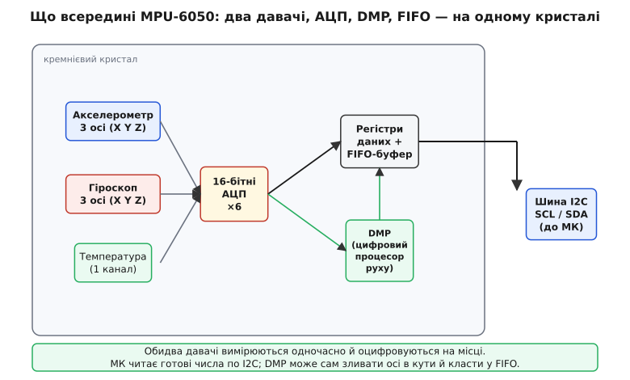
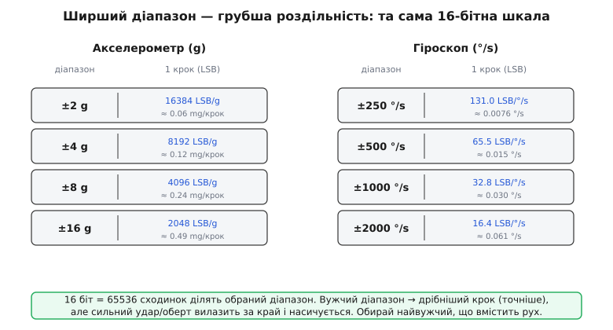
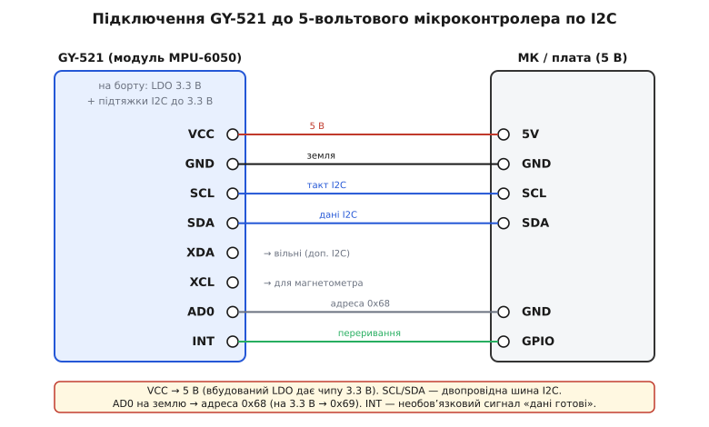

# GY-521 / MPU-6050 — 6-осьовий IMU (акселерометр+гіроскоп)

<preknowlist>
- [MEMS](topic:electronics/mems) — мікромеханіка на кремнії: рухома маса й ємнісний давач в одному чипі. З цього зроблено і акселерометр, і гіроскоп MPU-6050.
- [Власне прискорення](topic:physics/proper-acceleration) — що міряє акселерометр: не рух, а силу опори; тому в спокої по вертикалі він показує 1g, а у вільному падінні — нуль.
- [Шина I2C](topic:electronics/i2c) — двопровідний протокол (SCL+SDA) з адресами; MPU-6050 віддає дані саме так, і без нього модуль не прочитати.
- [Кутова швидкість](topic:physics/angular-velocity) — швидкість обертання (°/s), яку міряє гіроскоп; її інтеграл по часу дає кут повороту.
</preknowlist>

Візьміть у руку модуль GY-521 — маленьку синю платку розміром десь із поштову марку, з рядком контактів по одному краю: **VCC, GND, SCL, SDA, XDA, XCL, AD0, INT**. У центрі — чорна мікросхема 4×4 мм. Це **MPU-6050** від InvenSense, і всередині неї живуть **два різні прилади руху одразу**: тривісний акселерометр (лат. *accelero* — прискорювати) і тривісний гіроскоп (гр. *gýros* — коло + *skopéō* — спостерігаю). Разом вони дають **шість осей** — три прискорення й три швидкості обертання, — тому такий чип називають **6-осьовим IMU** (Inertial Measurement Unit, інерційний вимірювальний блок).

Навіщо два давачі, а не один? Бо кожен окремо каже правду лише наполовину, і вони закривають слабкі місця один одного. Саме ця пара — серце того, як телефон розуміє, куди він нахилений, як дрон утримує горизонт, а гіроборд не падає. Розберімося, що саме бачить кожен і чому їх мусить бути двоє.

## Два давачі, дві половини правди

**Акселерометр** міряє **прискорення** — точніше, ту силу, з якою щось утримує його масу від вільного падіння (це і є [власне прискорення](topic:physics/proper-acceleration)). Наслідок дивний, але ключовий: нерухома на столі плата показує **не нуль, а 1g угору** — бо стіл штовхає її вгору, не даючи впасти. Оце й робить акселерометр давачем **нахилу**: земне тяжіння — сталий вектор 1g униз, і, нахиливши плату, ви змінюєте, **як цей вектор розкладається** на три осі. З розкладу відновлюють кут — у повній статиці, без жодного руху.

Але в акселерометра є слабина: він реагує **на будь-яку силу**, не лише на тяжіння. Струснули плату, дрон смикнувся, машина загальмувала — і до «постійного 1g униз» домішується прискорення руху. Миттєвий нахил стає неправдивим: давач не відрізняє «нахилило» від «штовхнуло». Плюс сам сигнал помітно **шумить** — дрібно тремтить.

**Гіроскоп** міряє геть інше — **кутову швидкість** (°/s), тобто **як швидко плата обертається** навколо кожної з осей. Він нечутливий до тяжіння й до поштовхів: його не обманути прискоренням руху. Хочете знати кут повороту — **проінтегруйте** швидкість по часу: покрутили 100 °/s протягом 0.5 с — повернулися на 50°.

> 🔧 **Навіщо їх двоє.** Акселерометр знає **абсолютний** напрям «де низ» (бо бачить тяжіння), але бреше під час руху й шумить. Гіроскоп дає **гладку, чисту** швидкість обертання, байдужу до поштовхів, але не знає абсолютного нуля — і його інтеграл **повільно спливає** (drift): крихітна стала похибка, накопичуючись, за хвилини перетворює кут на нісенітницю. Тож їх **зливають**: гіроскоп веде кут коротко й гладко, акселерометр раз у раз підправляє його до справжнього «низу». Ця злука ([сенсорне злиття](topic:communications/sensor-fusion)) — уся суть 6-осьового IMU. Один давач такого не вміє; тому їх і поставили два.

## Що всередині чипа

Обидва давачі зроблені однією [мікромеханікою на кремнії](topic:electronics/mems). Акселерометр — це рухома маса на кремнієвих пружинах між нерухомими пластинами: прискорення зсуває масу, змінюючи ємності, а їхню різницю чип обертає на число. Гіроскоп — теж рухома маса, але її **навмисно тримають у вібрації**; коли плата обертається, на вібрувальну масу діє **сила Коріоліса** (за іменем французького механіка Ґаспара-Ґюстава де Коріоліса, який описав її 1835 року), збиваючи масу вбік перпендикулярно до коливання. Цей боковий зсув пропорційний швидкості обертання — його й вимірюють. Три такі структури під трьома напрямками дають три осі кожного давача.


*Обидва давачі вимірюються одночасно й оцифровуються прямо на кристалі. Мікроконтролер читає готові числа по I2C; вбудований DMP здатен сам звести осі в кути й скласти результат у буфер FIFO.*

Головне тут — **усе цифрове й на місці**. На відміну від аналогового [ADXL335](topic:sensors/adxl335), який віддає сирі напруги і потребує зовнішнього АЦП, MPU-6050 має **шість вбудованих 16-бітних АЦП** (по одному на вісь) і віддає вже **числа по шині I2C**. Це велика зручність: жодного аналогового шуму на дротах, будь-яка плата з двома вільними ногами (SCL, SDA) читає рух без окремих АЦП-входів.

І ще одна річ на кристалі — **DMP** (Digital Motion Processor, цифровий процесор руху): маленький співпроцесор, що вміє **сам** зливати акселерометр із гіроскопом у готові кути орієнтації й складати їх у буфер [FIFO](topic:programming/fifo-buffer), не турбуючи головний мікроконтролер. Саме ця здатність свого часу зробила чип знаменитим.

## Вихід: 16-бітні числа й повна шкала

Кожна вісь віддає **16-бітне ціле зі знаком** — від −32768 до +32767. Скільки реального прискорення чи обертання припадає на одну одиницю цього числа (LSB, least significant bit — молодший біт), залежить від обраної **повної шкали** (full-scale range). Її задають регістром — і тут криється компроміс, який треба зрозуміти раз і назавжди.


*Ті самі 65536 сходинок 16-бітної шкали ділять обраний діапазон. Вужчий діапазон дає дрібніший крок (точніше), але сильніший рух вилазить за край і насичується.*

Логіка проста: 16 біт — це завжди 65536 сходинок. Розтягнете їх на ±16g — кожна сходинка коштує грубих ≈0.49 mg; стиснете на ±2g — та сама сходинка стане дрібною ≈0.06 mg, вимірювання **у 8 разів точніше**. Але за точність платять **стелею**: на ±2g будь-яке прискорення понад 2g **насичує** давач — число впирається в 32767 і більше не росте. Тому правило: **обирай найвужчий діапазон, що ще вміщує твій рух**. Нахил і спокійні жести — ±2g і ±250 °/s (найточніше). Дрон, що робить перевороти, чи удари — ширші діапазони.

Переведення сире-число → фізична величина — просто ділення на чутливість. Для типових діапазонів **±2g** і **±250 °/s**:

```
чутливість акселерометра:  16384 LSB/g
чутливість гіроскопа:      131 LSB/(°/s)

a[g]    = raw_accel / 16384
ω[°/s]  = raw_gyro  / 131
```

**Приклад: плата лежить рівно, віссю Z угору. Що прочитаємо?**

```c
// У спокої тяжіння тисне на масу так, ніби по Z діє +1g угору,
// а по X та Y проєкція тяжіння нульова. Отже сирі числа:
//   raw_z ≈ 16384   →  16384 / 16384 = 1.00 g
//   raw_x ≈ 0        →  0     / 16384 = 0.00 g
//   raw_y ≈ 0        →  0     / 16384 = 0.00 g
// Гіроскоп у спокої не обертається:
//   gyro_x = gyro_y = gyro_z ≈ 0  →  0 / 131 = 0 °/s
```

Перевернемо плату Z-віссю вниз — raw_z стане ≈ −16384, тобто −1g. Отак за трьома числами акселерометра відновлюють, куди спрямований «низ», а отже — нахил.

Є ще **сьомий канал** — вбудований давач температури кристала (потрібен передусім самому чипу, щоб компенсувати температурний дрейф гіроскопа). Його переводять окремою формулою з даташита:

```
T[°C] = raw_temp / 340 + 36.53
```

Число «36.53» тут не випадкове — це калібрувальна стала конкретно цього сімейства; не сприймайте цей канал як точний термометр кімнати (він міряє сам кристал, який трохи теплий від роботи).

## Модуль GY-521: що навколо чипа

Голий MPU-6050 живиться лише **2.375…3.46 В** і має корпус із контактами по 0.4 мм — до Arduino його руками не підключити. Модуль **GY-521** робить чип придатним для макетної плати. GY-521 належить до великої [GY-серії брейкаут-модулів](topic:sensors/gy-series) — дешевих китайських плат, що виводять по одному цифровому давачу на зручні контакти 2.54 мм; звідти в нього і типова обв'язка, і 5-вольтова толерантність. Специфіка саме цієї плати:

- **LDO-стабілізатор 3.3 В** (зазвичай XC6206/«662K») — приймає 5 В із VCC і робить чипу чисті 3.3 В. Тому модуль **толерантний до 5 В** на живленні, хоч сам давач працює від 3.3 В.
- **Підтяжки I2C** — на лініях SCL та SDA стоять резистори, підтягнуті до 3.3 В (часто 4.7 кОм, іноді занизькі 2.2 кОм). Шина I2C — з відкритим стоком, тож ці підтяжки задають високий рівень; вбудовані означають, що зовнішніх зазвичай **не треба**.
- **Вісім контактів** із підписами на шовкографії.

Що означає кожен пін:

| Пін | Призначення |
|-----|-------------|
| **VCC** | Живлення 3.3–5 В (через вбудований LDO) |
| **GND** | Спільна земля |
| **SCL** | Такт шини I2C |
| **SDA** | Дані шини I2C |
| **XDA** | Допоміжна шина I2C (провідник, ведений чипом) — зазвичай вільний |
| **XCL** | Допоміжна шина I2C, такт — зазвичай вільний |
| **AD0** | Вибір адреси: на землі → **0x68**, на 3.3 В → **0x69** |
| **INT** | Вихід переривання «дані готові» — необов'язковий |

Два піни варті окремого слова. **AD0** керує молодшим бітом [I2C-адреси](topic:electronics/i2c): за замовчуванням (підтягнутий до землі на платі) адреса — **0x68**, а піднявши AD0 до живлення, ви робите її **0x69**. Це дозволяє повісити **два MPU-6050 на одну шину** — з різними адресами. **XDA/XCL** — це **окрема, допоміжна** шина I2C: до неї чип може під'єднати ще один давач (класично — зовнішній магнетометр), а сам виступити посередником. У модулі GY-91 так додають компас, роблячи з 6 осей дев'ять; у звичайному GY-521 ці два піни лишають вільними.

## Підключення до мікроконтролера

Схема мінімальна, бо все спілкування — по двопровідній шині I2C: потрібні лише **чотири** дроти (живлення, земля, SCL, SDA), плюс за бажання INT.


*VCC живиться 5 В — вбудований LDO дає чипу 3.3 В. SCL і SDA заходять на апаратну шину I2C мікроконтролера. AD0 на землі фіксує адресу 0x68; INT — необов'язковий сигнал «нові дані готові».*

- **VCC → 5 В** (або 3.3 В). Обидва працюють завдяки LDO.
- **GND → GND.** Спільна земля обов'язкова — від неї відлічуються рівні шини.
- **SCL → SCL, SDA → SDA** мікроконтролера (на Arduino Uno це A5 і A4).
- **AD0 → GND** для адреси 0x68 (або лишити — на багатьох платах він уже підтягнутий до землі).
- **INT → будь-який GPIO** — лише якщо хочете, щоб чип сам сигналив про готові дані замість постійного опитування.

> 🔧 **Пастка «5 В на шині I2C».** MPU-6050 живиться від 3.3 В, і його підтяжки I2C йдуть теж до 3.3 В. Оскільки I2C — з відкритим стоком, лінії ніколи не піднімаються вище 3.3 В самі, тож 5-вольтовий мікроконтролер зазвичай читає їх без перетворювача рівнів. Але **не додавайте своїх зовнішніх підтяжок до 5 В** на цю шину — вони підтягнуть SCL/SDA вище за 3.3 В і **можуть пошкодити** чип. Якщо кілька I2C-пристроїв на одній шині вже мають підтяжки, зайві теж прибирають, інакше сумарний опір стане замалим.

## Читаємо в коді

Порядок роботи з MPU-6050 завжди однаковий: **розбудити** (при вмиканні чип у режимі сну), налаштувати діапазони, тоді читати пакет із 14 байтів (accel×3, temp, gyro×3), що лежать поспіль у регістрах від 0x3B. Ось голий мінімум через стандартну I2C-бібліотеку Arduino (`Wire`), без сторонніх залежностей — щоб видно було саму механіку:

:::tabs
```cpp
#include <Wire.h>

const uint8_t ADDR    = 0x68;   // AD0 на землі
const uint8_t PWR_MGMT_1 = 0x6B;
const uint8_t ACCEL_XOUT = 0x3B;

void writeReg(uint8_t reg, uint8_t val) {
    Wire.beginTransmission(ADDR);
    Wire.write(reg);
    Wire.write(val);
    Wire.endTransmission();
}

// Зчитати одне 16-бітне значення: спершу старший байт, тоді молодший.
int16_t read16() {
    uint8_t hi = Wire.read();
    uint8_t lo = Wire.read();
    return (int16_t)((hi << 8) | lo);
}

void setup() {
    Serial.begin(115200);
    Wire.begin();
    // Розбудити: скинути біт SLEEP у PWR_MGMT_1 (0 = працювати).
    // При старті чип спить — без цього рядка даних не буде.
    writeReg(PWR_MGMT_1, 0x00);
    delay(100);
}

void loop() {
    // Один пакет: 14 байтів поспіль від ACCEL_XOUT_H.
    Wire.beginTransmission(ADDR);
    Wire.write(ACCEL_XOUT);
    Wire.endTransmission(false);          // repeated start, не відпускаємо шину
    Wire.requestFrom(ADDR, (uint8_t)14);

    // Кожна вісь — два байти, СТАРШИЙ приходить першим (big-endian).
    // Читаємо їх окремими рядками: порядок двох Wire.read() в одному
    // виразі C не гарантує — інакше байти можуть мовчки помінятись місцями.
    int16_t ax = read16();
    int16_t ay = read16();
    int16_t az = read16();
    int16_t t  = read16();    // температура
    int16_t gx = read16();
    int16_t gy = read16();
    int16_t gz = read16();

    // Сире число → фізична величина (діапазони за замовчуванням ±2g, ±250°/s)
    float accX = ax / 16384.0f;           // g
    float gyrX = gx / 131.0f;             // °/s

    Serial.print(accX); Serial.print('\t');
    Serial.println(gyrX);
    delay(50);
}
```
```micropython
from machine import I2C, Pin
import struct
import time

ADDR = 0x68          # AD0 на землі
PWR_MGMT_1 = 0x6B
ACCEL_XOUT = 0x3B

i2c = I2C(0, scl=Pin(22), sda=Pin(21))

def write_reg(reg, val):
    i2c.writeto_mem(ADDR, reg, bytes([val]))

# Розбудити: скинути біт SLEEP у PWR_MGMT_1 (0 = працювати).
# При старті чип спить — без цього рядка даних не буде.
write_reg(PWR_MGMT_1, 0x00)
time.sleep_ms(100)

while True:
    # Один пакет: 14 байтів поспіль від ACCEL_XOUT_H.
    # Драйвер сам робить repeated start між адресою регістра й читанням.
    raw = i2c.readfrom_mem(ADDR, ACCEL_XOUT, 14)

    # Кожна вісь — два байти, СТАРШИЙ приходить першим (big-endian).
    # struct '>' розбирає big-endian, 'h' — 16-бітне ціле зі знаком.
    ax, ay, az, t, gx, gy, gz = struct.unpack('>hhhhhhh', raw)

    # Сире число → фізична величина (діапазони за замовчуванням ±2g, ±250°/s)
    acc_x = ax / 16384.0          # g
    gyr_x = gx / 131.0            # °/s

    print(acc_x, gyr_x, sep='\t')
    time.sleep_ms(50)
```
:::

Два місця тут — типові граблі новачків. Перше: **байти йдуть старшим уперед** (big-endian), тож у `read16()` збираємо число як `(hi << 8) | lo`, причому обидва байти читаємо **окремими рядками** — порядок двох `Wire.read()` в одному виразі C не визначений, і компілятор має право поміняти їх місцями. Друге: `endTransmission(false)` робить **повторний старт** (repeated start) — не відпускає шину між «скажи, з якого регістра» і «дай дані», інакше деякі чипи скидають лічильник і повертають сміття.

Робочі приклади наступного рівня — переведення в кути нахилу, усунення дрейфу, калібрування нуля гіроскопа, робота через популярну бібліотеку та DMP — винесені в [proj-вставку](topic:sensors/mpu6050/proj-mpu6050.md): там і драйвер на `MPU6050` (бібліотека Джеффа Роуберґа), і читання кутів із DMP через FIFO, і комплементарний фільтр, і типові пастки WHO_AM_I.

## DMP і чому «WHO_AM_I = 0x68»

Два практичні моменти, повз які не пройти.

**Перевірка присутності.** Регістр **0x75 (WHO_AM_I)** завжди віддає **0x68** — незмінний «підпис» чипа (цікаво, що це число збігається з адресою за замовчуванням, але то різні речі: одне — адреса на шині, друге — вміст регістра-ідентифікатора). Перше, що робить кожен драйвер, — читає WHO_AM_I і звіряє з 0x68: збіглося — чип на місці й відповідає. Якщо ж приходить **0x98, 0x72 чи 0x00** — вам майже напевно трапилася **підробка** (ринок GY-521 наводнений клонами з іншим кристалом усередині) або погана пайка; такий модуль може працювати частково або зовсім не так.

**DMP** (Digital Motion Processor). Це та сама «магія», через яку MPU-6050 свого часу став знаменитим: вбудований співпроцесор, що **сам** зливає акселерометр із гіроскопом і віддає готову орієнтацію — кватерніон або кути, — не завантажуючи головний мікроконтролер обчисленнями. Ви заливаєте в чип невеликий бінарний образ (firmware DMP), налаштовуєте частоту, і далі просто читаєте готові кути з FIFO. Плата за це — складніше налаштування й закрита «магія» всередині; тому багато хто робить злиття **сам** на мікроконтролері (комплементарним фільтром чи фільтром Калмана), маючи повний контроль. Обидва шляхи розібрані у proj-вставці.

> 🔧 **Родовід «магії руху».** MPU-6050 не випадково опинився в мільйонах пристроїв. Його виробник, InvenSense, зробив собі ім'я саме на MEMS-гіроскопах: їхній чип крутив **контролер Nintendo Wii MotionPlus** (2009), і кілька років Nintendo давала компанії більшість виторгу. Об'єднавши гіроскоп з акселерометром і DMP на одному дешевому кристалі, InvenSense відкрила еру доступного вимірювання орієнтації — саме звідси MPU-6050 розійшовся по дронах, гіробордах і саморобках. (Історію злуки цих технологій — [окремою вставкою](topic:sensors/mpu6050/hist-invensense.md).)

## Межі й характер приладу

- **Дрейф гіроскопа неминучий.** Сам по собі гіроскоп для утримання кута надовго **непридатний** — його інтеграл спливає. MPU-6050 має сенс лише в **парі** осей: гіроскоп + акселерометр, злиті фільтром. Проста заміна одного акселерометра — це [ADXL335](topic:sensors/adxl335); повна орієнтація потребує обох давачів цього чипа.
- **Немає магнітного компаса.** Шість осей знають нахил (крен, тангаж), але **не знають азимут** (куди «на північ») — акселерометр із гіроскопом не бачать сторін світу. Для повного курсу додають [магнетометр](topic:sensors/hmc5883l); саме так роблять 9-осьові модулі на кшталт GY-91.
- **±16g / ±2000 °/s — стеля.** Ширші рухи насичують давач. Для екстремальних ударів беруть спеціальні високо-g акселерометри.
- **Витримує удар до 10 000 g** (короткий струс) — упустити плату не смертельно.
- **Живлення чипа 3.3 В**, модуля — 3.3…5 В; струм — одиниці міліампер (є режим сну для економії на батарейці).
- **Клони поширені** — завжди звіряйте WHO_AM_I і не довіряйте наосліп дешевій платі з незрозумілим кристалом.

Головний характер GY-521: **два давачі руху за ціну однієї дешевої плати, з цифровим виходом і вбудованим злиттям**. Його сила — у повноті (нахил + обертання відразу) і зручності I2C; його межа — у тому, що без злиття осей жоден із двох давачів окремо не дає надійного кута, а магнітного напрямку немає взагалі. Це найпоширеніша перша сходинка до розуміння орієнтації в просторі — і фундамент, на якому стоять дрони, стабілізатори камер і самобалансні роботи.
