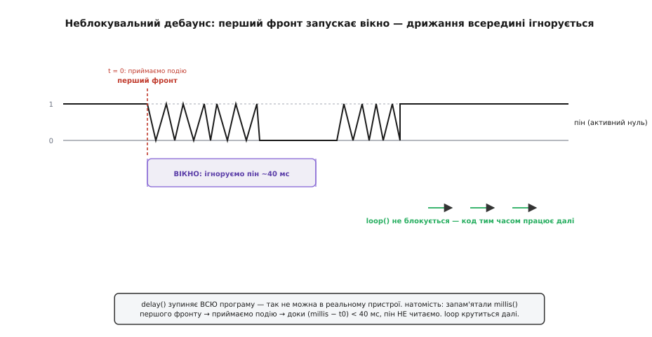
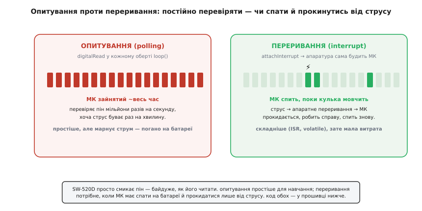

# ⚙️ proj: читаємо струс SW-520D — кнопка, дебаунс, переривання, лічильник

Уся електроніка навколо SW-520D зводиться до одного факту: це **механічна кнопка**, яку натискає сила тяжіння. Тому і код для неї — це код для кнопки, з двома ускладненнями, яких у звичайної кнопки немає в такій гострій формі: контакт **брязкотить** сильніше (кулька відскакує, а не притискається пальцем), і подія часто трапляється тоді, коли пристрій має **спати**, щоб не садити батарею. Розберемо, як прочитати цей давач правильно — від найпростішого `digitalRead` до прошивки, що спить і прокидається від поштовху, — і де на цьому шляху розкидані граблі.

Мета — не «якийсь код, що блимає світлодіодом». Мета — код, який можна поставити в реальний пристрій: будильник-від-руху, сигналізацію на коробку, лічильник поштовхів під час перевезення. Тому кожен приклад тут — справжній C/C++ під Arduino та ESP32, який компілюється й працює, а не начерк «десь так».

## Задача: перетворити рух кульки на осмислені події

Що ми маємо на вході? Один цифровий пін, який стрибає між **HIGH** і **LOW**. За [схемою підтяжки](book:sensors/sw-520d) спокій — це HIGH (підтяжка тримає пін біля живлення), а замикання кульки на землю — це LOW. Логіка **інверсна**: подія — це поява **нуля**, а не одиниці.

Що ми хочемо на виході? Це залежить від задачі, і від відповіді залежить весь код:

- **«Чи мене зараз нахилили?»** — статичне питання про поточний стан. Тут SW-520D читають як звичайну кнопку: контакт замкнений — предмет у певному положенні. Дебаунс майже не потрібен, бо стан стабільний.
- **«Мене щойно струснули?»** — питання про **подію**, миттєвий поштовх. Тут кулька дрижить, брязкіт лютує, і без дебаунсу один струс розсиплеться на сотню хибних.
- **«Скільки разів мене струснули за останні 5 секунд?»** — питання про **інтенсивність** вібрації. Треба лічити події, але кожну — один раз, попри брязкіт; і вміти сказати «трясло сильно» проти «зачепили випадково».

Три питання — три різні прошивки, хоч залізо одне. Пройдемо їх по черзі, від простого до тонкого.

## Ідея №1: читаємо як кнопку з активним нулем

Найперше, що треба вкласти в голову: **не борися з інверсною логікою — назви її прямо**. Заведи іменовану константу для «активного» рівня, і код перестане плутати.

**Умова.** SW-520D одним виводом на GND, другим — на пін 2. Вмикаємо внутрішню підтяжку, читаємо стан «нахилено/ні» й засвічуємо світлодіод плати.

:::tabs
```cpp
const uint8_t PIN_SW  = 2;         // вивід давача (другий — на GND)
const uint8_t PIN_LED = 13;        // вбудований світлодіод

const uint8_t ACTIVE = LOW;        // активний нуль: подія = LOW

void setup() {
  pinMode(PIN_SW, INPUT_PULLUP);   // спокій = HIGH, замикання кульки = LOW
  pinMode(PIN_LED, OUTPUT);
}

void loop() {
  bool tilted = (digitalRead(PIN_SW) == ACTIVE);   // читаємо «чи замкнено»
  digitalWrite(PIN_LED, tilted ? HIGH : LOW);
}
```
```micropython
from machine import Pin

PIN_SW  = 2                        # вивід давача (другий — на GND)
PIN_LED = 13                       # вбудований світлодіод

ACTIVE  = 0                        # активний нуль: подія = 0 (LOW)

sw  = Pin(PIN_SW, Pin.IN, Pin.PULL_UP)   # спокій = 1, замикання кульки = 0
led = Pin(PIN_LED, Pin.OUT)

while True:
    tilted = (sw.value() == ACTIVE)      # читаємо «чи замкнено»
    led.value(1 if tilted else 0)
```
:::

Уся хитрість тут — рядок `const uint8_t ACTIVE = LOW`. Він перетворює загадкове `digitalRead(PIN_SW) == LOW` на людське `tilted` — «чи нахилено». Тепер якщо ви колись переставите давач «золотим кінцем догори» й активним стане HIGH, ви поправите **одне** місце, а не полюватимете на розкидані по коду порівняння. Це не косметика: інверсна логіка — джерело номер один помилок із цим давачем, і єдиний захист від неї — не тримати сирі HIGH/LOW у гущі коду.

> 🔧 **Навіщо це.** Код, у якому написано `if (digitalRead(pin) == LOW)`, через тиждень читається як загадка: «низько» — це спокій чи подія? Код, у якому написано `if (tilted)`, читається сам. Іменуйте активний рівень **завжди** — це рядок, що коштує секунду, а економить вечір відлагодження, коли давач раптом «завжди спрацьовує» (бо ви переплутали полярність).

Цей приклад чесно працює для **статичного** питання — «нахилено чи ні прямо зараз». Кулька в нахиленому положенні лежить стабільно, брязкоту майже немає. Але щойно ми питаємо про **поштовх**, а не про положення, — цей код розсиплеться. Подивимось, чому, і як лікувати.

## Ідея №2: неблокувальний дебаунс за таймером

Струс — це не стабільне натискання. Кулька підстрибує біля контактів і за кілька мілісекунд встигає замкнути й розімкнути коло **десятки разів** — це [брязкіт контактів](book:programming/switch-debounce). Наївний `loop`, що читає пін мільйони разів на секунду, побачить не один поштовх, а зливу переходів 0↔1 і, якщо ми лічимо кожен, — сотню «спрацювань» з одного струсу.

Перший інстинкт — вставити `delay(50)` після події: «перечекаймо, поки заспокоїться». І для навчального блимання світлодіодом воно навіть спрацює. Але `delay()` — **отрута** для будь-якого реального пристрою, бо він **зупиняє всю програму**. Поки МК стоїть у `delay(50)`, він не читає інші давачі, не оновлює екран, не відповідає по мережі, не реагує на кнопки. Пристрій із десятком `delay` розкиданих по коду — це пристрій, що постійно «залипає».

Правильний шлях — **неблокувальний дебаунс за таймером**. Ідея проста, як годинник: замість «зупинись і чекай» ми **запам'ятовуємо момент** першого фронту (за годинником `millis()`, який рахує мілісекунди від старту) і далі просто **не зважаємо** на пін, поки не мине потрібний час. Програма тим часом крутиться далі — `loop` жодної миті не стоїть.


*Перший фронт (перехід у нуль) приймаємо як подію й запам'ятовуємо `millis()`. Доки від того моменту не мине ~40 мс, пін ігноруємо — усе дрижання кульки всередині вікна не рахується. `loop()` при цьому не блокується (на відміну від `delay`): код тим часом виконує решту роботи. На виході з однієї «зливи» брязкоту — рівно одна подія.*

Ось як це виглядає в коді. Стежимо не за рівнем, а за **зміною** рівня, і після кожної прийнятої зміни заводимо «глухий» період.

**Умова.** Той самий давач на піні 2. Треба ловити кожен поштовх **рівно один раз**, гасячи брязкіт, і при цьому не блокувати програму (у `loop` є ще й «серцебиття» — блимання, що має тривати без пауз).

:::tabs
```cpp
const uint8_t PIN_SW    = 2;
const uint8_t PIN_LED   = 13;
const uint8_t ACTIVE    = LOW;
const uint16_t DEBOUNCE = 40;      // «глухе» вікно, мс — довше за брязкіт кульки

bool     lastStable = false;       // останній ПІДТВЕРДЖЕНИЙ стан (true = замкнено)
uint32_t lastEdgeMs = 0;           // коли востаннє прийняли зміну

void setup() {
  pinMode(PIN_SW, INPUT_PULLUP);
  pinMode(PIN_LED, OUTPUT);
  Serial.begin(115200);
}

// Повертає true рівно раз — у мить, коли давач ПІДТВЕРДЖЕНО замкнувся.
bool shockDetected() {
  bool raw = (digitalRead(PIN_SW) == ACTIVE);   // сирий рівень, ще з брязкотом

  // якщо стан не змінився — нічого не робимо
  if (raw == lastStable) return false;

  // стан начебто змінився — але чи вже вийшли з «глухого» вікна?
  if (millis() - lastEdgeMs < DEBOUNCE) return false;   // ще брязкіт — ігноруємо

  // зміна справжня: фіксуємо її й перезапускаємо вікно
  lastEdgeMs = millis();
  lastStable = raw;

  return raw;                       // true лише на фронті «розімкнено → замкнено»
}

void loop() {
  if (shockDetected()) {
    Serial.println("струс!");
    digitalWrite(PIN_LED, HIGH);
  }

  // ... тут програма робить решту справ, НЕ чекаючи на давач ...
  // напр. плавне «серцебиття» світлодіодом, опитування інших давачів, мережа
}
```
```micropython
from machine import Pin
import time

PIN_SW   = 2
PIN_LED  = 13
ACTIVE   = 0
DEBOUNCE = 40                      # «глухе» вікно, мс — довше за брязкіт кульки

sw  = Pin(PIN_SW, Pin.IN, Pin.PULL_UP)
led = Pin(PIN_LED, Pin.OUT)

last_stable = False                # останній ПІДТВЕРДЖЕНИЙ стан (True = замкнено)
last_edge_ms = 0                   # коли востаннє прийняли зміну

# Повертає True рівно раз — у мить, коли давач ПІДТВЕРДЖЕНО замкнувся.
def shock_detected():
    global last_stable, last_edge_ms
    raw = (sw.value() == ACTIVE)   # сирий рівень, ще з брязкотом

    # якщо стан не змінився — нічого не робимо
    if raw == last_stable:
        return False

    # стан начебто змінився — але чи вже вийшли з «глухого» вікна?
    if time.ticks_diff(time.ticks_ms(), last_edge_ms) < DEBOUNCE:
        return False               # ще брязкіт — ігноруємо

    # зміна справжня: фіксуємо її й перезапускаємо вікно
    last_edge_ms = time.ticks_ms()
    last_stable = raw

    return raw                     # True лише на фронті «розімкнено → замкнено»

while True:
    if shock_detected():
        print("струс!")
        led.value(1)

    # ... тут програма робить решту справ, НЕ чекаючи на давач ...
    # напр. плавне «серцебиття» світлодіодом, опитування інших давачів, мережа
```
:::

Придивімося до логіки `shockDetected`, бо тут криється типова пастка новачків. Ми **не** приймаємо зміну одразу, щойно `raw` розійшовся з `lastStable`. Ми спершу питаємо: чи минуло вже `DEBOUNCE` мілісекунд від **попередньої** прийнятої зміни? Якщо ні — це ще та сама «злива» брязкоту, і ми її мовчки ковтаємо. Лише коли давач тримає новий стан **довше** за час брязкоту, ми віримо йому, фіксуємо й перезапускаємо годинник. Так одна фізична подія (кулька торкнулась контактів) дає **один** результат `true`, скільки б разів вона не смикнула пін усередині вікна.

Чому `DEBOUNCE = 40` мс, а не 5 і не 500? Це компроміс. Замало — і хвіст брязкоту прослизне як друга подія. Забагато — і два **справжні** швидкі струси зіллються в один (давач «оглухне» на пів секунди й пропустить другий поштовх). Для кулькового вимикача 20–50 мс — робочий діапазон: кулька заспокоюється за десятки мілісекунд, а людина навряд чи навмисне струсне пристрій двічі частіше. Паспорт SW-520D і сам натякає на цей масштаб: **час стабілізації контакту вказаний ≈ 20 мс**, тож брати вікно вдвічі більшим — розумний запас.

> 🔧 **Навіщо це.** `delay` у прошивці — як затримати дихання: одноразово стерпно, а постійно — смерть. Неблокувальний дебаунс через `millis()` — це той самий «перечекати брязкіт», але **без зупинки** всього іншого. Це різниця між іграшкою на столі й пристроєм, який одночасно ловить струс, оновлює екран і тримає зв'язок. Патерн «запам'ятай `millis()` події → далі ігноруй, поки не мине вікно» — універсальний; ним гасять брязкіт **будь-якої** кнопки, не лише кулькового давача.

## Ідея №3: хай МК спить, а струс його розбудить (переривання)

Досі ми **опитували** давач: у кожному оберті `loop` питали пін, чи не сталося чогось. Для настільного пристрою на USB-живленні це нормально. Але уявіть автономну коробку-сигналізацію на батарейці, що місяцями лежить недоторканою й має спрацювати, **лише** коли її піднімуть. Крутити `loop` мільйони разів на секунду заради події, що буває раз на тиждень, — це палити батарею намарно.

Тут вступає **апаратне переривання** (англ. *interrupt*). Ідея інша за самою суттю: замість того щоб процесор постійно **питав** пін, ми доручаємо це **апаратурі** — і кажемо їй: «коли на цьому піні станеться фронт, **сам** розбуди процесор і виклич ось цю функцію». Процесор може тим часом спати в режимі мінімального споживання, а прокинутись **миттєво** від фізичного поштовху.


*Опитування простіше й наочніше для навчання, але процесор працює **весь час**, перевіряючи пін дарма — погано для батареї. Переривання дозволяє процесору **спати**, поки кулька мовчить; струс дає апаратний сигнал, що будить МК на мить зробити справу — і той засинає знову. Складніше в коді (окрема функція-обробник, `volatile`-змінні), зате мала витрата струму.*

Функція, яку викликає апаратура на подію, зветься **обробником переривання** (англ. *ISR — interrupt service routine*). Чіпляють її до піна одним рядком: `attachInterrupt(digitalPinToInterrupt(pin), isr, FALLING)`. Тут `FALLING` («спадний фронт») означає «викликати обробник, коли пін падає з HIGH у LOW» — а це в нашій інверсній схемі рівно **момент замикання кульки**. Обгортка `digitalPinToInterrupt` перетворює номер піна на внутрішній номер переривання — писати так треба **завжди**, бо це єдиний переносний спосіб (на різних платах відповідність піна й переривання різна).

:::tabs
```cpp
const uint8_t PIN_SW = 2;              // на Uno/Nano переривання лише на пінах 2 і 3!

volatile bool shockFlag = false;       // прапорець «була подія»; volatile — обов'язково

void isrShock() {                       // обробник: викликається апаратно на фронті
  shockFlag = true;                     // лише підняти прапорець — і нічого більше
}

void setup() {
  pinMode(PIN_SW, INPUT_PULLUP);
  attachInterrupt(digitalPinToInterrupt(PIN_SW), isrShock, FALLING);
  Serial.begin(115200);
}

void loop() {
  if (shockFlag) {
    shockFlag = false;                  // погасити прапорець до наступної події
    Serial.println("прокинулись від струсу!");
    // ... тут — реакція: увімкнути, записати, послати сигнал ...
  }
  // ... а тут МК може заснути до наступного переривання ...
}
```
```micropython
from machine import Pin

PIN_SW = 2                             # переносно чіпляємо переривання на будь-який GPIO

shock_flag = False                     # прапорець «була подія»

def isr_shock(pin):                     # обробник: викликається апаратно на фронті
    global shock_flag
    shock_flag = True                   # лише підняти прапорець — і нічого більше

sw = Pin(PIN_SW, Pin.IN, Pin.PULL_UP)
# спадний фронт (HIGH→LOW) = момент замикання кульки
sw.irq(trigger=Pin.IRQ_FALLING, handler=isr_shock)

while True:
    if shock_flag:
        shock_flag = False              # погасити прапорець до наступної події
        print("прокинулись від струсу!")
        # ... тут — реакція: увімкнути, записати, послати сигнал ...
    # ... а тут МК може заснути до наступного переривання ...
```
:::

Два рядки тут — не «стиль», а **закон**, і порушення кожного дає підступний баг, який ловиться годинами.

**Перше: `volatile`.** Змінну `shockFlag` пише обробник (апаратно, будь-якої миті), а читає `loop`. Без слова `volatile` компілятор, оптимізуючи, має право вирішити: «`loop` цю змінну не змінює, отже прочитаю її раз і закешую в регістрі» — і ваш `if (shockFlag)` **ніколи** не побачить, що обробник її підняв. `volatile` каже компіляторові: «ця змінна змінюється поза видимим потоком коду, перечитуй її з пам'яті щоразу». **Будь-яка** змінна, спільна між обробником і рештою коду, мусить бути `volatile`.

**Друге: обробник має бути коротким — «підняв прапорець і вийшов».** Поки виконується ISR, решта переривань зазвичай **заблокована**, а сам процесор стоїть у цій функції. Тому всередину обробника **не** можна класти повільне: `Serial.print`, `delay`, довгі обчислення, роботу з мережею. Канонічний патерн — обробник лише **піднімає прапорець** (`shockFlag = true`), а вся справжня робота робиться потім у `loop`, коли зручно. Це той самий поділ, що й на пошті: листоноша (ISR) кидає лист у скриньку й біжить далі, а розбираєте пошту (реакцію) ви самі, коли дійдуть руки.

### ESP32: та сама ідея, дві обов'язкові відмінності

На ESP32 переривання працює за тією ж логікою, але Arduino-ядро для нього вимагає двох речей, без яких прошивка або не збереться, або впаде в момент першого струсу.

**Перше: `IRAM_ATTR` перед обробником.** ESP32 виконує програму з флеш-пам'яті, і бувають миті, коли флеш зайнята (наприклад, іде запис). Якщо переривання прийде саме тоді, а обробник лежить у флеші — процесор не зможе його дістати й **аварійно перезавантажиться**. Атрибут `IRAM_ATTR` каже покласти функцію обробника у **внутрішню швидку пам'ять** (IRAM), доступну завжди й миттєво. На класичних AVR-Arduino (Uno, Nano) цього не пишуть — там пам'ять інша, і `IRAM_ATTR` просто не потрібен.

**Друге: на ESP32 переривання можна повісити майже на **будь-який** GPIO** — на відміну від Uno/Nano, де це лише піни 2 і 3. Це зручно, але не привід забути про обгортку `digitalPinToInterrupt` — вона все одно правильна й переносна.

:::tabs
```cpp
// ── варіант під ESP32 ──
const uint8_t PIN_SW = 4;              // на ESP32 годиться майже будь-який GPIO

volatile bool shockFlag = false;

void IRAM_ATTR isrShock() {             // IRAM_ATTR — обробник у швидкій RAM, обов'язково
  shockFlag = true;
}

void setup() {
  pinMode(PIN_SW, INPUT_PULLUP);
  attachInterrupt(digitalPinToInterrupt(PIN_SW), isrShock, FALLING);
  Serial.begin(115200);
}

void loop() {
  if (shockFlag) {
    shockFlag = false;
    Serial.println("ESP32 прокинувся від струсу!");
  }
}
```
```micropython
# ── варіант під ESP32 ──
from machine import Pin

PIN_SW = 4                             # на ESP32 годиться майже будь-який GPIO

shock_flag = False

# у MicroPython обробник кладеться у RAM автоматично — окремого IRAM_ATTR не треба
def isr_shock(pin):
    global shock_flag
    shock_flag = True

sw = Pin(PIN_SW, Pin.IN, Pin.PULL_UP)
sw.irq(trigger=Pin.IRQ_FALLING, handler=isr_shock)

while True:
    if shock_flag:
        shock_flag = False
        print("ESP32 прокинувся від струсу!")
```
:::

Різниця з Arduino-версією — рівно два штрихи: `IRAM_ATTR` перед обробником і вільний вибір піна. Решта — слово в слово. Це і є сила Arduino-абстракції: логіка переривання переноситься між зовсім різними чипами майже без правок.

> 🔧 **Навіщо це.** Переривання — це різниця між пристроєм, який живе на батарейці рік, і тим, що розряджається за тиждень. Опитування тримає процесор увімкненим завжди; переривання дозволяє йому спати 99.99% часу й прокидатися лише на подію. Але за це платять складністю: обробник, `volatile`, `IRAM_ATTR` на ESP32, обмеження на піни 2/3 на Uno. Якщо пристрій і так живиться від USB — не ускладнюйте, опитуйте в `loop`. Якщо ж автономність критична — переривання незамінне.

### Пастка: брязкіт нікуди не подівся й у перериванні

Найпідступніше з переривань те, що **брязкіт нікуди не зник**. Кожен відскок кульки — це окремий спадний фронт, і апаратура чесно викличе обробник на **кожен**. Один струс підніме `shockFlag` десятки разів. Прапорець ми, щоправда, гасимо в `loop`, тож поки він піднятий, повторні спрацювання його не «подвоюють» — але щойно `loop` його зчистить, наступний відскок тієї ж таки «зливи» підніме прапорець знову, і ви отримаєте другу хибну подію.

Тому **дебаунс потрібен і тут**. Тільки робиться він трохи інакше — за часом, прямо всередині логіки: приймаємо переривання, але **ігноруємо** наступні протягом «глухого» вікна.

:::tabs
```cpp
const uint8_t PIN_SW = 4;
const uint16_t DEBOUNCE = 40;          // глухе вікно, мс

volatile bool     shockFlag  = false;
volatile uint32_t lastIsrMs  = 0;

void IRAM_ATTR isrShock() {
  uint32_t now = millis();             // у сучасних ядрах ESP32 millis() в ISR безпечний (він у IRAM)
  if (now - lastIsrMs < DEBOUNCE) return;   // ще брязкіт тієї ж події — ігноруємо
  lastIsrMs = now;
  shockFlag = true;
}
```
```micropython
from machine import Pin
import time

PIN_SW   = 4
DEBOUNCE = 40                          # глухе вікно, мс

shock_flag  = False
last_isr_ms = 0

def isr_shock(pin):
    global shock_flag, last_isr_ms
    now = time.ticks_ms()              # у MicroPython ticks_ms() в обробнику безпечний
    if time.ticks_diff(now, last_isr_ms) < DEBOUNCE:
        return                         # ще брязкіт тієї ж події — ігноруємо
    last_isr_ms = now
    shock_flag = True

sw = Pin(PIN_SW, Pin.IN, Pin.PULL_UP)
sw.irq(trigger=Pin.IRQ_FALLING, handler=isr_shock)
```
:::

Тут обробник за одну-дві дії відсіює брязкіт: якщо від попереднього прийнятого фронту не минуло `DEBOUNCE` мілісекунд — це той самий відскок, мовчки виходимо. Прапорець підніметься лише на **перший** фронт кожної нової події. Це коротко, а тому дозволено робити прямо в ISR (жодного `Serial`, жодних затримок — лише порівняння й присвоєння).

## Ідея №4: лічильник струсів за вікно часу

Тепер найцікавіше питання — про **інтенсивність**: не «чи струснули», а «наскільки сильно трясе». Один поштовх — це, може, випадково зачепили; десять поштовхів за п'ять секунд — це вже пристрій **везуть по вибоїстій дорозі** або хтось **навмисне** трясе коробку. Розрізнити їх дає **лічильник подій за рухоме вікно часу**.

Ідея така: лічимо підтверджені (дебаунснуті) струси; раз на заданий проміжок — скажімо, щосекунди — дивимось, скільки їх накопичилось, і **скидаємо** лічильник на нову секунду. Якщо за секунду набралось більше за поріг — оголошуємо «сильну вібрацію».

**Умова.** SW-520D на піні 2 (Arduino). Треба щосекунди рахувати струси; якщо їх за секунду ≥ 5 — засвітити «тривогу», інакше згасити. Дебаунс — неблокувальний, як вище.

:::tabs
```cpp
const uint8_t PIN_SW     = 2;
const uint8_t PIN_LED    = 13;
const uint8_t ACTIVE     = LOW;
const uint16_t DEBOUNCE  = 40;         // глухе вікно проти брязкоту, мс
const uint16_t WINDOW    = 1000;       // вікно підрахунку, мс
const uint8_t  THRESHOLD = 5;          // поріг «сильної вібрації» за вікно

bool     lastStable = false;
uint32_t lastEdgeMs = 0;

uint16_t count      = 0;               // струсів у поточному вікні
uint32_t windowMs   = 0;               // початок поточного вікна

bool shockDetected() {                 // той самий неблокувальний дебаунс
  bool raw = (digitalRead(PIN_SW) == ACTIVE);
  if (raw == lastStable) return false;
  if (millis() - lastEdgeMs < DEBOUNCE) return false;
  lastEdgeMs = millis();
  lastStable = raw;
  return raw;                          // true лише на замиканні
}

void setup() {
  pinMode(PIN_SW, INPUT_PULLUP);
  pinMode(PIN_LED, OUTPUT);
  Serial.begin(115200);
  windowMs = millis();
}

void loop() {
  // 1) лічимо підтверджені струси
  if (shockDetected()) count++;

  // 2) щойно вікно (1 с) вичерпалось — оцінюємо й починаємо нове
  if (millis() - windowMs >= WINDOW) {
    Serial.print("струсів за секунду: ");
    Serial.println(count);

    digitalWrite(PIN_LED, count >= THRESHOLD ? HIGH : LOW);   // тривога?

    count    = 0;                      // скидаємо лічильник
    windowMs = millis();               // нове вікно
  }
}
```
```micropython
from machine import Pin
import time

PIN_SW    = 2
PIN_LED   = 13
ACTIVE    = 0
DEBOUNCE  = 40                         # глухе вікно проти брязкоту, мс
WINDOW    = 1000                       # вікно підрахунку, мс
THRESHOLD = 5                          # поріг «сильної вібрації» за вікно

sw  = Pin(PIN_SW, Pin.IN, Pin.PULL_UP)
led = Pin(PIN_LED, Pin.OUT)

last_stable  = False
last_edge_ms = 0

count     = 0                          # струсів у поточному вікні
window_ms = 0                          # початок поточного вікна

def shock_detected():                  # той самий неблокувальний дебаунс
    global last_stable, last_edge_ms
    raw = (sw.value() == ACTIVE)
    if raw == last_stable:
        return False
    if time.ticks_diff(time.ticks_ms(), last_edge_ms) < DEBOUNCE:
        return False
    last_edge_ms = time.ticks_ms()
    last_stable = raw
    return raw                         # True лише на замиканні

window_ms = time.ticks_ms()

while True:
    # 1) лічимо підтверджені струси
    if shock_detected():
        count += 1

    # 2) щойно вікно (1 с) вичерпалось — оцінюємо й починаємо нове
    if time.ticks_diff(time.ticks_ms(), window_ms) >= WINDOW:
        print("струсів за секунду:", count)

        led.value(1 if count >= THRESHOLD else 0)   # тривога?

        count = 0                      # скидаємо лічильник
        window_ms = time.ticks_ms()    # нове вікно
```
:::

Тут два незалежні таймери й у цьому вся краса. Один (`lastEdgeMs`) гасить брязкіт **усередині** однієї події — щоб кожен струс порахувався **раз**. Другий (`windowMs`) відмірює **вікно спостереження** — секунду, за яку ми збираємо статистику. Вони не заважають один одному: перший працює в масштабі десятків мілісекунд, другий — секунд. І весь код **неблокувальний**: `loop` не стоїть ні миті, тож паралельно може крутитись будь-що інше.

Поріг `THRESHOLD = 5` — це і є те, що відрізняє «зачепили» від «трясуть». Одиничний випадковий поштовх дасть `count = 1` і жодної тривоги. А коли пристрій **везуть** і кулька безперервно скаче, `count` за секунду легко перескочить п'ять — і ось вам сигнал «рух». Підберіть поріг під свою задачу: для чутливого будильника-від-руху досить двох-трьох, для «виявити транспортування» — більше, щоб дрібні дотики не турбували.

> 🔧 **Навіщо це.** Лічильник за вікно перетворює **двійковий** давач («замкнено/ні») на **грубу шкалу інтенсивності** — і це майже безкоштовно, самим кодом. SW-520D не вміє сказати «прискорення 0.7 g», але «п'ять поштовхів за секунду проти одного» він розрізнити дозволяє — а часто саме це й потрібно. Так копійчаний вимикач починає відповідати не лише «сталося?», а й приблизно «наскільки сильно?».

Якщо вам потрібне **справжнє** число — величина прискорення в g, напрямок руху по осях, — це вже інша ліга давачів: [акселерометр ADXL335](book:sensors/adxl335) видає прискорення по трьох осях аналоговою напругою, а не грубим «замкнено/ні». SW-520D тут — швидкий і дешевий грубий тригер; коли задача переростає в «виміряй точно», час брати акселерометр.

## Пастка, про яку мовчать: 20 мА і згорілі контакти

Тепер про граблі, на яких горять частіше за все, і які не про код, а про **струм**. Спокуса очевидна: якщо SW-520D — це вимикач, то чому б не ввімкнути ним щось корисне **напряму**? Замкнув коло — засвітив яскравий світлодіод, крутнув моторчик, клацнув реле. Спокуса — і пряма дорога до згорілого давача.

Річ у тім, що всередині SW-520D — **металеві контакти**, дві позолочені цятки, яких торкається кулька. Це не транзистор, здатний пропускати ампери; це тонкий механічний контакт із жорсткою межею: **до 20 мА**. Пропустіть більше — і в точці дотику виділиться забагато тепла: контакти або **підгорять** (покриються нагаром і перестануть проводити), або **приваряться** (сплавляться в замкненому стані назавжди). Двадцять міліампер — це трохи: один світлодіод через резистор витягне 10–20 мА, і це вже стеля. Моторчик тягне сотні міліампер, реле — десятки, зумер — теж чимало. Кожен із них **уб'є** давач за мить.

Правило залізне: **SW-520D лише подає слабкий сигнал, а силу вмикає транзистор.** Давач замикає базу (чи затвор) транзистора крізь резистор — це мікроампери-міліампери, безпечно; а вже транзистор своїм міцним каналом пропускає весь струм навантаження. Схема класична, як світ:

```
VCC ──────┬───────────────┐
          │               │
       [навантаження]   [ R підтяжки 10 кОм ]
          │               │
          ├── колектор     ├──── пін МК (читати стан)
          │               │
        [ NPN, напр.       ├──── SW-520D ── GND
          2N2222 / BC337 ] │
          │  база ──[ R 10 кОм ]── (сигнал від МК)
          │
         емітер ── GND
```

У цій схемі кульковий вимикач узагалі **не торкається** сильного струму: він лише смикає пін мікроконтролера (крізь підтяжку — ті самі копійчані мікроампери), а МК уже керує базою транзистора, і **транзистор** вмикає навантаження. Ще краще — не мучити SW-520D навіть слабким струмом навантаження, а завжди читати його **лише як логічний вхід**, і всю силу віддати транзистору під командою коду. Тоді давач працює в найлегшому для себе режимі й доживе до своїх паспортних ~200 000 циклів.

> 🔧 **Навіщо це.** «Вимикач же — під'єднаю навантаження прямо» — і за мить давач мертвий: контакти на 20 мА не пробачають ампера від мотора. Транзистор коштує копійки й рятує давач: SW-520D смикає **керування** (мікроструми), транзистор тягне **силу** (ампери). Це загальне правило для всіх слабкострумових контактів — кнопок, герконів, кулькових вимикачів: **не вантаж контакт, вантаж транзистор**.

## Пастка: несиметрична орієнтація «завжди спрацьовує»

Остання, і найпідступніша своєю тихістю: SW-520D **несиметричний**. Контакти сидять лише з одного кінця трубки, тому давач чутливий до нахилу переважно в **один** бік, а в протилежному майже байдужий. Наслідок для коду прямий і болючий: якщо ви покладете давач «золотим кінцем донизу», кулька в спокої **постійно** лежить на контактах — і ваш `digitalRead` завжди вертає ACTIVE, наче пристрій трясуть без упину. Прошивка бездоганна, а «спрацьовує завжди» — бо давач просто так лежить.

Лікування — не в коді, а в **голові й на платі**: свідомо оберіть, який фізичний стан для вашого пристрою означає «спокій». Хочете, щоб у спокої давач був **розімкнений** (спокій = HIGH, подія = поодинокий LOW) — орієнтуйте його так, щоб у робочому положенні кулька лежала **геть** від контактів. Тоді струс на мить замкне коло — і це буде чиста рідкісна подія, ідеальна для переривання. Якщо ж навпаки, у спокої давач замкнений — тоді подією буде **розмикання**, і код треба ловити на протилежному фронті (`RISING` замість `FALLING`, `HIGH` замість `LOW` як «активний»).

Практична порада: **перш ніж писати логіку — покладіть давач у робоче положення й прочитайте його стан спокою**. Кинули в `loop` один рядок `Serial.println(digitalRead(PIN_SW))`, подивились у монітор: стабільна одиниця в спокої — добре, орієнтація правильна для «активний нуль». Стабільний нуль у спокої — переверніть давач або перепишіть логіку під активну одиницю. Тридцять секунд перевірки рятують від години здогадок, чому «давач збожеволів».

## Складність і пастки — коротко

Зберемо докупи все, на чому спотикаються з SW-520D, — щоб мати перед очима, коли щось «не працює»:

- **Інверсна логіка (активний нуль).** Спокій — HIGH, подія — LOW. Завжди іменуйте активний рівень константою (`const uint8_t ACTIVE = LOW`), інакше сирі HIGH/LOW у коді неминуче переплутаються. Симптом плутанини: давач «спрацьовує навпаки».
- **Дебаунс потрібен завжди — навіть на модулі з компаратором.** Компаратор (LM393) дає чистий цифровий рівень, але кожне тремтіння кульки чесно передає окремим фронтом. Голий давач, модуль, опитування, переривання — байдуже: без дебаунсу один струс розсиплеться на десятки хибних. Гасіть за таймером (`millis`), не через `delay`.
- **`delay` — отрута.** Блокувальний дебаунс зупиняє всю програму. У реальному пристрої дебаунс лише неблокувальний: запам'ятав `millis()` події → ігноруй пін, поки не мине вікно → `loop` крутиться далі.
- **Переривання: `volatile` і короткий обробник.** Спільну з ISR змінну — завжди `volatile`, інакше компілятор її «закешує» й `loop` не побачить події. Обробник — лише «підняти прапорець і вийти»; ніякого `Serial`, `delay`, важких обчислень усередині.
- **ESP32: `IRAM_ATTR` перед обробником.** Без нього переривання, що прийшло під час роботи з флеш-пам'яттю, аварійно перезавантажить чип. На AVR-Arduino цього не пишуть.
- **Обмеження піна на Uno/Nano.** Апаратне переривання там лише на пінах **2 і 3**. На ESP32 — майже будь-який GPIO. Обгортка `digitalPinToInterrupt(pin)` обов'язкова для переносності.
- **20 мА — і тільки.** Контакти давача несуть щонайбільше 20 мА. Ніяких моторів, реле, зумерів **напряму** — інакше контакти згорять або приваряться. Силу вмикає **транзистор**, давач лише смикає керування.
- **Несиметрична орієнтація.** Давач чутливий до нахилу переважно в один бік. Перед логікою — покладіть його в робоче положення й прочитайте стан спокою (`Serial.println(digitalRead(...))`); від нього залежить, `FALLING` вам чи `RISING`, LOW чи HIGH як «активний».

Кожна з цих пасток окремо — дрібниця на рядок коду чи один поворот давача. Разом вони — вся різниця між «дешевий кульковий вимикач надійно ловить струс» і «давач поводиться незрозуміло, глючить і за тиждень згорів». SW-520D винагороджує розуміння: щойно ви бачите в ньому просту кульку в трубці й читаєте її як брязкотливу кнопку з активним нулем — він служить безвідмовно за свої копійки.
