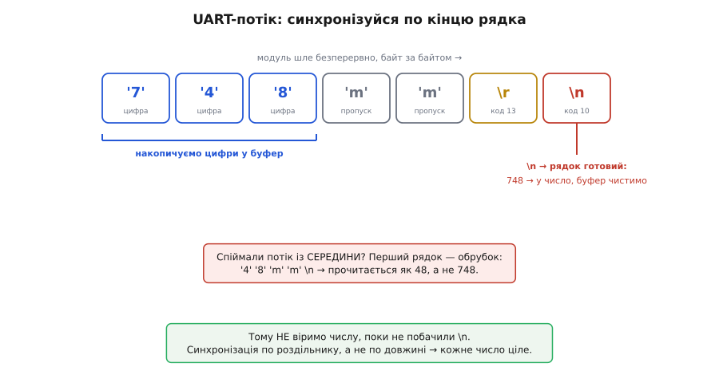

# ⚙️ Розмовляємо з TOF250: робочий код на I2C і UART

Модуль уже світить невидимим лазером і щомиті рахує відстань до цілі. Лишилося найпростіше й найпідступніше — **витягти це число в мікроконтролер**. Задача звучить банально: «прочитати відстань». Але саме тут новачок гає години, бо два байти не складаються в очікуване число, або порт мовчить попри правильне живлення, або в термінал сиплеться незрозуміле сміття замість акуратних міліметрів.

Ця стаття — суто про практику розмови з модулем родини TOF10120 (TOF250, TOF10120, TOF050F і рідня в них однаковий протокол). Ми напишемо чотири закінчені шматки прошивки: читання відстані по I2C, сканер шини (щоб знайти давач, коли він «зник»), розбір текстового потоку по UART, і мінімальний скетч «відстань на екран». Код — реальний C/C++ для Arduino/ESP32, який компілюється й працює, а не начерк. А під кінець зберемо всі граблі, на яких тут перечіпаються найчастіше, з поясненням **чому** саме воно ламається.

## Дві особистості одного модуля

У модуля два незалежні канали, і на кожному він поводиться по-різному. Це важливо тримати в голові, бо код виходить геть різний.

По **I2C** модуль — мовчазний ведений (slave). Сам він нічого не каже; ведучий (ваш мікроконтролер) мусить спитати: «дай регістр такий-то» — і тоді отримає відповідь. Спілкування «запитання → відповідь», ініціатива завжди на боці мікроконтролера.

По **UART** модуль — балакучий. За замовчуванням він **сам, без жодного запиту, безперервно диктує відстань** у лінію передачі звичайним текстом. Мікроконтролеру не треба нічого питати — лише слухати й вибирати числа з потоку. (Цей режим можна перемкнути на «мовчи, поки не спитаю» — до цього дійдемо.)

> 🔧 **Навіщо це.** Вибір каналу диктує не мода, а задача. Якщо на I2C-шині вже висять інші давачі (гіроскоп, барометр) і ви опитуєте їх по черзі — беріть I2C, давач стане ще однією адресою на тих самих двох дротах. Якщо ж треба простий потік чисел в один провід, без клопоту з підтяжками й адресами — беріть UART, і хай модуль сам диктує. Одночасно обидва канали чіпляти не треба.

## Спосіб I2C: спитати регістр

### Адреса — одне число у двох личинах

Найперша пастка чекає ще до першого рядка коду. У документації модуля адреса записана як **0xA4**. У Arduino-скетчі, який ви скопіювали, стоїть **0x52**. Обидва «правильні» — і це те саме число.

Річ у тім, як I2C пакує адресу в байт. Адреса ведений займає **старші сім бітів** байта, а найменший, восьмий біт — то напрямок (читання чи запис). Тобто «повний» 8-бітний байт `0xA4` = `1010 0100` містить усередині 7-бітну адресу `101 0010` = `0x52` плюс біт напрямку в кінці. Бібліотека Arduino `Wire` (як і більшість інших) чекає **7-бітну** адресу й сама доклеює біт напрямку — тому в код кладуть **0x52**.

```
0xA4 = 1 0 1 0 0 1 0 0    ← 8-бітна форма з даташита
       └───────────┘ └─┘
        адреса 7 біт   R/W-біт
       = 101 0010 = 0x52  ← саме це чекає Wire
```

Плутанина «0xA4 чи 0x52» — запитання номер один у форумних гілках про цей модуль. Запам'ятайте: у `Wire.beginTransmission()` іде **0x52**. Докладніше про сам механізм семибітної адреси й біт напрямку — у розборі [адресації I2C](topic:communications/i2c-addressing): пристрій відповідає, лише коли на шині прозвучали саме його сім бітів, а восьмий каже, хто наступний говоритиме.

### Дві відстані: сира й згладжена

Відстань завжди читають з одного місця, але саме число буває у двох трактуваннях, і варто розуміти різницю.

**Регістр 0x00** — відстань у міліметрах, два байти. Це та комірка, з якої читають завжди й на всіх платах. А от **яке саме** число вона віддасть — сире чи згладжене — залежить від режиму, у який виставлено модуль.

Річ у тім, що модуль тримає два трактування відстані. **Сира** — результат найсвіжішого заміру як є: реагує миттєво, але й тремтить, бо два підряд відліки до нерухомої стіни легко різняться на кілька міліметрів через шум фотонів. **Згладжена** — те саме число, пропущене через внутрішній фільтр, що вигладжує тремтіння; цифри не стрибають, показувати на екрані приємніше. Перемикає між ними команда `s3-x#` (`s3-0#` — згладжена, `s3-1#` — сира); **за замовчуванням модуль віддає згладжену** («distance after filtering»). Тобто регістр 0x00 один, а що в ньому — вирішуєте ви режимом.

> 🔧 **Навіщо це.** Правило просте: **керуєш чимось — бери сиру, показуєш людині — бери згладжену.** Якщо давач наводить механізм на ціль, вам потрібна миттєва реакція, і фільтр лише додасть затримки. Якщо ж число йде на дисплей, згладжена версія позбавить його нервового миготіння останньої цифри. Плутати не варто: згладжування — це компроміс «спокій проти швидкості», а не «точність проти неточності».

Про те, чому взагалі корисно розкладати давач на пронумеровані комірки-регістри й читати з них по одній, — коротко в статті про [карту регістрів](topic:communications/register-map): пристрій виставляє свій стан як таблицю адрес, і ведучий бере з неї потрібну клітину.

### Робочий код читання по I2C

Ось закінчена функція: пише в модуль номер регістра, потім читає з нього два байти й складає їх у відстань.

**Прочитати відстань по I2C (мм) на Arduino / ESP32.**

:::tabs
```cpp
#include <Wire.h>

#define TOF_ADDR  0x52    // 7-бітна адреса (байт 0xA4 → 0x52 у Wire)
#define REG_DIST  0x00    // відстань, 2 байти (сира чи згладжена — за режимом s3-x#)

// Прочитати 16-бітну відстань із регістра 0x00. -1 = помилка.
int tofReadDistance() {
    Wire.beginTransmission(TOF_ADDR);
    Wire.write(REG_DIST);                   // «хочу читати з регістра 0x00»
    if (Wire.endTransmission(false) != 0)   // повторний старт, шину НЕ відпускаємо
        return -1;                          // модуль не підтвердив адресу

    if (Wire.requestFrom(TOF_ADDR, (uint8_t)2) != 2)
        return -1;                          // не дочекались двох байтів

    uint16_t hi = Wire.read();              // старший байт приходить першим
    uint16_t lo = Wire.read();              // потім молодший
    return (int)((hi << 8) | lo);           // склали → відстань у мм
}
```
```python
from machine import I2C, Pin

TOF_ADDR = 0x52     # 7-бітна адреса (байт 0xA4 → 0x52)
REG_DIST = 0x00     # відстань, 2 байти (сира чи згладжена — за режимом s3-x#)

i2c = I2C(0, scl=Pin(22), sda=Pin(21))   # типові виводи ESP32

def tof_read_distance():
    """16-бітна відстань із регістра 0x00. None = помилка."""
    try:
        # записуємо номер регістра, потім читаємо 2 байти
        raw = i2c.readfrom_mem(TOF_ADDR, REG_DIST, 2)
    except OSError:
        return None                        # модуль не підтвердив адресу
    hi, lo = raw[0], raw[1]                 # старший байт приходить першим
    return (hi << 8) | lo                   # склали → відстань у мм
```
:::

Три деталі, кожна з яких важить.

**`endTransmission(false)`** — параметр `false` каже «не відпускай шину». Ми щойно сказали модулю, який регістр хочемо, і тепер збираємося одразу читати. Якби ми відпустили шину (`true`), між «сказав регістр» і «читаю» вклинився б стоп, і не кожен ведений таке любить. `false` робить **повторний старт** — читання йде впритул до вказівки регістра, однією неперервною транзакцією. Що таке ці старт-стоп-підтвердження на лінії — розкладено в [транзакції I2C](topic:communications/i2c-transaction).

**Порядок байтів.** Модуль віддає старший байт першим (big-endian). Тому `hi << 8` піднімає його на вісім розрядів угору, а `| lo` домальовує молодший унизу. Переплутаєте порядок — і замість `748` отримаєте `0xEC02` = 60418, дике число. Якщо бачите правдоподібні відстані, помножені на щось або переставлені — перше, що перевіряють, це який байт старший.

**Перевірки на кожному кроці.** `endTransmission` повертає не нуль, якщо ведений не відповів (0x52 не озвався). `requestFrom` повертає, скільки байтів реально прийшло. Без цих перевірок відірваний дріт мовчки дасть вам сміття з порожнього буфера, і ви шукатимете помилку в математиці, якої там немає.

Розкладемо один зчитаний результат по бітах, щоб побачити, як два байти стають числом:

```
hi = 0x02   lo = 0xEC
(hi << 8) = 0x0200 = 0000 0010 0000 0000
     | lo =          0000 0010 1110 1100  = 0x02EC = 748 мм
```

## Коли давач «зник»: сканер шини

Рано чи пізно код перестане читатися: `endTransmission` вертає ненуль, відстані немає. Винний майже завжди не код, а залізо — відпав дріт, переплутані SDA/SCL, немає підтяжок, чи адреса не та. Найшвидший спосіб з'ясувати — **сканер**: коротка програма, що стукає по всіх 127 адресах шини й доповідає, хто відгукнувся.

**Сканер I2C-шини: хто взагалі є на лінії.**

:::tabs
```cpp
#include <Wire.h>

void setup() {
    Wire.begin();
    Serial.begin(115200);      // це швидкість Serial-МОНІТОРА, не давача
    while (!Serial) { }
    Serial.println("Скан I2C-шини...");

    uint8_t found = 0;
    for (uint8_t addr = 1; addr < 127; addr++) {
        Wire.beginTransmission(addr);
        if (Wire.endTransmission() == 0) {   // 0 = хтось підтвердив цю адресу
            Serial.print("  знайдено пристрій за 0x");
            if (addr < 16) Serial.print('0');
            Serial.println(addr, HEX);
            found++;
        }
    }
    if (found == 0)
        Serial.println("  тиша. Перевір живлення, SDA/SCL і підтяжки.");
}

void loop() { }
```
```python
from machine import I2C, Pin

# Wire.begin() → створення шини; scan() сам стукає по всіх адресах 1..126
i2c = I2C(0, scl=Pin(22), sda=Pin(21))   # типові виводи ESP32

print("Скан I2C-шини...")
found = i2c.scan()                       # список адрес, що підтвердили себе
for addr in found:
    print("  знайдено пристрій за 0x{:02X}".format(addr))
if not found:
    print("  тиша. Перевір живлення, SDA/SCL і підтяжки.")
```
:::

Логіка проста до краю: почати транзакцію на адресу й одразу її закрити. Якщо за цією адресою хтось є — він смикне лінію даних униз на підтвердження, і `endTransmission()` поверне нуль. Ніхто не відповів — ненуль. Пробігаємо так усі адреси й друкуємо ті, що озвалися.

Здоровий TOF250 має висвітитися рівно як **0x52**. Що це каже:

- **Бачите `0x52`** — залізо ціле, давач живий, адреса правильна. Значить, помилка вище, в логіці читання регістра.
- **Порожньо, жодної адреси** — обірвана лінія, немає живлення, або на шині немає підтяжок (SDA і SCL мають бути притягнені до живлення резисторами; на багатьох платах-носіях модуля вони вже є, на голому — ні).
- **Бачите `0x29`** — сюрприз, але показовий: це «рідна» адреса голого чипа VL53L0X усередині. Якщо вискочило воно, ви, найпевніше, чіпляєтесь не до виводів модуля, а якось дістали сам давач ST в обхід модульного мікроконтролера.

> 🔧 **Навіщо це.** Сканер відсікає половину світу підозр за дві секунди. Замість гадати «код чи залізо?» ви отримуєте факт: адреса на шині є або її немає. Це перший інструмент, який варто запускати, щойно I2C-давач «замовк», — і не лише для TOF250, а для будь-якого веденого на шині.

## Спосіб UART: ловити число з потоку

### Що саме летить у лінію

У режимі UART модуль без запиту шле в лінію передачі рядок за рядком. Кожен рядок — десяткове число міліметрів, за ним дві літери `mm`, і завершення рядка. На дроті це виглядає так (символи показано явно):

```
'7' '4' '8' 'm' 'm' '\r' '\n'   потім знову  '7' '5' '1' 'm' 'm' '\r' '\n' ...
```

Тобто формат кадру — `NNNmm\r\n`: цифри, суфікс `mm`, повернення каретки (CR, код 13) і переклад рядка (LF, код 10). Число цифр плаває — `95mm`, `748mm`, `1203mm`, — тож орієнтуватися треба не на довжину, а на роздільники.


*Кадр складається з цифр, суфікса «mm» і завершення «\r\n». Число вважається готовим лише на переході рядка — тоді накопичені цифри перекладають у число, а буфер чистять. Синхронізація по роздільнику (а не по довжині) рятує від обрубків, коли слухати починають посеред чужого числа.*

Швидкість лінії за замовчуванням — **9600 бод, формат 8N1** (8 біт даних, без парності, один стоп-біт). Це не одруківка й не властивість монітора: сам модуль вистрілює свій текст саме на 9600. Запам'ятайте це число — на ньому тримається весь UART-код, і саме його плутають найчастіше (див. пастку про «сміття» нижче). Що означає кожна цифра в записі «9600 8N1» — з чого складено окремий байт у лінії, де старт, де стоп — розкладено в [кадрі UART](topic:communications/uart-frame).

### Наївний розбір, який зламається

Спокуса номер один — прочитати відстань «в лоб»: дочекатися символів і зібрати з них число, поки не трапиться нецифра. Так робити не можна, і ось чому.

Дані по UART приходять **побайтно й асинхронно** — модуль може почати диктувати число рівно посеред того, як ваш скетч увімкнувся й почав слухати. Спіймаєте потік із середини — і перший «рядок» вийде обрубком: `48mm` замість `748mm`. Прочитаєте його як число — отримаєте 48 замість 748, тобто вантаж брехні, який зовні виглядає правдоподібно.

Правильний підхід — **синхронізуватися по роздільнику**. Не вірити жодному числу, поки не побачили, де воно почалося й де скінчилося. Кінець кадру тут — це `\n` (перехід рядка) або пара `mm`; від них і треба відштовхуватися.

### Робочий розбір по UART

Візьмемо надійну схему: **накопичуємо цифри в маленький буфер, а на переході рядка перекладаємо накопичене в число й обнуляємося**. Літери `m` просто пропускаємо. Так кожне число, що ми віддаємо, гарантовано ціле — від першої цифри до кінця рядка.

На ESP32 (і будь-якому мікроконтролері з кількома апаратними UART) беремо **апаратний** `Serial2`, а не програмну емуляцію — чому саме апаратний, розберемо в пастках.

**Розбір потоку «NNNmm\r\n» у число (ESP32, апаратний Serial2).**

:::tabs
```cpp
// ESP32: Serial2 — апаратний UART. Виводи RX2=16, TX2=17 (типові).
// Модуль шле текст на 9600 8N1; його TX іде на RX2 плати.

char    buf[8];          // кільцевий накопичувач цифр (з запасом)
uint8_t len = 0;         // скільки цифр уже зібрано
int     lastDistance = -1;

void setup() {
    Serial.begin(115200);                        // порт у комп'ютер (монітор)
    Serial2.begin(9600, SERIAL_8N1, 16, 17);     // порт до давача: 9600!
}

void loop() {
    while (Serial2.available()) {
        char c = (char)Serial2.read();

        if (c >= '0' && c <= '9') {              // цифра — накопичуємо
            if (len < sizeof(buf) - 1)
                buf[len++] = c;
        }
        else if (c == '\n') {                    // кінець рядка — рядок готовий
            if (len > 0) {
                buf[len] = '\0';                 // завершуємо С-рядок
                lastDistance = atoi(buf);        // текст → число
                len = 0;                         // буфер під наступний рядок
                Serial.print(lastDistance);
                Serial.println(" mm");
            }
        }
        else {
            // 'm', '\r', пробіл, будь-що інше — ігноруємо; довжину не чіпаємо
        }
    }
}
```
```python
# ESP32: UART2 — апаратний. Виводи RX2=16, TX2=17 (типові).
# Модуль шле текст на 9600 8N1; його TX іде на RX2 плати.
from machine import UART, Pin

uart = UART(2, baudrate=9600, bits=8, parity=None, stop=1,
            rx=16, tx=17)                        # порт до давача: 9600!

buf = bytearray()          # накопичувач цифр
last_distance = -1

while True:
    if not uart.any():
        continue
    c = uart.read(1)                             # один байт
    if c is None:
        continue
    if b'0' <= c <= b'9':                        # цифра — накопичуємо
        buf += c
    elif c == b'\n':                             # кінець рядка — рядок готовий
        if buf:
            last_distance = int(buf)             # текст → число
            buf = bytearray()                    # буфер під наступний рядок
            print(last_distance, "mm")
    # 'm', '\r', пробіл, будь-що інше — ігноруємо
```
:::

Чому ця схема стійка? Вона **ніколи не довіряє обрубку**. Поки не прийшов `\n`, число не вважається готовим; перший, можливо, неповний рядок після ввімкнення просто дасть кілька зайвих цифр, які закриються на першому ж `\n` і в найгіршому разі зіпсують один-єдиний перший відлік — далі все синхронно. Накопичувач має запас (`8` байтів на щонайбільше 4 цифри плюс термінатор), тож переповнення не буде; а `if (len < sizeof(buf) - 1)` страхує навіть від диких випадків, коли в лінію влетіло сміття без переходу рядка.

Зверніть увагу на **дві різні швидкості**. `Serial` у комп'ютер біжить на 115200 — це швидкість вашого USB-монітора, і її можна ставити будь-яку. `Serial2` до давача — строго **9600**, бо саме на 9600 говорить модуль. Це два різні порти й дві різні домовленості; сплутати їхні швидкості — класична помилка (число в моніторі стає нечитабельним, хоча з давачем усе гаразд).

## Активний і пасивний режими: хай мовчить, поки не спитаю

За замовчуванням модуль у UART **сам безперервно диктує** — це «активне надсилання» (active sending). Зручно для найпростішого випадку, але не завжди бажано: якщо на цьому UART висить ще щось, або ви хочете відстань точно в момент, коли вона вам потрібна, безперервна балаканина заважає.

Модуль керується короткими **текстовими командами** виду `s<номер>-<значення>#` (записати) і `r<номер>#` (прочитати). Ось ті, що стосуються режиму:

```
Команда   Дія
──────────────────────────────────────────────────────────────
s5-0#     активне надсилання: модуль сам диктує (це стандарт)
s5-1#     пасивне читання: модуль мовчить, поки не спитаєш
r6#       (лише в пасивному) видати відстань зараз → "L=748"
s3-0#     віддавати згладжену відстань (стандарт)
s3-1#     віддавати сиру, миттєву відстань
s2-100#   інтервал надсилання 100 мс (можна 10…9999 мс)
r7#       прочитати I2C-адресу модуля → "I=164"  (164 = 0xA4)
```

Кожна команда — це просто текст, який ви шлете в лінію передачі; модуль відповідає `ok` (або `fail`) на записи. Ось як перевести модуль у пасивний режим і потім забирати відстань лише на запит:

**Пасивний режим: питати відстань, коли треба.**

:::tabs
```cpp
void setup() {
    Serial.begin(115200);
    Serial2.begin(9600, SERIAL_8N1, 16, 17);
    delay(30);
    Serial2.print("s5-1#");     // перемкнути модуль у пасивний режим
    delay(30);                  // дати час перетравити й відповісти "ok"
    while (Serial2.available()) Serial2.read();   // прибрати "ok" з буфера
}

// Запитати відстань один раз. Повертає мм або -1.
int tofQuery() {
    while (Serial2.available()) Serial2.read();   // чистимо старе
    Serial2.print("r6#");                         // «дай відстань зараз»

    // Відповідь виду "L=748\r\n" — беремо цифри після '='
    char buf[8]; uint8_t len = 0; bool seenEq = false;
    unsigned long t0 = millis();
    while (millis() - t0 < 100) {                 // ждемо відповідь до 100 мс
        if (!Serial2.available()) continue;
        char c = (char)Serial2.read();
        if (c == '=') { seenEq = true; continue; }
        if (seenEq && c >= '0' && c <= '9') {
            if (len < sizeof(buf) - 1) buf[len++] = c;
        } else if (seenEq && (c == '\r' || c == '\n')) {
            break;                                 // рядок скінчився
        }
    }
    if (len == 0) return -1;
    buf[len] = '\0';
    return atoi(buf);
}
```
```python
from machine import UART, Pin
import time

uart = UART(2, baudrate=9600, bits=8, parity=None, stop=1, rx=16, tx=17)
time.sleep_ms(30)
uart.write("s5-1#")            # перемкнути модуль у пасивний режим
time.sleep_ms(30)              # дати час перетравити й відповісти "ok"
uart.read()                    # прибрати "ok" з буфера

def tof_query():
    """Запитати відстань один раз. Повертає мм або None."""
    uart.read()                                   # чистимо старе
    uart.write("r6#")                             # «дай відстань зараз»

    # Відповідь виду "L=748\r\n" — беремо цифри після '='
    buf = bytearray(); seen_eq = False
    t0 = time.ticks_ms()
    while time.ticks_diff(time.ticks_ms(), t0) < 100:   # чекаємо до 100 мс
        c = uart.read(1)
        if c is None:
            continue
        if c == b'=':
            seen_eq = True
            continue
        if seen_eq and b'0' <= c <= b'9':
            buf += c
        elif seen_eq and c in (b'\r', b'\n'):
            break                                 # рядок скінчився
    if not buf:
        return None
    return int(buf)
```
:::

Різниця з активним режимом видна одразу: тут **ініціативу перебрав мікроконтролер**. Він шле `r6#`, чекає рядок `L=…`, вибирає цифри після знаку рівності. Формат відповіді трохи інший (`L=748`, а не `748mm`), тож і розбір інший — синхронізуємося не по `mm`, а по `=`.

> 🔧 **Навіщо це.** Пасивний режим — це контроль над часом. В активному ви ловите те, що є в буфері «прямо зараз», і воно може бути на кілька десятків мілісекунд застаріле. У пасивному ви кажете «зміряй і дай» рівно тоді, коли готові діяти на цьому числі, — критично, коли відстань керує рухом і кожна затримка перетворюється на промах. Ціна — трохи більше коду й один зайвий обмін по лінії.

Команду `s2-xxxx#` (інтервал надсилання) варто знати ще з однієї причини: у типових прикладах-бібліотеках при старті шлють `s2-20#`, тобто просять модуль диктувати кожні 20 мс замість стандартних 100. Це піднімає частоту потоку до ~50 разів на секунду — інколи корисно, але й навантажує розбір; без потреби чіпати не варто.

## Мінімальний скетч: відстань на екран

Зберемо найкоротший корисний приклад: читаємо по I2C і виводимо в монітор. Саме з такого варто починати — він або одразу дає число, або вказує, де саме поламалось.

**Мінімум: відстань TOF250 у Serial-монітор (I2C).**

:::tabs
```cpp
#include <Wire.h>
#define TOF_ADDR 0x52

int tofRead() {
    Wire.beginTransmission(TOF_ADDR);
    Wire.write(0x00);                          // регістр живої відстані
    if (Wire.endTransmission(false) != 0) return -1;
    if (Wire.requestFrom(TOF_ADDR, (uint8_t)2) != 2) return -1;
    uint16_t hi = Wire.read(), lo = Wire.read();
    return (int)((hi << 8) | lo);
}

void setup() {
    Wire.begin();                              // SDA/SCL — типові виводи плати
    Serial.begin(115200);
    while (!Serial) { }
    Serial.println("TOF250 готовий");
}

void loop() {
    int mm = tofRead();
    if (mm >= 0) {
        Serial.print(mm);
        Serial.println(" mm");
    } else {
        Serial.println("немає відповіді (перевір адресу й дроти)");
    }
    delay(100);                                // ~10 замірів на секунду
}
```
```python
from machine import I2C, Pin
import time

TOF_ADDR = 0x52
i2c = I2C(0, scl=Pin(22), sda=Pin(21))         # типові виводи плати

def tof_read():
    try:
        raw = i2c.readfrom_mem(TOF_ADDR, 0x00, 2)   # регістр живої відстані
    except OSError:
        return None
    return (raw[0] << 8) | raw[1]

print("TOF250 готовий")
while True:
    mm = tof_read()
    if mm is not None:
        print(mm, "mm")
    else:
        print("немає відповіді (перевір адресу й дроти)")
    time.sleep_ms(100)                         # ~10 замірів на секунду
```
:::

Тридцять рядків — і на екрані повзуть чесні міліметри. Якщо замість чисел іде «немає відповіді» — запускайте сканер із розділу вище: він скаже, чи давач узагалі на шині.

## Граблі: де тут перечіпаються найчастіше

Зберемо докупи всі місця, де застрягають, — з поясненням причини, бо симптом без причини лікують навмання.

**Адреса 0x52, а не 0xA4.** Найперша й найчастіша. У код Arduino іде **7-бітна** форма `0x52`; `0xA4` — це та сама адреса разом із бітом напрямку, «8-бітна» форма з даташита. Поклали `0xA4` у `Wire.beginTransmission()` — і `Wire` доклеїть іще один біт напрямку до вже повного байта, адреса «попливе», давач не озветься. Симптом: `endTransmission` завжди вертає ненуль. Ліки: `0x52`, і перевірте сканером.

**UART навхрест: TX↔RX.** Передавальна ніжка модуля (TX) мусить іти на **приймальну** ніжку мікроконтролера (RX), і навпаки: RX модуля — на TX мікроконтролера. Логіка очевидна, щойно її промовити: те, що один каже (transmit), другий має чути (receive). З'єднаєте «однойменне з однойменним» (TX на TX) — обидва передавачі кричать один в одного, ніхто нікого не слухає, у лінії глуха тиша, хоча живлення є й лазер світить. Симптом: `Serial2.available()` завжди нуль. Ліки: перекиньте два дроти навхрест. Це причина мовчання номер один у UART-режимі.

**Сміття в порту й програмний Serial.** Ось найпідступніша, бо код виглядає бездоганно, а в моніторі — набір нечитабельних символів. Причина майже завжди одна: **розбіжність швидкості** між тим, як модуль шле, і тим, як мікроконтролер слухає. Модуль диктує на **9600**; поставили `Serial2.begin(115200, …)` — і мікроконтролер семплює біти в чужому темпі, вихоплюючи з кожного байта не ті розряди. Виходить не «трохи неправильне число», а суцільна каша, бо навіть межі байтів не збігаються.

Окремий підвид цієї ж біди — **програмний UART (`SoftwareSerial`) на високій швидкості**. `SoftwareSerial` не має апаратного приймача; він відлічує тривалість кожного біта програмно, ганяючи процесор у циклі. На 9600 це ще спрацьовує — на біт припадає близько 104 мікросекунди, є час. Але щойно ви спробуєте підняти швидкість у бік 115200, на біт лишається ~8.7 мкс, і будь-яке переривання чи зайва інструкція збиває відлік — семпл падає між бітами, байти б'ються, у порт сиплеться сміття. Тому модулі цієї родини й ходять на 9600: це швидкість, яку **тягне навіть програмний порт** на скромному Arduino Uno з одним апаратним UART. Правильний рецепт: беріть **апаратний** UART (`Serial1`/`Serial2` на ESP32, STM32, Pico), а якщо мусите `SoftwareSerial` — не піднімайте швидкість вище тих самих 9600. Про те, чому навіть кілька відсотків розбіжності темпу руйнують прийом, — у [швидкості обміну (бод)](topic:communications/baud-rate): приймач семплює кожен біт у його середині, і зсунутий годинник поступово «з'їжджає» з бітів.

> 🔧 **Навіщо це.** Три верхні пастки — адреса, перехрестя, швидкість — покривають чи не всі «модуль не працює» на форумах. Спільне в них те, що **симптом бреше про причину**: тиша в I2C схожа на дохлий давач, а насправді це біт адреси; сміття в UART схоже на биту плату, а насправді це не та швидкість. Тому й лікувати треба причину: сканер для I2C, дроти навхрест і звірка швидкості для UART.

**Один канал за раз.** Не треба чіпляти одночасно I2C і UART. Оберіть під задачу: I2C — коли давач стає адресою серед інших на спільній шині; UART — коли треба простий потік в один провід. Що таке асинхронний обмін без спільного такту, на якому стоїть UART, — коротко в [асинхронній передачі](topic:communications/async-serial).

**Замір крізь скло й проти сонця.** Це вже не код, а фізика сцени, але з'їдає стільки ж годин. Пряме сонце забиває приймач фоновими інфрачервоними фотонами — дальність падає, а на вулиці опівдні давач може «осліпнути» й віддавати нісенітницю або максимум діапазону. Прозоре скло промінь здебільшого **пропускає** — ви зміряєте не скло, а те, що за ним (або отримаєте хаос від часткового відбиття). Дзеркало **відведе** промінь убік, і замір буде до чогось збоку, а не до дзеркала. Жоден рядок коду цього не полагодить: цільте в матову, приблизно перпендикулярну променю поверхню, і тримайте давач від прямого сонця.

**Не переплутати два «мозки».** Якщо сканер раптом показав `0x29` замість `0x52`, ви якимось чином достукались до голого чипа VL53L0X усередині модуля в обхід його власного мікроконтролера. Тоді простий «читай регістр 0x00» не працюватиме — сирий VL53L0X має геть інший, складний протокол з десятками регістрів. Ліки: чіпляйтеся до **виводів модуля** (тих шести кольорових дротів), а не до контактів самого давача ST.

## Що лишити в пам'яті

Розмова з TOF250 зводиться до двох рецептів. **По I2C**: адреса `0x52` (не `0xA4`), пишеш номер регістра, читаєш два байти старший-молодший, складаєш `(hi << 8) | lo` — маєш міліметри; регістр `0x00` дає сиру відстань, згладжена живе окремо. Коли давач «зник» — сканер шини за дві секунди скаже, чи він узагалі на лінії. **По UART**: модуль сам диктує текст `NNNmm\r\n` на **9600 8N1**; синхронізуйся по переходу рядка (не довіряй обрубку!), накопичуй цифри в буфер, на `\n` перекладай у число. Хочеш контролю над часом — перемкни в пасив командою `s5-1#` і питай `r6#`.

Три пастки з'їдають найбільше часу, і кожна бреше про свою причину: **адреса** (тиша в I2C — це семибітна `0x52`, а не восьмибітна `0xA4`), **перехрестя UART** (мовчання — це TX на TX замість навхрест), **швидкість** (сміття в порту — це не 9600, або програмний Serial задертий вище, ніж він тягне). Знявши ці три, ви змусите модуль давати чесні міліметри за кілька хвилин, а не годин.
