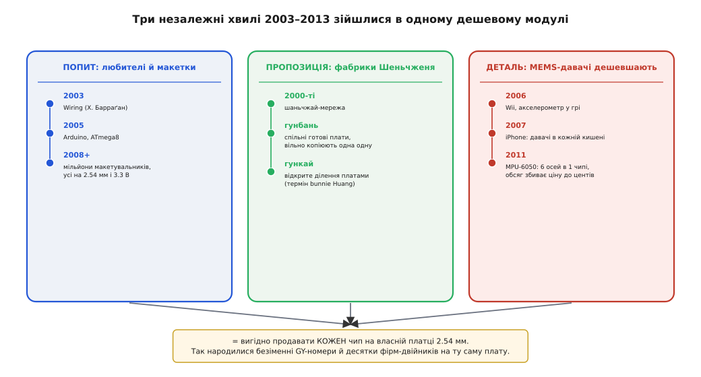
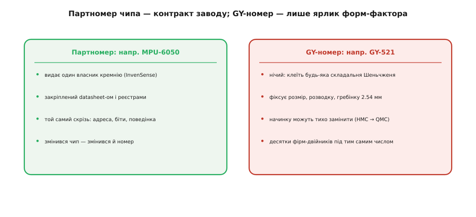

# 📜 Звідки взялася епоха дешевих брейкаутів

Спробуйте на секунду уявити цю картину до того, як вона стала звичною. Ви хочете, щоб ваш саморобний пристрій відчував нахил. Усередині потрібного давача — крихітна кремнієва мікросхема з виводами завбільшки з половину міліметра, живиться вона рівно 3.3 вольта і без кількох зовнішніх деталей навіть не прокинеться. Ще років двадцять тому це означало: замов у дистриб'ютора котушку на тисячу штук, спроектуй під неї власну плату, віддай її на завод із монтажем, чекай тижні, плати сотні доларів за партію. Один давач для одного домашнього проєкту був просто недосяжний — не тому, що дорогий сам чип, а тому, що весь ланцюжок навколо нього був розрахований на промисловість, не на людину з паяльником на кухні.

А сьогодні той самий давач приходить до вас поштою за пару доларів, уже припаяний на охайну платку з написом на кшталт **GY-521**, зі штирками, що встромляються прямо в макетну плату. Між цими двома світами лежить дуже конкретна історія — злиття трьох незалежних хвиль, кожна зі своєю логікою, які випадково зійшлися в одній точці на початку 2010-х. Жодна з них поодинці не породила б GY-модуль. Разом вони зробили його не просто можливим, а економічно неминучим. Розберімо кожну — і побачимо, чому наприкінці вийшло саме те, що вийшло: безіменні номери, юрба виробників-двійників і плата, номер якої нічого не гарантує про її начинку.

> 🔧 **Навіщо це.** Знати цю історію — не забавка колекціонера. Вона прямо пояснює найпідступніші риси GY-серії, на яких горять новачки: чому номер GY не є партномером чипа, чому та сама «GY-271» приходить із різними мікросхемами всередині, чому за платою не стоїть жодна відповідальна фірма з документацією. Усе це — не хаос і не недбалість, а логічний слід того, як цей ринок склався. Зрозумівши походження, ви перестаєте дивуватися й починаєте перевіряти правильні речі.

## Хвиля перша: любителі, яким раптом знадобилися давачі

Попит мусив з'явитися першим — інакше не було б кому продавати. І з'явився він із несподіваного місця: зі школи дизайну в маленькому італійському містечку Івреа.

У 2003 році колумбійський студент **Ернандо Барраґан** (ісп. Hernando Barragán) захищав у Interaction Design Institute Ivrea магістерську роботу — платформу під назвою **Wiring**. Керували роботою Массімо Банці (італ. Massimo Banzi) і Кейсі Ріс (англ. Casey Reas). Задум був простий і зухвалий: узяти легкість, з якою художник пише код у середовищі Processing (його зробили Ріс і Бен Фрай), і перенести цю легкість на «залізо» — щоб людина без інженерної освіти могла за вечір змусити мікроконтролер блимати світлодіодом чи читати кнопку. Wiring і був цим мостом: плата плюс проста мова, що ховала жахливі подробиці роботи з реєстрами мікроконтролера.

У 2005 році команда в тій самій Івреа — Банці, Давід Куартієльєс (ісп. David Cuartielles), Том Іго (англ. Tom Igoe), Джанлука Мартіно (італ. Gianluca Martino) і Давід Мелліс (англ. David Mellis) — узяла код Wiring, додала підтримку дешевшого мікроконтролера ATmega8 і відгалузила окремий проєкт. Назвали його **Arduino** — за баром «Bar di Re Arduino» в Івреа, де засновники збиралися; сам бар названо на честь Ардуїна Іврейського, середньовічного короля Італії. Коли інститут у 2005-му закривався через брак грошей, команда побоялася, що проєкт просто зникне або його привласнять, — і вирішила відкрити його якнайширше. Залізо випустили під ліцензією Creative Commons, програму — під GPL/LGPL. Це рішення виявилося ключовим: воно означало, що **будь-хто у світі має право виготовляти сумісні плати й похідні від них**.

> 🔧 **Навіщо це.** Тут коротко про точність: Arduino не «винайшли з нуля» — це форк Wiring Барраґана, який сам стояв на Processing. Ця родовідна пояснює головне для нашої історії: з самого початку в культурі Arduino була вписана відкритість і право копіювати. Саме вона потім дозволила шеньчженським фабрикам легально клонувати плати мільйонами — без цієї відкритої ліцензії дешевого модуля просто не було б.

Наслідок для нашої теми не в самій платі Arduino, а в тому, що вона створила. До середини 2000-х уміння запрограмувати мікроконтролер було ремеслом кількох тисяч інженерів-вбудованників. Arduino за кілька років перетворило його на хобі сотень тисяч, а потім і мільйонів людей — студентів, художників, школярів, музейних майстрів, аматорів робототехніки. І всі вони поділяли дві звички, які зробить наш GY-модуль. По-перше, вони працювали на **макетній платі** з кроком отворів 0.1 дюйма (2.54 мм) і з'єднували все дротами-перемичками. По-друге, багато популярних плат (а згодом лавина ESP8266/ESP32) жили на **3.3 вольта** і спілкувалися по простих шинах — насамперед [I²C](book:communications/i2c-bus).

Так уперше в історії з'явилася величезна юрба людей, яким потрібен був не один давач у промисловому виробі, а **один давач у настільному проєкті** — і в дуже конкретній обгортці: з ногами 2.54 мм і готовністю до простого мікроконтролера. Ринок такого раніше просто не існував. Тепер він раптом став масовим.

## Хвиля друга: фабрики, які вміли зробити це дешево

Попит без дешевого способу його вдовольнити лишився б нішею для дорогих плат від західних компаній — і такі компанії справді з'явилися. У 2003 році студент Натан Сайдл (англ. Nathan Seidle) заснував **SparkFun**, а в 2008-му виникла шеньчженська **Seeed Studio** зі своєю системою модулів Grove. Обидві робили саме «брейкаути» — плати, що «виводять» незручний SMD-чип на зручні контакти — і супроводжували їх якісною документацією та бібліотеками. Але їхні модулі коштували десятки доларів: за ними стояли зарплати інженерів, тести, підтримка, бренд. Для промисловості чи серйозного стартапера це нормально. Для школяра, якому треба п'ять різних давачів «просто спробувати», — задорого.

Дешевизну дала зовсім інша екосистема — та, що вже десятиліття гула в китайському **Шеньчжені** (кит. 深圳, Shēnzhèn). Її англійською назвали **шаньчжай** (кит. 山寨, shānzhài — буквально «гірська фортеця», історично — розбійницьке село поза владою; згодом слово стало означати неофіційне, «піратське» виробництво). Дослідник апаратних систем **Ендрю «bunnie» Гуан** (англ. Andrew "bunnie" Huang) описав цю мережу зсередини: не один великий завод, а густа горизонтальна павутина дрібних гравців — виробники окремих компонентів, торговці, дизайн-майстерні, монтажні лінії, — сплетена неформальними зв'язками й культурою відкритого обміну.

Двоє понять із цієї культури пояснюють GY-модуль майже повністю. Перше — **гунбань** (кит. 公板, gōngbǎn, «спільна плата»): готова до виробництва конструкція плати, яку майстерні **вільно передають одна одній і копіюють**. Хтось розвів плату під певний чип — і ця розводка розходиться мережею, її бере хто завгодно, підправляє, штампує під власною наліпкою. Друге поняття — **гункай** (кит. 公开, gōngkāi, «відкрито»): так Гуан назвав цю практику відкритого ділення напрацюваннями, щоб відрізнити її від західного «open source». Він підкреслював, що це не піратство в чистому вигляді й не західна відкритість, а окрема, самобутня екосистема, що виросла майже без західного впливу — через мовну, культурну й політичну ізоляцію — і стала самопідтримною машиною інновацій.

> 🔧 **Навіщо це.** Ось де народжується головна дивина GY-серії. У світі гунбань **не існує «власника» конкретної плати**: розводка під давач — спільне надбання, її штампують десятки майстерень. Тому за GY-номером не стоїть один виробник із гарантією та документацією — стоїть спільна конструкція, яку кожен ліпить по-своєму. Це не хаос, а логіка гункай: копіювати чужу готову плату тут не крадіжка, а нормальний спосіб роботи.


*Кожна доріжка розвивалася окремо й зі своєю логікою. GY-модуль виник саме там, де вони перетнулися: попит на давач у настільному проєкті, спосіб зробити плату майже задарма і давач, що подешевшав до центів.*

Порахуймо на пальцях, чому це збивало ціну так різко. Уявімо західну компанію, що робить фірмовий брейкаут:

```
розробка плати + документація + бібліотека     — оплачена інженерна праця
власний бренд, гарантія, підтримка               — накладні витрати
маленькі, «нежадібні» партії                      — вища ціна за штуку
= десятки доларів за модуль
```

А тепер шеньчженська майстерня в режимі гунбань:

```
розводку плати взяли готову (гунбань)            — 0 витрат на розробку
документації немає, бренд не потрібен             — 0 накладних
величезні партії на спільному обладнанні          — копійки за штуку
конкуренція десятків двійників тисне ціну вниз     — ще нижче
= пара доларів за модуль
```

Різниця не в тому, що китайський монтаж якось «магічно» дешевший. Різниця в тому, що з рівняння викреслено цілі рядки витрат — розробку, документацію, бренд, — а конкуренція безлічі однакових майстерень доти тисне на ціну, доки не лишається майже гола собівартість чипа й текстоліту. Саме тому фірмовий брейкаут і безіменний GY з тим самим давачем можуть відрізнятися в ціні вдесятеро.

## Хвиля третя: давачі, які подешевшали до центів

Двох хвиль усе ще не досить. Попит і дешеве виробництво були б безсилі, якби сам давач усередині лишався дорогим і рідкісним. Третя хвиля — і, мабуть, вирішальна — це обвал ціни на **MEMS-давачі** протягом 2000-х.

Абревіатура MEMS (англ. *Micro-Electro-Mechanical Systems* — мікроелектромеханічні системи) означає крихітні механізми, витравлені прямо в кремнії тими самими методами, що й мікросхеми: мікроскопічна вантажинка на пружинках, чий зсув під прискоренням перетворюється на електричний сигнал. Довго такі давачі були дорогою екзотикою — їх ставили в подушки безпеки автомобілів, і коштували вони чимало.

Зламали ціну два масові споживчі пристрої, кожен із точно задокументованою датою. У листопаді **2006 року** вийшла ігрова приставка Nintendo Wii: у її пульті сидів MEMS-акселерометр (від Analog Devices), і мільйони людей уперше махали в повітрі приладом, що відчував власний рух. У червні **2007 року** з'явився iPhone — акселерометр у ньому повертав зображення на екрані й миттю став очікуваною дрібницею в кожній кишені. Слідом гіроскопи й акселерометри пішли геть у всі смартфони поспіль. А коли деталь замовляють сотнями мільйонів на рік, працює найзалізніший закон масового виробництва: собівартість падає майже до вартості кремнію під нею. Давач, що коштував долари, став коштувати центи — не тому що спростився, а тому що його роблять у астрономічних обсягах для телефонів.

І тут з'явився чип, який ніби спеціально створили, щоб стати серцем аматорського модуля. У листопаді **2011 року** компанія **InvenSense** (заснована 2003-го в Сан-Хосе іранським інженером Стівом Насірі, англ. Steve Nasiri) випустила **MPU-6050** — першу мікросхему, що поєднала тривісний гіроскоп і тривісний акселерометр на одному кремнієвому кристалі, та ще й з вбудованим процесором злиття даних. Цілий інерційний блок — шість ступенів свободи руху — в одному дешевому корпусі, розрахованому на смартфони. Обсяги смартфонного ринку збили його ціну до дрібниці.

> 🔧 **Навіщо це.** MPU-6050 — це не просто «ще один давач», а той конкретний чип, що дав GY-серії її найвідомішу зірку — [GY-521](book:sensors/mpu6050). Зрозумійте причинність: аматор отримав шість осей руху за долар не тому, що хтось вирішив ощасливити любителів, а тому, що цей чип уже випускали мільйонами для телефонів, і зайняти ним ще й нішу макетувальників коштувало фабрикам майже нічого. Дешевизна вашого модуля — побічний продукт смартфонного буму.

Тепер складімо три хвилі докупи — і GY-модуль випаде сам собою. Є **величезна юрба любителів**, яким потрібен давач на макетці з ногами 2.54 мм і живленням 3.3 В (хвиля перша). Є **шеньчженська машина гунбань**, що вміє зробити будь-яку плату майже задарма й вільно копіювати чужі розводки (хвиля друга). І є **давачі, що подешевшали до центів** завдяки смартфонам (хвиля третя). За таких умов не зробити дешевий брейкаут було б дивно. Хтось у Шеньчжені розвів просту платку під популярний чип, додав навколо мінімум обв'язки й гребінку 2.54 мм — і ця розводка миттю розійшлася мережею як гунбань. Так народилася не одна плата, а **манера**: узяти будь-який ходовий давач і посадити його на дешеву платку під макетку.

## Чому номери безіменні, а виробників безліч

Лишилося пояснити дві дивини, з якими стикається кожен, хто працює з GY: звідки взялися самі номери «GY-щось» і чому та сама плата виходить під десятком різних брендів.

Почнімо з чесного зізнання, бо навколо цих букв ходить багато вигадок. **«GY» — не абревіатура з розшифровкою.** Це просто префікс-код, яким шеньчженські майстерні позначають свої сенсорні брейкаути, — так само, як інші серії ходять під префіксами на кшталт «HW-» чи «KY-». Жоден виробник не володіє позначкою «GY» і не публікує її «повної назви». Численні спроби вивести «GY» з якихось англійських слів — це домисли інтернет-форумів, не підтверджені жодним первинним джерелом; ставитися до них треба як до **міфу**, а не до етимології. Номер тут виник органічно, знизу — як складський ярлик у майстерні, а не як зареєстрована марка згори.

І звідси випливає найважливіше практичне спостереження всієї цієї історії: **у світі гунбань номер GY описує плату, а не чип.** Партномер мікросхеми — наприклад, MPU-6050 — це контракт її єдиного власника кремнію: він закріплений datasheet-ом, у нього фіксована адреса на шині, фіксовані реєстри, передбачувана поведінка. Змінився чип — змінюється й партномер. А GY-номер нічий: він фіксує лише розмір плати, розводку й гребінку. Що саме на ній розпаяно, залежить від того, який чип у майстерні був дешевший тієї партії.


*Ліворуч — те, що гарантовано: партномер закріплено datasheet-ом і реєстрами. Праворуч — те, що ні: під одним GY-числом начинку тихо замінюють, а плату штампують десятки фірм-двійників.*

Класичний приклад цієї підміни — магнітометр. Плати **GY-271** і **GY-273** роками маркували «HMC5883L» (магнітометр від Honeywell), але Honeywell зняла цей чип із виробництва приблизно у 2020 році, і майстерні тихо перейшли на дешевший **QMC5883L** від QST — інша адреса на шині, інші реєстри. Наліпка та сама, начинка різна. У світі, де плату визначає розводка, а не власник, така підміна — не обман, а просто «взяли, що було дешевше під ту саму дірку». Правду каже лише сам чип і його [відповідь на шину I²C](book:communications/i2c-bus) — а не число на текстоліті.

Друга дивина — безліч виробників — тепер зрозуміла сама собою. Раз розводка є спільним надбанням гунбань, її бере хто завгодно. Одні майстерні продають плату зовсім безіменною, з голим написом «GY-521». Інші наліплюють власний бренд для західних маркетплейсів — найвідоміший приклад тут **HiLetgo**, китайський продавець модулів і плат, чиї ярлики знайомі кожному покупцеві дешевої електроніки на великих майданчиках. Але за брендом HiLetgo (як і за десятками схожих) найчастіше стоїть та сама спільна гунбань-плата, що й за безіменним GY, — інколи буквально з того самого монтажного цеху. Бренд тут — це наліпка й канал збуту, а не окрема конструкція. Тому дві плати з різними назвами можуть бути ідентичними до останнього резистора, а дві плати з **однаковим** GY-номером — відрізнятися чипом усередині.

> 🔧 **Навіщо це.** Зведімо історію в одну робочу звичку. Якщо ви очікуєте від номера GY тієї ж твердості, що від партномера мікросхеми, ви обпечетеся — бо за ним не стоїть ні власник, ні контракт, лише спільна розводка. Правильне ставлення: **номер GY читайте як підказку про форм-фактор, а джерелом правди вважайте напис на самому чипі й відповідь плати на шину.** Уся ця історія — довге пояснення того, чому інакше й бути не могло, і чому перевіряти треба саме чип, а не наліпку.

## Що з цього лишилося

Три хвилі давно розійшлися своїми шляхами. Arduino стало брендом і компанією; шаньчжай-екосистема Шеньчженя виросла у світову майстерню електроніки; MEMS-давачі здешевшали ще дужче й розповзлися в кожен ґаджет. Але їхній спільний слід — дешевий сенсорний брейкаут із ногами 2.54 мм — застиг у тому вигляді, у якому склався на початку 2010-х, і живе досі майже без змін.

Тому GY-модуль варто читати як **скам'янілість певної епохи**. Його безіменний номер — слід культури гунбань, де плата нічия. Його гребінка 2.54 мм — спадок макетних плат, а ті, своєю чергою, повторюють крок ще старіших мікросхем у корпусах DIP, стандартизований аж у 1964 році у Fairchild Semiconductor. Його дешевизна — відлуння смартфонного буму, що збив ціну давачів до центів. І його головна пастка — плата, чия наліпка не гарантує начинки, — пряме породження того, що попит, спосіб виробництва й дешевий чип зійшлися саме так, а не інакше. Знаючи це походження, ви дивитеся на нову незнайому GY-плату вже без розгубленості: не питаєте, «що означають ці букви», а одразу перевіряєте те єдине, що тут завжди говорить правду, — сам чип.

---

*Статус доказовості. Дати й імена звірено з відкритими джерелами (заснування Wiring 2003 та Arduino 2005 в Івреа; вихід Nintendo Wii — листопад 2006; iPhone — червень 2007; MPU-6050 від InvenSense — листопад 2011; винахід корпусу DIP у Fairchild — 1964; поняття гунбань/гункай — з описів шеньчженської екосистеми в Ендрю «bunnie» Гуана). Твердження «GY — не абревіатура з розшифровкою» подано як усунення поширеного форумного міфу: жодне первинне джерело такої розшифровки не наводить, тож будь-яка «розшифровка GY» лишається недоведеною. Точні внутрішньоцехові обставини появи саме префікса «GY» задокументовані слабко — це радше реконструкція логіки ринку, ніж архівний факт, і подано її саме так.*
