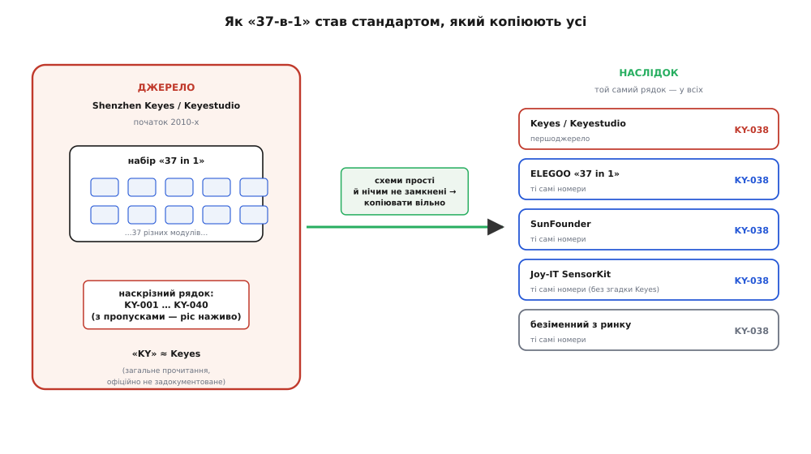

# 📜 Звідки взялася KY-серія: історія бренду Keyes

Є речі, чиє походження настільки розчинилося у звичці, що ним ніхто й не цікавиться. Ти купуєш «набір 37 давачів для Arduino», дістаєш звідти платку з написом **KY-013**, гуглиш «KY-013 arduino» — і за секунди маєш цоколівку, приклад коду, десяток форумних гілок. Усе працює, усе однакове, звідки б платка не приїхала. І майже ніхто не спиняється спитати: а що таке ці дві літери? Хто пронумерував тридцять сім різних давачів наскрізним рядком і чому саме так? Чому та сама KY-013 з коробки ELEGOO, з коробки SunFounder і від безіменного продавця з маркетплейсу — це буквально та сама платка з тим самим номером, наче їх штампують за одним кресленням, якого ніхто не бачив?

Ця історія — про те, як одна невелика шеньчженська фірма ненароком створила стандарт. Не «майже стандарт», не «популярний формат» — а справжній галузевий словник, яким сьогодні розмовляють десятки виробників, здебільшого й не згадуючи ім'я того, хто його склав. Тут менше драми, ніж у історії радіо чи транзистора, зате видно рідкісну річ: **як народжується де-факто-стандарт знизу, без комітету, без патенту, майже без документа** — самою лише зручністю й правом усіх копіювати.

## Проблема, якої вже не пам'ятають

Щоб зрозуміти, навіщо взагалі знадобилася KY-серія, треба на хвилину повернутись у кінець нульових — час, коли Arduino щойно перетворилася з нішевої італійської платівки для художників на всесвітнє захоплення. Плата в новачка вже була. А от **давачі до неї були пеклом**.

Уяви студента 2010 року, який хоче, щоб його Arduino реагувала на світло. У теорії все просто: є фоторезистор, копійчана деталь. На практиці — фоторезистор сам по собі не дає напруги, яку можна прочитати; треба ще резистор-пару в [дільник](topic:electronics/voltage-divider), треба зрозуміти номінал того резистора, треба це десь спаяти чи зібрати на макетній платі, треба не переплутати ніжки. І так — для **кожного** давача окремо. Термістор — свій обв'язок. Мікрофон — підсилювач і [компаратор](topic:electronics/comparator). Датчик Голла — підтяжка. Кожен новий сенсор означав вечір читання даташитів заради того, щоб просто отримати з нього хоч якесь число на піні.

> 🔧 **Навіщо це.** Уся цінність KY-модуля — у тому, чого ти *не* робиш. Голий давач вимагає, щоб ти знав його фізику, перш ніж він озветься. Модуль знімає цей поріг: чутливий елемент уже посаджено на плату з потрібним обв'язком і виведено на гребінку. Історично саме цей стрибок — «від деталі до модуля» — і зробив мікроконтролери доступними для мільйонів новачків. KY-серія була однією з перших, хто зробив його масово й дешево.

Ринок відповів на цей біль передбачувано: почали з'являтися готові **давач-модулі** — маленькі плати, де сам давач уже спаяно з його обв'язком. Ідея не була нова й нікому конкретно не належала; такі модулі робили багато хто. Але зробити один модуль — легко, а **зібрати з них зручний, повний, дешевий і послідовно пронумерований набір** — це вже інша задача. І саме її розв'язала фірма на ім'я Keyes.

## Хто такі Keyes і Keyestudio

Юридично за брендом стоїть шеньчженська компанія — **Shenzhen KEYES Robot Co., Ltd.** (у різних документах вона фігурує ще як *Shenzhen Keyes DIY Robot Co., Ltd.*). Шеньчжень тут не випадковість: це південнокитайське місто — світова столиця дрібної електроніки, місце, де прототип перетворюється на тисячу штук на прилавку швидше, ніж деінде на планеті. Компанія за власним описом виросла з багаторічної співпраці з тайванською фірмою **Qi Yang** (кит. 启阳), що мала «понад десять років досвіду в розробці роботів», і саме під цю співпрацю народилася торгова марка Keyes — під набори-конструктори й давачі для робото-творчості.

Далі варто розрізняти дві назви, які початківці плутають, — **Keyes** і **Keyestudio**. Простими словами: *Keyes* — це старіша, «сира» марка на ранніх модулях і перших наборах; *Keyestudio* — пізніший, вилощеніший бренд тієї самої компанії, під яким вона вийшла на світовий роздріб, завела фірмову вікі з документацією й почала торгувати вже не лише россипом давачів, а цілими навчальними наборами, роботами, платами-клонами Arduino. Можна думати про це як про одну майстерню з двома вивісками різних років: внутрішня, «цехова» Keyes і вітринна, «магазинна» Keyestudio.

```
Shenzhen KEYES Robot Co., Ltd.  (у співпраці з тайванською Qi Yang)
        │
        ├─  Keyes        — рання марка; россип модулів, перші «37-в-1»
        └─  Keyestudio   — пізніший роздрібний бренд; набори, роботи, вікі
```

Тут — перша чесна засторога щодо дат. Фірмовий сайт роками носить у підвалі копірайт **«© 2010–2025 keyestudio.com»**, і цю «2010» часто цитують як рік заснування. Але торгова марка *KEYESTUDIO* у США зареєстрована помітно пізніше: заявку подано **20 січня 2015 року**, а зареєстровано **1 грудня 2015-го** (реєстр. № 4862230) на власника Shenzhen KEYES DIY Robot Co., Ltd.; паралельно є й європейська заявка на ту саму марку. Незалежні бізнес-довідники датують появу компанії радше **2012–2013 роками**. Що з цього «правда»? Найчесніша відповідь: **бренд активний приблизно з початку 2010-х** — «2010» у копірайті задає нижню межу присутності в мережі, а реєстрація 2015-го фіксує момент, коли назву Keyestudio почали серйозно захищати вже як міжнародну. Точного дня «народження» фірми загальнодоступні джерела не дають, і вигадувати його не варто.

> 🔧 **Навіщо це.** Розрізняти *ідею, марку й реєстрацію* — та сама звичка, що й у будь-якій історії винаходу. «Хто перший зробив давач-модуль» — питання без відповіді, бо ідея нічия. «Хто зареєстрував бренд Keyestudio» — питання з точною датою (2015). А «відколи бренд живий» — десь між ними. Плутати ці три речі — типова помилка, через яку копірайтний рядок «2010» перетворюється на легенду про рік заснування.

## Народження «37-в-1»

Тепер — головне, заради чого ця історія й пишеться: **звідки взялося саме число 37 і наскрізна нумерація**.

Історія тут прозаїчна й тому правдоподібна. Коли модулів-давачів у каталозі назбирувалося на добрий десяток, напрошувалася очевидна комерційна ідея: не продавати їх поштучно, а скласти в одну коробку як **навчальний набір** — «купи раз, спробуй усе». Для новачка це ідеально: не треба обирати, з чого почати, коли перед тобою одразу тридцять із гаком різних відчуттів — світло, звук, температура, магніт, вібрація, полум'я, нахил. Keyes зібрала такий набір і назвала його рівно тим, чим він був: **«37 in 1 Sensor Kit»** — тридцять сім штук в одній коробці.

Чому саме 37, а не 30 чи 40? Тут не варто вигадувати містику. Швидше за все, **37 — це просто стільки різних модулів набралося на момент, коли набір формували**: округляти до «красивого» числа не стали, лишили як є. Про це промовисто свідчить сама історія нумерації: у ранніх переліках KY-модулів видно **пропуски** — деякі номери в послідовності відсутні, а частину «сусідніх» давачів у схожих наборах інших фірм пронумеровано взагалі іншим префіксом (**AD-**, як-от AD-007 для PIR-давача руху). Тобто рядок нумерації нарощували **наживо, у міру появи модулів**, а не проєктували наперед як струнку систему. Це і є підпис справжнього, «вирослого» стандарту, а не спроєктованого за столом.



*Ліворуч — джерело: Keyes зібрала тридцять із гаком модулів у набір і дала їм наскрізний рядок KY-001…KY-040 (з пропусками — його нарощували наживо). Праворуч — наслідок: той самий рядок номерів підхопили ELEGOO, SunFounder, Joy-IT і безіменні продавці. Номер лишився спільний, ім'я автора здебільшого забулося.*

Згодом набір пережив кілька редакцій — у фірмовій вікі співіснують і старіші сторінки з назвою **«Keyes 37 in 1»**, і новіші **«keyestudio 37 in 1 Sensor Kit V2.0»**, **«…upgrade V3.0»**. Тобто той самий продукт мандрував крізь роки, оновлюючи окремі модулі, але зберігаючи впізнаваний кістяк і назву. А поряд із «37-в-1» з'явилися й ширші коробки — на 40, на 45, на 48 модулів, — куди докидали давачі, що з'явилися пізніше. Але канонічним, тим, що дав серії ім'я, лишився саме набір на **37**.

## Дві літери, яких офіційно ніхто не пояснив

І ось тут — найпікантніше місце всієї історії, яке треба назвати чесно.

Кожен у ком'юніті «знає», що **KY означає Keyes**. Це прочитання настільки природне (перші дві приголосні назви фірми), настільки повсюдне й настільки нікому не заважає, що його повторюють як факт. І воно майже напевно **правильне** — надто вже добре літери лягають на назву бренду-власника нумерації. Але є нюанс, вартий того, щоб його зафіксувати: **офіційного, задокументованого розшифрування «KY = Keyes» знайти не вдається**. Ні фірмова вікі, ні даташити, ні магазинні описи ніде не пишуть чорним по білому «KY stands for Keyes». Абревіатуру всі *вживають*, ніхто офіційно не *пояснює*.

> 🔧 **Навіщо це.** Це маленький, але показовий приклад того, як працює доказовість. «KY = Keyes» — не легенда й не помилка; це **добре обґрунтоване загальноприйняте прочитання**, під яким бракує лише одного — офіційного першоджерела, де б автор сам це підтвердив. Тому чесний статус тут не «факт із документа» і не «міф», а щось посередині: *висока впевненість за непрямими ознаками, без офіційного підтвердження*. Розрізняти ці відтінки — та сама звичка, що рятує від імперських «хто-перший»-легенд у великій історії науки: спочатку питаєш «а де це, власне, записано?».

Тож коли хтось упевнено скаже тобі, що «KY — це стопудово Keyes», можеш спокійно погодитися: це чи не єдине розумне прочитання. Тільки май на увазі, що спирається воно на здоровий глузд і збіг літер, а не на рядок в офіційному документі. Дрібниця — але саме з таких дрібниць складається різниця між «я знаю» і «всі так кажуть».

## Як серія стала стандартом, який усі копіюють

Тепер — механіка перетворення однієї фірмової лінійки на нічийний галузевий словник. Це найцікавіша частина, бо тут видно **чому** копіювання не лише сталося, а й було неминучим.

Причина перша й головна: **схеми KY-модулів прості й нічим не захищені**. Пасивний фоторезистор на дільнику, термістор на дільнику, мікрофон із [LM393](topic:electronics/comparator) і підстроювальним гвинтиком — це схемотехніка з підручника, стара як світ, яку неможливо «запатентувати» так, щоб заборонити іншим. Усередині KY-модуля немає жодного власного винаходу — є загальновідомий давач і загальновідомий обв'язок. Копіювати таке не просто дозволено — це технічно тривіально: береш платку, дивишся, повторюєш за годину.

Причина друга: **мережевий ефект нумерації**. Щойно в інтернеті назбиралася критична маса гайдів, відео й прикладів коду під конкретні номери — «KY-038 sound sensor arduino», «KY-013 temperature» — сам номер став **цінністю, незалежною від виробника**. Новому продавцеві набору невигідно вигадувати власну нумерацію: тоді на його платки не знайдеться жодного гайда. Вигідно навпаки — назвати свій модуль рівно **KY-038**, щоб уся гора чужої документації автоматично працювала й на нього. Стандарт закріплював сам себе: що більше людей ним користувалося, то дорожче було з нього вийти й то дешевше — приєднатися.

Наслідок видно неозброєним оком. Візьми три коробки різних брендів:

```
Keyes / Keyestudio  —  KY-013, KY-018, KY-038, KY-040 …   (першоджерело)
ELEGOO «37 in 1»     —  KY-013, KY-018, KY-038, KY-040 …   (ті самі номери)
SunFounder / Joy-IT  —  KY-013, KY-018, KY-038, KY-040 …   (ті самі номери)
безіменний з ринку   —  KY-013, KY-018, KY-038, KY-040 …   (ті самі номери)
```

Показова деталь: німецька Joy-IT будує цілий брендований навчальний ресурс **SensorKit** довкола KY-нумерації — з докладними сторінками на кожен «KY-0xx», прикладами під Arduino, Raspberry Pi, Pico, micro:bit — і при цьому **ніде не згадує Keyes** як джерело номерів. Не зі зневаги, а тому що для кінцевого користувача це вже й не важить: «KY-026» стало таким самим нічийним позначенням, як «резистор на 10 кОм» чи «роз'єм USB». Автора забули рівно тому, що його робота вдалася аж надто добре — розчинилася в загальному вжитку.

> 🔧 **Навіщо це.** Ось практичний висновок для тебе-інженера, який прямо випливає з цієї історії: **шукай по номеру, а не по бренду**. Якщо тобі в руки потрапила платка «KY-022», не має ані найменшого значення, чиє на ній лого й чи є воно взагалі, — цоколівка й поведінка визначаються номером, бо всі копіюють один одного до дрібниць. Уся мережа документації світу відкривається саме номером. Ім'я виробника на звороті сьогодні — майже декоративне.

## Чому саме ця історія варта уваги

Може здатися, що це історія про дешеві синенькі платки — дрібниця, не варта окремої розповіді. Насправді вона про більше.

По-перше, це рідкісно **чистий приклад того, як народжується стандарт знизу**. Ми звикли, що стандарти пишуть комітети (USB, Wi-Fi, Bluetooth) — довгі документи, робочі групи, голосування. А KY-серія показує інший, органічніший шлях: хтось зробив зручну річ, не став (чи не зміг) її замкнути, річ виявилася настільки корисною, що її підхопили всі, — і склалася спільна мова **без жодного центрального органу**. Ані Keyes, ані будь-хто інший цим «стандартом» не керує; він тримається виключно на взаємній зручності учасників. Це той самий механізм, яким колись ставали стандартами розмір гвинта, ширина колії чи розкладка клавіатури, — тільки стиснутий у якихось десять років і в один сегмент хобі-електроніки.

По-друге, це **тверезий урок про походження й доказовість**, який корисно тримати в голові ширше. У межах однієї маленької теми ми маємо повний набір відтінків достовірності: тверді факти з документів (дата реєстрації марки — грудень 2015-го; юридична назва; діапазон KY-001…KY-040 у переліках); правдоподібні, але не підтверджені офіційно речі («KY = Keyes»); і чесні білі плями (точний рік заснування). Хороша звичка — розкладати будь-яке твердження по цих трьох полицях, а не вірити гуртом усьому, що «всі знають». Історія бренду Keyes крихітна, але вчить дивитися саме так — і на дешеву платку, і на велику історію винаходів.

І наостанок — практичне. Тепер, беручи з коробки платку з написом **KY**, ти знаєш про неї трохи більше, ніж сусід по хобі. Ти знаєш, що ці дві літери — майже напевно від шеньчженської фірми Keyes, що склала перший «37-в-1» десь на початку 2010-х; що номер за ними важливіший за будь-яке лого, бо його скопіювали всі; і що вся гора документації в мережі відкривається саме цим номером. Дрібниця з коробки виявляється маленьким пам'ятником тому, як зручність, помножена на право копіювати, тихо перемагає й перетворює товар однієї фірми на спільне надбання.
