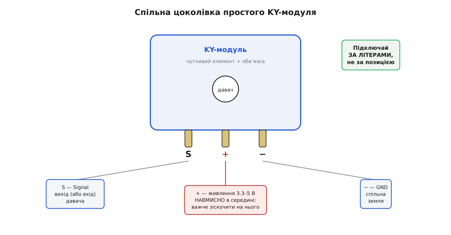
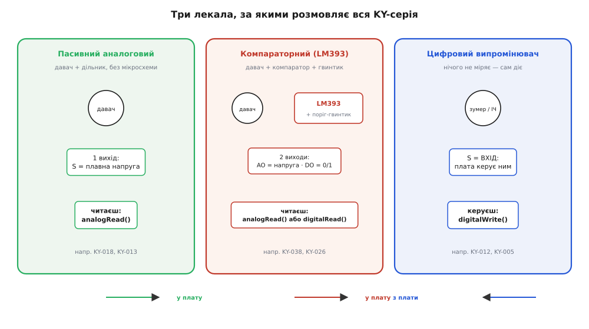

# KY-серія (Keyes 37-в-1)

<preknowlist>
- [Мікроконтролер: що всередині](book:programming/mcu-blocks) — процесор, пам'ять і піни вводу-виводу на одному кристалі; саме до цих пінів KY-модуль і чіпляється трьома дротами.
- [Рівні «0» і «1»](book:electronics/logic-levels-as-ranges) — що таке 5-вольтова й 3.3-вольтова логіка й чому їх не плутають наосліп; половина сумісності KY-модулів залежить від того, на яких вольтах живиться плата.
- [Дільник напруги](book:electronics/voltage-divider) — два опори послідовно ділять напругу пропорційно; на цьому побудовані найпростіші KY-давачі (фоторезистор, термістор).
- [Компаратор](book:electronics/comparator) — схема, що каже «більше/менше за поріг» одним цифровим бітом; це серце всіх KY-модулів із мікросхемою LM393 і підстроювальним гвинтиком.
- [АЦП](book:electronics/adc) — як мікроконтролер перетворює аналогову напругу на число; без нього аналоговий вихід KY-модуля — просто вольти, які нема куди подіти.
</preknowlist>

Розкрий будь-який стартовий набір «37 давачів для Arduino» — і побачиш акуратну коробку з невеличких платок кольору електрик, кожна завбільшки з поштову марку, кожна з чорною гребінкою на два-три штирі й дрібним написом на кшталт **KY-013** чи **KY-038**. Це KY-серія: не один пристрій, а ціла **сімʼя з майже чотирьох десятків модулів** одного роду й одного почерку. Придбавши таку коробку раз, ти отримуєш будівельний конструктор давачів — і майже завжди перше, що новачок під'єднує до своєї плати, має напис «KY» на звороті.

Розберімо цю родину так, щоб упізнати її серед іншого заліза, зрозуміти, звідки в неї така єдина порода й чому всі ці модулі влаштовані за кількома однаковими лекалами, — і, найголовніше, щоб навчитися **обирати потрібний варіант і не спалити його першим же дротом**. Бо за впізнаваною зовнішністю ховається кілька простих правил, і щойно ти їх бачиш, уся серія перестає здаватися купою однакових синіх платок і стає зрозумілою мапою.

## Одна порода: що таке KY-модуль

KY-модуль — це не сам давач, а **давач, уже посаджений на маленьку плату** й доведений до стану «встромив три дроти — працює». Уяви голий фоторезистор: дві ніжки, і сам по собі він нічого не «видає» — треба ще опір-пару, щоб перетворити його зміну опору на зміну напруги, треба гребінку, щоб зручно під'єднати. Саме це KY-плата й робить: бере чутливий елемент (фоторезистор, термістор, геркон, датчик Голла, мікрофон, пʼєзо), додає навколо нього **обвʼязку — той мінімум деталей, без яких елемент незручний**, і виводить усе на стандартну гребінку. Ти працюєш не з фізикою давача, а з готовим модулем.

Ключове усвідомлення, з якого випливає геть усе інше в цій серії: **KY — це бренд і формат, а не тип давача**. Літери «KY» походять від назви **Keyes** — китайської компанії [Shenzhen KEYES / Keyestudio](book:sensors/ky-series/hist-keyes-brand.md), що склала цей набір і дала модулям наскрізну нумерацію. Тобто KY-013 і KY-018 не мають нічого спільного за фізикою (один міряє температуру, другий — світло), зате мають спільне **походження, розмір, спосіб підключення й манеру поведінки**. Це як серія книжок одного видавництва: зміст різний, а обкладинка, шрифт і формат — єдині. Саме цей єдиний формат і робить KY-серію такою зручною для навчання: опанувавши одну платку, ти вже знаєш, як під'єднати будь-яку іншу.

Практичний бік цього простий: коли бачиш у схемі чи в списку деталей «KY-XXX», не шукай, що то за загадковий давач «KY», — шукай **номер**. Номер і є вся інформація: KY-018 — завжди фоторезистор, KY-040 — завжди поворотний енкодер, хоч би хто його спаяв. А літери «KY» кажуть одне: чекай стандартну гребінку, живлення 3.3–5 В і поведінку за одним із кількох знайомих лекал.

Що важливо для впізнавання: KY-серію давно **копіюють усі кому не ліньки**. У наборах від ELEGOO, SunFounder, Joy-IT, безіменних продавців ти знайдеш ті самі модулі під тими самими номерами — бо схеми прості й ніким не замкнені. Тому «KY-модуль» сьогодні означає радше **стандарт де-факто**, ніж товар конкретної фірми: номер і цоколівка спільні, а хто саме спаяв конкретну платку — часто й не вгадаєш. Спільну історію бренду й те, як він став цим стандартом, винесено окремо — [звідки взялася KY-серія](book:sensors/ky-series/hist-keyes-brand.md); тут нам вистачить того, що **номер важливіший за виробника**.

## Гребінка на три штирі: перше, чого стерегтися

Придивись до будь-якого простого KY-модуля — і побачиш три штирі гребінки. Це найважливіша спільна риса серії, і саме на ній найлегше спіткнутися.

Позначення на платі майже завжди такі:

```
S   —  сигнал (Signal): те, заради чого модуль існує; сюди йде вихід давача
+   —  живлення (VCC): 3.3 В або 5 В від плати
−   —  спільна земля (GND)
```

Здавалося б, просто. Але тут криється **улюблена пастка новачка**, і вона варта того, щоб її назвати прямо. На переважній більшості KY-модулів живлення (+) — це **середній штир**, а не крайній. Логіка розробника була в тому, що переплутати місцями два крайні дроти (сигнал і землю) не так страшно — а от помилитися з живленням найгірше, тож його сховали в середину, звідки випадково зіскочити важче. Наслідок для тебе: **дивись на буквені позначення, а не на порядок штирів**. Звичка «крайній — це плюс» тут зраджує.



*Спільна цоколівка простого KY-модуля. Сигнал (S) і земля (−) — по краях, живлення (+) — навмисно в середині, щоб випадкове зісковзування дроту не подало живлення туди, куди не треба. Головне правило: підключай за літерами, а не за позицією.*

І одразу вилка, з якою стикнешся: **на яких вольтах живити?** Більшість KY-модулів усеїдні — працюють і від 3.3 В, і від 5 В, бо всередині або пасивний елемент, або невибаглива мікросхема. Але є два наслідки, які треба тримати в голові. По-перше, **рівень сигналу на виході дорівнює напрузі живлення**: нагодуєш модуль 5 вольтами — і на піні S зʼявляться 5-вольтові рівні, а це вбʼє 3.3-вольтовий вхід сучасної плати. По-друге, деякі аналогові модулі при 5 В дають ширший розмах напруги (зручніше читати), тому їх часто й живлять від 5 В, коли плата це терпить. Правило просте: живлення модуля бери **під логіку своєї плати**, а не навпаки. Що таке ці рівні й чому 5 В на 3.3-вольтовому вході — біда, розібрано в [рівнях «0» і «1»](book:electronics/logic-levels-as-ranges).

Ціна недбалості тут конкретна: дві хвилини на звірку позначень «S / + / −» перед першим під'єднанням економлять годину пошуку «чому нічого не працює» — або згорілий модуль. Класичний випадок: живлять [аналоговий термістор KY-013](book:sensors/ky-013-thermistor), плутають середній штир із крайнім, подають живлення на сигнальний пін — і АЦП показує сміття, а часом плата гріється. До того ж у межах серії буває розкид: на окремих модулях середній штир не задіяний зовсім, тож єдиної істини «завжди так» немає — є **завжди дивись на букви**.

## Три лекала: як модуль розмовляє з платою

Попри те, що давачів у серії майже чотири десятки, розмовляють вони з мікроконтролером **лише за трьома схемами**. Розпізнати, за якою саме працює конкретний модуль, — це половина вміння з ним поводитися, бо від цього залежить, як його читати в коді й скільки пінів плати він забере.



*Три лекала, за якими влаштована вся серія. Ліворуч: пасивний аналоговий — віддає плавну напругу, читаєш АЦП. У центрі: компараторний з LM393 — має гвинтик-поріг і два виходи (плавний AO та цифровий DO). Праворуч: цифровий випромінювач — сам нічого не міряє, а вмикається сигналом плати. Стрілка показує, куди тече інформація.*

**Лекало перше — пасивний аналоговий давач.** Найпростіше, що буває. Усередині — чутливий елемент, увімкнений [дільником напруги](book:electronics/voltage-divider) з постійним опором: змінюється фізична величина → змінюється опір елемента → змінюється напруга на піні S. Жодної мікросхеми, жодного налаштування. Твоя робота — прочитати цю напругу [аналого-цифровим перетворювачем](book:electronics/adc) і за нею судити про величину. Так влаштовані [фоторезистор KY-018](book:sensors/ky-018-photoresistor) (світло) і [термістор KY-013](book:sensors/ky-013-thermistor) (температура). Модуль займає **один аналоговий пін** плати.

:::tabs
```cpp
// Пасивний аналоговий KY-модуль (напр. KY-018 — світло).
// S → аналоговий пін A0; + → 5 В; − → GND.
int raw = analogRead(A0);        // 0..1023: більше світла — інше число
// «сирі» одиниці АЦП; у люкси/градуси переводять калібруванням давача
```
```python
# Пасивний аналоговий KY-модуль (напр. KY-018 — світло).
# S → аналоговий пін 34; + → 3.3 В; − → GND.
from machine import ADC, Pin

adc = ADC(Pin(34))               # аналоговий вхід ESP32
adc.atten(ADC.ATTN_11DB)         # повний діапазон входу ~0..3.3 В
raw = adc.read()                 # 0..4095: більше світла — інше число
# «сирі» одиниці АЦП; у люкси/градуси переводять калібруванням давача
```
:::

**Лекало друге — компараторний модуль на LM393.** Тут з'являється мікросхема — здвоєний [компаратор LM393](book:electronics/comparator) — і **синій підстроювальний резистор** (гвинтик, який крутять маленькою викруткою). Ідея: давач дає аналогову напругу, а компаратор порівнює її з порогом, який ти виставляєш тим гвинтиком, і видає **просте «так/ні»**. Тому такий модуль має зазвичай **чотири піни**, а не три, бо виходів два:

```
AO  —  Analog Out: та сама плавна напруга давача (читаєш АЦП, як у лекалі 1)
DO  —  Digital Out: «0» або «1» — спрацював поріг чи ні (крутиш гвинтик — рухаєш поріг)
```

DO зручний, коли тобі треба лише факт події («стало голосно», «зайнялося полум'я»), а не число: чіпляєш DO до звичайного цифрового піна й чекаєш зміни. AO дає повну картину, коли важлива величина. Так влаштовані [мікрофонний давач KY-038](book:sensors/ky-038-mic), [давач полум'я KY-026](book:sensors/ky-026-flame) і чимало інших «порогових» модулів серії. Пастка тут своя: **DO — інвертований** на багатьох платах (спокій = «1», подія = «0»), тож перед тим як писати логіку, поглянь очима на світлодіод спрацювання й звір, у який бік він міняється.

:::tabs
```cpp
// Компараторний KY-модуль (напр. KY-038 — звук).
// DO → цифровий пін 2; + → 5 В; − → GND.  Поріг — гвинтиком на платі.
pinMode(2, INPUT);
if (digitalRead(2) == LOW) {     // на багатьох платах подія = LOW (звір по світлодіоду!)
  // тут — «стало голосно понад поріг»
}
```
```python
# Компараторний KY-модуль (напр. KY-038 — звук).
# DO → цифровий пін 4; + → 3.3 В; − → GND.  Поріг — гвинтиком на платі.
from machine import Pin

do = Pin(4, Pin.IN)
if do.value() == 0:              # на багатьох платах подія = LOW (звір по світлодіоду!)
    pass                         # тут — «стало голосно понад поріг»
```
:::

**Лекало третє — цифровий модуль-випромінювач.** Найдивніший на тлі решти, бо він **нічого не міряє** — навпаки, щось *робить* за командою плати. Сюди належать [активний зумер KY-012](book:actuators/ky-012-buzzer), [ІЧ-передавач KY-005](book:connect/ky-005-ir-tx), світлодіодні модулі. Пін S тут — **вхід**, а не вихід: подаєш на нього «1» — модуль пищить, світить чи стріляє інфрачервоним променем. По суті це не давач, а маленький виконавчий пристрій у тому самому корпусі серії. Стерегтися тут теж є чого: на активному зумері KY-012 середній штир нерідко **зовсім не задіяний** (живлення йде через сигнальний пін), тож звична схема «+ у середину» на ньому не працює — знову ж таки, читай написи конкретної платки.

:::tabs
```cpp
// Цифровий випромінювач (напр. KY-012 — активний зумер).
// S → цифровий пін 8; − → GND.
pinMode(8, OUTPUT);
digitalWrite(8, HIGH);           // пищить
delay(200);
digitalWrite(8, LOW);            // тиша
```
```python
# Цифровий випромінювач (напр. KY-012 — активний зумер).
# S → цифровий пін 8; − → GND.
from machine import Pin
import time

buzzer = Pin(8, Pin.OUT)
buzzer.value(1)                  # пищить
time.sleep_ms(200)
buzzer.value(0)                  # тиша
```
:::

Практична сила цього поділу в тому, що він вирішується до першого рядка коду. Перш ніж писати під новий KY-модуль, спитай себе: до якого з трьох лекал він належить? Є гвинтик і мікросхема з написом LM393 — компараторний, шукай AO/DO і будь готовий до інверсії DO. Немає нічого, крім давача й пари опорів, — пасивний аналоговий, читай АЦП. Пін підписаний як вхід, а сам «давач» насправді щось випромінює — це випромінювач, керуй ним `digitalWrite`. Знаючи лекало наперед, ти вже знаєш і `analogRead` тут чи `digitalRead`, і скільки пінів забере модуль, і де саме тебе підстерігає пастка.

## Як обрати варіант із коробки

Коли перед тобою відкрита коробка на 37 (а буває й на 48) модулів, питання не «який давач кращий», а «**який номер робить те, що мені треба**». Орієнтуйся не за виглядом платок (вони майже однакові), а за завданням — і за тим, у якому вигляді тобі потрібна відповідь.

Спершу — **що ти хочеш відчути**. Світло веде до [KY-018](book:sensors/ky-018-photoresistor); температуру просто й дешево дає аналоговий [KY-013](book:sensors/ky-013-thermistor); звук — [KY-038](book:sensors/ky-038-mic); полум'я — [KY-026](book:sensors/ky-026-flame); наявність магніту чи спрацювання від піднесеного магніту — [давач Голла KY-003](book:sensors/ky-003-hall); вібрацію чи стук — KY-002; поворот ручки з лічбою «клац-клац» — [енкодер KY-040](book:sensors/ky-040-encoder); напрям похитування — [джойстик KY-023](book:sensors/ky-023-joystick). Номерів багато, але кожен закриває одну конкретну величину, і повний перелік із того самого набору легко звірити за номером.

Потім — **у якому вигляді потрібна відповідь**, бо для деяких величин у коробці є *дві* платки, і вибір між ними — це насправді вибір лекала:

- Треба **саме число** (наскільки яскраво, наскільки гаряче) → бери **аналоговий** варіант і читай АЦП. Точніше, але забирає аналоговий пін і трохи коду на переведення в осмислені одиниці.
- Треба лише **факт події** (стало занадто / спрацювало / ні) → бери **компараторний з DO**, вистав поріг гвинтиком, чіпляй до цифрового піна. Простіше в коді, але поріг доводиться підкрутити руками, і DO часто інвертований.

Нарешті — **скільки в тебе пінів і на яких вольтах плата**. Компараторні модулі просять чотири піни (якщо тягнеш і AO, і DO), пасивні — три, випромінювачі — часом два. А напругу живлення завжди узгоджуй з логікою плати, щоб рівень на S їй пасував. Ці три питання — що відчути, у якому вигляді, якою ціною пінів — відсікають більшість варіантів одразу й лишають один-два номери.

Цим і добра KY-серія як навчальний майданчик: помилятися на ній дешево — платки коштують копійки, їх багато, зайву не жалко спалити. Але дешевизна має зворотний бік: якість модулів у наборі нерівна, а «даташит» часто зводиться до одного малюнка з цоколівкою десь у мережі. Тому золоте правило роботи з серією одне — не вір вигляду й назві сліпо: звіряй буквені позначення й лекало конкретної платки перед підключенням, а точні одиниці аналогових давачів здобувай калібруванням, бо два KY-018 з однієї коробки можуть давати помітно різні числа за того самого світла.
