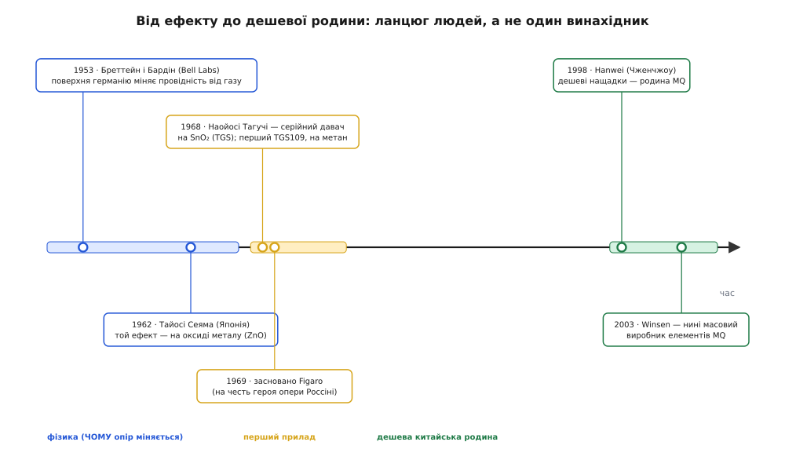
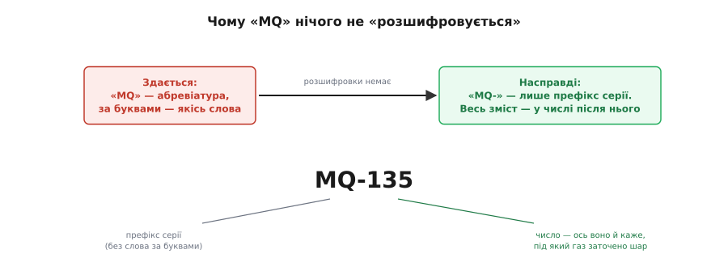

# 📜 Як гарячий камінець навчили нюхати газ: від Bell Labs до дешевої родини MQ

<preknowlist>
- [Напівпровідник](book:physics/semiconductor) — матеріал, чия провідність не стала, а сильно залежить від домішок, температури й того, що осіло на поверхні; уся ця історія — про те, як помітили й приручили останнє.
- [Що таке давач](book:electronics/what-is-a-sensor) — пристрій, що обертає фізичну чи хімічну величину на електричний сигнал; тут ідеться, як народився цілий клас таких пристроїв — давачі газу.
</preknowlist>

Візьміть у руку будь-який дешевий давач газу — ту саму металеву бочечку в сітчастому ковпачку — і ви тримаєте кінець дуже довгої нитки. На одному її кінці — двоє фізиків у Bell Labs, які 1953 року намагалися зрозуміти зовсім інше й раптом побачили, що поверхня напівпровідника «чує» повітря довкола. На іншому — цех у китайському Чженчжоу, який штампує ці бочечки мільйонами під наліпкою «MQ». Між ними — майже пів століття, кілька країн, аматор опери, який назвав фірму на честь оперного героя, і одна вперта фізична загадка, що довго не хотіла ставати дешевим приладом.

Історію тут варто знати не заради дат. Вона пояснює дві речі, які інакше здаються примхою: **чому давач газу мусить бути гарячим** (а отже — ненажерливим і теплим) і **чому «MQ» нічого не розшифровується** — це не абревіатура з таємним змістом, а просто заводський штрих-код серії, що приліпився до ідеї, яку до Китаю встигли зробити троє інших людей у двох інших країнах. Розплутаймо нитку з того кінця, де вона починається — із загадки.

## Загадка: чому «камінь» узагалі реагує на повітря

Уявімо, що ви фізик початку 1950-х і вивчаєте поверхню германію — щойно народженого героя транзисторної революції. Ви міряєте, як він проводить струм, і раптом помічаєте прикру річ: **число не тримається**. Ви не змінили ні напруги, ні температури, а провідність поверхні повзе — то так, то інак, залежно від того, чим ви щойно дихнули на зразок чи яку пару впустили в камеру. Для того, хто хоче точних вимірів, це шум, від якого хочеться позбутися. Але за цим «шумом» ховається новий клас приладів.

Розберімо, **чому** так стається, бо весь дальший ланцюг — люди, фірми, дешева родина — виростає саме з цього механізму. Напівпровідник проводить струм вільними електронами. Біля самої поверхні кристала все не так, як усередині: обірвані зв'язки й чужі молекули, що на неї сіли, можуть **ловити** ці вільні електрони або, навпаки, **віддавати** їх назад у матеріал. А скільки в матеріалі вільних електронів — то і є його провідність. Отже, поверхня напівпровідника — це не інертна межа, а хімічно жива площина, чия «залюдненість» носіями струму залежить від того, що на ній осіло. Зміните повітря над нею — зміните, скільки електронів вона тримає в полоні, — зміните провідність. Ось і вся розгадка «повзучого числа»: прилад не ламається, він **чує** атмосферу.

> 🔧 **Навіщо це.** Тут захований корінь усього. Якщо провідність напівпровідника залежить від газу над поверхнею, то поверхню можна перетворити з джерела шуму на **вимірювач газу** — треба лише зробити цей ефект великим і керованим. Уся наступна історія — це шлях від «прикрого дрейфу в лабораторії» до «дешевої бочечки, що спрацьовує на витік», і кожен її крок додає одну відповідь: як зробити ефект сильнішим, стабільнішим, дешевшим.

## Бреттейн і Бардін: ефект помічено (США, 1953)

Двоє, хто вперше акуратно описав це для напівпровідника, — американські фізики **Волтер Бреттейн** (англ. Walter H. Brattain) і **Джон Бардін** (англ. John Bardeen) з Bell Telephone Laboratories. Обоє — з першої лінії транзисторної історії: разом із Вільямом Шоклі вони роком раніше вже зробили те, за що всі троє 1956 року дістануть Нобелівську премію з фізики, — точковий транзистор. А в січні 1953 року в *Bell System Technical Journal* виходить їхня робота «Surface Properties of Germanium» — «Поверхневі властивості германію», де вони показують: контактний потенціал поверхні германію можна **перемикати** між двома станами, просто міняючи газ над зразком.

```
Стан поверхні германію (Бреттейн і Бардін, 1953):
  озон / перекисні пари   →  один крайній потенціал
  пари з OH-групами       →  інший крайній потенціал
  різниця між станами     ≈  0.5 В
```

Це був прямий доказ, що біля вільної поверхні напівпровідника існує **шар просторового заряду**, чутливий до навколишнього газу. Мовою нашої нитки: вони довели, що поверхня германію **чує повітря** — і що це не артефакт, а фундаментальна властивість.

Дату варто вимовити обережно, бо джерела трохи розходяться. Стаття в журналі — **1953** рік (том 32, стор. 1–41); частина оглядів із теорії давачів відносить «перший опис газочутливості напівпровідника» до **1952** — вочевидь маючи на увазі ранішу доповідь чи препринт тієї самої групи. Розбіжність — на рік і не про суть: усталений факт у тому, що **саме Бреттейн і Бардін на початку 1950-х першими показали газочутливість напівпровідника** на германії. Але — увага — це ще **не давач**. Це фізичне спостереження на германії, зроблене мимохідь людьми, які полювали на зовсім іншу здобич — на транзистор. Від нього до бочечки в ковпачку лежатиме ще півтора десятиліття.

## Хейланд і Сеяма: ефект переселяють на оксид (Німеччина 1954, Японія 1962)

Германій для давача газу — поганий матеріал: дорогий, крихкий до хімії, псується. Щоб ідея стала практичною, ефект треба було **переселити** з германію на щось дешеве, стійке й таке, що любить бути гарячим. Цей крок зробили не в Америці.

1954 року німецький фізик **Ґеорґ Хейланд** (нім. Georg Heiland) показав, що провідність **оксиду цинку** (ZnO) так само залежить від складу навколишнього газу — від того, скільки довкола кисню. Це вже інший клас матеріалів: не крихкий напівпровідниковий кристал, а **оксид металу**, який спокійно живе розжареним. А 1962 року японський хімік **Тайосі Сеяма** (яп. 瀬山多喜雄, англ. Taiyoshi Seiyama) з колегами акуратно виміряв те саме на тонких плівках ZnO й сформулював як принцип: **адсорбція чи десорбція газу на поверхні оксиду металу змінює його провідність**. Це вже не побічне спостереження, а свідома заява: оксид металу можна використати як індикатор газу.

Чому це поворотний пункт нитки, а не просто ще один рядок дат? Бо саме тут ефект стає **придатним для приладу**. Оксид металу дешевий, його можна нанести тонкою плівкою на керамічну трубочку, і — головне — він працює саме тоді, коли гарячий: висока температура розганяє поверхневу хімію, робить реакцію швидкою й оборотною. Ось звідки в кожного майбутнього давача газу вбудований нагрівач і постійне тепло: це не примха конструктора, а спадок від переселення ефекту на оксид у 1950–60-х. Германій «чув» повітря холодним і випадково; оксид металу навчили чути навмисне — і за це заплатили тим, що його треба тримати розжареним.

```
Ланцюг матеріалу — чому давач мусить бути гарячим:
  германій (1953)   — чує повітря, але крихкий і холодний → не прилад
  оксид ZnO (1954)  — той самий ефект, але дешевий і стійкий
  оксид гарячий     — поверхнева хімія швидка й оборотна → робочий давач
```

## Наойосі Тагучі й Figaro: ефект стає товаром (Японія, 1968–1969)

Знати принцип — ще не мати прилад. Між «оксид металу міняє опір від газу» і «дешева бочечка, що врятує від витоку» лежить інженерна прірва: треба обрати конкретний матеріал, домішки-каталізатори, форму, нагрівач, схему — і зробити це так, щоб виходило дешево, повторювано й надійно. Цю прірву перейшов **один японський інженер**, і зробив це не з академічної цікавості, а від біди.

**Наойосі Тагучі** (яп. 田口尚義, англ. Naoyoshi Taguchi) на початку 1960-х спостерігав, як Японія, що бурхливо газифікувалася, платить за це вибухами побутового газу. Потрібен був дешевий масовий давач, який спрацює на витік раніше за іскру. Тагучі перебрав матеріали й зупинився на **діоксиді олова** (SnO₂) — оксиді, у якого газочутливість виходила особливо зручною для простого приладу. Він довів конструкцію до серії: керамічна трубочка з плівкою SnO₂ і вплетеною спіраллю-нагрівачем — рівно те, що й досі сидить під ковпачком будь-якого дешевого давача газу.

І тут важлива дата, теж із обережністю. Масовий випуск давачів під назвою **TGS** (англ. *Taguchi Gas Sensor* — «давач газу Тагучі») фірма почала **1968 року**; перший продукт — **TGS109**, налаштований на горючий газ, передусім метан. Саму фірму **Figaro** засновано **1969 року**. Опорні патенти Тагучі на «елемент, що визначає гази» подано трохи згодом — із японським пріоритетом від **грудня 1969-го**, а видано в США 1971–1972 роках (напр. US 3631436, US 3644795, винахідник — Naoyoshi Taguchi).

```
Тагучі й Figaro — акуратні дати:
  1968   мас-виробництво давачів TGS; перший — TGS109 (метан)
  1969   засновано фірму Figaro
  1969   японський пріоритет ключових патентів Тагучі
  1971+  ті патенти видано у США (US 3631436, US 3644795 …)
```

Ось чому в різних джерелах «перший комерційний оксидний давач газу» датують то 1968-м, то 1971-м — і це не суперечність, а різні точки одного шляху: **1968** — коли Figaro почала продавати TGS; **1969** — коли з'явилася фірма й пріоритет; **1971** — коли патент дозрів. Усе це про одну людину й один прилад. Усталений факт: **робочий, серійний, дешевий давач газу з лабораторного ефекту зробив саме Наойосі Тагучі наприкінці 1960-х**, і його ім'я — прямо в назві TGS.

І тут — людська деталь, без якої історія була б суха. **Чому «Figaro»?** Тагучі був палким шанувальником опери. Фірму він назвав на честь **Фігаро — героя опери Джоаккіно Россіні «Севільський цирульник»** (італ. *Il barbiere di Siviglia*), щоб ім'я відбивало жвавість, завзяття й цікавість, як у самого спритного цирульника. (Це саме россінівський Фігаро з «Севільського цирульника», а не пізніший моцартівський із «Весілля Фігаро» — той самий персонаж П'єра Бомарше, але опера й композитор інші.) Дрібниця? Так. Але вона пояснює, чому назва фірми — оперна, а не технічна: за нею стояла людина з характером, а не абревіатура з технічного завдання. Тримайте це в голові — воно знадобиться, коли ми дійдемо до «MQ».

> 🔧 **Навіщо це.** Розрізняйте «мати ідею» й «зробити прилад». Ефект відкрили фізики в Bell (1953), на оксид його переселили Хейланд (1954) і Сеяма (1962), — але **давачем** він став лише тоді, коли Тагучі обрав SnO₂, додав нагрівач і форму й довів усе до дешевої серії (1968). Винахід — це майже завжди ланцюг, а не спалах: одна людина «побачила», інша «пояснила», третя «зробила товар». Плутати ці ролі — значить приписувати комусь одному чужу частину роботи.


*Не один винахідник, а ланцюг людей у кількох країнах, розтягнутий майже на пів століття. Між «зрозуміли ефект» (Бреттейн і Бардін, 1953) і «продають прилад» (Тагучі, 1968) минуло близько п'ятнадцяти років — і ще тридцять до дешевої масової родини.*

## Китайські нащадки: як принцип Тагучі здешевили до родини MQ

Тагучі зробив давач **добрим**. Китайські виробники зробили його **дешевим і всюдисущим** — і саме тому в аматорських наборах лежить не TGS від Figaro, а бочечка з написом «MQ».

Первісний виробник родини MQ — **Hanwei Electronics** (кит. 汉威; повна назва — Hanwei Electronics Group), заснована **1998 року** в місті **Чженчжоу** (провінція Хенань). Це видно навіть із даташитів: технічні описи MQ-2, MQ-135 та решти історично виходять під логотипом Hanwei. Згодом — і донині — чутливі елементи цієї родини масово робить інша чженчжоуська фірма, **Winsen** (повна назва — Zhengzhou Winsen Electronics Technology), заснована **2003 року**; сьогодні саме її ім'я найчастіше стоїть за MQ-елементами, тоді як плату навколо давача складають десятки дрібних майстерень під одним форм-фактором.

Що саме тут «здешевили»? Не фізику — вона лишилася Тагучевою: та сама гаряча плівка SnO₂, чий опір падає в присутності горючого газу. Здешевили **все навколо**: спрощена керамічна основа, масова спіраль-нагрівач, грубе заводське калібрування «в середньому по партії» замість індивідуального, дешевий сітчастий ковпачок, стандартна плата-обв'язка з дільником і компаратором, яку клепають тисячами. Ціна впала з приладової до «кілька монет за штуку», а разом із нею впала й точність: масовий MQ дає радше «більше/менше газу», ніж чесні проміле. Це класичний шлях зрілої технології: коли фізика відпрацьована й патенти вичерпані, з дорогого точного приладу роблять дешевий масовий — доступний усім і рівно настільки точний, наскільки дозволяє ціна.

## Чому «MQ» нічого не «розшифровується»

Тепер зберімо докупи те, заради чого й варто було знати всю нитку. Люди звикли, що літерна назва щось означає: TGS — це *Taguchi Gas Sensor*, кожна буква на місці. І, дивлячись на «MQ», підсвідомо шукають таку саму розшифровку — які ж два слова за цими буквами? А розшифровки **немає**.

«MQ» — це **заводський префікс серії** Hanwei, а не абревіатура-слово. За «M» і «Q» не стоїть пари термінів, які можна розкрити, — так само як за «TGS» стоїть ім'я людини, а за «Figaro» стоїть оперний герой. Різниця в тому, що назви Тагучі несли зміст (ім'я винахідника, улюблена опера), а китайський префікс змісту не несе взагалі: він лише каже «це наша серія давачів газу». **Увесь зміст перенесено з букв у число після них.** Саме число — MQ-2, MQ-7, MQ-135 — і є носієм інформації: воно вказує, під який газ заточено чутливий шар. Літери — просто ярлик серії, число — суть.


*«TGS» несе ім'я винахідника, «Figaro» — оперного героя; а «MQ» не несе слова взагалі — це заводський префікс серії. Тому не шукайте за буквами розшифровки: інформацію переклали з букв у число після них.*

Ось чому цю історію варто знати навіть тому, хто просто хоче ввімкнути давач. Вона знімає дві оманки одразу. Перша: що гарячий давач газу — то «дешеве погано зроблено»; насправді тепло вбудоване в саму фізику ще від переселення ефекту на оксид у 1950-х, і навіть дорогий Figaro так само гарячий. Друга: що в «MQ» захований якийсь сенс, який треба розгадати; насправді сенс — лише в числі, а букви дісталися родині від китайського заводу, який підхопив і здешевив ідею, доведену до товару японцем, пояснену Сеямою й підмічену двома фізиками в Bell Labs, що полювали зовсім на інше.

> 🔧 **Навіщо це.** Коли наступного разу побачите незнайому бочечку з літерами й числом, не питайте «як розшифрувати букви» — питайте «що каже число і хто це зробив». Літери часто лише префікс серії; суть — у номері та в тому, чий це рід. А тепло, ненажерливість і потреба прогріву — не вади конкретної дешевої платки, а спадок пів століття історії, у якій ефект із германію переселили на гарячий оксид, щоб він узагалі став приладом.
