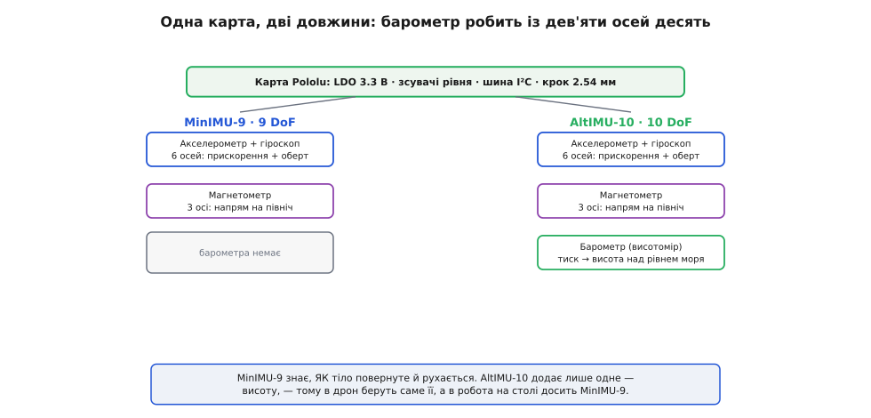
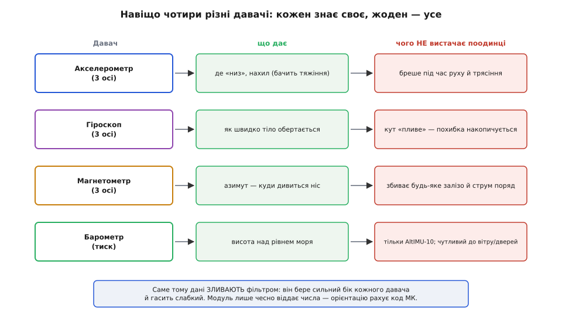
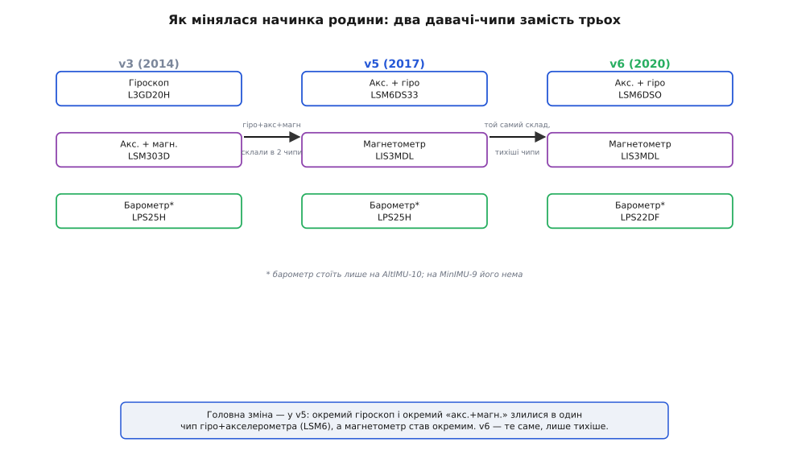

# Родина Pololu IMU (MinIMU-9 / AltIMU-10)

<preknowlist>
- [IMU-давач](topic:electronics/imu) — що таке блок інерційного вимірювання й навіщо він потрібен; без цього незрозуміло, що взагалі міряють ці плати.
- [Шина I²C](topic:communications/i2c-bus) — дводротовий інтерфейс SDA/SCL з адресами й підтяжками; саме ним усі чипи родини говорять із мікроконтролером.
- [MEMS](topic:electronics/mems) — мікромеханіка на кремнії, з якої зроблено акселерометр і гіроскоп; пояснює, чому давач такий крихітний і чому боїться вібрації.
- [Рівні «0» і «1»](topic:electronics/logic-levels-as-ranges) — що таке 3.3- і 5-вольтова логіка й чому їх не можна плутати; від цього залежить, згорить плата чи ні.
</preknowlist>

Візьміть до рук будь-яку з крихітних зелених плиток Pololu з написом **MinIMU-9** чи **AltIMU-10** — і ви тримаєте представника однієї добре продуманої лінійки інерційних модулів. За обома назвами ховається не випадковий розсип плат, а **родина** з єдиним задумом: узяти найкращі на свій час інерційні мікросхеми від ST і посадити їх на зручну плату так, щоб давач із заводським кроком виводів 0.5 мм перетворився на деталь, з якою реально працювати на столі. Тому знати ці модулі варто саме як родину — спільну ідею, спільну архітектуру й спільну логіку версій, — а не як окремі товари. Тоді назва нового модуля читається сама: побачивши «AltIMU-10 v6», ви одразу знаєте, скільки в ньому осей, які чипи всередині й чим він відрізняється від сусіда по полиці.

Не вміючи так читати ім'я, легко взяти не те — наприклад, замовити MinIMU-9 туди, де потрібна висота (а її дає лише AltIMU-10), або завести бібліотеку під старий чип, тоді як на новій платі стоїть інший. Така плутанина коштує грошей і зайвого дня на переробку прошивки, і саме від неї рятує звичка бачити в імені дві координати — гілку й версію.

Розберімо, що всі ці плати об'єднує, як родина ділиться на дві гілки (звичайну й з висотоміром), як мінялася її начинка від версії до версії й, головне, як під свою задачу обрати правильний варіант. Докладний розбір конкретної плати — з розводкою пін-у-пін, адресами й кодом — лишимо самій платі: [Pololu MinIMU-9 v5](topic:sensors/pololu-imu) розписано окремо, і тут ми його не переказуємо.

## Спільний задум: карта для інерційних чипів

Слово, яке пояснює всю родину, — **карта** (англ. *carrier* — тримач, носій). Сучасний інерційний давач ST випускає як мікросхему для поверхневого монтажу: корпус кілька міліметрів, контактні майданчики під днищем із кроком 0.5 мм, живлення суворо 3.3 вольта. Припаяти таке руками неможливо, на макетну плату не встромиш, а без кількох зовнішніх деталей воно й не запрацює. Карта Pololu розв'язує це раз і назавжди: чип уже припаяно на заводі, навколо додано все потрібне, а виводи винесено на гребінку зі звичним кроком 2.54 мм.

Ось що спільне для всієї родини й чому воно там є.

**Мікросхеми — тільки від ST.** Це не випадковість, а стрижень лінійки: усі інерційні чипи тут одного виробника — STMicroelectronics. Завдяки цьому вони говорять схожою «мовою» (регістри, механіка I²C, регістр упізнання), а Pololu може підтримувати спільні бібліотеки на всю родину. Конкретні чипи міняються від версії до версії, але постачальник — незмінний.

**Регулятор 3.3 вольта.** На платі стоїть лінійний [стабілізатор із малим спадом (LDO)](topic:electronics/ldo), який приймає від 2.5 до 5.5 В і дає стабільні 3.3 В на всі чипи. Тому модуль можна живити хоч від 5-вольтового Arduino, хоч від 3.3-вольтового ESP32 — усередині все одно буде правильна напруга.

**Зсувачі логічних рівнів на I²C.** Лінії SCL і SDA проходять через двонапрямні [перетворювачі рівнів](topic:electronics/level-shifter). Вони узгоджують тривольтову логіку чипів із тією напругою, яку ви подали на живлення. Подали 5 В — і мікроконтролер спілкується п'ятивольтовою логікою, хоча всередині кремній лишається тривольтовим. Саме це робить будь-який модуль родини безпечним для прямого під'єднання до 5-вольтової плати — те, чим Pololu-карти вигідно різняться від багатьох дешевих аналогів.

**Спільна шина I²C і пін вибору адреси SA0.** Усі чипи модуля сидять на одній внутрішній шині I²C, кожен зі своєю [адресою](topic:communications/i2c-addressing), тож мікроконтролер звертається до кожного окремо. Один вивід — **SA0** — зсуває всі ці адреси на запасні: притягнув SA0 до землі — і можна повісити **дві однакові плати на одну шину**, не сплутавши їх.

Саме ця спільна анатомія й робить родину єдиним цілим: розібравшись із живленням, рівнями та адресами на одному модулі, ви фактично вмієте вмикати їх усі — між MinIMU-9 і AltIMU-10 міняється тільки набір чипів усередині, а спосіб живлення й під'єднання лишається той самий.

## Дві гілки: MinIMU-9 і AltIMU-10

Родина ділиться навпіл дуже просто — за тим, чи є на платі **висотомір**. Усе інше в обох гілках однакове.

*Обидві гілки поділяють ту саму обв'язку (регулятор, зсувачі, шину). MinIMU-9 несе акселерометр+гіроскоп і магнетометр — дев'ять осей. AltIMU-10 додає лише барометр і стає десятиосьовою; саме висота потрібна дрону, тоді як роботу на столі досить дев'ятки.*

Щоб зрозуміти цифри в назвах, треба знати, звідки беруться «осі». **IMU** (англ. *inertial measurement unit* — блок інерційного вимірювання) відчуває власний рух і орієнтацію, не спираючись ні на що зовнішнє — ні на GPS, ні на радіомаяк, а лише на сили, що діють на маленькі маси всередині кремнію. Складається такий блок із трьох різних давачів, і кожен дає свої осі:

- [Акселерометр](topic:electronics/accelerometer) — три осі **лінійного прискорення**. У спокої він відчуває земне тяжіння, тож за ним видно, де «низ» і на скільки градусів плата нахилена.
- [Гіроскоп](topic:electronics/gyroscope) — три осі **кутової швидкості**: як швидко плата обертається навколо кожної осі.
- [Магнетометр](topic:electronics/magnetometer) — три осі **магнітного поля**. Земне поле дає напрям на північ, тож це електронний компас — єдине джерело абсолютного азимута.

Три давачі × три осі = **дев'ять** — звідси дев'ятка в «MinIMU-**9**». Кожен давач поодинці дає неповну картину: акселерометр знає «де низ», але його трясе будь-який рух; гіроскоп ловить швидкі оберти, але його кут повільно «пливе»; магнетометр дає стабільний азимут, але його зводить будь-яка залізяка поряд. Разом же вони покривають слабкі місця одне одного — і математика [поєднання давачів](topic:communications/sensor-fusion) видобуває з дев'яти чисел стійку орієнтацію.

*Акселерометр бачить «низ», але бреше в русі; гіроскоп ловить оберти, але «пливе»; магнетометр дає азимут, але боїться заліза; барометр (лише на AltIMU-10) дає висоту. Жоден не самодостатній — саме тому їх поєднують фільтром, а сам модуль лише чесно віддає числа.*

**AltIMU-10** додає до цих трьох ще один давач — **барометр** (грец. *báros* — вага, тиск): він міряє атмосферний тиск, а з тиску обчислюють висоту над рівнем моря. Це не «десята вісь» у тому ж сенсі, що інерційні (тиск — скалярна величина, а не напрям), але за традицією підрахунку її додають до дев'яти й кажуть «10 DoF» (англ. *degrees of freedom* — ступені свободи). «Alt» у назві — від *altimeter*, висотомір. Барометр дає те, чого не мають перші три давачі: **абсолютну висоту**, а точніше — її швидкі зміни, потрібні дрону, щоб утримувати або міняти висоту польоту. Як саме тиск переводять у висоту й де ця оцінка бреше — розібрано у кроці курсу [барометр-альтиметр](root:embedded/barometric-altimeter).

Важливо, що гілку обирають одразу під задачу: барометр на MinIMU-9 не «доставиш» згодом — його там фізично немає. Тож усе просто — потрібна висота (дрон, будь-що літальне) означає AltIMU-10, а для орієнтації на землі (нахил, курс, стабілізація) досить дев'яти осей MinIMU-9.

## Як мінялася начинка: логіка версій

Родина живе з початку 2010-х і пройшла кілька поколінь. Розбиратися в них варто не заради колекціонування, а тому, що **версія визначає, які саме чипи всередині, а отже — яку бібліотеку й документацію брати**. Ім'я плати Pololu завжди чесно перелічує чипи в дужках, і в цьому вся підказка.

*Ключова зміна сталася у v5: замість «гіроскоп окремо, акселерометр із магнетометром разом» начинку перекроїли на «гіроскоп із акселерометром разом, магнетометр окремо». v6 зберігає той самий склад, лише ставить тихіші й точніші чипи. Барометр (із зірочкою) є тільки на гілці AltIMU-10.*

Найважливіше в цій еволюції — не конкретні партномери, а **як перегрупували функції**. У ранніх версіях (v2–v3, v4) інерційну частину складали два чипи: окремий **гіроскоп** (серія L3G) і окремий кристал, що поєднував **акселерометр із магнетометром** (серія LSM303). Тобто «6 осей руху» жили нарізно з «3 осями поля навпіл».

У **v5** ST випустила зручніший поділ, і Pololu перейшла на нього: тепер один чип (**LSM6**-серія) поєднує **гіроскоп із акселерометром** — рівно ті шість осей, що описують рух, — а магнетометр став окремим кристалом (**LIS3MDL**). Причина проста: гіроскоп і акселерометр роблять з однієї MEMS-технології, тож їх вигідно тримати в одному корпусі, а магнетометр — інша фізика (магніторезистивні елементи), його зазвичай кладуть окремо. Цей поділ — «6 осей руху в одному чипі + магнетометр окремо» — тримається й досі.

**v6** нічого не перекроює: склад той самий, лише інерційний чип оновили на новіший (LSM6DS**O** замість LSM6DS33), а на AltIMU-10 поставили точніший барометр. Виграш — менший шум і вищі можливі частоти виводу; принцип роботи й код майже не змінюються. Повну хронологію поколінь, конкретні партномери кожної версії й те, чому ST раз у раз міняла лінійки, зібрано в [нарисі про еволюцію чипів родини](topic:sensors/pololu-imu-family/hist-chip-lineage.md).

Практичний наслідок цієї історії важливіший за самі номери: **різні версії з однаковою назвою — це різні чипи всередині**, тож перш ніж брати бібліотеку, гляньте на дужки в імені плати або на маркування найбільшої мікросхеми. Добра новина — Pololu тримає це під контролем: одна їхня бібліотека охоплює обидва інерційні чипи (і LSM6DS33, і LSM6DSO), сама впізнаючи, який перед нею. Класична пастка тут — купити плату v6, а завести під неї приклад для v3 з геть іншими регістрами й адресами; страхує від неї те саме правило: версія в назві задає набір чипів, тож готовий код має бути саме під вашу версію (або під універсальну бібліотеку Pololu, що охоплює кілька). А в зворотний бік історія грає на руку — нові версії Pololu тримає сумісними за виводами зі старими, тож апаратно v6 стає на місце v5, і для заміни досить оновити прошивку.

## Як обрати варіант

Звівши все докупи, вибір потрібної плати з родини лягає у три послідовні питання — кожне відсікає частину варіантів.

**Питання перше — потрібна висота?** Це вибір гілки. Ні — беремо **MinIMU-9** (дев'ять осей, дешевше й менше). Так — беремо **AltIMU-10** (ті самі дев'ять осей плюс барометр). Тут немає «кращого» варіанта: зайвий барометр не потрібен роботу на землі, а без нього не обійтися дрону.

**Питання друге — яке покоління?** За інших рівних беріть **найновішу доступну версію** (нині v6): тихіші чипи, вищі частоти, свіжа підтримка бібліотек. Стару версію свідомо беруть лише в одному разі — коли треба пряма заміна вже наявній платі в готовому виробі, щоб не переписувати прошивку. Тоді сумісність за виводами дає змогу поставити ту саму версію, що стояла.

**Питання третє — на якому мікроконтролері працюватимете?** Тут родина зручна тим, що відповідь майже завжди «підійде»: завдяки регулятору й зсувачам рівнів будь-який модуль однаково добре живиться і від 3.3-вольтового ESP32 чи STM32, і від 5-вольтового Arduino Uno. Єдиний виняток, про який варто пам'ятати, — пін SA0: він тривольтовий і не захищений зсувачем, тож ним керують притяганням до землі, а не подачею 5 В. Це вже деталь конкретної плати, і всі такі тонкощі зібрано в її власному описі.

Розумний типовий вибір для навчання й більшості саморобних проєктів — **MinIMU-9 найновішої версії на 3.3-вольтовому мікроконтролері**: дев'яти осей вистачає майже для всього, крім керування висотою, а тривольтовий мозок знімає останні питання рівнів. Щойно задача звужується до польоту з утриманням висоти — береться AltIMU-10 тієї ж версії. А коли модуль уже в руках, далі працюють не з родиною, а з конкретною платою: її розводку, адреси на шині, приклади коду й типові пастки розписано в окремому описі [Pololu MinIMU-9](topic:sensors/pololu-imu), а те, як із дев'яти сирих чисел зробити стійку орієнтацію, — у кроці курсу [оцінка орієнтації](root:embedded/attitude-estimation).
