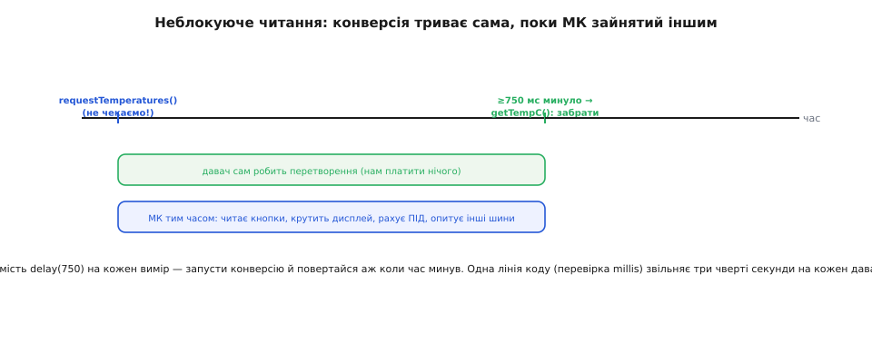

# ⚙️ Проєкт: DS18B20 у коді — від двох рядків бібліотеки до власного драйвера на ніжці

Готова бібліотека читає DS18B20 у два рядки: наказав — забрав число. Це чудово, поки все працює. Але тільки-но давачів стає кілька, або конверсія починає з'їдати три чверті секунди в кожному оберті циклу, або точність починає «плисти» без видимої причини — доводиться зазирнути під бібліотеку й побачити, що там насправді діється на єдиному дроті. Виявляється, «прочитати цифровий термометр» — це провести з ним маленький, але суворий діалог: розбудити шину імпульсом, назвати ім'я потрібного давача, наказати виміряти, зачекати, забрати дев'ять байтів і перевірити, чи не спотворились вони дорогою.

Пройдемо цей діалог згори вниз. Спершу — як його веде за нас `OneWire` + `DallasTemperature` і що саме кожен виклик робить. Потім спустимося на поверх нижче: як адресувати конкретний давач за 64-бітним кодом замість крихкого індексу, як не блокувати програму на 750 мілісекунд, як перемкнути роздільність. І нарешті — на саме дно: напишемо власний драйвер, що смикає ніжку мікроконтролера тайм-слот за тайм-слотом, читає біт за тривалістю притискання, забирає scratchpad і сам рахує CRC. Той самий діалог, але тепер видно кожен його такт.

Код усюди — справжня прошивка, C/C++ під Arduino (перевірено на ESP32 і ATmega328P) та ескіз під голі регістри STM32. Не псевдокод: типи, імена регістрів, тайминг у мікросекундах — усе таке, як воно компілюється й заливається.

## Задача й ідея

Задача звучить обманливо просто: **дістати з DS18B20 число градусів**. Обман у слові «просто» — бо давач цифровий і живе на [шині 1-Wire](book:communications/one-wire), а це означає, що жодного «прочитати регістр» одним рухом тут немає. Число доводиться **виторговувати** послідовністю точно відміряних імпульсів по одному-єдиному дроту, яким водночас тече й живлення.

Ідея драйвера — розкласти цей торг на три ясні акти, і кожен акт складається з елементарних тайм-слотів (проміжків часу на лінії, за тривалістю яких кодується біт).


*Кожен акт — це послідовність тайм-слотів на лінії DQ. Спершу скидання будить шину й перевіряє, що хтось живий; потім ROM-команда вибирає, з ким саме говоримо; і аж тоді йде функція — наказ виміряти чи прочитати пам'ять. Один вимір температури — це два повні прогони цих актів: перший наказує конверсію, другий (після паузи) забирає результат.*

Три акти, які повторюються в кожній операції з давачем:

**Скидання й presence.** Майстер (мікроконтролер) притискає лінію до нуля надовго — щонайменше **480 мкс** — і відпускає. Якщо на шині є живий давач, він за 15–60 мкс сам притисне лінію на 60–240 мкс: це його «я тут» (presence). Немає presence — немає давача, і далі говорити нема з ким.

**ROM-команда — з ким говоримо.** Одразу після presence майстер каже, кого слухати. Або `Skip ROM` (`0xCC`) — «усі присутні, слухайте», що годиться, коли давач на шині один. Або `Match ROM` (`0x55`), за яким майстер вимовляє 64-бітний код конкретного давача, і тоді відгукується лише той, чий код збігся, а решта мовчать до наступного скидання.

**Функція — що робимо.** Тепер, коли вибрано адресата, йде власне команда. `Convert T` (`0x44`) — «виміряй температуру». `Read Scratchpad` (`0xBE`) — «віддай свою пам'ять». `Write Scratchpad` (`0x4E`) — «прийми нові налаштування».

Один повний вимір температури — це **два** прогони цієї трійці. Перший: скидання → адреса → `Convert T`. Потім пауза, поки давач рахує (до 750 мс). Другий: знову скидання → знову адреса → `Read Scratchpad`, і забираємо дев'ять байтів, у перших двох з яких лежить температура.

> 🔧 **Навіщо це.** Ця трійця «скидання → ROM → функція» — кістяк **усього** 1-Wire, не лише DS18B20. Зрозумівши її раз, ти читаєш будь-який давач родини DS однаково: змінюється лише третій акт (яка функція) і як тлумачити повернені байти. І одразу видно, чому вимір «повільний»: не тому, що обмін довгий, а тому, що **між** двома прогонами давач фізично рахує три чверті секунди. Саме цю паузу ми навчимося не марнувати.

## Найвищий поверх: два рядки бібліотеки

Почнемо з того, як це виглядає, коли всю трійцю актів веде за тебе бібліотека. На Arduino стандарт — пара `OneWire` (веде тайминг шини) + `DallasTemperature` (знає команди саме DS18B20). Ось повний робочий скетч для одного давача:

```cpp
#include <OneWire.h>
#include <DallasTemperature.h>

const uint8_t PIN_1WIRE = 4;          // лінія DQ шини 1-Wire
OneWire oneWire(PIN_1WIRE);
DallasTemperature sensors(&oneWire);

void setup() {
  Serial.begin(115200);
  sensors.begin();                    // знайти давачі, зчитати їхні коди
}

void loop() {
  sensors.requestTemperatures();      // АКТ: скидання→Skip ROM→Convert T усім
  float t = sensors.getTempCByIndex(0);  // АКТ: скидання→Read Scratchpad, декод

  if (t == DEVICE_DISCONNECTED_C) {   // -127.0: не відповів або CRC не зійшлось
    Serial.println("DS18B20 не на звязку");
  } else {
    Serial.print(t, 4);               // уже в °C
    Serial.println(" C");
  }
  delay(1000);
}
```

За цими двома робочими рядками ховається саме наша трійця. `requestTemperatures()` проводить **перший** прогін: скидання, `Skip ROM` (бо адресу не вказали — «всім»), `Convert T`. Причому за замовчуванням цей виклик **сам блокує** програму на весь час конверсії — тихо стоїть у чеканні ті 750 мс, поки давач рахує. `getTempCByIndex(0)` проводить **другий** прогін: скидання, вибір давача, `Read Scratchpad`, забирає дев'ять байтів, перевіряє CRC і перераховує сирі біти в градуси.

Три речі, на яких новачки спотикаються, усі видно тут. По-перше, `requestTemperatures()` і `getTempC…()` — **різні кроки**, бо між ними давач думає; це не примха API, а фізика конверсії. По-друге, значення **обов'язково** треба звіряти з `DEVICE_DISCONNECTED_C` (це рівно `−127.0`): саме його бібліотека повертає, коли давач не відгукнувся presence-імпульсом або коли CRC дев'яти байтів не зійшлося. Узяти `−127` за справжню температуру й повести по ній котел — класична аварія. По-третє, `getTempCByIndex(0)` бере давач **за порядковим номером на шині**, а порядок цей нестійкий — про це далі окрема розмова.

> 🔧 **Навіщо це.** `getTempCByIndex` зручний рівно доти, доки давач один. Щойно їх два й більше, індекс перестає бути надійним іменем: він залежить від того, чий 64-бітний код «менший», а не від того, який давач де фізично висить. Додав давача на шину — і колишній `індекс 0` може стати `індексом 1`, і твій «датчик бака» раптом показує температуру «датчика труби». Тому індекс — лише для одного давача або для швидкої проби; для системи адресують за кодом.

## Адресуємо давача за 64-бітним кодом

Кожен DS18B20 несе вшитий на заводі **унікальний 64-бітний код** — свій незмінний серійний номер у ROM. Саме він дає вішати десяток давачів на один дріт і звертатися до кожного окремо. Працювати з кодом надійніше за індекс з простої причини: код **приклеєний до конкретного кристала** й не змінюється ніколи, тоді як індекс — це лише позиція в списку, зібраному пошуком, і вона їде щоразу, коли склад шини міняється.

Спершу треба ці коди **дізнатися**. Заллємо разовий скетч, що знаходить усі давачі й друкує їхні коди — щоб потім вписати потрібні в програму як сталі:

```cpp
#include <OneWire.h>
#include <DallasTemperature.h>

OneWire oneWire(4);
DallasTemperature sensors(&oneWire);

void setup() {
  Serial.begin(115200);
  sensors.begin();

  uint8_t n = sensors.getDeviceCount();     // скільки давачів знайшлось
  Serial.print("Знайдено давачів: ");
  Serial.println(n);

  DeviceAddress addr;                        // це просто uint8_t[8]
  for (uint8_t i = 0; i < n; i++) {
    if (sensors.getAddress(addr, i)) {       // забрати код i-го давача
      Serial.print("Давач ");
      Serial.print(i);
      Serial.print(": { ");
      for (uint8_t b = 0; b < 8; b++) {
        Serial.print("0x");
        if (addr[b] < 16) Serial.print('0'); // провідний нуль для рівних чисел
        Serial.print(addr[b], HEX);
        if (b < 7) Serial.print(", ");
      }
      Serial.println(" }");                  // готово вставляти в код
    }
  }
}

void loop() {}
```

У моніторі з'явиться щось на кшталт `Давач 0: { 0x28, 0xFF, 0x64, 0x1E, 0x8A, 0x12, 0x03, 0xDC }`. Перший байт `0x28` — це **код родини** DS18B20 (у DS18S20 він `0x10`), останній — CRC самого коду, а шість посередині — заводський серійний номер. Ці вісім чисел — паспорт давача; фізично підпиши кожен давач і запиши, який код якому належить.

Тепер, знаючи коди, звертаємось до давачів **поіменно** — і порядок на шині більше не має значення:

```cpp
// Коди конкретних давачів, зчитані попереднім скетчем і підписані фізично.
DeviceAddress SENSOR_TANK = { 0x28, 0xFF, 0x64, 0x1E, 0x8A, 0x12, 0x03, 0xDC };
DeviceAddress SENSOR_PIPE = { 0x28, 0xAA, 0x1B, 0x55, 0x0C, 0x00, 0x00, 0x9F };

void loop() {
  sensors.requestTemperatures();                    // виміряти всім одразу

  float tTank = sensors.getTempC(SENSOR_TANK);      // забрати за КОДОМ, не індексом
  float tPipe = sensors.getTempC(SENSOR_PIPE);

  if (tTank != DEVICE_DISCONNECTED_C)
    Serial.printf("Бак:  %.2f C\n", tTank);
  if (tPipe != DEVICE_DISCONNECTED_C)
    Serial.printf("Труба: %.2f C\n", tPipe);

  delay(1000);
}
```

Різниця тонка, але вирішальна: `getTempC(SENSOR_TANK)` під капотом робить `Match ROM` (`0x55`) з цими вісьма байтами — тобто перед `Read Scratchpad` вимовляє точне ім'я давача, і відгукується рівно він. Тепер хоч переставляй давачі на шині, хоч додавай нові — «бак» лишиться баком, бо його впізнають за незмінним кодом, а не за випадковою позицією.

> 🔧 **Навіщо це.** Це різниця між іграшкою й системою. Індекс годиться для однієї проби на столі; варто винести пристрій у поле, де давачів кілька й їх колись доведеться міняти, — і тільки адресація за кодом рятує від тихого переплутування показів. Один згорілий давач замінив на новий — вписав його код у відповідну сталу, і решта коду не змінилась. Правило просте: **більше одного давача → завжди `Match ROM` за кодом.**

## Неблокуюче читання: не марнувати три чверті секунди

Найбільша плата за цифровий комфорт DS18B20 — час конверсії: на повних 12 бітах давач рахує температуру **до 750 мс**. Наївний код зупиняє на цей час усю програму: `requestTemperatures()` за замовчуванням тихо стоїть у чеканні, і `loop()` не робить нічого корисного три чверті секунди щоразу. Для блималки байдуже, а для реального пристрою — катастрофа: за ці 750 мс не опитано жодної кнопки, не оновлено дисплей, не пораховано регулятор.

Виправлення спирається на просту фізичну обставину: **поки давач рахує, мікроконтролеру немає чого біля нього робити**. Конверсію запускає внутрішній автомат самого DS18B20; майстер лише дав старт і вільний піти займатися чим завгодно, а результат забрати пізніше, коли час минув.



*Замість `delay(750)` на кожен вимір — запусти конверсію й повернися по результат аж тоді, коли потрібний час минув. Смуга «давач рахує» й смуга «МК працює» тривають одночасно: три чверті секунди на кожному вимірі стають вільними для решти програми.*

Механіка проста. По-перше, кажемо бібліотеці **не чекати** самій — вимикаємо блокування одним викликом у `setup()`. По-друге, самі відмічаємо час старту й забираємо результат лише коли час конверсії минув, звіряючись із [millis()](book:programming/millis-micros) — годинником, що рахує мілісекунди від старту, не спиняючи програму:

```cpp
#include <OneWire.h>
#include <DallasTemperature.h>

OneWire oneWire(4);
DallasTemperature sensors(&oneWire);

const uint16_t CONV_MS = 750;         // час конверсії на 12 бітах (із запасом)
uint32_t convStartedAt = 0;           // коли востаннє запустили конверсію
bool converting = false;              // чи чекаємо зараз результат

void setup() {
  Serial.begin(115200);
  sensors.begin();
  sensors.setWaitForConversion(false);   // КЛЮЧОВЕ: не блокувати на конверсії
}

void loop() {
  uint32_t now = millis();

  if (!converting) {
    sensors.requestTemperatures();       // старт; повертає ОДРАЗУ, не чекає
    convStartedAt = now;
    converting = true;
  } else if (now - convStartedAt >= CONV_MS) {
    float t = sensors.getTempCByIndex(0);  // час минув — результат готовий
    if (t != DEVICE_DISCONNECTED_C)
      Serial.printf("t = %.2f C\n", t);
    converting = false;                  // цикл замкнувся: наступний старт
  }

  // ↓ Сюди вписуй усе, що має жити безперервно —
  //   воно тепер крутиться ВЕСЬ час конверсії, а не стоїть.
  pollButtons();
  updateDisplay();
  runControlLoop();
}
```

Тут немає жодного `delay`. `loop()` крутиться тисячі разів на секунду; коли давач не рахує — він запускає конверсію й запам'ятовує момент; коли рахує — просто перевіряє, чи вже минуло 750 мс, і поки ні, летить далі до `pollButtons()` та решти. Вираз `now - convStartedAt` рахує різницю правильно навіть у мить, коли `millis()` переповнюється й обнуляється (приблизно раз на 49 днів), — це стандартна властивість беззнакової арифметики, тому саме `now - start >= interval`, а не `now >= start + interval`.

> 🔧 **Навіщо це.** Неблокуюче читання — не оптимізація заради краси, а **умова**, щойно на пристрої з'являється щось інтерактивне: кнопки, енкодер, екран, керування. Блокуючий `requestTemperatures()` перетворює три чверті секунди на «мертву зону», де прошивка глуха до всього. Той самий прийом — «запустив повільну операцію, запам'ятав час, повернувся по результат пізніше» — переноситься на будь-яку неспішну периферію. Пізнаєш його раз на DS18B20 — і застосовуватимеш усюди.

## Роздільність: розмін точності на швидкість

Ті 750 мс — не константа, а плата саме за **повну** 12-бітну роздільність. DS18B20 уміє рахувати грубіше й тому швидше: роздільність налаштовна, і кожен щабель точно вдвічі коротший за конверсією.

| Роздільність | Крок | Час конверсії (макс.) |
|---|---|---|
| 9 біт | 0.5 °C | 93.75 мс |
| 10 біт | 0.25 °C | 187.5 мс |
| 11 біт | 0.125 °C | 375 мс |
| 12 біт | 0.0625 °C | 750 мс |

Логіка вибору пряма: потрібна десята градуса й час не тисне — лишай 12 біт; опитуєш багато давачів часто, а пів градуса вистачає — зійди на 9 біт і виграй майже вдесятеро в часі. Бібліотека міняє роздільність одним викликом, який під капотом робить `Write Scratchpad` (`0x4E`) у регістр налаштувань давача:

```cpp
void setup() {
  Serial.begin(115200);
  sensors.begin();
  sensors.setResolution(9);      // усім давачам на шині: 9 біт → конверсія ~94 мс
  // або поіменно, різним давачам різну точність:
  // sensors.setResolution(SENSOR_TANK, 12);   // бак — точно
  // sensors.setResolution(SENSOR_PIPE, 9);    // труба — швидко
}
```

Що саме тут відбувається на рівні давача, варто розуміти, бо на власному драйвері доведеться це зробити руками. Регістр налаштувань — це **п'ятий байт** scratchpad (індекс 4). Роздільність кодують два його біти — п'ятий і шостий (позиції 5 і 6, рахуючи від нуля):

```
біт:   7   6   5   4   3   2   1   0
       0   R1  R0  1   1   1   1   1
           └───┴─ роздільність      └── решта бітів зарезервовано (читаються як 1)

R1 R0 = 00 → 9 біт   (0.5 °C,    ~94 мс)
R1 R0 = 01 → 10 біт  (0.25 °C,   ~188 мс)
R1 R0 = 10 → 11 біт  (0.125 °C,  ~375 мс)
R1 R0 = 11 → 12 біт  (0.0625 °C, ~750 мс)   ← заводське за замовчуванням
```

Тобто щоб виставити 9 біт, у байт налаштувань кладуть `0x1F` (біти R1 R0 обидва нулі, решта — одиниці), для 10 біт — `0x3F`, для 11 — `0x5F`, для 12 — `0x7F`. Команда `Write Scratchpad` вимагає надіслати **рівно три байти** поспіль — верхній поріг тривоги TH, нижній TL і оцей регістр налаштувань; часткового запису немає, пишуться всі три одразу. (Ці цифри звірено з даташитом DS18B20 від Analog Devices — усталений факт.)

> 🔧 **Навіщо це.** Роздільність — свідомий інженерний вибір, а не «постав на максимум і не думай». Вісім давачів по 750 мс кожен — це шість секунд лише на конверсії, якщо міряти їх по черзі; переклав на 9 біт — і той самий обхід стискається під секунду. І навпаки: стежиш за одним чутливим вузлом, де важить десята градуса, — лишай 12 біт, час на одному давачі не болить. Записується роздільність один раз у `setup()`; вона переживає перезавантаження, лише якщо додатково зробити `Copy Scratchpad` (`0x48`) — інакше після кожного включення давач знову на 12 бітах.

## Спускаємось на дно: власний драйвер на голій ніжці

Тепер найцікавіше — прибираємо бібліотеку зовсім і говоримо з давачем **самі**, смикаючи одну ніжку мікроконтролера. Це не вправа заради вправи: власний драйвер потрібен, коли бібліотеки немає під твою платформу, коли треба втиснутись у крихітну пам'ять, або просто щоб раз і назавжди зрозуміти, що діється на дроті. А діється там ось що: увесь обмін — це керування **тривалістю**, на яку лінію притискають до нуля, і зчитування того, наскільки довго її тримає притиснутою давач.

Уся фізика лінії — [open-drain із підтяжкою](book:electronics/open-drain): ніхто не «виставляє» одиницю силою, лінію лише **притягують** до землі, а вгору її тягне спільний резистор. У коді це означає дві елементарні дії з [регістром напрямку GPIO](book:programming/gpio-registers): щоб видати нуль — робимо ніжку **виходом** (вона притисне лінію до нуля, бо назовні виставлено `LOW`); щоб «відпустити» лінію вгору — робимо ніжку **входом** (вона перестає тягнути, і підтяжка сама піднімає лінію). Стан ніжки як виходу тримаємо в `LOW` завжди; перемикаємо лише **напрямок**.

Почнемо з цих двох цеглинок і точного відмірювання часу через [delayMicroseconds()](book:programming/millis-micros):

```cpp
const uint8_t OW_PIN = 4;             // лінія DQ

// «Притиснути лінію до нуля»: ніжка стає виходом у стані LOW.
static inline void ow_low() {
  pinMode(OW_PIN, OUTPUT);
  digitalWrite(OW_PIN, LOW);
}

// «Відпустити лінію»: ніжка стає входом; підтяжка сама тягне її вгору.
static inline void ow_release() {
  pinMode(OW_PIN, INPUT);             // жодного LOW/HIGH — просто перестали тягнути
}

// Прочитати рівень лінії (0 або 1).
static inline uint8_t ow_read() {
  return digitalRead(OW_PIN);
}
```

### Скидання й presence

Перший акт. Притискаємо лінію надовго (стандарт — **≥480 мкс**), відпускаємо, і за коротку мить дивимось, чи хтось притягнув її назад до нуля. Притягнув — давач живий і повернув `presence`; лишилась високою — на шині нікого:

```cpp
// Повертає true, якщо на шині відгукнувся хоча б один давач.
bool ow_reset() {
  ow_low();
  delayMicroseconds(480);             // тримаємо низько ≥480 мкс — це «скидання»
  ow_release();
  delayMicroseconds(70);              // чекаємо, поки давач видасть presence
  uint8_t present = (ow_read() == 0); // давач притиснув лінію → present == true
  delayMicroseconds(410);             // добути слот скидання до кінця (усього ~960 мкс)
  return present;
}
```

Числа тут не з повітря: майстер тримає лінію низько щонайменше 480 мкс, потім, відпустивши, давач за 15–60 мкс сам притискає її на 60–240 мкс. Ми чекаємо 70 мкс і **саме тоді** дивимось на лінію — у це вікно давач якраз тримає її притиснутою. Ці тайминги 1-Wire звірено з даташитом DS18B20 і застосунковою запискою Analog Devices — усталений факт.

### Записати один біт і прочитати один біт

Другий і третій акти складаються з тайм-слотів по біту. Записати біт — притиснути лінію на певний час: **коротко** притиснув і відпустив — це одиниця, **довго** протримав притиснутою — нуль. Прочитати біт — самому смикнути лінію на мить, відпустити й **швидко подивитись**: якщо давач тримає її притиснутою — він віддає нуль, якщо вже відпустив — одиницю.

```cpp
// Записати ОДИН біт у давач.
void ow_write_bit(uint8_t bit) {
  if (bit) {
    ow_low();
    delayMicroseconds(6);             // «1»: коротко притиснути (<15 мкс)…
    ow_release();
    delayMicroseconds(64);            // …і відпустити на решту слота (усього ~70 мкс)
  } else {
    ow_low();
    delayMicroseconds(60);            // «0»: тримати притиснутою майже весь слот
    ow_release();
    delayMicroseconds(10);            // коротка пауза між слотами
  }
}

// Прочитати ОДИН біт із давача.
uint8_t ow_read_bit() {
  ow_low();
  delayMicroseconds(3);               // самі смикнули лінію (≥1 мкс) — старт слота
  ow_release();
  delayMicroseconds(10);              // дали лінії/давачу усталитись у вікні <15 мкс
  uint8_t bit = ow_read();            // САМЕ ТУТ читаємо: 0 = давач тримає, 1 = відпустив
  delayMicroseconds(50);             // добути слот до ~60 мкс
  return bit;
}
```

Ось де живе вся крихкість 1-Wire: **момент зчитування**. Слот триває близько 60 мкс, а сказати «нуль це чи одиниця» можна лише в перші 15 мкс від його початку — далі навіть нульовий давач відпускає лінію, і пізнє читання завжди побачить одиницю. Тому `ow_read()` стоїть рівно у вузькому вікні. Зсунеш його на десяток мікросекунд — і всі нулі перетворяться на одиниці, а температура — на сміття.

Байт складається з восьми бітів, і 1-Wire шле їх **молодшим уперед** (LSB first). Тому цикл по байту простий:

```cpp
void ow_write_byte(uint8_t b) {
  for (uint8_t i = 0; i < 8; i++) {   // молодший біт першим
    ow_write_bit(b & 1);
    b >>= 1;
  }
}

uint8_t ow_read_byte() {
  uint8_t b = 0;
  for (uint8_t i = 0; i < 8; i++) {   // молодший біт приходить першим
    if (ow_read_bit())
      b |= (1 << i);                  // ставимо саме i-й біт
  }
  return b;
}
```

### CRC: чи не збрехала дорога

Дев'ятий байт scratchpad — **контрольна сума** перших восьми. DS18B20 рахує її своїм [CRC](book:communications/crc) з поліномом X⁸+X⁵+X⁴+1 (той самий Dallas/Maxim CRC-8, яким захищено й 64-бітні коди всіх 1-Wire-пристроїв), і якщо ми повторимо той самий розрахунок над отриманими вісьмома байтами й дістанемо дев'ятий — значить, дані доїхали цілими. Не збіглось — читання зіпсоване, і його треба **викинути**, а не тлумачити.

Класична побітова реалізація цього CRC у прошивці коротка. Секрет — константа `0x8C`: це той самий поліном X⁸+X⁵+X⁴+1, записаний «задом наперед» (у відображеній формі), бо біти течуть молодшим уперед:

```cpp
// Dallas/Maxim CRC-8, поліном X8+X5+X4+1 (відображений вигляд → 0x8C).
uint8_t ow_crc8(const uint8_t *data, uint8_t len) {
  uint8_t crc = 0;
  for (uint8_t i = 0; i < len; i++) {
    uint8_t b = data[i];
    for (uint8_t j = 0; j < 8; j++) {
      uint8_t mix = (crc ^ b) & 1;    // чи різняться молодші біти
      crc >>= 1;
      if (mix) crc ^= 0x8C;           // якщо так — підмішуємо поліном
      b >>= 1;
    }
  }
  return crc;                         // 0, якщо порахувати над усіма 9 байтами
}
```

### Складаємо вимір докупи

Тепер у нас є всі цеглинки, і повний власний вимір температури одного давача читається як прямий переклад трьох актів на код. Робимо два прогони трійці — перший наказує конверсію, другий забирає scratchpad — і декодуємо перші два байти:

```cpp
// Прочитати температуру одного DS18B20 на шині (Skip ROM — коли давач один).
// Повертає true й кладе °C у *out; false — якщо давача немає або CRC не зійшлось.
bool ds18b20_read(float *out) {
  // --- Прогін 1: наказати виміряти ---
  if (!ow_reset()) return false;      // немає presence — немає давача
  ow_write_byte(0xCC);                // Skip ROM: «усі, слухайте» (давач один)
  ow_write_byte(0x44);                // Convert T: почати перетворення

  delay(750);                         // блокуюче чекання на 12 бітах (див. нижче)

  // --- Прогін 2: забрати результат ---
  if (!ow_reset()) return false;
  ow_write_byte(0xCC);                // Skip ROM знову
  ow_write_byte(0xBE);                // Read Scratchpad: віддай пам'ять

  uint8_t sp[9];
  for (uint8_t i = 0; i < 9; i++)     // забираємо всі 9 байтів
    sp[i] = ow_read_byte();

  if (ow_crc8(sp, 9) != 0)            // CRC над усіма 9 має дати 0
    return false;                     // не дало → читання зіпсоване, викидаємо

  // --- Декод: перші два байти — температура, 16-бітове доповняльне число ---
  int16_t raw = (int16_t)((sp[1] << 8) | sp[0]);   // старший байт sp[1], молодший sp[0]
  *out = raw * 0.0625f;               // молодший біт важить 2⁻⁴ = 0.0625 °C
  return true;
}
```

Два місця тут варті пильної уваги. Перше — **порядок байтів**: температура приходить молодшим байтом (`sp[0]`) першим, старшим (`sp[1]`) другим, тож зібрати число треба саме `(sp[1] << 8) | sp[0]`. Друге — **знак**. Число 16-бітове й [доповняльне (two's complement)](book:electronics/twos-complement-hardware): від'ємні температури приходять як великі беззнакові значення, і якщо забрати їх у беззнаковий тип, `−1 °C` перетвориться на дику додатну величину. Рятує саме приведення до **знакового** `int16_t` перед множенням: воно правильно розгортає знак, і `−10 °C` лишається `−10 °C`. Молодший біт важить рівно 0.0625 °C (це 2⁻⁴), тож помноживши сире число на 0.0625, дістаємо готові градуси.

> 🔧 **Навіщо це.** У цих сорока рядках — увесь DS18B20 без жодної бібліотеки. Тепер видно, що «прочитати цифровий термометр» — це послідовність точно відміряних притискань дроту, а «−127» бібліотеки — це просто наш `return false`, одягнений у число. І видно, де все ламається: зсунуте вікно читання біта (нулі стають одиницями), забутий знак (мороз стає спекою), проігнорований CRC (сміття їде далі як «температура»). Розібравши це раз, ти вже не боїшся ані чужого давача без готового драйвера, ані загадкових показів — бо знаєш, у якому такті шукати причину.

### Адресація кількох давачів у власному драйвері

У повному прикладі стоїть `Skip ROM` (`0xCC`) — «усім», що чесно лише коли давач на шині один. Для кількох давачів другий акт міняється на `Match ROM` (`0x55`) з наступними вісьмома байтами коду:

```cpp
// Прочитати конкретний давач за його 64-бітним ROM-кодом (8 байтів).
bool ds18b20_read_addr(const uint8_t rom[8], float *out) {
  // Прогін 1: адресуємо саме цей давач і наказуємо виміряти.
  if (!ow_reset()) return false;
  ow_write_byte(0x55);                // Match ROM: «слухає лише той, чий код далі»
  for (uint8_t i = 0; i < 8; i++)     // вимовляємо 64-бітний код, байт за байтом
    ow_write_byte(rom[i]);
  ow_write_byte(0x44);                // Convert T — тільки адресований почне рахувати

  delay(750);

  // Прогін 2: знову адресуємо його ж і забираємо scratchpad.
  if (!ow_reset()) return false;
  ow_write_byte(0x55);
  for (uint8_t i = 0; i < 8; i++)
    ow_write_byte(rom[i]);
  ow_write_byte(0xBE);                // Read Scratchpad

  uint8_t sp[9];
  for (uint8_t i = 0; i < 9; i++)
    sp[i] = ow_read_byte();
  if (ow_crc8(sp, 9) != 0) return false;

  int16_t raw = (int16_t)((sp[1] << 8) | sp[0]);
  *out = raw * 0.0625f;
  return true;
}
```

Знайти самі коди на шині можна алгоритмом **Search ROM** (`0xF0`) — це хитра двійкова прогулянка деревом бітів, де майстер на кожному розгалуженні дізнається, у яких давачів наступний біт нуль, а в яких одиниця, і так поступово вилущує всі коди. Він задовгий, щоб розписувати його тут повністю; на практиці або беруть готову `OneWire::search()`, або зчитують коди разовим скетчем (як вище) і зашивають їх сталими. Для власного драйвера частіше саме другий шлях: склад шини відомий, коди підписані, і `Match ROM` з готовими байтами простіший і надійніший за повний пошук у прошивці.

### Роздільність через власний Write Scratchpad

Щоб змінити роздільність без бібліотеки, шлемо `Write Scratchpad` (`0x4E`) і **три байти** — TH, TL і регістр налаштувань:

```cpp
// Виставити роздільність: 9, 10, 11 або 12 біт.
void ds18b20_set_resolution(uint8_t bits) {
  uint8_t cfg;
  switch (bits) {
    case 9:  cfg = 0x1F; break;       // R1R0 = 00
    case 10: cfg = 0x3F; break;       // R1R0 = 01
    case 11: cfg = 0x5F; break;       // R1R0 = 10
    default: cfg = 0x7F; break;       // 12 біт, R1R0 = 11 (за замовчуванням)
  }
  ow_reset();
  ow_write_byte(0xCC);                // Skip ROM (або Match ROM для конкретного)
  ow_write_byte(0x4E);                // Write Scratchpad
  ow_write_byte(0x00);                // TH — верхній поріг тривоги (тут не використ.)
  ow_write_byte(0x00);                // TL — нижній поріг тривоги
  ow_write_byte(cfg);                 // регістр налаштувань → роздільність
}
```

Важлива тонкість: `Write Scratchpad` записує **всі три байти одразу**, часткового запису немає. Тому TH і TL теж треба надіслати — навіть якщо пороги тривоги не використовуються, шлемо в них нулі, інакше туди потрапить сміття. Записане живе в оперативному scratchpad до вимкнення живлення; щоб роздільність пережила перезавантаження, після цього шлють `Copy Scratchpad` (`0x48`), який переписує налаштування в незалежну EEPROM давача.

## Ескіз під голі регістри STM32

Arduino ховає роботу з ніжкою за `pinMode`/`digitalWrite`, і на швидкій STM32 (72–168 МГц) ці виклики самі по собі відносно повільні, зате `delayMicroseconds` там точний. На голих регістрах ту саму механіку 1-Wire роблять напряму через периферію GPIO — це і швидше, і не залежить від фреймворку. Показова частина — не повний драйвер, а **дві критичні цеглинки**: як притиснути й відпустити лінію реєстрами й де взяти точну мікросекундну затримку. Решта (біти, байти, CRC, декод) переноситься з Arduino-версії дослівно, бо вона й так на чистому C.

Ескіз для STM32F1 (лінія на `PB6`), на регістрах CMSIS:

```c
#include "stm32f1xx.h"

// --- Лінія DQ на PB6. Керуємо через регістри конфігурації й даних порту B. ---
#define OW_PIN        6
#define OW_PORT       GPIOB

// Перемкнути PB6 у режим "вихід open-drain" (потрібно на час притискання).
static inline void ow_dir_output(void) {
  // У STM32F1 режим піна задають 4 біти в CRL (для пінів 0..7).
  OW_PORT->CRL &= ~(0xF << (OW_PIN * 4));           // очистити поле піна
  OW_PORT->CRL |=  (0x5 << (OW_PIN * 4));           // 0b0101: вихід 10 МГц, open-drain
}

// Перемкнути PB6 у режим "вхід" (відпустити лінію — тягне зовнішня підтяжка).
static inline void ow_dir_input(void) {
  OW_PORT->CRL &= ~(0xF << (OW_PIN * 4));
  OW_PORT->CRL |=  (0x4 << (OW_PIN * 4));           // 0b0100: плаваючий вхід
}

// Притиснути лінію до нуля (у режимі open-drain "0" тягне лінію вниз).
static inline void ow_low(void) {
  ow_dir_output();
  OW_PORT->BSRR = (1 << (OW_PIN + 16));             // BR6: скинути PB6 у 0
}

// Відпустити лінію: перевести в режим входу, підтяжка підніме її сама.
static inline void ow_release(void) {
  ow_dir_input();
}

// Прочитати рівень лінії (0 або 1) з регістра входів.
static inline uint8_t ow_read(void) {
  return (OW_PORT->IDR & (1 << OW_PIN)) ? 1 : 0;
}

// Точна затримка в мікросекундах через лічильник тактів DWT.
// (увімкнути один раз у старті: CoreDebug->DEMCR |= TRCENA; DWT->CTRL |= 1;)
static inline void delay_us(uint32_t us) {
  uint32_t start = DWT->CYCCNT;
  uint32_t ticks = us * (SystemCoreClock / 1000000UL);   // тактів на 1 мкс × us
  while ((DWT->CYCCNT - start) < ticks) { /* крутимось */ }
}
```

Ключова відмінність від Arduino — **де взяти точний мікросекундний час**. На STM32 надійне джерело — лічильник тактів ядра **DWT->CYCCNT**: він цокає з частотою процесора, і `delay_us` просто крутиться, доки не набіжить потрібне число тактів (`us × тактів_на_мікросекунду`). Це дає рівний, передбачуваний тайминг, від якого й залежить, чи прочитається біт правильно. А самий обмін — той самий: `ow_reset`, `ow_write_bit`, `ow_read_bit` пишуться поверх цих `ow_low`/`ow_release`/`ow_read`/`delay_us` дослівно так, як в Arduino-версії вище.

> ⚠️ Одна пастка саме на швидких STM32: під час критичних тайм-слотів (читання біта) [переривання](book:programming/interrupts) може «вкрастися» між притисканням лінії й моментом зчитування й розтягнути вікно на десятки мікросекунд — а тоді нуль прочитається як одиниця. Тому найтонші ділянки (`ow_reset`, `ow_read_bit`) на завантаженій системі варто обгортати в `__disable_irq()` / `__enable_irq()`, щоб ніхто не збив тайминг. На Arduino з його одним потоком це рідше болить, але той самий ризик існує скрізь, де тайминг живе на затримках, а не на апаратному таймері.

## Складність і пастки

Обидва шляхи — і бібліотечний, і власний — ми довели до робочого коду. Тепер чесний перелік того, на чому цей код спотикається найчастіше, бо кожен пункт у когось з'їв вечір.

**«−127» узяте за температуру.** `DEVICE_DISCONNECTED_C` — це `−127.0`, і бібліотека віддає його, коли давач не відповів presence-імпульсом або коли CRC не зійшлося. У власному драйвері той самий випадок — це `return false`. Не перевіриш — і котлом чи інкубатором керуватиме брехня. **Завжди** звіряй результат перед тим, як йому вірити.

**Забутий знак при декоді.** Температура — 16-бітове доповняльне число. Забереш його в беззнаковий тип — і будь-який мороз обернеться дикою спекою (`−1 °C` стане великим додатним числом). Лік один: приводь сирі байти до **знакового** `int16_t` перед множенням на 0.0625, як у драйвері вище.

**Зсунуте вікно читання біта.** Найтонша біда власного драйвера. Прочитати «нуль чи одиниця» можна лише в перші ~15 мкс тайм-слота; читаєш пізніше — навіть нульовий давач уже відпустив лінію, і ти бачиш суцільні одиниці, а температура стає сміттям. Тримай `ow_read()` рівно у вузькому вікні після короткого смикання лінії, і не встромляй між ними нічого повільного.

**Індекс замість коду на багатодавачевій шині.** `getTempCByIndex` бере давача за позицією в списку, а позиція їде, щойно склад шини змінюється. Додав давача — і «бак» із «трубою» тихо помінялись місцями. Більше одного давача — тільки `Match ROM` за 64-бітним кодом.

**Блокуючі 750 мс.** Наївний `requestTemperatures()` стоїть три чверті секунди й глушить усю програму. На інтерактивному пристрої це смерть: кнопки не читаються, екран завмирає. Вимикай блокування (`setWaitForConversion(false)`) і забирай результат по `millis`, коли час минув.

**Забута підтяжка або паразитне живлення без сильного pull-up.** Це вже не код, а залізо, але код тут безсилий: без резистора 4.7 кОм між DQ і «+» лінія «висить», і жоден драйвер не достукається. А при **паразитному живленні** (VDD з'єднано з GND, давач краде струм із лінії даних) на час конверсії лінію мусить **сильно** підтягнути до «+» окремий ключ (strong pull-up) — інакше під навантаженням давач просідає й видає сміття. Тонкий бібліотечний виклик `sensors.isParasitePowerMode()` це впізнає, але живлення від VDD трьома дротами просто прибирає проблему.

**Переривання, що збиває тайминг.** У власному драйвері на затримках будь-яке переривання, що влізло в критичний тайм-слот, розтягує вікно й псує біт — надто на швидких STM32. Найтонші ділянки читання варто захищати від переривань або (у серйозному пристрої) переносити тайминг на апаратний таймер чи периферію UART, яка вміє генерувати слоти 1-Wire сама.

**Клони й «пливка» точність.** DS18B20 — один із найпідроблюваніших чипів; клони гірше тримають калібрування, дивно поводяться з паразитним живленням, гріються під навантаженням. Симптом — покази «пливуть» на десяті-цілі градуси, а надто на довгій шині чи з кількома давачами. Тут код безсилий: бери давачі з надійного джерела й звіряй проти доброго термометра, якщо точність критична.

Наскрізна думка під усіма пастками одна. Бібліотека ховає діалог із давачем у два рядки й бере на себе тайминг, декод і CRC — але саме тому легко забути, що під ними жива фізика: точно відміряні притискання дроту, вузьке вікно на кожен біт, знакове число, контрольна сума. Власний драйвер оголює цю фізику до останнього такту й тим лікує будь-яку загадку: знаєш, у якому акті й на якому тайм-слоті шукати причину. Один і той самий діалог — «розбуди шину, назви ім'я, накажи, зачекай, забери, перевір» — веде і `DallasTemperature` у два рядки, і сорок рядків твого коду на голій ніжці. Різниця лише в тому, чи хочеш ти бачити кожен його такт, чи довіряєш його бібліотеці. А розуміти варто обидва рівні: щоб і швидко писати повсякденне, і не губитися, коли повсякденне раптом бреше.
