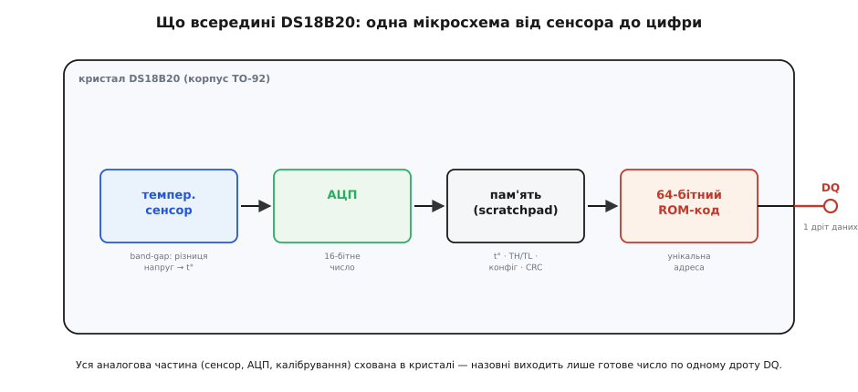
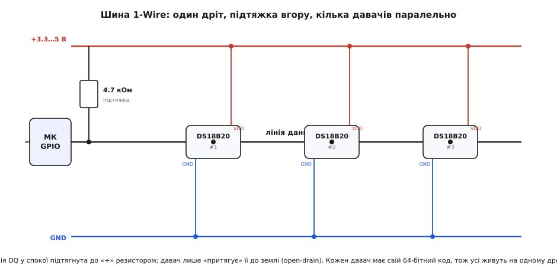
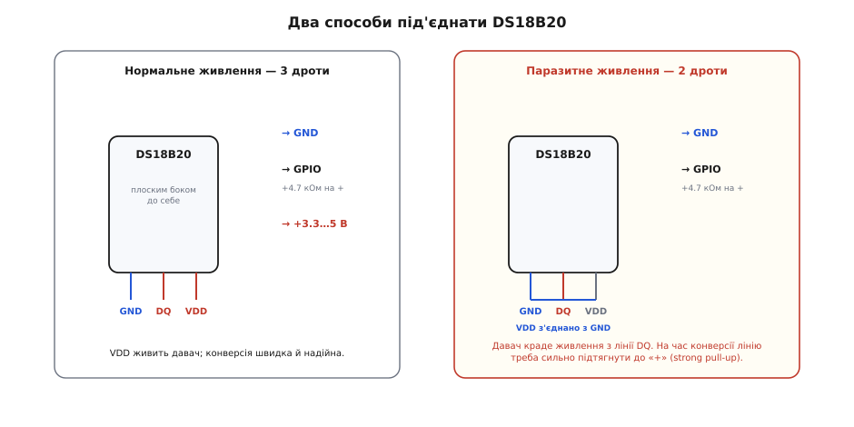

# DS18B20 — цифровий давач температури (1-Wire)

<preknowlist>
- [Рівні «0» і «1»](topic:electronics/logic-levels-as-ranges) — що таке «високо» й «низько» на цифровій лінії й чому 3.3- та 5-вольтова логіка тут уживаються.
- [Open-drain](topic:electronics/open-drain) — вихід, що вміє лише притягувати лінію до землі, а вгору її тягне спільний резистор; на цьому стоїть уся шина DS18B20.
- [Підтяжки](topic:electronics/floating-pullups) — навіщо вільну лінію тримає резистор на «+» і чому без нього шина «висить» у невизначеному стані.
- [АЦП](topic:electronics/adc) — як перетворити фізичну величину на число; DS18B20 робить це сам усередині, тож зовні АЦП уже не потрібен.
- [GPIO-регістри](topic:programming/gpio-registers) — як із коду підняти, опустити й прочитати один вивід мікроконтролера; цим ми говоримо з давачем.
- [Точний час (millis/micros)](topic:programming/millis-micros) — як відмірювати мікросекунди в прошивці; тайминг 1-Wire живе саме на них.
- [1-Wire — шина на одному дроті](topic:communications/one-wire) — як один провід переносить і живлення, і дані, як адресуються пристрої за 64-бітним кодом і як улаштований обмін. Це протокол, яким говорить DS18B20; тут він не переказується.
</preknowlist>

Якщо треба виміряти температуру мікроконтролером **точно, цифрою й на відстані** — беруть **DS18B20**. Це маленький чорний транзистор-на-вигляд у корпусі TO-92 (три ніжки, плоский бік із написом) або та сама мікросхема в металевій гільзі на кінці водозахисного кабелю. Усередині — не термістор і не дільник, а повноцінний цифровий термометр: сенсор, [АЦП](topic:electronics/adc), пам'ять і калібрування зведені в один кристал. Ти не читаєш напругу й не рахуєш опір — ти **питаєш число градусів і отримуєш його готовим**, уже в °C, по єдиному сигнальному дроту. Десятки таких давачів висять на тому самому дроті й відгукуються кожен на своє ім'я.

Розберімо саме цю річ: що в ній усередині, як вона говорить одним дротом, як її під'єднати (зокрема хитрим способом на двох дротах замість трьох) і де вона любить підводити.

## Що це і навіщо

DS18B20 робить одну справу: віддає **готову температуру цифрою**, від −55 до +125 °C, точністю **±0.5 °C** у робочому вікні −10…+85 °C. Не «гаряче/холодно» одним бітом і не сиру напругу — а число в градусах, яке вже враховує заводське калібрування. Уся аналогова морока (виміряти щось фізичне, перетворити на напругу, оцифрувати, підправити) схована в кристалі; назовні виходить лише цифра.

Три властивості роблять його улюбленцем там, де простий [аналоговий термістор](topic:sensors/ky-013-thermistor) уже не тягне.

Перше — **точність без калібрування**. Термістор на платі дає кілька градусів похибки й вимагає формули та підстроювання; DS18B20 відразу віддає ±0.5 °C, бо його відкалібрували на заводі. Друге — **відстань і завадостійкість**. Аналоговий сигнал по довгому дроту збирає наведення й падає на опорі проводів; цифровий вихід DS18B20 їде на метри незіпсованим, а до кожного числа додається [контрольна сума CRC](topic:communications/crc), тож зіпсоване читання видно й можна відкинути. Третє — **багато давачів на одному дроті**. Кожен DS18B20 має вшитий на заводі **унікальний 64-бітний код** (як серійний номер), тож десяток давачів вішають на ту саму пару контактів і адресують кожен окремо — три дроти на весь інкубатор чи котел, а не три на кожну точку.

> 🔧 **Навіщо це.** DS18B20 — це «взяв і виміряв»: жодного АЦП, жодної формули, жодного дільника. Розпізнавши цей давач, ти вже знаєш головне ще до підключення: віддає **число в градусах** (а не вольти й не «так/ні»), займає **один цифровий пін** (спільний на всі давачі), потребує **одного резистора-підтяжки**, і читається готовою бібліотекою у два рядки. Плата за зручність — не миттєвий вимір: одне перетворення температури триває до 750 мс.

## Що всередині

За трьома ніжками корпусу TO-92 ховається один кремнієвий кристал, і в ньому — весь термометр послідовним конвеєром.



*Уся аналогова частина — сенсор, АЦП, калібрування — схована в кристалі. Назовні виходить лише готове число по одному дроту DQ. Пам'ять (scratchpad) тримає результат вимірювання, пороги тривоги й контрольну суму; окремий ROM зберігає вшитий на заводі 64-бітний код давача.*

Чутливий елемент — не термістор, а **band-gap-сенсор**: схема, що використовує залежність напруги на кремнієвому переході від температури. Різниця напруг двох переходів, які працюють при різних струмах, пропорційна абсолютній температурі — з цього кристал і дістає градуси. Далі вбудований АЦП переганяє цей сигнал у **16-бітне число**, де молодший біт важить 0.0625 °C (це 2⁻⁴ — тобто на цілий градус припадає 16 кроків при повній роздільності).

Число лягає в невеличку пам'ять — **scratchpad** (англ. *scratchpad* — «чернетка», блокнотик для записів). Це 9 байтів: два молодших тримають саму температуру, ще пара — верхній і нижній **пороги тривоги** (TH/TL), один — регістр налаштувань (зокрема роздільність), а **останній, дев'ятий байт — це CRC**, контрольна сума перших восьми. Окремо від чернетки стоїть **ROM** — незмінна пам'ять із тим самим 64-бітним кодом. Саме він дозволяє відрізнити давачі на спільному дроті.

Роздільність — **налаштовна: 9, 10, 11 або 12 біт** (0.5, 0.25, 0.125 або 0.0625 °C на крок). За замовчуванням стоять повні 12 біт, і саме вони коштують ті **до 750 мс** на одне перетворення; на 9 бітах давач керується приблизно за 94 мс. Це прямий розмін: точніше — довше.

> 🔧 **Навіщо це.** Роздільність варто свідомо підбирати під задачу. Стежиш за кімнатою чи котлом, де важить десята градуса й швидкий відгук, — лишай 12 біт і терпи 750 мс. Опитуєш багато давачів часто й тобі досить пів градуса — переведи їх на 9 біт, і кожен вимір стане майже вдесятеро коротшим, а шина встигне обійти всіх. Роздільність пишеться в регістр налаштувань один раз командою `Write Scratchpad`.

## Як він говорить: шина 1-Wire

DS18B20 спілкується не по UART, не по I²C і не по SPI, а власною шиною **1-Wire** — «один дріт»: і живлення, і дані течуть одним проводом (плюс спільна земля). Це фірмовий винахід [Dallas Semiconductor](topic:sensors/ds18b20/hist-dallas-1wire.md), і саме він визначає, як давач під'єднують і читають, тож варто розуміти суть — хоч сам протокол я тут не переказую, його механіка розібрана в статті про [шину 1-Wire](topic:communications/one-wire).

Головна ідея — **open-drain із підтяжкою**. Лінію даних DQ у спокої тримає високою резистор-підтяжка (типово 4.7 кОм) на «+»; жоден пристрій не «виставляє» на неї одиницю силою — усі лише **притягують її до землі**, коли треба передати нуль. Мікроконтролер і давач по черзі відпускають та притягують той самий дріт, і за тривалістю притискань кодуються біти. Через це на шині мирно живуть 3.3- і 5-вольтові пристрої: ніхто нічого не «пушить» назустріч, лінію лише опускають до нуля.



*Лінію DQ у спокої тримає високою резистор 4.7 кОм; давач лише «притягує» її до землі (open-drain), а не виставляє одиницю. Кожен давач має власний 64-бітний код, тож усі мирно живуть на одному дроті — мікроконтролер адресує кожного за іменем.*

З цього випливає вся сила давача. Оскільки в кожного свій **64-бітний код**, мікроконтролер спершу «перегукується» з шиною командою пошуку, збирає коди всіх присутніх давачів, а тоді звертається до кожного окремо: «код такий-то — виміряй температуру». Один дріт на дротовому дереві, десятки точок вимірювання.

> 🔧 **Навіщо це.** Резистор-підтяжка 4.7 кОм — не декорація, а **умова роботи шини**: без нього лінія «висить» у невизначеному стані й давач не відгукнеться. Це найчастіша причина «нічого не працює» з DS18B20: людина під'єднала три дроти й забула єдиний зовнішній компонент. Один резистор на всю шину, від DQ до «+».

## Підключення до плати

У корпусі TO-92 три ніжки, і якщо тримати давач **плоским боком до себе**, ніжками вниз, то зліва направо це **GND · DQ · VDD**. Переплутати їх — класична помилка: подаси живлення на GND чи навпаки — давач нагрівається й мовчить, а то й гине. Тож звіряй за розводкою, а не за пам'яттю.



*Ліворуч — нормальне живлення: три дроти, VDD живить давач окремо, конверсія швидка й надійна. Праворуч — паразитне: VDD з'єднано із землею, давач бере живлення прямо з лінії даних, і на час перетворення лінію треба сильно підтягнути до «+». В обох випадках між DQ і «+» стоїть резистор 4.7 кОм.*

Звичайний спосіб — **три дроти**:

```
GND  →  GND плати
DQ   →  будь-який ЦИФРОВИЙ пін (GPIO), і той самий DQ через 4.7 кОм на «+»
VDD  →  +3.0…5.5 В
```

Живлення в давача широке — **від 3.0 до 5.5 В**, тож він однаково працює й на 3.3-вольтовій [ESP32](topic:boards/esp32-family), і на 5-вольтовому Arduino без жодних перетворювачів рівня: шина open-drain сама узгоджує логіку. Резистор-підтяжка ставиться **один на всю шину** незалежно від кількості давачів.

Є й другий, хитріший спосіб — **паразитне живлення** на двох дротах. Ніжку VDD **з'єднують із GND**, і тоді давач бере живлення прямо з лінії даних DQ: поки лінія висока, він підзаряджає крихітний внутрішній конденсатор і живе з нього. Це економить один провід — зручно у водозахисному зонді, де кожна жила кабелю дорога. Плата за економію: під час перетворення температури давачу треба помітний струм, а тонка підтяжка 4.7 кОм його не дає. Тому на час конверсії лінію мусить **сильно підтягнути до «+»** окремий ключ (strong pull-up) — інакше під навантаженням давач «просідає» й видає сміття.

> 🔧 **Навіщо це.** Паразитне живлення виглядає ошатно, але для новачка це **джерело загадкових збоїв**: один давач працює, а два вже брешуть, бо струму на всіх не стало. Практичне правило: маєш три жили — **живи давач нормально від VDD** і не мудруй. Паразитне вмикай свідомо, лише коли справді треба зекономити провід, і тоді не забудь про сильну підтяжку на час конверсії.

## Читаємо температуру в коді

Оскільки давач цифровий, «прочитати» його означає провести маленький діалог по шині: наказати виміряти, дочекатися конверсії, забрати число зі scratchpad і перевірити CRC. Уся ця механіка стандартна, і її бере на себе готова бібліотека — на Arduino це пара `OneWire` + `DallasTemperature`.

**Умова.** Один DS18B20 на піні GPIO 4 (наприклад, ESP32 чи Arduino), живлення нормальне від VDD, підтяжка 4.7 кОм між DQ і «+». Питаємо температуру раз на секунду.

:::tabs
```cpp
#include <OneWire.h>
#include <DallasTemperature.h>

const uint8_t PIN_1WIRE = 4;        // спільна лінія DQ шини 1-Wire
OneWire oneWire(PIN_1WIRE);
DallasTemperature sensors(&oneWire);

void setup() {
  Serial.begin(9600);
  sensors.begin();                  // знайти давачі на шині
}

void loop() {
  sensors.requestTemperatures();    // команда «виміряти» всім давачам
  float t = sensors.getTempCByIndex(0);   // забрати число з першого

  if (t == DEVICE_DISCONNECTED_C) { // -127: давач не відповів
    Serial.println("DS18B20 не на звязку");
  } else {
    Serial.print(t, 2);             // уже в °C, дві цифри після коми
    Serial.println(" C");
  }
  delay(1000);
}
```
```micropython
import time
from machine import Pin
import onewire, ds18x20

ow = onewire.OneWire(Pin(4))        # спільна лінія DQ шини 1-Wire
sensors = ds18x20.DS18X20(ow)
roms = sensors.scan()               # знайти давачі на шині

while True:
    sensors.convert_temp()          # команда «виміряти» всім давачам
    time.sleep_ms(750)              # чекаємо конверсію (до 750 мс на 12 бітах)

    if not roms:                    # давач не відгукнувся
        print("DS18B20 не на звязку")
    else:
        t = sensors.read_temp(roms[0])   # забрати число з першого, уже в °C
        print("{:.2f} C".format(t))      # дві цифри після коми

    time.sleep_ms(250)
```
:::

Три речі, на яких новачки спотикаються, і всі три видно в цьому коді. Перше: `requestTemperatures()` **наказує** виміряти, а `getTempCByIndex()` **забирає** результат — це два різні кроки, бо між ними давач до 750 мс думає (бібліотека за замовчуванням чекає це сама). Друге: **завжди перевіряй** значення на `−127` (`DEVICE_DISCONNECTED_C`) — саме його бібліотека віддає, коли давач не відгукнувся або CRC не зійшлося; узяти таке число за температуру означає керувати котлом по брехні. Третє: якщо давачів кілька, звертатися до них варто **за 64-бітною адресою**, а не за індексом, бо індекс залежить від порядку на шині й може «поїхати».

> 🔧 **Навіщо це.** Готова бібліотека ховає весь тайминг 1-Wire, але саме тому корисно раз побачити, що під ним: як формується імпульс скидання, як читається біт за тривалістю, як забираються 9 байтів scratchpad і перевіряється CRC. Розібраний власний драйвер — від виклику бібліотеки до ручної роботи ніжкою й читання кількох давачів за адресою — винесено в [окрему вставку про роботу з DS18B20 у коді](topic:sensors/ds18b20/api-ds18b20-driver.md).

## Чого стерегтися насправді

DS18B20 надійний і чесний, але кілька його меж треба знати, щоб не приписати йому зайвого.

**Конверсія не миттєва.** На повних 12 бітах одне перетворення триває **до 750 мс**. Якщо смикати `requestTemperatures()` у щільному циклі без пауз, програма більшість часу простоюватиме в чеканні. Хочеш і швидко опитувати, і не блокувати решту коду — запускай конверсію, займайся своїми справами й забирай результат наступним разом; або зниж роздільність.

**Підробки й перегрів.** DS18B20 — один із найчастіше підроблюваних чипів: під тим самим корпусом трапляються клони, що гірше тримають точність, плутають паразитне живлення чи гріються під навантаженням. Симптоми — «поплив» на десяті-цілі градуси, збої на довгій шині, дивна поведінка з кількома давачами. Якщо точність критична, бери давачі з надійного джерела й **перевіряй їх** проти доброго термометра.

**Це температура кристала, а не «повітря взагалі».** Давач показує **свою власну** температуру. У корпусі TO-92 на повітрі він має теплову інерцію й відстає при різких змінах; притиснутий до металу — швидко зрівнюється з ним. Хочеш міряти рідину чи поверхню — бери водозахисний варіант у гільзі й дай йому кілька секунд «наздогнати».

**Довжина шини має межу.** 1-Wire живучий, але не безмежний: на довгих дротах (десятки метрів) відбиття й ємність лінії псують тайминг, і давачі починають «губитися». Тоді зменшують підтяжку, тягнуть шину зіркою чи ставлять спеціальний драйвер-майстер. Для настільних відстаней (метри) про це можна не думати.

> 🔧 **Навіщо це.** Ці межі окреслюють, **де DS18B20 незамінний, а де ні**. Точний цифровий вимір на відстані, кілька точок на одному дроті, вода й вулиця, десяті градуса без калібрування — тут йому рівних мало. А от де треба **мілісекундний** відгук чи вимір сотень разів на секунду — 750-мілісекундна конверсія стане на заваді, і беруть інший клас давачів. Для термостатів, інкубаторів, котлів, метеостанцій і «розумного дому» DS18B20 — робочий кінь.

## Куди його ставлять

Прозорий набір застосувань, і кожне пояснює, чому давач саме такий.

**Термостати й опалення.** Читаєш температуру, порівнюєш із уставкою, вмикаєш нагрівач чи насос. ±0.5 °C і цифровий вихід — саме те, що треба, а водозахисний зонд занурюють прямо в бак чи трубу.

**Багатоточковий моніторинг.** Інкубатор, теплиця, серверна, акумуляторна збірка — десяток DS18B20 на одному дроті, кожен зі своєю адресою, знімають температурну карту трьома жилами замість тридцяти.

**Вулиця й метеостанція.** Водозахисний варіант терпить дощ і мороз (робочий діапазон до −55 °C), а цифровий сигнал доходить із двору в дім незіпсованим.

> 🔧 **Навіщо це.** Помітивши цей ряд, легко зрозуміти, коли брати саме DS18B20, а коли — сусіда. Потрібне **точне число температури цифрою, на відстані, у кількох точках** → DS18B20. Потрібні **температура й вологість разом** одним дешевим модулем → [DHT11](topic:sensors/dht11). Потрібне лише **«гаряче/холодно» за порогом** одним бітом → [KY-028](topic:sensors/ky-028-temp) з компаратором. Потрібне найдешевше й найшвидше грубе число коло кімнатних температур → аналоговий [KY-013](topic:sensors/ky-013-thermistor). DS18B20 виграє саме точністю, цифрою й адресованою шиною.

## Історія в двох словах

Шину 1-Wire і сам DS18B20 створила американська компанія **Dallas Semiconductor** — та сама, що вигадала «однодротову» ідею ще на зламі 1980–90-х і випустила під нею монетки-«ключі» iButton та цілу лінійку давачів із префіксом **DS** у назві. 2001 року Dallas купила **Maxim Integrated**, а 2020-го Maxim увійшла до **Analog Devices**, тож сьогодні DS18B20 випускають під маркою Analog Devices — але з тим самим історичним іменем (усталений факт). Як народилася сама ідея передавати живлення й дані одним дротом і чому вона виявилася такою живучою — у [окремій історичній вставці](topic:sensors/ds18b20/hist-dallas-1wire.md).

## Що з цього винести

DS18B20 — це **цифровий давач температури на шині 1-Wire**: band-gap-сенсор, АЦП, пам'ять і заводське калібрування в одному кристалі TO-92 (або у водозахисній гільзі). Він віддає готове число від −55 до +125 °C, точністю ±0.5 °C, роздільністю до 12 біт (крок 0.0625 °C, конверсія до 750 мс), по єдиному дроту DQ. Шина працює на [open-drain із підтяжкою](topic:electronics/open-drain) 4.7 кОм на «+», живлення широке (3.0…5.5 В, тож і 3.3-, і 5-вольтові плати без перетворювачів), а вшитий **унікальний 64-бітний код** дає вішати десятки давачів на той самий дріт і адресувати кожен окремо. Кожне число супроводжує [CRC](topic:communications/crc), тож зіпсоване читання видно. Під'єднання — три дроти (GND · DQ · VDD, і не переплутай ніжки), або два з [паразитним живленням](topic:communications/one-wire) ціною сильної підтяжки на час конверсії. Головне, чого стерегтися: не миттєвий вимір (до 750 мс), поширені підробки та потреба перевіряти значення на `−127`. Бери DS18B20 там, де потрібні **точність, цифра, відстань і багато точок на одному дроті** — для термостатів, опалення, інкубаторів, вулиці й «розумного дому».
