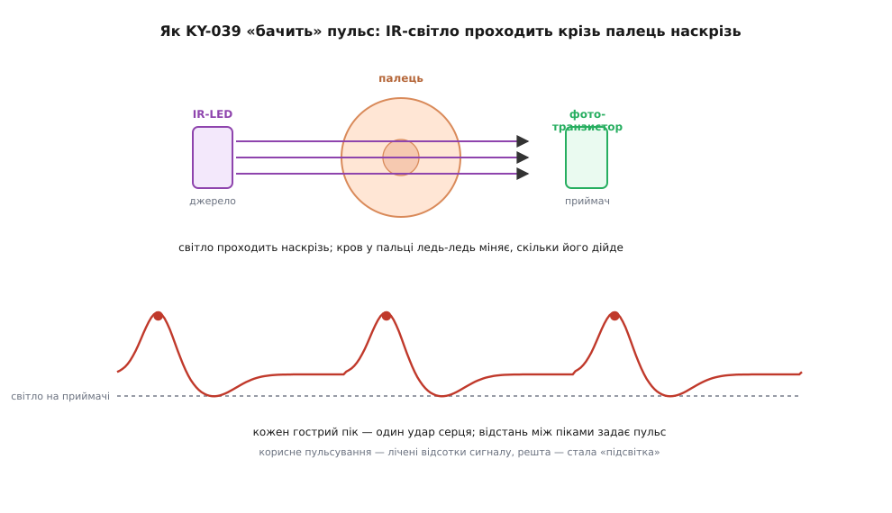
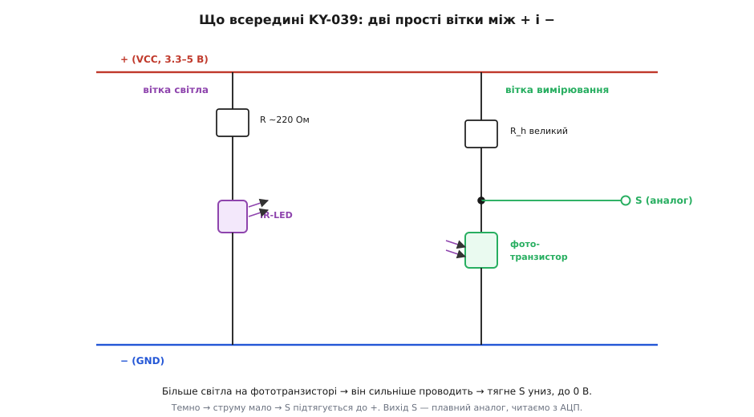
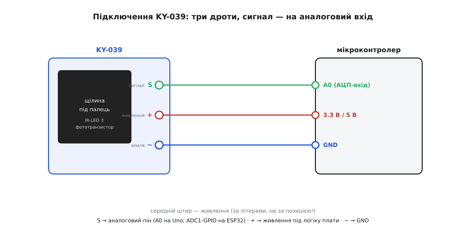

# KY-039 — давач пульсу

<preknowlist>
- [Фотодавачі](topic:electronics/photo-sensors) — що таке фототранзистор і ЧОМУ світло змушує його проводити струм: фотони відкривають напівпровідник, і чим яскравіше, тим більший струм. Це «око» KY-039.
- [Світлодіод](topic:electronics/led) — напівпровідник, що світить, коли крізь нього тече струм; тут він світить не видимим, а інфрачервоним світлом, що добре проходить крізь тіло.
- [Дільник напруги](topic:electronics/voltage-divider) — два опори послідовно ділять напругу пропорційно до себе; весь вихід KY-039 — це такий дільник, де одне плече замість резистора став фототранзистор.
- [АЦП](topic:electronics/adc) — як мікроконтролер перетворює напругу на число (`analogRead`); вихід KY-039 аналоговий, тож без АЦП його не прочитати.
- [KY-серія (Keyes 37-в-1)](topic:sensors/ky-series) — спільний формат родини: гребінка S / + / −, живлення 3.3–5 В, «номер важливіший за виробника». KY-039 успадковує все це.
</preknowlist>

**KY-039** робить річ, що межує з фокусом: за три копійчані деталі — без жодної мікросхеми — вона дає мікроконтролеру відчути, як б'ється ваше серце. Прикладіть подушечку пальця в щілину модуля, зачекайте кілька секунд — і на аналоговому виході з'явиться слабенька хвиля, що пульсує в такт пульсу. Розберімо, з чого ця платка складена, як шматочок пластику з двома напівпровідниками взагалі бачить серцебиття крізь непрозорий палець, як під'єднати модуль трьома дротами й чому «сирий» сигнал, який він видає, — ще не пульс, поки над ним не попрацює трохи математики в коді.

## Що це і на чому стоїть

KY-039 — це **оптичний давач пульсу** з родини [KY-серії](topic:sensors/ky-series). Метод, яким він працює, зветься **фотоплетизмографія** (гр. *plethysmos* — наповнення, *graphein* — записувати): «запис наповнення світлом». Ідея напрочуд проста і красива. Кров поглинає світло. З кожним ударом серця артерії в пальці наповнюються кров'ю трохи більше, тоді знову спадають — і разом із цим ледь-ледь міняється, скільки світла тканина пропускає. Якщо посвітити крізь палець і уважно стежити за яскравістю світла, що вийшло з другого боку, ви побачите слабеньке пульсування в такт серцю. Оце пульсування і є пульсова хвиля.

На платці для цього рівно дві напівпровідникові деталі. З одного боку щілини сидить **інфрачервоний світлодіод** — [світлодіод](topic:electronics/led), що світить не видимим оком, а інфрачервоним світлом (довжина хвилі близько 940 нм). Інфрачервоне взято не випадково: воно найкраще проходить крізь живу тканину, тоді як видиме червоне вже помітно розсіюється й гасне. З протилежного боку щілини — **фототранзистор**, [давач світла](topic:electronics/photo-sensors), що перетворює світло на струм: чим більше світла падає на його чутливе віконце, тим сильніше він відкривається й тим більший струм пропускає. Палець ви кладете **між** ними, у щілину, тож світло від діода мусить пройти крізь палець наскрізь, аби дістатися до фототранзистора.



*Просвітна фотоплетизмографія: джерело й приймач стоять один навпроти одного, палець — між ними. З кожним ударом артерії наповнюються кров'ю, тканина ледь дужче поглинає світло, і на приймач його доходить трошки менше. Фототранзистор малює хвилю, де кожен гострий пік — один удар серця; відстань між піками задає пульс.*

> 🔧 **Навіщо це.** Розуміти сам принцип конче потрібно, бо він одразу пояснює всі головні пастки роботи з модулем. Корисне пульсування — це **лічені відсотки** від загального рівня світла; решта — стала «підсвітка» тканини, що не несе інформації про пульс. Тому давач боїться руху пальця (найменший зсув перекриває слабку хвилю з головою), боїться стороннього світла, що потрапляє на фототранзистор повз палець, і вимагає рівного, не надто сильного й не надто слабкого притискання. Знаєте це — і не дивуєтеся, чому «сирий» сигнал без обробки виглядає радше як мало осмислений шум, у якому пульс лише вгадується.

## Просвіт, а не відбиття — і чим це відрізняє KY-039

Тут криється головна риса саме цієї платки, і її варто виокремити, бо є розповсюджений родич, що робить те саме інакше. KY-039 працює **на просвіт**: світлодіод з одного боку пальця, фототранзистор — з протилежного, і світло йде крізь палець наскрізь. Так само влаштована лікарняна прищіпка-пульсоксиметр, що її вдягають на палець.

Інший, «розумніший» спосіб — **на відбиття**: коли і джерело, і приймач стоять на **одному** боці, а міряють світло, що відбилося назад від тканини. Саме так зроблено давач [GY-MAX30102](topic:sensors/max30102) — маленьку мікросхему притискають до подушечки пальця чи до зап'ястка, як у фітнес-браслетах. Різниця не косметична. MAX30102 — це цілий чип із двома світлодіодами (червоним і інфрачервоним), власним фотодіодом, аналого-цифровим перетворювачем і цифровою шиною [I²C](topic:communications/i2c-bus); він уміє рахувати ще й насичення крові киснем (SpO2) і віддає готові оцифровані відліки. **KY-039 не вміє нічого з цього**: у нього немає мікросхеми, немає другого кольору світла, немає SpO2 і немає цифрового виходу — тільки один інфрачервоний діод, один фототранзистор і аналоговий сигнал, який ви оцифровуєте самі. За це KY-039 у рази дешевший і простіший для розуміння: він — той самий принцип у найголішому вигляді. Тому й беруть його передусім навчатися, а не міряти пульс усерйоз.

## Що всередині: дві прості вітки

Тепер від принципу до самої схеми. Уся електрична начинка KY-039 — це **дві незалежні вітки** між живленням (+) і землею (−), і в цьому вся платка.

**Перша вітка — світло.** Інфрачервоний світлодіод просто мусить світити, тож його вмикають між живленням і землею через звичайний струмообмежувальний резистор (типово близько кількасот омів — інакше діод спалить сам себе завеликим струмом). Ця вітка нічого не «міряє»; вона лише рівно підсвічує палець зсередини. Струм крізь неї сталий, світло — рівне.

**Друга вітка — вимірювання.** Ось де вся суть. Фототранзистор ставлять послідовно з **великим** резистором, і сигнал S знімають із точки між ними. Це той самий [дільник напруги](topic:electronics/voltage-divider), тільки одне його плече — не сталий резистор, а фототранзистор, чий «опір» міняється від світла. На KY-039 великий резистор — це **верхнє** плече (між + і вузлом S), а фототранзистор — **нижнє** (між вузлом S і −).



*Внутрішня схема KY-039. Ліва вітка лише світить: IR-світлодіод через струмообмежувальний резистор. Права вітка міряє: великий резистор — верхнє плече, фототранзистор — нижнє, вихід S — між ними. Більше світла на фототранзисторі — він сильніше проводить, тягне S униз, до 0 В; темно — струму мало, S підтягується до +.*

Простеж, як поводиться напруга на S, — і полярність стане очевидною, її не треба запам'ятовувати. Коли на фототранзистор падає **багато** світла, він широко відкривається, крізь нижнє плече тече великий струм, і вузол S притягується вниз, близько до **0 В**. Коли світла **мало** (фототранзистор у темряві), струм крізь нього крихітний, майже вся напруга падає на ньому, і вузол S підтягується вгору, близько до **+**. Отже:

```
багато світла → фототранзистор відкритий → S тягнеться до 0 В
мало світла   → фототранзистор закритий  → S тягнеться до +
```

А тепер зведімо це з пульсом. Коли артерії в пальці наповнюються кров'ю (систола), тканина дужче поглинає інфрачервоне світло, тож на фототранзистор його доходить **менше** — він трохи прикривається, і напруга на S трохи **зростає**. Коли кров відпливає — світла проходить більше, S трохи спадає. Виходить, що напруга на S ледь-ледь коливається в такт серцю: це і є пульсова хвиля, тільки крихітна на тлі великого сталого рівня.

> 🔧 **Навіщо це.** Чому резистор у вимірювальній вітці саме **великий** (сотні кілоомів, а то й мегаоми)? Бо світла, що проходить крізь палець, лишається дуже мало — палець майже все поглинає. Малий струм фототранзистора на малому резисторі дав би мізерну, майже нульову напругу, і корисну хвилю не було б видно. Великий резистор перетворює навіть крихітний струм на помітну напругу — він задає **чутливість** вітки. Це класичний прийом: щоб побачити слабкий струм давача як напругу, ставлять велике навантаження. Зворотний бік — такий високоомний вузол легко ловить наводки (про це нижче).

## Контакти й підключення

Три штирі, три дроти — але з тим самим застереженням, що для всієї серії: **живлення (+) — це середній штир**, а не крайній, тож підключай **за літерами, не за позицією**. І, як і в аналогових родичів, головна відмінність від цифрових KY-модулів у тому, що **сигнал S іде на аналоговий вхід**, а не на цифровий.



*Розводка пін-у-пін. Сигнал S — на аналоговий пін (A0 на Arduino Uno; ADC1-здатний GPIO на ESP32), бо читаємо напругу, а не рівень. Живлення (+, середній штир) — на 3.3 В або 5 В під логіку плати; земля (−) — на GND. Три однорівневі дроти, нічого не перетинається.*

Виходить так:

```
S  →  АНАЛОГОВИЙ пін  (A0 на Uno; ADC1-GPIO на ESP32)
+  →  3.3 В або 5 В    (середній штир!)
−  →  GND
```

Куди саме вставляти S — не байдуже. На Arduino Uno аналогові входи — це піни **A0…A5**; встромиш сигнал у цифровий D-пін, і `analogRead` звідти не працюватиме — замість плавної хвилі отримаєш або «завжди 0», або «завжди 1». На [ESP32](topic:boards/esp32-family) аналоговими є не всі GPIO, а лише піни двох вбудованих АЦП, ще й ті, що належать до блоку ADC2, конфліктують із увімкненим Wi-Fi — тому під KY-039 на ESP32 бери пін з блоку ADC1 (наприклад, GPIO 32–39). Це не примха давача, а властивість самих плат, але поширена пастка саме тут.

Щодо напруги живлення. Модуль усеїдний — світиться й міряє і від 3.3 В, і від 5 В, — але **розмах напруги на виході дорівнює напрузі живлення**. Нагодуєш KY-039 п'ятьма вольтами й заведеш S на 3.3-вольтову плату — сигнал може підскочити під 5 В і прикласти завелику напругу до входу, розрахованого на 3.3 В, що з часом його пошкодить. Тому на ESP32 та інших 3.3-вольтових платах живи модуль **від 3.3 В**, а п'ять вольтів давай лише 5-вольтовим платам на кшталт Arduino Uno. Правило те саме, що для серії: живлення давача бери **під логіку своєї плати**.

## Що приходить від давача і чому це ще не пульс

А тепер — те, що конче зрозуміти, перш ніж писати код. Коли ви робите `analogRead` з KY-039, він **не** повертає вам «пульс 72». Він повертає одне число — **поточну напругу на S**, оцифровану АЦП. Пульс із цих чисел рахує вже ваш код. І перше, що ви побачите, якщо просто виводити сирі відліки, — це не гарна хвилька, а велике число, що ледь-ледь тремтить: корисне пульсування тоне у великій сталій складовій (та сама «підсвітка» тканини) і в наводках.

Щоб дістати з цього пульс, сирий сигнал треба обробити, і робота розкладається на кілька кроків:

```
1. читаємо analogRead із рівним кроком у часі (наприклад, раз на 20 мс);
2. відкидаємо сталу складову — лишаємо тільки змінну, пульсуючу частину;
3. згладжуємо шум (простий фільтр), щоб хвиля стала чистіша;
4. знаходимо піки хвилі — це удари серця;
5. міряємо час між сусідніми піками → з нього рахуємо пульс.
```

Найтонше тут — **крок 4**. Знайти піки в зашумленій, ще й «плавучій» хвилі надійно — не порахувавши шумовий горбик за удар і не пропустивши слабкий справжній — це вже алгоритм, і робити його наосліп не варто. Класичний підхід: тримати ковзне середнє сигналу як «поточний нуль» і рахувати за удар лише той перетин цього нуля вгору, що стався не раніше, ніж за розумний мінімум після попереднього (людське серце не б'ється частіше ніж разів 3–4 на секунду, тож удари ближче за ~250 мс — це майже напевно шум). Коли знаєш час між двома ударами `beatMs`, пульс у ударах за хвилину — це просто:

```
BPM = 60000 / beatMs
```

**Прикинемо конкретне число.** Хай між двома сусідніми піками хвилі минуло 850 мілісекунд.

```
BPM = 60000 / 850
BPM ≈ 70.6
```

Тобто близько 71 удару за хвилину — здоровий пульс дорослого в спокої (норма — десь 60–100). Якби піки йшли частіше, скажімо через 600 мс, вийшло б `60000/600 = 100` ударів; рідше, через 1000 мс, — рівно 60.

Повний робочий скетч — від правильної частоти опитування й відкидання сталої складової до згладжування, надійного пошуку піків із захистом від подвійного рахунку й обчислення пульсу, з коментарями про типові пастки (рух пальця, наводка 50 Гц, підбір порога) — винесено в [окрему вставку про роботу з KY-039 у коді](topic:sensors/ky-039-pulse/proj-ky039-driver.md).

> 🔧 **Навіщо це.** Це пояснює, чому з KY-039 не можна «прочитати пін і вивести пульс»: виходить тремтливе число, а не число ударів. І чому перший запуск майже завжди розчаровує — сирий сигнал стрибає, значення «плавають», пульс не вгадується, поки ви не приберете сталу складову й не згладите шум. Терпіння, нерухомий палець і трохи обробки в коді — половина успіху; друга половина — прийняти, що KY-039 віддає вам сировину, а не результат.

## Чого стерегтися

KY-039 підкупає дешевизною й простотою принципу, але саме через простоту він примхливий, і знати ці межі важливіше, ніж уміти його підключити.

**Сигнал слабкий і крихкий.** Корисна пульсова хвиля — лічені відсотки сигналу. Це не вада конкретного екземпляра, а природа методу: крізь палець проходить дуже мало світла, і його коливання від пульсу — мізерне. Тому без обробки в коді KY-039 практично марний.

**Рух пальця вбиває сигнал.** Найменший зсув чи натиск міняє, скільки світла проходить, набагато дужче, ніж пульс, — і артефакт руху повністю перекриває хвилю. Палець кладуть і тримають **нерухомо**; будь-яке ворушіння читається як хибні «удари».

**Стороннє світло — ворог.** Фототранзистор ловить будь-яке інфрачервоне світло, не лише те, що пройшло крізь палець. Найпідступніше джерело — **кімнатні лампи**: багато з них живляться від мережі 50 Гц (в Європі; 60 Гц в Америці) і непомітно для ока миготять із цією частотою. Це миготіння наводить на слабкий сигнал давача паразитну хвилю 50/60 Гц, куди сильнішу за пульс. Тому щілину з пальцем прикривають від зовнішнього світла (долонею, кусником непрозорого матеріалу), а в коді від залишкової наводки рятує згладжування.

**Притискання має бути «в міру».** Притиснете надто слабко — між пальцем і давачем лишається щілина, світло тікає повз, сигнал кволий. Притиснете надто сильно — передавите капіляри, кров перестає пульсувати в цьому місці, і хвиля зникає взагалі. Потрібне рівне, легке, стабільне прилягання; це найчастіша причина «давач нічого не показує».

**Це не медичний прилад і не пульсоксиметр.** KY-039 годиться, щоб бачити сам факт пульсу й грубо оцінити його частоту в навчальному чи аматорському проєкті. Він **не** міряє насичення крові киснем (SpO2) — для цього потрібні два кольори світла, а тут один; хочете SpO2 — беріть [GY-MAX30102](topic:sensors/max30102) чи справжній пульсоксиметр. І в жодному разі не робіть за показами KY-039 медичних висновків.

**Розкид екземплярів і залежність від пальця.** Товщина й прозорість пальця, температура рук, навіть колір шкіри й лак на нігтях помітно міняють сигнал; два різні пальці на тому самому давачі дадуть різну амплітуду. Поріг і підсилення підбирають щоразу під ситуацію, а не переносять наосліп.

## Що з цього винести

KY-039 — це **найпростіший оптичний давач пульсу** з [KY-серії](topic:sensors/ky-series): інфрачервоний [світлодіод](topic:electronics/led) з одного боку щілини, [фототранзистор](topic:electronics/photo-sensors) — з протилежного, палець між ними, і жодної мікросхеми. Працює він **на просвіт** (світло йде крізь палець наскрізь) методом фотоплетизмографії: кров, наповнюючи артерії з кожним ударом, ледь дужче поглинає світло, і фототранзистор ловить це як крихітну хвилю. Усередині — дві вітки: одна лише світить (IR-діод через резистор), друга міряє ([дільник](topic:electronics/voltage-divider) із великого резистора вгорі й фототранзистора внизу). Полярність: багато світла — S тягнеться до 0 В, темно — до +; пульсова хвиля коливає S на тлі великого сталого рівня. Підключення — три дроти, живлення (+) у середині штирів, сигнал **обов'язково на аналоговий вхід**, напругу узгоджуй із логікою плати. Головне ж — на виході **сировина, а не пульс**: щоб дістати удари, сигнал треба в коді очистити від сталої складової, згладити й знайти піки, а тоді порахувати `BPM = 60000 / beatMs`. І пам'ятати про межі: сигнал кволий, боїться руху й стороннього світла (особливо мережевого миготіння ламп), вимагає рівного притискання, розкидається від пальця до пальця й **не є медичним приладом**. Треба серйозно міряти пульс і кисень — бери [MAX30102](topic:sensors/max30102); треба дешево й наочно **зрозуміти, як давач бачить серцебиття**, — KY-039 для цього ідеальний.
