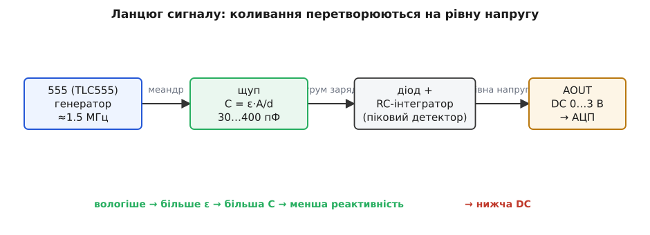
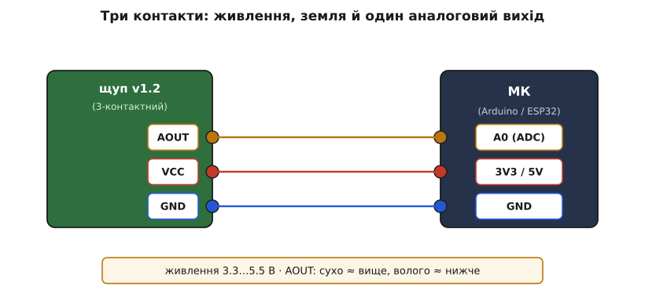

# Ємнісний давач вологості ґрунту (v1.2)

<preknowlist>
- [Опір конденсатора](book:electronics/capacitive-reactance) — що ємність протистоїть змінному струму тим слабше, чим вища частота й чим більша сама ємність; на цьому тримається весь вихід давача.
- [555 астабільний](book:electronics/555-astable) — як мікросхема 555 сама генерує безперервний прямокутний сигнал сталої частоти; це серце плати.
- [RC-ФНЧ](book:electronics/rc-low-pass) — як конденсатор із резистором згладжують швидкі коливання в рівну напругу; так на виході з'являється DC.
- [АЦП](book:electronics/adc) — як мікроконтролер перетворює аналогову напругу на число; корисний вихід AOUT читають саме через АЦП.
- [Закон Ома](book:electronics/ohms-law) — напруга = струм · опір; базовий зв'язок, без якого не зрозуміти жодну зі схем.
</preknowlist>

Це вузька темна планка сантиметрів десять завдовжки, найчастіше чорна або біла, із загостреним кінцем, який встромляють у землю, і трьома дротами на протилежному кінці. На платі великими білими літерами витиснуто **v1.2** — саме за цим написом її й упізнають серед десятків схожих щупів. Її купують туди ж, куди й дешеву вилку-гребінець з двома золотистими доріжками: автополив, «розумний» горщик, метеостанція на балконі. Але це зовсім інший прилад, і різниця не косметична — вона у фізиці вимірювання, і саме через неї цей щуп живе роками там, де гребінка згниває за тижні.

Щоб зрозуміти цю планку, треба відповісти на одне питання: **як зміряти воду в землі, жодного разу не пропустивши струм крізь саму землю?** Уся конструкція — генератор, доріжки-конденсатор, діод, згладжувальний фільтр — це одна довга відповідь на нього. Розберімо її так, щоб упізнати річ, під'єднати з першого разу, витягти корисне число й наперед знати, де вона любить підводити.

## Чому не опір, а ємність

Найдешевший щуп — [резистивний, з вилкою-гребінцем](book:sensors/soil-moisture) — міряє **електричний опір** ґрунту між двома металевими доріжками. Волога земля з розчиненими солями проводить струм краще, суха — гірше; опір падає з вологістю, і це легко перетворити на напругу. Ідея проста й майже завжди перша, яка спадає на думку.

У неї є вбивча вада. Щоб зміряти опір, крізь ґрунт треба **пропустити струм**, а струм у вологому ґрунті — це рух іонів, тобто електроліз (гр. *lýsis* — розклад). На додатному електроді метал доріжки поволі окиснюється й розчиняється, на від'ємному осідає наліт. За кілька тижнів безперервної роботи в мокрій землі доріжки гребінки з'їдає корозія, контакт стає нестабільним, покази пливуть — і щуп доводиться викидати. Живлення змінним струмом трохи відтягує кінець, але не рятує: на практиці це все одно пульсуючий постійний струм, і окиснення бере своє.

Ємнісний давач обходить проблему в корені: він **узагалі не пропускає постійний струм у ґрунт**. Металеві доріжки на його щупі вкриті суцільним шаром лаку-маски й ніколи не торкаються землі голим металом. Нема гальванічного контакту — нема електролізу — нема корозії. А міряє він не опір, а **діелектричну проникність** середовища навколо щупа.

Ось де вступає вода. Діелектрична проникність (лат. *permittere* — пропускати) — це міра того, наскільки речовина послаблює електричне поле всередині себе; позначають її ε (епсилон). У сухого ґрунту вона невелика: ε десь 3…5. А у води — величезна, близько 80: молекула води полярна, вона крутиться в полі й гасить його дуже сильно. Тому навіть невелика домішка води в ґрунті різко піднімає його усереднену проникність. **Волога земля — це середовище з високим ε; суха — з низьким.** І що важливо: провідність солей тут майже ні до чого — прилад реагує на саму воду як на діелектрик, а не на розчинені в ній іони. Тому його покази стабільніші й ближчі до справжнього вмісту вологи, ніж у резистивної гребінки.

> 🔧 **Навіщо це.** Два практичні наслідки одразу. По-перше, довговічність: щуп без голого металу в землі не кородує, тож він придатний для стаціонарного автополиву, де давач місяцями стирчить у мокрому горщику. По-друге, менша чутливість до добрив: підживили рослину — резистивна гребінка «побачить» стрибок провідності й збреше, що стало вологіше; ємнісний щуп на це майже не зважає, бо міряє воду, а не сіль.

## Як проникність стає ємністю

Проникність саму по собі мікроконтролер не прочитає — потрібен місток до електрики. Цей місток — **конденсатор**.

Уздовж щупа під лаком лежать дві провідні доріжки, вигнуті так, що їхні виступи заходять один між одного гребінцем — це називають зустрічно-штировою (інтердигітальною, лат. *inter digitos* — «між пальцями») структурою. Дві доріжки, розділені проміжком, — це і є обкладки конденсатора. Ємність такого конденсатора задає знайома залежність:

```
C = ε · A / d
```

де `A` — площа перекриття обкладок, `d` — відстань між ними, а `ε` — проникність того, що заповнює простір **між** ними й **навколо** них. Геометрія доріжок незмінна: `A` і `d` зашиті в мідь на етапі виготовлення. Єдине, що змінюється в житті приладу, — це ε середовища. Тому **ємність щупа стає прямою мірою вологості**: суха земля (мале ε) → мала ємність; волога (велике ε) → велика ємність. На практиці ця ємність гуляє приблизно від 30 пФ у повітрі до сотень пФ у воді.

Тонкість у слові «навколо». Обкладки лежать на одній площині поруч, а не одна проти одної, тож поле між ними — **крайове** (фрингове): силові лінії випинаються з площини щупа назовні петлями й пірнають у ґрунт по обидва боки лаку. Саме ці петлі поля «намацують» вологу в землі, не торкаючись її. Глибина, на яку поле заходить у ґрунт, невелика — кілька міліметрів від поверхні щупа, тож давач чутливий до вологи в тонкому шарі впритул до планки, а не до всього об'єму горщика.


*Поле щупа тягнеться в землю крайовими петлями й ніколи не торкається ґрунту голим металом. Вода піднімає усереднену проникність середовища, а з нею — ємність доріжок-конденсатора. Саме цю ємність далі перетворюють на напругу.*

## Від ємності до напруги: генератор, діод, фільтр

Ємність — величина реактивна, вольтметром її не побачити. Щоб витягти з неї напругу, ємність треба «розворушити» змінним струмом, і тут на плату виходить головна мікросхема — **таймер 555** в астабільному (самозбудному) режимі.

[555 у режимі генератора](book:electronics/555-astable) безперервно видає прямокутний сигнал — меандр — сталої, доволі високої частоти. У v1.2 ця частота близько **1.5 МГц** (у ранніх версіях на іншому таймері вона була помітно нижча, сотні кілогерц). Цей меандр подають на щуп-конденсатор через резистор. І тут працює [опір конденсатора змінному струмові](book:electronics/capacitive-reactance) — реактивність:

```
Xc = 1 / (2π · f · C)
```

Реактивність тим менша, чим більша ємність. Волога земля збільшує C щупа → його реактивність Xc падає → на високій частоті 555 конденсатор легше «пропускає» коливання й швидше заряджається-розряджається. Суха земля робить навпаки: мала C → велика Xc → конденсатор чинить коливанням більший опір. Отже амплітуда (і форма) сигналу на щупі несе в собі вологість, закодовану через ємність.

Лишається перетворити цей високочастотний сигнал на спокійне число. Це роблять дві останні деталі. **Діод** пропускає лише верхівки коливань в один бік — випрямляє їх (працює піковим детектором). А далі [RC-фільтр](book:electronics/rc-low-pass) — конденсатор із резистором — згладжує пульсації в рівну постійну напругу, як заспокоюють хвилі на воді. На виході AOUT з'являється чистий DC десь у діапазоні 0…3 В: одне число, що поволі повзе за вологістю.

Напрям цієї залежності на перший погляд контрінтуїтивний, тож запам'ятаймо його чітко: **більше вологи → більша проникність ε → більша ємність C → менша реактивність Xc → нижча напруга на AOUT.** Сухо — вихід високий; мокро — вихід низький.


*Уся плата — це машинка, що перетворює ємність на напругу: розворушити конденсатор швидким меандром, випрямити, згладити. Вологість входить як ємність, виходить як рівний DC на єдиному аналоговому виводі.*

## Три контакти й підключення

Попри всю електроніку всередині, назовні давач гранично простий — **три виводи** через роз'єм PH2.0 крихітним триконтактним шлейфом:

- **VCC** — живлення, від 3.3 до 5.5 В;
- **GND** — спільна земля;
- **AOUT** — аналоговий вихід, та сама рівна напруга 0…3 В, яку читає АЦП.

Ніяких цифрових виходів, порогів чи гвинтиків тут нема (на відміну від резистивної гребінки з її LM393): плата віддає лише аналог, а рішення «сухо чи волого» приймає вже код на мікроконтролері. Підключення виходить тривіальне: живлення на живлення, земля на землю, AOUT — на будь-який аналоговий вхід плати.


*Три дроти й жодної підтяжки. Єдине, що читають, — напруга на AOUT; сухо дає вище число, волого — нижче.*

Читання в коді — це одне звертання до АЦП. На класичному 10-бітному АЦП (діапазон 0…1023) сухий щуп у повітрі дає близько 600, а занурений у воду — близько 330:

**Прочитати вологість і ввімкнути помпу, коли пересохло.**
:::tabs
```cpp
const int PIN_SOIL = A0;      // AOUT давача
const int PIN_PUMP = 7;       // реле помпи

// калібрувальні межі — зняти для СВОГО щупа (див. нижче)
const int AIR   = 610;        // сухо (щуп у повітрі)
const int WATER = 330;        // мокро (щуп у воді)

void setup() {
  pinMode(PIN_PUMP, OUTPUT);
  Serial.begin(9600);
}

void loop() {
  int raw = analogRead(PIN_SOIL);            // 0…1023; сухо ≈ вище
  // перевести в «відсотки вологості»: мокро → 100, сухо → 0
  int pct = map(raw, AIR, WATER, 0, 100);
  pct = constrain(pct, 0, 100);

  Serial.print("raw="); Serial.print(raw);
  Serial.print("  moisture="); Serial.print(pct); Serial.println("%");

  digitalWrite(PIN_PUMP, pct < 30 ? HIGH : LOW);  // сухіше 30% → полити
  delay(1000);
}
```
```micropython
from machine import ADC, Pin
from time import sleep

soil = ADC(Pin(34))            # AOUT давача (ADC-здатний пін)
soil.atten(ADC.ATTN_11DB)      # повний діапазон входу 0…3.3 В
pump = Pin(7, Pin.OUT)         # реле помпи

# калібрувальні межі — зняти для СВОГО щупа (див. нижче)
AIR   = 2500                   # сухо (щуп у повітрі)
WATER = 1350                   # мокро (щуп у воді)

def imap(x, in_lo, in_hi, out_lo, out_hi):
    # аналог Arduino map(): лінійне перевідображення без обмеження
    return (x - in_lo) * (out_hi - out_lo) // (in_hi - in_lo) + out_lo

while True:
    raw = soil.read()                          # 0…4095; сухо ≈ вище
    # перевести в «відсотки вологості»: мокро → 100, сухо → 0
    pct = imap(raw, AIR, WATER, 0, 100)
    pct = max(0, min(100, pct))

    print("raw={}  moisture={}%".format(raw, pct))

    pump.value(1 if pct < 30 else 0)           # сухіше 30% → полити
    sleep(1)
```
:::

Зверніть увагу на `map(raw, AIR, WATER, …)`: перший межовий аргумент — сухо, другий — мокро, тобто більше значення відображається в 0%, менше — в 100%. Це прямий наслідок оберненого напряму сигналу; переплутати межі місцями — і відсотки підуть навпаки. Детальніше про бібліотеку, стабільне усереднення показів і живлення давача від піна МК заради економії — у [вставці з API та кодом](book:sensors/capacitive-soil/proj-capacitive-soil.md).

## Калібрування: чому «відсотки» умовні

Головне, що треба прийняти про цей щуп: **він не міряє вологість в абсолютних відсотках** і не може. Сирі числа з АЦП залежать від конкретного екземпляра, напруги живлення, типу ґрунту й навіть від того, як щільно земля прилягає до планки. Тому єдиний чесний спосіб отримати осмислені відсотки — **двоточкове калібрування** саме вашого щупа:

```
1. Сухо:  потримати щуп у повітрі, зняти raw → це AIR (≈ 600).
2. Мокро: занурити щуп у склянку з водою до лінії
          електроніки, зняти raw → це WATER (≈ 330).
3. Далі map(raw, AIR, WATER, 0, 100) дає «вологість» 0…100%.
```

Ці 0% і 100% — не фізичні «зовсім сухо» й «вода», а просто дві опорні точки для порівняння. Для завдання «полити, коли пересохло» цього цілком досить: пристрій має знати не абсолютну вологість, а лише «сталó сухіше за поріг чи ні». А от лабораторний вимір вмісту води у відсотках об'єму цим щупом не зробити — для цього потрібні прилади з окремим калібруванням під конкретний ґрунт.

## Пастки, про які варто знати заздалегідь

**Таймер 555: NE555 проти TLC555 — головна пастка.** Плати v1.2 продають як «3.3…5.5 В», але це правда лише для екземплярів із CMOS-таймером **TLC555** (він працює від ~2 В). Частина дешевих плат несе класичний біполярний **NE555**, якому треба щонайменше ~4.5 В, — і на 3.3 В такий давач або бреше, або не працює зовсім. Хочете живити від 3.3 В (типово для ESP32) — перевірте маркування мікросхеми на платі: має бути **TLC555** (чи TL555), а не NE555.

**Стабілізатор 662K.** На багатьох платах стоїть крихітний трипінний стабілізатор із маркуванням **662K** (це XC6206 на 3.3 В). Його завдання — годувати таймер стабільними 3.3 В незалежно від входу. Проблема в тому, що будь-якому лінійному стабілізатору потрібен запас на «спад» (dropout) — у 662K це близько 0.25 В: щоб отримати на виході 3.3 В, на вході треба хоча б ~3.4…3.5 В. Якщо живити плату рівно від 3.3 В, стабілізатор випадає з режиму й покази пливуть. Тому в спільноті цей стабілізатор для 3.3-вольтових систем часто просто видаляють, з'єднавши вхід із виходом навпростець.

**Не занурюйте цілком.** Стійка до вологи лише робоча частина щупа з доріжками. Верхній край із мікросхемою й роз'ємом — звичайна незахищена електроніка. Занурите планку глибше за межу друку (там зазвичай є риска або зміна кольору) — заллєте водою 555, і давач загине. У землю встромляють щуп, лишаючи верх сухим.

**Міряє тонкий шар упритул.** Крайове поле сягає в ґрунт лише на кілька міліметрів, тож давач бачить вологу біля самої планки, а не в усьому горщику. У великому вазоні один щуп покаже погоду тільки у своєму куточку — для рівномірності ставлять кілька або обирають місце вдумливо.

**Не всяка «корозійна стійкість» вічна.** Лак на щупі захищає, поки він цілий. Подряпина, тріщина маски чи дешевий тонкий лак відкриють мідь ґрунтовій волозі — і повернеться та сама корозія, від якої весь прилад і задумано рятувати. Щупи з якісним суцільним покриттям служать помітно довше.

Підсумок простий: ця планка — недорогий, довговічний і напрочуд зручний спосіб стежити за вологою в горщику чи грядці, якщо тримати в голові три речі — правильний таймер для свого живлення, двоточкове калібрування замість віри в «відсотки з коробки» й суху верхівку з електронікою. У цих межах вона робить свою справу роками там, де голий металевий щуп здається за місяць.
