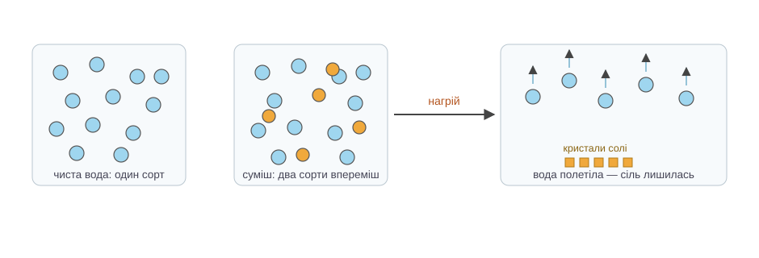

# Розділ 1.1 — Хімія і речовини

Хімія має погану репутацію: формули, таблиці, щось вибухає. Насправді вона про питання, яке ти ставиш собі щодня, навіть не помічаючи: «що це за штука і чому вона так поводиться?» Цей розділ — про найпершу навичку хіміка: бачити різницю між «річ змінила вигляд» і «з'явилося щось нове».

## 1.1.1 Речовини й перетворення

Постав поруч дві звичні картини. У склянці тане лід. На сковорідці підгорає млинець. В обох випадках «щось сталося». Але між цими подіями — прірва, і саме з неї починається хімія.

Спершу домовимось про слово. **Речовина** — це те, з чого зроблені речі: склянка — річ, а скло — речовина; цвях — річ, а залізо — речовина. Одна й та сама речовина може бути в тисячі різних речей.

Тепер до льоду. Він розтанув — і став водою. Вигляд змінився повністю: був твердий і тримав форму, стала рідина. Але речовина лишилась та сама — вода. Постав склянку в морозилку, і отримаєш той самий лід назад. Такі зміни називають **фізичними**: речовина зосталась собою, змінилося тільки те, як її частинки зараз «упаковані» — щільно й нерухомо чи вільно й текуче.

З млинцем цей фокус не пройде. Підгорілу скоринку не повернеш назад у тісто — ні холодом, ні теплом, нічим. Бо скоринка — це вже **нова речовина**: інший колір, інший запах, інші властивості. Це і є **хімічне** перетворення, або **реакція**: те, з чого складалося тісто, перебудувалося в щось інше. З яких «цеглинок» зібрані всі речовини і що саме в них перебудовується — про це наступний розділ; поки що тримаймося головного: стара речовина зникає, нова з'являється.

Як помітити реакцію без лабораторії? Є чотири класичні підказки: стійко змінився колір; пішли бульбашки газу там, де ніхто нічого не кип'ятив; у прозорій рідині з'явилася каламуть — **осад**; виділилося тепло чи світло без підігріву ззовні. Тільки пам'ятай: кожна підказка — саме підказка, а не вирок. Вода в чайнику теж булькає, хоч кипіння — фізичне явище. Тому вирішальне питання завжди одне: чи з'явилася нова речовина? Є і побутовий тест: якщо все можна повернути назад простим охолодженням чи випарюванням — швидше за все, перетворення фізичне. Цукор, що «зник» у чаї, нікуди не дівся: випаруй воду — і він повернеться. А от попіл у дрова не повернеться ніколи.

*Рис. 1.1.1-1. Зліва — лід, вода й пара: частинки ті самі, різниться лише «упаковка», тому стрілки двосторонні. Справа — горіння: частинки склалися в нові зчіпки, з'явилася нова речовина, і назад дороги нема.*

> 🏠 Кухня щодня показує обидва види перетворень: лід у склянці — фізичне, рум'яна скоринка на хлібі в тостері — хімічне.

> 💡 **Одним реченням.** Якщо речовина лишилася тією самою і змінилась лише її «упаковка» — це фізичне перетворення; якщо з'явилася нова речовина з новими властивостями — відбулася хімічна реакція.

## 1.1.2 Чисті речовини й суміші

На пляшці мінеральної води пишуть «чиста природна вода», а поруч — таблиця: кальцій, магній, натрій, гідрокарбонати… Дивна якась «чистота». Річ у тім, що побутове «чисте» означає «без бруду», а в хімії це слово має точніший зміст — і з нього багато що випливає.

Для хіміка **чиста речовина** — та, що складається з частинок одного сорту. Дистильована вода з аптеки — чиста: в ній лише частинки води, тому в неї одна температура замерзання, один смак (точніше, його відсутність), одна поведінка. Чиста речовина в усьому передбачувана.

Але майже все навколо — **суміші**: частинки кількох сортів, просто перемішані між собою. Морська вода, повітря, чай, граніт — і та сама мінералка з етикетки. Головне слово тут — «просто». У суміші частинки не зчепилися в щось нове (тоді це була б реакція з новою речовиною, як у попередній темі) — вони лише сусідять. Тому кожен складник зберігає власний характер: сіль у морській воді так само солона, цукор у чаї так само солодкий. Перемішування — фізичне перетворення.

І саме тому суміш можна розібрати назад — теж фізично, без жодної хімії. Рецепт один: знайди властивість, якою складники різняться, і скористайся нею. Пісок не пролазить крізь дрібні пори паперу, а вода пролазить — це **фільтрування**. Пісок важчий за воду: дай постояти, сам ляже на дно — це **відстоювання**. Вода за теплого дня летить у повітря, а сіль так не вміє — це **випарювання**. Нема різниці — нема й способу: сіль крізь фільтр проходить разом із водою, тут фільтрування безсиле.

А чи можна так само розібрати чисту воду — дістати з неї щось простіше? Фільтром, відстоюванням, випарюванням — ні. Всі її частинки однакові, нема за що вхопитися. Розкласти воду можна лише хімічно — зруйнувавши самі частинки. А от що в них усередині — це вже питання наступного розділу.

*Рис. 1.1.2-1. У чистій воді частинки одного сорту, в солоній — двох. Нагрівання користується різницею властивостей: частинки води відлітають у повітря, а частинки солі літати не вміють — лишаються кристалами.*

> 🏠 Фільтр кавоварки і друшляк на кухні — те саме фільтрування: рідина проходить, тверде лишається.

> 🧪 **Спробуй сам.** Розмішай у половині склянки теплої води ложку солі, вилий ложку-дві розчину в блюдце і постав на підвіконня на день-два. Вода полетить у повітря, а на блюдці лишиться біла облямівка зі справжніх кристаликів солі — ти розібрав суміш на складники. ⚠️ Не пробуй пришвидшити справу на плиті: гарячі бризки солоної води боляче стріляють. Підвіконня впорається саме.

> 💡 **Одним реченням.** Чиста речовина — це один сорт частинок, суміш — кілька сортів упереміш, і поки кожен складник зберігає свої властивості, суміш можна розібрати фізично — знайшовши властивість, якою складники різняться.

> ▶️ Далі: [Розділ 1.2 — Атом](../r2-atom/r2-atom.md)
