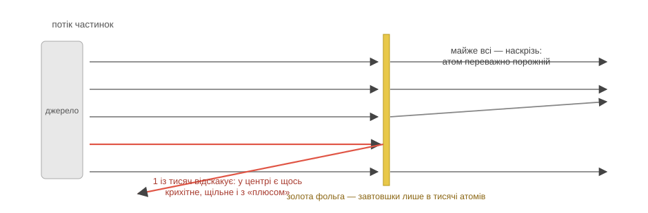

# Розділ 1.2 — Атом

У попередньому розділі ми раз у раз казали «частинки» — і жодного разу не пояснили, що це таке. Час розплатитися за це слово. Цей розділ — про найголовнішу ідею всієї хімії: усе на світі зібране з крихітних цеглинок, і сортів цих цеглинок на диво мало.

## 1.2.1 Атоми й молекули

Відкрий флакон парфумів в одному кутку кімнати — за хвилину запах уже в протилежному. Вітру немає, ніхто нічого не переносив. Отже, через кімнату пролетіло щось невидиме, нечутне — і в величезній кількості. Що саме?

Хімія відповідає: крихітні частинки самої речовини. І доказів цьому повно в побуті. Цукор у чаї «зникає», але солодка кожна крапля — отже, він розпався на щось таке дрібне, що його не видно, і це щось розповзлося по всій склянці. Повітря у велосипедному насосі легко стискається вдвічі — отже, між його частинками повно порожнечі, якій є куди зменшуватись. Запах перелітає кімнату — отже, шматочки парфумів справді мандрують повітрям. Усе сходиться на одному: речовина не суцільна. Вона зерниста.

Тепер головне зерно. Уяви, що ріжеш шматок заліза навпіл, потім ще раз, і ще. Цей поділ не нескінченний: рано чи пізно в руках лишиться найменша порція, яка все ще є залізом. Її називають **атомом** — це цеглинка, яку звичайними хімічними засобами вже не поділити. Атоми неймовірно малі: у склянці води їх більше, ніж склянок води в усіх океанах Землі.

Поодинці атоми мандрують рідко. Найчастіше вони зчеплені по кілька штук — таку зчіпку називають **молекулою**. Частинки води з минулого розділу — це якраз молекули: у кожній три атоми, два одного сорту й один іншого. Молекула парфумів, що летіла через кімнату, — кілька десятків атомів, зчеплених у точно визначеному порядку.

Звідси — перший великий поділ усіх речовин. Якщо речовина зібрана з атомів одного сорту, її називають **простою**: залізо — самі атоми заліза, кисень у повітрі — молекули з двох однакових атомів. Якщо сортів кілька — речовина **складна**: вода, цукор, вуглекислий газ. І зверни увагу: складна речовина — це не суміш. У суміші різні частинки просто лежать поруч і кожна живе своїм життям; у складній речовині різні атоми зчеплені в одній молекулі — і поводяться як одне ціле з власним характером, не схожим на характери складників.

*Рис. 1.2.1-1. Два сорти атомів дають три різні картини: проста речовина (зчіпки з однакових атомів), складна (різні атоми в одній зчіпці) і суміш (різні молекули просто поруч).*

> 🏠 Запах борщу в під'їзді — це буквально молекули борщу, які долетіли до твого носа.

> 💡 **Одним реченням.** Речовина зерниста: її цеглинки — атоми, зчіпки атомів — молекули; з атомів одного сорту складені прості речовини, з різних, зчеплених в одну молекулу, — складні.

## 1.2.2 Всередині атома

Слово «атом» прийшло з грецької і означає «неподільний». Найцікавіше в цій назві те, що вона бреше. Усередині атома є цілий світ — і саме його будова пояснює все, що відбуватиметься далі в цій книзі.

Отже, що там. У самому центрі сидить **ядро** — щільний клубочок із частинок двох видів. **Протони** несуть електричний заряд, який домовилися називати «плюсом». **Нейтрони** заряду не мають — вони просто додають ядру ваги. А навколо ядра рояться **електрони** — легесенькі частинки із зарядом «мінус». Правило зарядів просте: однакові відштовхуються, протилежні притягуються. Саме притягання «мінуса» до «плюса» і тримає електрони біля ядра — атом не розсипається не тому, що щось його склеїло, а тому, що його тримає електрика.

Тепер пропорції — вони приголомшливі. Протон важчий за електрон майже у дві тисячі разів, тож практично вся маса атома зібрана в ядрі. А от місця ядро займає мізер: якби атом роздути до розмірів стадіону, ядро було б мухою в центрі поля. Усе інше — порожнеча, в якій носяться кілька електронів. Виходить, стіл, книжка і твоя рука — майже суцільне порожнє місце. Чому ж рука не провалюється крізь стіл? Бо зовнішні електрони руки і стола відштовхуються — «мінус» від «мінуса». Твердість речей — це не «щільно набита матерія», це сила електрики.

Лишилося розселити електрони. Вони не висять де завгодно: навколо ядра є кілька «поверхів» — **оболонок**, і ми в цій книзі зватимемо їх поличками. У кожної полички обмежена місткість: на першій уміщаються лише 2 електрони, на другій — до 8. Заповнюються вони знизу вгору: спершу ближня до ядра, потім наступна. Чому місткість саме така — пояснює квантова фізика, і це той випадок, коли ми чесно беремо правило без виведення: для всієї шкільної хімії досить його самого.

А тепер найважливіше речення розділу. Із сусідніми атомами зустрічається не ядро і не глибинні електрони — а ті, що на **зовнішній поличці**. Тому саме вона визначає характер атома: чіплятиметься він до сусідів, як саме і наскільки охоче. Запам'ятай зовнішню поличку — це головна героїня всієї хімії, і вже через розділ вона пояснить тобі, навіщо атоми взагалі з'єднуються.

*Рис. 1.2.2-1. Зліва — ядро з протонів (+) і нейтронів та електрони (−) на поличках. Справа — чесний масштаб: майже весь атом — порожнеча.*

> 📜 Звідки відомо, що всередині атома порожньо, а в центрі — щільне ядро? У 1909 році в Манчестері Ганс Гейгер і Ернест Марсден за задумом Ернеста Резерфорда обстрілювали найтоншу золоту фольгу крихітними швидкими частинками. Очікували, що всі вони пролетять наскрізь, ледь гойднувшись, — атом тоді уявляли пухкою «булочкою» з рівномірно розмазаним зарядом. Майже так і було: тисячі частинок пролітали, наче фольги немає. Але приблизно одна з восьми тисяч відскакувала назад. Резерфорд згадував: це було так само неймовірно, «як стріляти п'ятнадцятидюймовим снарядом у цигарковий папір — і дістати снарядом у відповідь». Два роки він рахував і 1911-го оголосив висновок: майже вся маса і весь «плюс» атома стиснуті в крихітну цятку в центрі. Так із дослідного подиву народилося ядро.

*Рис. 1.2.2-2. Майже всі частинки пролітають фольгу наскрізь — атом порожній; рідкісна відскакує — у центрі є щось крихітне, щільне і заряджене «плюсом».*

> 🏠 Іскра від светра і волосся, що липне до гребінця, — це електрони, зірвані тертям із зовнішніх поличок атомів.

> 💡 **Одним реченням.** Атом — це крихітне важке ядро з «плюсом» і легкі електрони з «мінусом» на поличках навколо, і характер атома визначає те, скільки електронів сидить на зовнішній поличці.

## 1.2.3 Елемент — це номер

У попередній темі сховався парадокс. Усі атоми на світі зібрані з тих самих трьох деталей: протони, нейтрони, електрони. Але атом заліза й атом кисню — зовсім різні за характером. Як із однакових деталей виходять різні атоми?

Відповідь несподівано проста: справа в лічбі. Сорт атома задає одне-єдине число — **скільки протонів у його ядрі**. Один протон — це Гідроген. Вісім — Оксиген. Двадцять шість — Ферум. Додай до ядра ще один протон, і атом стане іншим сортом з іншим характером: дев'ять протонів — це вже Флуор. Сорт атомів з однаковим числом протонів називають **хімічним елементом**, а саме число — **порядковим номером** елемента. Електрони під це число просто підлаштовуються: у спокійного атома їх рівно стільки ж, скільки протонів, — «мінуси» врівноважують «плюси».

Чому це число таке непорушне? Бо протони сидять у ядрі, а ядро — недоторканне для хімії. Усе, що вміють хімічні реакції, — переставляти й ділити електрони на зовнішніх поличках; до ядра вони не дотягуються. Тому жодна реакція не перетворить один елемент на інший. Тут, до речі, і розгадка невдачі алхіміків із першого розділу: вони намагалися зробити золото зі свинцю хімічними засобами — а це означає змінити число протонів, до якого хімія в принципі не має доступу.

У кожного елемента є ім'я і коротка позначка — **символ** з однієї-двох літер. Символи беруть з латинських назв, тому вони однакові в книжках усього світу: Ферум — Fe (латиною Ferrum), Оксиген — O, Гідроген — H, золото — Au (Aurum). І домовимося про написання, яким користується школа: назву елемента пишуть з великої літери, а назву простої речовини — з малої. **Ферум** — це сорт атомів; **залізо** — метал, який можна потримати в руці. **Оксиген** — сорт атомів; **кисень** — газ, яким ти дихаєш.

Лишилися нейтрони. Вони на сорт не впливають: атом із вісьма протонами — Оксиген хоч із вісьма нейтронами, хоч із дев'ятьма. Такі версії одного елемента називають **ізотопами** — той самий елемент, трохи інша маса. Для хімії ізотопи майже нерозрізненні, і це логічно: хімія дивиться на електрони, а їх у ізотопів порівну.

*Рис. 1.2.3-1. Один протон — Гідроген, вісім — Оксиген, двадцять шість — Ферум; а додатковий нейтрон сорт не міняє — це лише ізотоп того самого елемента.*

> 🏠 «Йод у солі», «Кальцій у молоці», «Ферум у гречці» — на упаковках ідеться про елементи, тобто про сорт атомів у складі їжі, а не про шматочки металу в каші.

> 💡 **Одним реченням.** Елемент — це сорт атомів, заданий одним числом — кількістю протонів у ядрі; хімія цього числа змінити не може, тому в реакціях елементи не перетворюються одне на одного.

> ▶️ Далі: [Розділ 1.3 — Періодична таблиця](../r3-table/r3-table.md)
