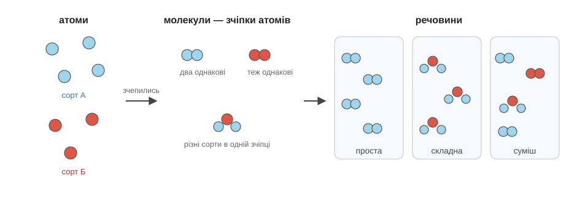
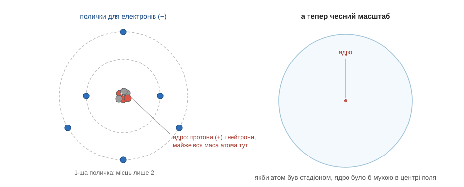
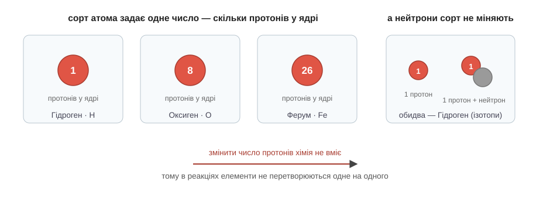

# Розділ 1.2 — Атом

У першому розділі ми домовилися про слово «речовина» і навчилися відрізняти, коли речовина просто змінює вигляд, а коли перетворюється на іншу. Але щоразу, тільки-но мова заходила про те, що відбувається *всередині*, ми натикалися на туманне слово «частинки» — і обходили його стороною. Настав час зазирнути туди. Цей розділ — про найголовнішу здогадку всієї хімії: про те, що весь неосяжний світ речей зібраний із дрібнесеньких цеглинок, і що сортів цих цеглинок навдивовижу мало. Підемо повільно, бо саме звідси виростає геть усе подальше.

## 1.2.1 Атоми й молекули

Почнімо з простого спостереження, яке кожен бачив сотні разів, але навряд чи зупинявся подумати, що воно означає. Хтось відкриває флакон парфумів в одному кутку кімнати — і за хвилину-другу запах чути в протилежному кутку. Вікна зачинені, протягу немає, ніхто пляшечку через кімнату не носив. А запах усе одно дістався протилежної стіни. Як?

Зупинімося на цьому довше, ніж звикли. Якби парфуми були суцільною речовиною, гладенькою і цільною, як здається оку, — нічого б не сталося: рідина лишилася б собі у флаконі. Але щось же долетіло до твого носа — інакше ти б не чув запаху. Виходить, від рідини відокремилося і помандрувало повітрям щось украй дрібне, невидиме, та все-таки цілком справжнє. І цього «щось» було багато, бо запах наповнив увесь простір, а не дотягнувся тонкою цівкою до однієї точки.

Саме по собі одне спостереження ще можна було б відмахнути. Та коли почати придивлятися, такі підказки трапляються на кожному кроці. Розмішай ложку цукру в склянці чаю — і він зникає з очей, наче розчинився в ніщо. Але ж чай став солодким, і солодкий він у кожній краплі, хоч із дна, хоч згори. Отже, цукор не зник — він розпався на щось таке дрібне, що його вже не видно, і це щось рівномірно розповзлося по всій склянці. Або візьми велосипедний насос, затисни пальцем отвір і натисни на ручку: повітря всередині слухняно стискається мало не вдвічі. А це можливо лише тоді, коли між частинками повітря є вільне місце, порожнеча, якій є куди дітися, коли їх зіштовхують ближче.

Кожне з цих спостережень окремо — дрібниця. Але всі разом вони вперто показують на одне й те саме: **речовина не суцільна, вона зерниста**. Те, що оку здається гладеньким і цільним, насправді складене з безлічі окремих дрібнесеньких часточок. Ця думка така стара, що їй понад дві тисячі років, — і водночас така незвична, що остаточно її довели лише трохи більше століття тому. Тож якщо вона дається не одразу — це нормально, людству вона теж далася не одразу.

Тепер, коли ми переконалися, що часточки є, дамо їм ім'я. Уяви, що ти береш шматок чистого заліза й ріжеш його навпіл. Половинку — знову навпіл. І ще, і ще, уявно роблячи це найгострішим ножем на світі. Чи можна так різати без кінця? Виявляється, ні. Рано чи пізно в руках лишиться найдрібніша порція, яка ще є залізом, — поділи її далі, і це вже буде не залізо, а щось зовсім інше. Оцю найменшу порцію речовини, яку хімічними засобами поділити вже не вдається, і називають **атомом**. Слово грецьке й означає буквально «неподільний». Атоми незбагненно малі — настільки, що в одній склянці води їх більше, ніж склянок води помістилося б в усіх океанах Землі. Саме тому ми їх і не бачимо, і саме тому здогадка про зернистість світу далася людям так важко.

Атоми рідко мандрують поодинці. Найчастіше кілька атомів міцно тримаються разом, утворюючи стійку групку, — і таку групку зчеплених атомів називають **молекулою**. Тут варто пригадати воду з попереднього розділу: те, що ми обережно звали «частинками води», — це і є молекули, і в кожній молекулі води рівно три атоми, два одного сорту й один іншого. А молекула парфумів, яка щойно перелетіла кімнату, — це кілька десятків атомів, з'єднаних у суворо визначеному порядку; саме цей порядок і дає їй неповторний запах.

З цієї простої картини — атоми, що поодинці чи зчеплені в молекули, — випливає перший великий поділ усіх речовин на світі, і він стане нам у пригоді не раз. Якщо речовина складена з атомів **одного-єдиного сорту**, її називають **простою**. Залізо — це самі лише атоми заліза, нічого більше; кисень, яким ми дихаємо, — це молекули, у кожній з яких по два однакові атоми. А якщо в речовині поєднані атоми **різних сортів**, її називають **складною**: такі вода, цукор, вуглекислий газ.

*Рис. 1.2.1-1. Два сорти атомів дають три різні картини: проста речовина (зчіпки з однакових атомів), складна (різні атоми в одній молекулі) і суміш (різні молекули просто лежать поруч).*

І тут легко спіткнутися, тож зробімо крок повільно. Складна речовина — це **не те саме**, що суміш із минулого розділу, хоч на перший погляд і там, і там «змішані різні атоми». Різниця в тому, наскільки міцно вони пов'язані. У суміші — згадай солону воду — різні частинки просто сусідять, не тримаючись одна одної: кожна живе своїм життям, і саме тому сіль вдавалося відділити від води простим випарюванням. А у складній речовині різні атоми **по-справжньому зчеплені в одну молекулу** — і ця молекула поводиться як єдине ціле, з власним характером, геть не схожим на характери атомів, з яких вона зібрана. Розділити її випарюванням чи фільтром уже не вийде — потрібна справжня хімічна реакція, яка розриває зчеплення. Ось чому з води, хоч скільки її грій, не дістати ні крихти заліза: у її молекулах заліза просто немає.

То скільки ж усього є сортів атомів, з яких зібраний цей величезний світ? Менше, ніж можна було б подумати, — і це наступне, у чому варто розібратися.

## 1.2.2 Всередині атома

Ми щойно назвали атом «неподільним» — так каже і його грецьке ім'я. Найцікавіше, що ім'я це нечесне. Усередині атома ховається цілий улаштований світ, і саме його будова, коли ми її роздивимося, пояснить нам усе подальше: чому одні атоми жадібно злипаються, інші байдужі до всіх, чому залізо іржавіє, а золото — ні. Тому витратимо на це найбільше уваги в розділі.

Як узагалі можна заглянути всередину чогось, чого навіть не видно? Прямо — ніяк. Але людина навчилася хитрого прийому: жбурляти в невидиму ціль чимось дрібним і дивитися, як воно відскакує. Так само ти міг би в темній кімнаті кидати м'ячики й за відскоками здогадатися, де стоять меблі. Понад сто років тому фізики влаштували такий самий дослід — і те, що вони побачили, спершу їх приголомшило.

> 📜 У 1909 році в Манчестері двоє — Ганс Гейгер і молодий студент Ернест Марсден — за задумом свого керівника Ернеста Резерфорда взялися обстрілювати найтоншу золоту фольгу крихітними швидкими частинками й дивитися, куди ті полетять. Усі наперед знали, яким буде результат. Атом тоді уявляли пухкою грудочкою, у якій заряд і маса рівномірно розмазані, — крізь таку грудочку дрібні швидкі частинки мали б пролітати майже не відхиляючись, як камінці крізь туман. Так здебільшого й виходило: тисячі частинок прошивали фольгу наскрізь, ледь гойднувшись. Але приблизно одна з кожних восьми тисяч раптом відскакувала **назад**, наче вдарившись об стіну. Резерфорд згодом казав, що це було найнеймовірніше враження його життя — «так само неймовірно, якби ви вистрілили п'ятнадцятидюймовим снарядом у цигарковий папір, а він відскочив би й влучив у вас». Два роки пішло на те, щоб осмислити побачене, і 1911-го Резерфорд оголосив висновок, який і донині лежить в основі наших уявлень про атом.

Подумаймо разом, що означав той дослід, — бо це міркування варте того, щоб пройти його самому. Якщо майже всі частинки пролітають фольгу наскрізь, наче її й немає, то атом здебільшого **порожній**: летіти крізь нього майже нема об що зачепитися. Але якщо зрідка частинка таки відскакує назад, та ще й різко, — значить, десь у атомі сидить щось украй маленьке (бо влучають у нього рідко), дуже важке і щільне (бо воно здатне відкинути швидку частинку назад). Так і вималювалася картина: майже весь атом — порожнеча, а вся його вага і весь міцний осердок зібрані в крихітну цятку в самому центрі. Цю цятку назвали **ядром**.

Тепер роздивімося, що ж там усередині, з чого складений атом. У самому центрі — те саме ядро, щільний клубочок із частинок двох видів. Перші — **протони**; кожен протон несе електричний заряд, який домовилися називати «плюсом». Другі — **нейтрони**; ці заряду не мають зовсім, вони просто додають ядру ваги. А навколо ядра, у тій величезній за атомними мірками порожнечі, рухаються **електрони** — крихітні легкі частинки, кожна з яких несе заряд «мінус».

Тут потрібне одне правило, без якого далі не зрушити, — правило про заряди. Воно коротке: **однакові заряди відштовхуються, протилежні притягуються**. Два «плюси» розбігаються, два «мінуси» теж, а от «плюс» і «мінус» тягнуться одне до одного. Саме це притягання й тримає електрони біля ядра: ядро з протонами заряджене «плюсом», електрони — «мінусом», і протилежне тягнеться до протилежного. Зверни увагу, наскільки це гарно: атом не розсипається не тому, що його хтось склеїв, а тому, що його стягує докупи звичайнісінька електрична сила. Атом тримається на електриці.

Тепер — про пропорції, бо вони справді вражають. Один протон важчий за один електрон майже у дві тисячі разів. Це означає, що практично вся вага атома зосереджена в ядрі, а легкі електрони майже нічого до неї не додають. А от місця ядро займає до смішного мало. Уяви, що ми роздули атом до розмірів великого стадіону: так от, ядро в ньому було б завбільшки з муху, що сидить десь у центрі поля. Усе решта — порожнеча, в якій ширяють кілька ще дрібніших електронів.

З цього випливає геть несподівана річ, на якій варто на мить спинитися. Якщо атоми майже порожні, то й усе, що з них складене, — теж: і стіл, і книжка, і твоя власна рука всередині майже суцільна порожнеча. Чому ж тоді рука не провалюється крізь стіл, коли ти на нього спираєшся? Здавалося б, дві майже порожні речі мали б вільно пройти одна крізь одну. А не проходять — і причина та сама електрична. Зовні кожного атома сидять електрони із зарядом «мінус». Коли атоми руки наближаються до атомів стола, їхні зовнішні «мінуси» зустрічаються — і відштовхуються, бо однакові заряди розбігаються. Те, що ми відчуваємо як твердість стола, як опір під долонею, — це насправді не «щільно набита матерія», а сила відштовхування електронів. Світ значно порожніший і значно більше тримається на електриці, ніж підказують нам відчуття.

*Рис. 1.2.2-1. Зліва — ядро з протонів (+) і нейтронів та електрони (−) навколо. Справа — чесний масштаб: майже весь атом порожній.*

Лишилося розібратися, як саме розташовані електрони навколо ядра, — і це останнє, що нам потрібне від будови атома, зате найважливіше. Електрони не висять де попало й не злипаються всі гуртом біля ядра. Вони розподілені по кількох «поверхах», які в науці звуть оболонками, а ми для наочності зватимемо їх **поличками**. Кожна поличка вміщає лише обмежену кількість електронів: на найближчій до ядра — тільки два, на наступній — до восьми. Заповнюються вони по порядку, знизу вгору: спершу до краю набивається ближня поличка, і лише коли на ній місця більше немає, електрони починають сідати на наступну. Чому місткість саме така — два, потім вісім — пояснює вже не хімія, а глибша наука про найдрібніше, квантова фізика. Це той чесний випадок, коли ми беремо правило готовим і користуємося ним, не виводячи: для всього, що нам знадобиться далі, цього правила цілком досить, а виведення нічого не додало б до розуміння.

А тепер — найважливіше речення цілого розділу, заради якого все й писалося. Коли два атоми зустрічаються, стикаються між собою саме **зовнішні** полички — ті електрони, що сидять найдалі від ядра. Глибші полички й саме ядро заховані всередині й до сусіда не дотягуються, як і він до них. Тому весь характер атома — чи горнутиметься він до інших, чи буде до всіх байдужий, з ким поєднається, а з ким нізащо, — вирішує те, скільки електронів сидить на його зовнішній поличці. Запам'ятай цю зовнішню поличку. Це головна дійова особа всієї хімії, і вже в наступному розділі вона почне пояснювати тобі, чому атоми взагалі тягнуться одне до одного.

## 1.2.3 Елемент — це номер

Ми щойно з'ясували, що всі атоми зібрані з тих самих трьох деталей — протонів, нейтронів і електронів. І відразу натрапляємо на загадку. Якщо деталі однакові, то звідки беруться різні атоми? Адже атом заліза і атом кисню несхожі до невпізнання: одне — твердий сірий метал, друге — невидимий газ, без якого не дихнути. Як із однакових цеглинок виходять настільки різні речі?

Відповідь напрочуд проста, аж не віриться: уся різниця — в кількості. Сорт атома задає одне-єдине число — **скільки протонів сидить у його ядрі**. І більш нічого. Атом з одним протоном — це Гідроген. З вісьма протонами — Оксиген. З двадцятьма шістьма — Ферум, тобто залізо. Додай до ядра ще один протон — і перед тобою вже інший атом, з іншим характером: дев'ять протонів замість восьми, і це вже не Оксиген, а Флуор. Сорт атомів, у яких однакове число протонів, називають **хімічним елементом**, а саме це число — **порядковим номером** елемента. Електрони ж під нього просто підлаштовуються: у спокійного, ні з ким не зчепленого атома їх рівно стільки, скільки протонів, бо «мінуси» точно врівноважують «плюси», і атом загалом виходить незаряджений.

Тут варто на мить спинитися й оцінити, наскільки це число непорушне. Протони сховані глибоко в ядрі, а ядро, як ми бачили, заховане в самому осерді атома, куди зовнішні зустрічі не дістають. Усе, на що здатна хімія, — це перебудовувати електрони на зовнішніх поличках: десь забрати, десь додати, десь поділити з сусідом. До ядра вона не дотягується ніколи. А це означає, що **жодна хімічна реакція не може перетворити один елемент на інший** — для цього довелося б змінити число протонів, а воно хімії непідвладне. Ось, до речі, і розгадка давньої невдачі алхіміків, про яку ми згадували на самому початку: століттями вони намагалися перетворити дешевий свинець на золото хімічними засобами. Тепер видно, чому в них нічого не вийшло й вийти не могло: золото від свинцю відрізняється саме числом протонів у ядрі, а до ядра жодне товчіння в ступці й жодне нагрівання не дістається.

Коли елементів набралося багато, їм знадобилися зручні позначки. У кожного елемента є ім'я і коротка позначка — **символ** з однієї-двох літер, яку беруть здебільшого з латинської назви. Тому ці символи однакові в підручниках усього світу, якою б мовою вони не були написані: Гідроген усюди позначають H, Оксиген — O, а Ферум — Fe, від латинського *Ferrum*; золото — Au, від *Aurum*. Заразом домовимося про написання, якого дотримується школа і яким користуватимемося ми, щоб не плутатися. Назву **елемента** — тобто сорту атомів — пишуть з великої літери, а назву простої **речовини**, яку можна побачити й потримати, — з малої. Тож «Ферум» — це сорт атомів, а «залізо» — той метал, з якого кують цвяхи; «Оксиген» — сорт атомів, а «кисень» — газ, яким ми дихаємо. Різниця тонка, але вона допоможе завжди розуміти, про що саме йдеться — про невидимий атом чи про відчутну на дотик речовину.

*Рис. 1.2.3-1. Один протон — Гідроген, вісім — Оксиген, двадцять шість — Ферум; а зайвий нейтрон сорт не міняє — це лише важча версія того самого елемента.*

Залишилося прибрати одну дрібну незрозумілість. Ми сказали, що сорт атома задають протони, — а як же тоді нейтрони, ті другі мешканці ядра? Виявляється, на сорт вони не впливають зовсім. Атом із вісьма протонами лишається Оксигеном, скільки б нейтронів до нього не додати — хоч вісім, хоч дев'ять, хоч десять. Такі версії одного елемента, з однаковим числом протонів, але різною кількістю нейтронів, називають **ізотопами**: це той самий елемент, лише трохи важчий або легший. Для хімії ізотопи майже не різняться між собою, і тепер зрозуміло чому: хімія дивиться тільки на електрони, а їх у всіх ізотопів одного елемента порівну, бо протонів порівну.

Отож підсумуймо, до чого ми дійшли в цьому розділі, бо це і є той фундамент, на якому стоятиме все подальше. Світ зібраний з атомів — крихітних цеглинок, яких на диво мало сортів. Кожен атом — це важке ядро з протонів та нейтронів і легкі електрони, що тримаються біля нього електричною силою. Сорт атома — його елемент — задає одне число, кількість протонів, і змінити його хімія не може. А весь характер атома, уся його хімічна поведінка вирішується на зовнішній поличці електронів. Саме за цю зовнішню поличку ми й візьмемося в наступному розділі — і побачимо, як із неї виростає геть усе: чому атоми з'єднуються, чому одні роблять це охоче, а інші ніколи, і чому світ улаштований саме так, як він улаштований.

> ▶️ Далі: [Розділ 1.3 — Періодична таблиця](../r3-table/r3-table.md)
