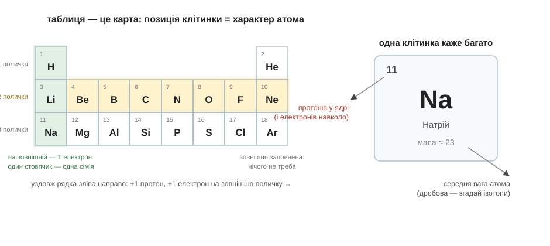
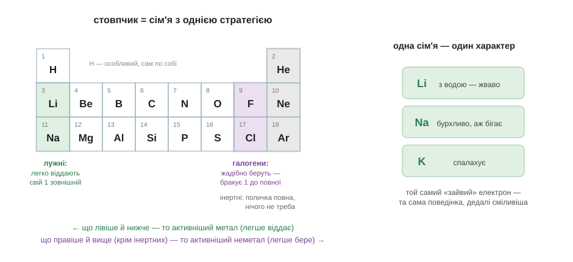

# Розділ 1.3 — Періодична таблиця

Ми вже знаємо, що сорт атома — це число протонів. Тепер питання практичне: сортів понад сотню. Невже доведеться знайомитися з кожним окремо? На щастя, ні — для цього в хімії є головний інструмент, і цей розділ навчить ним користуватися.

## 1.3.1 Як читати таблицю

У хімічному кабінеті на стіні висить найвідоміший плакат школи — періодична таблиця. Більшість дивиться на неї з тугою: сотня з гаком клітинок, і все це нібито «треба знати». Насправді все навпаки. Таблицю придумали саме для того, щоб **не** вчити кожен елемент окремо.

Почнімо з однієї клітинки. У ній є число, символ і маса. Число — це вже знайомий нам порядковий номер: скільки протонів у ядрі, а отже і скільки електронів навколо. Маса — середня вага атома; вона зазвичай дробова, бо в природі елемент живе сумішшю ізотопів, і таблиця чесно усереднює.

Тепер рядки. Рядок таблиці називають **періодом**, і його номер означає просту річ: скільки поличок зайнято електронами. Перший рядок — одна поличка; туди вміщається лише два електрони, тому в рядку всього два елементи — Гідроген і Гелій. Другий рядок — дві полички, третій — три. А рух уздовж рядка зліва направо — це додавання по одному протону в ядро й по одному електрону на зовнішню поличку: вона наповнюється просто в тебе на очах.

Коли поличка заповнюється вщерть, наступний електрон сідає на нову — починається новий рядок. І тут стається головне диво таблиці: атоми, що опинилися в одному стовпчику, мають **однакову кількість електронів на зовнішній поличці**. А ми пам'ятаємо: характер атома визначає саме зовнішня поличка. Тому стовпчик — його називають **групою** — це сім'я з однаковим характером: Літій, Натрій, Калій стоять один під одним і поводяться як близькі родичі.

Ось чому таблиця — карта, а не плакат для зубріння. Знайди елемент: рядок скаже, скільки в нього поличок, стовпчик — що в нього на зовнішній, а отже і чого від нього чекати. Позиція вже містить головне. (Чесна примітка: у середині довгих рядів сидять «перехідні» метали, у яких правило зовнішньої полички хитріше, — подробиці лиши великій книзі.)

*Рис. 1.3.1-1. Рядок лічить зайняті полички, стовпчик збирає атоми з однаковою зовнішньою поличкою, а одна клітинка повідомляє номер (протони й електрони) і середню масу атома.*

> 📜 Таблицю склав 1869 року Дмитро Менделєєв — за переказами, розклавши картки з властивостями елементів, як пасьянс. Він був не один: у ті самі роки навколо ідеї кружляли Джон Ньюлендс і Лотар Маєр. Але Менделєєв повірив у закономірність сильніше за всіх: там, де елемент «не знаходився», він лишив порожні клітинки і зухвало передбачив властивості трьох ще не відкритих елементів. Коли 1875-го знайшли галій, а 1886-го германій, передбачення збіглися вражаюче точно; першовідкривачу галію Менделєєв навіть написав, що той неправильно виміряв густину, — і мав рацію. Історію про те, що таблиця наснилася йому уві сні, переказував лише один його знайомий; сам Менделєєв відповідав, що думав над нею років двадцять. І найкрасивіше: про протони він не знав нічого — впорядковував за масою та характером. Чому його таблиця працює, наука зрозуміла лише через півстоліття.

> 🏠 Згадай етикетку мінералки з першого розділу: Кальцій, Магній, Натрій. Це прямі адреси клітинок таблиці — тепер ти вмієш їх знаходити й читати.

> 💡 **Одним реченням.** Періодична таблиця — карта атомних характерів: номер клітинки лічить протони, рядок — зайняті полички, а стовпчик збирає родичів з однаковою зовнішньою поличкою.

## 1.3.2 Родини елементів

Літій у воді жваво шипить. Натрій — шипить, бігає по поверхні й може спалахнути. Калій — спалахує одразу. Три різні метали, а поведінка та сама, тільки дедалі сміливіша. І в таблиці вони стоять один під одним. Це не збіг — це сімейна схожість, і тепер ми знаємо, звідки вона береться.

У всіх трьох на зовнішній поличці сидить один-єдиний електрон. Віддати його легко — і вони віддають за першої ж нагоди. Цю сім'ю називають **лужними металами**: найщедріші давачі електронів у таблиці. Саме тому в природі вони не трапляються в чистому вигляді: кожен давно вже з кимось з'єднався.

На протилежному краю таблиці живе протилежний характер. **Галогенам** — Флуору, Хлору, Брому, Йоду — до повної зовнішньої полички бракує рівно одного електрона, тому це найжадібніші хапачі. Чистий хлор — отруйний жовто-зелений газ: він рве електрони майже з усього, до чого дотягнеться. Але той самий Хлор, який уже забрав електрон у Натрію, — це половина кухонної солі. Запам'ятай цей парадокс: найбуйніший метал плюс найагресивніший газ дають мирну їстівну сіль. Чому так стається — головна загадка наступного модуля.

А між цими крайнощами є сім'я, якій не треба нічого. В **інертних газів** — Гелію, Неону, Аргону — зовнішня поличка заповнена вщерть: ні віддати зайве, ні добрати бракуюче. Тому вони майже не вступають у реакції: гелій у святковій кульці не горить, аргоном наповнюють лампи саме за цю байдужість.

Звідси видно і найбільший поділ таблиці. Зліва й унизу — **метали**: їм легше віддавати зовнішні електрони, і що лівіше й нижче, то охочіше. Справа і вгорі — **неметали**: їм легше добирати, і що правіше й вище (інертних не рахуємо), то жадібніше. Межа між половинами нечітка, на ній сидять елементи з подвійним характером — їх покаже велика книга. Але сама логіка вже в тебе в руках: позиція в таблиці — це стратегія атома, віддавати чи брати. Що відбувається, коли давач зустрічає хапача, — і є хімія, яка починається з наступної сторінки.

*Рис. 1.3.2-1. Лужні віддають свій єдиний зовнішній електрон, галогенам бракує одного до повного, інертним нічого не треба; зліва-внизу таблиці живуть найактивніші метали, справа-вгорі — найактивніші неметали.*

> 🏠 Жовті вуличні ліхтарі світяться парою натрію, а лампи розжарювання наповнюють аргоном — він байдужий до розпеченої спіралі й не дає їй згоріти.

> 💡 **Одним реченням.** Стовпчик таблиці — це сім'я з однією стратегією: лужні легко віддають єдиний зовнішній електрон, галогени жадібно добирають один до повного, а інертні не роблять нічого, бо їхня поличка вже повна.

> 💡 **Що про це скаже великий підручник.** Те, що ми звали «поличками», там зветься електронними оболонками й рівнями, а сім'ї — групами: лужні метали — I А, галогени — VII А, інертні гази — VIII А. Шукай також «періодичний закон» і «металічні та неметалічні властивості» — усе це різні слова про зовнішню поличку.

> ▶️ Далі: [Розділ 2.1 — Хімічний зв'язок](../../m2-bonds/r1-bonding/r1-bonding.md)
