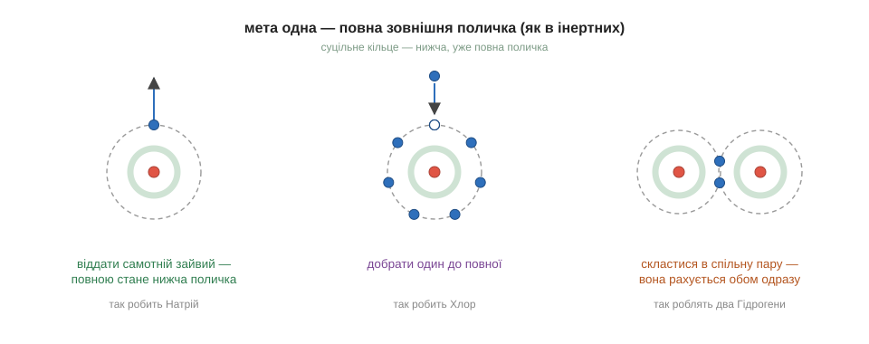
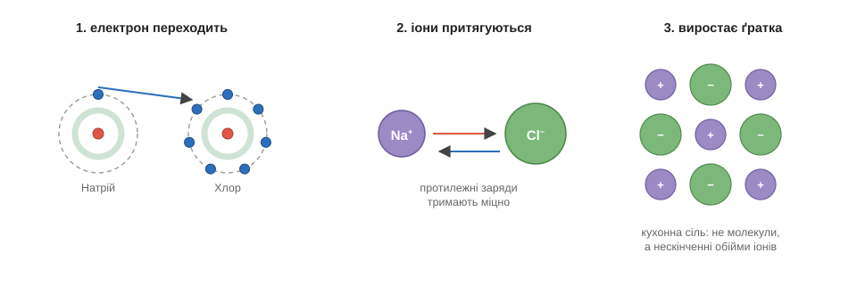
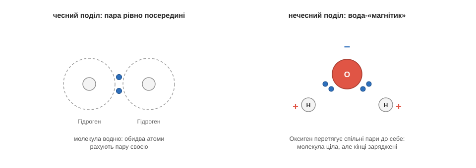
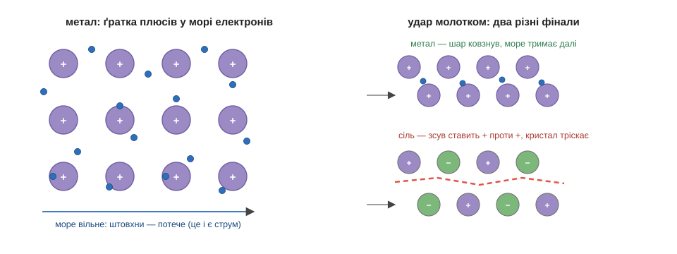

# Розділ 2.1 — Хімічний зв'язок

Перший модуль ми закінчили загадкою, яку варто тримати в голові всю дорогу: найбуйніший метал і найотруйніший газ, з'єднавшись, чомусь дають мирну їстівну сіль. А ще ми весь той модуль раз у раз казали, що атоми «зчеплені» в молекули, «з'єднані» в речовини, — і жодного разу не спинилися спитати найочевидніше: а чому, власне, вони чіпляються одне до одного? Що їх тримає? Цей розділ відповідає саме на це питання — і тоді й загадка солі розв'яжеться сама собою.

## 2.1.1 Чому атоми з'єднуються

Коли хочеш зрозуміти, чому щось відбувається, інколи найрозумніше — придивитися до тих, з ким воно **не** відбувається. Тож перш ніж питати, чому атоми з'єднуються, поставмо питання навпаки: чи є атоми, які не з'єднуються ні з ким? Виявляється, є. Це знайомі нам з кінця попереднього модуля інертні гази — гелій, неон, аргон. Вони майже ні в що не вступають, живуть осібно, не утворюють ні солей, ні кислот, нічого. І якщо вони такі особливі своєю байдужістю, варто придивитися: що в них спільного, чого немає в решти?

Спільне в них рівно одне — та сама прикмета, якою вони й завершували кожен рядок таблиці: **повна зовнішня поличка**. У всіх інертних газів зовнішній поверх електронів заповнений ущерть, без жодного вільного місця. А тепер зведімо дві речі докупи: атоми з повною зовнішньою поличкою ні з ким не реагують і нічого ні від кого не хочуть — а всі решта, у кого поличка неповна, навпаки, неспокійні й охоче вступають у реакції. Висновок напрошується сам: **повна зовнішня поличка — це для атома стан спокою й вдоволення, якого всі інші мовби прагнуть досягти.** Зверни увагу, що ми не оголосили це правило з нічого — ми прочитали його з самої природи, з поведінки інертних газів. Чому повна поличка така спокійна на найглибшому рівні — це вже питання до квантової фізики, і його ми чесно лишаємо великій книзі; але саме правило надійне, бо стоїть на спостереженні, і його одного нам вистачить, щоб зрозуміти геть усю дальшу хімію.

Отже, решті атомів, на відміну від інертних щасливців, до повної полички чогось бракує — і вони поводяться так, ніби щосили хочуть цю нестачу залагодити. А способів залагодити, якщо вдуматися, рівно три. Якщо зайвих електронів на зовнішній поличці всього один-два, найлегше їх **віддати** — і тоді відкриється повна поличка, що лежала під ними. Якщо ж до повного, навпаки, бракує одного-двох, найлегше їх **добрати** в когось. А якщо зустрічаються двоє, кому однаково невигідно віддавати, лишається третій шлях — **поділитися**, скласти електрони у спільне користування. Оце і всі можливі ходи; решта розділу — просто розгляд кожного з них зблизька.

Перш ніж рушити далі, спробуй застосувати правило сам — це найкращий спосіб переконатися, що воно справді в руках. Візьмімо магній: на його зовнішній поличці два електрони. Як, по-твоєму, він поведеться — віддаватиме чи добиратиме? І скільки? … Звісно, віддаватиме, і саме два: позбутися двох зайвих йому куди легше, ніж добирати аж шість бракуючих до повної вісімки. А флуор, якому до повного бракує одного? Той, навпаки, з усіх сил намагатиметься один електрон у когось ухопити. Бачиш — знаючи лише, скільки електронів на зовнішній поличці, ти вже передбачаєш поведінку атома.

Тепер ми готові сказати, чим насправді є **хімічний зв'язок**, — і це варто проговорити чітко, бо тут легко уявити собі дурницю. Зв'язок — це не клей, не гачечки й не нитки між атомами. Зв'язок — це таке **розташування електронів, з якого жодному з атомів невигідно виходити**. Атоми тримаються разом не тому, що їх щось склеїло, а просто тому, що нарізно кожному з них гірше, ніж разом: порізно їхні полички неповні й неспокійні, а з'єднавшись, вони так чи інакше дістають жадане відчуття повноти. Розірвати зв'язок, звісно, можна — але за це доведеться заплатити енергією, і скільки саме, стане окремою важливою темою згодом.

*Рис. 2.1.1-1. Мета одна — повна зовнішня поличка: Натрій віддає свій самотній електрон, Хлор добирає той, якого бракує, а два Гідрогени складаються в спільну пару, що рахується обом.*

> 🏠 Усе, що можна взяти в руки й що не розсипається, тримається купи саме хімічними зв'язками; навіть клей склеює речі не якоюсь «липкістю», а тим, що утворює справжні зв'язки між собою й поверхнею.

Отже, три стратегії намічено. Тепер розгляньмо їх одну за одною — і почнімо з тієї пари, що дала нам загадку солі.

## 2.1.2 Іонний і ковалентний зв'язок

Загадка солі тепер майже сама проситься на розв'язок. З одного боку — натрій, у якого на зовнішній поличці один самотній зайвий електрон, що його натрій радо позбувся б. З іншого — хлор, якому до повної полички бракує рівно одного електрона. Кращої пари годі й шукати: те, що зайве одному, — це саме те, чого потребує інший. Лишилося подивитися зблизька, що ж відбувається в мить їхньої зустрічі.

Перший крок очевидний: електрон переходить від натрію до хлору. І обом одразу стає добре — у натрію відкривається повна нижча поличка, у хлору закривається остання прогалина. Та разом із електроном змінюється ще дещо, на що варто звернути пильну увагу. Доти кожен атом був електрично нейтральний: скільки протонів-плюсів у ядрі, стільки ж електронів-мінусів навколо. А тепер натрій віддав один мінус — і в нього лишився зайвий, неврівноважений плюс; хлор же прийняв чужий мінус — і набув зайвого мінуса. Заряджений атом називають **іоном**, і записують це маленьким значком згори: натрій став Na⁺, хлор — Cl⁻. А далі спрацьовує те саме правило зарядів, з яким ми познайомилися ще в будові атома: протилежні заряди притягуються. Плюсовий Na⁺ і мінусовий Cl⁻ тягнуться один до одного й міцно злипаються. Оце притягання готових іонів і є **іонний зв'язок** — спершу передача електрона, а тоді взаємні обійми протилежних зарядів.

І ось вона, розгадка мирної солі, до якої ми йшли від кінця першого модуля. У сільничці немає ні буйного металу, ні отруйного газу — там зовсім інші частинки: спокійні, врівноважені іони Na⁺ і Cl⁻, кожен із повною поличкою. Іон натрію схожий на натрій-метал не більше, ніж вовк на вівцю, хоч називаються майже однаково. Звідси випливає правило, яке варто закарбувати раз і назавжди: властивості речовини належать **не тому, з чого її зроблено, а тому, що з цього вийшло**. Це, до речі, точно та сама думка, що зустрілася нам, коли ми відрізняли складну речовину від суміші, — просто тепер ми бачимо її механізм. І ще одна дрібниця, яка скоро стане важливою: кожен Na⁺ намагається оточити себе хлорами з усіх боків, а кожен Cl⁻ — натріями, тож сіль виходить не окремими молекулами, а суцільною ґраткою, де плюси й мінуси чергуються, мов клітинки шахівниці.

А тепер — другий випадок, зовсім інший. Що буде, коли зустрінуться двоє, кому обом невигідно віддавати, бо обом електронів **бракує**? Найпростіший приклад — два атоми водню: кожному до повної першої полички не вистачає одного електрона, і жоден не збирається свій останній комусь дарувати. Здавалося б, глухий кут — та атоми знаходять елегантний вихід. Вони не віддають і не забирають, а **складаються**: кожен викладає свій єдиний електрон у спільну пару, і ця пара кружляє тепер навколо обох ядер одразу. Хитрість у тому, що спільну пару кожен з атомів чесно рахує **своєю** — отже, обидва ніби дістали жадану повну поличку, хоч насправді поділили двох електронів на двох. Саме ця спільна пара й тримає їх разом. Такий зв'язок називають **ковалентним** — це не крадіжка, як в іонному, а спільне володіння. Так збудована молекула водню, так киснева частинка тримає два атоми разом, так само Оксиген утримує двох Гідрогенів у молекулі води — і взагалі більшість молекул на світі складена саме ковалентними зв'язками.

І тут є тонкість, заради якої варто було все це затівати, бо вона ще не раз нам знадобиться. Спільне володіння не завжди буває чесним. Коли пару ділять два однакові атоми — як два водні, — вони тягнуть її до себе з однаковою силою, тож пара висить рівно посередині, по-справедливому. Але Оксиген, скажімо, тягне електрони помітно сильніше за Гідроген. І в молекулі води обидві спільні пари виявляються перетягнутими ближче до Оксигену. Молекула загалом лишається цілою й незарядженою, але всередині неї заряд тепер розподілений нерівно: біля Оксигену збирається трохи надлишку мінуса, а біля обох Гідрогенів лишається трохи плюса. Молекулу, в якої отак з'явилися злегка заряджені кінці, називають **полярною**. Воду зручно уявляти собі крихітним магнітиком із плюсовим і мінусовим боком — лише пам'ятай, що тягнуть тут не магнітні полюси, а звичайні електричні заряди. Запам'ятай цей образ води-магнітика добре: у четвертому модулі саме він пояснить, чому вода розчиняє мало не все на світі.

*Рис. 2.1.2-1. Електрон переходить від Натрію до Хлору, готові іони Na⁺ і Cl⁻ притягуються, і з їхніх обіймів виростає ґратка кухонної солі.*

*Рис. 2.1.2-2. У молекулі водню спільна пара сидить рівно посередині; у воді Оксиген перетягує обидві пари до себе — і молекула набуває злегка заряджених кінців.*

Отже, дві стратегії з трьох ми розглянули: віддати-забрати дає іонний зв'язок, поділитися — ковалентний. Лишилася третя, найдивніша, — для випадку, якого ми ще не торкалися.

## 2.1.3 Металічний зв'язок

Повернімося до магнію, з якого ми передбачали, що він радо віддасть свої два електрони. А тепер уяви цілий шматок такого металу — скажімо, залізний цвях. У ньому стиснуті пліч-о-пліч мільярди мільярдів атомів феруму, і кожнісінький з них радий би зовнішні електрони комусь віддати. Та халепа в тому, що навколо — самі такі ж, як він: усі хочуть віддавати, і жодного, хто хотів би взяти. Здавалося б, глухий кут: стратегія «віддати» вимагає того, хто прийме, а приймати нікому.

Метали виплутуються з цього напрочуд винахідливо. Якщо немає кому віддати електрон особисто — то віддаймо його **не комусь одному, а всім одразу**. Кожен атом відпускає свої зовнішні електрони у спільне користування, і виходить картина з двох частин. З одного боку — рівна, упорядкована **ґратка** з позитивних іонів (адже кожен атом, віддавши електрони, став плюсовим іоном, як натрій у солі). А з іншого — ці звільнені електрони збираються в суцільне рухливе **«море»**, що вільно тече поміж іонами, не належачи нікому з них окремо й належачи всім разом. Позитивні іони ґратки притягуються до цього спільного моря мінусів з усіх боків — і саме це притягання тримає метал як єдине ціле. Так влаштований **металічний зв'язок**, третій і останній у нашій трійці.

Найгарніше в цій картині те, що з неї одразу, без жодних додаткових правил, випливають усі знайомі звички металів. Чому метал проводить струм? Бо електрони його моря ні до кого не прив'язані: підштовхни їх з одного кінця дроту — і вони потечуть, а потік електронів і є електричний струм. Чому метал не б'ється, а гнеться й кується? Бо удар молотка зсуває шари важких іонів один відносно одного, але рухливому морю однаково байдуже, як саме стоять плюси, — воно миттю перетікає слідом і знову їх стягує. Порівняй це із сіллю, де іони теж стоять ґраткою, але нерухомо й без жодного моря: там зсув шару підставляє плюс просто навпроти плюса, однакові заряди різко відштовхуються — і кристал розколюється. Ось чому залізо під молотком розплющується в лист, а кристалик солі розлітається на порох. А чому, нарешті, метал блищить дзеркальним блиском? Бо те саме вільне море електронів гойдається в такт світловій хвилі, що падає на поверхню, і відкидає світло назад майже повністю.

Тепер у нас зібрана повна трійця, і варто глянути на неї згори, бо так вона запам'ятовується найкраще. Усі три зв'язки — це, по суті, три різні відповіді на одне-єдине питання: куди подіти неспокійні зовнішні електрони, щоб дістати жадану повну поличку. Можна передати їх конкретному сусідові — і вийде **іонний** зв'язок. Можна скласти їх із сусідом у спільну пару — **ковалентний**. А можна злити в спільне море на всіх — **металічний**. Яку саме стратегію обере атом, підказує, як ми бачили, його місце в таблиці: ліві й нижні віддають, праві й верхні забирають. Тепер, коли ми розуміємо, як саме атоми поєднуються, лишилося навчитися коротко це записувати — і саме цьому присвячений наступний розділ.

*Рис. 2.1.3-1. Ґратка позитивних іонів у морі спільних електронів: море тече — метал проводить струм; шари ковзають, а море тримає — метал кується; а в солі зсув ставить плюс проти плюса, і кристал тріскає.*

> 🏠 Мідний дріт у зарядці телефона — це і є ґратка позитивних іонів міді, зануреними в море електронів якої щовечора тече твій струм.

> ▶️ Далі: [Розділ 2.2 — Формули, валентність і моль](../r2-formulas/r2-formulas.md)
