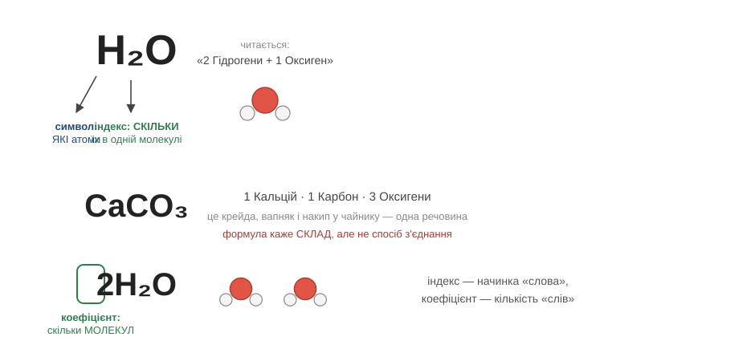
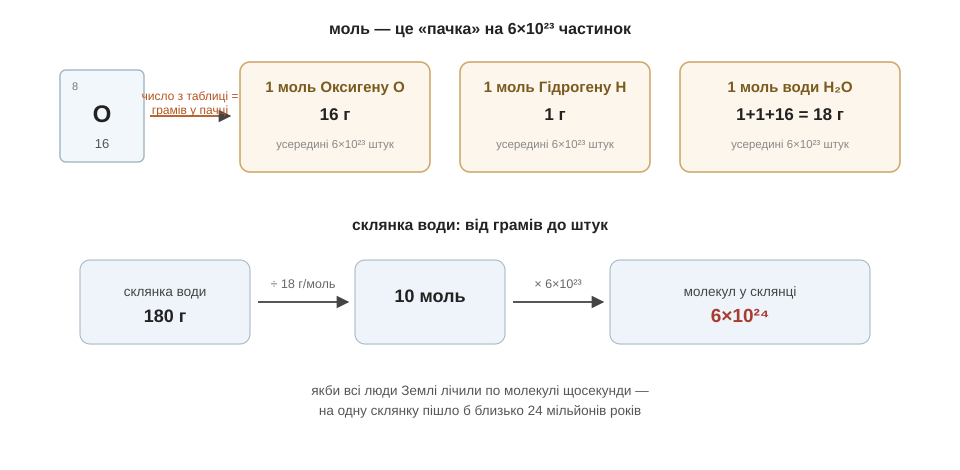

# Розділ 2.2 — Формули, валентність і моль

У попередньому розділі ми зрозуміли, чому атоми з'єднуються і якими бувають зв'язки. Тепер постає суто практична потреба: навчитися все це коротко записувати. У хіміків для цього є власна мова — гранично стисла, де кілька літер кажуть, з чого зроблена речовина. Цей розділ навчить цю мову читати, покаже, чому склад речовини саме такий, а не інакший, — і насамкінець розв'яже хитру задачу: як полічити атоми, яких ніхто ніколи не побачить.

## 2.2.1 Мова формул

Запис H₂O бачив, мабуть, кожен — на пляшках води, у жартах, на футболках; це чи не найвідоміший хімічний напис у світі. І все ж, якщо попросити прочитати його вголос по-справжньому, а не просто сказати «аш-два-о», багато хто зам'явся б. А дарма, бо читається він напрочуд просто — як коротке речення мовою, половину якої ми вже вивчили в першому модулі. Розберімо його неквапом, по знаку.

Більшу частину словника ми вже маємо. Великі літери — це символи елементів із таблиці, ті самі, з якими ми познайомилися раніше: H — це Гідроген, O — Оксиген. Новим тут є лише маленьке число внизу, отой підрядковий двійник біля H. Його називають **індексом**, і він каже одну просту річ — скільки атомів попереднього сорту входить в одну молекулу. Якщо атом один, одиницю за звичаєм не пишуть зовсім. Тож якщо прочитати H₂O чесно, вийде: «молекула, у якій два атоми Гідрогену й один атом Оксигену». Ось і все — ти щойно прочитав свою першу хімічну формулу, і нічого складного в ній не виявилося.

Проробімо те саме ще двічі, щоб навичка вляглася. CO₂ — це один атом Карбону й два атоми Оксигену; цю речовину, вуглекислий газ, ти видихаєш просто зараз, поки читаєш. А CaCO₃ — це один Кальцій, один Карбон і три Оксигени разом; і хоч формула виглядає мудрованіше, за нею ховається звичайнісінька крейда — та сама, що й шкільний мел, і вапняк у горах, і твердий накип у чайнику. Заодно зверни увагу на межу можливостей формули, бо це чесно: вона повідомляє, **з чого і в якій кількості** складена речовина, але мовчить про те, як саме атоми між собою з'єднані й чому їх у молекулі саме стільки. Про це «чому» — буде вже наступна тема.

Тепер застережімо одну плутанину, на якій спотикаються чи не всі шкільні зошити. Індекс — це частина самого «слова», він про начинку однієї молекули. Але якщо нам треба сказати, що молекул **кілька**, то велике число ставлять не внизу, а попереду всієї формули: запис 2H₂O означає «дві молекули води», тобто разом чотири атоми Гідрогену й два атоми Оксигену. Це переднє число називають **коефіцієнтом**, і по-справжньому воно нам знадобиться у модулі про реакції; поки що досить запам'ятати просту відмінність — індекс це начинка слова, а коефіцієнт показує, скільки таких слів узяти.

Лишилося одне чесне уточнення, щоб не виникло хибного враження. У попередньому розділі ми бачили, що кухонна сіль — це не окремі молекули, а суцільна ґратка з іонів. Що ж тоді означає її запис, NaCl? Не «молекулу з двох атомів» — таких молекул там немає, — а **пропорцію**: у ґратці на кожен іон натрію припадає один іон хлору, один до одного. Тож для ґраткових речовин формула — це радше рецепт із зазначенням співвідношення, ніж портрет окремої молекули. Дрібниця, але вона рятує від плутанини далі.

Завдання цієї книжки скромне й чесне: навчитися формули **читати**, а не складати їх із голови. Складання — окреме ремесло, і починається воно з простого питання: скільки «рук» для зв'язку має кожен атом? Саме цим питанням ми зараз і займемося.


*Рис. 2.2.1-1. Символ каже, які атоми; індекс — скільки їх в одній молекулі; а коефіцієнт перед формулою лічить самі молекули: індекс — начинка «слова», коефіцієнт — кількість «слів».*

> 🏠 Тепер склад на етикетці зубної пасти чи мінералки — уже не шифр: побачивши CaCO₃, ти прочитаєш «Кальцій, Карбон, три Оксигени» і впізнаєш у ньому звичайну крейду.

## 2.2.2 Валентність — скільки рук

Поставмо собі питання, яке на перший погляд здається дивним: а чому вода — це саме H₂O? Чому не HO, не HO₃, не якесь H₅O₂? Адже природа ніколи не помиляється в рецепті: вода завжди виходить з рівно двох Гідрогенів на один Оксиген, ніколи інакше. Отже, щось чітко диктує цю пропорцію. І розгадка вже лежить у нас у кишені — вона прямо випливає з ковалентного зв'язку, з яким ми познайомилися в попередньому розділі.

Згадаймо суть ковалентного зв'язку: двоє атомів тримаються разом спільною парою електронів, і кожна така пара затуляє одне вільне місце на зовнішній поличці. А тепер поставмо ключове питання: скільки всього зв'язків здатен утворити один атом? Очевидно, рівно стільки, скільки вільних місць йому треба затулити до повної полички. Оксигену, як ми з'ясували, до повного бракує двох електронів — отже, він може утворити два зв'язки, у нього дві «руки», якими він хапається за сусідів. А Гідрогену бракує одного — тож у нього рука лише одна. Тепер складімо з цих рук воду: Оксиген простягає дві руки, і за кожну має вхопитися окремий Гідроген, бо в того рука лише одна. Дві руки Оксигену — два Гідрогени. От і вийшло H₂O — не з примхи й не з зазубреного правила, а як проста арифметика рук.

Цю кількість рук для зв'язку називають **валентністю**. Гідроген завжди одновалентний — одна рука. Оксиген у своїх сполуках двовалентний. А Карбон — аж чотирирукий, і саме ця надзвичайна щедрість на руки зробить його головним героєм останнього модуля. Щоправда, у багатьох металів кількість задіяних рук буває різною в різних сполуках — тому на упаковках вітамінів чи в підручнику пишуть «Ферум(II)» або «Ферум(III)»: оця римська цифра в дужках просто уточнює, скількома руками залізо тримається саме в цій конкретній речовині. А чому в одних атомів валентність тверда, а в інших гнучка, — питання глибше, ніж потрібно нам зараз, і його ми лишаємо великій книзі.

Найкращий спосіб переконатися, що ти справді вловив ідею рук, — скласти формулу самому, перш ніж я її назву. Візьмімо Нітроген: до повної полички йому бракує трьох електронів, тобто в нього три руки. І сполучимо його з Гідрогеном, у якого рука одна. Скільки Гідрогенів знадобиться, щоб зайняти всі три руки Нітрогену, і яка вийде формула?.. Саме так — потрібно три Гідрогени, по одному на кожну руку, і формула виходить NH₃. Це аміак, той самий, чий різкий дух знайомий з нашатирного спирту. Бачиш: знаючи самі лише руки, ти передбачив склад речовини, якої перед тим у вічі не бачив.

Перевірмо арифметику ще й на вуглекислому газі, бо там ховається цікавинка. Карбон має чотири руки, а кожен Оксиген — дві. Як їх поєднати? Природа робить це елегантно: Карбон хапає кожен Оксиген обома його руками одразу — дві руки на один Оксиген ліворуч, дві на другий праворуч. Усі чотири руки Карбону зайняті, обидві руки кожного Оксигену теж — усі задоволені, виходить CO₂. Коли два атоми тримаються не однією, а одразу двома парами рук, кажуть про подвійний зв'язок — запам'ятай це слово мимохідь, воно ще яскраво спрацює в органіці.

І нарешті ще одне слово, яке в шкільному підручнику живе поряд із валентністю, — **ступінь окиснення**. Якщо зовсім коротко, то це та сама лічба задіяних електронів, але вже зі знаками: атом, що перетягнув спільні електрони до себе, рахують у «мінусі», а той, що віддав, — у «плюсі». Ці знаки стануть нам у пригоді трохи згодом, у модулі про реакції, коли треба буде стежити, хто в кого забрав електрони. Та в основі — все та сама ідея рук, лише з позначками напрямку.

Отже, тепер формули не просто читаються — нам уже видно, **чому** вони саме такі. Лишився останній інструмент цього розділу, і він розв'язує задачу, що досі здавалася неможливою: як полічити атоми, яких не видно.


*Рис. 2.2.2-1. Дві руки Оксигену займають два однорукі Гідрогени — виходить H₂O; чотирирукий Карбон тримає кожен Оксиген двома руками — виходить CO₂.*

> 🏠 «Ферум(III)» на упаковці вітамінів — то не код партії й не загадка: римська цифра просто каже, скількома руками залізо тримається в цій сполуці.

## 2.2.3 Моль: рахуємо атоми вагою

Уся хімія, як ми вже не раз бачили, тримається на лічбі: два Гідрогени на один Оксиген, дві руки сюди, чотири туди. Але тут чигає прикра перешкода. Як відміряти оте «два до одного», якщо самі атоми незримі навіть у найсильніший мікроскоп, а в найдрібнішій порошинці їх більше, ніж зірок на небі? Поштучно їх не перелічиш ніколи. На щастя, людство давно знає вихід — він старий, як базар. Коли дрібного товару дуже багато, його не лічать по одному, а **зважують**. Цвяхи в крамниці відмірюють кілограмами, а не штуками; крупу беруть пачками. З атомами хіміки чинять так само — лічать їх не поодинці, а великими однаковими порціями. Така порція називається моль.

**Моль** — це просто «пачка» частинок наперед визначеного розміру, як ото пачка цвяхів. Тільки розмір цієї пачки запаморочливий: у ній **6×10²³ частинок** — шістка, а за нею двадцять три нулі. Звідки взялося таке чудне число, чому саме воно? Його підібрали зумисне, і в цьому вся хитрість: пачку зробили рівно такою, щоб її маса в **грамах** збігалася з тим числом, що написане у клітинці періодичної таблиці. Завдяки цьому фокусу маса одного моля будь-якої речовини читається просто з таблиці — її так і називають **молярною масою**.

Подивімося, як гарно це працює. У клітинці Гідрогену стоїть приблизно одиниця — отже, один грам атомів Гідрогену це і є рівно один моль, усі його 6×10²³ штук. У клітинці Оксигену стоїть 16 — значить, пачка-моль атомів Оксигену важить 16 грамів. А щоб дізнатися масу моля цілої молекули, треба просто додати числа її атомів: вода H₂O це 1 + 1 + 16 = 18. Отже, вісімнадцять грамів води — це рівно один моль молекул води. Зверни увагу, що сталося: звичайнісінькі кухонні терези щойно перетворилися на прилад для лічби незримих атомів.

А тепер — єдиний справжній розрахунок у цій книжці, і ми пройдемо його неквапом, рядок за рядком. Спитаймо: скільки молекул води в звичайній склянці?

```
маса води в склянці     m = 180 г
молярна маса води       M = 1 + 1 + 16 = 18 г/моль
кількість молів          n = m / M = 180 / 18 = 10 моль
кількість молекул        N = 10 × 6×10²³ = 6×10²⁴
```

Спершу ми зважили воду — 180 грамів. Поділивши цю масу на масу однієї пачки-моля (18 грамів), дізналися, що в склянці десять пачок-молів. А помноживши десять молів на розмір пачки, отримали саме число молекул: шістка з двадцятьма чотирма нулями. Щоб бодай трохи відчути, наскільки це багато: якби всі люди Землі заходилися лічити ці молекули — кожен по одній щосекунди, без сну й перерв, — на одну-єдину склянку води в них пішло б близько двадцяти чотирьох мільйонів років. А ти щойно перелічив їх у чотири рядки.

І саме тому моль — головна робоча одиниця всієї хімії, без якої нікуди. Адже рецепти реакцій, як ми скоро побачимо, записані формулами — тобто в штуках і молях; а відмірювати речовини в лабораторії чи на виробництві доводиться вагою, грамами. Моль стоїть між ними перекладачем: грами ↔ молі ↔ штуки. Усі ті численні шкільні «задачі за рівнянням реакції», хоч скільки б їх не було, насправді зводяться до проходу цим самим коротким ланцюжком.

На цьому мова хімії в нас зібрана повністю. Ми вміємо читати формули, розуміємо завдяки валентності, чому склад речовини саме такий, і навчилися лічити навіть незриме. З цими трьома інструментами в руках можна нарешті подивитися, як із атомів та зв'язків складаються справжні, відчутні на дотик тверді речі навколо нас.


*Рис. 2.2.3-1. Число з клітинки таблиці — це грамів у «пачці» з 6×10²³ частинок; тому склянка води перераховується в молекули за два кроки: 180 г → 10 моль → 6×10²⁴ штук.*

> 🏠 Пачка борошна — кілограм, пачка крупи — 900 грамів, а «пачка води» для хіміка — рівно 18 грамів: один моль, ті самі 6×10²³ молекул.

> ▶️ Далі: [Розділ 2.3 — Як влаштовані тверді речовини](../r3-structure/r3-structure.md)
