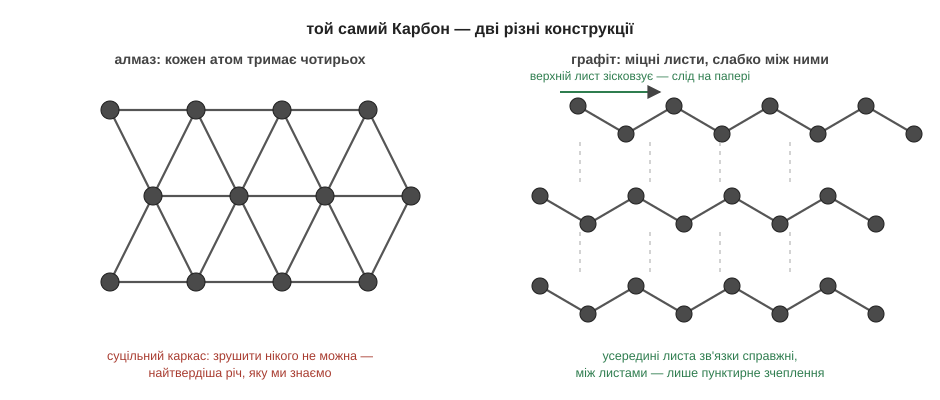

# Розділ 2.3 — Як влаштовані тверді речовини

Ми знаємо три види зв'язку і вміємо їх записувати. Лишилося зрозуміти, чому з тих самих цеглинок виходять настільки різні речі: м'який лід і найтвердіший алмаз, цукор, що тане на сковорідці, і сіль, якій байдуже до будь-якої плити. Відповідь — у конструкції.

## 2.3.1 Молекули чи ґратка

На кухні є три білі тверді речовини: лід, цукор і сіль. Перший тане просто в руці. Другий плавиться на сковорідці в карамель — десь при ста вісімдесяти градусах. А третій навіть не ворухнеться: солі для плавлення треба вісімсот один градус. Звідки така прірва між трьома схожими на вигляд порошками й кубиками?

Розгадка не в тому, *що* всередині, а в тому, *як* воно складене. Тверду речовину можна зібрати двома принципово різними способами.

Спосіб перший — з **окремих молекул**. Так збудовані лід і цукор. Усередині кожної молекули атоми тримаються справжніми ковалентними зв'язками — міцно. А от *між* молекулами діє лише слабке притягання: полярні молекули води чіпляються одна за одну зарядженими кінцями — плюс до мінуса, як ті «магнітики» з теми про зв'язки. Щоб розплавити таку речовину, досить розхитати це слабке зчеплення — самі молекули лишаються цілими. Тому лід тане легко, і тане він у воду з тих самих неушкоджених H₂O.

Спосіб другий — **суцільна ґратка**. Так збудовані сіль, алмаз і всі метали. Тут окремих молекул немає взагалі: весь кристал — одна нескінченна конструкція, де кожен атом чи іон зв'язаний із сусідами повноцінними зв'язками. У солі це іонні обійми плюсів і мінусів, в алмазі — ковалентні руки Карбону на всі боки, у залізі — спільне море електронів. Розплавити ґратку — означає рвати самі зв'язки, а не слабеньке зчеплення. Ось чому солі треба 801 °C, а алмаз тримається аж до трьох з половиною тисяч.

Звідси остаточно зрозуміла й історія з формулами. NaCl — не молекула, а пропорція, бо в ґратці немає «однієї штучки солі»: є лише нескінченне чергування іонів один до одного. Формула алмазу ще коротша — просто C: нескінченний Карбон, зв'язаний сам із собою.

Тож про будь-яку тверду річ варто першим ділом спитати: ти з молекул чи ти ґратка? Сама відповідь уже прогнозує характер: легкоплавке й тендітне — чи тугоплавке й міцне. А як саме з конструкції випливають усі інші властивості — аж до того, чому з одного й того самого Карбону виходить і грифель олівця, і діамант, — розповість наступна тема.

*Рис. 2.3.1-1. Зліва — окремі молекули зі слабким зчепленням (пунктир): нагрівання рве лише його. Справа — суцільна ґратка зі справжніх зв'язків: щоб її розплавити, треба рвати самі зв'язки. Унизу — ціна питання в градусах.*

> 🏠 Шоколад тане в руці, бо він молекулярний і зчеплення слабке; сковорідка не тане ніколи, бо вона — металічна ґратка.

> 💡 **Одним реченням.** Тверді речовини бувають двох конструкцій: окремі молекули зі слабким зчепленням між ними (лід, цукор — тануть легко і виходять цілими) або одна суцільна ґратка справжніх зв'язків (сіль, алмаз, метал — тримаються до сотень і тисяч градусів).

## 2.3.2 Чому речовини такі різні

Ось обіцяна загадка. Грифель олівця і діамант у каблучці. Хімічний аналіз дасть однакову відповідь: і там, і там — чистий Карбон, одна клітинка таблиці. Але грифель м'який, чорний і лишає слід на папері, а діамант прозорий і ріже скло. Якщо речовина — це сорт атомів, то як таке можливо?

А ось так: речовина — це сорт атомів **плюс конструкція**. В алмазі кожен Карбон тримає чотирьох сусідів усіма чотирма руками — виходить суцільний каркас на всі боки, в якому жоден атом не може зрушити з місця. Звідси рекордна твердість. У графіті — а грифель і є графіт — ті самі атоми складені інакше: у міцні плоскі листи, всередині яких кожен Карбон тримає трьох сусідів. Самі листи майже незнищенні, але між собою зчеплені слабко, як молекули у льоду. Проведи олівцем по паперу — верхні листи зісковзують і лишаються на ньому. Слід олівця — це буквально злущені лусочки Карбону.

Цей принцип — «конструкція диктує характер» — працює для будь-якої властивості, і все потрібне ми вже бачили. Температура плавлення: слабке зчеплення між молекулами рветься легко, ґратка тримається до сотень градусів. Твердість і крихкість: іонна ґратка тверда, але від удару тріскає — зсув ставить плюс проти плюса; метал натомість гнеться, бо морю електронів байдуже, як стоять іони. Провідність: у металі море вільне — струм тече; а от у кристалі солі заряди є, але кожен прикутий до свого місця — твердий кристал струму не проводить. Запам'ятай цю дрібницю: щоб іони звільнилися, кристал треба чимось розібрати — і дуже скоро з'ясується, що це вміє звичайна вода.

Підсумуємо модуль одним поглядом. Атоми мають характери (зовнішня поличка) → характери диктують зв'язки (віддати, поділитись, злити в море) → зв'язки складаються в конструкції (молекули чи ґратки) → конструкція визначає все, що ти бачиш і відчуваєш: тверде чи м'яке, плавке чи вогнетривке, провідне чи ні. Це вся «статика» хімії. Але найцікавіше — не як речовини стоять, а як вони перетворюються. Час підпалювати.

*Рис. 2.3.2-1. В алмазі кожен атом тримає чотирьох сусідів — суцільний каркас; у графіті міцні листи зчеплені слабко, і саме їх ти розмазуєш по паперу, коли пишеш олівцем.*

> 🏠 Керамічна кружка від падіння розбивається — її ґратка крихка, як у солі; алюмінієва ложка лише зігнеться — море електронів тримає.

> 💡 **Одним реченням.** Властивості твердої речовини диктує конструкція: той самий Карбон каркасом — алмаз, листами — графіт, тож «з чого зроблено» — лише половина відповіді, друга половина — «як складено».

> 💡 **Що про це скаже великий підручник.** Наші «конструкції» там звуться кристалічними ґратками — атомними, молекулярними, іонними й металічними. Алмаз і графіт — приклад алотропії: різних простих речовин одного елемента. А ще пошукай слово «аморфні речовини» — це ґратки без порядку, як-от скло.

> ▶️ Далі: [Розділ 3.1 — Що таке реакція насправді](../../m3-reactions/r1-essence/r1-essence.md)
