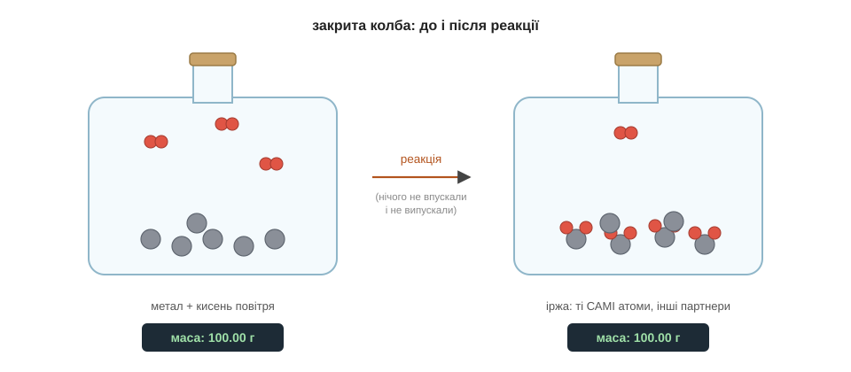
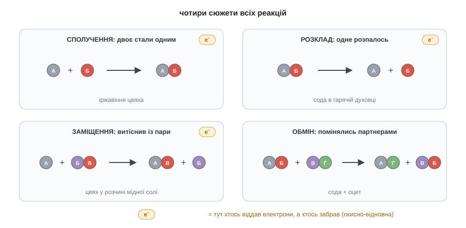

# Розділ 3.1 — Що таке реакція насправді

Два модулі ми придивлялися до того, як речовина влаштована: з яких атомів складається, якими зв'язками тримається, в яку конструкцію зібрана. Усе це була, сказати б, нерухома хімія — хімія спокою. Але найцікавіше в хімії — не як речовини стоять, а як вони перетворюються одна на одну: іржавіють, горять, бродять, вибухають. Цей модуль — про перетворення, тобто про реакції, а перший його розділ розбирає найголовніше: що ж насправді відбувається в реакції, як її записати й які взагалі бувають види перетворень.

## 3.1.1 Реакція = перегрупування

Почнімо з невеличкої загадки, яку легко перевірити вдома. Залиш звичайний залізний цвях надворі під дощем, і за кілька тижнів він укриється рудою іржею. А тепер зроби ось що: поклади цей іржавий цвях на точні терези, а поряд — такий самий новий. Виявиться, що іржавий **важчий**. На перший погляд це безглуздя: цвях нічого не їв, ніхто нічого до нього не приклеював, він просто лежав і ржавів. То звідки ж узялися зайві грами?

Відповідь — з повітря, і вона веде нас просто до суті реакції. Іржавіння — це і є хімічна реакція: атоми заліза поступово з'єднуються з атомами Оксигену, і та руда речовина, що ми звемо іржею, — це вже сполука заліза з Оксигеном. А зайва вага — це вага самого Оксигену, що його залізо потроху виловило з повітря й приєднало до себе. Жодного дива тут немає: атоми не виникли з нічого, вони **прийшли** ззовні, просто роблячи це поволі й невидимо для ока.

З цієї простої історії випливає принцип, на якому стоїть геть уся хімія. Згадаймо висновок із першого модуля: хімія не вміє ні створювати, ні знищувати атоми, бо для цього довелося б чіпати ядро, а ядро їй недоступне. А якщо жоден атом нікуди не дівається й нізвідки не береться, то будь-яка реакція — це насправді просто **перегрупування** вже наявних атомів: старі зв'язки рвуться, нові утворюються, атоми міняють партнерів. Гарно уявити це як танець: пари розійшлися й склалися заново, але самі танцюристи всі на місці, ніхто не зник і ніхто новий не прийшов.

А якщо всі танцюристи лишаються на місці, то й важать вони разом рівно стільки ж, скільки важили доти. Це і є **закон збереження маси**: сумарна маса всіх речовин до реакції точно дорівнює сумарній масі після неї. Тут здоровий глузд може обуритися: «але ж дрова у вогнищі згоряють і зникають, лишається жменька попелу — де ж та сама маса?» А вона нікуди не зникла — вона розлетілася. Якби ми спромоглися зібрати й зважити весь дим, усю водяну пару й попіл разом, вийшло б рівно стільки, скільки важили дрова плюс той кисень із повітря, що пішов на горіння. Маса не губиться ніколи — просто часто вона роз'їжджається у вигляді невидимих газів, і нам здається, ніби речовина пропала.

Перевір це міркування на простому уявному досліді. Запалена свічка стоїть під скляним ковпаком на терезах; віск помалу згоряє й нібито зникає. Як гадаєш, що покажуть терези під кінець — менше, ніж було, чи стільки само?.. Стільки само, аж до останнього грама: віск нікуди не подівся, він лише перетворився на вуглекислий газ і водяну пару, які так і лишилися під ковпаком. Саме така впертість терезів і зробила колись хімію точною наукою.


*Рис. 3.1.1-1. У запаяній колбі метал з'єднується з киснем: партнери змінилися, але атоми ті самі — і терези показують ту саму масу.*

> 📜 Першим це строго довів у 1770-х роках паризький хімік Антуан Лавуазьє, озброївшись найточнішими вагами своєї доби й одним залізним правилом: зважуй усе до й після, і нізащо не дай жодному газу втекти — працюй лише в запаяному посуді. Він спалював фосфор і метали в закритих колбах і щоразу бачив те саме: уся колба важить стільки ж, скільки важила, а метал важчає рівно настільки, наскільки легшає замкнене з ним повітря. Здогади про збереження маси висловлювали й до нього, але саме точні ваги Лавуазьє перетворили здогад на непохитний закон. Заразом він зрозумів, що горіння — це з'єднання з киснем, і повалив панівну доти хибну теорію про особливу «вогняну речовину». Поряд із ним працювала його дружина Марі-Анн, яка вела журнали дослідів, перекладала праці суперників і малювала прилади. Самого Лавуазьє забрала гільйотина революції 1794 року — але закон, доведений його вагами, відтоді не схибив жодного разу.

Отже, тепер ми твердо знаємо: у реакції атоми лише перетасовуються, а їхня загальна кількість і вага зберігаються. А коли щось зберігається й піддається лічбі, його хочеться записати точно — і саме до запису реакцій ми переходимо.

## 3.1.2 Рівняння — це рецепт

Найзручніше уявляти хімічне рівняння як звичайний кухонний рецепт. На картці пишуть приблизно так: «2 яйця + склянка борошна + молоко → 8 млинців». Ліворуч перелічено, що взяти, праворуч — що з того вийде, а стрілка читається просто «перетворюється на». Хімічне рівняння влаштоване точнісінько так само, тільки замість продуктів із крамниці в ньому стоять речовини, записані формулами. Є, щоправда, одне залізне правило, якого звичайна кухня не знає, — але про нього за хвилину, спершу просто навчімося читати.

Візьмімо знайому реакцію — горіння газу в плиті. Газ цей зветься метан і має формулу CH₄: чотирирукий Карбон, що тримає чотири Гідрогени. Коли метан горить, він з'єднується з киснем повітря й дає вуглекислий газ та водяну пару. Запишімо це просто як є, нічого поки не підправляючи: CH₄ + O₂ → CO₂ + H₂O. Ліворуч від стрілки стоять **реагенти** — те, що ми беремо; праворуч — **продукти**, тобто те, що утворюється. Прочитати таке рівняння нескладно: «метан з киснем перетворюються на вуглекислий газ і воду».

А тепер згадаймо те залізне правило з попередньої теми: у реакції жоден атом не зникає й не береться нізвідки. Перевірмо наш запис чесною бухгалтерією — порахуймо атоми кожного сорту з обох боків стрілки. Ліворуч: один Карбон, чотири Гідрогени і два Оксигени. Праворуч: один Карбон — гаразд, сходиться; але Гідрогенів лише два замість чотирьох, а Оксигенів аж три замість двох. Виходить, двоє Гідрогенів кудись поділися, а один Оксиген узявся нізвідки. Такий запис описує неможливе — отже, рівняння треба **зрівняти**.

Інструмент для цього рівно один — великі числа перед формулами, які звуть **коефіцієнтами**; ми вже мигцем стрічали їх у розділі про формули. Підбираймо їх по черзі, дивлячись, що не сходиться:

```
CH₄ + O₂  → CO₂ + H₂O        Гідроген: ліворуч 4, праворуч 2 — не сходиться
CH₄ + O₂  → CO₂ + 2H₂O       тепер Гідрогену 4 = 4 ✓, але Оксигену 2 проти 4
CH₄ + 2O₂ → CO₂ + 2H₂O       тепер і Оксигену 4 = 4 ✓ — баланс зійшовся
```

І ось чого робити аж ніяк **не можна** — це чіпати індекси, оті маленькі нижні числа всередині формул. Може здатися, ніби простіше було б замість зайвого коефіцієнта дописати H₂O₂ — і баланс начебто теж зійдеться. Але H₂O₂ — це вже не вода, а пероксид, зовсім інша, їдка рідина: ми б у рецепті підмінили один продукт іншим. Індекс — це паспорт речовини, він недоторканний; зрівнювати рівняння дозволено тільки коефіцієнтами, тобто кількістю цілих молекул.

Спробуй тепер зрівняти одне рівняння сам — це найкращий спосіб відчути, як воно працює. Водень горить у кисні, даючи воду: H₂ + O₂ → H₂O. Порахуй Оксиген з обох боків і добери коефіцієнти, щоб усе зійшлося… Ліворуч Оксигену два (молекула O₂), праворуч лише один — тож постав перед водою двійку: H₂ + O₂ → 2H₂O. Тепер Оксигену по два з кожного боку, зате Гідрогену праворуч стало чотири, а ліворуч два — додай двійку й там: 2H₂ + O₂ → 2H₂O. Перелічи ще раз: чотири Гідрогени і два Оксигени з обох боків. Зійшлося.

Тож зрівняти рівняння означає підібрати коефіцієнти так, щоб кожного сорту атомів ліворуч і праворуч було порівну, — і це не шкільна формальність, а просто записаний значками закон збереження маси. А винагорода за цю роботу ось яка: зрівняні коефіцієнти заразом кажуть і пропорції в молях. Запис «CH₄ + 2O₂» означає не лише «метан з киснем», а й точну міру — на один моль метану треба рівно два молі кисню. Рецепт став кількісним: тепер ми знаємо не тільки що з чим змішати, а й скільки саме.


*Рис. 3.1.2-1. Кожен сорт атомів ліворуч і праворуч сходиться один в один: рівняння — це рецепт, що поважає закон збереження маси.*

> 🏠 Якщо кисню до метану надходить менше, ніж велить рецепт, газ згоряє «неповно» — і серед продуктів з'являється отруйний чадний газ; саме тому газові плити й колонки такі вимогливі до припливу свіжого повітря.

## 3.1.3 Чотири типи реакцій — і хто краде електрони

Кажуть, що в усіх історіях світу насправді лише кілька базових сюжетів, які повторюються знов і знов. У хімії так само: реакцій незліченна безліч, а основних сюжетів, за якими вони розгортаються, всього чотири. Варто навчитися їх упізнавати — і будь-яке рівняння перестане бути випадковим набором літер, бо за ним проступить знайома історія.

Перший сюжет — **сполучення**, коли двоє стають одним: А + Б → АБ. Це вже знайоме нам іржавіння: залізо й кисень поєдналися в одну нову речовину, іржу. Другий сюжет дзеркальний — **розклад**, коли одна речовина розпадається на кілька простіших. Саме так поводиться харчова сода в гарячій духовці: від нагрівання вона розкладається й виділяє вуглекислий газ, а ті бульбашки газу й піднімають тісто. Третій сюжет — **заміщення**, коли один атом витісняє іншого з його сполуки. Опусти залізний цвях у блакитнуватий розчин мідної солі — і за якийсь час цвях укриється рудим нальотом справжньої міді: залізо зайняло місце міді в розчині, а витіснена мідь осіла на цвяху металом. Хто кого здатен так витісняти — окрема гарна історія, що чекає на нас у модулі про метали. І четвертий сюжет — **обмін**, коли дві речовини просто міняються партнерами: АБ + ВГ → АГ + ВБ. Сода з оцтом шиплять саме за цим сюжетом, і в модулі про розчини він стане в нас головним.

А тепер придивімося до перших трьох сюжетів пильніше — бо в них криється дещо спільне й дуже важливе. У кожному з них хтось із атомів **віддав електрони**, а хтось інший їх **забрав**. В іржавінні залізо віддає електрони, а Оксиген їх приймає — це ми, по суті, вже бачили ще в розмові про іонний зв'язок. У горінні метану — те саме перетягування електронів до Оксигену. А коли цвях укривається міддю, залізо віддає свої електрони, а іони міді їх приймають і саме тому перетворюються назад на звичайний метал. Реакції, у яких електрони отак переходять від одного атома до іншого, називають **окисно-відновними**. Назва ця лише звучить мудро, а сенс простий: «окиснитися» означає віддати електрони, а «відновитися» — їх прийняти. Жодного зубріння тут не треба — досить за кожної такої реакції ставити собі одне питання: *куди пішли електрони?*

Спробуй застосувати це питання сам до того цвяха в мідному розчині. До якого з чотирьох сюжетів належить ця реакція — і чи переходили в ній електрони?.. Це заміщення (залізо витіснило мідь), і так, електрони переходили: від заліза до іонів міді, тобто це окисно-відновна реакція. А навіщо взагалі ставити це питання про електрони — хіба не байдуже, куди вони побігли? Зовсім не байдуже: бо саме в реакціях із переходом електронів живе **енергія**. Горіння, дихання в наших клітинах, батарейка в пульті — усе це, по суті, передача електронів від щедрого атома до жадібного. Батарейка взагалі — це окисно-відновна реакція, замкнена в коробочку й хитро влаштована так, що електрони змушені бігти від віддавача до приймача довгим обхідним шляхом — через дріт, живлячи дорогою лампочку чи пульт. А от у реакціях обміну, четвертому сюжеті, електрони нікому не передаються — там готові іони просто переставляються місцями, швидко й без жодного вогню. Тож попереду на нас чекають два різні світи: світ реакцій із передачею електронів, де живе енергія, — це вже наступний розділ; і світ перестановок без передачі, світ розчинів, — це четвертий модуль.


*Рис. 3.1.3-1. Сполучення, розклад, заміщення, обмін — і позначка e⁻ там, де електрони переходили з рук у руки: такі реакції звуться окисно-відновними.*

> 🏠 Батарейка в пульті — це окисно-відновна реакція в коробочці: метал усередині віддає електрони, а вони течуть до приймача через схему пульта, по дорозі роблячи корисну роботу.

> ▶️ Далі: [Розділ 3.2 — Енергія: чому горить і гріє](../r2-energy/r2-energy.md)
