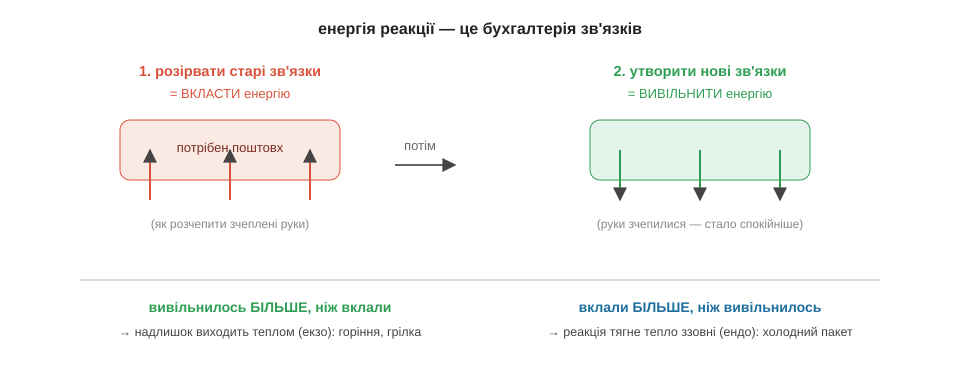

# Розділ 3.2 — Енергія: чому горить і гріє

Упізнавати й записувати реакції ми навчилися. Та якщо спитати, навіщо людству реакції найперше, відповідь буде проста: заради тепла й світла. Вогонь зігрів печери, виплавив метали, запустив машини — і все це хімічні реакції, що віддають енергію. Цей розділ — саме про енергію реакцій: звідки вона береться, чому одне горіння доводиться підпалювати, а інше — гасити, і чому замкнена в дровах енергія роками чекає, поки її випустять.

## 3.2.1 Чому горить і чому треба чиркнути

Звичайний сірник може місяцями спокійно лежати в коробці, і нічого з ним не діється. Та варто чиркнути ним об коробку — він спалахує, та ще й помітно гріє пальці. Тут одразу дві загадки, варті того, щоб у них розібратися. Звідки в такій крихітній паличці враз береться стільки тепла? І, що не менш дивно, чому це тепло не виривалося саме собою весь той час, поки сірник просто лежав?

Почнімо з тепла — і розгадка, виявляється, вже підготовлена нами в попередньому модулі. Згадаймо, чим є хімічний зв'язок: це таке розташування електронів, з якого атомам невигідно виходити, бо разом їм спокійніше, ніж нарізно. А отже, щоб зв'язок **розірвати**, треба прикласти енергію — так само, як треба докласти зусиль, щоб силоміць розчепити двох, хто міцно тримається за руки. І навпаки: коли атоми **утворюють** новий зв'язок, вони сходяться у вигідніше, спокійніше положення, а зайву енергію при цьому віддають назовні. Тож будь-яка реакція — це по суті проста бухгалтерія з двох дій: спершу ми розриваємо старі зв'язки (а це витрата енергії), а потім будуємо натомість нові (а це вже прибуток).

І вся сіль — у різниці між цією витратою і прибутком. Якщо нові зв'язки віддали **більше** енергії, ніж її з'їло розривання старих, то надлишок мусить кудись подітися — і він виходить назовні теплом та світлом. Такі реакції, що гріють довкілля, називають **екзотермічними**: це й горіння, і хімічна грілка для рук, і навіть тихе тепло власного тіла. А якщо навпаки — нові зв'язки повернули **менше**, ніж забрало розривання старих, — то реакції енергії не вистачає, і вона добирає її ззовні, вихолоджуючи все навколо. Такі реакції звуть **ендотермічними**, і на них працює, скажімо, аптечний охолодний пакет, що сам собою стає крижаним, коли його зім'яти. Тепер зрозуміла й перша наша загадка: сірник спалахує так гаряче саме тому, що горіння — це глибоко екзотермічна реакція, у якій нові зв'язки виявляються куди вигіднішими за старі, і різниця щедро виходить теплом.

Лишилася друга загадка, хитріша: якщо тепла в сірнику стільки, чому ж воно не виходило само? А тому, що спершу хтось мусить **заплатити наперед** — за розривання найперших зв'язків. Поки молекули пального й кисню цілі, реакція не почнеться сама: між станом «спокійно лежить» і станом «горить» стоїть невеликий, але справжній енергетичний поріг, який називають **бар'єром активації**. Це та порція енергії, яку треба вкласти, щоб зрушити перші зв'язки з місця й запустити перетворення. Чиркання сірника якраз і дає цей перший внесок — теплом від тертя. А далі реакція, розпочавшись, уже сама виділяє стільки тепла, що його з лишком вистачає підпалити сусідні молекули, ті — наступні, і вогонь біжить далі без жодної сторонньої допомоги. Ось чому дрова можуть спокійно пролежати роками: енергії в них повно, але без поштовху через бар'єр вона лишається замкненою. Підпалити — це зовсім не означає «влити весь жар»; це лише підштовхнути перші молекули вгору, на вершину бар'єра, звідки вони вже скотяться самі.

Спробуй розкласти по цих поличках знайому пару речей. Хімічна грілка, тріснеш її — і вона тепла; охолодний пакет зімнеш — і він крижаний. Котра з них екзотермічна, а котра ендотермічна, і в котрій нові зв'язки віддали більше енергії, ніж забрало розривання старих?.. Грілка — екзотермічна: нові зв'язки в ній вигідніші, надлишок виходить теплом. А пакет — ендотермічний: там навпаки, реакції бракує енергії, і вона висмоктує її з довкілля, тобто з твоєї руки, від чого та й мерзне.

*Рис. 3.2.1-1. Розірвати старі зв'язки — вкласти енергію, утворити нові — вивільнити; знак різниці й вирішує, гріє реакція (екзо) чи холодить (ендо).*

*Рис. 3.2.1-2. Спершу треба піднятися на бар'єр — це і є «чиркнути»; за ним реакція скочується сама, віддаючи куди більше, ніж коштував підйом.*

> 📜 Перші сірники народилися з чистого випадку. У 1826 році англійський аптекар Джон Вокер мішав якусь суміш у ступці, а коли чиркнув обмазаною нею паличкою об підлогу, щоб збити налиплу грудку, — та раптом спалахнула. Вокер збагнув, що тертя дає рівно той поштовх через бар'єр, якого доти бракувало, і почав продавати свої «тертяні вогники». Патентувати винахід він відмовився, вважаючи його надто корисним для людей, щоб привласнювати, — тож добре на ньому заробили інші. Сучасні безпечні сірники з'явилися пізніше, але працюють на тому самому: голівка чиркає, тертя долає бар'єр активації — а далі екзотермічне горіння робить усю решту роботи.

> 🏠 Газова плита теж не спалахує сама — її підпалює іскра від п'єзозапальнички, і це той самісінький поштовх через бар'єр, що й чиркання сірника.

## 3.2.2 Горіння і як його зупинити

Сірник ми щойно навчилися підпалювати — тож тепер по справедливості навчімося гасити. Питання здається аж дитячим: лий воду, та й по всьому. Але тут чигає підступ. Та сама вода, що чудово рятує від палаючого паперу, перетворює палаючу олію на сковорідці на справжній вогняний стовп до стелі. Щоб розуміти, чим і коли гасити, спершу треба зрозуміти, чим вогонь живиться.

Горіння, як ми щойно з'ясували, — це швидка екзотермічна реакція, і їй конче потрібні три речі **водночас**. Перша — **пальне**, тобто те, що, власне, горить: дрова, газ, олія. Друга — **кисень**, той партнер, з яким пальне з'єднується; саме тому в закупореній банці без повітря нічого не горітиме. І третя — **тепло**, потрібне, щоб утримувати реакцію за бар'єром активації, бо варто їй охолонути нижче порога — і вона згасне. Цю трійцю незамінних умов так і називають — **трикутник вогню**, і найважливіше в ньому слово — «водночас». Бо щойно прибрати бодай один із трьох кутів, як вогонь одразу гасне. Уся пожежна справа, по суті, зводиться до цього одного речення.

Звідси самі собою випливають і всі способи гасіння — і кожен з них прибирає свій кут трикутника. Перекрив газ на плиті — забрав **пальне**, і горіти стало нічому. Накрив сковорідку кришкою, збив полум'я цупкою ковдрою чи піною з вогнегасника — відрізав доступ **кисню**, і реакція задихнулася. Хлюпнув води на багаття — забрав **тепло**: вода жадібно вбирає жар і сама на нього скипає, температура падає нижче бар'єра, і реакція спиняється. Три прийоми — три кути; який зручніший у даній ситуації, той і застосовуй.

Перш ніж рушити далі, спробуй пояснити одну буденну дивовижу. Чому, коли дмухнути на сірник, він гасне, а коли роздмухувати міхами горно в кузні — вогонь, навпаки, розгоряється ще лютіше?.. Бо дмух на маленький сірник здуває гаряче повітря й охолоджує крихітне полум'я нижче бар'єра — ми прибираємо кут «тепло». А струмінь повітря в горно, де жару й так удосталь, не охолоджує, зате приносить свіжий **кисень** до великого шару вугілля — ми, навпаки, підсилюємо кут «кисень». Той самий подув, а наслідок протилежний — усе залежить від того, який кут трикутника він зачепить.

Тепер повернімося до олії, заради якої все й писалося. Чому ж палаючу олію не можна гасити водою? Бо вода важча за олію й не змішується з нею — вилита крапля не лишається зверху, а провалюється під розпечений масляний шар на самісіньке дно. А там вона миттю скипає, і пара, що утворюється, займає в сотні разів більший обсяг, ніж була краплина. Цей раптовий струмінь пари вибухово викидає палаючу олію вгору хмарою дрібних бризок. І кожна така бризка — це крапелька пального, тепер уже з усіх боків оточена киснем повітря: усі три кути трикутника разом помножилися, і замість гасіння виходить спалах до стелі. Палаючу олію гасять зовсім інакше — просто накривають кришкою, відрізаючи кисень. Усе той самий трикутник вогню, лише обрано для нього безпечний кут.

*Рис. 3.2.2-1. Вогню потрібні всі три кути разом — пальне, кисень і тепло; гасіння — це прибирання будь-якого одного з них.*

*Рис. 3.2.2-2. Вода провалюється під олію, скипає на дні й вибухом пари викидає палаюче пальне вгору — а правильно ж накрити кришкою, відрізавши кисень.*

> 🏠 На кухні запам'ятай головне правило: палаючу сковороду накривають кришкою або мокрим рушником — і ніколи, ніколи не заливають водою.

Отже, ми вже знаємо, чому реакції віддають енергію і чому горіння треба спершу підпалити, а тоді його можна спинити, прибравши кут трикутника. Лишилося розібратися ще з одним: чому одні реакції відбуваються вмить, а інші тягнуться роками, і чому деякі ніби спиняються на півдорозі. Саме про це — останній розділ модуля.

> ▶️ Далі: [Розділ 3.3 — Швидкість і рівновага](../r3-rate-equilibrium/r3-rate-equilibrium.md)
