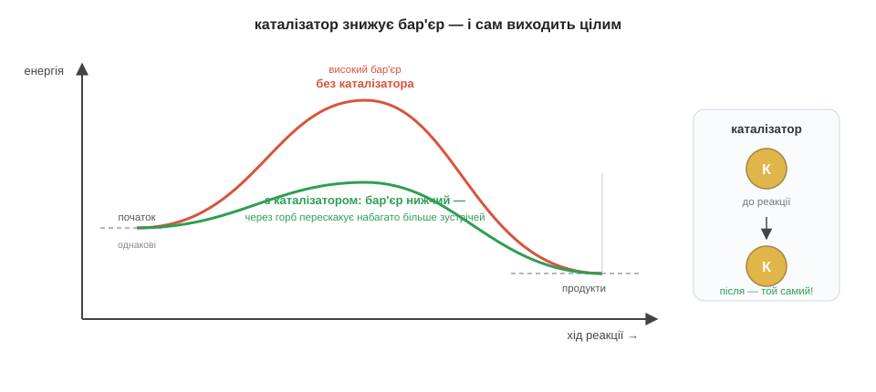
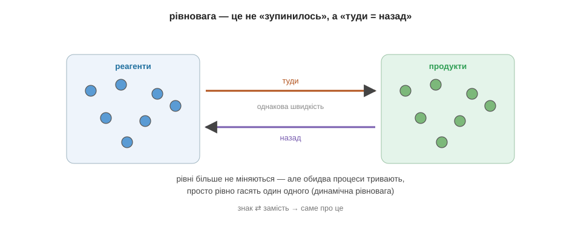
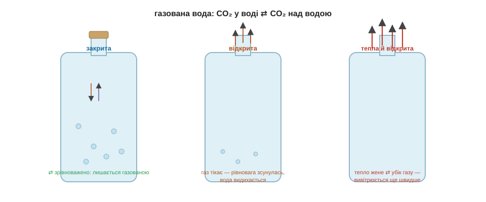

# Розділ 3.3 — Швидкість і рівновага

Ми знаємо, що реакції відбуваються і чому віддають енергію. Останнє питання модуля — про темп: чому одне перетворення летить за мить, а інше тягнеться роками, і чому деякі реакції ніколи не доходять до кінця, а спиняються десь посередині.

## 3.3.1 Що прискорює реакцію

Молоко в холодильнику стоїть тиждень, а на столі скисає за день. Реакція та сама — то чому надворі вона біжить, а на холоді ледь повзе? Щоб керувати швидкістю, треба спершу побачити, від чого вона взагалі залежить.

Згадаймо, що таке реакція: атоми міняють партнерів, а для цього молекули мусять спершу **зустрітися** — зіткнутися. І не просто торкнутися, а вдаритися досить сильно, щоб подолати бар'єр активації з минулого розділу. Слабкий дотик нічого не дасть: молекули відскочать одна від одної цілими. Отже, швидкість реакції — це, по суті, частота **вдалих зіткнень**: скільки разів за секунду молекули б'ються одна об одну досить сильно, щоб перебудуватися. Усе, що частішає чи посилює ці удари, реакцію пришвидшує. Звідси три прості важелі.

Перший — **температура**. Гарячіше означає, що молекули рухаються швидше: вони і стикаються частіше, і б'ються сильніше, тож через бар'єр перескакує набагато більше зустрічей. Ось і розгадка молока: холодильник не спиняє скисання, а лише вповільнює його — на холоді зустрічі рідші й млявіші. На цьому стоїть уся кухонна логіка зберігання: морозилка майже зупиняє реакції псування, тепла кухня їх розганяє.

Другий важіль — **подрібнення**. Якщо одна з речовин тверда, реакція може йти лише на її поверхні — усередині грудки молекули замкнені й ні з ким не зустрічаються. Розітри грудку на порошок — і вся захована маса раптом опиняється на поверхні, відкрита для зіткнень. Тому цукор-пісок розчиняється в чаї швидше за грудку рафінаду, а дрібно посічені дрова займаються легше за колоду.

Третій — **концентрація**: наскільки густо напхані реагуючі молекули. Що їх більше в тому самому об'ємі, то частіше вони натикаються одна на одну. Тому в чистому кисні все горить набагато бурхливіше, ніж у звичайному повітрі, де кисню лише п'ята частина, а решта — байдужий азот, що тільки заважає зустрічам.

Три важелі — а механізм у них один: усі вони про частоту вдалих зіткнень. Та є ще один спосіб розігнати реакцію, найхитріший, — він не чіпає ні тепла, ні густоти, а просто **знижує сам бар'єр**. Це наступна тема.

*Рис. 3.3.1-1. Тепліше — удари частіші й сильніші; дрібніше — більша поверхня зустрічі; густіше — більше зіткнень за мить. Усі три важелі збільшують частоту вдалих зіткнень.*

> 🏠 Холодильник і морозилка — це сповільнювачі хімії: вони не вбивають реакції псування, а лише роблять зустрічі молекул рідшими.

> 💡 **Одним реченням.** Реакція йде через вдалі зіткнення молекул, тому її пришвидшує все, що робить ці удари частішими чи сильнішими: вища температура, дрібніше подрібнення й більша концентрація.

## 3.3.2 Каталізатори

Кинь шматочок сирої картоплі в аптечний перекис водню — і він раптом скипить білою піною. Картопля не нагрілася, нічого не підпалили, концентрацію не міняли — жоден важіль з минулої теми не зачеплено. А реакція все одно полетіла. Що ж сталося?

Перекис водню (H₂O₂) — речовина нестійка: вона й сама поволі розпадається на воду й кисень. «Поволі» — бо бар'єр активації в неї високий, мало зіткнень його долають, і пляшечка в аптечці стоїть місяцями. Картопля цей бар'єр **обнизила**. У ній є особлива речовина, що відкриває реакції легший шлях — через нижчий горб. А ми пам'ятаємо: нижчий бар'єр долає набагато більше молекул, тож розпад, який тягнувся б роками, відбувається за секунди. Бульбашки піни — це той самий кисень, лише випущений умить.

Речовину, що знижує бар'єр і тим розганяє реакцію, звуть **каталізатором**. Найдивовижніша її риса — вона з реакції виходить **цілою**. Каталізатор не витрачається й не входить до продуктів: він лише підставляє молекулам зручнішу стежку через горб, а сам після кожного акту лишається таким, як був, і знову береться до роботи. Тому крихітної дрібки каталізатора вистачає, щоб переробити гори речовини. Це не четвертий «важіль» того самого типу — попередні три частішали зіткнення, а каждий знижує сам бар'єр.

Найважливіші каталізатори світу працюють у тобі. Реакції, з яких складається життя, самі по собі надто повільні — без допомоги їжа перетравлювалася б роками. Тіло розганяє їх власними каталізаторами, **ферментами**: вже слина починає розщеплювати крохмаль, а в шлунку ферменти беруться за білки. Та сама картопляна піна — робота ферменту каталази, який живі клітини тримають, щоб знешкоджувати отруйний для них перекис. Працюють каталізатори й у техніці: у вихлопній трубі авто стоїть пристрій, де каталізатор дочищає отруйні гази, перетворюючи їх на безпечніші, — і теж виходить із кожної реакції незмінним.

*Рис. 3.3.2-1. Початок і кінець реакції ті самі — каталізатор лише прокладає шлях через нижчий бар'єр, тож через горб перескакує більше молекул; сам каталізатор виходить незмінним.*

> 🧪 **Спробуй сам.** Налий у склянку трохи аптечного перекису водню (3 %) і кинь туди шматочок сирої картоплі або кусник сирого м'яса. За мить почнеться шипіння й піна — це фермент каталаза розганяє розпад перекису, випускаючи бульбашки кисню. Вкинь для порівняння варену картоплю: піни майже не буде, бо варіння зруйнувало фермент. ⚠️ Бери лише аптечний 3-відсотковий перекис, не лий його на ранки заради досліду і не нахиляйся над склянкою впритул.

> 💡 **Одним реченням.** Каталізатор розганяє реакцію, прокладаючи їй шлях через нижчий бар'єр, і сам при цьому не витрачається, — так працюють ферменти в тілі й очисник у вихлопі авто.

## 3.3.3 Реакції туди й назад

Відкрита пляшка газованої води з часом «видихається» — стає несмачною й пласкою. А закрита може стояти місяцями й лишатися шипучою. Сама вода нікуди не дівається — зникає лише газ. Куди він тікає з відкритої пляшки і чому сидить у закритій?

Досі ми мовчки вважали, що реакція йде в один бік: реагенти перетворюються на продукти, стрілка дивиться вправо, і на цьому все. Та насправді багато реакцій **оборотні** — здатні йти і назад. Розчинений у воді вуглекислий газ (CO₂) виходить із води в повітря — це «туди». Але той самий газ із повітря над водою розчиняється назад — це «назад». Обидва напрямки тривають одночасно, і записують це подвійною стрілкою: CO₂ у воді ⇄ CO₂ над водою.

Тепер — головна ідея теми, і вона тонша, ніж здається. У закритій пляшці газу нікуди тікати: він збирається над водою, і дедалі більше його розчиняється назад. У якийсь момент швидкість виходу і швидкість повернення **зрівнюються** — скільки молекул за секунду вилітає, стільки ж і вертається. Настає **рівновага**. І ось пастка для інтуїції: рівновага — це не «все зупинилося». Обидва процеси киплять собі далі на повну, просто рівно гасять один одного, тож зовні нічого не змінюється — вода лишається газованою. Це називають **динамічною рівновагою**: спокій назовні, безперервний рух усередині. Знак ⇄ саме про це.

Що ж тоді робить відкрита пляшка? Вона ламає рівновагу. Газ, який вилетів, тепер не збирається над водою, а йде в кімнату й більше не вертається. «Назад» майже зникає, лишається тільки «туди» — і вода поволі віддає весь свій газ, аж поки не стане пласкою. А підігрій її — і вивітриться ще швидше: тепло, як ми знаємо з першої теми розділу, розганяє рух молекул і жене їх із води дужче. Тому холодна газована вода довше тримає бульбашки, а тепла «здувається» миттю. Прибери одну зі стрілок або підштовхни систему — і рівновага зсувається; на цьому стоїть половина хімічної промисловості, але це вже сюжет для великої книги.

*Рис. 3.3.3-1. У рівновазі обидва напрямки йдуть з однаковою швидкістю й рівно гасять один одного — рівні не міняються, та рух не спиняється.*

*Рис. 3.3.3-2. У закритій пляшці CO₂ у рівновазі — вода лишається газованою; відкрита випускає газ і вода видихається, а тепло жене газ із води ще швидше.*

> 🏠 Хочеш зберегти газовану воду шипучою — тримай пляшку закритою і в холоді: так рівновага лишається на боці розчиненого газу.

> 💡 **Одним реченням.** Багато реакцій оборотні, і коли швидкості «туди» й «назад» зрівнюються, настає динамічна рівновага — зовні незмінна, та всередині обидва процеси тривають, а зрушити її можна, прибравши продукт чи змінивши температуру.

> 💡 **Що про це скаже великий підручник.** Наше «туди = назад» там назвуть хімічною рівновагою, а правило, куди вона зсувається, коли систему чіпають, — принципом Ле Шательє. Швидкість реакцій виросте в окрему науку — хімічну кінетику; шукай також «оборотні й необоротні реакції».

> ▶️ Далі: [Розділ 4.1 — Вода і розчини](../../m4-inorganic/r1-solutions/r1-solutions.md)
