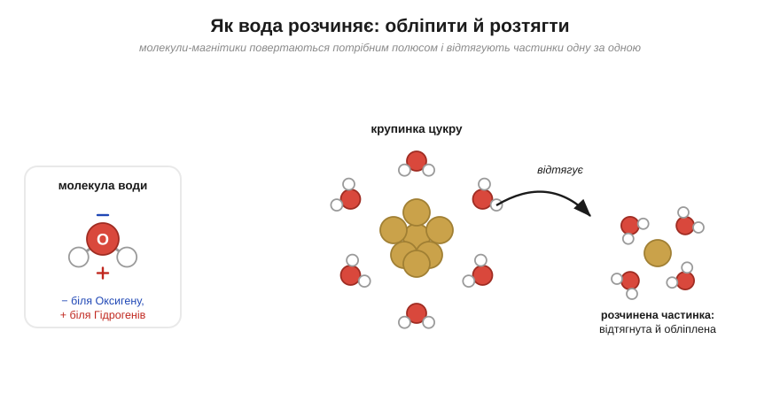
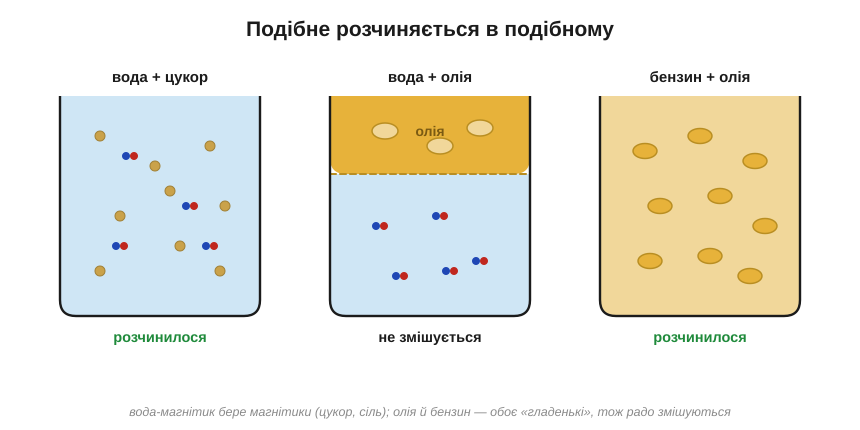
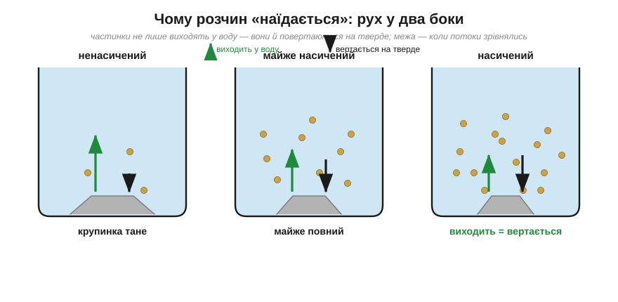
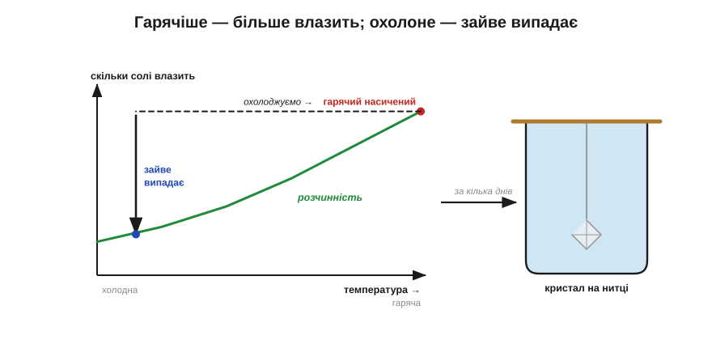
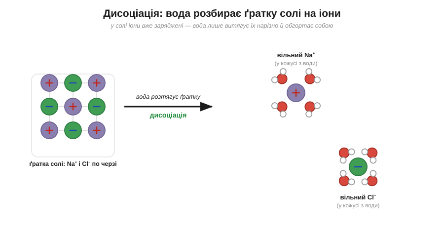
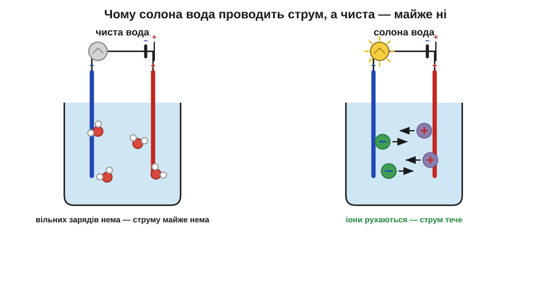

# Розділ 4.1 — Вода і розчини

Вода розчиняє більше різних речовин, ніж будь-яка інша рідина на Землі, — недарма її називають універсальним розчинником. Саме через це в склянці чаю солодко, у морі солоно, а кров і соки всередині нас — це здебільшого вода з розчиненим у ній вантажем поживних речовин. Цей модуль увесь побудований навколо води й того, що в ній відбувається, а перший розділ відповідає на найпростіше з вигляду питання: що насправді коїться, коли щось «зникає» у воді? Спершу розберемо саме розчинення, тоді з'ясуємо, скільки речовини вода здатна в себе вмістити, і нарешті побачимо, як розчинене може розпастися на заряджені частинки й повести електричний струм.

## 4.1.1 Чому вода розчиняє

Почнімо з двох ложок і однієї склянки. Ложка цукру в гарячому чаї зникає за якусь хвилину — розмішав, і його наче не було. А ложка олії поводиться зовсім інакше: збовтаєш її з водою, відвернешся на мить — і вона вже знову зібралася блискучими плямами зверху, не бажаючи мати з водою нічого спільного. Вода та сама, ложка та сама, а доля двох речовин геть різна. Що ж вода робить із цукром — і чому навідріз відмовляється робити те саме з олією?

Щоб відповісти, пригадаймо, якою вода вийшла з нашої розмови про хімічний зв'язок. Там ми побачили, що спільні електрони в молекулі води перетягнуті ближче до Оксигену, а тому один край молекули виходить трішки мінусовим, а два краї з атомами Гідрогену — трішки плюсовими. Таку молекулу із зарядженими кінцями ми назвали полярною й домовилися уявляти її крихітним магнітиком, що має плюсовий і мінусовий бік. Так от, уся дивовижна вдача води починається саме звідси, з цього магнітика, — і зараз ми побачимо, як він працює.

Уяви крупинку цукру, кинуту у воду. З усіх боків її одразу обступають молекули води й повертаються до неї потрібним боком: туди, де на крупинці трапляється трохи плюсового заряду, тягнуться мінусові кінці водяних молекул, а до мінусових місць — плюсові. І цей натовп магнітиків, учепившись за крайні молекули цукру, починає відтягувати їх одну за одною від решти крупинки — у воду, де кожну відтягнуту молекулу тут-таки знову обліплюють з усіх боків. Власне, оце й є розчинення: **розчин** — це коли чужі частинки розтягнуті поодинці й заховані поміж молекулами води. Образ натовпу, що по одному розбирає купу, тут майже точний — з однією поправкою: самі молекули цукру при цьому не ламаються, вони лишаються цілими, просто тепер розведені водою нарізно.

*Рис. 4.1.1-1. Молекули води обліплюють крупинку з усіх боків, повертаючись до неї потрібним полюсом, і відтягують її частинки поодинці в розчин.*

Чому ж той самий фокус не виходить з олією? А тому, що магнітикам води нема за що вхопитися. Молекули олії гладенькі, без плюсових і мінусових кінців, — водяному магнітику нема куди до них причепитися й нема за що потягнути. Ба більше: самим молекулам води куди вигідніше триматися одна за одну своїми магнітиками, ніж пускати поміж себе байдужу, незаряджену олію. Тож вони змикаються щільніше й просто витискають олію геть, а та збирається краплями зверху. Звідси й давнє хімічне правило, яке тепер для нас не загадкове закляття, а зрозумілий наслідок: **подібне розчиняється в подібному**. Вода-магнітик радо приймає до себе таких самих магнітиків — цукор, сіль, соду; а гладеньку олію не приймає.

І ось що цікаво: та сама олія, яка так зневажає воду, чудово розчиняється, скажімо, в бензині. А все тому, що бензин теж «гладенький», без зарядів на кінцях молекул, — свій до свого. Тобто правило працює в обидва боки: магнітики розчиняють магнітики, гладеньке розчиняє гладеньке, а між цими двома таборами пролягає межа, об яку й розбивається будь-яка спроба змішати воду з олією. Спробуй тепер передбачити сам: краплю меду й грудочку вершкового масла кинули в воду — що з них вода розчинить, а що ні?.. Мед солодкий, він із тих самих «магнітиків», що й цукор, — вода його прийме; а масло жирне, гладеньке, як олія, — вода його відштовхне, і воно спливе.

*Рис. 4.1.1-2. «Подібне до подібного»: вода-магнітик розчиняє цукор, але не олію; зате олія легко змішується з таким самим «гладеньким» бензином.*

> 🏠 Ось чому пляму від солодкого чи солоного на одязі легко змити водою, а жирну — годі: щоб упоратися з жиром, потрібен засіб, який, подібно до бензину, дружить із гладенькими молекулами.

## 4.1.2 Скільки влізе

Тепер інший дослід, не менш буденний. Сиплеш цукор у холодний чай ложку за ложкою, старанно мішаєш — і в якусь мить помічаєш, що він перестав зникати: лягає на дно купкою, і скільки не три ложкою, більше не розчиняється. Вода ніби наїлася. Але звідки в неї взагалі береться ця межа — і чи можна сказати наперед, скільки саме туди влізе?

Щоб це зрозуміти, повернімося до картинки з минулої теми, але додамо до неї те, на що ми тоді не зважали. Вода обліплює крупинку й відтягує її частинки в розчин — це ми вже бачили. Та є й зворотний рух. Частинки, які вже плавають у воді, не стоять на місці: вони безперервно товчуться, снують туди-сюди — і час від часу якась із них натикається на тверду крупинку, що ще не розчинилася, та й прилипає до неї назад. Виходить, насправді рух іде в два боки одночасно: одні частинки виходять із крупинки у воду, а інші тієї ж миті повертаються з води на тверде.

Поки розчинених частинок у воді мало, тих, що виходять, виявляється куди більше, ніж тих, що вертаються, — і крупинка на очах тане. Але що більше частинок накопичується у воді, то частіше хтось із них натикається назад на тверде. І настає мить, коли два потоки точно зрівнюються: за кожну частинку, що вийшла в воду, рівно одна повертається на крупинку. Зовні здається, що все спинилося й цукор просто «не розчиняється», — але насправді це той самий жвавий рух у два боки, який лише виглядає спокоєм. Якщо тобі це нагадало динамічну рівновагу з газованою водою з попереднього модуля — то це вона і є, та сама ідея, лише тепер між твердим і розчиненим. Такий розчин, у якому потоки зрівнялися й більше речовини він уже не прийме, називають **насиченим**. А те, скільки взагалі чого розчинено у воді, називають **концентрацією**: одна ложка солі у склянці й та сама ложка в цілому відрі дадуть, звісно, геть різну солоність.

Цю межу насичення, однак, можна зрушити — найпростіше нагріванням. У гарячій воді молекули рухаються швидше й б'ють по крупинці сильніше, а тому встигають відірвати від неї більше частинок, перш ніж настане та сама рівновага потоків. Тому **розчинність** — те, скільки речовини здатне вміститися у воді, — для більшості речовин помітно росте з температурою. Спробуй передбачити наслідок: жменя цукру, яка в холодному чаї вперто лежала б на дні, у гарячому…? Саме так — розчиниться без сліду, бо гаряча вода вміщує куди більше.

А тепер найкрасивіше, що випливає з цього само собою. Приготуй насичений розчин у гарячій воді — наклади в неї речовини стільки, скільки гаряча здатна втримати, — а тоді дай їй спокійно охолонути. Холодна вода вміщує вже менше, ніж гаряча, а в ній плаває рівно стільки, скільки набралося, поки вона була гарячою. Зайве просто не може лишатися розчиненим — і воно поволі виходить із розчину, наростаючи рівними шарами на будь-яку зачіпку, що трапиться під рукою. Саме так, шар за шаром, і росте справжній кристал.

*Рис. 4.1.2-1. Доки виходить більше, ніж вертається, крупинка тане; коли потоки зрівнялися — розчин насичений, хоча рух не спинився ні на мить.*

*Рис. 4.1.2-2. Гарячіше — влазить більше; а коли гарячий насичений розчин холоне, зайва сіль виходить із нього й наростає кристалом.*

> 🧪 **Спробуй сам.** У склянці найгарячішої води з-під крана розчини якомога більше солі — мішай, аж поки вона перестане зникати. До олівця прив'яжи нитку з маленьким ґудзиком на кінці, опусти її в розчин і поклади олівець на край склянки так, щоб нитка висіла у воді, не торкаючись дна. За кілька днів вода охолоне й трохи випарується, а зайва сіль осідатиме просто на нитку — і виросте справжній кубічний кристал. ⚠️ Дуже гаряча вода обпікає, тож бери лише з-під крана, а не окріп; і постав склянку там, де її ніхто не перекине й не вип'є.

> 🏠 Ось чому варення варять гарячим: у кип'ятку розчиняється стільки цукру, скільки в холодній воді не втрималося б нізащо, — а охолонувши, густий сироп саме тому й тримається.

## 4.1.3 Іони в розчині

Зробімо ще один простий дослід, цього разу з лампочкою. Занур у склянку чистої води два дроти від лампочки з батарейкою — і лампа мовчатиме, не світиться. А тепер кинь у воду дрібку звичайної солі, розмішай — і лампа спалахне. Сіль розчинилася, з очей зникла, наче й не було, — а звідкись узявся струм. Що ж така собі сіль принесла у воду, чого там доти бракувало?

Щоб розгадати це, порівняймо сіль із цукром. Цукор, як ми бачили, розчиняється цілими молекулами: вода обліплює крупинку й відтягує його молекули неушкодженими. Із сіллю все інакше — і причина в тому, з чого вона взагалі зроблена. Згадаймо розмову про зв'язки: сіль — це не молекули. У ній один атом колись віддав електрон іншому, і відтоді Натрій існує як **іон** Na⁺ (відпустив електрон — лишився з зайвим плюсом), а Хлор — як іон Cl⁻ (забрав той електрон — дістав зайвий мінус). Ці заряджені «цеглинки» стоять у солі рівними рядами, припасовані плюс до мінуса, утворюючи ту саму суцільну ґратку, про яку ми говорили, розбираючи будову твердих речовин. Тобто заряди в солі є завжди — просто в сухій солі вони намертво замкнені кожен на своєму місці й нікуди рухатися не можуть.

А тепер пускаємо до цієї ґратки воду. Молекули-магнітики обступають її край і починають тягнути кожну цеглинку до себе: своїми мінусовими, оксигеновими кінцями вони чіпляються за плюсовий Na⁺, а плюсовими, водневими — за мінусовий Cl⁻. Іон за іоном вода висмикує з рядів ґратки й обгортає кожен власним кожухом із водяних молекул. Ґратка поступово розсипається, і ось уже по воді плавають не шматочки солі, а окремі заряджені іони, кожен сам по собі, оточений своїм почтом магнітиків. Цей розпад іонної речовини на окремі іони під дією води називають **дисоціацією**. Ось у чому головна відмінність від цукру: цукор поплив цілими нейтральними молекулами, а сіль розійшлася водою нарізно, окремими зарядженими частинками.

*Рис. 4.1.3-1. Магнітики води витягують із ґратки кожен іон окремо й обгортають його: Na⁺ — оксигеновим боком молекул, Cl⁻ — водневим.*

І тепер нарешті прояснюється загадка з лампою. Струм — це, по суті, рух заряду з місця на місце. Спитай себе: чому ж тоді чиста вода, у якій повно полярних молекул-магнітиків, струму майже не проводить?.. А тому, що ті магнітики хоч і мають заряджені кінці, та самі по собі лишаються цілими й нейтральними — вільного заряду, який міг би відірватися й кудись побігти, у чистій воді просто немає. Зовсім інша річ — солона вода: вона повна вільних, ні до чого не прив'язаних іонів. Варто під'єднати батарейку, як плюсові іони Na⁺ потягнуться до мінусового дроту, а мінусові Cl⁻ — до плюсового; заряд рушив крізь рідину в обидва боки, і лампа загорілася. Тобто струм у склянці проводить не сама вода, а розпущені в ній іони — без них вода майже німа.

*Рис. 4.1.3-2. У чистій воді рухати нема чого — лампа темна; у солоній іони пливуть до протилежних дротів, і струм тече.*

Звідси випливає одна дуже важлива й цілком життєва пересторога. Водопровідна вода — це зовсім не чиста вода: у ній завжди розчинені якісь солі, а отже, вона проводить струм досить добре, щоб мокрими руками братися за розетку чи прилад під напругою було смертельно небезпечно. (І одне слово про написання: у шкільних підручниках цей самий «іон» нерідко пишуть «йон» — це те саме поняття, тож не лякайся розбіжності.)

> 📜 Уперше сказав це вголос швед Сванте Арреніус у своїй докторській дисертації 1884 року: солі, мовляв, у воді розпадаються на заряджені іони, і саме ці вільні іони й несуть струм. Поважна комісія слухала його з великою недовірою — ну як це міцна тверда сіль сама собою розсипається в простій воді на якісь заряди? — і оцінила роботу найнижчим прохідним балом, ледь не завернувши молодого автора. Та згодом виявилося, що саме ця ідея — ключ до всієї хімії розчинів. Через дев'ятнадцять років, 1903-го, тому самому Арреніусові за ту саму теорію дисоціації присудили Нобелівську премію з хімії. Часом «слабка» відповідь на захисті насправді виявляється відповіддю, до якої екзаменатори ще просто не доросли.

> 🏠 Ось чому електрика й вода — смертельно небезпечна пара: струм несуть розчинені у звичайній воді солі, а не сама вода.

> ▶️ Далі: [Розділ 4.2 — Кислоти й основи](../r2-acids-bases/r2-acids-bases.md)
