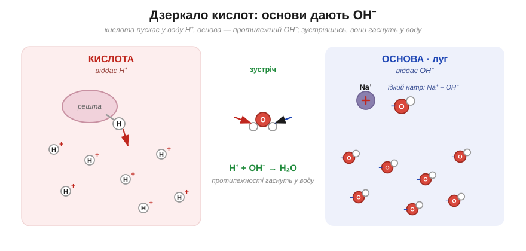
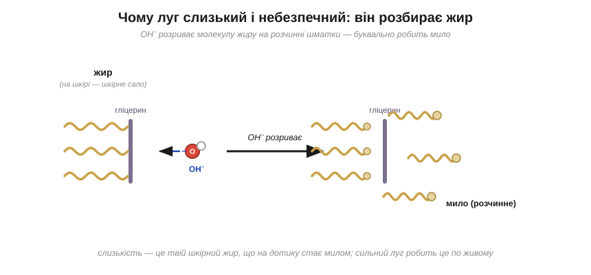
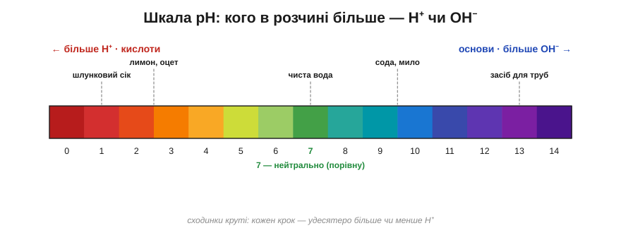
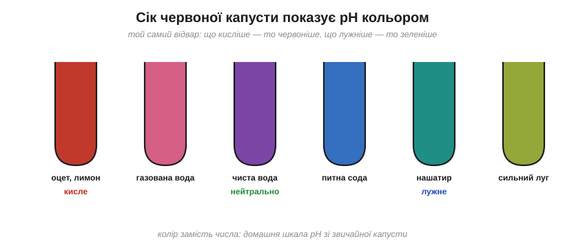

# Розділ 4.2 — Кислоти й основи

Кислоти й основи — це два протилежні табори, на яких тримається мало не половина всієї хімії: від смаку лимона й травлення в шлунку до мила, соди й засобів проти накипу. Слова звучать грізно, по-лабораторному, а за ними ховається проста й на диво симетрична картина. У цьому розділі ми побачимо, що всі кислоти на світі ховають один спільний секрет, основи — рівно дзеркальний до нього, а ту вічну боротьбу між ними, виявляється, можна зважити одним-єдиним числом на шкалі від 0 до 14.

## 4.2.1 Кислоти: спільний секрет

Лимон, оцет, кисле молоко, шлунковий сік — на смак усі вони однакові: різкі, кислі, аж вилиці зводить. Продукти ж бо геть різні, а відчуття чомусь те саме. Що в них усіх спільного — і, дивна річ, чому той самий смак, який лоскоче язик, ще й роз'їдає метал?

Увесь секрет — в одній-єдиній крихітній частинці. Пригадаймо, що у воді речовини розпадаються на іони, як ми бачили на прикладі солі. Так от, кислоти — це ціла родина речовин, яку об'єднує одне: у воді кожна з них відпускає на волю ту саму частинку — іон Гідрогену **H⁺**. А H⁺ — це, по суті, голий протон: атом Гідрогену, що загубив свій єдиний електрон, і лишилося від нього саме ядро з зарядом «плюс». Самі молекули різних кислот несхожі між собою: в оцті це оцтова кислота, у лимоні — лимонна, у шлунку — хлоридна. Але в кожній з них є той Гідроген, який у воді зривається з молекули й пускається плавати окремо. Тож найкоротше означення звучить так: **кислота — це постачальник вільного H⁺**.

*Рис. 4.2.1-1. Молекули кислот несхожі, а у воду кожна пускає однаковий H⁺ — голий протон; саме спільний H⁺ і робить їх усі кислотами.*

А коли зрозумієш, що головна дійова особа одна, то й увесь різноманітний характер кислоти виявляється витівками того самого H⁺. На язику він діє на ті клітини, що чують кисле, — тому всі кислоти й кислять на один копил. У метал H⁺ впивається й видирає з його атомів електрони: метал від цього поволі розчиняється, а звільнені атоми Гідрогену зчіплюються по двоє й тікають геть бульбашками водню — ось чому й кажуть, що кислота «їсть» цвях. А капни тією ж кислотою на соду — і H⁺ вибиває з неї вуглекислий газ, аж вона скипає піною. Три зовсім різні на вигляд фокуси — а виконавець один і той самий.

Чому ж тоді шлункова кислота роз'їдає, а лимонна лише приємно кисла, хоч обидві — кислоти? Бо сила кислоти — це зовсім не про смак і навіть не про те, скільки її налили, а лише про одне: наскільки охоче молекула віддає свій H⁺. **Сильна** кислота розщедрюється майже на весь свій Гідроген — і у воді аж кишить вільними H⁺. **Слабка** ж притримує його при собі, відпускаючи тільки дещицю, — тому й діє куди м'якше. Лимонна й оцтова — слабкі; а те, що залите в автомобільний акумулятор чи виділяється в шлунку, — сильні. Спробуй застосувати це сам: маємо дві кислоти, одна з содою скипає бурхливою піною, друга ледь-ледь шипить — котра з них сильніша?.. Звісно, перша: раз вона дає більше газу, значить, відпустила у воду більше H⁺, а отже, охочіша віддавати — тобто сильніша.

*Рис. 4.2.1-2. Сильна кислота віддала майже всі H⁺, слабка — лише дрібку; різниця не в кількості налитого, а в охоті віддавати.*

З цього, до речі, випливає й цілком серйозна осторога. Куштувати «на кислинку» можна тільки добре знайому їжу. Незнайома рідина, що пахне кисло, легко може виявитися не лимонним соком, а їдкою сильною кислотою, яка зробить твоєму язику те саме, що щойно робила цвяхові.

> 🏠 Кислота в шлунку — це справжня хлоридна кислота, і досить сильна: вона розщеплює їжу й убиває проковтнутих мікробів, а сам шлунок боронить від неї зсередини шар захисного слизу.

## 4.2.2 Основи: протилежний табір

Тепер інша буденна загадка. Потри між пальцями розчин соди або просто мильну воду — і пальці стануть слизькі, наче намащені, хоча жодного масла на них немає. А тепер уяви ту саму слизькість, але вже від засобу для прочищання труб: там вона означає смертельну небезпеку для шкіри. Звідки ж береться це слизьке відчуття — і чому воно буває то цілком безпечним, то роз'їдливим?

Якщо кислота, як ми щойно з'ясували, — це постачальник H⁺, то основа виявляється її точним дзеркалом. **Основа** у воді відпускає протилежну частинку — іон **OH⁻**, який називають гідроксидом: це пара з атомів Оксигену й Гідрогену, що має зайвий електрон, а тому заряджена «мінусом». Звідки він береться, найкраще видно на прикладах. Їдкий натр, він же каустична сода, — це просто Na⁺ і OH⁻, складені разом, тож у воді він сипле гідроксидом жменями. Харчова та кальцинована сода роблять те саме, тільки значно лагідніше. А нашатир — розчин аміаку — добуває OH⁻ хитрішим способом: видирає H⁺ у самих молекул води, а те, що від води лишається, і є OH⁻. Будь-яку основу, що розчиняється у воді, називають **лугом**.

*Рис. 4.2.2-1. Основа — дзеркало кислоти: замість H⁺ вона пускає у воду OH⁻; а коли ці двоє зустрічаються, вони складаються у звичайну воду.*

Тепер про ту слизькість — бо це і є OH⁻ у дії, і механізм тут гарний. Гідроксид-іон накидається на жир і розриває його великі молекули на дрібніші, вже розчинні шматки — тобто буквально перетворює жир на мило. А коли луг торкається шкіри, він починає робити те саме з твоїм власним шкірним салом: оте слизьке відчуття на пальцях — це і є твій же жир, що просто на дотику перетворюється на мило. У слабкого лугу, як-от мило чи сода, це відбувається ледь-ледь і цілком безпечно. А сильний луг робить це швидко й по-живому, беручись роз'їдати вже й саму шкіру під салом, — ось чому з ним поводяться обережно, як із вогнем.

*Рис. 4.2.2-2. OH⁻ розриває молекулу жиру на розчинні шматки — робить мило; на шкірі цим «милом» стає твій власний жир, тому сильний луг небезпечний.*

Складімо тепер обидва табори поруч, і проступить гарна симетрія: кислота кисла на смак і пускає у воду H⁺, а основа слизька на дотик і пускає OH⁻. І ось найголовніше, що зв'яже весь розділ: ці двоє — точні протилежності. Спробуй угадати, що станеться, коли вільний H⁺ зустріне у воді вільний OH⁻?.. Вони складаються докупи — плюс до мінуса — і дають звичайнісіньку воду, H₂O, гаснучи одне в одному. На цьому взаємознищенні й тримається вся боротьба кислот та основ. А як цю боротьбу зважити числом — побачимо вже в наступній темі.

> 🏠 Ось чому мило й сода так добре відмивають жирне: луг розбиває жирну плівку на розчинні шматочки — те саме, від чого він слизький на пальцях, у раковині працює вже на нашу користь.

## 4.2.3 pH та індикатори

Отже, кислота сипле у воду H⁺, основа — OH⁻, і ці двоє гасять одне одного у воду. Лишається природне питання: а хто кого переважає в якомусь конкретному розчині — кислота чи основа, H⁺ чи OH⁻? Усю цю боротьбу хіміки навчилися вміщати в одне-єдине число на шкалі від 0 до 14, і зветься воно **pH**.

Щоб зрозуміти цю шкалу, почнімо з найчистішої води. Виявляється, навіть у ній деякі молекули раз у раз самі собою розпадаються на H⁺ та OH⁻ — і в чистій воді тих і тих утворюється рівно порівну. Це і є середина шкали, **pH = 7**, стан нейтральний, коли жоден табір не переважає. Капни у воду кислоти — вільних H⁺ стане більше, ніж OH⁻, і число поповзе вниз, нижче сімки. Додай лугу — більшає OH⁻, і число лізе вгору, вище сімки. Тобто pH — це наче табло рахунку в боротьбі двох таборів: усе, що ліворуч від сімки (від 0 до 6), — володіння кислот, а все, що праворуч (від 8 до 14), — володіння основ. Тільки сходинки на цій шкалі не рівномірні, а дуже круті: кожен крок означає вдесятеро більше або менше H⁺. Тому розчин із pH 2 не «трохи» кисліший за розчин із pH 5, а в тисячу разів — три сходинки, по десять разів кожна.

*Рис. 4.2.3-1. pH — це табло боротьби H⁺ та OH⁻: 0–6 кисле, 7 нейтральне, 8–14 лужне; і кожна сходинка — удесятеро.*

Та як же прочитати це число, не маючи під рукою приладу? Саме для цього існує **індикатор** — речовина-хамелеон, що міняє свій колір залежно від того, хто в розчині переважає. Хитрість його проста й гарна: сам індикатор — це слабка кислота, тож його молекула з причепленим H⁺ має один колір, а та сама молекула, яка свій H⁺ уже віддала, — інший. А оскільки віддасть вона H⁺ чи ні, залежить від того, кисло навколо чи лужно, то й колір прямо показує, чого в розчині більше. Саме так працюють і шкільний лакмусовий папірець, і покупні смужки для виміру pH, і — що найприємніше — звичайнісінька червона капуста.

Барвник червоної капусти — це справжній природний індикатор: у кислоті він червоніє, у нейтральному середовищі лишається фіолетовим, а в лузі синіє й навіть зеленіє. Тобто звичайна склянка капустяного відвару — це готовий домашній вимірювач pH, який показує кислотність не числом, а кольором.

*Рис. 4.2.3-2. Один і той самий відвар капусти показує кислоту червоним, нейтральне — фіолетовим, луг — синім і зеленим: колір замість числа.*

> 🧪 **Спробуй сам.** Подрібни жменю червоної капусти, залий гарячою водою з-під крана й лиши на десять хвилин — вода стане фіолетово-синьою. Це і є твій індикатор. Розлий його по склянках і додавай у різні: у лимонний сік чи оцет — порожевіє й почервоніє (отже, кисле); у розчин харчової соди — посиніє чи позеленіє (отже, лужне); а в чистій воді лишиться фіолетовим. Маєш готову домашню шкалу pH. ⚠️ Це не напій — після досліду відвар виливають; і гарячу воду бери з-під крана, а не окріп.

> 📜 Данець Сьорен Сьоренсен придумав pH у 1909 році не в університеті, а в лабораторії пивоварні Carlsberg у Копенгагені. Він керував там хімією й бився над якістю пива, а воно дуже залежить від кислотності: ферменти й дріжджі працюють лише у вузькому її проміжку. Щоб не виписувати щоразу громіздкі числа концентрації H⁺, Сьоренсен згорнув їх в одну зручну коротку позначку — «водневий показник», pH. І сьогодні цим числом, народженим заради доброго пива, міряють геть усе: від ґрунту й крові до шампуню.

> 🏠 Напис «pH-нейтральний» на шампуні означає число близько 5,5 — приблизно таке, як у здорової шкіри; а наша кров тримає pH майже точно 7,4, і навіть невелике відхилення від нього вже небезпечне для життя.

> ▶️ Далі: [Розділ 4.3 — Оксиди, солі та карта неорганіки](../r3-salt-families/r3-salt-families.md)
