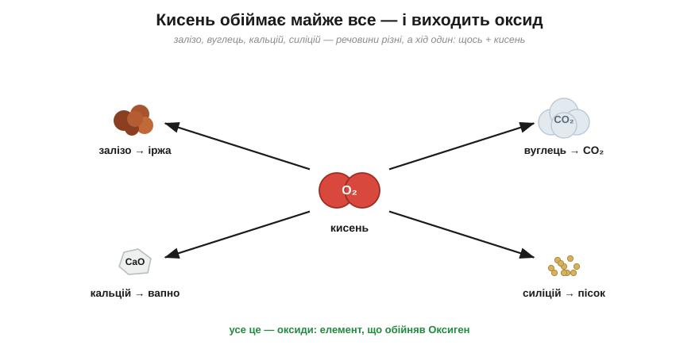
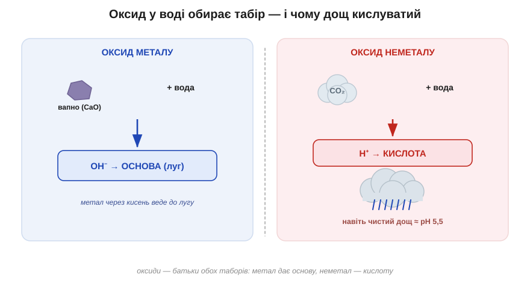
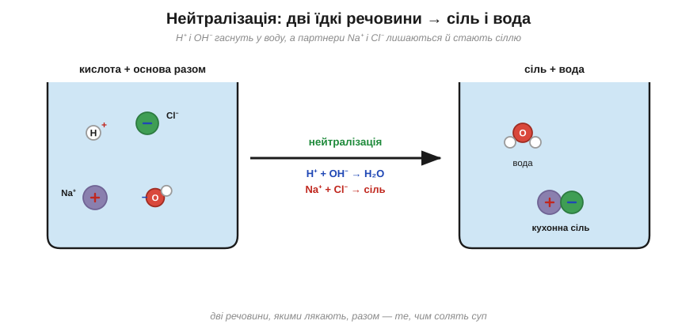
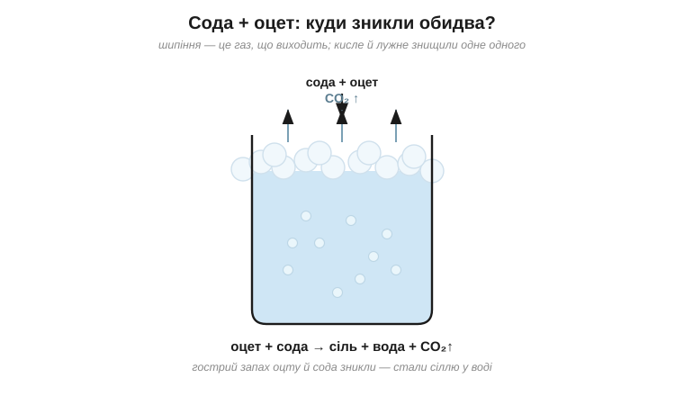

# Розділ 4.3 — Оксиди, солі та карта неорганіки

Досі ми розбирали кислоти й основи нарізно, як два окремі табори. У цьому розділі вони нарешті зустрінуться, поб'ються, помиряться — і з тієї зустрічі народяться солі, найчисленніша рідня всього неорганічного світу. Почнемо ми, однак, із того, звідки самі кислоти й основи беруться, — а беруться вони з оксидів. Тоді подивимося, що дає зустріч двох таборів, а наприкінці складемо все вивчене в одну невелику карту, якою прочитуються будь-які страшні на вигляд шкільні «ланцюжки перетворень».

## 4.3.1 Оксиди: все, що обнялося з киснем

Поглянь на чотири геть різні речі: руду луску іржі на старому цвяху, бульбашки газу в шипучій воді, біле вапно на стіні старого будинку й тверді крупинки піску на пляжі. Що, здавалося б, може бути спільного між рудою лускою, невидимим газом, білим порошком і твердими піщинками? А спільне в них — один і той самий хід, що стоїть за кожним: щось ухопило кисень.

Корінь цього — у вдачі Оксигену, з якою ми познайомилися ще біля періодичної таблиці: Оксиген один із найжадібніших до електронів елементів. Саме тому його проста речовина, кисень, тільки й шукає, з ким би з'єднатися, і обіймає мало не все, що трапиться на шляху. А те, що виходить із такого обійму, називають **оксидом** — це елемент, сполучений з Оксигеном. Тепер придивися до тих чотирьох речей знову, уже озброєним оком: іржа — це залізо, що з'єдналося з Оксигеном; вуглекислий газ — це вуглець із Оксигеном; вапно — кальцій із Оксигеном; пісок — силіцій із Оксигеном. На вигляд вони різняться до невпізнання, а сімейство в них одне.

*Рис. 4.3.1-1. Залізо, вуглець, кальцій, силіцій — речовини різні, а хід один: кожне сполучається з Оксигеном і дає оксид.*

Та найцікавіше починається, коли оксид потрапляє у воду, — і тут на сцену знову виходять два табори з попереднього розділу. Виявляється, оксид сам обирає, до якого з них пристати, і вибір цей напрочуд послідовний. **Оксиди металів** — та сама іржа чи вапно — у воді дають **основи**: вони народжують у ній OH⁻. А **оксиди неметалів** — вуглекислий газ, оксиди сірки — дають у воді **кислоти**: пускають у неї H⁺. Тобто оксиди — це, по суті, батьки обох таборів: метал через кисень веде до лугу, а неметал через кисень — до кислоти. Спробуй застосувати це сам: маємо оксид кальцію (а кальцій — метал) і оксид сірки (а сірка — неметал). Який із них, потрапивши у воду, дасть основу, а який — кислоту?.. Кальцій метал, тож його оксид дасть основу; сірка неметал — її оксид дасть кислоту.

*Рис. 4.3.1-2. Оксид металу з водою дає основу (OH⁻), оксид неметалу — кислоту (H⁺); тому й дощ, повний розчиненого CO₂, виходить кислуватим.*

Звідси випливає проста, але несподівана річ: ідеально нейтрального дощу в природі не буває. У повітрі завжди є вуглекислий газ — а це оксид неметалу; кожна краплина, падаючи крізь повітря, розчиняє його дрібку й сама стає через це слабенькою кислотою. Тому навіть найчистіший лісовий дощ трохи кислуватий, десь pH 5–6. А коли люди додають у повітря ще й оксиди сірки та Нітрогену з заводських димарів та автомобільних вихлопів, дощ кисліє вже по-справжньому й починає шкодити — оце і є горезвісні «кислотні дощі».

> 🏠 Вапном здавна білять стіни й «гасять» кислий ґрунт на городі: оксид кальцію з водою дає луг, а той з'їдає зайву кислоту в землі.

## 4.3.2 Солі й нейтралізація

Налий оцту на ложку соди — і вони скажено зашиплять, аж піна полізе через край склянки. А коли все стихне, придивися: у склянці немає вже ні гострого запаху оцту, ні білої соди. Двоє їдких речовин кудись поділися. Куди ж?

Розгадка прямо випливає з головного висновку про два табори. Щойно кислотний H⁺ зустрічає лужний OH⁻, ці дві точні протилежності складаються у звичайнісіньку воду й гаснуть одне в одному. Саме це й сталося в склянці, і зветься воно **нейтралізацією**: кисле й лужне знищують одне в одному рівно те, що робило кожне з них їдким. Сильна кислота після цього вже не кисла, луг уже не слизький — у склянці лишається спокійна нейтральна вода.

Але придивімося уважніше, бо кожен із двох прийшов на зустріч не сам. Кислота — це ж не лише H⁺, а й його негативний «хвіст»: у хлоридної кислоти таким хвостом є Cl⁻. І основа — це не лише OH⁻, а й позитивний партнер при ньому: у їдкого натру це Na⁺. Тож коли H⁺ і OH⁻ пішли собі у воду, хвіст і партнер лишилися самі — а позитивний іон поряд із негативним і є **сіль**. І ось найкрасивіший приклад цього: люта хлоридна кислота плюс їдкий натр дають разом… звичайну кухонну сіль і воду. Дві речовини, якими в лабораторії лякають, з'єднавшись, перетворюються на те, чим ми щодня солимо суп. Спробуй угадати наперед, що ж лишилося в тій склянці після того, як сода з оцтом відшипіли своє?.. Солона вода: газ вийшов бульбашками, їдкість обопільно згасла, а від двох речовин лишилася розчинена у воді сіль.

*Рис. 4.3.2-1. H⁺ і OH⁻ гаснуть у воду, а їхні партнери Na⁺ і Cl⁻ лишаються поряд і стають сіллю: з хлоридної кислоти й їдкого натру виходять кухонна сіль і вода.*

І тут варто наголосити: слово «сіль» у хімії означає геть не лише ту, що в сільничці. Це ціле велике сімейство речовин на той самий лад — «позитивний іон та негативний іон разом». Накип у чайнику, біла крейда на дошці, морська сіль, харчова сода — усе це солі, залишки давніх зустрічей кислот і основ (а трохи й зустрічей металів з оксидами, але повну карту цих родинних зв'язків ми складемо вже в наступній темі). Накип і крейда — це взагалі та сама сіль, лише в дещо різному вигляді.

*Рис. 4.3.2-2. Шипіння соди з оцтом — це газ, що виходить; а гострий оцет і сода нейтралізують одне одного, лишаючи солону воду.*

> 🧪 **Спробуй сам.** Насип у склянку ложку харчової соди й лий потроху столовий оцет. Зашипить і спіниться — це виходить вуглекислий газ. Коли все стихне, обережно понюхай: гострий дух оцту зник. Кисле й лужне знищили одне одного, лишивши по собі трохи солоної води й газ, що вивітрився. ⚠️ Постав склянку в раковину, бо піна лізе через край, і не нахиляйся над нею обличчям.

> 🏠 Оцтом відмивають накип у чайнику саме тому: накип — це сіль, а кислота розчиняє його назад, з тим самим знайомим шипінням газу.

## 4.3.3 Карта неорганіки

У школі дітей часто лякають «ланцюжками перетворень»: кальцій → оксид → гідроксид → сіль — низка стрілок із формулами, яку нібито треба визубрити підряд. Та насправді зубрити там нема чого. Усі ці ланцюжки — то просто прогулянки однією маленькою картою, і зараз ми складемо її з того, що вже й так знаємо.

Уся неорганіка ділиться на два знайомі нам табори. Ліворуч розташуймо метали, праворуч — неметали, і кожен бік будується однаково, дзеркально до іншого. Візьми метал і дай йому кисень — вийде **оксид**; додай тому оксидові води — дістанеш **основу**. А тепер повтори те саме праворуч: візьми неметал, дай йому кисень — вийде оксид; додай води — дістанеш **кислоту**. Дві однакові сходинки, «плюс кисень», а тоді «плюс вода», просто пройдені з різних боків.

*Рис. 4.3.3-1. Ліві сходи (метал → оксид → основа) і праві (неметал → оксид → кислота) спускаються до спільного нижнього поверху — солі.*

А внизу обидві сходи сходяться на одному поверсі. Бо коли кислота з правого боку зустрічає основу з лівого, вони, як ми щойно бачили, нейтралізуються — і дають **сіль**. Сіль — це те місце, де світ металів тисне руку світові неметалів. Ось і вся карта: двоє дзеркальних сходів, що збігаються внизу на солі.

А найкраще в цій карті те, що кожна стрілка на ній — це реакція, яку ти вже розумієш. «Плюс кисень» — це горіння елемента в оксид. «Плюс вода» — це коли оксид стає основою чи кислотою. «Кислота плюс основа» — це нейтралізація в сіль. Тому страшний шкільний ланцюжок «кальцій → вапно → гашене вапно → сіль» — насправді не загадка, а просто спуск лівими сходами, крок за кроком. Спробуй прочитати так само правий ланцюжок: сірка → ? → ? → сіль. Якими сходами він іде і що на кожному кроці?.. Правими: сірка плюс кисень дає її оксид, оксид плюс вода — кислоту, а кислота плюс якась основа — сіль. Карта, звісно, дещо спрощує — деякі оксиди хитрі й уміють поводитися на обидва боки, — але кістяк саме такий, і з ним будь-який «ланцюжок» читається вже не як список для зубріння, а як зрозумілий маршрут.

*Рис. 4.3.3-2. Той самий набір кроків лівими чи правими сходами: «ланцюжок перетворень» — це просто маршрут, а не список для зубріння.*

> 🏠 Тепер шкільне завдання «здійсни перетворення» читається зовсім інакше: не «пригадай потрібні формули», а «знайди на карті, з якої клітинки в яку треба йти».

> ▶️ Далі: [Розділ 4.4 — Метали й елементи навколо нас](../r4-metals-elements/r4-metals-elements.md)
