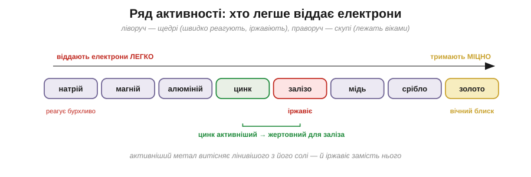
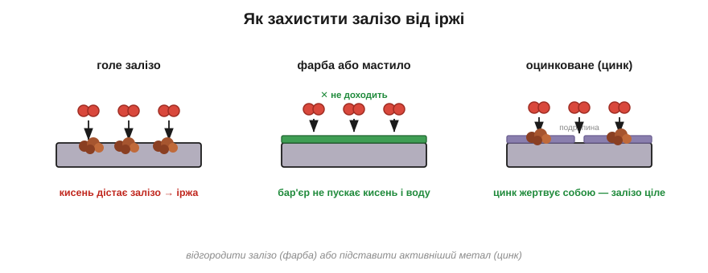
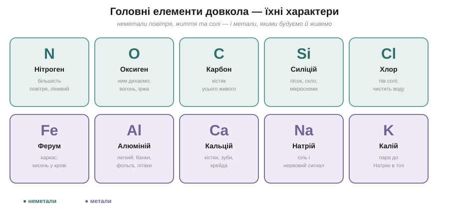

# Розділ 4.4 — Метали й елементи навколо нас

Карту неорганіки ми вже склали — лишилося пройтися нею і ближче познайомитися з її мешканцями. Цей розділ, останній у модулі, складається з двох прогулянок. Спершу розберемося із самими металами: чому одні з них здаються майже вічними, а інші тлінні, і як уберегти ті, що тлінні. А тоді зробимо коротку екскурсію найголовнішими елементами довкола нас — тими, з якими ти стикаєшся щодня, навіть не думаючи про хімію.

## 4.4.1 Ряд активності й іржа

Уяви дві картини поруч. Золоту каблучку дістають з кургану, якому тисячі років, — а вона сяє, наче щойно з майстерні. А залізний цвях, забутий восени у дворі, за одне-єдине літо обертається на руду потерть, що кришиться в пальцях. Повітря над ними те саме, час однаково невблаганний — а доля протилежна. Чому ж один метал стоїть майже вічно, а інший наче сам рветься розпастися?

Уся річ упирається в головний хист металів, з яким ми познайомилися ще в розмові про зв'язки, — їхню готовність віддавати зовнішні електрони. Тільки роблять це різні метали з дуже різною охотою. І якщо вишикувати метали саме за цією охотою, від найщедрішого до найскупішого, дістанемо страшенно корисний список, який називають **рядом активності**. Ліворуч у ньому стоять щедрі метали — натрій, магній, цинк, залізо, — що віддають електрони легко й охоче. Праворуч — скупі: мідь, срібло, золото, що тримаються за свої електрони міцно. Тепер обидві наші картини стають зрозумілі. Золото стоїть скраю праворуч і віддає електрони так неохоче, що майже ні з чим не реагує, — звідси його вічний незатьмарений блиск. А залізо стоїть ліворуч, розлучається з електронами радо, тут-таки хапається за кисень повітря — і береться іржею.

*Рис. 4.4.1-1. Ліворуч метали віддають електрони легко (активні, швидко іржавіють), праворуч — тримають міцно (благородні, лежать віками); цинк стоїть лівіше за залізо.*

Але цей ряд — не просто перелік, він іще й передбачає, хто кого здолає. Активніший метал здатен витіснити лінивішого з його ж власної солі. Пригадай дослід, що вже траплявся нам мимохідь: кинутий у синій розчин мідної солі залізний цвях укривається рудою міддю. Тепер ми бачимо його наскрізь: залізо стоїть у ряду лівіше за мідь, тобто щедріше, тож воно віддає електрони іонам міді — ті перетворюються на справжню мідь і осідають на цвяху, а саме залізо натомість іде в розчин. Щедрий метал посунув скупого й сів на його місце. Отже, дивлячись на ряд активності, можна наперед сказати, який метал котрого витіснить із розчину.

А тепер найкорисніше — про саму іржу й порятунок від неї. Іржавіння, як ми вже розуміємо, — це залізо, що віддає електрони кисню й волозі, обертаючись на крихкий бурий оксид. Спинити цей процес можна двома різними шляхами. Простий — поставити **бар'єр**: шар фарби чи мастила просто не пускає до заліза кисень і воду, а без них реагувати нема з чим. Хитріший спосіб — покрити залізо **цинком**, який у ряду активності стоїть лівіше, тобто є активнішим за залізо. Тоді кисень, шукаючи, з ким реагувати, береться спершу за активніший цинк — той жертвує собою, а залізо під ним лишається цілим навіть там, де покриття подряпане. Такий цинк і називають **жертовним металом**.

*Рис. 4.4.1-2. Голе залізо іржавіє; фарба ставить бар'єр від кисню й води; а цинк зверху активніший за залізо, тому жертвує собою й береже залізо навіть у подряпині.*

Перевір, чи вловив ти ідею жертовного металу. Залізне відро вкрили цинком, а сусіднє — оловом (а олово в ряду активності стоїть, навпаки, правіше за залізо, тобто менш активне). В обох покриття випадково подряпали до голого заліза. Котре відро довше встоїть проти іржі?.. Оцинковане: цинк активніший, тож у подряпині він жертовно іржавіє замість заліза. А на олов'яному, навпаки, у подряпині радше іржавітиме саме залізо, бо воно активніше за олово, — і дірка піде швидше.

> 🏠 Тому оцинковане відро чи цвях служать роками навіть із подряпинами — цинк іржавіє замість заліза; а ось консервна бляшанка, лужена оловом, від глибокої подряпини починає іржавіти навіть швидше, ніж голе залізо.

## 4.4.2 Екскурсія елементами

Уся ця книжка крутилася навколо кількох десятків елементів, та в щоденному житті ти насправді маєш справу лише з жменею головних. Тож познайомимося з ними наостанок — не як із рядками в таблиці властивостей, а як із живими характерами, пройшовшись просто там, де кожен із них живе.

Почнімо з повітря, яким дихаємо. Майже чотири його п'ятих — це азот, проста речовина елемента **Нітрогену**: спокійний відлюдник, що майже ні з чим не хоче реагувати, — і саме завдяки його байдужості повітря не спалахує від першої-ліпшої іскри. А та життєдайна п'ята частина, що лишається, — це кисень, проста речовина **Оксигену**, вже добре нам знайомого жадібного до електронів трударя, яким ми дихаємо і який живить кожне багаття й кожну іржу. Тепер озирнімося на все живе довкола — і в його основі знайдемо **Карбон** (його прості речовини — це графіт, алмаз і сажа). Це єдиний елемент, здатний будувати з себе нескінченні ланцюги, а тому саме на ньому тримається кожна молекула життя; він такий важливий, що йому віддано весь наступний модуль, тут ми лише вітаємося.

Опустимо тепер погляд під ноги. Камінь, пісок і скло — це здебільшого **Силіцій**, зчеплений з Оксигеном; і той самий Силіцій, очищений до блиску, став серцем мікросхем у твоєму телефоні. А те, чим ми будуємо, — це передусім **Ферум**, тобто залізо: дешевий силач, із якого зведено каркаси будинків і мостів, а заразом і носій кисню в нашій крові. Поруч із ним — **Алюміній**, легкий метал бляшанок, фольги та літаків, якого повно у звичайнісінькій глині під ногами.

Зазирнімо насамкінець усередину себе. Кістки й зуби тримає **Кальцій** — і він же та сама крейда й вапно зі стін. А **Натрій** із **Калієм** — це солона пара, на якій біжить кожен нервовий сигнал і б'ється серце. До речі, спробуй пояснити сам, чому ці двоє поводяться так схоже, що їх і ставлять поряд?.. Бо вони стоять в одному стовпчику періодичної таблиці, а отже, мають однакову зовнішню поличку — той самий один електрон, готовий до віддачі; саме спільна зовнішня поличка й робить їх близькою ріднею. І останній у нашій галереї — **Хлор**, друга половинка кухонної солі. Як проста речовина це отруйний зеленкуватий газ; але як спокійний іон у крові, у морі чи у воді басейну він цілком мирний і навіть знезаражує воду.

*Рис. 4.4.2-1. Десяток найважливіших елементів побуту й тіла: неметали повітря, життя та солі — і метали, якими будуємо й живемо.*

На цьому завершується великий модуль про воду, розчини й неорганічний світ — і варто окинути оком усе, що ми в ньому здобули. Ми побачили, як вода-магнітик розчиняє те, за що може вхопитися, і чому є межа насичення; як розчинені іони ведуть струм; розгадали спільні секрети кислот і основ та зважили їх на шкалі pH; простежили, звідки беруться оксиди й солі, і склали всю неорганіку в одну карту; і нарешті розібралися, чому одні метали вічні, а інші тлінні, та познайомилися з головними елементами довкола. Тепер завіса піднімається над одним-єдиним елементом — Карбоном — і починається окрема велика вистава, хімія живого, органічна хімія.

*Рис. 4.4.2-2. Ті самі характери на карті-таблиці: Натрій і Калій стоять в одному стовпчику — тому й поводяться схоже.*

> 💡 **Що про це скаже великий підручник.** Наш «ряд активності» там називають електрохімічним рядом напруг металів, а саме повільне руйнування металів киснем і вологою — корозією, і їй присвячують окремі параграфи. Уся ця друга половина книги — про воду, кислоти, основи, солі й елементи — там зветься неорганічною хімією; шукай у ній великі розділи «Метали» й «Неметали», а в них окремі параграфи про кожен елемент — Оксиген, Нітроген, Карбон, Ферум — з їхніми валентностями й реакціями.

> ▶️ Далі: [Розділ 5.1 — Карбон і його ланцюги](../../m5-organic/r1-carbon/r1-carbon.md)
