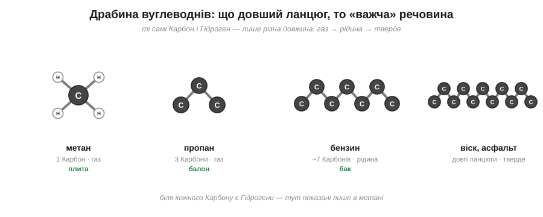
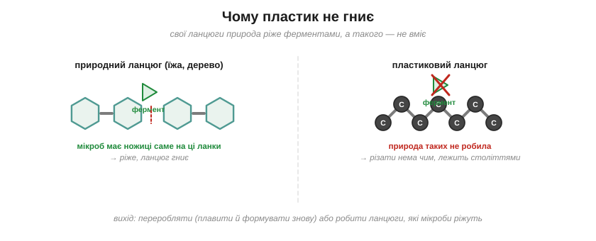

# Розділ 5.1 — Карбон і його ланцюги

Уся попередня хімія була про безліч різних елементів — сотню характерів, що віддають, забирають і міняються електронами. Останній модуль улаштований навпаки: він майже про один-єдиний елемент. Бо мільйони речовин і живої, і рукотворної природи — деревина, бензин, пластик, цукор, ліки, та й ти сам — збудовані переважно на самому Карбоні. Як таке взагалі можливо: щоб з одного елемента вийшло стільки всього несхожого? Цей розділ — знайомство з Карбоном-будівничим: чому він уміє те, чого не вміє більше ніхто, що виходить з його ланцюгів і звідки береться така незліченна кількість його сполук.

## 5.1.1 Чому Карбон особливий

Озирнися ще раз довкола, тепер уже прицільно. Деревина столу, пластик ручки, бензин у баку машини, цукор у чаї, ліки в аптечці — і ти сам — усе це збудовано здебільшого з одного елемента, Карбону. Як один-єдиний сорт атомів примудряється давати і тверду деревину, і рідке пальне, і живу клітину? Розгадка — у двох його особливостях, і почнімо з рук.

Пригадаймо образ валентності, ту кількість «рук», якими атом чіпляється за сусідів. У Карбону цих рук рівно чотири, і всі вони міцні. Саме по собі це вже чимало — чотирма руками можна вхопити аж чотирьох партнерів водночас. Але справжня сила Карбону криється не в самому числі рук, бо чотирирукі атоми є й серед інших елементів. Головне — його рідкісний хист: Карбон однаково радо подає руку **іншому Карбону**. Більшість елементів так не вміють — зчепляться між собою по двоє, ну по троє, та й по всьому. А карбонові атоми беруться за руки практично без кінця: вони вишиковуються в довжелезні ланцюги, пускають із них бічні відгалуження, замикаються в кільця — і при цьому в кожного ще лишаються вільні руки, щоб причепити Гідроген чи якісь інші атоми. Виходить, що з одного-єдиного сорту цеглинок можна збудувати каркаси геть будь-якої форми й довжини.

*Рис. 5.1.1-1. Чотири руки Карбону плюс уміння братися за інший Карбон дають каркаси будь-якої форми: ланцюг, розгалуження, кільце.*

Щоб відчути, наскільки це рідкісний дар, спробуй уявити на місці Карбону, скажімо, Оксиген. У Оксигену рук лише дві — то чи побудуєш ти з нього довгий ланцюг?.. Ні, далеко не зайдеш: маючи дві руки, атом може хіба вхопити сусіда з одного боку й ще одного з другого — вийде коротка низка, що швидко обірветься. А чотири руки Карбону, та ще й охота братися за свого ж брата, — це саме те поєднання, якого більше ні в кого немає, і саме воно відмикає нескінченність.

А з тієї нескінченності форм випливає й уся незліченність органіки. Карбонові скелети бувають якої завгодно довжини й вигляду, а на них іще навішуються різні «прикраси» з інших атомів — тож сполук Карбону наука знає вже мільйони, більше, ніж усіх інших речовин на світі разом узятих. Цей величезний світ і називають **органічною хімією** — хімією сполук Карбону. А «органічною» вона зветься тому, що все живе збудоване саме так, на карбонових скелетах: колись люди гадали, що творити такі речовини здатне лише живе, лише сама природа.

*Рис. 5.1.1-2. Більшість елементів зчіплюються між собою хіба по двоє; тільки Карбон тягне ланцюг без кінця — звідси й мільйони його сполук.*

> 📜 А перша штучна органічна фарба народилася з невдачі. У 1856 році вісімнадцятирічний лондонський студент Вільям Перкін на канікулах намагався добути зі смоли кам'яного вугілля ліки від малярії — хінін. Дослід геть провалився: у колбі лишилася якась чорна гидь. Та коли Перкін заходився відмивати її спиртом, розчин раптом засяяв яскравим бузковим кольором. Замість ліків у нього вийшов перший у світі штучний барвник, який назвали «мовеїном». Доти всі фарби добували з рослин та молюсків, і пурпуровий колір був недешевою розкішшю, — а тепер його можна було варити з відходів газових заводів. Юнак облишив навчання, узяв патент і збудував фабрику, а бузковий відтінок став модою, яку носила навіть королева. Так невдалий студентський дослід заснував цілу хімічну промисловість.

> 🏠 Майже все «неживе», що горить або тягнеться, — це теж органіка: свічка, поліетилен, гас, віск, гума — усі вони далекі родичі по Карбону.

## 5.1.2 Вуглеводні: паливо світу

Блакитний вогник на плиті, бензин у баку, червоний балон із газом, свічка на столі — придивившись, помічаєш дивну річ: світ щодня рухається й гріється, спалюючи майже одне й те саме. Що ж це за паливо, з якого зіткані й крихітний вогник сірника, і ревучий струмінь реактивного літака?

Це найпростіше, що взагалі можна зліпити з карбонових скелетів попередньої теми. Візьми ланцюжок із атомів Карбону й на кожну його вільну руку почепи по атому Гідрогену — і дістанеш **вуглеводень**, тобто молекулу лише з двох сортів атомів, Карбону й Гідрогену. Найкоротший із них — **метан**: один атом Карбону, що тримає чотири Гідрогени. Це і є природний газ, який горить у тебе на плиті.

А далі вибудовується проста драбинка за довжиною ланцюга — і, що цікаво, із самою лише довжиною змінюється весь характер речовини. Один Карбон — це метан, газ. Три Карбони в ланцюжку — це пропан, теж газ, але вже такий, що його легко стиснути в балон. Сім-вісім Карбонів поспіль — і перед нами вже не газ, а рідина, бензин; іще довші ланцюги дають гас; а зовсім довгі застигають уже твердими — це віск та асфальт. Речовина по суті та сама, з тих самих C і H, лиш ланцюг дедалі довшає — і вона помалу повзе з газу в рідину, а тоді й у тверде.

*Рис. 5.1.2-1. Ті самі Карбон і Гідроген: що довший ланцюг, то «важча» речовина — від газу метану до твердого воску.*

Тепер тонша, але важлива відмінність, яка нам ще знадобиться. Якщо кожна вільна рука Карбону тримає свій окремий Гідроген, молекулу називають **насиченою** — вона ніби повна, лінива, усі руки при ділі. Та буває й інакше: два сусідні Карбони хапаються один за одного одразу двома руками — це **подвійний зв'язок**, з яким ми мигцем стрічалися ще в розмові про валентність. Тоді Гідрогенів у молекулі стає менше, зате в неї з'являється мовби запасна, готова до дії рука: таку молекулу звуть **ненасиченою**. І ось чому це важливо: подвійний зв'язок здатен розкритися й приєднати до себе нові атоми. Спробуй здогадатися сам: котра з двох молекул охочіша вступати в реакції — насичена, де всі руки зайняті воднем, чи ненасичена із запасною рукою?.. Звісно, ненасичена: їй є чим хапати, тож вона радо приєднує нове, тоді як насичена поводиться спокійно й незворушно. Саме на цій охоті ненасичених приєднувати й виростуть пластики наступної теми.

*Рис. 5.1.2-2. У насиченій молекулі всі руки тримають водень; у ненасиченій два Карбони з'єднані подвійним зв'язком, готовим розкритися й приєднати нове.*

Та хоч би які різні були вуглеводні завдовжки й за насиченістю, головна робота в них одна — горіти. Кожна така молекула напхана зв'язками Карбон–Гідроген; зустрівши кисень, вони згоряють на вже знайомі нам вуглекислий газ та воду, вивільняючи при цьому купу тепла. Саме це тепло крутить двигуни машин, гріє наші домівки й варить їжу. Ось чому скромні на вигляд ланцюжки з C і H — це головне паливо всього світу.

> 🏠 Природний газ у трубі — це метан; у балоні й у запальничці — його трохи довші родичі пропан і бутан; а бензин та гас — це вже рідкі ланцюги, ще довші. Уся різниця між ними — лише в довжині ланцюга.

## 5.1.3 Полімери

Поліетиленовий пакет важить майже нічого, а спробуй розірвати його руками — не так і легко; а викинутий, він пролежить у землі сотні років, переживши кількох власників. Що ж це за дивна річ — водночас така легка, така міцна й немовби безсмертна?

Розгадка — у тій самій запасній руці ненасиченої молекули, у її подвійному зв'язку, готовому розкритися. Уяви повну посудину однаковісіньких маленьких молекул, у кожної з яких є такий подвійний зв'язок (це етилен, він же етен, — хай він буде нашою «намистиною»). А тепер дай цій посудині поштовх — і подвійний зв'язок у кожної намистини розкривається, її звільнена рука хапає сусідню намистину, та своєю вільною рукою — наступну, і так тисячі намистин зчіплюються одна за одну в один велетенський ланцюг. Маленьку молекулу-намистину називають **мономером**, а готовий довжелезний ланцюг-намисто — **полімером**.

Саме так і робиться пластик. Ланцюг, зшитий із тисяч таких розкритих етиленів, називають **поліетиленом** — з нього й зроблено той самий пакет; «полі» означає «багато», а «етилен» — то назва самої намистини. Ось, виявляється, навіщо взагалі був потрібен подвійний зв'язок: він — та защіпка, якою намистини хапаються одна за одну. Інші намистини дають інші пластики, але задум скрізь один і той самий.

*Рис. 5.1.3-1. Подвійний зв'язок кожного етилену розкривається, і намистини зчіплюються в один довгий ланцюг — поліетилен.*

А з цих довжелезних ланцюгів самі собою випливають усі дивовижі пакета. Довгі ланцюги сплутуються й чіпляються один за одного по всій своїй довжині — тому пластик і міцний, і водночас гнучкий. Збудований він із легких Карбону та Гідрогену — тому майже нічого не важить. А найголовніше ось у чому, і над цим варто спинитися. Спитай себе: чому ж дерев'яна паличка в землі за рік зотліє, а пластиковий пакет лежатиме століттями?.. Бо свої власні ланцюги — деревину, листя, рештки — природа вміє різати спеціальними ферментами, тими самими «ножицями», про які ми говорили, коли йшлося про каталізатори в тілі. А таких довжелезних карбонових ланцюгів, як у пластику, природа ніколи доти не робила — і в жодного мікроба просто немає ножиць потрібної форми, щоб їх розрізати. Тому пластик і не гниє: його нема кому з'їсти.

*Рис. 5.1.3-2. Свої ланцюги природа вміє різати ферментами, а довгий карбоновий ланцюг пластику — ні, тому він і не гниє.*

Та сама незнищенність, яка робить пластик таким зручним, обертається й бідою. Раз його ніхто не з'їсть, пластик не можна просто викидати — його треба переробляти: розплавити й сформувати наново. А хіміки вже вчаться будувати такі ланцюги, у яких є спеціальні «надрізи», що їх мікроби таки беруть, — щоб пакет майбутнього вмів сам зотліти, відслуживши своє.

> 🏠 Майже все, що ми звемо «пластиком», — це полімери: пакет і плівка (поліетилен), пляшка (інший подібний ланцюг), пінопласт, капрон у колготках; усі вони — довгі намиста, зшиті з дрібних однакових намистин.

> ▶️ Далі: [Розділ 5.2 — Кисень приєднується: спирти, кислоти, жири](../r2-oxygen-compounds/r2-oxygen-compounds.md)
